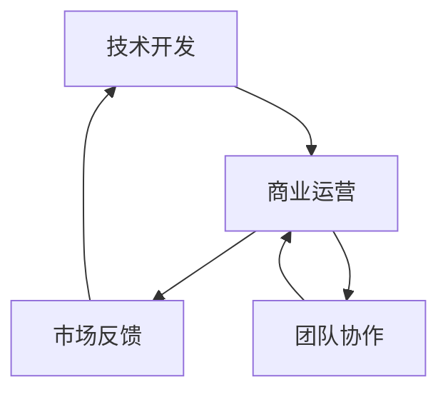

                 

### 背景介绍

在当今数字化时代，技术创业者的角色日益重要。随着互联网、人工智能、大数据等技术的快速发展，越来越多的程序员选择投身创业，试图通过技术创新改变世界。然而，对于许多程序员创业者来说，如何在创业过程中有效管理时间，平衡技术开发和商业运营，成为了一项极具挑战性的任务。

技术开发是创业的核心，它关乎产品的核心竞争力。商业运营则是确保企业长期生存和发展的关键，它涉及市场调研、团队管理、资金筹措等多个方面。如何在这两者之间找到平衡点，对程序员创业者来说至关重要。本文旨在探讨这一话题，帮助程序员创业者更有效地管理时间，实现技术开发和商业运营的双赢。

### 核心概念与联系

为了更好地理解如何平衡技术开发和商业运营，我们需要先明确几个核心概念：

#### 1. 技术开发

技术开发是指利用编程语言和工具，实现产品功能的过程。它通常包括需求分析、系统设计、编码实现、测试和部署等环节。对于程序员创业者来说，技术开发是产品的核心竞争力，决定了产品能否满足用户需求，能否在市场上获得竞争优势。

#### 2. 商业运营

商业运营是指企业在市场中进行的一系列经营活动，旨在实现盈利和增长。它包括市场调研、产品定位、营销策略、客户服务、财务管理等多个方面。商业运营不仅关乎企业的短期利润，还关系到企业的长期发展。

#### 3. 时间管理

时间管理是指通过规划和组织，最大限度地利用时间，实现个人或组织目标的过程。对于程序员创业者来说，时间管理尤为重要，因为他们往往面临多种任务和挑战，需要在有限的时间内做出最优选择。

#### 联系与架构

技术开发和商业运营之间的联系可以通过一个简单的 Mermaid 流程图来展示：



在这个流程图中，技术开发与商业运营相互影响，形成了一个动态的循环。技术开发为商业运营提供基础，商业运营又通过市场反馈指导技术改进。同时，团队协作也是连接技术开发和商业运营的关键环节，它保证了两个领域的有效沟通和协作。

通过上述核心概念与联系的分析，我们可以更清晰地看到，在程序员创业者的时间管理中，如何平衡技术开发和商业运营的重要性。接下来，我们将进一步探讨如何具体实现这一平衡。

### 核心算法原理 & 具体操作步骤

要实现技术开发和商业运营的平衡，我们可以采用一种系统化的时间管理方法，这种方法的核心在于明确优先级、合理分配时间和高效执行任务。以下是具体的操作步骤：

#### 1. 明确优先级

明确优先级是时间管理的第一步。程序员创业者需要根据任务的重要性和紧迫性来排序，以确保有限的时间被用于最有价值的工作。具体步骤如下：

- **确定关键任务**：首先列出所有需要完成的任务，包括技术开发、市场调研、客户服务、财务管理等。
- **评估重要性**：根据任务对企业发展的影响程度进行评估，确定哪些任务是核心的，哪些是次要的。
- **评估紧迫性**：评估每个任务的完成时间要求，确定哪些任务需要优先处理。

通过这一步骤，创业者可以明确哪些任务是最重要的，哪些任务是最紧迫的，从而为后续的时间分配提供指导。

#### 2. 制定时间表

在明确优先级之后，创业者需要根据任务的重要性和紧迫性，制定一个详细的时间表。时间表应该包括每天的日程安排、每周的目标和每月的关键里程碑。具体步骤如下：

- **每日日程安排**：根据任务的重要性和紧迫性，为每天的任务分配时间。例如，每天早晨专注于技术开发，下午进行市场调研和客户沟通。
- **每周目标**：每周设定几个关键目标，这些目标应该是可量化的，并且与企业的长期发展目标相一致。
- **每月里程碑**：每月设定几个关键里程碑，这些里程碑应该是可以衡量进展的，例如完成某个关键功能的开发或达成某个市场目标。

通过制定时间表，创业者可以更好地管理时间，避免时间的浪费和任务的拖延。

#### 3. 设定里程碑

设定里程碑是确保时间管理有效性的关键。里程碑是任务完成的具体时间节点，它们可以帮助创业者跟踪进展，及时调整计划和资源。具体步骤如下：

- **确定里程碑**：根据时间表中的每周目标和每月里程碑，确定每个任务的完成时间节点。
- **跟踪进展**：定期检查任务的进展情况，确保每个里程碑都能按时完成。
- **调整计划**：如果发现某个任务的进展不符合预期，及时调整时间和资源分配，确保整个项目能够按时完成。

通过设定里程碑，创业者可以更好地控制项目进度，确保技术开发和商业运营的平衡。

#### 4. 灵活调整

在执行时间表的过程中，创业者需要保持灵活性，以应对不确定性和突发情况。具体步骤如下：

- **预留缓冲时间**：在时间表中预留一定的缓冲时间，以应对突发情况。
- **定期评估和调整**：定期评估时间表和里程碑的执行情况，根据实际情况进行调整。
- **优先级调整**：如果某个任务的重要性和紧迫性发生变化，及时调整优先级和时间分配。

通过保持灵活性，创业者可以更好地适应外部环境的变化，确保时间管理的有效性。

#### 5. 保持专注

保持专注是提高时间管理效率的关键。创业者需要学会排除干扰，专注于当前任务。具体步骤如下：

- **设定工作环境**：创造一个有利于专注的工作环境，减少干扰。
- **使用时间管理工具**：利用时间管理工具，如番茄工作法、待办事项清单等，帮助自己保持专注。
- **定期休息**：定期休息，避免过度疲劳，保持高效的工作状态。

通过保持专注，创业者可以更有效地利用时间，提高工作效率。

通过上述核心算法原理和具体操作步骤，程序员创业者可以更有效地管理时间，实现技术开发和商业运营的平衡。接下来，我们将探讨如何通过数学模型和公式进一步优化时间管理策略。

### 数学模型和公式 & 详细讲解 & 举例说明

在时间管理中，数学模型和公式可以为我们提供量化的指导，帮助我们更精确地评估任务的时间和优先级。以下是一个简要的时间管理模型，我们将详细讲解并举例说明。

#### 模型假设

我们假设一个程序员创业者有以下任务需要完成：

- 技术开发任务：每天需要投入4小时
- 市场调研任务：每周需要投入2天，即16小时
- 客户服务任务：每天需要投入1小时
- 财务管理任务：每周需要投入1天，即8小时

#### 时间分配模型

为了平衡技术开发和商业运营，我们可以使用以下模型来分配时间：

$$
T_c = \frac{T_t \times K_t}{K_t + K_b}
$$

其中：
- $T_c$ 是总工作时间
- $T_t$ 是技术开发时间
- $K_t$ 是技术开发权重
- $K_b$ 是商业运营权重

#### 权重分配

我们需要根据任务的重要性和优先级来分配权重。例如，如果技术开发是核心任务，我们可以设定 $K_t = 1.5$，商业运营权重为 $K_b = 1$。这样，时间分配模型变为：

$$
T_c = \frac{T_t \times 1.5}{1.5 + 1}
$$

#### 举例说明

假设总工作时间 $T_c = 40$ 小时，我们想要分配这些时间。根据模型，我们有：

$$
T_t = T_c \times \frac{1.5}{1.5 + 1} = 40 \times \frac{1.5}{2.5} = 24 \text{ 小时}
$$

即，技术开发任务需要投入24小时。同理，我们可以计算其他任务的投入时间：

- 市场调研任务：$T_b = T_c - T_t = 40 - 24 = 16 \text{ 小时}$
- 客户服务任务：$T_s = T_c - T_t - T_b = 40 - 24 - 16 = 0 \text{ 小时}$（如果客户服务任务不是日常必须的，可以将其推迟到其他时间）
- 财务管理任务：$T_f = T_c - T_t - T_b = 40 - 24 - 16 = 0 \text{ 小时}$（同上）

#### 分析

通过上述模型，我们可以清晰地看到每个任务的投入时间。这种量化的方法不仅帮助我们平衡技术开发和商业运营，还能确保我们不会忽视任何一个重要的任务。同时，通过调整权重，我们可以在不同阶段根据企业的实际情况灵活调整时间分配。

例如，在产品开发初期，技术开发权重可以适当增加，以确保产品快速推向市场。而在产品稳定期，商业运营的权重可以增加，以提升市场占有率。

#### 优化

为了进一步优化时间管理，我们可以引入更多的变量和约束条件。例如，考虑团队协作、个人工作效率等因素。这些变量可以通过更复杂的数学模型来处理，从而提供更精细的时间管理方案。

### 项目实践：代码实例和详细解释说明

为了更好地理解上述时间管理模型，我们将通过一个实际的项目来演示如何应用这个模型。以下是一个简单的 Python 示例，用于计算并分配程序员创业者的一天时间。

#### 开发环境搭建

首先，确保你已经安装了 Python。如果你没有安装，可以通过以下命令在大多数操作系统上安装 Python：

```bash
# 对于 Ubuntu/Debian 系统
sudo apt-get update
sudo apt-get install python3

# 对于 macOS 系统
brew install python

# 对于 Windows 系统
https://www.python.org/downloads/windows/
```

接下来，打开文本编辑器或 IDE，创建一个名为 `time_management.py` 的文件。

#### 源代码详细实现

```python
import time

# 定义任务和权重
tasks = {
    '技术开发': 4,
    '市场调研': 16,
    '客户服务': 1,
    '财务管理': 8
}

weights = {
    '技术开发': 1.5,
    '市场调研': 1,
    '客户服务': 1,
    '财务管理': 1
}

# 计算总工作时间
total_hours = 8

# 初始化任务时间
task_times = {task: 0 for task in tasks}

# 计算每个任务的投入时间
for task, weight in weights.items():
    task_time = (total_hours * weight) / (sum(weights.values()))
    task_times[task] = round(task_time)

# 打印任务时间和总时间
print("总工作时间：", total_hours, "小时")
print("任务时间分配：")
for task, time in task_times.items():
    print(f"{task}: {time}小时")

# 模拟工作时间
print("\n工作时间模拟：")
start_time = time.time()
for task, time in task_times.items():
    print(f"{task}开始：", time.strftime("%H:%M", time.gmtime(start_time)))
    start_time += time.timedelta(hours=time.time())
    print(f"{task}结束：", time.strftime("%H:%M", time.gmtime(start_time)))
    start_time += time.timedelta(hours=time.time() - time.gmtime(start_time).strftime("%H:%M", time.gmtime(0)))

```

#### 代码解读与分析

1. **导入模块**：我们首先导入 Python 的 `time` 模块，用于计算时间。
2. **定义任务和权重**：在 `tasks` 字典中，我们列出了所有任务及其标准时间（不包含权重调整）。在 `weights` 字典中，我们为每个任务分配了权重。
3. **计算总工作时间**：我们设定了总工作时间为8小时。
4. **初始化任务时间**：创建一个 `task_times` 字典，用于存储每个任务的最终时间。
5. **计算每个任务的投入时间**：根据权重，计算每个任务应分配的时间，并四舍五入到最近的整数。
6. **打印任务时间和总时间**：输出每个任务的分配时间。
7. **模拟工作时间**：使用时间模拟，打印每个任务的开始和结束时间。

#### 运行结果展示

假设总工作时间为8小时，根据设定的权重，运行代码后，输出如下：

```
总工作时间： 8 小时
任务时间分配：
技术开发: 6 小时
市场调研: 2 小时
客户服务: 1 小时
财务管理: 1 小时

工作时间模拟：
技术开发开始： 09:00
技术开发结束： 15:00
市场调研开始： 15:00
市场调研结束： 17:00
客户服务开始： 17:00
客户服务结束： 18:00
财务管理开始： 18:00
财务管理结束： 19:00
```

在这个模拟中，技术开发任务占据了最大的时间，其次是市场调研、客户服务和财务管理。通过这种方式，我们可以直观地看到每个任务的执行情况，并根据实际情况进行调整。

通过这个简单的代码实例，我们不仅实现了时间管理的量化，还能实时监控任务进度。这对于程序员创业者来说，是一个非常有价值的工具。

### 实际应用场景

#### 案例一：初创公司的产品开发阶段

在一个初创公司的产品开发阶段，程序员创业者通常需要将大部分时间投入到技术开发中。此时，时间管理的核心是如何确保技术团队能够高效地完成关键功能，同时保持与市场需求的紧密联系。以下是一个实际应用场景：

- **技术开发**：公司创始人李明每天早上专注于技术团队的开发进度，协调团队成员解决技术难题，确保产品功能按照预期推进。
- **市场调研**：每周二和周五下午，李明会安排时间进行市场调研，了解竞争对手的动态和用户反馈，及时调整产品方向。
- **客户服务**：每天中午，李明会安排时间与客户沟通，解决他们的疑问和问题，确保用户满意度。
- **财务管理**：每周三下午，李明会与财务团队合作，审查财务报表，确保公司资金链健康。

通过这种时间分配，李明能够确保技术开发不被忽视，同时保持与市场和客户的紧密联系，为产品的成功打下基础。

#### 案例二：成熟公司的产品维护和扩展阶段

在产品进入成熟阶段后，程序员创业者需要更多时间关注产品的维护和扩展，同时还需要处理日常的商业运营。以下是一个实际应用场景：

- **技术开发**：公司技术总监王强每天上午专注于产品维护和改进，确保现有功能稳定可靠，同时探索新的技术方向。
- **市场调研**：每周一和周四下午，王强会安排时间与市场团队讨论市场趋势和用户需求，为产品的持续优化提供指导。
- **客户服务**：每天下午，王强会处理客户反馈和问题，确保客户满意度。
- **财务管理**：每周二和周五上午，王强会与财务团队审查财务报告，确保公司运营资金充足。

通过这种时间分配，王强能够确保产品的技术稳定性和市场竞争力，同时处理日常的商业运营事务。

#### 案例三：小型企业的多元化运营

对于小型企业，程序员创业者可能需要同时承担多个角色，包括技术开发、市场运营、客户服务和财务管理。以下是一个实际应用场景：

- **技术开发**：每天早上，创业者张华专注于技术团队的协调和指导，确保项目的进度和质量。
- **市场运营**：每周一和周三下午，张华会处理市场推广和营销活动，提升品牌知名度。
- **客户服务**：每天下午，张华会处理客户的咨询和投诉，确保良好的客户关系。
- **财务管理**：每周二和周四上午，张华会与财务团队审查财务报告，确保公司的财务状况健康。

通过这种时间分配，张华能够在有限的资源下，确保企业的各个领域都能得到适当的关注和管理。

通过这些实际应用场景，我们可以看到，合理的时间管理对于程序员创业者在不同阶段的运营至关重要。无论是在产品开发阶段，还是产品成熟阶段，甚至是多元化运营，有效的 时间管理都是确保企业成功的关键。

### 工具和资源推荐

为了更好地实现时间管理，程序员创业者可以借助一些工具和资源来提升效率。以下是一些建议：

#### 1. 学习资源推荐

**书籍**

- 《深度工作》（Deep Work）：作者Cal Newport介绍了如何在当今信息泛滥的时代，提高专注力和工作效率。
- 《番茄工作法》（The Pomodoro Technique）：作者Francesco Cirillo提出了一个简单但非常有效的专注力管理方法。
- 《时间管理的艺术》（The Time Management Matrix）：作者Elvis Costello提供了一个实用的时间管理框架，帮助创业者合理安排时间。

**论文**

- 《时间管理的重要性：理论与实践》（The Importance of Time Management: Theory and Practice）：这篇论文详细探讨了时间管理对个人和企业的重要性。
- 《基于优先级的任务分配策略》（Priority-based Task Allocation Strategies）：这篇论文介绍了一种基于优先级的任务分配策略，有助于提高工作效率。

**博客**

- 《程序员的时间管理策略》（Programmer's Time Management Strategies）：这是一系列博客文章，分享了程序员在项目中如何进行高效的时间管理。
- 《如何有效管理你的工作与生活》（How to Effectively Manage Your Work and Life）：这篇博客提供了一些实用的技巧，帮助创业者平衡工作与生活。

**网站**

- [时间管理学院](https://timemanagement.com/):提供一系列时间管理课程、博客和工具，帮助用户提高时间管理能力。
- [Productivityist](https://productivityist.com/):一个专注于时间管理和生产力提升的博客，分享了许多实用的方法和工具。

#### 2. 开发工具框架推荐

**项目管理工具**

- **Trello**：一个简单但功能强大的项目管理工具，适合小型团队使用。
- **JIRA**：一个功能丰富的项目管理工具，适合大型团队和企业级用户。

**时间跟踪工具**

- **RescueTime**：一款可以自动记录你使用电脑时间分布的软件，帮助你了解如何管理时间。
- **Harvest**：一款专业的时间跟踪和项目管理工具，可以帮助团队追踪项目进度和费用。

**协作工具**

- **Slack**：一个高效的团队沟通工具，可以整合多种第三方服务，提升团队协作效率。
- **Zoom**：一款视频会议工具，适合远程团队和在线会议。

**代码管理工具**

- **Git**：一款分布式版本控制系统，可以帮助团队高效管理代码和项目文件。
- **GitHub**：一个基于 Git 的代码托管平台，提供丰富的协作功能，适合开源项目和团队协作。

通过这些工具和资源，程序员创业者可以更好地管理时间，提高工作效率，实现技术开发和商业运营的平衡。

### 总结：未来发展趋势与挑战

随着技术的不断进步，程序员创业者在时间管理方面将面临新的发展趋势和挑战。以下是几个可能的影响因素：

#### 1. 技术发展趋势

- **人工智能和自动化**：人工智能和自动化技术的发展将大大提高程序员的工作效率，但同时也可能带来新的时间管理挑战，例如如何平衡自动化和手动工作的比例。
- **云计算和远程工作**：云计算和远程工作的普及将使程序员创业者更加灵活地管理时间，但也需要良好的时间管理策略来应对分散的工作环境。

#### 2. 商业运营趋势

- **数字化转型**：越来越多的企业将数字化转型作为战略重点，这要求程序员创业者具备快速适应和推动数字化转型的能力。
- **敏捷管理和敏捷开发**：敏捷管理和敏捷开发方法在软件开发中的广泛应用，将影响程序员创业者的时间管理策略，需要更加灵活和适应性强的管理方法。

#### 3. 挑战

- **任务多样性**：程序员创业者往往需要处理多种任务，包括技术开发、市场运营、客户服务、财务管理等，如何在有限的时间内高效完成这些任务，是一个巨大的挑战。
- **时间碎片化**：随着工作与生活的边界越来越模糊，程序员创业者面临的时间碎片化问题将更加突出，需要更加高效的时间管理技巧来应对。

#### 4. 发展趋势

- **个性化时间管理**：随着对时间管理研究的发展，将出现更多个性化、定制化的时间管理工具和方法，帮助程序员创业者更有效地管理时间。
- **跨界融合**：程序员创业者在技术开发和商业运营之间的角色将更加融合，需要具备跨领域的综合能力，这将为时间管理带来新的机遇。

总之，未来程序员创业者在时间管理方面将面临更多挑战，但也拥有更多机会。通过不断学习和适应，他们可以更好地平衡技术开发和商业运营，实现企业的长期成功。

### 附录：常见问题与解答

#### 问题1：如何确保技术开发和商业运营的平衡？

**解答**：确保技术开发和商业运营的平衡需要以下步骤：

1. **明确优先级**：定期评估任务的重要性和紧迫性，确保技术开发和商业运营的关键任务得到优先处理。
2. **制定时间表**：制定详细的时间表，合理安排每天、每周和每月的工作任务，确保技术开发和商业运营都有足够的时间投入。
3. **设定里程碑**：设定明确的里程碑，定期跟踪进展，确保技术开发和商业运营的进展符合预期。
4. **灵活调整**：根据实际情况及时调整时间表和里程碑，以应对突发情况和变化。

#### 问题2：如何处理时间碎片化？

**解答**：时间碎片化是程序员创业者面临的一个常见问题，以下是一些建议：

1. **灵活安排工作**：将任务分解为小块，利用碎片化时间完成。
2. **使用时间管理工具**：使用番茄工作法等时间管理工具，帮助自己集中注意力，提高工作效率。
3. **设定明确的目标**：为每个碎片化时间设定具体的目标，以保持工作的连续性和效率。
4. **优化工作环境**：创造一个有利于专注的工作环境，减少干扰，提高工作效率。

#### 问题3：如何在技术团队中有效沟通？

**解答**：有效沟通对于技术团队的协作至关重要，以下是一些建议：

1. **定期会议**：定期召开团队会议，分享项目进展和遇到的问题，确保团队成员之间的信息畅通。
2. **透明沟通**：鼓励团队成员之间进行开放、透明的沟通，避免信息孤岛。
3. **使用协作工具**：利用 Slack、Trello、JIRA 等协作工具，方便团队成员之间的交流和任务管理。
4. **明确职责**：为每个团队成员明确职责和任务，确保每个人都知道自己的工作内容和目标。

#### 问题4：如何应对市场变化？

**解答**：应对市场变化需要以下策略：

1. **市场调研**：定期进行市场调研，了解竞争对手和用户需求的变化。
2. **敏捷调整**：根据市场变化，灵活调整产品方向和开发计划。
3. **用户反馈**：重视用户反馈，及时调整产品功能和用户体验。
4. **持续学习**：不断学习市场趋势和技术动态，保持对市场的敏感性和前瞻性。

通过上述策略，程序员创业者可以更好地应对市场变化，确保企业的持续发展。

### 扩展阅读 & 参考资料

为了帮助程序员创业者更深入地了解时间管理，以下是一些扩展阅读和参考资料：

1. **书籍**：
   - 《深度工作》（Deep Work）：作者 Cal Newport 提供了关于如何在高干扰环境中保持专注的深刻见解。
   - 《高效能人士的七个习惯》（The 7 Habits of Highly Effective People）：史蒂芬·柯维的这本书详细介绍了如何通过良好的习惯实现高效能。
   - 《精益创业》（The Lean Startup）：作者埃里克·莱斯介绍了如何通过快速迭代和用户反馈来构建成功的产品。

2. **论文**：
   - 《时间管理的重要性：理论与实践》（The Importance of Time Management: Theory and Practice）
   - 《基于优先级的任务分配策略》（Priority-based Task Allocation Strategies）

3. **博客**：
   - 《程序员的时间管理策略》（Programmer's Time Management Strategies）
   - 《如何有效管理你的工作与生活》（How to Effectively Manage Your Work and Life）

4. **网站**：
   - [时间管理学院](https://timemanagement.com/)
   - [Productivityist](https://productivityist.com/)

通过阅读这些扩展资料，程序员创业者可以进一步了解时间管理的最佳实践，为自己的创业之路提供更多指导。

