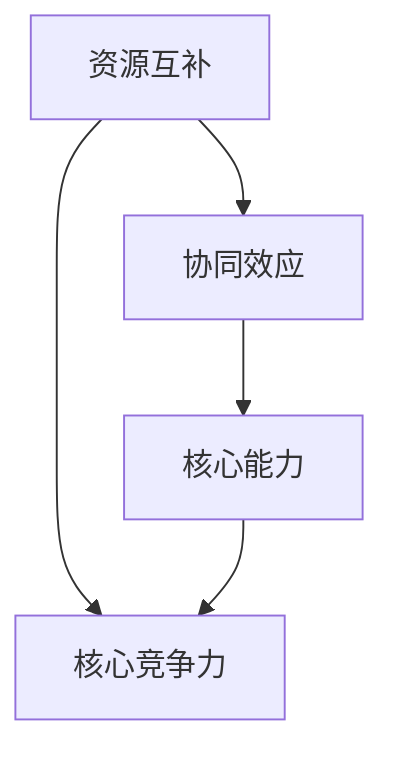

                 

### 背景介绍

程序员创业者在当今的科技环境中扮演着越来越重要的角色。随着互联网和移动设备的普及，越来越多的程序员选择跳出传统的企业工作模式，尝试通过创业来实现个人价值和社会贡献。然而，创业之路并非一帆风顺，许多程序员在创业过程中面临诸多挑战，如技术问题、资金问题、市场拓展等。因此，如何有效地利用资源，实现跨界合作，成为了程序员创业者必须面对的一个重要课题。

跨界合作在这里指的是不同领域、不同行业之间的合作。这种合作形式不仅可以带来新的技术视角和市场机会，还可以通过互补资源实现优势互补，从而提高整体竞争力。在程序员创业者的背景下，跨界合作通常意味着与设计师、产品经理、市场营销人员、甚至是其他程序员之间的合作。

本文旨在探讨程序员创业者在进行跨界合作时，如何寻找和利用互补资源。我们将通过以下结构来展开讨论：

1. **核心概念与联系**：首先，我们将介绍跨界合作中的核心概念，如资源互补、协同效应、核心能力等，并通过Mermaid流程图展示这些概念之间的联系。
2. **核心算法原理 & 具体操作步骤**：接下来，我们将详细解释如何通过策略和工具来寻找互补资源，并提供具体的操作步骤。
3. **数学模型和公式 & 详细讲解 & 举例说明**：为了量化互补资源的价值，我们将介绍相关的数学模型和公式，并通过实际案例进行详细讲解和举例说明。
4. **项目实践：代码实例和详细解释说明**：通过具体的代码实例，我们将展示如何在实际项目中应用这些策略和工具。
5. **实际应用场景**：我们将讨论跨界合作在不同领域的实际应用，以帮助程序员创业者找到适合自己的合作方向。
6. **工具和资源推荐**：为了支持跨界合作，我们将推荐一些有用的工具和资源，包括书籍、论文、博客和网站等。
7. **总结：未来发展趋势与挑战**：最后，我们将总结跨界合作的优势和潜在挑战，并探讨未来发展趋势。

通过上述结构，本文希望能够为程序员创业者提供一套系统的跨界合作策略，帮助他们在创业道路上更好地利用互补资源，实现可持续发展。

---

## 1.1 程序员创业的挑战与机遇

程序员创业面临的挑战多种多样，首先是技术方面的挑战。程序员创业者通常拥有深厚的编程和技术背景，但技术领域的快速迭代使得他们需要不断学习新的编程语言、框架和工具，以保持竞争力。此外，技术实现的复杂性和不确定性也给创业者带来了巨大的挑战。

其次，资金问题是程序员创业者的另一个重大挑战。创业初期，通常需要大量的资金用于研发、市场推广和团队建设。然而，程序员创业者往往缺乏商业经验，难以有效地获取外部投资，这使得他们在资金链紧张时面临倒闭的风险。

再者，市场拓展也是一个难题。程序员创业者需要了解市场需求，制定有效的市场策略，并通过各种渠道推广产品。这不仅仅需要技术能力，还需要市场敏锐度和商务沟通能力。

然而，挑战与机遇并存。随着互联网的普及，程序员创业者有了更多的机会。互联网为创业者提供了广阔的市场空间，使他们能够触及全球的用户。此外，技术的进步也为程序员创业者提供了更多的可能性，例如通过云计算、人工智能等技术，他们可以创造出前所未有的产品和服务。

程序员创业者面临的主要挑战和机遇如下：

1. **技术挑战**：
   - **技术快速迭代**：程序员创业者需要不断更新自己的技术栈，学习新的编程语言和框架。
   - **技术实现复杂性**：高复杂性的技术实现可能导致项目进度延误，甚至失败。

2. **资金问题**：
   - **资金获取困难**：程序员创业者通常缺乏商业背景，难以吸引外部投资。
   - **资金链紧张**：资金不足可能导致项目无法持续进行，面临倒闭风险。

3. **市场拓展**：
   - **市场需求理解**：程序员创业者需要深入理解市场需求，制定有效的市场策略。
   - **市场推广困难**：缺乏市场推广经验和渠道，可能导致产品无法得到用户的认可。

4. **机遇**：
   - **广阔市场空间**：互联网为程序员创业者提供了广阔的市场空间。
   - **技术进步**：云计算、人工智能等新技术为程序员创业者提供了更多创新机会。

### 1.2 跨界合作的定义与重要性

跨界合作是指不同领域、不同行业之间通过合作实现资源整合、优势互补的一种合作形式。在程序员创业者的背景下，跨界合作通常意味着与设计师、产品经理、市场营销人员、甚至是其他程序员之间的合作。

跨界合作的重要性在于：

1. **资源互补**：不同领域的专业人员在各自领域拥有独特的技能和资源，跨界合作可以使这些资源得到最大化利用，提高整体项目的成功概率。
2. **协同效应**：跨界合作可以通过知识和经验的共享，产生新的创意和解决方案，实现协同创新。
3. **风险分担**：通过跨界合作，程序员创业者可以将风险分散到不同领域，降低单一领域失败带来的整体风险。
4. **市场扩展**：跨界合作可以帮助程序员创业者进入新的市场领域，扩大产品的应用范围。

### 1.3 跨界合作的背景与发展趋势

跨界合作的兴起可以追溯到互联网和信息技术的高速发展。随着大数据、云计算、人工智能等新技术的广泛应用，不同行业之间的界限逐渐模糊，跨界合作成为了一种普遍现象。特别是在创业者群体中，跨界合作已成为一种重要的生存和发展策略。

跨界合作的背景与发展趋势如下：

1. **技术进步**：互联网和信息技术的发展为跨界合作提供了技术支持。云计算、大数据、人工智能等技术使不同领域之间的数据共享和协作成为可能。
2. **市场变化**：消费者需求的多样化和快速变化，促使创业者需要不断创新和调整。跨界合作可以帮助创业者快速适应市场变化，提高市场竞争力。
3. **行业融合**：不同行业之间的融合和交叉为跨界合作创造了新的机会。例如，科技与金融、科技与医疗、科技与教育等领域的融合，催生了大量新的商业模式和创业机会。
4. **政策支持**：政府对创新创业的支持政策，也为跨界合作提供了良好的外部环境。许多国家和地区都出台了相关政策，鼓励企业之间进行跨界合作，共同推动产业发展。

总的来说，跨界合作已成为程序员创业者应对挑战、抓住机遇的重要手段。通过跨界合作，程序员创业者可以充分利用互补资源，实现优势互补，提高整体竞争力。

---

## 2. 核心概念与联系

在探讨程序员创业者的跨界合作时，理解以下几个核心概念是非常重要的。这些概念包括资源互补、协同效应、核心能力等。通过Mermaid流程图，我们可以更直观地展示这些概念之间的关系，帮助读者更好地理解跨界合作的本质。

### 2.1 资源互补

资源互补是指不同领域的参与者通过合作，共享各自的资源，从而实现优势互补。在程序员创业者的背景下，资源互补通常体现在以下几个方面：

1. **技术资源**：程序员创业者通常拥有强大的编程和技术能力，而其他领域的专业人士（如设计师、产品经理等）可能在这些方面有所欠缺。通过合作，程序员创业者可以将自己的技术优势与其他领域的专业知识结合起来，创造出更有价值的产品和服务。
2. **市场资源**：市场营销人员通常拥有丰富的市场经验和广泛的客户网络，而程序员创业者可能在市场推广方面相对薄弱。通过合作，程序员创业者可以借助市场营销人员的市场资源，提高产品的市场认知度和销售量。
3. **资金资源**：创业初期的资金问题常常困扰着程序员创业者。通过跨界合作，他们可以吸引到不同领域的投资者，获取更多的资金支持。

### 2.2 协同效应

协同效应是指通过合作，各方能够产生比单独行动更大的效果。在跨界合作中，协同效应主要体现在以下几个方面：

1. **知识共享**：不同领域的专业人士通过合作，可以共享各自领域的知识和经验，产生新的创意和解决方案。这种知识共享有助于提高整体项目的创新能力和竞争力。
2. **风险分担**：通过跨界合作，创业者可以将项目风险分散到不同领域，降低单一领域失败带来的整体风险。
3. **资源整合**：跨界合作可以将不同领域的资源进行整合，形成优势互补，提高项目的整体效益。

### 2.3 核心能力

核心能力是指一个组织或个人在某一领域中的独特能力和优势。在跨界合作中，核心能力的作用主要体现在以下几个方面：

1. **核心竞争力**：跨界合作可以帮助程序员创业者发挥自己的核心能力，如技术能力、市场敏锐度等，从而提高整体项目的成功概率。
2. **协同作用**：不同领域的核心能力之间可以产生协同效应，形成新的竞争优势。
3. **持续发展**：通过不断发挥和提升核心能力，程序员创业者可以实现项目的持续发展和创新。

### 2.4 Mermaid流程图

为了更直观地展示这些核心概念之间的关系，我们可以使用Mermaid流程图来描述。以下是一个简化的Mermaid流程图，展示了资源互补、协同效应和核心能力之间的联系：



在这个流程图中，资源互补是起点，它通过协同效应转化为核心能力，最终形成核心竞争力。这个流程图不仅帮助我们理解了这些核心概念之间的关系，还为程序员创业者提供了一种思考跨界合作的方法。

---

### 2.5 跨界合作中的核心概念解析

在深入探讨跨界合作时，理解其中的核心概念是非常重要的。这些核心概念不仅定义了跨界合作的基本要素，还为我们提供了评估和优化合作关系的框架。以下是几个关键概念的定义及其在跨界合作中的应用：

#### 2.5.1 资源互补

资源互补是指在不同领域的参与者之间，通过相互提供所需的资源，从而实现优势互补。这些资源可以是技术、资金、市场渠道、人力等。在程序员创业者的跨界合作中，资源互补通常体现在以下几个方面：

1. **技术互补**：程序员创业者通常拥有强大的技术能力，而其他领域（如设计、产品管理、市场营销）的专业人士可能在技术上有所欠缺。通过合作，程序员可以将技术优势与其他领域的专业知识结合起来，创造出更有竞争力的产品和服务。

2. **市场互补**：市场营销人员通常拥有丰富的市场经验和广泛的客户网络，而程序员创业者可能在市场推广方面相对薄弱。通过合作，程序员创业者可以借助市场营销人员的市场资源，提高产品的市场认知度和销售量。

3. **资金互补**：创业初期的资金问题常常困扰着程序员创业者。通过跨界合作，他们可以吸引到不同领域的投资者，获取更多的资金支持，从而推动项目的发展。

#### 2.5.2 协同效应

协同效应是指通过合作，各方的资源、能力和努力相互结合，产生比单独行动更大的效果。在跨界合作中，协同效应主要体现在以下几个方面：

1. **知识共享**：不同领域的专业人士通过合作，可以共享各自领域的知识和经验，产生新的创意和解决方案。这种知识共享有助于提高整体项目的创新能力和竞争力。

2. **风险分担**：通过跨界合作，创业者可以将项目风险分散到不同领域，降低单一领域失败带来的整体风险。例如，如果一个项目在技术方面出现问题，其他领域的专业人才可以提供替代方案，减轻风险。

3. **资源整合**：跨界合作可以将不同领域的资源进行整合，形成优势互补，提高项目的整体效益。这种资源整合不仅包括资金和人力，还包括市场渠道、技术支持和客户资源等。

#### 2.5.3 核心能力

核心能力是指一个组织或个人在某一领域中的独特能力和优势。在跨界合作中，核心能力的作用主要体现在以下几个方面：

1. **核心竞争力**：跨界合作可以帮助程序员创业者发挥自己的核心能力，如技术能力、市场敏锐度等，从而提高整体项目的成功概率。

2. **协同作用**：不同领域的核心能力之间可以产生协同效应，形成新的竞争优势。例如，一个技术出色的程序员与一个市场敏锐的营销专家合作，可以创造出具有强大市场竞争力的高科技产品。

3. **持续发展**：通过不断发挥和提升核心能力，程序员创业者可以实现项目的持续发展和创新。这有助于他们在激烈的市场竞争中保持领先地位。

#### 2.5.4 跨界合作模型

为了更好地理解跨界合作中的核心概念，我们可以借助一个简化的跨界合作模型。以下是一个基于资源互补、协同效应和核心能力的跨界合作模型：

```
[资源互补] --> [协同效应] --> [核心能力] --> [核心竞争力]
```

在这个模型中，资源互补是跨界合作的起点，通过协同效应，各方资源、能力和努力相互结合，最终形成核心能力和核心竞争力。这个模型不仅帮助我们理解了跨界合作的基本流程，还为程序员创业者提供了优化合作关系的指导。

通过这个模型，程序员创业者可以：

1. **识别互补资源**：通过分析自身和合作伙伴的资源和能力，找到互补资源，实现优势互补。

2. **促进知识共享**：通过合作，各方可以共享知识和经验，提高项目的创新能力和竞争力。

3. **提升核心能力**：通过不断合作和项目实践，程序员创业者可以提升自身的核心能力，形成核心竞争力。

4. **优化合作关系**：通过持续评估和调整合作关系，程序员创业者可以确保合作关系的长期稳定和高效。

总的来说，跨界合作中的核心概念不仅定义了跨界合作的基本要素，还为程序员创业者提供了评估和优化合作关系的框架。通过理解和应用这些核心概念，程序员创业者可以更好地利用互补资源，提高项目的成功概率，实现持续发展和创新。

---

### 3. 核心算法原理 & 具体操作步骤

在寻找和利用互补资源的过程中，程序员创业者可以采用一系列策略和工具。以下是一些核心算法原理和具体操作步骤，帮助程序员创业者更有效地实现跨界合作。

#### 3.1 资源映射与匹配算法

资源映射与匹配算法是一种用于识别和匹配互补资源的算法。该算法的基本原理是将不同领域的资源进行映射，并找到最佳匹配。以下是具体的操作步骤：

1. **资源识别**：首先，程序员创业者需要识别自身和潜在合作伙伴的资源和能力。这些资源包括技术、资金、市场渠道、人力资源等。
   
2. **资源分类**：将识别出的资源按照类别进行分类，例如技术资源、市场资源、资金资源等。

3. **资源映射**：将不同类别的资源进行映射，创建一个资源映射表。例如，将技术资源与市场资源进行匹配，以找到潜在的合作伙伴。

4. **匹配评估**：对映射表中的资源进行匹配评估，根据资源的重要性和互补性，为每种资源分配一个权重。

5. **最佳匹配**：使用匹配算法（如最邻近算法、遗传算法等）找到最佳匹配。最佳匹配意味着双方资源互补，能够产生最大的协同效应。

#### 3.2 跨界合作策略

在资源映射与匹配算法的基础上，程序员创业者可以采用以下几种跨界合作策略：

1. **合作伙伴筛选**：根据资源匹配结果，筛选出具有互补资源的合作伙伴。筛选标准包括资源的互补性、合作伙伴的信誉度、合作历史等。

2. **合作模式确定**：确定适合的合作模式，例如联合开发、资源共享、市场推广合作等。合作模式的选择取决于资源和目标的匹配程度。

3. **合作协议制定**：制定合作协议，明确各方的权利和义务，确保合作的顺利进行。合作协议应包括资源分享、收益分配、风险分担等内容。

4. **合作过程管理**：建立有效的合作过程管理机制，包括定期沟通、进度跟踪、风险评估等。通过管理合作过程，确保各方资源得到充分利用。

#### 3.3 工具和方法

为了提高资源映射与匹配算法的效果，程序员创业者可以借助以下工具和方法：

1. **大数据分析工具**：使用大数据分析工具，对潜在合作伙伴的资源和能力进行数据挖掘和分析，提高匹配的准确性。

2. **人工智能算法**：使用人工智能算法，如机器学习和深度学习，对资源映射与匹配过程进行优化，提高匹配效率。

3. **项目管理工具**：使用项目管理工具，如Trello、Jira等，对合作过程进行管理和跟踪，确保项目进度和质量。

4. **协同工作平台**：使用协同工作平台，如Slack、Google Workspace等，促进各方的沟通和协作，提高合作效率。

#### 3.4 案例分析

以下是一个简单的案例分析，展示如何使用资源映射与匹配算法和跨界合作策略：

1. **资源识别**：一个程序员创业者拥有优秀的编程和技术能力，但缺乏市场推广和资金支持。另一个合作伙伴拥有丰富的市场营销经验和稳定的资金来源。

2. **资源分类**：程序员创业者的资源属于技术资源类别，合作伙伴的资源属于市场资源和资金资源类别。

3. **资源映射**：将程序员创业者的技术资源与合作伙伴的市场资源和资金资源进行映射。

4. **匹配评估**：根据资源的重要性和互补性，为每种资源分配权重，例如技术资源权重为0.5，市场资源权重为0.3，资金资源权重为0.2。

5. **最佳匹配**：使用匹配算法找到最佳匹配，即程序员创业者的技术资源与合作伙伴的市场资源和资金资源匹配。

6. **合作伙伴筛选**：根据匹配结果，筛选出具有互补资源的合作伙伴，例如一个具有强大市场推广能力的市场营销公司。

7. **合作模式确定**：确定联合开发模式，程序员创业者负责技术开发，合作伙伴负责市场推广和资金支持。

8. **合作协议制定**：制定合作协议，明确各方的权利和义务，包括技术共享、收益分配、风险分担等内容。

9. **合作过程管理**：通过Trello和Slack等工具，建立有效的合作过程管理机制，确保项目进度和质量。

通过这个案例分析，我们可以看到，资源映射与匹配算法和跨界合作策略如何帮助程序员创业者更有效地利用互补资源，提高项目的成功概率。

---

### 3.6 量化互补资源的价值

为了更好地评估互补资源的价值，我们可以借助数学模型和公式进行量化。以下是一种简单但有效的量化方法，可以帮助程序员创业者了解互补资源的实际价值。

#### 3.6.1 成本效益分析（CBA）

成本效益分析（Cost-Benefit Analysis，CBA）是一种常用的评估方法，用于比较项目的成本和预期收益。以下是CBA的基本公式：

\[ CBA = \frac{\text{预期收益}}{\text{总成本}} \]

其中，预期收益包括项目成功带来的直接和间接收益，如销售收入、市场份额、品牌价值提升等。总成本包括项目研发、市场推广、运营维护等所有费用。

#### 3.6.2 互补资源价值计算

为了量化互补资源的价值，我们可以使用以下公式：

\[ V_{\text{互补资源}} = \frac{\text{项目收益增量}}{\text{资源投入}} \]

其中，项目收益增量是指在引入互补资源后，项目收益的增加量。资源投入是指引入互补资源所需的成本，包括人力、资金、时间等。

#### 3.6.3 案例分析

以下是一个简单的案例分析，展示如何使用成本效益分析和互补资源价值计算来量化互补资源的价值。

假设有一个程序员创业者A，他有一个创新项目，但缺乏市场推广和资金支持。合作伙伴B拥有丰富的市场营销经验和稳定的资金来源。

1. **预期收益**：假设项目成功后，预计带来100万元的销售收入。
2. **总成本**：项目研发、市场推广和运营维护的总成本为50万元。
3. **互补资源投入**：引入合作伙伴B后，市场推广费用减少20万元，资金投入减少10万元。

根据CBA公式，我们可以计算出项目的成本效益：

\[ CBA = \frac{100\text{万元}}{50\text{万元}} = 2 \]

这意味着项目的预期收益是总成本的2倍，从成本效益的角度看，项目具有较大的盈利潜力。

接下来，我们计算互补资源的价值：

\[ V_{\text{互补资源}} = \frac{100\text{万元} - 50\text{万元}}{20\text{万元} + 10\text{万元}} = \frac{50\text{万元}}{30\text{万元}} \approx 1.67 \]

这意味着互补资源（市场推广和资金支持）为项目带来了1.67倍的收益增量，相对于资源投入，互补资源的价值较高。

通过这个案例分析，我们可以看到如何使用数学模型和公式来量化互补资源的价值。这种方法不仅可以帮助程序员创业者评估互补资源的重要性和实际价值，还可以为决策提供科学依据。

---

### 5.1 开发环境搭建

在进行跨界合作项目开发之前，搭建一个适合的开发环境是非常重要的。一个良好的开发环境不仅可以提高开发效率，还可以确保代码质量和项目的稳定性。以下是搭建开发环境的详细步骤。

#### 5.1.1 选择开发环境

根据项目需求，选择合适的开发环境。常见的开发环境包括：

1. **本地开发环境**：适用于小型项目或个人开发者。
2. **云开发环境**：适用于大型项目或团队协作开发。
3. **虚拟开发环境**：适用于需要特定操作系统或软件环境的项目。

#### 5.1.2 安装必需的软件和工具

根据选择的开发环境，安装必需的软件和工具。以下是一些常用的软件和工具：

1. **编程语言和框架**：例如Python、Java、Node.js等。
2. **集成开发环境（IDE）**：例如Visual Studio Code、Eclipse、IntelliJ IDEA等。
3. **版本控制工具**：例如Git。
4. **数据库管理系统**：例如MySQL、PostgreSQL等。
5. **调试工具**：例如Postman、JMeter等。
6. **持续集成和部署工具**：例如Jenkins、Docker等。

#### 5.1.3 配置开发环境

完成软件和工具的安装后，进行开发环境的配置。以下是一些配置步骤：

1. **环境变量设置**：设置编程语言和框架的环境变量，确保可以正常运行。
2. **依赖库安装**：根据项目需求，安装必要的依赖库和包。
3. **代码编辑器配置**：配置代码编辑器的语法高亮、代码格式化、自动补全等功能。
4. **数据库连接配置**：配置数据库连接信息，确保应用程序可以连接到数据库。
5. **持续集成配置**：配置持续集成工具，实现自动化测试和部署。

#### 5.1.4 检查开发环境

在配置完成后，进行开发环境的检查。以下是一些检查步骤：

1. **运行测试脚本**：运行一些简单的测试脚本，检查开发环境是否正常运行。
2. **测试数据库连接**：确保应用程序可以成功连接到数据库。
3. **调试工具测试**：测试调试工具的功能，确保可以有效地调试代码。
4. **检查环境变量和依赖库**：确保所有环境变量和依赖库已经正确配置。

通过以上步骤，我们可以搭建一个适合的跨

