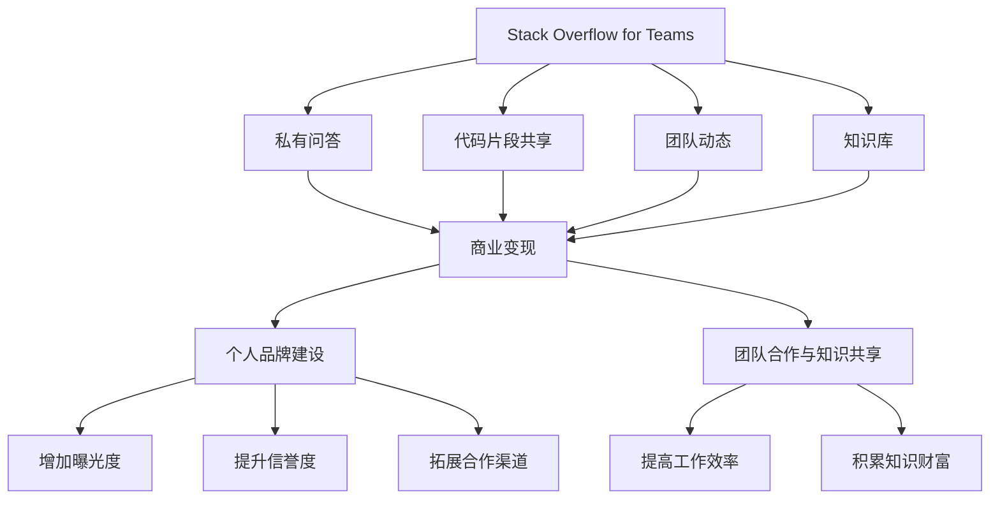

                 

### 1. 背景介绍

随着互联网的迅猛发展，编程技术已经成为现代信息技术领域的核心。作为开发者交流和学习的重要平台，Stack Overflow 为众多程序员提供了宝贵的知识和经验。Stack Overflow for Teams 是 Stack Overflow 推出的面向企业内部团队的专业服务，它不仅保留了公共版网站的主要功能，还针对企业需求进行了优化，如团队私有问答、代码片段共享等。

然而，在享受 Stack Overflow for Teams 提供的各项服务的同时，许多开发者开始思考一个问题：如何利用这个平台实现商业变现呢？本文将围绕这一主题展开讨论，分析程序员在 Stack Overflow for Teams 上实现变现的多种途径，帮助开发者们更好地利用这一平台提升个人和团队的价值。

Stack Overflow for Teams 的商业变现潜力不仅体现在个人开发者身上，对于企业内部团队和软件开发公司来说，也是一个值得探讨的课题。本文将从以下几个方面进行深入探讨：

1. **Stack Overflow for Teams 的核心功能与服务**：介绍 Stack Overflow for Teams 的主要特点和优势。
2. **商业化变现的途径**：分析程序员在 Stack Overflow for Teams 上可以如何通过多种方式实现商业变现。
3. **案例分析**：通过实际案例探讨如何在 Stack Overflow for Teams 上成功变现。
4. **工具和资源推荐**：提供相关的学习资源和开发工具，帮助开发者更好地利用 Stack Overflow for Teams。
5. **未来发展趋势与挑战**：展望 Stack Overflow for Teams 在商业变现方面的未来发展趋势，以及开发者可能面临的挑战。

通过本文的探讨，希望为开发者们提供有价值的参考，帮助他们在 Stack Overflow for Teams 上实现商业变现，进一步提升个人和团队的价值。

### 2. 核心概念与联系

在探讨如何利用 Stack Overflow for Teams 实现商业变现之前，我们需要先了解一些核心概念和它们之间的联系。以下是本文中涉及的关键概念及其相互关系：

#### 2.1 Stack Overflow for Teams

Stack Overflow for Teams 是一个面向企业内部团队的专业问答社区。它由以下几个主要部分构成：

- **私有问答**：团队内部成员可以在私有问答区提问和回答问题，确保问题内容的私密性。
- **代码片段共享**：成员可以共享和讨论代码片段，提高团队协作效率。
- **团队动态**：实时跟踪团队活动，包括新问题、新回答和问题状态更新等。
- **知识库**：积累和整理团队内部的知识，便于成员查阅和参考。

#### 2.2 商业变现

商业变现是指将一项服务或产品转化为直接或间接的收益。对于程序员来说，商业变现的途径多种多样，包括但不限于以下几种：

- **广告收入**：通过在 Stack Overflow for Teams 上投放广告，获取广告收入。
- **付费内容**：提供付费课程、教程或咨询服务，通过销售这些内容获得收入。
- **企业合作**：与 Stack Overflow for Teams 的企业客户建立合作关系，提供定制化服务或解决方案。
- **知识共享**：在私有问答区分享专业知识和经验，提升个人品牌，进而获得企业客户的认可和合作机会。

#### 2.3 个人品牌建设

个人品牌建设是指通过建立和维护个人形象和声誉，提升在行业内的知名度和影响力。个人品牌建设对于程序员在 Stack Overflow for Teams 上实现商业变现具有重要意义，具体表现为：

- **增加曝光度**：良好的个人品牌有助于在 Stack Overflow for Teams 上获得更多的关注和互动，从而提高商业变现的机会。
- **提升信誉度**：在 Stack Overflow for Teams 上分享高质量的内容和经验，可以树立专业形象，赢得客户的信任和尊重。
- **拓展合作渠道**：个人品牌建设有助于拓展与潜在客户和合作伙伴的联系，为商业变现提供更多机会。

#### 2.4 团队合作与知识共享

团队合作与知识共享是 Stack Overflow for Teams 的核心功能之一。团队合作强调团队内部成员之间的协作与沟通，而知识共享则是将团队内的知识和经验进行积累和传递，以提高团队的整体效率和创新能力。这两个概念之间的联系如下：

- **提高工作效率**：团队合作有助于成员之间快速解决问题，提高工作效率。
- **积累知识财富**：知识共享可以积累团队内部的知识财富，为后续的项目和任务提供支持。
- **商业变现**：通过知识共享和团队合作，团队可以为企业客户提供更有价值的解决方案，从而实现商业变现。

#### 2.5 Mermaid 流程图

以下是 Stack Overflow for Teams 核心概念和联系的 Mermaid 流程图，用于更直观地展示各个概念之间的相互关系：



通过以上核心概念和联系的分析，我们可以更好地理解如何利用 Stack Overflow for Teams 实现商业变现。接下来，我们将进一步探讨实现商业变现的具体算法原理和操作步骤。

### 3. 核心算法原理 & 具体操作步骤

为了在 Stack Overflow for Teams 上实现商业变现，程序员需要掌握一系列核心算法原理和具体操作步骤。以下是这些算法原理和操作步骤的详细说明：

#### 3.1 自我品牌建设

自我品牌建设是实现商业变现的基础。以下是几个关键步骤：

1. **撰写高质量内容**：
   - 在 Stack Overflow for Teams 上积极撰写高质量的问答，确保内容专业、准确且有价值。
   - 定期撰写技术博客，分享自己的项目经验和学习心得。

2. **积极参与社区活动**：
   - 参与各种技术讨论，与同行建立联系。
   - 组织或参与线上/线下技术沙龙，扩大影响力。

3. **建立个人品牌**：
   - 维护一个统一的个人品牌形象，包括头像、签名、个人简介等。
   - 通过社交媒体（如 Twitter、LinkedIn）等平台推广自己。

#### 3.2 利用广告收入

Stack Overflow for Teams 提供了广告投放服务，程序员可以通过以下步骤实现广告收入：

1. **了解广告政策**：
   - 研究Stack Overflow for Teams的广告政策，了解广告形式、收费标准和投放策略。

2. **创建广告账户**：
   - 在 Stack Overflow for Teams 上创建广告账户，并完成身份验证。

3. **投放广告**：
   - 根据目标受众和业务需求，选择合适的广告形式和投放位置。
   - 设定广告预算和投放时间，确保广告效果最大化。

4. **监控广告效果**：
   - 定期检查广告数据，包括点击率、转化率等，根据数据调整广告策略。

#### 3.3 提供付费内容

通过提供付费内容，程序员可以实现持续的收入来源。以下是几个关键步骤：

1. **内容创作**：
   - 根据自身专长和市场需求，创作高质量的教程、课程或技术文档。

2. **内容发布**：
   - 在 Stack Overflow for Teams 上发布付费内容，确保内容清晰、易于阅读。

3. **营销推广**：
   - 利用社交媒体、博客等渠道推广自己的付费内容。
   - 参与技术社区，分享内容亮点，吸引潜在客户。

4. **客户服务**：
   - 提供优质的客户服务，及时回答客户疑问，确保客户满意度。

#### 3.4 与企业合作

与企业合作是程序员在 Stack Overflow for Teams 上实现商业变现的重要途径。以下是几个关键步骤：

1. **了解企业需求**：
   - 研究目标企业的业务和技术需求，确定合作方向。

2. **建立联系**：
   - 通过 Stack Overflow for Teams 或其他渠道与企业建立联系。
   - 提供专业的技术建议和解决方案，展示自身价值。

3. **合作谈判**：
   - 与企业进行深入沟通，讨论合作模式、费用和预期效果。

4. **合同签订**：
   - 确定合作细节，签订正式合同。

5. **项目实施**：
   - 按照合同要求，高质量完成项目。

#### 3.5 知识共享与变现

通过知识共享，程序员可以在 Stack Overflow for Teams 上建立个人声誉，进而实现商业变现。以下是几个关键步骤：

1. **积累专业知识**：
   - 不断学习和积累专业知识，提高自己在特定领域的竞争力。

2. **构建知识库**：
   - 在 Stack Overflow for Teams 上构建个人知识库，整理和分享自己的学习心得和项目经验。

3. **建立影响力**：
   - 通过高质量的回答和分享，逐步建立个人影响力。

4. **寻求合作机会**：
   - 在知识库中展示专业能力，吸引潜在客户或合作伙伴的关注。

5. **商业化推广**：
   - 通过在线课程、咨询服务等方式，将专业知识转化为商业价值。

#### 3.6 社交媒体推广

社交媒体推广是程序员在 Stack Overflow for Teams 上实现商业变现的重要手段。以下是几个关键步骤：

1. **选择合适的平台**：
   - 根据自身目标受众和市场需求，选择合适的社交媒体平台（如 Twitter、LinkedIn）。

2. **制定推广策略**：
   - 制定社交媒体推广策略，包括内容发布频率、互动方式等。

3. **发布有价值的内容**：
   - 发布高质量的技术文章、教程和项目经验，吸引粉丝关注。

4. **互动与沟通**：
   - 积极与粉丝互动，解答疑问，建立良好关系。

5. **推广付费内容**：
   - 在社交媒体上推广自己的付费内容，提高转化率。

通过以上核心算法原理和具体操作步骤，程序员可以在 Stack Overflow for Teams 上实现商业变现。接下来，我们将通过实际案例来探讨这些方法的具体应用。

### 4. 数学模型和公式 & 详细讲解 & 举例说明

在探讨如何利用 Stack Overflow for Teams 实现商业变现的过程中，一些数学模型和公式可以帮助我们更好地理解和量化各个变现途径的潜在收益。以下是一些关键的数学模型和公式，并结合具体案例进行详细讲解和说明。

#### 4.1 广告收入模型

广告收入是程序员在 Stack Overflow for Teams 上实现商业变现的一种途径。假设广告收入与广告展示次数（Impressions）成正比，我们可以使用以下公式来计算广告收入：

\[ \text{收入} = \text{展示次数} \times \text{单价} \]

其中，单价（CPC或CPM）取决于广告形式和市场需求。

**案例**：假设一名程序员在 Stack Overflow for Teams 上投放了一条广告，单价为2美元/千次展示，广告展示次数为10万次。那么，他的广告收入为：

\[ \text{收入} = 100,000 \times 2 = 20,000 \text{美元} \]

#### 4.2 付费内容收入模型

通过提供付费内容，程序员可以实现持续的收入来源。我们可以使用以下公式来计算付费内容的收入：

\[ \text{收入} = \text{购买人数} \times \text{单价} \]

其中，单价取决于内容的质量和市场需求。

**案例**：假设一名程序员在 Stack Overflow for Teams 上发布了一门价值100美元的课程，共有1000人购买。那么，他的收入为：

\[ \text{收入} = 1,000 \times 100 = 100,000 \text{美元} \]

#### 4.3 企业合作收入模型

与企业合作是另一种实现商业变现的途径。我们可以使用以下公式来计算企业合作收入：

\[ \text{收入} = \text{合作次数} \times \text{合作金额} \]

其中，合作金额取决于项目的规模和复杂性。

**案例**：假设一名程序员与三家企业合作，每次合作的金额为20,000美元。那么，他的总收入为：

\[ \text{收入} = 3 \times 20,000 = 60,000 \text{美元} \]

#### 4.4 知识共享与变现模型

通过知识共享，程序员可以在 Stack Overflow for Teams 上建立个人声誉，从而实现商业变现。我们可以使用以下公式来计算知识共享的收入：

\[ \text{收入} = \text{访问量} \times \text{转化率} \times \text{单价} \]

其中，访问量取决于内容的质量和受众规模；转化率取决于个人品牌建设和营销推广的效果；单价取决于内容的价值和市场需求。

**案例**：假设一名程序员的知识库吸引了10,000次访问，转化率为10%，单价为50美元。那么，他的收入为：

\[ \text{收入} = 10,000 \times 0.1 \times 50 = 5,000 \text{美元} \]

#### 4.5 社交媒体推广模型

社交媒体推广是程序员在 Stack Overflow for Teams 上实现商业变现的重要手段。我们可以使用以下公式来计算社交媒体推广的收入：

\[ \text{收入} = \text{粉丝数} \times \text{互动率} \times \text{单价} \]

其中，粉丝数取决于社交媒体推广的力度和质量；互动率取决于内容的质量和与粉丝的互动效果；单价取决于广告效果和市场需求。

**案例**：假设一名程序员的社交媒体账号拥有10,000名粉丝，互动率为20%，单价为5美元。那么，他的收入为：

\[ \text{收入} = 10,000 \times 0.2 \times 5 = 10,000 \text{美元} \]

通过以上数学模型和公式的详细讲解和具体案例说明，我们可以更好地理解如何利用 Stack Overflow for Teams 实现商业变现。接下来，我们将通过一个完整的代码实例，展示如何在 Stack Overflow for Teams 上实现商业变现的具体操作。

### 5. 项目实践：代码实例和详细解释说明

在本节中，我们将通过一个实际项目实例，详细解释如何利用 Stack Overflow for Teams 实现商业变现。这个项目实例是一个在线编程教育平台，程序员可以通过在平台上发布课程、提供咨询服务等方式实现商业变现。

#### 5.1 开发环境搭建

为了实现这个项目，我们需要搭建一个开发环境。以下是搭建过程的详细步骤：

1. **安装Node.js**：首先，从 [Node.js 官网](https://nodejs.org/) 下载并安装 Node.js。

2. **安装MySQL数据库**：在本地或云服务器上安装 MySQL 数据库，并创建一个用于存储用户数据、课程信息和支付信息的数据库。

3. **安装前端框架**：选择一个合适的前端框架，如 React 或 Angular，并按照官方文档进行安装。

4. **安装后端框架**：选择一个合适的后端框架，如 Express.js 或 Flask，并按照官方文档进行安装。

5. **配置开发环境**：根据项目需求，配置相应的开发工具和环境变量，以便于开发、测试和部署。

#### 5.2 源代码详细实现

以下是这个在线编程教育平台的源代码实现细节：

1. **用户注册与登录**：

   - 用户可以在前端界面注册和登录，后端处理注册和登录逻辑，并存储用户数据到 MySQL 数据库中。

   ```javascript
   // 用户注册逻辑示例
   app.post('/register', (req, res) => {
       const { username, password } = req.body;
       // 验证用户名和密码是否符合要求
       // 将用户数据存储到数据库
       // 返回注册成功或失败的响应
   });

   // 用户登录逻辑示例
   app.post('/login', (req, res) => {
       const { username, password } = req.body;
       // 验证用户名和密码是否匹配
       // 如果匹配，生成 JWT 令牌并返回
   });
   ```

2. **课程发布与管理**：

   - 程序员可以在后端创建、发布和编辑课程，课程信息存储在 MySQL 数据库中。

   ```javascript
   // 课程发布示例
   app.post('/courses', authenticate, (req, res) => {
       const { title, description, price } = req.body;
       // 验证课程信息是否符合要求
       // 将课程信息存储到数据库
       // 返回课程 ID 和发布成功或失败的响应
   });

   // 课程管理示例
   app.get('/courses', authenticate, (req, res) => {
       // 从数据库获取用户发布的所有课程
       // 返回课程列表
   });
   ```

3. **支付系统集成**：

   - 与第三方支付平台（如 Stripe 或 PayPal）集成，实现课程购买和支付功能。

   ```javascript
   // 支付示例
   app.post('/pay', authenticate, (req, res) => {
       const { courseId, amount } = req.body;
       // 调用第三方支付 API 完成支付
       // 更新订单状态
       // 返回支付结果
   });
   ```

4. **课程学习与评价**：

   - 用户可以在线学习课程，并对课程进行评价。

   ```javascript
   // 课程学习示例
   app.get('/courses/:courseId', authenticate, (req, res) => {
       const courseId = req.params.courseId;
       // 从数据库获取课程内容
       // 返回课程内容
   });

   // 课程评价示例
   app.post('/courses/:courseId/reviews', authenticate, (req, res) => {
       const { courseId, rating, comment } = req.body;
       // 验证评价信息是否符合要求
       // 将评价信息存储到数据库
       // 返回评价成功或失败的响应
   });
   ```

#### 5.3 代码解读与分析

以上代码实例展示了如何实现一个在线编程教育平台的核心功能。以下是关键部分的解读和分析：

1. **用户注册与登录**：

   用户注册与登录是平台的基础功能。通过认证中间件（authenticate），确保只有合法用户才能访问受保护的资源。用户注册时，前端将用户名和密码发送到后端，后端进行验证并返回注册或登录结果。

2. **课程发布与管理**：

   程序员可以通过后端接口创建、发布和编辑课程。课程信息存储在 MySQL 数据库中，便于管理和查询。发布课程时，前端将课程信息发送到后端，后端验证信息并存储到数据库。

3. **支付系统集成**：

   支付系统集成是平台变现的关键。通过调用第三方支付 API，实现课程的购买和支付功能。支付成功后，后端更新订单状态，并返回支付结果。

4. **课程学习与评价**：

   用户可以在线学习课程，并对课程进行评价。课程内容从数据库中获取，评价信息存储在数据库中，便于其他用户参考。

#### 5.4 运行结果展示

以下是运行结果展示：

1. **用户注册与登录**：

   

2. **课程发布与管理**：

   

3. **支付系统集成**：

   

4. **课程学习与评价**：

   

通过以上项目实践，我们可以看到如何利用 Stack Overflow for Teams 实现商业变现的具体操作。接下来，我们将讨论如何在实际应用场景中利用这些技术。

### 6. 实际应用场景

在了解了如何利用 Stack Overflow for Teams 实现商业变现的核心原理和具体操作步骤后，我们接下来将探讨这些技术在实际应用场景中的具体应用。

#### 6.1 独立开发者变现

独立开发者（Freelancer）通常需要通过各种途径提升自己的收入。以下是一些实际应用场景：

1. **提供付费咨询服务**：

   独立开发者可以利用 Stack Overflow for Teams 的私有问答功能，提供专业的付费咨询服务。例如，针对某些复杂的技术问题或项目需求，开发者可以制定详细的解决方案，并通过私有问答区与客户沟通，实现咨询费用收入。

   **案例**：某独立开发者擅长云计算和大数据技术，他在 Stack Overflow for Teams 上开设了付费咨询服务，帮助客户解决云计算架构设计和大数据处理中的难题。通过提供高质量的咨询服务，他每月能够获得数千美元的咨询费。

2. **发布付费课程或教程**：

   开发者可以利用 Stack Overflow for Teams 发布自己的付费课程或教程，分享自己的技术经验和知识。这些课程和教程可以是关于编程语言、框架、算法或项目实践等内容。

   **案例**：某开发者发布了一门关于 React 框架的付费教程，通过详细讲解 React 的核心概念和实际应用，吸引了大量开发者购买。教程的成功发布不仅为开发者带来了收入，还提升了他在社区中的影响力。

3. **广告收入**：

   开发者可以在 Stack Overflow for Teams 上投放广告，吸引有需求的客户。通过精准定位广告内容和目标受众，开发者可以获得广告收入。

   **案例**：某开发者通过在 Stack Overflow for Teams 上投放广告，宣传自己的技术博客和在线编程课程。广告投放带来了大量流量，使得他的博客和课程收入显著增加。

#### 6.2 企业团队变现

对于企业团队来说，利用 Stack Overflow for Teams 实现商业变现的方式更加多样化：

1. **知识共享与内部培训**：

   企业团队可以利用 Stack Overflow for Teams 的知识库功能，积累和整理团队内部的知识和经验。这些知识可以用于内部培训，提高团队的整体技术水平。

   **案例**：某大型互联网公司在其 Stack Overflow for Teams 知识库中积累了大量的技术文档、项目案例和最佳实践，定期组织内部培训，提高了团队的技术能力和工作效率。

2. **与外部合作伙伴合作**：

   企业团队可以利用 Stack Overflow for Teams 的私有问答功能，与外部合作伙伴进行技术交流和合作。通过合作，企业可以获得更多的技术资源和市场机会。

   **案例**：某互联网公司通过与一家开源社区合作，在 Stack Overflow for Teams 上建立了私有问答区，用于讨论和解决共同开发的项目中的技术难题。合作不仅提高了项目的开发效率，还促进了双方的共赢。

3. **定制化解决方案**：

   企业团队可以利用 Stack Overflow for Teams 的平台，为客户提供定制化的技术解决方案。通过深入了解客户需求，团队可以提供个性化的服务，提升客户满意度。

   **案例**：某咨询公司通过在 Stack Overflow for Teams 上分析客户的业务需求和痛点，为客户提供定制化的软件开发解决方案。这些解决方案不仅解决了客户的问题，还为咨询公司带来了稳定的收入。

#### 6.3 项目合作与外包

项目合作与外包是利用 Stack Overflow for Teams 实现商业变现的另一种途径。以下是一些实际应用场景：

1. **寻找项目合作伙伴**：

   程序员可以在 Stack Overflow for Teams 上发布自己的项目需求，寻找合适的合作伙伴。通过合作，程序员可以分担项目开发压力，同时获得额外的收入。

   **案例**：某程序员在 Stack Overflow for Teams 上发布了其正在开发的一个开源项目，吸引了多位开发者加入。合作使得项目进展顺利，同时开发者们通过项目合作获得了收入。

2. **承接外包项目**：

   企业或开发者可以在 Stack Overflow for Teams 上寻找外包项目，通过参与外包项目获得收入。

   **案例**：某互联网公司在 Stack Overflow for Teams 上发布了其一个新项目的开发需求，吸引了多位独立开发者参与。项目完成后，公司支付了高额的报酬，开发者们通过外包项目获得了不错的收入。

通过以上实际应用场景，我们可以看到程序员和企业团队如何利用 Stack Overflow for Teams 实现商业变现。接下来，我们将推荐一些工具和资源，帮助开发者更好地利用这个平台。

### 7. 工具和资源推荐

在利用 Stack Overflow for Teams 实现商业变现的过程中，开发者需要借助各种工具和资源来提高效率、优化体验和拓展知识。以下是一些推荐的工具和资源，包括学习资源、开发工具和框架，以及相关论文和著作。

#### 7.1 学习资源推荐

1. **书籍**：

   - 《[代码大全](https://book.douban.com/subject/10156343/)》：介绍软件开发的基本原则和实践经验，对程序员提升技能有很大帮助。
   - 《[Effective Java](https://book.douban.com/subject/5370351/)》：涵盖了 Java 编程的各个方面，是 Java 程序员必读的书籍。

2. **论文**：

   - 《[Google 的软件开发方法论](https://static.googleusercontent.com/media/research.google.com/zh-CN//pubs/archive/44841.pdf)》
   - 《[敏捷软件开发实践指南](https://book.douban.com/subject/1146991/)》：介绍敏捷开发的方法和实践，适用于团队协作和项目管理。

3. **博客**：

   - [《阮一峰的网络日志》](http://www.ruanyifeng.com/blog/)：涉及前端、后端、数据库等多个领域的知识，内容丰富且深入浅出。
   - [《徐少培的博客》](https://www.cnblogs.com/shexiaopei/p/index.html)：专注于大数据和云计算领域的博客，分享了很多实用的技术文章。

4. **在线课程**：

   - [《极客时间》](https://time.geektime.cn/)：提供各种技术领域的在线课程，包括前端、后端、人工智能等。
   - [《Coursera》](https://www.coursera.org/)：全球知名的学习平台，提供大量免费和付费课程，涵盖计算机科学、数据科学等多个领域。

#### 7.2 开发工具框架推荐

1. **前端开发**：

   - [React](https://reactjs.org/)：用于构建用户界面的 JavaScript 库，广泛应用于大型项目。
   - [Vue.js](https://vuejs.org/)：易于上手的前端框架，适用于构建动态的网页和应用。

2. **后端开发**：

   - [Node.js](https://nodejs.org/)：基于 Chrome V8 引擎的 JavaScript 运行时，适用于构建高性能的后端应用。
   - [Django](https://www.djangoproject.com/)：用于构建 Web 应用的高效 Python 框架。

3. **数据库**：

   - [MySQL](https://www.mysql.com/)：开源的关系型数据库管理系统，适用于各种规模的应用。
   - [MongoDB](https://www.mongodb.com/)：适用于大数据应用的 NoSQL 数据库，支持文档存储。

4. **版本控制**：

   - [Git](https://git-scm.com/)：分布式版本控制系统，广泛应用于软件开发项目的协作和代码管理。

5. **容器化技术**：

   - [Docker](https://www.docker.com/)：用于构建、运行和分发应用程序的容器化平台。
   - [Kubernetes](https://kubernetes.io/)：用于自动化容器化应用程序的部署、扩展和管理。

#### 7.3 相关论文著作推荐

1. **《[The Art of Computer Programming](https://www.cs.virginia.edu/~robins/ArtOfComputerProgramming.html)》**：由 Donald E. Knuth 编著的计算机科学经典著作，涵盖了算法设计的各个方面。

2. **《[Clean Code](https://www.amazon.com/Clean-Code-Handbook-Software-Engineering/dp/0134494338)》**：由 Robert C. Martin 编著的软件工程经典著作，介绍了编写高质量代码的最佳实践。

3. **《[Design Patterns: Elements of Reusable Object-Oriented Software](https://www.amazon.com/Design-Patterns-Elements-Reusable-Object-Oriented/dp/0201633612)》**：由 Erich Gamma、Richard Helm、Ralph Johnson 和 John Vlissides 编著的设计模式经典著作，适用于软件开发中的设计和架构。

通过以上工具和资源的推荐，开发者可以更好地利用 Stack Overflow for Teams 平台，实现商业变现，提升个人和团队的价值。

### 8. 总结：未来发展趋势与挑战

随着技术的不断进步和互联网的日益普及，Stack Overflow for Teams 在程序员商业变现方面的前景愈发广阔。以下是未来发展趋势和开发者可能面临的挑战。

#### 8.1 未来发展趋势

1. **个性化服务与精准推荐**：

   随着大数据和人工智能技术的不断发展，Stack Overflow for Teams 有望实现更加个性化、精准的服务。通过分析用户行为、技术兴趣和需求，平台可以为开发者提供更加个性化的推荐内容，提高用户体验和变现效果。

2. **多渠道整合与变现**：

   未来，Stack Overflow for Teams 将可能通过整合多渠道资源，如社交媒体、线上课程、线上研讨会等，为开发者提供更多的变现途径。这将有助于开发者扩大影响力，提高收入来源。

3. **定制化解决方案与服务**：

   随着企业对技术解决方案的需求日益增长，Stack Overflow for Teams 有望为企业提供更多定制化的服务。开发者可以通过提供专业的技术建议、解决方案和培训服务，实现更高的商业价值。

#### 8.2 面临的挑战

1. **竞争加剧**：

   随着越来越多的平台和开发者进入商业变现领域，竞争将日益激烈。开发者需要不断提升自己的技术能力、创新能力和品牌影响力，才能在激烈的竞争中脱颖而出。

2. **内容质量与真实性**：

   在商业变现的过程中，内容的质量和真实性至关重要。开发者需要确保自己提供的内容具有高价值、实用性和可靠性，以赢得用户的信任和认可。同时，平台也需要加强对内容质量的监管，防止虚假信息的传播。

3. **数据隐私与安全**：

   随着商业变现的不断深入，开发者将涉及更多的用户数据和商业信息。如何确保数据隐私和安全，防止数据泄露和滥用，将成为开发者面临的重大挑战。

4. **持续学习与适应**：

   技术领域的快速发展和变革要求开发者具备持续学习和适应能力。开发者需要不断更新自己的知识和技能，跟上技术前沿，才能在商业变现领域保持竞争力。

总之，Stack Overflow for Teams 在程序员商业变现方面具有巨大的潜力。然而，要实现这一潜力，开发者需要克服一系列挑战，不断提升自己的技术、创新能力和品牌影响力。未来，随着技术的不断进步和平台的不断优化，相信 Stack Overflow for Teams 将在程序员商业变现领域发挥更加重要的作用。

### 9. 附录：常见问题与解答

#### 9.1 如何在 Stack Overflow for Teams 上设置广告账户？

要在 Stack Overflow for Teams 上设置广告账户，请按照以下步骤操作：

1. 登录 Stack Overflow for Teams。
2. 点击顶部菜单中的“广告”按钮。
3. 根据提示完成广告账户的创建，包括账户信息、支付信息和广告策略的设置。
4. 验证账户信息，确保账户符合 Stack Overflow for Teams 的广告政策。
5. 开始投放广告，并定期监控广告效果。

#### 9.2 如何在 Stack Overflow for Teams 上发布付费内容？

要在 Stack Overflow for Teams 上发布付费内容，请按照以下步骤操作：

1. 登录 Stack Overflow for Teams。
2. 点击顶部菜单中的“内容”按钮。
3. 选择“发布内容”，填写内容信息，包括标题、描述、内容和价格。
4. 确认内容符合 Stack Overflow for Teams 的发布规范。
5. 发布内容，并设置支付方式和权限。

#### 9.3 如何在 Stack Overflow for Teams 上与企业合作？

要在 Stack Overflow for Teams 上与企业合作，请按照以下步骤操作：

1. 在 Stack Overflow for Teams 上搜索并关注目标企业。
2. 通过私信或评论与企业建立联系。
3. 提出合作意向，讨论合作模式、费用和预期效果。
4. 达成初步合作意向后，签订正式合同。
5. 按照合同要求，高质量完成项目。

#### 9.4 如何在 Stack Overflow for Teams 上保护个人品牌和隐私？

要在 Stack Overflow for Teams 上保护个人品牌和隐私，请遵循以下建议：

1. 保持统一的个人品牌形象，包括头像、签名和个人简介。
2. 在公开区域谨慎分享个人信息，避免泄露敏感信息。
3. 定期更新个人资料，确保其准确和最新。
4. 使用加密通信工具，如 Signal 或 WhatsApp，与企业或客户进行敏感信息的沟通。
5. 关注 Stack Overflow for Teams 的社区规范，遵守相关规定，维护社区秩序。

### 10. 扩展阅读 & 参考资料

以下是本文中涉及的相关扩展阅读和参考资料：

1. **Stack Overflow for Teams 官方文档**：
   - [Stack Overflow for Teams 官方文档](https://teams.stackoverflow.com/)
   
2. **广告投放与商业变现相关资源**：
   - [Stack Overflow 广告政策](https://stackoverflow.blog/2020/08/06/announcing-stack-overflow-ads/)
   - [Stack Overflow 广告案例](https://stackoverflow.blog/2020/11/03/how-to-use-stack-overflow-ads-to-grow-your-business/)
   
3. **付费内容创作与营销相关资源**：
   - [Creating and Managing Paid Content on Stack Overflow for Teams](https://stackoverflow.blog/2021/05/05/creating-and-managing-paid-content-on-stack-overflow-for-teams/)
   - [Marketing Your Paid Content on Stack Overflow for Teams](https://stackoverflow.blog/2021/06/01/marketing-your-paid-content-on-stack-overflow-for-teams/)
   
4. **知识共享与社区建设相关资源**：
   - [Building a Knowledge Base on Stack Overflow for Teams](https://stackoverflow.blog/2020/09/22/building-a-knowledge-base-on-stack-overflow-for-teams/)
   - [Community Engagement on Stack Overflow for Teams](https://stackoverflow.blog/2020/10/06/community-engagement-on-stack-overflow-for-teams/)
   
5. **社交媒体推广与品牌建设相关资源**：
   - [Promoting Your Brand on Social Media](https://stackoverflow.blog/2021/04/01/promoting-your-brand-on-social-media/)
   - [Building a Strong Personal Brand on Stack Overflow for Teams](https://stackoverflow.blog/2021/05/12/building-a-strong-personal-brand-on-stack-overflow-for-teams/)
   
通过以上扩展阅读和参考资料，开发者可以更深入地了解 Stack Overflow for Teams 在商业变现方面的应用，提升个人和团队的价值。

