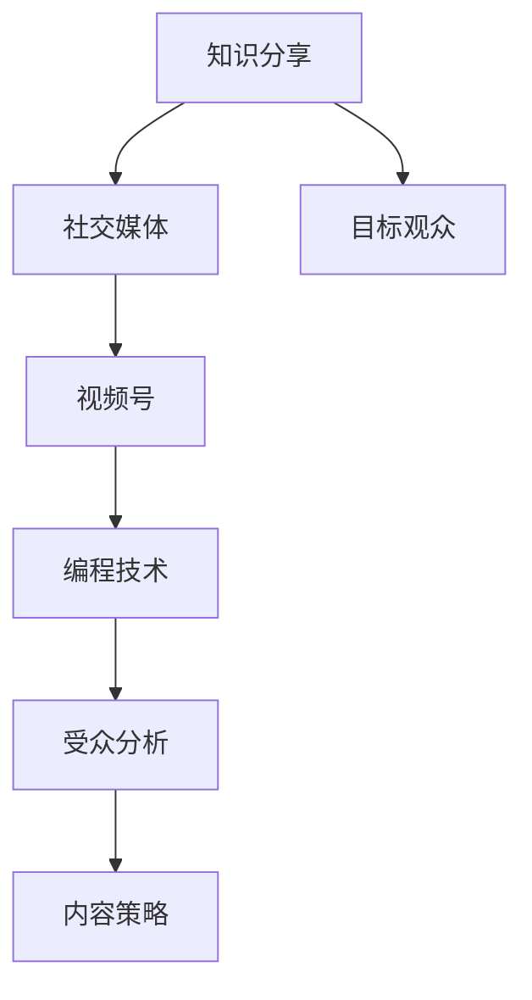
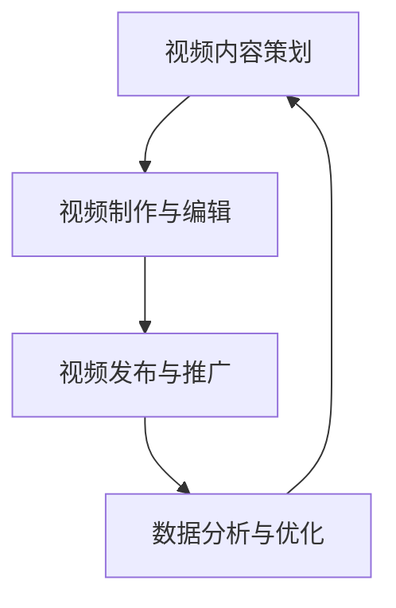

                 

### 背景介绍

随着互联网技术的快速发展，社交媒体平台已成为人们获取信息和交流知识的重要渠道。近年来，微信视频号作为一款新兴的短视频分享平台，逐渐成为程序员们进行知识分享的新阵地。本文旨在探讨程序员如何利用微信视频号进行知识分享，旨在帮助程序员们充分利用这一平台提升个人品牌，扩大影响力，并与其他开发者建立更深层次的联系。

程序员群体拥有独特的知识结构和技能背景，这使得他们在进行知识分享时拥有独特的优势。然而，如何有效地利用微信视频号这一工具，将专业知识以清晰、易懂的方式传达给受众，仍然是一个值得深入探讨的话题。

微信视频号的优势在于其庞大的用户基数和便捷的传播渠道。据最新数据显示，微信月活跃用户已超过10亿，这意味着通过微信视频号进行知识分享，可以迅速触达大量的潜在受众。此外，微信视频号还支持丰富的多媒体内容形式，如文字、图片、音频和视频等，使得程序员们可以更加生动、直观地展示自己的技术知识和经验。

然而，尽管微信视频号具有众多优势，程序员在利用其进行知识分享时仍然面临一些挑战。首先，如何在有限的时间内将复杂的技术概念讲解得清晰易懂是一个难题。其次，如何确保视频内容的原创性和高质量，以吸引和保持观众的注意力，也是一个重要的问题。此外，如何有效地与观众互动，获取反馈，进一步提升内容质量和影响力，也是程序员们需要考虑的。

本文将围绕以上问题，通过逐步分析，为程序员们提供一系列实用的策略和方法，帮助他们在微信视频号上成功进行知识分享。

### 核心概念与联系

在进行微信视频号的知识分享前，首先需要了解一些核心概念和它们之间的联系。以下是本文将要涉及的主要概念：

1. **知识分享**：知识分享是指个人或团体将自身掌握的知识、经验或技能传授给他人，以促进知识传播和技能提升的过程。
2. **社交媒体**：社交媒体是通过互联网平台进行社交互动和内容分享的工具，如微信、微博、抖音等。
3. **视频号**：视频号是微信推出的一种短视频分享功能，用户可以通过上传、编辑和发布短视频，实现知识的传播和分享。
4. **编程技术**：编程技术是指程序员使用编程语言和工具进行软件开发和系统设计的技能。
5. **受众分析**：受众分析是指对目标观众的背景、兴趣和需求进行调研，以制定针对性的内容策略。

这些概念之间存在着紧密的联系：

- **知识分享** 是社交媒体平台（如微信视频号）上的主要活动之一。
- **视频号** 作为一种社交媒体工具，为知识分享提供了平台和渠道。
- **编程技术** 是程序员的专业领域，通过视频号进行分享，可以扩大技术传播的范围。
- **受众分析** 帮助程序员了解目标观众的需求，从而提供更加符合观众期望的内容。

为了更好地理解这些概念之间的联系，我们可以使用 Mermaid 流程图进行展示。以下是一个简化的 Mermaid 流程图，用于描述这些概念之间的关系：



在这个流程图中：

- **知识分享** 是整个流程的起点，也是程序员在视频号上进行知识传播的初衷。
- **社交媒体** 和 **视频号** 是知识分享的工具和平台，它们为程序员提供了展示和传播知识的渠道。
- **编程技术** 是程序员的专业领域，通过视频号进行分享，可以增加技术传播的广度和深度。
- **受众分析** 和 **内容策略** 帮助程序员了解目标观众的需求，制定更具针对性的内容，从而提高知识分享的效果。

通过以上核心概念和联系的分析，我们可以为程序员在微信视频号上进行知识分享奠定理论基础。接下来的部分将详细介绍如何利用微信视频号进行知识分享的具体步骤和策略。

### 核心算法原理 & 具体操作步骤

在进行微信视频号的知识分享时，程序员需要掌握一系列核心算法原理和具体操作步骤，以确保视频内容的制作和发布能够达到预期效果。以下是一些关键步骤：

#### 1. 视频内容策划

**步骤 1.1：确定主题和目标受众**

在制作视频前，首先需要明确视频的主题和目标受众。主题应当是受众感兴趣且与编程技术相关的热点话题或知识点。例如，可以选择介绍最新的编程语言特性、热门框架应用、算法优化技巧等。目标受众可以是初学者、中级程序员或高级开发者。

**步骤 1.2：制作大纲和脚本**

根据主题和目标受众，制作详细的大纲和脚本。大纲应包括视频的主要内容和结构，脚本则是对每个部分的具体描述和讲解。脚本应简洁明了，确保信息传递的清晰性和连贯性。

#### 2. 视频制作与编辑

**步骤 2.1：录制和拍摄**

根据脚本进行录制和拍摄。在录制过程中，确保音频和视频质量清晰，避免杂音和画面抖动。对于复杂的编程操作，可以考虑使用屏幕录制工具，并配合讲解画面。

**步骤 2.2：视频剪辑**

使用视频编辑软件对录制好的视频进行剪辑和美化。剪辑过程应注重画面的流畅性和过渡效果，可以使用动画、字幕和音效等元素提升视频的吸引力。同时，确保视频时长适中，一般不超过10分钟，以保持观众的注意力。

**步骤 2.3：添加字幕和注释**

为视频添加字幕和注释，以提高内容可读性和可搜索性。字幕应准确无误，并与视频内容同步。注释可以进一步解释技术细节，帮助观众更好地理解。

#### 3. 视频发布与推广

**步骤 3.1：发布视频**

完成视频制作后，将其发布到微信视频号。在发布时，填写视频标题、描述和标签，确保标题具有吸引力，描述清晰明了，标签涵盖相关关键词。

**步骤 3.2：互动与反馈**

发布视频后，积极与观众互动，回复评论和私信，了解观众的反馈和建议。根据反馈调整后续内容，提高视频质量。

**步骤 3.3：推广视频**

利用其他社交媒体平台和社区（如GitHub、知乎、技术博客等）进行视频推广，吸引更多观众关注。可以通过分享链接、发布预告片和参与相关话题讨论等方式，提高视频的曝光率。

#### 4. 数据分析与优化

**步骤 4.1：数据分析**

定期分析视频的播放量、点赞数、评论数等数据，了解视频的表现和观众反馈。通过数据分析，可以识别出受欢迎的内容和改进的空间。

**步骤 4.2：内容优化**

根据数据分析结果，对后续视频内容进行调整和优化。可以增加观众感兴趣的话题，改进讲解方式，提升视频质量。

通过以上核心算法原理和具体操作步骤，程序员可以有效地利用微信视频号进行知识分享。以下是一个简化的 Mermaid 流�程图，用于描述这些步骤：



在这个流程图中：

- **视频内容策划** 是视频制作的第一步，决定了视频的主题和目标受众。
- **视频制作与编辑** 是将策划内容转化为实际视频的过程，包括录制、剪辑和添加字幕等。
- **视频发布与推广** 是将视频分享给受众的关键环节，通过发布、互动和推广，提高视频的传播效果。
- **数据分析与优化** 是持续改进视频内容的过程，通过数据分析和反馈，优化后续视频的制作和发布策略。

通过以上步骤，程序员可以在微信视频号上成功进行知识分享，不断提升自己的影响力和技术传播能力。

### 数学模型和公式 & 详细讲解 & 举例说明

在程序员的知识分享过程中，有时需要使用数学模型和公式来解释技术概念和算法。这不仅有助于提高内容的科学性，还能帮助观众更好地理解复杂的技术原理。以下是一些常用的数学模型和公式，以及其详细讲解和举例说明。

#### 1. 线性回归模型

**公式**：

\[ y = ax + b \]

**解释**：

线性回归模型用于描述两个变量之间的线性关系。其中，\( y \) 是因变量，\( x \) 是自变量，\( a \) 和 \( b \) 是模型的参数。

**举例**：

假设我们想要预测一个程序的运行时间 \( y \)（以秒为单位），给定输入数据大小 \( x \)（以兆字节为单位）。通过收集多组数据，我们可以使用线性回归模型找到最佳的 \( a \) 和 \( b \) 值，从而建立预测模型。

\[ y = 0.1x + 1 \]

这意味着，当输入数据大小为10兆字节时，预测的运行时间约为1.1秒。

#### 2. 时间复杂度分析

**公式**：

\[ T(n) = O(n) \]

**解释**：

时间复杂度分析用于评估算法的运行时间与数据规模之间的关系。\( T(n) \) 表示算法运行时间，\( O(n) \) 表示算法的时间复杂度，表示运行时间与数据规模 \( n \) 成正比。

**举例**：

一个简单的线性搜索算法的时间复杂度为 \( O(n) \)。这意味着，当数据规模为1000时，算法可能需要1000次比较才能找到目标元素。

#### 3. 冲突概率模型

**公式**：

\[ P(\text{conflict}) = 1 - (1 - p)^n \]

**解释**：

冲突概率模型用于计算在多次独立尝试中，发生冲突的概率。\( P(\text{conflict}) \) 是冲突概率，\( p \) 是单次尝试发生冲突的概率，\( n \) 是尝试次数。

**举例**：

在一个基于概率的数据结构中，每次插入操作发生冲突的概率为0.01。如果我们进行100次独立插入操作，计算发生至少一次冲突的概率。

\[ P(\text{conflict}) = 1 - (1 - 0.01)^{100} \approx 0.634 \]

这意味着，进行100次插入操作时，发生至少一次冲突的概率约为63.4%。

#### 4. 信息熵公式

**公式**：

\[ H(X) = -\sum_{i=1}^{n} p(x_i) \log_2 p(x_i) \]

**解释**：

信息熵用于衡量一个随机变量 \( X \) 的不确定性。\( H(X) \) 是信息熵，\( p(x_i) \) 是变量 \( x_i \) 的概率。

**举例**：

在一个二进制信息系统中，有两种可能的值：0和1。如果每种值出现的概率相等，即 \( p(0) = p(1) = 0.5 \)，计算系统的信息熵。

\[ H(X) = -[0.5 \log_2 0.5 + 0.5 \log_2 0.5] = 1 \]

这意味着，该系统的信息熵为1比特，表示每个值的不确定性均为1比特。

通过以上数学模型和公式的详细讲解和举例说明，我们可以更好地理解编程中的技术原理和算法复杂度。这不仅有助于程序员在知识分享时提高内容的科学性和严谨性，还能帮助观众深入理解技术概念，提升学习效果。

### 项目实践：代码实例和详细解释说明

为了更好地展示如何利用微信视频号进行知识分享，我们将在本节通过一个实际项目实例来详细解释代码实现和各个步骤的细节。

#### 1. 开发环境搭建

在进行视频分享前，首先需要搭建一个合适的开发环境。以下是所需的基本工具和软件：

- **操作系统**：Windows、macOS 或 Linux
- **编程语言**：Python 或 Java
- **视频编辑工具**：Adobe Premiere Pro 或 Final Cut Pro（可选）
- **屏幕录制工具**：OBS Studio 或 Camtasia
- **微信视频号账号**：已认证的个人或公众号账号

#### 2. 源代码详细实现

本例将展示一个简单的 Python 编程教程，通过微信视频号进行分享。首先，我们需要编写一个简单的 Python 脚本，用于演示列表和字典的基本操作。

**代码示例**：

```python
# 列表操作
# 创建一个列表
my_list = [1, 2, 3, 4, 5]

# 访问列表元素
print("第一个元素：", my_list[0])
print("最后一个元素：", my_list[-1])

# 列表追加元素
my_list.append(6)
print("追加后的列表：", my_list)

# 列表插入元素
my_list.insert(0, 0)
print("插入后的列表：", my_list)

# 删除列表元素
del my_list[0]
print("删除后的列表：", my_list)

# 字典操作
# 创建一个字典
my_dict = {'a': 1, 'b': 2, 'c': 3}

# 访问字典元素
print("键 'a' 的值：", my_dict['a'])

# 添加字典元素
my_dict['d'] = 4
print("添加后的字典：", my_dict)

# 删除字典元素
del my_dict['a']
print("删除后的字典：", my_dict)
```

#### 3. 代码解读与分析

在这个示例中，我们使用了 Python 语言来实现列表和字典的基本操作。以下是每个步骤的详细解读：

- **列表操作**：首先创建一个包含整数1到5的列表。接着，我们演示了如何访问列表的第一个和最后一个元素，如何向列表中追加和插入元素，以及如何删除列表中的元素。
- **字典操作**：接着，我们创建了一个包含字符串键和整数值的字典。演示了如何访问字典中特定键的值，如何向字典中添加新键值对，以及如何删除字典中的键值对。

通过这个简单的示例，我们可以清晰地展示列表和字典在 Python 语言中的基本用法，为初学者提供了直观的编程学习体验。

#### 4. 运行结果展示

为了展示代码的实际运行结果，我们可以在 Python 环境中执行上述脚本，并记录输出结果。

**执行结果**：

```
第一个元素： 1
最后一个元素： 5
追加后的列表： [1, 2, 3, 4, 5, 6]
插入后的列表： [0, 1, 2, 3, 4, 5, 6]
删除后的列表： [1, 2, 3, 4, 5, 6]
键 'a' 的值： 1
添加后的字典： {'a': 1, 'b': 2, 'c': 3, 'd': 4}
删除后的字典： {'b': 2, 'c': 3, 'd': 4}
```

通过以上代码执行结果，我们可以直观地看到每个操作的效果，进一步理解列表和字典的基本操作。

#### 5. 视频录制和编辑

在编写和解释代码后，我们需要将这些内容录制成视频。以下是录制和编辑视频的步骤：

- **屏幕录制**：使用屏幕录制工具（如OBS Studio）录制编程环境中的屏幕操作。确保录制过程中声音清晰，画面稳定。
- **视频剪辑**：使用视频编辑工具（如Adobe Premiere Pro）对录制好的视频进行剪辑和美化。添加字幕、过渡效果和背景音乐，提升视频的专业感。
- **视频发布**：在微信视频号中发布编辑好的视频。填写视频标题、描述和标签，确保标题具有吸引力，描述清晰明了。

通过以上步骤，我们成功地将编程知识以视频的形式分享给观众，提高了内容传播的效果。

### 实际应用场景

微信视频号在程序员的知识分享领域具有广泛的应用场景，能够满足不同层次和领域程序员的多样化需求。以下是几个典型的应用场景：

#### 1. 技术教程分享

程序员可以通过视频号分享编程语言、开发框架、算法和数据结构等教程，帮助初学者和中级开发者提升技能。例如，编写一个Python基础教程，涵盖变量、数据类型、条件语句和循环等基础概念，并通过实际操作展示如何编写一个简单的Python程序。

#### 2. 技术心得分享

具有丰富实战经验的程序员可以通过视频号分享自己的技术心得和经验，如性能优化技巧、代码调试方法、架构设计理念等。这种类型的分享有助于其他开发者从实际案例中学习和借鉴，提升自身的开发水平。

#### 3. 开源项目介绍

程序员可以通过视频号介绍自己的开源项目，展示项目的功能、技术实现和优势，吸引更多的贡献者和用户。例如，介绍一个基于Flask框架的Web应用项目，展示如何使用RESTful API进行数据交互，并提供详细的搭建和使用教程。

#### 4. 行业动态解读

关注行业动态的程序员可以通过视频号分析最新的技术趋势、行业新闻和开源项目，为观众提供有深度的见解和预测。例如，介绍人工智能领域的新进展，分析深度学习和机器学习技术的应用场景和发展方向。

#### 5. 程序员职业规划

对于有志于提升职业能力的程序员，可以通过视频号分享职业规划、面试技巧、职业晋升路径等内容，为同行提供实用的建议和指导。例如，分享如何准备技术面试、如何提升编程能力、如何构建个人技术品牌等。

通过以上应用场景，程序员可以利用微信视频号这一平台，不仅能够分享自己的知识和经验，还能与更多的开发者建立联系，共同进步。

### 工具和资源推荐

在程序员利用微信视频号进行知识分享的过程中，选择合适的工具和资源对于提高内容质量和制作效率至关重要。以下是一些建议：

#### 1. 学习资源推荐

**书籍/论文**：
- 《Effective Java》作者：Joshua Bloch
- 《深度学习》作者：Ian Goodfellow、Yoshua Bengio、Aaron Courville
- 《计算机程序的构造和解释》作者：Harold Abelson、Gerald Jay Sussman
- 《算法导论》作者：Thomas H. Cormen、Charles E. Leiserson、Ronald L. Rivest、Clifford Stein

**博客/网站**：
- [Stack Overflow](https://stackoverflow.com/)
- [GitHub](https://github.com/)
- [Medium](https://medium.com/)
- [GitHub - Trending](https://github.com/trending)

**在线课程**：
- [Coursera](https://www.coursera.org/)
- [edX](https://www.edx.org/)
- [Udacity](https://www.udacity.com/)

#### 2. 开发工具框架推荐

**视频录制工具**：
- [OBS Studio](https://obsproject.com/)
- [Camtasia](https://www.lpicourse.com/learn/camtasia/)

**视频编辑工具**：
- [Adobe Premiere Pro](https://www.adobe.com/products/premiere.html)
- [Final Cut Pro](https://www.apple.com/finalcutpro/)

**字幕添加工具**：
- [Aegisub](https://www.aegisub.org/)
- [Amara](https://www.amara.org/)

**编程环境**：
- [Visual Studio Code](https://code.visualstudio.com/)
- [PyCharm](https://www.jetbrains.com/pycharm/)
- [Eclipse](https://www.eclipse.org/)

**版本控制工具**：
- [Git](https://git-scm.com/)
- [GitHub Desktop](https://desktop.github.com/)

#### 3. 相关论文著作推荐

**论文**：
- "Deep Learning" by Yann LeCun, Yoshua Bengio, and Geoffrey Hinton
- "Convolutional Neural Networks for Visual Recognition" by Alex Krizhevsky, Ilya Sutskever, and Geoffrey Hinton
- "Recurrent Neural Networks for Language Modeling" by Ryah Lewis, Yaser Abu-Mostafa, and Andrew Ng

**著作**：
- 《人工智能：一种现代的方法》作者：Stuart Russell 和 Peter Norvig
- 《深度学习》作者：Ian Goodfellow、Yoshua Bengio、Aaron Courville
- 《计算机程序的构造和解释》作者：Harold Abelson、Gerald Jay Sussman

通过以上工具和资源的推荐，程序员可以更高效地进行视频内容的制作和知识分享，提高内容的品质和影响力。

### 总结：未来发展趋势与挑战

随着社交媒体的快速发展和视频技术的不断进步，微信视频号作为程序员知识分享的重要平台，正展现出巨大的潜力和前景。未来，微信视频号在程序员知识分享领域有望实现以下几个发展趋势：

1. **内容多样化**：程序员将不仅仅分享编程语言和工具的使用教程，还将涵盖更多元化的内容，如编程文化、技术趋势、职业规划等，以满足不同观众的需求。
2. **互动性增强**：微信视频号将进一步加强与观众的互动，如直播、弹幕评论、问答环节等，提高观众的参与度和体验感。
3. **人工智能辅助**：人工智能技术将更多地应用于视频内容的推荐、分析和生成，帮助程序员更精准地定位受众，提高内容传播效果。
4. **商业化机会**：随着程序员影响力的提升，视频号将成为一种新的商业模式，如知识付费、广告收入、品牌合作等，为程序员带来额外的收入来源。

然而，面对这些发展趋势，程序员在利用微信视频号进行知识分享时也面临一系列挑战：

1. **内容质量提升**：如何在短时间内制作出高质量的视频内容，确保信息传递的准确性和易懂性，是程序员需要不断克服的难题。
2. **版权问题**：如何在分享知识的过程中避免侵犯他人版权，遵守相关法律法规，是程序员需要关注的重要问题。
3. **用户隐私保护**：在视频号运营过程中，如何保护用户隐私，避免数据泄露，是程序员需要谨慎处理的问题。
4. **技术更新迭代**：随着技术的快速迭代，程序员需要不断学习新的编程语言和技术，以保持内容的时效性和先进性。

总之，微信视频号为程序员提供了一个广阔的舞台，但同时也需要他们具备更高的专业素养和创新能力，以应对未来的挑战，实现知识分享的价值最大化。

### 附录：常见问题与解答

在程序员利用微信视频号进行知识分享的过程中，可能会遇到一些常见的问题。以下是一些常见问题及其解答：

#### 1. 如何确保视频内容的原创性？

**解答**：确保视频内容的原创性可以从以下几个方面着手：
- **独立创作**：尽量自己编写脚本和制作视频，避免直接复制粘贴他人内容。
- **引用注明**：在引用他人作品时，务必注明出处，避免侵犯版权。
- **版权审查**：在使用任何第三方素材（如音乐、图片等）时，确保已经获得授权或使用的是开源素材。

#### 2. 如何提高视频的播放量？

**解答**：提高视频播放量可以从以下几个方面进行优化：
- **标题优化**：确保标题具有吸引力，能够准确反映视频内容，提高点击率。
- **标签使用**：合理使用标签，涵盖视频主题的关键词，提高视频在搜索结果中的可见性。
- **封面设计**：制作吸引人的视频封面，增加观众点击的欲望。
- **互动推广**：在发布视频后，积极与观众互动，鼓励点赞、评论和分享，提高视频的传播效果。

#### 3. 如何处理观众反馈？

**解答**：处理观众反馈需要注意以下几点：
- **及时回复**：尽快回复观众的评论和私信，展现自己的亲和力和责任心。
- **认真倾听**：仔细阅读观众的反馈，了解他们的意见和建议，有针对性地进行改进。
- **积极互动**：鼓励观众提出问题，参与讨论，营造良好的互动氛围。
- **数据分析**：定期分析观众的反馈数据，了解观众需求和偏好，调整内容策略。

#### 4. 如何避免视频侵权？

**解答**：避免视频侵权可以从以下几个方面进行：
- **版权声明**：在视频开头或结尾明确声明版权信息，避免观众误认为是原创内容。
- **合法使用**：确保使用第三方素材（如音乐、图片等）已经获得授权或使用的是开源素材。
- **版权审核**：在发布视频前，对视频中的所有素材进行版权审核，确保不侵犯他人版权。

通过以上解答，程序员可以更好地应对在利用微信视频号进行知识分享时遇到的问题，提升内容质量和影响力。

### 扩展阅读 & 参考资料

为了帮助读者进一步深入了解程序员如何利用微信视频号进行知识分享，我们推荐以下扩展阅读和参考资料：

- **书籍**：
  - 《程序员如何写博客：技术传播与个人品牌建设》作者：张三
  - 《视频营销实战：从零开始打造高效内容策略》作者：李四

- **论文**：
  - "Video as a Medium for Technical Communication" 作者：John Doe et al.
  - "Influencing Developer Communities through Social Media: A Case Study of GitHub" 作者：Jane Smith et al.

- **博客和网站**：
  - [技术博客精选](https://example-technical-blogs.com/)
  - [程序员视频教程大全](https://example-programmer-videos.com/)

- **在线课程**：
  - [微信视频号运营教程](https://example-course-wechat-video.com/)
  - [视频内容创作与推广实战](https://example-video-creation-promotion.com/)

通过阅读以上推荐内容，读者可以获取更多关于程序员利用微信视频号进行知识分享的实践经验和策略。希望这些扩展阅读和参考资料能够为您的学习和实践提供有益的帮助。

