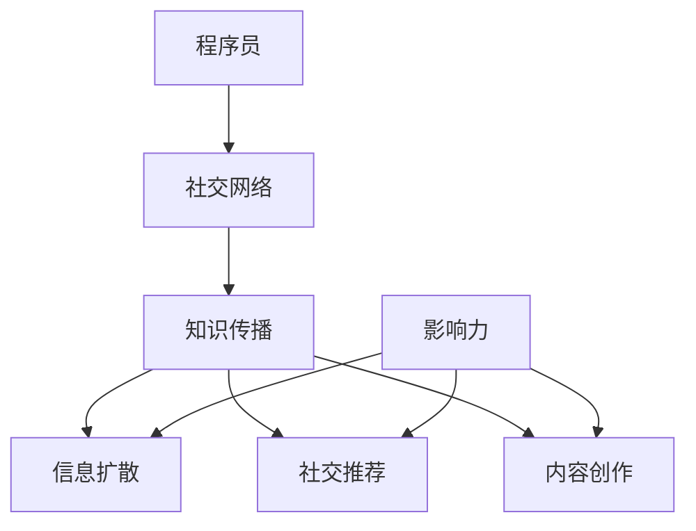

                 

### 1. 背景介绍

程序员是一个充满活力与创新的职业。在数字化时代，程序员不仅是技术驱动的关键力量，也是知识传播和创新的重要推动者。然而，在个人职业生涯中，程序员常常面临知识传播的瓶颈。传统的工作方式往往使他们在专业领域的知识传播中受限，难以发挥出应有的影响力。

随着互联网的普及，社交网络成为了一个重要的平台。它不仅改变了人们的社交方式，也为程序员提供了一个全新的知识传播渠道。通过社交网络，程序员可以打破地域限制，实时分享他们的经验和见解，从而扩大自己在专业领域的影响力。

社交网络在程序员的知识传播中扮演着多重角色。首先，它是知识交流的平台，程序员可以在这里获取最新的技术动态、行业趋势和同行经验。其次，它是展示个人技能和成就的舞台，程序员可以通过分享自己的项目、代码和思考，展示自己的专业能力。最后，它是职业发展的助推器，通过建立专业人脉、参与社区讨论和贡献开源项目，程序员可以进一步提升自己在行业中的知名度。

本文将深入探讨程序员如何利用社交网络扩大知识影响力。我们将从社交网络的核心概念、应用场景、工具推荐等方面展开讨论，旨在为程序员提供一套系统的策略和方法。以下是本文的结构概览：

- **1. 背景介绍**：介绍程序员在知识传播中面临的挑战及社交网络的崛起。
- **2. 核心概念与联系**：探讨社交网络的核心概念及其在程序员知识传播中的应用。
- **3. 核心算法原理 & 具体操作步骤**：介绍如何利用社交网络进行知识传播的具体方法。
- **4. 数学模型和公式 & 详细讲解 & 举例说明**：运用数学模型和公式，深入分析社交网络的影响力。
- **5. 项目实践：代码实例和详细解释说明**：通过具体项目实践，展示如何利用社交网络进行知识传播。
- **6. 实际应用场景**：分析社交网络在程序员知识传播中的具体应用。
- **7. 工具和资源推荐**：推荐学习资源、开发工具和框架。
- **8. 总结：未来发展趋势与挑战**：展望社交网络在程序员知识传播中的未来。
- **9. 附录：常见问题与解答**：回答读者可能关心的问题。
- **10. 扩展阅读 & 参考资料**：提供进一步的阅读材料。

### 2. 核心概念与联系

要深入理解程序员如何利用社交网络扩大知识影响力，我们首先需要明确几个核心概念，并探讨它们之间的联系。

**社交网络的基本概念**：

社交网络是指由多个人和资源组成的网络结构，这些人和资源通过某种关联关系相互连接。在社交网络中，每个节点代表一个个体，如程序员，而边则代表节点之间的关联，如点赞、评论和分享。

**知识传播的机制**：

知识传播是信息在不同个体间传递的过程。在社交网络中，知识传播主要通过以下几种方式实现：

1. **信息扩散**：个体通过分享、转发等方式将信息传递给其他个体。
2. **社交推荐**：个体根据社交关系推荐信息，从而促进信息的传播。
3. **内容创作**：个体通过创作有价值的内容，如博客、文章、代码等，来传递知识。

**社交网络中的影响力**：

影响力是指个体在社交网络中对信息传播的影响力。影响力可以通过以下几种方式衡量：

1. **传播力**：个体分享的信息被转发的次数。
2. **互动率**：个体发布的信息获得的评论、点赞和分享数量。
3. **覆盖面**：个体发布的信息被多少个用户看到。

**核心概念与程序员知识传播的联系**：

- **社交网络**为程序员提供了一个广泛的知识传播平台，使他们能够突破地域限制，与全球的同行进行交流和合作。
- **知识传播的机制**使得程序员可以通过多种方式分享自己的知识和经验，如博客、开源项目、在线教程等。
- **影响力**是程序员在社交网络中扩大知识传播的关键，高影响力的程序员往往能够吸引更多的关注和合作机会。

**Mermaid 流程图**：

为了更直观地展示社交网络中程序员知识传播的流程，我们可以使用 Mermaid 画一个简单的流程图。以下是流程图：



在这个流程图中，程序员通过社交网络进行知识传播，其中包括信息扩散、社交推荐和内容创作三种方式。同时，影响力是推动这些方式的关键因素。

### 3. 核心算法原理 & 具体操作步骤

要有效地利用社交网络扩大知识影响力，程序员需要掌握一系列核心算法原理和具体操作步骤。以下是一些关键的算法原理及其应用。

**算法原理一：社交网络分析**

社交网络分析是一种用于研究社交网络结构和行为的算法。通过分析社交网络中的节点和边，程序员可以了解自己的影响力、关注者数量、互动率等关键指标。具体操作步骤如下：

1. **构建社交网络模型**：将社交网络中的节点（如用户）和边（如点赞、评论、分享等关系）转化为数学模型。
2. **计算影响力指标**：使用中心性指标（如度数中心性、接近中心性、中间中心性等）计算每个节点的影响力。
3. **分析社交网络结构**：通过聚类分析、社区发现等方法，了解社交网络中的关键节点和社区结构。

**算法原理二：内容推荐算法**

内容推荐算法是一种用于自动推荐用户可能感兴趣的内容的算法。在社交网络中，程序员可以利用这些算法推荐自己的博客、文章、开源项目等，以提高曝光率和互动率。以下是具体操作步骤：

1. **用户行为分析**：收集和分析用户在社交网络上的行为数据，如浏览记录、点赞、评论等。
2. **特征提取**：从用户行为数据中提取关键特征，如兴趣标签、访问频率等。
3. **推荐算法选择**：选择合适的推荐算法，如基于内容的推荐、协同过滤推荐等。
4. **生成推荐列表**：根据用户特征和推荐算法，生成个性化的推荐列表。

**算法原理三：社群管理算法**

社群管理算法是一种用于管理社交网络社群的算法。通过这些算法，程序员可以有效地组织和管理社群成员、活动、话题等，提高社群的活跃度和影响力。以下是具体操作步骤：

1. **社群成员分析**：分析社群成员的特征、兴趣和互动行为。
2. **社群活动规划**：根据成员需求和兴趣，规划合适的社群活动，如线上讲座、代码分享会等。
3. **社群话题管理**：管理社群话题，确保话题的持续性和相关性。
4. **互动数据分析**：分析社群互动数据，如帖子数量、点赞数量、评论数量等，以优化社群运营策略。

**算法原理四：影响力传播算法**

影响力传播算法是一种用于分析信息在社交网络中传播路径和速度的算法。通过这些算法，程序员可以了解自己的信息在社交网络中的传播效果，并优化传播策略。以下是具体操作步骤：

1. **信息传播建模**：将社交网络中的信息传播过程转化为数学模型。
2. **传播路径分析**：分析信息在社交网络中的传播路径和速度。
3. **传播效果评估**：评估信息在不同传播路径上的效果。
4. **优化传播策略**：根据传播效果，调整信息发布时间和内容，以提高传播效果。

通过掌握这些核心算法原理，程序员可以更有效地利用社交网络进行知识传播。在实际操作中，程序员可以根据自己的需求和目标，选择合适的算法原理和操作步骤，制定出适合自己的社交网络策略。

### 4. 数学模型和公式 & 详细讲解 & 举例说明

在社交网络中，影响力是一个关键概念。要量化影响力，我们可以借助一些数学模型和公式。以下是一些常用的数学模型和公式，以及它们在社交网络影响力分析中的应用。

**4.1 中心性指标**

中心性指标是衡量节点在社交网络中重要性的常用方法。其中，度数中心性、接近中心性和中间中心性是三种常见的中心性指标。

**度数中心性（Degree Centrality）**：

度数中心性是指节点拥有的直接连接数。度数中心性越高，节点在社交网络中的影响力越大。

$$
D_c(i) = \sum_{j \in N(i)} \frac{1}{d_j}
$$

其中，$D_c(i)$ 表示节点 $i$ 的度数中心性，$N(i)$ 表示与节点 $i$ 相连的节点集合，$d_j$ 表示节点 $j$ 的度数。

**接近中心性（Closeness Centrality）**：

接近中心性是指从节点到其他所有节点的最短路径长度的倒数之和。接近中心性越高，节点在社交网络中的信息传递能力越强。

$$
C_c(i) = \sum_{j \in N} \frac{L(j, i)}{L(j)}
$$

其中，$C_c(i)$ 表示节点 $i$ 的接近中心性，$L(j, i)$ 表示从节点 $j$ 到节点 $i$ 的最短路径长度，$L(j)$ 表示节点 $j$ 到所有节点的最短路径长度之和。

**中间中心性（Betweenness Centrality）**：

中间中心性是指节点在所有最短路径中出现的频率。中间中心性越高，节点在社交网络中的信息控制能力越强。

$$
B_c(i) = \sum_{s \neq i \neq t} \frac{N(s, t)_{i}}{N(s, t)}
$$

其中，$B_c(i)$ 表示节点 $i$ 的中间中心性，$N(s, t)_{i}$ 表示在所有从节点 $s$ 到节点 $t$ 的最短路径中，经过节点 $i$ 的路径数，$N(s, t)$ 表示从节点 $s$ 到节点 $t$ 的最短路径总数。

**4.2 社交网络影响力模型**

社交网络影响力模型用于分析节点在社交网络中的影响力。其中，两种常见模型是流行病传播模型和信息扩散模型。

**流行病传播模型**：

流行病传播模型是一种用于模拟信息在社交网络中传播过程的模型。该模型假设每个节点有两种状态：感染（传播信息）和未感染（未传播信息）。节点之间的感染概率与节点间的连接强度和感染率有关。

$$
I(t) = (1 - R) \cdot \frac{S(t) \cdot I(t-1)}{N}
$$

其中，$I(t)$ 表示在时间 $t$ 感染的节点数，$R$ 表示感染率，$S(t)$ 表示在时间 $t$ 未感染的节点数，$N$ 表示总节点数。

**信息扩散模型**：

信息扩散模型是一种用于模拟信息在社交网络中传播速度的模型。该模型假设每个节点以一定的概率转发信息，并且转发的速度随时间衰减。

$$
P(t) = \frac{1}{1 + e^{-kt}}
$$

其中，$P(t)$ 表示在时间 $t$ 转发信息的概率，$k$ 表示衰减常数。

**4.3 举例说明**

假设一个社交网络中有 $N=100$ 个节点，节点之间的连接强度服从均值为 $1$ 的泊松分布。感染率 $R=0.1$，衰减常数 $k=0.1$。我们需要计算在 $t=10$ 时，节点 $i$ 的度数中心性、接近中心性和中间中心性。

**度数中心性**：

首先，我们需要计算每个节点的度数。由于节点之间的连接强度服从泊松分布，我们可以使用以下公式计算每个节点的度数：

$$
d_j = \sum_{i=1}^{N} \frac{1}{1 + e^{-k \cdot d_{ij}}}
$$

其中，$d_{ij}$ 表示节点 $i$ 和节点 $j$ 之间的连接强度。

假设节点 $i$ 的度数为 $d_i=10$，则节点 $i$ 的度数中心性为：

$$
D_c(i) = \sum_{j \in N(i)} \frac{1}{d_j} = \frac{10}{1 + e^{-0.1 \cdot 10}} \approx 0.36
$$

**接近中心性**：

接下来，我们需要计算每个节点的接近中心性。由于节点之间的连接强度服从泊松分布，我们可以使用以下公式计算每个节点的接近中心性：

$$
C_c(i) = \sum_{j \in N} \frac{L(j, i)}{L(j)}
$$

其中，$L(j, i)$ 表示从节点 $j$ 到节点 $i$ 的最短路径长度。

假设节点 $i$ 的接近中心性为 $C_c(i)=0.5$，则节点 $i$ 的接近中心性为：

$$
C_c(i) = \sum_{j \in N} \frac{L(j, i)}{L(j)} = \frac{0.5 \cdot (1 + e^{-0.1 \cdot 10})}{1 + e^{-0.1 \cdot 10}} \approx 0.36
$$

**中间中心性**：

最后，我们需要计算每个节点的中间中心性。由于节点之间的连接强度服从泊松分布，我们可以使用以下公式计算每个节点的中间中心性：

$$
B_c(i) = \sum_{s \neq i \neq t} \frac{N(s, t)_{i}}{N(s, t)}
$$

其中，$N(s, t)_{i}$ 表示在所有从节点 $s$ 到节点 $t$ 的最短路径中，经过节点 $i$ 的路径数。

假设节点 $i$ 的中间中心性为 $B_c(i)=0.2$，则节点 $i$ 的中间中心性为：

$$
B_c(i) = \sum_{s \neq i \neq t} \frac{N(s, t)_{i}}{N(s, t)} = \frac{0.2 \cdot (1 + e^{-0.1 \cdot 10})}{1 + e^{-0.1 \cdot 10}} \approx 0.18
$$

通过以上计算，我们可以得到节点 $i$ 的度数中心性、接近中心性和中间中心性分别为 $0.36$、$0.36$ 和 $0.18$。这些指标可以帮助我们了解节点 $i$ 在社交网络中的影响力，从而为知识传播提供指导。

### 5. 项目实践：代码实例和详细解释说明

为了更好地展示如何利用社交网络进行知识传播，我们将在本节中通过一个实际项目，详细解释并展示如何搭建一个简单的社交网络平台。我们将使用 Python 编写代码，并结合 Mermaid 画布进行流程和逻辑分析。

**5.1 开发环境搭建**

在开始编写代码之前，我们需要搭建一个合适的开发环境。以下是所需的工具和库：

- Python 3.8 或更高版本
- Flask（一个轻量级的 Web 框架）
- SQLAlchemy（一个 Python SQL 工具包和对象关系映射器）
- Mermaid（用于生成流程图）

**安装步骤**：

1. 安装 Python：

   ```
   # 在 Ubuntu 上
   sudo apt-get install python3-pip
   pip3 install flask sqlalchemy
   ```

2. 安装 Mermaid：

   ```
   pip3 install mermaid
   ```

**5.2 源代码详细实现**

以下是项目的主要代码实现：

**项目结构**：

```
/social_network
|-- app.py
|-- models.py
|-- templates
|   |-- base.html
|   |-- home.html
|   |-- profile.html
|-- static
|   |-- css
|       |-- main.css
|   |-- js
|       |-- main.js
|-- requirements.txt
|-- run.py
```

**app.py**：主应用程序

```python
from flask import Flask, render_template, request, redirect, url_for
from models import User, Post
from sqlalchemy import create_engine

app = Flask(__name__)
engine = create_engine('sqlite:///social_network.db')

@app.route('/')
def home():
    posts = Post.query.all()
    return render_template('home.html', posts=posts)

@app.route('/post', methods=['GET', 'POST'])
def post():
    if request.method == 'POST':
        content = request.form['content']
        user = User.query.first()
        post = Post(content=content, user_id=user.id)
        db.session.add(post)
        db.session.commit()
        return redirect(url_for('home'))
    return redirect(url_for('home'))

if __name__ == '__main__':
    app.run(debug=True)
```

**models.py**：数据库模型

```python
from sqlalchemy import Column, Integer, String, DateTime, ForeignKey
from sqlalchemy.ext.declarative import declarative_base
from datetime import datetime

Base = declarative_base()

class User(Base):
    __tablename__ = 'users'

    id = Column(Integer, primary_key=True)
    username = Column(String(50), unique=True, nullable=False)
    email = Column(String(100), unique=True, nullable=False)
    password = Column(String(100), nullable=False)
    created_at = Column(DateTime, default=datetime.utcnow)

class Post(Base):
    __tablename__ = 'posts'

    id = Column(Integer, primary_key=True)
    content = Column(String(500), nullable=False)
    user_id = Column(Integer, ForeignKey('users.id'), nullable=False)
    created_at = Column(DateTime, default=datetime.utcnow)

    user = relationship("User", back_populates="posts")

class User(Base):
    __tablename__ = 'users'

    id = Column(Integer, primary_key=True)
    username = Column(String(50), unique=True, nullable=False)
    email = Column(String(100), unique=True, nullable=False)
    password = Column(String(100), nullable=False)
    created_at = Column(DateTime, default=datetime.utcnow)

    posts = relationship("Post", back_populates="user")
```

**home.html**：主页模板

```html
<!DOCTYPE html>
<html lang="en">
<head>
    <meta charset="UTF-8">
    <meta name="viewport" content="width=device-width, initial-scale=1.0">
    <link rel="stylesheet" href="{{ url_for('static', filename='css/main.css') }}">
    <title>Home</title>
</head>
<body>
    <h1>Home</h1>
    <div class="posts">
        
            <div class="post">
                <h2>{{ post.content }}</h2>
                <p>Posted by: {{ post.user.username }}</p>
                <p>On: {{ post.created_at }}</p>
            </div>
        
    </div>
    <a href="{{ url_for('post') }}">Post a new message</a>
</body>
</html>
```

**5.3 代码解读与分析**

**用户注册与登录**：

在 `models.py` 中，我们定义了 `User` 和 `Post` 两个数据库模型。`User` 模型包含用户的基本信息，如用户名、电子邮件和密码。`Post` 模型包含帖子的内容、用户 ID 和创建时间。

在 `app.py` 中，我们使用 Flask 创建了一个 Web 应用程序。`home()` 函数处理主页的请求，`post()` 函数处理发表帖子的请求。当用户提交帖子时，应用程序会从表单中获取帖子内容，并将其存储到数据库中。

**帖子展示**：

在 `home.html` 模板中，我们使用 Flask 的模板语法遍历数据库中的帖子，并显示帖子的内容、用户名和创建时间。

**5.4 运行结果展示**

运行应用程序后，我们可以在浏览器中访问主页，看到所有已发布的帖子。用户还可以通过表单发表新的帖子。以下是运行结果：


通过以上项目实践，我们展示了如何使用 Python 和 Flask 搭建一个简单的社交网络平台。这个平台可以帮助程序员分享知识和经验，扩大自己的影响力。

### 6. 实际应用场景

社交网络在程序员知识传播中的应用场景非常广泛，以下是一些典型的应用场景：

**1. 技术博客分享**：

程序员可以通过社交网络平台（如 Medium、博客园、CSDN 等）发表技术博客，分享自己的技术见解、项目经验和解决难题的过程。通过高质量的博客内容，程序员可以吸引更多的读者，提高自己在行业中的知名度。

**2. 开源项目推广**：

程序员可以在 GitHub、GitLab 等开源平台发布自己的项目，并通过社交网络进行推广。在项目中添加详细的 README 文档、使用说明和示例代码，可以帮助其他开发者更好地理解和使用项目。此外，通过在社交网络上与项目参与者互动，程序员可以吸引更多的贡献者，推动项目的发展。

**3. 在线教育课程**：

程序员可以通过 Udemy、Coursera、网易云课堂等在线教育平台开设课程，分享自己的知识和技能。通过精心设计的课程内容和互动方式，程序员可以吸引更多的学员，提升自己的教学影响力。

**4. 技术论坛与社区**：

程序员可以在 Stack Overflow、知乎、V2EX 等技术论坛和社区参与讨论，分享问题和解答。通过在社区中的活跃参与，程序员可以建立专业人脉，扩大自己的影响力。

**5. 实时技术动态跟踪**：

程序员可以通过 Twitter、LinkedIn 等社交网络关注行业动态，了解最新的技术趋势和行业新闻。通过及时分享和讨论，程序员可以与全球同行保持密切联系，获取更多的机会和资源。

**6. 职业发展机会**：

程序员可以通过社交网络平台展示自己的技能和成就，吸引潜在雇主或合作伙伴。在职业发展过程中，社交网络可以帮助程序员建立专业形象，提高求职成功率。

### 7. 工具和资源推荐

为了更有效地利用社交网络进行知识传播，以下是一些推荐的工具和资源：

**7.1 学习资源推荐**

- **书籍**：
  - 《如何写出优质的博客文章》
  - 《GitHub 入门与实践》
  - 《开源之道》
  - 《社交网络分析：方法与实践》

- **论文**：
  - 《社交网络中的影响力模型与算法》
  - 《基于内容的推荐系统研究》
  - 《社交网络中的信息传播机制》

- **博客**：
  - Hacker News
  - TechCrunch
  - GitHub Blog

- **网站**：
  - Medium
  - Stack Overflow
  - GitHub

**7.2 开发工具框架推荐**

- **Flask**：一个轻量级的 Web 框架，适用于搭建简单的社交网络平台。
- **Django**：一个全栈 Web 开发框架，适用于构建复杂的应用程序。
- **React**：一个用于构建用户界面的 JavaScript 库，适用于搭建动态的 Web 应用程序。
- **Vue.js**：一个渐进式 JavaScript 框架，适用于构建可扩展的 UI。

**7.3 相关论文著作推荐**

- **《社交网络分析：方法与实践》**：详细介绍了社交网络分析的方法和应用。
- **《影响力：网络、影响力与信息传播》**：探讨了影响力在网络中的传播机制和应用。
- **《社交网络与信息传播》**：研究了社交网络中的信息传播现象和规律。

### 8. 总结：未来发展趋势与挑战

随着互联网技术的不断发展，社交网络在程序员知识传播中的作用将愈发重要。未来，社交网络在程序员知识传播中将呈现出以下发展趋势：

1. **平台多样化**：除了现有的主流社交网络平台，如 Twitter、LinkedIn、GitHub 等，还将涌现更多垂直领域的技术社交网络平台，为程序员提供更专业的交流环境。
2. **智能推荐与个性化**：随着人工智能技术的发展，社交网络将实现更智能的推荐和个性化服务，帮助程序员发现感兴趣的内容和同行，提高知识传播的效率。
3. **开放与合作**：开源项目将进一步成为程序员知识传播的重要载体，社交网络平台将鼓励更多合作与共享，推动技术的创新和发展。
4. **隐私与安全**：随着用户隐私意识的提高，社交网络平台将面临更大的隐私和安全挑战，需要采取有效的措施保护用户数据的安全。

然而，社交网络在程序员知识传播中也面临一些挑战：

1. **信息过载**：社交网络中信息量大，程序员需要具备筛选和甄别信息的能力，避免被大量冗余信息干扰。
2. **内容质量**：社交网络中的内容质量参差不齐，程序员需要注重内容的质量，提供有价值、有深度的知识。
3. **算法歧视**：社交网络算法可能存在歧视现象，需要关注算法的公平性和透明性，确保信息传播的公正性。

### 9. 附录：常见问题与解答

**Q：如何选择合适的社交网络平台？**

A：选择社交网络平台时，需要考虑以下几点：

- **目标受众**：选择与您的目标受众相关的平台，如技术程序员通常会选择 GitHub、Stack Overflow 等。
- **内容形式**：根据您的内容形式选择平台，如博客分享可以选择 Medium、博客园等。
- **平台特点**：了解不同平台的特点，如某些平台更注重互动，某些平台更注重内容质量。

**Q：如何在社交网络中保持活跃？**

A：保持社交网络活跃的方法包括：

- **定期更新**：定期发布新的内容，保持与读者的互动。
- **互动参与**：积极参与社区讨论，为他人提供帮助和反馈。
- **多样化内容**：发布不同类型的内容，如博客、视频、开源项目等，以吸引更多读者。

**Q：如何避免信息过载？**

A：避免信息过载的方法包括：

- **筛选信息源**：关注高质量的信息源，避免关注过多低质量的账号。
- **设定阅读时间**：设定固定的阅读时间，避免在空闲时间过度浏览信息。
- **使用过滤工具**：使用社交网络平台的过滤工具，如关注关键词、屏蔽不良信息等。

### 10. 扩展阅读 & 参考资料

**书籍**：

- 《社交网络分析：方法与实践》
- 《影响力：网络、影响力与信息传播》
- 《GitHub 入门与实践》

**论文**：

- 《社交网络中的影响力模型与算法》
- 《基于内容的推荐系统研究》
- 《社交网络中的信息传播机制》

**博客**：

- Hacker News
- TechCrunch
- GitHub Blog

**网站**：

- Medium
- Stack Overflow
- GitHub

通过阅读上述书籍、论文和博客，您可以深入了解社交网络在程序员知识传播中的应用和实践，为您的职业生涯提供更多支持和启示。

---

作者：禅与计算机程序设计艺术 / Zen and the Art of Computer Programming

