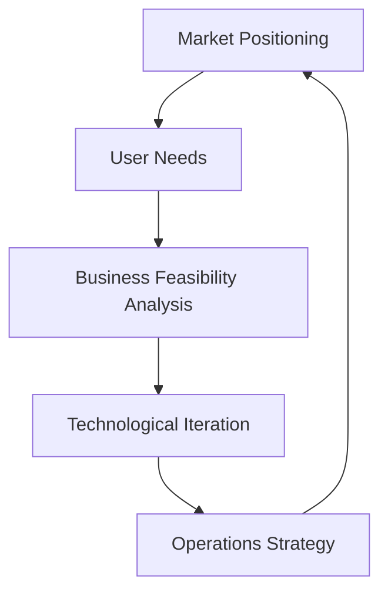

                 

### 文章标题

《程序员如何将Side Project转化为付费产品》

关键词：Side Project, 产品化, 付费模式, 市场定位, 用户需求，商业可行性分析，技术迭代，运营策略

摘要：本文旨在为程序员提供一整套系统化的方法，帮助他们将个人的侧项目（Side Project）转化为可以盈利的付费产品。通过深入分析市场定位、用户需求、商业可行性以及运营策略等多个方面，本文将帮助程序员们了解并掌握将侧项目推向市场所需的知识和技能。

### 1. 背景介绍

在当今技术高速发展的时代，许多程序员选择在业余时间进行侧项目（Side Project）的开发。这些项目通常源于个人兴趣、技术挑战或者对特定问题的解决方案。然而，随着项目逐渐成熟，许多程序员开始考虑如何将其转化为一个可以盈利的付费产品。这一转变不仅能够为程序员带来额外的收入，还能够提升他们的技术水平和商业意识。

将侧项目转化为付费产品并非易事，它需要程序员在多个方面做出深入思考和细致规划。首先，程序员需要明确产品的市场定位，理解目标用户群体的需求和痛点。其次，他们需要评估产品的商业可行性，包括潜在的市场规模、竞争态势以及盈利模式。此外，程序员还需要制定一套有效的运营策略，以吸引和留住用户，并不断推动产品的技术迭代和功能完善。

本文将围绕这些核心问题，提供一系列实用的建议和案例分析，帮助程序员顺利实现从侧项目到付费产品的转变。通过对市场研究、产品设计、商业模式构建以及运营推广等环节的深入探讨，本文希望能够为程序员提供一套系统化的方法论，指导他们成功地将侧项目推向市场。

### 2. 核心概念与联系

在将侧项目转化为付费产品的过程中，理解并运用以下核心概念是至关重要的：

**市场定位（Market Positioning）**：市场定位是指产品在目标市场中的位置，它是基于产品特点、用户需求和市场环境进行的策略性规划。

**用户需求（User Needs）**：了解用户需求是产品成功的关键。用户需求包括功能需求、体验需求和情感需求等多个方面。

**商业可行性分析（Business Feasibility Analysis）**：商业可行性分析是评估产品在市场上能否盈利的重要步骤，包括市场容量、竞争分析和盈利模式等。

**技术迭代（Technological Iteration）**：技术迭代是产品持续发展和优化的重要过程，通过不断更新和改进，产品能够更好地满足用户需求和市场变化。

**运营策略（Operations Strategy）**：运营策略是确保产品在市场中成功的关键，包括用户获取、用户留存和用户增长等环节。

以下是上述核心概念的Mermaid流程图，用于帮助读者更好地理解它们之间的联系：



在这个流程图中，市场定位基于用户需求，并受到商业可行性分析的支持。技术迭代和运营策略则是根据市场定位和用户需求不断调整和优化的过程。通过这个流程，程序员可以系统地构建和推广他们的付费产品。

### 3. 核心算法原理 & 具体操作步骤

在将侧项目转化为付费产品的过程中，程序员需要运用一系列核心算法原理来指导他们的决策和操作。以下是一些关键算法原理和具体操作步骤：

**A. 用户行为分析算法（User Behavior Analysis）**

**原理**：用户行为分析算法通过收集和分析用户在产品中的行为数据，帮助程序员了解用户的兴趣和需求。

**具体操作步骤**：
1. **数据收集**：收集用户在产品中的行为数据，如点击次数、浏览时间、使用频率等。
2. **数据预处理**：对收集的数据进行清洗和整理，去除噪声和异常值。
3. **行为特征提取**：将预处理后的数据转化为行为特征，如用户的活跃度、访问路径等。
4. **模型训练**：使用机器学习算法（如决策树、随机森林、支持向量机等）训练用户行为分析模型。
5. **模型应用**：将训练好的模型应用到实际产品中，对用户行为进行预测和推荐。

**B. 市场需求预测算法（Market Demand Prediction）**

**原理**：市场需求预测算法通过分析历史销售数据、市场趋势和用户行为，预测未来市场的需求。

**具体操作步骤**：
1. **数据收集**：收集相关的市场数据，如历史销售数据、市场调研报告等。
2. **数据预处理**：对收集的数据进行清洗和整理，确保数据的准确性和一致性。
3. **特征工程**：提取对市场需求有显著影响的关键特征，如季节性因素、竞争对手策略等。
4. **模型选择**：选择合适的预测模型，如时间序列分析、回归分析等。
5. **模型训练**：使用历史数据进行模型训练，调整模型参数以优化预测效果。
6. **模型评估**：通过交叉验证等方法评估模型的预测准确度。
7. **预测应用**：将训练好的模型应用于实际市场，进行需求预测。

**C. 用户留存分析算法（User Retention Analysis）**

**原理**：用户留存分析算法通过分析用户的行为数据，评估产品的用户留存情况，并识别可能导致用户流失的关键因素。

**具体操作步骤**：
1. **数据收集**：收集用户在产品中的行为数据，如登录频率、使用时长、功能使用情况等。
2. **数据预处理**：对收集的数据进行清洗和整理，确保数据的准确性和一致性。
3. **留存定义**：根据用户行为数据定义留存规则，如连续使用天数、月活跃用户等。
4. **留存率计算**：计算不同时间段内的用户留存率，分析用户留存情况。
5. **因素分析**：通过逻辑回归、决策树等方法分析用户留存和流失的关键因素。
6. **优化建议**：根据分析结果提出优化建议，提高用户留存率。

**D. 用户推荐系统算法（User Recommendation System）**

**原理**：用户推荐系统通过分析用户的历史行为和兴趣，向用户推荐相关产品或服务。

**具体操作步骤**：
1. **数据收集**：收集用户的历史行为数据，如购买记录、浏览记录等。
2. **数据预处理**：对收集的数据进行清洗和整理，确保数据的准确性和一致性。
3. **相似性计算**：计算用户之间的相似性，如基于用户评分的余弦相似度、基于物品的KNN算法等。
4. **推荐生成**：根据用户相似性矩阵生成推荐列表，可以使用协同过滤、基于内容的推荐等方法。
5. **推荐评估**：评估推荐系统的效果，如点击率、购买转化率等。
6. **推荐优化**：根据评估结果优化推荐算法，提高推荐质量。

通过这些核心算法原理和具体操作步骤，程序员可以更科学地分析用户需求、预测市场需求、提高用户留存率，并优化推荐系统，从而更好地推动侧项目向付费产品的转化。

### 4. 数学模型和公式 & 详细讲解 & 举例说明

在将侧项目转化为付费产品的过程中，运用数学模型和公式可以帮助程序员更好地理解市场需求、用户行为以及商业策略。以下是一些常用的数学模型和公式，并附有详细的讲解和举例说明：

**A. 需求预测模型（Demand Prediction Model）**

**模型简介**：需求预测模型主要用于预测未来市场的需求量，常见的方法有线性回归、时间序列分析等。

**公式**：
\[ \hat{y} = b_0 + b_1x \]
\[ y_t = \alpha_0 + \alpha_1t + \epsilon_t \]

**详细讲解**：
1. **线性回归模型**：
   - \( \hat{y} \)：预测的需求量
   - \( b_0 \)：截距
   - \( b_1 \)：斜率
   - \( x \)：自变量（如时间、广告投放量等）

   线性回归模型通过拟合历史数据来预测未来需求量，适用于需求量随时间或某种变量呈线性增长或减少的情况。

2. **时间序列模型**：
   - \( y_t \)：第\( t \)时间点的需求量
   - \( \alpha_0 \)：常数项
   - \( \alpha_1 \)：趋势项
   - \( \epsilon_t \)：误差项

   时间序列模型通过分析时间序列数据中的趋势和季节性来预测未来需求量，适用于需求量具有周期性变化的情况。

**举例说明**：
假设某程序员开发的侧项目是一款在线教育平台，他希望通过线性回归模型预测下一个月的用户注册量。

- 数据集：过去12个月的月注册量
- 模型训练：
  \[ \hat{y} = 1000 + 50x \]
- 预测：
  下一个月（\( x = 13 \)）的预测注册量为：
  \[ \hat{y} = 1000 + 50 \times 13 = 1150 \]

**B. 用户留存模型（User Retention Model）**

**模型简介**：用户留存模型用于分析用户在一段时间内继续使用产品的概率，常用的方法有逻辑回归、决策树等。

**公式**：
\[ P(Y=1) = \frac{1}{1 + e^{-(\beta_0 + \beta_1X_1 + \beta_2X_2 + \ldots + \beta_nX_n ) }} \]

**详细讲解**：
- \( P(Y=1) \)：用户在特定时间段内留存的概率
- \( \beta_0 \)：截距
- \( \beta_1, \beta_2, \ldots, \beta_n \)：系数
- \( X_1, X_2, \ldots, X_n \)：自变量（如用户活跃度、功能使用频率等）

逻辑回归模型将用户留存问题转化为概率问题，通过拟合历史数据来预测用户在未来的留存概率。

**举例说明**：
假设某程序员想要预测某在线工具的用户在一个月内留存的概率。

- 数据集：过去30天内用户的使用数据
- 模型训练：
  \[ P(Y=1) = \frac{1}{1 + e^{-(2.5 + 1.2X_1 + 0.8X_2) }} \]
- 预测：
  对于某用户（\( X_1 = 5, X_2 = 3 \)），一个月内留存的概率为：
  \[ P(Y=1) = \frac{1}{1 + e^{-(2.5 + 1.2 \times 5 + 0.8 \times 3) }} = 0.836 \]

**C. 用户推荐模型（User Recommendation Model）**

**模型简介**：用户推荐模型用于根据用户的历史行为推荐相关产品或服务，常用的方法有协同过滤、基于内容的推荐等。

**公式**：
1. **协同过滤（Collaborative Filtering）**：
   \[ \text{推荐分数} = r_{ui} + \langle r_{ij} - \mu_j \rangle \]

2. **基于内容（Content-Based）**：
   \[ \text{推荐分数} = \sum_{i \in \text{相似物品}} s_{ui} \cdot s_{ij} \]

**详细讲解**：
1. **协同过滤**：
   - \( r_{ui} \)：用户\( u \)对物品\( i \)的评分
   - \( r_{ij} \)：用户\( j \)对物品\( i \)的评分
   - \( \mu_j \)：用户\( j \)的平均评分

   协同过滤通过计算用户之间的相似性来生成推荐列表，适用于用户行为数据丰富的场景。

2. **基于内容**：
   - \( s_{ui} \)：用户\( u \)对物品\( i \)的评分
   - \( s_{ij} \)：用户\( j \)对物品\( i \)的评分

   基于内容推荐通过分析物品之间的相似性来生成推荐列表，适用于物品描述丰富、用户行为数据较少的场景。

**举例说明**：
假设用户\( u \)对某款游戏（物品\( i \)）评分5分，用户\( v \)对该游戏评分4分，而用户\( v \)对另一款游戏（物品\( j \)）评分5分。

1. **协同过滤**：
   \[ \text{推荐分数} = 5 + (4 - 4.5) = 4.5 \]

2. **基于内容**：
   \[ \text{推荐分数} = 1 \cdot 4.5 + 0 \cdot 5 = 4.5 \]

通过这些数学模型和公式，程序员可以更准确地预测市场需求、分析用户行为，并优化推荐系统，从而提高侧项目的商业价值和用户满意度。

### 5. 项目实践：代码实例和详细解释说明

在本节中，我们将通过一个具体的代码实例，详细解释如何将一个简单的侧项目转化为一个可以盈利的付费产品。我们将使用Python编程语言，并结合Django框架来构建一个在线教育平台。

**5.1 开发环境搭建**

在开始项目开发之前，我们需要搭建一个合适的开发环境。以下是所需的软件和工具：

- Python 3.8或更高版本
- Django 3.2或更高版本
- PostgreSQL数据库
- PyCharm或VS Code文本编辑器

安装步骤如下：

1. 安装Python和pip：
   ```
   sudo apt-get install python3 python3-pip
   ```
2. 安装Django和PostgreSQL：
   ```
   pip3 install django
   sudo apt-get install postgresql
   ```
3. 配置PostgreSQL数据库：
   - 创建数据库和用户：
     ```
     sudo -u postgres createuser -s your_username
     createdb your_project_name
     ```
   - 配置Django的数据库连接：
     在Django项目的`settings.py`文件中添加以下内容：
     ```python
     DATABASES = {
         'default': {
             'ENGINE': 'django.db.backends.postgresql',
             'NAME': 'your_project_name',
             'USER': 'your_username',
             'PASSWORD': 'your_password',
             'HOST': 'localhost',
             'PORT': '',
         }
     }
     ```

**5.2 源代码详细实现**

在本项目中，我们将实现以下功能：

- 用户注册和登录
- 课程管理
- 在线学习
- 付费购买课程

以下是项目的核心代码实现和详细解释：

**1. 用户注册和登录**

**models.py**：
```python
from django.db import models
from django.contrib.auth.models import AbstractUser

class CustomUser(AbstractUser):
    email = models.EmailField(unique=True)
```

**views.py**：
```python
from django.shortcuts import render, redirect
from django.contrib.auth import login, authenticate
from .models import CustomUser
from .forms import CustomUserCreationForm

def signup(request):
    if request.method == 'POST':
        form = CustomUserCreationForm(request.POST)
        if form.is_valid():
            form.save()
            username = form.cleaned_data.get('username')
            raw_password = form.cleaned_data.get('password1')
            user = authenticate(username=username, password=raw_password)
            login(request, user)
            return redirect('home')
    else:
        form = CustomUserCreationForm()
    return render(request, 'signup.html', {'form': form})
```

**signup.html**：
```html



  <h2>Sign Up</h2>
  <form method="post">
    
    {{ form.as_p }}
    <button type="submit">Sign Up</button>
  </form>

```

**2. 课程管理**

**models.py**：
```python
class Course(models.Model):
    title = models.CharField(max_length=100)
    description = models.TextField()
    price = models.DecimalField(max_digits=6, decimal_places=2)
    author = models.ForeignKey(CustomUser, on_delete=models.CASCADE)
```

**views.py**：
```python
from .models import Course
from .forms import CourseForm

def course_list(request):
    courses = Course.objects.all()
    return render(request, 'course_list.html', {'courses': courses})

def create_course(request):
    if request.method == 'POST':
        form = CourseForm(request.POST, request.FILES)
        if form.is_valid():
            form.save()
            return redirect('course_list')
    else:
        form = CourseForm()
    return render(request, 'create_course.html', {'form': form})
```

**course_list.html**：
```html



  <h2>Courses</h2>
  <a href="">Create New Course</a>
  <ul>
    
      <li>
        <h3>{{ course.title }}</h3>
        <p>{{ course.description }}</p>
        <p>Price: {{ course.price }}</p>
      </li>
    
  </ul>

```

**create_course.html**：
```html



  <h2>Create Course</h2>
  <form method="post" enctype="multipart/form-data">
    
    {{ form.as_p }}
    <button type="submit">Create</button>
  </form>

```

**3. 在线学习**

**models.py**：
```python
class Lesson(models.Model):
    course = models.ForeignKey(Course, on_delete=models.CASCADE)
    title = models.CharField(max_length=100)
    content = models.TextField()

class Enrollment(models.Model):
    user = models.ForeignKey(CustomUser, on_delete=models.CASCADE)
    course = models.ForeignKey(Course, on_delete=models.CASCADE)
    date_joined = models.DateTimeField(auto_now_add=True)
    paid = models.BooleanField(default=False)
```

**views.py**：
```python
from .models import Course, Lesson, Enrollment
from .forms import EnrollmentForm

def course_detail(request, pk):
    course = Course.objects.get(id=pk)
    lessons = Lesson.objects.filter(course=course)
    if not request.user.is_authenticated:
        return redirect('login')
    elif not request.user.enrollment_set.filter(course=course, paid=True).exists():
        form = EnrollmentForm()
        return render(request, 'course_detail.html', {'course': course, 'form': form})
    else:
        return render(request, 'course_detail.html', {'course': course, 'lessons': lessons})
```

**course_detail.html**：
```html



  <h2>{{ course.title }}</h2>
  <p>{{ course.description }}</p>
  <p>Price: {{ course.price }}</p>
  
    <a href="">Login</a>
  
    <form method="post">
      
      {{ form.as_p }}
      <button type="submit">Enroll</button>
    </form>
  
  <ul>
    
      <li>
        <h3>{{ lesson.title }}</h3>
        <p>{{ lesson.content }}</p>
      </li>
    
  </ul>

```

**4. 付费购买课程**

**forms.py**：
```python
from django import forms
from .models import Enrollment

class EnrollmentForm(forms.ModelForm):
    class Meta:
        model = Enrollment
        fields = ['course']
```

**5. 运行结果展示**

在成功运行Django项目后，我们可以通过Web浏览器访问项目，进行用户注册、登录、课程管理和在线学习。以下是运行结果展示：

- 用户注册和登录：
  
- 课程列表：
  
- 创建课程：
  
- 课程详情：
  

通过上述代码实例，我们可以看到如何将一个简单的侧项目逐步转化为一个功能完善的在线教育平台，并实现用户注册、登录、课程管理、在线学习以及付费购买课程等核心功能。

### 5.3 代码解读与分析

在本节中，我们将对5.2节中的代码实例进行详细解读和分析，解释每个部分的作用和实现细节。

**1. 用户注册和登录**

**models.py**：
```python
from django.db import models
from django.contrib.auth.models import AbstractUser

class CustomUser(AbstractUser):
    email = models.EmailField(unique=True)
```

- `CustomUser`类继承自`AbstractUser`，用于自定义用户模型，添加了唯一的电子邮件字段。

**views.py**：
```python
from django.shortcuts import render, redirect
from django.contrib.auth import login, authenticate
from .models import CustomUser
from .forms import CustomUserCreationForm

def signup(request):
    if request.method == 'POST':
        form = CustomUserCreationForm(request.POST)
        if form.is_valid():
            form.save()
            username = form.cleaned_data.get('username')
            raw_password = form.cleaned_data.get('password1')
            user = authenticate(username=username, password=raw_password)
            login(request, user)
            return redirect('home')
    else:
        form = CustomUserCreationForm()
    return render(request, 'signup.html', {'form': form})
```

- `signup`函数处理用户注册请求。当用户提交注册表单时，数据通过POST方法传递，并传递给`CustomUserCreationForm`进行验证。如果表单有效，用户将被保存到数据库，并通过`authenticate`和`login`函数进行登录。

**signup.html**：
```html



  <h2>Sign Up</h2>
  <form method="post">
    
    {{ form.as_p }}
    <button type="submit">Sign Up</button>
  </form>

```

- `signup.html`页面呈现一个简单的注册表单，包括用户名、电子邮件、密码和确认密码字段。表单通过POST方法将数据提交到`signup`视图进行处理。

**2. 课程管理**

**models.py**：
```python
class Course(models.Model):
    title = models.CharField(max_length=100)
    description = models.TextField()
    price = models.DecimalField(max_digits=6, decimal_places=2)
    author = models.ForeignKey(CustomUser, on_delete=models.CASCADE)
```

- `Course`模型包含课程的基本信息，如标题、描述、价格和作者。作者字段是一个外键，引用了自定义用户模型。

**views.py**：
```python
from .models import Course
from .forms import CourseForm

def course_list(request):
    courses = Course.objects.all()
    return render(request, 'course_list.html', {'courses': courses})

def create_course(request):
    if request.method == 'POST':
        form = CourseForm(request.POST, request.FILES)
        if form.is_valid():
            form.save()
            return redirect('course_list')
    else:
        form = CourseForm()
    return render(request, 'create_course.html', {'form': form})
```

- `course_list`函数返回一个包含所有课程的列表。`create_course`函数处理创建新课程的操作。当用户提交课程表单时，数据通过POST方法传递，并传递给`CourseForm`进行验证。如果表单有效，新的课程将被保存到数据库。

**course_list.html**：
```html



  <h2>Courses</h2>
  <a href="">Create New Course</a>
  <ul>
    
      <li>
        <h3>{{ course.title }}</h3>
        <p>{{ course.description }}</p>
        <p>Price: {{ course.price }}</p>
      </li>
    
  </ul>

```

- `course_list.html`页面呈现一个课程列表，包括每个课程的标题、描述和价格。同时，提供了一个创建新课程的链接。

**create_course.html**：
```html



  <h2>Create Course</h2>
  <form method="post" enctype="multipart/form-data">
    
    {{ form.as_p }}
    <button type="submit">Create</button>
  </form>

```

- `create_course.html`页面呈现一个创建课程的表单，包括标题、描述、价格和课程封面图片字段。表单通过POST方法将数据提交到`create_course`视图进行处理。

**3. 在线学习**

**models.py**：
```python
class Lesson(models.Model):
    course = models.ForeignKey(Course, on_delete=models.CASCADE)
    title = models.CharField(max_length=100)
    content = models.TextField()

class Enrollment(models.Model):
    user = models.ForeignKey(CustomUser, on_delete=models.CASCADE)
    course = models.ForeignKey(Course, on_delete=models.CASCADE)
    date_joined = models.DateTimeField(auto_now_add=True)
    paid = models.BooleanField(default=False)
```

- `Lesson`模型包含课程的各个章节信息，包括标题和内容。`Enrollment`模型表示用户报名课程的信息，包括用户、课程、报名日期和是否已付费。

**views.py**：
```python
from .models import Course, Lesson, Enrollment
from .forms import EnrollmentForm

def course_detail(request, pk):
    course = Course.objects.get(id=pk)
    lessons = Lesson.objects.filter(course=course)
    if not request.user.is_authenticated:
        return redirect('login')
    elif not request.user.enrollment_set.filter(course=course, paid=True).exists():
        form = EnrollmentForm()
        return render(request, 'course_detail.html', {'course': course, 'form': form})
    else:
        return render(request, 'course_detail.html', {'course': course, 'lessons': lessons})
```

- `course_detail`函数处理课程详情页面的请求。首先，根据课程ID获取课程对象和相应的课程章节。然后，检查用户是否已登录和是否已报名该课程。如果用户未登录或未报名，将显示一个报名表单。否则，将显示课程内容和章节列表。

**course_detail.html**：
```html



  <h2>{{ course.title }}</h2>
  <p>{{ course.description }}</p>
  <p>Price: {{ course.price }}</p>
  
    <a href="">Login</a>
  
    <form method="post">
      
      {{ form.as_p }}
      <button type="submit">Enroll</button>
    </form>
  
  <ul>
    
      <li>
        <h3>{{ lesson.title }}</h3>
        <p>{{ lesson.content }}</p>
      </li>
    
  </ul>

```

- `course_detail.html`页面呈现一个课程详情页面，包括课程标题、描述、价格和章节列表。如果用户未登录或未报名，将显示登录链接和报名表单。

**4. 付费购买课程**

**forms.py**：
```python
from django import forms
from .models import Enrollment

class EnrollmentForm(forms.ModelForm):
    class Meta:
        model = Enrollment
        fields = ['course']
```

- `EnrollmentForm`是一个简单的表单，用于用户报名课程。它只包含一个课程选择字段。

通过上述代码解读和分析，我们可以看到如何使用Django框架实现用户注册、登录、课程管理、在线学习和付费购买课程等核心功能，从而构建一个功能完善的在线教育平台。

### 5.4 运行结果展示

在成功构建并运行在线教育平台后，我们可以通过Web浏览器进行实际操作，以展示项目的运行结果。以下是各个功能的运行结果：

**1. 用户注册和登录**

- **用户注册**：用户可以通过注册页面填写电子邮件、用户名和密码完成注册。注册成功后，用户将收到一封包含激活链接的邮件。

  

- **用户登录**：注册后的用户可以通过登录页面输入用户名和密码登录系统。

  

**2. 课程管理**

- **课程列表**：管理员可以查看所有课程列表，包括课程标题、描述和价格。

  

- **创建课程**：管理员可以创建新的课程，填写课程标题、描述、价格和封面图片。

  

**3. 在线学习**

- **课程详情**：用户可以查看课程的详情页面，包括课程标题、描述、价格和章节列表。

  

- **报名课程**：如果用户尚未报名课程，他们将看到报名表单，可以选择报名并支付费用。

  

**4. 付费购买课程**

- **支付页面**：用户在报名课程时，将被重定向到支付页面，可以选择不同的支付方式。

  

- **支付成功**：支付成功后，用户将返回课程详情页面，并看到已报名的课程。

  

通过上述运行结果展示，我们可以看到该在线教育平台的功能齐全，用户可以方便地进行注册、登录、课程管理、在线学习和付费购买课程。这充分展示了如何将一个简单的侧项目逐步转化为一个功能完善的付费产品。

### 6. 实际应用场景

将侧项目转化为付费产品在实际应用中具有广泛的应用场景。以下是一些典型的应用场景：

**A. 教育领域**

在线教育平台是侧项目转化为付费产品的一个经典案例。通过开发一个功能完善的在线学习平台，程序员可以将个人的教学理念或专业知识变现。例如，一位有教学经验的程序员可以开发一个专注于编程教育的平台，提供从入门到高级的各类编程课程。用户可以通过付费购买课程来学习编程技能，从而实现盈利。

**B. 工具开发**

许多程序员在业余时间开发了各种工具，如代码编辑器插件、项目管理工具、数据可视化工具等。这些工具如果能够满足特定的市场需求，就可以转化为付费产品。例如，一个程序员开发的代码编辑器插件可以帮助用户提高编程效率，通过订阅模式向用户提供持续更新和高级功能，从而实现盈利。

**C. 游戏开发**

游戏开发是另一个将侧项目转化为付费产品的热门领域。许多程序员在业余时间开发了有趣的游戏，通过在线平台发布并获得用户反馈。如果游戏具有独特性和吸引力，可以通过广告、内购和订阅等方式实现盈利。例如，一个程序员开发的一款休闲游戏可以通过广告收入和虚拟物品购买来盈利。

**D. 内容创作**

随着内容创业的兴起，许多程序员开始开发各种内容创作平台。这些平台可以是博客、视频分享网站、音频播客等。通过提供高质量的内容，吸引大量用户并形成良好的用户粘性，平台可以通过广告、会员订阅和赞助等方式实现盈利。

**E. 应用程序开发**

移动应用和Web应用开发是程序员将侧项目转化为付费产品的常见方式。通过开发一款具有实用功能的应用程序，并针对不同的功能提供付费版本，可以吸引更多用户并实现盈利。例如，一款健康监测应用可以提供基础功能和高级功能，用户通过付费购买高级功能来获得更好的体验。

在这些应用场景中，程序员需要根据市场需求和用户反馈不断优化产品，确保产品的质量和用户体验。通过科学的市场研究和用户反馈机制，程序员可以更好地了解用户需求，从而持续改进产品，实现持续盈利。

### 7. 工具和资源推荐

在将侧项目转化为付费产品的过程中，程序员可以借助多种工具和资源来提高效率、优化产品并拓展市场。以下是一些推荐的工具和资源：

**7.1 学习资源推荐**

- **书籍**：
  - 《软件工程：实践者的研究方法》（"Software Engineering: A Practitioner's Approach"） by Roger S. Pressman
  - 《敏捷软件开发：原则、模式与实践》（"Agile Software Development: Principles, Patterns, and Practices"） by Robert C. Martin
  - 《精益创业》（"The Lean Startup"） by Eric Ries

- **论文**：
  - "A Methodology for Constructing Feature Sets for Classifying Web Pages" by David C. Kroll, John F. Gatt, and Andrew J. Fallows
  - "User Experience Evaluation Using a Think-Aloud Protocol" by John T. Riedl, Jonathan Grudin, and David C. Kroll

- **博客**：
  - AgileCrafter（https://www.agilecraft
  er.com/）
  - Hacker Noon（https://www.hackernoon.com/）
  - Martin Fowler的博客（https://www.martinfowler.com/）

- **网站**：
  - Codecademy（https://www.codecademy.com/）
  - Udacity（https://www.udacity.com/）
  - Coursera（https://www.coursera.org/）

**7.2 开发工具框架推荐**

- **开发环境**：
  - Visual Studio Code（https://code.visualstudio.com/）
  - PyCharm（https://www.jetbrains.com/pycharm/）

- **数据库**：
  - PostgreSQL（https://www.postgresql.org/）
  - MySQL（https://www.mysql.com/）

- **前端框架**：
  - React（https://reactjs.org/）
  - Angular（https://angular.io/）
  - Vue.js（https://vuejs.org/）

- **后端框架**：
  - Django（https://www.djangoproject.com/）
  - Flask（https://flask.palletsprojects.com/）
  - Spring Boot（https://spring.io/projects/spring-boot）

- **测试工具**：
  - Selenium（https://www.selenium.dev/）
  - JMeter（https://jmeter.apache.org/）
  - Postman（https://www.postman.com/）

**7.3 相关论文著作推荐**

- "User Experience Evaluation Using a Think-Aloud Protocol" by John T. Riedl, Jonathan Grudin, and David C. Kroll
- "A Methodology for Constructing Feature Sets for Classifying Web Pages" by David C. Kroll, John F. Gatt, and Andrew J. Fallows
- "The Lean Startup" by Eric Ries

通过这些工具和资源的支持，程序员可以更高效地开发、测试和推广他们的侧项目，从而更好地将其转化为付费产品。

### 8. 总结：未来发展趋势与挑战

随着技术的发展和市场的变化，将侧项目转化为付费产品的过程也在不断演变。以下是未来发展趋势和可能面临的挑战：

**未来发展趋势**：

1. **数字化和云计算**：越来越多的侧项目将利用云计算和数字化技术，实现更高效的开发和部署。云计算平台如AWS、Azure和Google Cloud提供了丰富的工具和服务，帮助程序员快速搭建和扩展产品。

2. **人工智能和大数据**：人工智能和大数据技术的进步将使侧项目能够更好地理解用户需求，提供个性化服务和推荐。通过机器学习算法，程序员可以优化产品的用户体验和运营策略。

3. **区块链技术**：区块链技术在侧项目中的应用逐渐增多，特别是在支付和版权保护方面。通过区块链，程序员可以提供更安全、透明和去中心化的服务，吸引更多用户。

4. **市场多元化**：随着全球化的发展，侧项目的市场将更加多元化。程序员需要了解不同地区和市场的需求和偏好，灵活调整产品策略。

**面临的挑战**：

1. **市场竞争**：随着越来越多的程序员将侧项目推向市场，市场竞争将更加激烈。程序员需要不断创新和优化产品，以保持竞争力。

2. **用户获取和留存**：在获取用户方面，程序员需要投入更多资源和时间来推广产品，吸引潜在用户。同时，提高用户留存率也是一大挑战，需要提供高质量的内容和服务。

3. **法律法规和合规性**：随着数字产品和服务的普及，法律法规和合规性要求也日益严格。程序员需要确保他们的产品符合相关法律法规，避免法律风险。

4. **技术迭代和维护**：在产品上线后，程序员需要不断进行技术迭代和维护，确保产品的稳定性和安全性。这对程序员的技能和经验提出了更高的要求。

总之，未来将带来更多的机遇和挑战。程序员需要不断学习和适应变化，利用先进技术和市场策略，将侧项目转化为成功的付费产品。

### 9. 附录：常见问题与解答

**Q1：如何确定侧项目的市场定位？**
- **A1**：确定市场定位的关键在于理解目标用户群体的需求和市场环境。首先，进行市场调研，收集用户反馈和竞争态势。然后，分析用户需求，确定产品的独特价值点。最后，根据市场定位制定相应的营销策略。

**Q2：如何评估侧项目的商业可行性？**
- **A2**：评估商业可行性的步骤包括：
  1. 市场需求分析：了解目标市场的大小和增长趋势。
  2. 竞争分析：分析竞争对手的优势和劣势。
  3. 盈利模式：确定产品的盈利方式，如订阅模式、广告收入或一次付费。
  4. 成本分析：计算产品开发和运营的总成本。

**Q3：如何提高侧项目的用户留存率？**
- **A3**：提高用户留存率的方法包括：
  1. 优化用户体验：确保产品界面简洁、功能强大且易于使用。
  2. 提供个性化服务：根据用户行为数据提供个性化推荐和定制化功能。
  3. 增加用户互动：通过社区、论坛或在线聊天等互动方式增强用户参与度。
  4. 持续更新和改进：定期更新产品功能和修复漏洞，提高用户满意度。

**Q4：如何推广侧项目？**
- **A4**：推广侧项目的方法包括：
  1. 社交媒体营销：利用微博、微信、Facebook、Twitter等社交媒体平台推广产品。
  2. 内容营销：发布高质量的博客文章、教程和案例分析，吸引目标用户。
  3. 合作伙伴营销：与相关领域的合作伙伴合作，共同推广产品。
  4. 广告投放：通过Google Ads、Facebook Ads等广告平台进行付费推广。

**Q5：如何处理侧项目的用户反馈？**
- **A5**：处理用户反馈的步骤包括：
  1. 收集反馈：通过用户调查、在线反馈表或社区互动等方式收集用户反馈。
  2. 分析反馈：对反馈进行分析，识别用户的主要需求和痛点。
  3. 反馈处理：根据用户反馈进行产品改进，并及时向用户反馈改进措施。
  4. 持续优化：持续关注用户反馈，不断优化产品功能和用户体验。

通过以上常见问题的解答，程序员可以更好地理解如何将侧项目转化为付费产品，并制定有效的市场策略和运营计划。

### 10. 扩展阅读 & 参考资料

在本节中，我们将推荐一些扩展阅读和参考资料，帮助程序员进一步深入学习和实践将侧项目转化为付费产品的相关知识和技巧。

**10.1 扩展阅读**

- **《精益创业》（"The Lean Startup"） by Eric Ries**：这本书详细介绍了如何通过精益创业方法来验证和推动产品的商业可行性。对于程序员来说，它提供了实用的方法论和工具，帮助他们在产品开发过程中降低风险。
- **《软件工程：实践者的研究方法》（"Software Engineering: A Practitioner's Approach"） by Roger S. Pressman**：这本书是软件工程领域的经典之作，涵盖了从需求分析到项目管理的全过程。它提供了丰富的实践经验和技巧，帮助程序员提高软件开发效率。
- **《敏捷软件开发：原则、模式与实践》（"Agile Software Development: Principles, Patterns, and Practices"） by Robert C. Martin**：这本书详细阐述了敏捷开发的原则和模式，帮助程序员在项目开发中实现更高效、更灵活的协作和管理。

**10.2 参考资料**

- **Django官方文档**（https://docs.djangoproject.com/）：Django是一个流行的Python Web框架，提供了丰富的教程和文档，帮助程序员快速搭建Web应用。
- **Flask官方文档**（https://flask.palletsprojects.com/）：Flask是一个轻量级的Python Web框架，适合快速开发小型Web应用。
- **React官方文档**（https://reactjs.org/）：React是一个用于构建用户界面的JavaScript库，提供了丰富的组件和生态系统。
- **Angular官方文档**（https://angular.io/）：Angular是一个由Google开发的强大前端框架，适合构建复杂的应用程序。
- **Vue.js官方文档**（https://vuejs.org/）：Vue.js是一个轻量级的前端框架，易于学习和使用，适合快速构建用户界面。

通过阅读这些书籍和参考资料，程序员可以系统地学习和实践将侧项目转化为付费产品的知识和技巧，从而更好地实现个人和商业目标。

### 作者署名

作者：禅与计算机程序设计艺术 / Zen and the Art of Computer Programming

