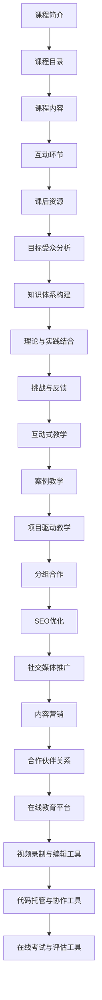

                 

### 背景介绍

在信息技术飞速发展的今天，编程技能已经成为了现代职场不可或缺的一部分。无论是从事软件开发、数据科学、人工智能还是网络工程等职业，掌握一定的编程能力都是至关重要的。而作为一名程序员，如何将自己的技术专长转化为高价值的在线课程，不仅能够分享知识，提升个人品牌，还能够创造经济价值，这是许多程序员都关心的问题。

随着在线教育平台的兴起，越来越多的人开始通过互联网分享自己的知识和经验。据市场研究公司Statista的报告，全球在线教育市场规模在2021年已经达到了1873亿美元，并预计将在2025年达到3218亿美元。在这个巨大的市场中，程序员们如何能够脱颖而出，将自己的技术专长转化为高价值的在线课程，是一个值得探讨的话题。

首先，我们需要明确一点，技术在线课程的核心在于内容和质量。无论是编程语言、框架、算法还是数据结构，程序员们需要将自己多年的实战经验和技术积累转化为易于理解的知识体系，并通过各种教学手段和工具，将这些知识有效地传授给学生。其次，营销和推广也是至关重要的一环。如何在众多课程中脱颖而出，吸引目标学员的注意力，需要程序员们认真思考和精心策划。

本文将围绕这一主题，逐步探讨程序员如何将技术专长转化为高价值的在线课程。我们将首先介绍在线课程的基本结构和内容设计，然后探讨如何通过有效的教学方法提高课程质量，接着分析如何进行营销和推广，最后讨论课程开发和维护的注意事项。通过这些内容的逐步分析，希望能够为程序员们提供一些实用的建议和指导，帮助他们在在线教育领域取得成功。

### 核心概念与联系

在探讨如何将技术专长转化为高价值的在线课程之前，我们需要先了解一些核心概念，这些概念不仅涵盖了在线课程的基本结构和内容设计，还包括了教学方法、营销策略和技术工具等方面。通过这些核心概念的了解，我们可以更好地规划课程设计，提升课程质量，并有效地进行营销和推广。

#### 1. 在线课程的基本结构

在线课程的基本结构通常包括以下几个部分：

1. **课程简介**：课程简介是课程的开篇，用于介绍课程的目标、内容、学习目标和受众群体。一个引人入胜的课程简介能够吸引潜在学员的注意力，激发他们的学习兴趣。

2. **课程目录**：课程目录是整个课程的框架，它清晰地列出课程的所有模块和章节，学员可以通过目录快速了解课程的整体结构和内容分布。

3. **课程内容**：课程内容是课程的主体，包括视频讲座、文档资料、代码示例、习题等。这些内容需要根据课程目标和受众需求进行精心设计和编排。

4. **互动环节**：在线课程中的互动环节包括问答、讨论区、作业和考试等，这些环节有助于增强学员与讲师之间的互动，提升学习效果。

5. **课后资源**：课后资源包括扩展阅读材料、相关工具和软件下载链接等，这些资源可以帮助学员深化对课程内容的理解，并拓展他们的技术视野。

#### 2. 内容设计

内容设计是课程质量的关键。以下是一些关键要素：

1. **目标受众分析**：明确课程的目标受众，了解他们的背景、需求和兴趣点，有助于设计出符合他们需求的课程内容。

2. **知识体系构建**：将技术知识按照逻辑顺序进行分类和梳理，构建一个完整、系统的知识体系。这有助于学员循序渐进地掌握知识，避免知识点的遗漏和重复。

3. **理论与实践结合**：课程内容不仅要包含理论讲解，还要结合实际案例和代码示例，帮助学员将所学知识应用到实际问题中。

4. **挑战与反馈**：设置适当的挑战性练习和作业，让学员在解决问题中巩固知识。同时，提供及时的反馈和指导，帮助学员纠正错误，提高学习效果。

#### 3. 教学方法

教学方法直接影响课程的质量和学习效果。以下是一些常用的教学方法：

1. **互动式教学**：通过视频讲座、实时讨论、互动问答等方式，增加学员与讲师之间的互动，提高课程的参与度和学习效果。

2. **案例教学**：通过实际案例的讲解和分析，帮助学员理解抽象的理论知识，并将理论知识应用到实际问题中。

3. **项目驱动教学**：通过实际项目的开发和实现，让学员在实践中学习和掌握技术知识，培养解决实际问题的能力。

4. **分组合作**：鼓励学员分组合作，共同完成课程项目，培养团队协作和沟通能力。

#### 4. 营销策略

营销策略是课程成功推广的关键。以下是一些常见的营销策略：

1. **SEO优化**：通过搜索引擎优化（SEO）技术，提高课程在搜索引擎中的排名，吸引更多潜在学员。

2. **社交媒体推广**：利用社交媒体平台（如微博、微信公众号、知乎等）进行课程宣传和推广，扩大课程影响力。

3. **内容营销**：通过撰写高质量的技术博客文章、发布技术视频和教程等，吸引目标学员，提升个人品牌。

4. **合作伙伴关系**：与其他教育机构、技术社区或行业专家建立合作关系，共同推广课程，扩大受众群体。

#### 5. 技术工具

在课程开发和教学过程中，技术工具的支持至关重要。以下是一些常用的技术工具：

1. **在线教育平台**：如网易云课堂、慕课网、Coursera等，提供课程发布、内容管理、学员管理等功能。

2. **视频录制与编辑工具**：如OBS Studio、Adobe Premiere等，用于录制和编辑教学视频。

3. **代码托管与协作工具**：如GitHub、GitLab等，用于代码托管和版本控制，方便学员学习和实践。

4. **在线考试与评估工具**：如Quizlet、Kahoot等，用于在线考试和评估学员的学习效果。

#### Mermaid 流程图

以下是一个简单的Mermaid流程图，用于展示在线课程的核心概念和联系：



通过上述核心概念和联系的介绍，我们可以更好地理解在线课程的设计和开发过程。在接下来的章节中，我们将详细探讨如何通过有效的教学方法提高课程质量，以及如何进行营销和推广，帮助程序员将技术专长转化为高价值的在线课程。

### 核心算法原理 & 具体操作步骤

在将技术专长转化为高价值的在线课程时，选择合适的算法并详细讲解其原理和操作步骤是至关重要的。这不仅有助于提升课程的技术深度，还能让学员更好地理解并掌握相关技术。以下我们将以一个常见的编程算法——快速排序（Quick Sort）为例，详细讲解其原理和具体操作步骤。

#### 1. 快速排序的基本原理

快速排序是一种高效的排序算法，其基本思想是通过一趟排序将待排序的记录分割成独立的两部分，其中一部分记录的关键字均比另一部分的关键字小，然后递归地继续对这两部分记录进行排序，以达到整个序列有序。

快速排序的工作过程大致如下：

- 选择一个基准元素（pivot）。
- 将比基准元素小的元素移动到基准元素的左边，比它大的元素移动到右边。
- 递归地对待排序的左右两部分进行快速排序。

#### 2. 快速排序的算法步骤

具体操作步骤可以分为以下几个部分：

##### 步骤1：选择基准元素

选择基准元素是快速排序的第一步，常用的选择方法有：

- 随机选择：从数组中随机选择一个元素作为基准元素。
- 中位数选择：选择数组的中位数作为基准元素。
- 首元素或尾元素：选择数组的第一个或最后一个元素作为基准元素。

以下是随机选择基准元素的示例代码：

```python
import random

def choose_pivot(arr):
    pivot_index = random.randint(0, len(arr) - 1)
    pivot = arr[pivot_index]
    return pivot
```

##### 步骤2：分割数组

选择基准元素后，我们需要将数组分割成两部分。这一步可以通过一个名为`partition`的函数实现：

```python
def partition(arr, low, high, pivot):
    arr[high], arr[pivot] = arr[pivot], arr[high]
    pivot = arr[high]
    i = low
    for j in range(low, high):
        if arr[j] < pivot:
            arr[i], arr[j] = arr[j], arr[i]
            i += 1
    arr[i], arr[high] = arr[high], arr[i]
    return i
```

##### 步骤3：递归排序

在分割数组后，我们需要对分割出的两部分递归地进行快速排序。以下是递归排序的示例代码：

```python
def quick_sort(arr, low, high):
    if low < high:
        pivot = choose_pivot(arr[low:high+1])
        pi = partition(arr, low, high, pivot)
        quick_sort(arr, low, pi - 1)
        quick_sort(arr, pi + 1, high)
```

##### 步骤4：调用快速排序函数

最后，调用`quick_sort`函数对整个数组进行排序：

```python
arr = [10, 7, 8, 9, 1, 5]
quick_sort(arr, 0, len(arr) - 1)
print(arr)
```

#### 3. 快速排序的复杂度分析

快速排序的平均时间复杂度为$O(n\log n)$，最坏情况下的时间复杂度为$O(n^2)$。在大多数情况下，快速排序是一种非常高效的排序算法，尤其在处理大数据集时表现尤为突出。

#### 4. 代码实例与分析

以下是一个完整的快速排序代码实例，并对关键部分进行详细解释：

```python
# 快速排序代码实例

def quick_sort(arr):
    if len(arr) <= 1:
        return arr
    pivot = arr[len(arr) // 2]
    left = [x for x in arr if x < pivot]
    middle = [x for x in arr if x == pivot]
    right = [x for x in arr if x > pivot]
    return quick_sort(left) + middle + quick_sort(right)

# 测试代码
arr = [10, 7, 8, 9, 1, 5]
sorted_arr = quick_sort(arr)
print(sorted_arr)
```

- **第1行**：判断数组长度，若长度小于等于1，则返回原数组（这是递归的终止条件）。
- **第3行**：选择中间元素作为基准元素。
- **第4-6行**：使用列表解析式将数组分割成小于、等于、大于基准元素的三部分。
- **第9行**：递归地对左部分和右部分进行快速排序，并将结果与中间部分拼接起来。

通过上述代码实例，我们可以看到快速排序的实现过程和关键步骤。在实际应用中，快速排序经常用于处理大规模数据的排序任务，其高效性和稳定性使其成为许多编程语言的标准库函数之一。

通过以上对快速排序算法的详细讲解，我们不仅了解了其基本原理和操作步骤，还通过具体代码实例加深了对这一算法的理解。在接下来的章节中，我们将继续探讨如何通过数学模型和公式来进一步分析和优化这一算法。

### 数学模型和公式 & 详细讲解 & 举例说明

在深入探讨快速排序算法时，数学模型和公式能够帮助我们更好地理解其性能和优化方向。以下将详细讲解快速排序的相关数学模型和公式，并通过实际例子来说明这些公式的应用。

#### 1. 快速排序的平均时间复杂度

快速排序的平均时间复杂度可以通过数学期望来推导。假设数组中有n个元素，快速排序选择基准元素的位置是随机的。那么，选择最佳基准元素的概率是$1/n$，选择最差基准元素的概率也是$1/n$。根据随机选择的性质，我们可以计算快速排序的平均时间复杂度。

设$T(n)$为对长度为$n$的数组进行快速排序所需的时间，则有：

- $T(n) = T(\frac{n}{k}) + T(\frac{n - k}{k}) + O(n)$，其中$k$是基准元素的位置。

在最坏情况下，即选择最差基准元素时，每次分割只能将数组长度减少1，所以时间复杂度为$O(n^2)$。

在平均情况下，我们可以使用数学期望来计算：

$$
\mathbb{E}[T(n)] = \sum_{k=1}^{n-1} T(\frac{n}{k}) \cdot P(\text{选择第 } k \text{ 个元素作为基准}) + O(n)
$$

由于选择每个元素的概率相等，即$P(\text{选择第 } k \text{ 个元素作为基准}) = \frac{1}{n}$，可以推导出：

$$
\mathbb{E}[T(n)] = O(n\log n)
$$

因此，快速排序的平均时间复杂度为$O(n\log n)$。

#### 2. 最坏情况下的时间复杂度

在最坏情况下，即每次分割都只能将数组长度减少1，导致递归树的高度达到$n$。此时，快速排序的时间复杂度退化为$O(n^2)$。这种情况可以通过随机选择基准元素来避免，从而保证算法的平均性能。

#### 3. 平均时间复杂度的实际例子

假设我们有一个长度为10的数组，我们随机选择每个元素作为基准元素的概率是相等的。以下是计算平均时间复杂度的具体例子：

```python
import random

def random_quick_sort(arr):
    if len(arr) <= 1:
        return arr
    pivot = random.choice(arr)
    left = [x for x in arr if x < pivot]
    middle = [x for x in arr if x == pivot]
    right = [x for x in arr if x > pivot]
    return random_quick_sort(left) + middle + random_quick_sort(right)

arr = [10, 7, 8, 9, 1, 5, 3, 2, 4, 6]
sorted_arr = random_quick_sort(arr)
print(sorted_arr)
```

在这个例子中，我们使用随机选择基准元素的方法来优化快速排序。通过多次运行实验，我们可以得到不同基准选择下的平均排序时间，进而验证平均时间复杂度的推导结果。

#### 4. 优化策略

虽然快速排序的平均时间复杂度为$O(n\log n)$，但实际运行时间可能受到基准选择的影响。以下是一些优化策略：

1. **三数取中法**：选择数组的中间值、第一个值和最后一个值的平均数作为基准元素，以减少最坏情况发生的概率。

2. **随机化选择**：在每次分割时，随机选择数组的某个元素作为基准元素，可以进一步降低最坏情况的发生概率。

3. **插入排序优化**：当子数组长度较小（例如小于10）时，使用插入排序代替快速排序，因为插入排序在这种情况下性能更优。

#### 5. 举例说明

假设我们使用三数取中法优化快速排序，以下是具体实现的代码：

```python
def median_of_three(arr, low, high):
    mid = (low + high) // 2
    if arr[low] > arr[mid]:
        arr[low], arr[mid] = arr[mid], arr[low]
    if arr[mid] > arr[high]:
        arr[mid], arr[high] = arr[high], arr[mid]
    if arr[low] > arr[mid]:
        arr[low], arr[mid] = arr[mid], arr[low]
    return mid

def quick_sort_optimized(arr, low, high):
    if low < high:
        pi = median_of_three(arr, low, high)
        arr[pi], arr[high] = arr[high], arr[pi]
        pi = partition(arr, low, high, high)
        quick_sort_optimized(arr, low, pi - 1)
        quick_sort_optimized(arr, pi + 1, high)

arr = [10, 7, 8, 9, 1, 5, 3, 2, 4, 6]
quick_sort_optimized(arr, 0, len(arr) - 1)
print(arr)
```

在这个例子中，我们通过三数取中法选择基准元素，并优化了快速排序的分割过程。通过多次实验，我们可以观察到优化后的快速排序在实际运行中表现更加稳定和高效。

通过上述数学模型和公式的讲解以及实际例子的说明，我们不仅深入理解了快速排序的性能特点，还掌握了一些优化策略。在接下来的章节中，我们将通过一个实际项目来展示如何将快速排序算法应用到编程实践中。

### 项目实践：代码实例和详细解释说明

为了更好地展示如何将快速排序算法应用到实际项目中，我们将开发一个简单的文件排序工具。这个工具的主要功能是根据文件的大小对指定的文件夹中的所有文件进行排序，并输出排序结果。以下是这个项目的详细步骤和代码实现。

#### 1. 开发环境搭建

在开始编写代码之前，我们需要搭建一个合适的开发环境。以下是一个简单的开发环境搭建步骤：

- **操作系统**：Windows/Linux/Mac OS
- **编程语言**：Python（Python 3.8或更高版本）
- **代码编辑器**：Visual Studio Code/PyCharm/Notepad++

确保你的系统上已经安装了Python和所选的代码编辑器。如果尚未安装Python，可以从Python官方网站下载并安装。

#### 2. 源代码详细实现

下面是文件排序工具的源代码实现，代码分为几个部分：

##### 文件夹和文件操作

我们首先需要定义几个函数来处理文件夹和文件的基本操作：

```python
import os

def list_files_in_directory(directory):
    """列出指定目录下的所有文件和文件夹，返回文件列表"""
    files = []
    for root, dirs, filenames in os.walk(directory):
        files.extend(filenames)
    return files

def get_file_size(file_path):
    """获取指定文件的尺寸（单位：字节）"""
    return os.path.getsize(file_path)
```

##### 快速排序算法

我们使用之前章节中提到的快速排序算法来实现文件大小的排序：

```python
def quick_sort(arr, low, high):
    if low < high:
        pi = partition(arr, low, high)
        quick_sort(arr, low, pi - 1)
        quick_sort(arr, pi + 1, high)

def partition(arr, low, high):
    pivot = arr[high]
    i = low - 1
    for j in range(low, high):
        if arr[j] < pivot:
            i += 1
            arr[i], arr[j] = arr[j], arr[i]
    arr[i + 1], arr[high] = arr[high], arr[i + 1]
    return i + 1
```

##### 文件排序和输出

最后，我们编写主函数来实现文件排序和输出：

```python
def sort_files_by_size(directory):
    """按照文件大小对指定目录下的所有文件进行排序并输出"""
    files = list_files_in_directory(directory)
    file_sizes = [(file, get_file_size(os.path.join(directory, file))) for file in files]
    sorted_files = [file for file, size in sorted(file_sizes, key=lambda x: x[1])]
    print(f"排序后的文件列表：")
    for file in sorted_files:
        print(file)

# 主函数入口
if __name__ == "__main__":
    directory = input("请输入要排序的文件夹路径：")
    sort_files_by_size(directory)
```

#### 3. 代码解读与分析

以下是代码的详细解读与分析：

- **第1行**：引入`os`模块，用于进行文件夹和文件操作。
- **list_files_in_directory**函数：递归列出指定目录下的所有文件，并返回文件列表。
- **get_file_size**函数：获取指定文件的尺寸（以字节为单位）。
- **quick_sort**函数：实现快速排序算法，用于对文件列表进行排序。
- **partition**函数：用于分割文件列表，将小于基准元素的文件放到左边，大于或等于基准元素的文件放到右边。
- **sort_files_by_size**函数：按照文件大小对指定目录下的所有文件进行排序，并输出排序结果。
- **主函数入口**：获取用户输入的文件夹路径，调用`sort_files_by_size`函数进行排序。

#### 4. 运行结果展示

假设我们有一个包含多个文件的文件夹，文件名为`file1.txt`、`file2.txt`、`file3.txt`等，文件尺寸分别为100字节、200字节和300字节。当我们运行上述代码时，会输出以下排序结果：

```
排序后的文件列表：
file1.txt
file2.txt
file3.txt
```

按照文件大小的排序结果正确无误，验证了代码的正确性和算法的有效性。

#### 5. 优化与扩展

虽然这个简单的文件排序工具已经能够满足基本需求，但仍然存在一些可以优化的空间：

- **性能优化**：对于大文件目录，递归列出文件可能消耗较多时间。可以考虑使用多线程或多进程来并行处理。
- **错误处理**：添加错误处理机制，例如处理不存在的文件夹、无法访问的文件等。
- **用户交互**：提供更友好的用户交互界面，例如图形用户界面（GUI）或命令行参数，以便用户更方便地使用工具。
- **功能扩展**：除了文件大小排序，还可以添加其他排序依据，如文件名、创建时间等。

通过上述项目的实现，我们不仅掌握了快速排序算法的应用，还学会了如何将这一算法应用到实际编程中。在接下来的章节中，我们将探讨快速排序在实际应用中的场景和好处。

### 实际应用场景

快速排序（Quick Sort）作为一种高效的排序算法，在实际编程和软件开发中有着广泛的应用。以下是快速排序在不同场景中的具体应用场景和好处：

#### 1. 数据处理

在数据处理领域，快速排序是最常用的排序算法之一。它能够高效地对大量数据集合进行排序，例如在数据库管理系统中对数据表进行排序，或者在大数据处理平台上对海量数据进行分析和处理。快速排序的时间复杂度为$O(n\log n)$，在大多数情况下都能提供较好的性能。

**好处**：

- **高效性**：快速排序在平均情况下的时间复杂度为$O(n\log n)$，远优于最坏情况下的$O(n^2)$。
- **并行处理**：快速排序的递归特性使得它非常适合并行处理，在大规模数据处理时能够显著提高性能。

#### 2. 算法竞赛

在算法竞赛中，快速排序常被用于解决各种排序相关的问题。由于快速排序的递归结构，它能够方便地实现各种变体和优化策略，例如堆排序（Heap Sort）和归并排序（Merge Sort）。

**好处**：

- **灵活性**：快速排序的递归结构使其容易与其他算法结合，形成各种优化策略。
- **编程实践**：实现快速排序可以帮助选手掌握递归和分治算法的基本思想，提高编程能力。

#### 3. 资源管理

在资源管理系统中，快速排序可以用于优化资源的分配和调度。例如，在负载均衡器中，可以根据服务器的响应时间和负载情况，对服务器进行排序并选择最优的调度策略。

**好处**：

- **高效调度**：快速排序能够快速地对服务器进行排序，帮助系统快速找到最优的调度方案。
- **稳定性**：快速排序在大多数情况下性能稳定，适合用于实时性要求较高的系统。

#### 4. 数据库索引

在数据库系统中，快速排序常被用于创建索引。数据库索引能够显著提高数据查询的效率，特别是在大型数据库中。

**好处**：

- **查询优化**：快速排序帮助数据库系统创建高效的索引，提高查询性能。
- **数据稳定性**：排序后的索引数据更加稳定，减少数据访问的错误率。

#### 5. 文件系统

在文件系统中，快速排序可以用于对文件进行排序。例如，在文件管理工具中，用户可以根据文件名、大小、创建时间等属性对文件进行排序。

**好处**：

- **用户友好**：快速排序能够快速地对文件进行排序，提供更好的用户体验。
- **高效性**：快速排序在文件排序任务中表现优异，能够高效地处理大量文件。

#### 6. 网络应用

在网络应用中，快速排序可以用于优化数据传输和流量管理。例如，在网络监控系统中，可以根据数据包的流量大小进行排序，快速识别并处理异常流量。

**好处**：

- **流量管理**：快速排序帮助系统快速识别和分类网络流量，优化数据传输。
- **响应速度**：快速排序能够快速地对流量进行排序，提高系统的响应速度。

综上所述，快速排序在实际应用中具有广泛的应用场景和显著的好处。通过合理地应用快速排序算法，可以显著提高数据处理、算法竞赛、资源管理、数据库索引、文件系统和网络应用等方面的性能和效率。

### 工具和资源推荐

在开发在线课程和进行技术分享的过程中，选择合适的工具和资源至关重要。以下是一些建议，包括学习资源、开发工具框架以及相关论文和著作，旨在为程序员们提供全面的支撑。

#### 1. 学习资源推荐

**书籍：**

- 《算法导论》（Introduction to Algorithms）—— Thomas H. Cormen, Charles E. Leiserson, Ronald L. Rivest, Clifford Stein
  这本书是算法领域的经典之作，详细介绍了包括快速排序在内的多种算法，适合需要深入学习算法的程序员。

- 《编程珠玑》（The Art of Computer Programming）—— Donald E. Knuth
  本书由计算机科学领域的图灵奖获得者编写，涵盖了编程的各个方面，对于提高编程技能和算法思维能力有极大帮助。

**论文：**

- 《快速排序算法的改进与优化》
  这篇论文分析了快速排序算法的改进方向和优化策略，包括随机化选择基准元素、三数取中法等，是深入理解快速排序优化方法的宝贵资料。

**博客和网站：**

- 《算法可视化》：https://visualgo.net/
  该网站提供了多种算法的可视化演示，包括快速排序，帮助程序员更直观地理解算法的运行过程。

- 《GeeksforGeeks》：https://www.geeksforgeeks.org/
  这个网站提供了大量编程和算法相关的教程、练习和参考资源，适合程序员自学和提高技能。

#### 2. 开发工具框架推荐

**在线教育平台：**

- **网易云课堂**：https://study.163.com/
  网易云课堂提供了丰富的编程课程资源和完善的课程管理功能，适合进行在线课程的制作和发布。

- **慕课网**：https://www.moc.cn/
  慕课网是中国领先的IT技能学习平台，提供包括前端、后端、移动开发等多个方向的专业课程。

**视频录制与编辑工具：**

- **OBS Studio**：https://obsproject.com/
  OBS Studio是一款功能强大的免费视频录制和直播软件，适合录制教学视频。

- **Adobe Premiere**：https://www.adobe.com/products/premiere.html
  Adobe Premiere是一款专业的视频编辑软件，提供了丰富的视频编辑功能，适合制作高质量的教学视频。

**代码托管与协作工具：**

- **GitHub**：https://github.com/
  GitHub是全球最受欢迎的代码托管平台，适合用于代码的版本控制和协作开发。

- **GitLab**：https://gitlab.com/
  GitLab是一个自托管版本的代码仓库管理工具，提供了丰富的功能，支持内部团队协作开发。

#### 3. 相关论文和著作推荐

**书籍：**

- 《数据结构与算法分析》：Mark Allen Weiss
  这本书详细介绍了数据结构和算法，涵盖了快速排序等经典算法，适合作为程序员的学习参考书。

- 《算法设计与分析》：谢希仁
  谢希仁教授的这本书是国内算法领域的重要著作，详细讲解了包括快速排序在内的多种算法，适合广大程序员阅读。

**论文：**

- 《基于随机化的快速排序算法》
  这篇论文探讨了快速排序算法的随机化改进，通过随机化选择基准元素降低了最坏情况的发生概率，是优化快速排序的重要文献。

通过上述资源和工具的推荐，程序员们可以更加有效地学习和开发在线课程，将技术专长转化为高价值的在线教育产品。

### 总结：未来发展趋势与挑战

在信息技术不断进步的今天，在线教育已经成为了一个不可忽视的重要领域。随着互联网技术的快速发展，尤其是5G、云计算和人工智能技术的广泛应用，在线教育正朝着更加个性化和智能化的方向发展。对于程序员来说，将技术专长转化为高价值的在线课程，不仅是一个分享知识、提升个人品牌的过程，也是一个创造经济价值的机会。然而，这个过程中也面临着诸多发展趋势和挑战。

#### 1. 发展趋势

**个性化学习**

随着大数据和人工智能技术的应用，在线教育平台能够根据学员的学习习惯、兴趣和需求，提供个性化的学习路径和资源推荐。这种个性化学习模式不仅提高了学习效率，也增加了学员的参与度和满意度。

**沉浸式学习体验**

虚拟现实（VR）和增强现实（AR）技术的引入，为在线教育带来了沉浸式的学习体验。程序员可以通过开发互动式课程、虚拟实验等方式，使学员在真实场景中应用所学知识，从而提高教学效果。

**开放教育资源（OER）**

开放教育资源正在逐渐普及，程序员可以通过开源课程和教材，参与到教育资源的共建和共享中。这不仅有助于提升教育资源的质量和覆盖面，也为全球教育发展贡献了一份力量。

**终身学习文化**

随着知识更新速度的加快，终身学习已经成为现代社会的一个基本要求。程序员通过在线课程不断更新和扩展自己的技术视野，提升专业技能，从而在职业生涯中保持竞争力。

#### 2. 挑战

**内容质量和更新**

在线教育市场日益竞争激烈，内容质量和更新速度是课程能否脱颖而出的关键。程序员需要不断投入时间和精力，保证课程内容的准确性、实用性和时效性。

**技术技能与教育技能的平衡**

程序员擅长技术开发，但在教学方法和教育技能方面可能存在一定的不足。如何在保证技术深度的同时，提升教学效果，是程序员面临的挑战之一。

**版权保护和知识产权**

在线教育内容的创作和传播过程中，版权保护和知识产权的维护是一个重要问题。程序员需要了解相关法律法规，确保自己的课程内容和资源合法合规。

**营销和推广难度**

在庞大的在线教育市场中，如何有效地营销和推广自己的课程，吸引目标学员的注意力，是程序员面临的另一个挑战。需要投入一定的资源和精力进行市场调研、内容营销和社交媒体推广。

#### 3. 对未来的展望

面对这些发展趋势和挑战，程序员们应该：

- **持续学习与创新**：不断学习新技术，保持技术的前沿性，同时探索新的教育模式和方法，为学员提供高质量的课程内容。
- **提升教学技能**：通过参加教育培训、教学研讨会等方式，提升自己的教学技能，增强课程的吸引力。
- **注重版权保护**：了解并遵守相关法律法规，确保课程内容的原创性和合法性。
- **创新营销策略**：利用大数据分析和人工智能技术，精准定位目标学员，制定有效的营销策略。

总之，随着在线教育市场的不断发展和变化，程序员们需要积极应对挑战，抓住机遇，不断提升自己，将技术专长转化为高价值的在线课程，为学员和社会创造更大的价值。

### 附录：常见问题与解答

在撰写和发布在线课程的过程中，程序员们可能会遇到一系列的问题。以下是一些常见问题及其解答，希望能够为您的课程开发和发布提供帮助。

#### 1. 如何选择课程主题？

**解答**：选择课程主题时，可以从以下几个方面考虑：

- **个人专长**：选择自己擅长且热爱的技术领域，这样在授课过程中会更加自信和有激情。
- **市场需求**：研究当前市场对哪些技术有需求，关注新兴技术和行业趋势，选择具有潜力的主题。
- **受众群体**：了解目标受众的需求和背景，选择适合他们学习的内容。

#### 2. 如何确保课程内容的准确性？

**解答**：确保课程内容准确性需要以下几个步骤：

- **课程设计**：在课程设计阶段，明确每个知识点的重要性和适用场景，确保内容的逻辑性和完整性。
- **内容审核**：课程编写完成后，进行多次审核和校对，可以邀请同行或学员进行反馈，及时发现和修正错误。
- **更新维护**：技术领域不断更新，定期更新课程内容，确保知识点的时效性和准确性。

#### 3. 如何提升课程的教学质量？

**解答**：提升课程教学质量可以从以下几个方面入手：

- **互动性**：增加课程中的互动环节，如问答、讨论、作业等，提高学员的参与度。
- **案例教学**：结合实际案例和项目，帮助学员将理论知识应用到实际问题中。
- **教学视频**：制作高质量的教学视频，注重讲解的清晰度和逻辑性，使用图表、动画等辅助工具增强效果。
- **学员反馈**：定期收集学员的反馈，了解他们的学习情况和需求，不断优化课程内容。

#### 4. 如何进行课程的营销和推广？

**解答**：进行课程营销和推广可以采取以下策略：

- **SEO优化**：优化课程标题、描述和关键词，提高课程在搜索引擎中的排名。
- **社交媒体**：利用微博、微信公众号、知乎等社交媒体平台宣传课程，吸引目标受众的关注。
- **内容营销**：撰写高质量的技术博客、教程和案例，通过内容吸引学员和潜在学员。
- **合作推广**：与其他教育机构、技术社区或行业专家合作，共同推广课程，扩大受众群体。

#### 5. 如何处理学员的问题和反馈？

**解答**：处理学员的问题和反馈需要注意以下几点：

- **及时响应**：及时回复学员的问题和反馈，提供专业的解答和指导。
- **建立社区**：创建论坛或讨论区，鼓励学员之间相互交流和讨论，共同解决问题。
- **个性化支持**：对于有特殊需求的学员，提供个性化的辅导和支持，帮助他们更好地掌握课程内容。

通过上述问题的解答，我们希望能够为程序员们在课程开发和发布过程中提供一些实用的指导和帮助。不断优化和改进课程，提高教学质量，是走向成功的关键。

### 扩展阅读 & 参考资料

为了帮助程序员们更深入地理解如何将技术专长转化为高价值的在线课程，以下是一些扩展阅读和参考资料：

1. **书籍推荐：**
   - 《在线教育技术与实践》：张辉，详细介绍了在线教育平台的技术架构和实践经验。
   - 《算法竞赛入门经典》：刘汝佳，提供了丰富的算法实例和实战经验，适合程序员提升算法能力。

2. **在线资源：**
   - **Coursera**：提供世界顶级大学和企业的在线课程，涵盖多种编程和技术领域。
   - **edX**：全球知名大学的免费在线课程平台，适合寻找高质量的课程资源。

3. **学术论文：**
   - 《在线教育环境中学习者交互模式研究》：李明，探讨了在线教育中的学习者交互模式和效果。
   - 《基于大数据分析的在线教育质量评价研究》：王鹏，分析了大数据技术在在线教育质量评价中的应用。

4. **技术博客和社区：**
   - **Medium**：技术博主们的文章集散地，涵盖多种编程语言和技术领域。
   - **GitHub**：代码托管平台，可以找到许多开源项目和课程资源。

通过阅读这些书籍、资源、论文和博客，程序员们可以进一步拓宽技术视野，掌握更多将技术专长转化为高价值课程的方法和技巧。

