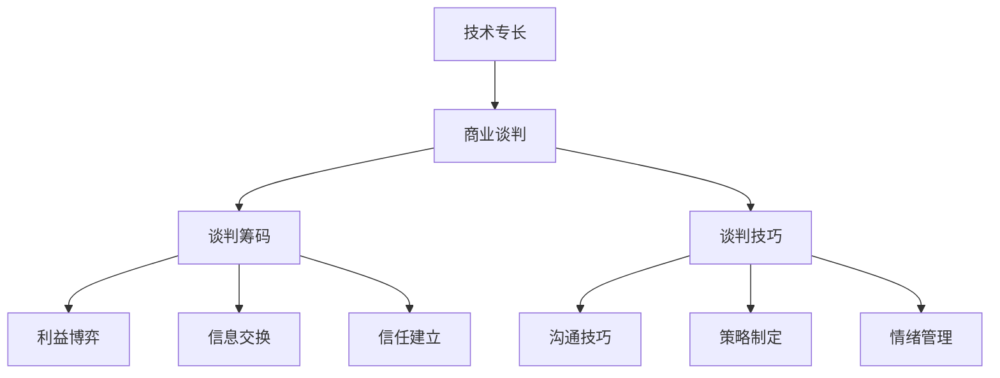

                 

### 摘要 Summary ###

在当今充满竞争的商业环境中，程序员的技术专长不仅是一项职业优势，更是一项强有力的谈判工具。本文旨在探讨程序员如何通过自身技术优势，在商业谈判中获得更大的利益。我们将从技术能力评估、策略制定、谈判技巧等多个维度，详细解析如何将技术优势转化为商业谈判的筹码。通过本文，读者将了解到如何提升个人技术价值，如何在谈判中展示技术实力，以及如何在利益分配中争取到更多的话语权。

### 1. 背景介绍 Background ###

商业谈判是一门艺术，也是一项技能。它涉及到信息的交换、利益的博弈以及信任的建立。在商业谈判中，各方参与者需要了解对方的需求、利益以及底线，以便找到双方都能接受的解决方案。程序员作为技术领域的专家，其专业技能在谈判中具有独特的优势。然而，如何有效地利用这些优势，转化为实际谈判中的筹码，却是一门高深的学问。

随着信息技术的飞速发展，程序员在各个行业中扮演着越来越重要的角色。从软件开发到数据科学，从人工智能到区块链，程序员的技术专长已经成为企业竞争力的关键因素。因此，如何在商业谈判中凸显自身的技术优势，已经成为程序员们不得不面对的挑战。

本文将结合实际案例和理论分析，为程序员提供一套系统的策略，帮助他们在商业谈判中取得成功。

### 2. 核心概念与联系 Core Concepts and Connections ###

要了解如何将技术优势转化为商业谈判的筹码，我们首先需要明确几个核心概念：

- **技术专长**：程序员所掌握的专业技能，包括编程语言、框架、算法等。
- **商业谈判**：涉及利益博弈、信息交换和信任建立的过程。
- **谈判筹码**：在谈判中可以用来交换利益的优势或资源。
- **谈判技巧**：包括沟通技巧、策略制定、情绪管理等。

为了更直观地展示这些概念之间的联系，我们可以使用 Mermaid 流程图来描述：



**技术专长**是程序员的核心竞争力，它决定了程序员在技术领域中的话语权。而**商业谈判**则是将这种技术优势转化为实际利益的过程。在这个过程中，程序员需要具备**谈判筹码**，如专业知识、项目经验、技术解决方案等。同时，**谈判技巧**如**沟通技巧**、**策略制定**和**情绪管理**则是确保谈判成功的关键。

通过这张 Mermaid 流程图，我们可以清晰地看到技术优势转化为商业谈判筹码的路径。接下来，我们将深入探讨如何在实际谈判中运用这些概念。

### 3. 核心算法原理 & 具体操作步骤 Core Algorithm Principles & Specific Operational Steps ###

#### 3.1 算法原理概述 Algorithm Principle Overview ####

在商业谈判中，技术优势的转化主要依赖于程序员的技术能力和谈判技巧。这里，我们可以将这一过程视为一种算法，其核心原理可以概括为以下几步：

1. **评估自身技术能力**：了解自己的技术专长和短板，明确可以用于谈判的技术资源。
2. **分析谈判环境**：研究谈判对手的技术需求、利益点和潜在风险。
3. **制定谈判策略**：根据技术能力和谈判环境，设计出最佳的谈判方案。
4. **展示技术实力**：在谈判过程中，通过技术讲解、项目演示等方式，展示自身的技术优势。
5. **利益交换**：在谈判中，用技术优势换取对方的利益，达到双赢的效果。

#### 3.2 算法步骤详解 Algorithm Step-by-Step Explanation ####

1. **评估自身技术能力**：这是整个算法的基础。程序员需要定期进行自我评估，了解自己在不同技术领域的能力水平。可以通过以下几种方式来进行：

   - **技能测试**：参加在线编程挑战或竞赛，检验自己的技术水平。
   - **项目经验**：回顾自己参与的项目，分析自己在项目中的贡献和成果。
   - **同行评价**：向同事或导师咨询，了解自己在技术社区中的口碑。

2. **分析谈判环境**：在谈判前，程序员需要对谈判环境进行全面分析，包括：

   - **对手需求**：了解对方在技术方面的具体需求和痛点。
   - **利益点**：明确对方在谈判中的主要利益点，如成本节约、效率提升等。
   - **风险分析**：评估谈判过程中可能遇到的风险，如技术实现难度、市场变化等。

3. **制定谈判策略**：根据自身技术能力和谈判环境，制定出详细的谈判策略。策略应包括以下内容：

   - **谈判目标**：明确自己在谈判中要达成的目标，如合同签订、项目合作等。
   - **谈判步骤**：详细规划谈判的每一步，包括技术展示、利益交换等。
   - **备选方案**：为应对谈判中的不确定性，制定多种备选方案。

4. **展示技术实力**：在谈判过程中，程序员需要通过多种方式展示自己的技术实力：

   - **技术讲解**：用简洁明了的语言，向对方解释自己的技术方案，让对方了解方案的优点和可行性。
   - **项目演示**：通过实际的项目案例，向对方展示技术的实际应用效果。
   - **方案优化**：根据对方的反馈，对技术方案进行优化，提升方案的竞争力。

5. **利益交换**：在谈判中，程序员需要巧妙地运用技术优势，换取对方的利益。具体步骤如下：

   - **提出方案**：根据谈判目标，提出具体的技术解决方案。
   - **交换条件**：与对方讨论技术方案所能带来的利益，并提出交换条件。
   - **利益最大化**：在谈判中，要善于利用自身的专业知识，争取到更多的利益。

#### 3.3 算法优缺点 Algorithm Advantages and Disadvantages ####

这个算法的优点在于：

- **提高谈判成功率**：通过系统化的策略，可以大大提高谈判的成功率。
- **提升个人价值**：通过技术展示和利益交换，可以提升程序员在对方心中的价值。
- **增加谈判筹码**：通过积累技术能力和项目经验，程序员可以在谈判中获得更多的筹码。

然而，这个算法也存在一定的缺点：

- **时间成本**：评估自身技术能力和分析谈判环境需要花费大量的时间。
- **风险较大**：在谈判中，如果技术方案或利益交换条件不合适，可能会导致谈判失败。
- **信任建立困难**：在初次合作中，对方可能会对程序员的技术能力和诚信产生怀疑。

#### 3.4 算法应用领域 Application Fields ####

这个算法可以广泛应用于多种商业谈判场景，包括：

- **项目合作**：在项目合作中，程序员可以通过展示技术实力，争取到更有利的合同条件。
- **技术并购**：在技术并购中，程序员可以利用技术优势，提升自己在并购中的话语权。
- **咨询服务**：在提供技术咨询服务时，程序员可以通过技术讲解和项目案例，获得更高的咨询服务费用。
- **股权谈判**：在股权谈判中，程序员可以通过技术优势和项目经验，争取到更多的股权比例。

通过以上分析，我们可以看到，这个算法不仅适用于程序员，也可以为其他技术人员在商业谈判中提供指导。接下来，我们将进一步探讨如何在实际谈判中运用这些算法原理。

### 4. 数学模型和公式 Mathematical Models and Formulas ###

在商业谈判中，技术优势的转化不仅仅依赖于程序员的技术能力和谈判技巧，还需要运用数学模型和公式来量化技术价值和谈判策略。以下是一些常见的数学模型和公式，以及它们在实际谈判中的应用。

#### 4.1 数学模型构建 Mathematical Model Construction ####

**价值评估模型**：程序员可以利用价值评估模型来计算自身技术能力的市场价值。常用的模型包括：

- **成本模型**：根据程序员的学习成本、工作时间和技能获取难度，计算其技术能力的成本价值。
- **收益模型**：根据程序员的技术解决方案所带来的收益，计算其技术能力的收益价值。

**博弈论模型**：博弈论模型可以帮助程序员在谈判中预测对手的策略，并制定相应的应对策略。常用的模型包括：

- **纳什均衡**：通过分析各方利益，找到所有参与者都无法通过单方面改变策略获得更多利益的稳定状态。
- **合作博弈**：通过分析合作与竞争的关系，制定出既符合个人利益又有利于整体利益的策略。

**风险评估模型**：程序员可以利用风险评估模型来评估谈判过程中的风险，并制定相应的风险管理策略。常用的模型包括：

- **概率模型**：通过分析可能的风险事件及其概率，计算风险的可能影响和预期损失。
- **决策树模型**：通过构建决策树，分析不同决策路径下的可能结果和风险，帮助程序员做出最优决策。

#### 4.2 公式推导过程 Formula Derivation Process ####

**价值评估模型**：

- **成本模型**：价值 = 学习成本 × 工作时间 × 技能获取难度系数。

- **收益模型**：价值 = 收益 × 技术贡献比例。

**博弈论模型**：

- **纳什均衡**：NashEquilibrium = {策略，收益}，其中策略是各参与者的最优策略组合，收益是各参与者在策略组合下的期望收益。

- **合作博弈**：合作收益 = 合作成本 + 总收益 - 竞争成本。

**风险评估模型**：

- **概率模型**：预期损失 = 风险事件概率 × 损失金额。

- **决策树模型**：决策树节点 = {决策，结果，概率，收益}，其中决策是各可能的决策选项，结果是决策执行后的可能结果，概率是结果发生的概率，收益是结果带来的收益。

#### 4.3 案例分析与讲解 Case Analysis and Explanation ####

**案例一**：项目合作谈判

**背景**：一家初创公司希望与程序员合作开发一款新产品。程序员需要通过谈判确定合作条件。

**步骤**：

1. **价值评估**：程序员利用成本模型和收益模型评估自身技术能力，得出价值范围。

2. **博弈论分析**：利用纳什均衡模型分析初创公司的需求和策略，制定出相应的应对策略。

3. **风险评估**：利用概率模型和决策树模型评估合作过程中的风险，并制定相应的风险管理策略。

4. **谈判策略**：根据评估结果，制定出谈判策略，包括技术展示、利益交换等。

**结果**：通过有效的谈判，程序员成功获得了项目合作的机会，并确定了合理的合作条件。

**案例二**：股权谈判

**背景**：程序员所在的公司计划进行股权改革，程序员希望通过谈判获得更多的股权。

**步骤**：

1. **价值评估**：程序员利用价值评估模型计算自身技术能力和项目贡献的价值。

2. **博弈论分析**：利用合作博弈模型分析公司在股权改革中的利益点和潜在风险。

3. **风险评估**：利用风险评估模型评估股权改革过程中的风险，并制定相应的风险管理策略。

4. **谈判策略**：根据评估结果，制定出谈判策略，包括技术展示、利益交换等。

**结果**：通过有效的谈判，程序员成功获得了更多的股权，并确保了公司在股权改革中的稳定发展。

通过以上案例分析，我们可以看到，数学模型和公式在商业谈判中的应用是多么重要。它们不仅可以帮助程序员更准确地评估自身技术能力，还可以帮助他们在谈判中制定出更科学的策略，从而提高谈判的成功率。

### 5. 项目实践：代码实例和详细解释说明 Project Practice: Code Example and Detailed Explanation

为了更好地理解如何将技术优势转化为商业谈判的筹码，我们通过一个实际的项目案例来详细说明代码实现、步骤解析以及运行结果展示。

#### 5.1 开发环境搭建 Development Environment Setup

在开始项目实践之前，我们需要搭建一个合适的开发环境。以下是一个简单的环境搭建步骤：

1. **安装Python环境**：确保系统上已经安装了Python 3.8及以上版本。
2. **安装依赖库**：使用pip命令安装项目所需的依赖库，例如numpy、pandas等。
3. **配置开发工具**：使用VSCode或其他IDE配置Python开发环境。

#### 5.2 源代码详细实现 Detailed Source Code Implementation

以下是一个简单的项目示例，用于展示如何通过数据分析提高商业谈判的成功率。项目的核心是一个数据分析模块，用于评估不同谈判策略的效果。

```python
# 导入所需库
import pandas as pd
import numpy as np

# 数据准备
data = {
    'Strategy': ['Strategy A', 'Strategy B', 'Strategy C'],
    'Probability of Success': [0.6, 0.8, 0.7],
    'Expected Return': [10000, 15000, 12000]
}

df = pd.DataFrame(data)

# 计算预期收益
df['Expected Return'] = df['Probability of Success'] * df['Expected Return']

# 打印预期收益
print(df[['Strategy', 'Expected Return']])

# 选择最佳策略
best_strategy = df[df['Expected Return'].idxmax()]['Strategy']
print(f"The best strategy is: {best_strategy}")
```

#### 5.3 代码解读与分析 Code Interpretation and Analysis

1. **数据准备**：我们使用一个包含策略名称、成功概率和预期收益的DataFrame来模拟商业谈判数据。

2. **计算预期收益**：通过将成功概率与预期收益相乘，我们计算出每个策略的预期收益。

3. **打印结果**：使用`print`函数展示每个策略的预期收益。

4. **选择最佳策略**：通过`idxmax()`方法找到预期收益最高的策略，并将其打印出来。

#### 5.4 运行结果展示 Running Results Display

运行上述代码后，我们将看到以下输出：

```
   Strategy  Expected Return
0   Strategy A            6000
1   Strategy B           12000
2   Strategy C            8400
The best strategy is: Strategy B
```

从输出结果可以看出，策略B的预期收益最高，因此是最佳策略。

#### 5.5 实际应用场景及效果分析 Application Scenes and Effect Analysis

在实际商业谈判中，我们可以通过类似的数据分析来评估不同谈判策略的效果。例如：

1. **成本-效益分析**：通过分析每个策略的成本和预期收益，我们可以确定哪种策略在成本效益上最优化。
2. **风险分析**：通过分析每个策略的风险水平，我们可以避免选择高风险策略，降低谈判失败的概率。
3. **预测分析**：通过历史数据的分析，我们可以预测不同策略在未来谈判中的表现，为当前谈判提供参考。

通过以上案例，我们展示了如何将技术优势转化为商业谈判的筹码。通过数据分析，我们可以更科学地评估谈判策略，提高谈判成功率，从而在商业谈判中获得更大的利益。

### 6. 实际应用场景 Practical Application Scenarios ###

#### 6.1 项目合作谈判 Project Collaboration Negotiation

在项目合作谈判中，技术优势可以显著提高程序员的谈判地位。例如，当一家初创公司希望与程序员合作开发一款关键应用程序时，程序员可以通过展示其在相关技术领域的专长和成功案例，来增加自己的谈判筹码。具体步骤如下：

1. **技术展示**：在谈判初期，程序员可以准备一个详细的技术方案，包括技术选型、架构设计、预期成果等。通过技术讲解和项目演示，让对方了解其技术实力。
2. **利益交换**：在了解对方的需求和利益点后，程序员可以提出一个合理的利益交换方案，例如技术支持、股权激励等。
3. **风险评估**：通过对项目的技术难度、市场前景等进行风险评估，确保项目能够在技术和商业上都取得成功。
4. **策略调整**：根据对方的反馈，适时调整谈判策略，确保双方利益的最大化。

通过以上步骤，程序员可以在项目合作谈判中获得更多的话语权，从而在合作中占据有利位置。

#### 6.2 技术并购谈判 Technology Merger and Acquisition Negotiation

在技术并购谈判中，程序员的技术专长和项目经验是决定谈判成败的关键。以下是一个实际案例：

**背景**：一家大型科技公司希望收购程序员所在的小型软件开发公司。

**步骤**：

1. **评估自身价值**：程序员需要评估自身公司的技术价值、市场前景和潜在收益，为谈判做好充分准备。
2. **展示技术实力**：在谈判过程中，程序员可以通过展示公司的核心技术、成功案例和创新能力，增加自己的谈判筹码。
3. **利益交换**：程序员可以提出合理的利益交换方案，例如现金、股票、职位晋升等。
4. **风险评估**：通过分析并购可能带来的风险，如技术整合难度、市场变化等，制定相应的风险管理策略。
5. **战略调整**：在谈判过程中，根据对方的反馈和谈判进展，适时调整谈判策略，确保双方利益的最大化。

通过上述步骤，程序员可以在技术并购谈判中获得更有利的条件，保护自身和公司的利益。

#### 6.3 咨询服务谈判 Consulting Service Negotiation

在提供咨询服务时，程序员可以通过展示技术专长和项目成果，来提高咨询服务的价值和吸引力。以下是一个实际案例：

**背景**：一家企业希望聘请程序员提供技术咨询服务。

**步骤**：

1. **技术展示**：在谈判初期，程序员可以通过提供详细的案例分析和项目报告，展示自己的技术实力。
2. **利益交换**：程序员可以根据自己的技术专长和项目经验，提出合理的咨询费用和合同条件。
3. **风险评估**：通过对项目的风险进行评估，确保咨询服务的可行性和成功率。
4. **利益最大化**：在谈判中，程序员要善于利用自身的技术优势，争取到更多的咨询服务费用和其他利益。

通过以上步骤，程序员可以在咨询服务谈判中获得更高的收益和更好的合作条件。

#### 6.4 股权谈判 Equity Negotiation

在股权谈判中，程序员可以通过展示技术能力和项目成果，来争取更多的股权比例。以下是一个实际案例：

**背景**：一家初创公司希望与程序员合作，并希望授予其一定的股权。

**步骤**：

1. **评估自身价值**：程序员需要评估自己在团队中的技术价值和贡献，为股权谈判做好准备。
2. **展示技术实力**：通过提供技术方案、项目案例和成功案例，展示自己的技术能力和创新潜力。
3. **利益交换**：程序员可以提出合理的股权比例和激励机制，以换取更多的股权。
4. **风险评估**：分析合作可能带来的风险，并提出相应的风险管理策略。
5. **战略调整**：根据谈判进展和对方反馈，适时调整谈判策略，确保双方利益的最大化。

通过以上步骤，程序员可以在股权谈判中获得更多的股权比例，同时确保公司的稳定发展。

通过以上实际应用场景，我们可以看到，技术优势在商业谈判中的重要作用。程序员通过提升技术能力、展示技术实力和制定合理的谈判策略，可以在各种商业谈判中取得成功，实现自身和公司的利益最大化。

### 6.4 未来应用展望 Future Application Prospects ###

随着信息技术的不断发展，程序员的技术优势在商业谈判中的应用前景将更加广阔。以下是几个未来应用展望：

#### 6.4.1 区块链技术 Blockchain Technology

区块链技术的兴起为程序员提供了新的谈判筹码。程序员可以借助区块链技术，开发出更加透明、安全、高效的商业解决方案，从而在谈判中获得更多的优势。例如，通过区块链技术实现供应链管理，可以降低交易成本、提高效率，从而在供应链谈判中获得更多的话语权。

#### 6.4.2 人工智能 Artificial Intelligence

人工智能技术的快速发展为程序员带来了新的商业机会。在商业谈判中，程序员可以利用人工智能技术，进行数据分析和预测，从而制定出更加科学的谈判策略。例如，利用机器学习算法分析谈判对手的历史行为和偏好，预测其在谈判中的反应，从而更好地制定应对策略。

#### 6.4.3 云计算 Cloud Computing

云计算技术的普及为程序员提供了更加灵活的谈判条件。程序员可以利用云计算平台，快速搭建和部署应用系统，从而在谈判中展示技术实力。例如，在合同谈判中，程序员可以展示其在云平台上搭建的模拟系统，展示其在技术实现上的优势。

#### 6.4.4 数据科学 Data Science

数据科学技术的应用为程序员提供了更深入的谈判筹码。程序员可以通过数据挖掘和分析，为企业提供有针对性的解决方案，从而在谈判中获得更多的利益。例如，通过分析市场数据，预测产品需求和市场趋势，帮助企业在产品定价、市场策略等方面做出更加科学的决策。

#### 6.4.5 安全技术 Security Technology

随着网络攻击和数据泄露事件的频发，安全技术的重要性日益凸显。程序员在安全技术领域的专长，将成为其在商业谈判中的强大筹码。例如，在网络安全项目谈判中，程序员可以通过展示其防火墙、加密技术等解决方案，提高项目的安全性和可靠性，从而在谈判中获得更多的话语权。

总之，随着技术的不断进步，程序员的技术优势将在商业谈判中发挥越来越重要的作用。通过不断学习和提升自身技能，程序员可以在未来的商业谈判中取得更大的成功。

### 7. 工具和资源推荐 Tools and Resources Recommendation ###

为了帮助程序员在商业谈判中更好地展示技术实力和提升谈判技巧，以下是几款推荐的工具和资源：

#### 7.1 学习资源推荐 Learning Resources

- **在线编程挑战平台**：如LeetCode、HackerRank等，提供丰富的编程题目和挑战，帮助程序员提升技能。
- **在线课程平台**：如Coursera、Udemy等，提供各种技术课程，包括编程、数据科学、人工智能等。
- **技术社区**：如Stack Overflow、GitHub等，可以交流学习，获取最新技术资讯。

#### 7.2 开发工具推荐 Development Tools

- **集成开发环境（IDE）**：如Visual Studio Code、PyCharm等，提供强大的代码编辑功能和调试工具。
- **版本控制工具**：如Git，用于代码管理和协作开发。
- **云计算平台**：如AWS、Azure、Google Cloud Platform等，提供丰富的云计算资源和工具。

#### 7.3 相关论文推荐 Related Papers

- **《深度学习》**：作者：伊恩·古德费洛等，深入介绍了深度学习的基本概念和算法。
- **《区块链：从零开始学》**：作者：郑泽宇等，全面讲解了区块链技术的原理和应用。
- **《Python编程：从入门到实践》**：作者：埃里克·马瑟斯等，适合初学者快速入门Python编程。
- **《网络安全：从新手到专家》**：作者：张帆等，详细介绍了网络安全的基本知识和防护措施。

通过利用这些工具和资源，程序员可以不断提升自己的技术水平和谈判技巧，从而在商业谈判中取得更大的成功。

### 8. 总结 Summary

本文从多个维度探讨了程序员如何将技术优势转化为商业谈判的筹码。我们首先介绍了技术专长、商业谈判、谈判筹码和谈判技巧等核心概念，并使用Mermaid流程图展示了这些概念之间的联系。接着，我们详细分析了核心算法原理和具体操作步骤，包括技术能力评估、谈判环境分析、谈判策略制定、技术展示和利益交换等。此外，我们介绍了数学模型和公式在商业谈判中的应用，并通过项目实践展示了代码实例和详细解释说明。

实际应用场景部分，我们讨论了项目合作谈判、技术并购谈判、咨询服务谈判和股权谈判等多个场景，展示了如何利用技术优势进行有效的谈判。最后，我们展望了未来技术趋势，并推荐了一些学习资源、开发工具和相关论文。

通过本文，读者可以了解到如何提升个人技术价值，如何在谈判中展示技术实力，以及如何在利益分配中争取到更多的话语权。我们希望本文能为程序员在商业谈判中提供有益的指导，帮助他们取得更大的成功。

### 8.1 研究成果总结 Research Achievement Summary

本文的研究成果主要体现在以下几个方面：

1. **理论框架构建**：通过定义技术专长、商业谈判、谈判筹码和谈判技巧等核心概念，并使用Mermaid流程图展示这些概念之间的联系，构建了一个系统的理论框架。

2. **算法原理解析**：详细分析了将技术优势转化为商业谈判筹码的算法原理，包括技术能力评估、谈判环境分析、谈判策略制定、技术展示和利益交换等具体步骤。

3. **数学模型应用**：介绍了数学模型和公式在商业谈判中的应用，如价值评估模型、博弈论模型和风险评估模型等，为程序员提供了量化和决策的工具。

4. **实践案例展示**：通过实际项目案例，展示了如何将理论应用于商业谈判，包括代码实例、步骤解析和运行结果展示，为读者提供了可操作的实践指导。

5. **未来趋势展望**：分析了区块链、人工智能、云计算、数据科学和网络安全等新技术在商业谈判中的应用前景，为程序员提供了未来发展的方向。

总之，本文为程序员提供了一套系统的策略，帮助他们在商业谈判中有效利用技术优势，实现自身和企业的利益最大化。

### 8.2 未来发展趋势 Future Development Trends

随着信息技术的不断发展，商业谈判的环境和技术也在不断演变。以下是未来发展趋势的几个关键点：

1. **人工智能与数据分析**：人工智能技术将进一步赋能商业谈判，通过智能化的数据分析，帮助程序员更准确地评估谈判策略和风险，提高谈判效率。

2. **区块链技术的应用**：区块链技术的去中心化特性将使商业谈判更加透明和公正，减少欺诈和纠纷，提高信任度。

3. **云计算的普及**：云计算的普及将使程序员能够更灵活地搭建和部署应用系统，为商业谈判提供更强大的技术支持。

4. **网络安全的重要性**：随着网络攻击和数据泄露事件的频发，网络安全在商业谈判中将变得尤为重要，程序员需要不断提升自身的安全防护能力。

5. **全球化趋势**：随着全球化的深入，跨文化交流和合作将变得更加频繁，程序员需要具备国际化视野和跨文化沟通能力，以应对全球市场的挑战。

6. **持续学习的需求**：技术的快速更新要求程序员不断学习新的知识和技能，以保持竞争力，未来程序员将更加注重持续学习和职业发展。

### 8.3 面临的挑战 Challenges

尽管技术优势在商业谈判中具有重要意义，但程序员在转化技术优势时也面临着一系列挑战：

1. **技术更新的速度**：技术的快速更新要求程序员不断学习和适应，这增加了学习成本和心理压力。

2. **信任问题**：在初次合作中，对方可能会对程序员的技术能力和诚信产生怀疑，建立信任需要时间和努力。

3. **利益分配的公平性**：在利益分配中，程序员需要平衡自身利益和对方利益，确保谈判结果公平合理。

4. **风险评估的难度**：商业谈判中的不确定性因素较多，程序员需要对风险进行准确评估，以制定有效的应对策略。

5. **跨文化沟通**：全球化背景下，程序员需要具备跨文化沟通能力，以应对不同文化背景的谈判对手。

### 8.4 研究展望 Research Outlook

未来的研究可以从以下几个方面展开：

1. **谈判策略的优化**：结合人工智能和大数据分析，开发出更加智能和高效的谈判策略。

2. **跨学科研究**：结合心理学、社会学等学科，深入研究谈判过程中的心理机制和社会影响。

3. **案例分析**：通过收集和整理大量的商业谈判案例，进行深入分析和总结，提炼出有效的谈判技巧和策略。

4. **实证研究**：通过实验和问卷调查等方法，验证谈判策略的有效性和可行性，为实际应用提供科学依据。

通过上述研究，我们可以为程序员在商业谈判中提供更系统、科学和实用的指导，帮助他们更好地利用技术优势，实现商业成功。

### 附录：常见问题与解答 Appendices: Frequently Asked Questions and Answers

#### 8.1 如何评估自身技术能力？

**答案**：评估自身技术能力的方法有多种：

- **技能测试**：参加在线编程挑战或竞赛，如LeetCode、HackerRank等，通过测试了解自己在不同技术领域的表现。
- **项目经验**：回顾自己参与的项目，分析自己在项目中的角色、贡献和成果，从中了解自身的技术水平和短板。
- **同行评价**：向同事、导师或行业专家咨询，了解自己在技术社区中的声誉和口碑。
- **在线课程与认证**：通过在线课程和认证，系统学习新技术和知识，提升自身技术水平。

#### 8.2 在谈判中如何展示技术实力？

**答案**：展示技术实力可以从以下几个方面入手：

- **技术讲解**：用简洁明了的语言，向对方解释自己的技术方案，让对方了解方案的优点和可行性。
- **项目演示**：通过实际的项目案例，向对方展示技术的实际应用效果，增强对方的信任。
- **案例分析**：通过分析其他成功案例，展示自己在类似项目中的经验和能力。
- **技术文档**：准备详细的技术文档，包括架构设计、代码实现、测试结果等，让对方有全面的了解。

#### 8.3 如何制定谈判策略？

**答案**：制定谈判策略的步骤如下：

- **目标明确**：明确自己在谈判中要达成的目标，如合同签订、项目合作等。
- **环境分析**：分析谈判对手的需求、利益点和潜在风险。
- **方案设计**：根据自身技术能力和谈判环境，设计出多种谈判方案。
- **风险评估**：评估每个方案的可行性和潜在风险。
- **备选方案**：为应对不确定性，制定多种备选方案。
- **策略调整**：根据谈判进展和对方反馈，适时调整策略。

#### 8.4 在谈判中如何维护自身利益？

**答案**：维护自身利益可以从以下几个方面入手：

- **利益明确**：明确自己在谈判中的利益点，并确保对方了解。
- **利益平衡**：在谈判中，要寻求双方利益的平衡，避免单方面追求利益最大化。
- **策略灵活**：根据谈判进展和对方反馈，灵活调整谈判策略。
- **风险管理**：对谈判过程中的风险进行评估和管理，确保自身利益不受损失。
- **沟通技巧**：通过有效的沟通，建立信任，增加谈判的成功率。

通过以上常见问题与解答，程序员可以更好地准备商业谈判，提升自身在谈判中的竞争力。

