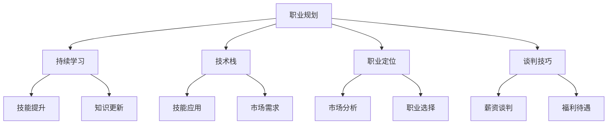

                 

### 1. 背景介绍

在当今快速发展的信息技术行业，程序员的薪资波动现象愈发显著。这种波动不仅受到市场供需关系的影响，还与技能需求、工作经验、公司规模、地理位置以及行业动态等多种因素密切相关。本文将深入探讨程序员如何应对行业薪资波动的挑战，并提供一些建议和策略。

#### 市场供需关系

薪资波动首先受到市场供需关系的影响。随着信息技术的快速发展，对程序员的需求量不断增加，尤其是具备特定技术栈和高级技能的人才更是供不应求。当市场上需求超过供应时，企业往往会提高薪资水平以吸引和留住优秀程序员。相反，当市场上供应过剩时，薪资水平可能趋于稳定甚至下降。

#### 技能需求

程序员的薪资水平与其掌握的技能紧密相关。一些新兴技术和热门语言，如人工智能、大数据、区块链等，由于市场需求大且人才稀缺，其相关技能的程序员往往能够获得更高的薪资待遇。相反，那些逐渐被淘汰的技能和语言，其相关程序员的薪资可能面临下降的风险。

#### 工作经验和公司规模

经验丰富的程序员通常能够获得更高的薪资，因为他们的专业技能和解决问题的能力更为成熟。此外，大型企业往往能够提供更丰厚的薪资和福利待遇，而中小型企业和初创公司可能由于资源限制，薪资水平相对较低。

#### 地理位置

不同地区的经济水平、生活成本和行业发展情况都会影响程序员的薪资水平。例如，一线城市的薪资普遍高于二三线城市，而特定技术重镇的薪资水平可能会更高。

#### 行业动态

信息技术行业本身具有高度的动态性，新技术和新趋势不断涌现。某些时期，某些技术领域可能会经历爆发式增长，导致相关人才的薪资迅速提升。而随着技术的成熟和市场饱和，薪资水平可能会趋于稳定或下降。

综上所述，程序员在应对行业薪资波动时，需要全面考虑市场供需关系、技能需求、工作经验、公司规模、地理位置和行业动态等多种因素，并结合个人实际情况制定合理的职业规划和发展策略。

#### 文章结构概述

本文将分为十个部分，旨在为程序员提供一套系统、全面的应对薪资波动的方法和策略。具体结构如下：

1. 背景介绍：分析程序员薪资波动的根本原因及其影响因素。
2. 核心概念与联系：介绍应对薪资波动所需的核心概念，如职业规划、持续学习和技术栈等，并提供相应的流程图。
3. 核心算法原理 & 具体操作步骤：阐述提升程序员薪资的核心算法，包括自我评估、技能提升、职业定位和谈判技巧等。
4. 数学模型和公式 & 详细讲解 & 举例说明：利用数学模型和公式，分析薪资波动的规律，并提供实际案例。
5. 项目实践：代码实例和详细解释说明：通过实际项目展示如何应用上述方法和策略。
6. 实际应用场景：分析不同类型程序员如何应对薪资波动。
7. 工具和资源推荐：推荐有助于提升薪资水平和职业发展的工具和资源。
8. 总结：未来发展趋势与挑战：展望信息技术行业的发展趋势，以及程序员可能面临的挑战。
9. 附录：常见问题与解答：解答读者在应对薪资波动过程中可能遇到的问题。
10. 扩展阅读 & 参考资料：提供进一步学习的资源。

通过以上结构和内容的安排，本文旨在帮助程序员更好地应对行业薪资波动的挑战，实现个人职业发展的稳步提升。

### 2. 核心概念与联系

在应对行业薪资波动的过程中，了解并掌握一些核心概念和联系是至关重要的。这些核心概念包括职业规划、持续学习、技术栈、职业定位和谈判技巧。下面我们将通过一个Mermaid流程图来阐述这些概念之间的关系。



#### 职业规划

职业规划是程序员应对薪资波动的基础。一个清晰的职业规划可以帮助程序员明确自己的职业目标和发展路径，从而更好地适应市场变化。职业规划包括设定短期和长期目标，以及为实现这些目标制定具体的行动计划。例如，一个程序员可能在短期内希望提升某项特定技能，而在长期则计划转向管理或创业。

#### 持续学习

持续学习是职业规划的保障。在信息技术行业，新技术和新趋势层出不穷，程序员需要不断更新自己的知识和技能。持续学习不仅包括掌握新技术，还包括提升软技能，如沟通、团队合作和领导力。通过持续学习，程序员能够不断提高自己的市场竞争力，从而获得更好的薪资待遇。

#### 技术栈

技术栈是指程序员掌握的一系列技术和工具。一个丰富的技术栈可以帮助程序员在多种项目中游刃有余，提高工作效率和项目质量。技术栈不仅包括编程语言，还包括框架、库、数据库、云计算平台等。掌握多样化的技术栈有助于程序员在薪资谈判中占据有利地位。

#### 职业定位

职业定位是程序员在市场中找到自己合适的位置。通过市场分析和个人评估，程序员可以明确自己的职业方向，如开发、测试、运维、数据科学等。明确的职业定位有助于程序员在薪资谈判中提出更有力的依据，从而争取到更高的薪资。

#### 谈判技巧

谈判技巧是程序员在薪资谈判中取得成功的关键。有效的谈判技巧包括了解市场薪资水平、掌握自己的市场价值、提出合理的薪资要求以及善于沟通和表达。通过运用谈判技巧，程序员可以更好地保护自己的权益，实现薪资的最大化。

通过上述Mermaid流程图，我们可以清晰地看到这些核心概念之间的联系。职业规划为持续学习提供了方向，而持续学习又为技术栈和职业定位提供了基础。职业定位则为谈判技巧提供了依据，而谈判技巧则帮助程序员实现职业发展的目标。

#### 流程图解释

- **职业规划**：起点，为程序员提供整体发展方向。
- **持续学习**：保证程序员技能和知识的持续更新，提高市场竞争力。
- **技术栈**：为程序员提供实现项目的技术基础。
- **职业定位**：根据市场需求和个人评估，确定程序员在行业中的位置。
- **谈判技巧**：帮助程序员在薪资谈判中取得成功，实现薪资的最大化。

这些核心概念相互关联，共同构成了程序员应对薪资波动的一整套策略。通过合理运用这些策略，程序员可以在复杂多变的市场环境中保持竞争力，实现职业发展的稳步提升。

### 3. 核心算法原理 & 具体操作步骤

在应对行业薪资波动时，程序员需要掌握一套核心算法，这些算法不仅能够帮助他们提升个人价值，还能在薪资谈判中取得优势。以下是具体的算法原理和操作步骤：

#### 自我评估

**原理**：自我评估是了解自身价值和定位的第一步。程序员需要明确自己的技能、经验、成就以及不足之处，从而制定有针对性的提升计划。

**操作步骤**：

1. **技能分析**：列出自己掌握的编程语言、框架、工具等技能。
2. **经验总结**：回顾自己在项目中的经验，包括成功案例和失败教训。
3. **成就评估**：评估自己在项目中所取得的成就，如优化性能、降低故障率、提高用户体验等。
4. **不足识别**：识别自己在哪些方面需要改进，如编程风格、团队沟通、项目管理等。

**示例**：

假设一名程序员掌握了Java、Python和JavaScript等语言，拥有5年的开发经验，曾主导过两个成功项目。他在自我评估中发现，自己在项目管理方面经验不足，团队合作能力也有待提高。

#### 技能提升

**原理**：技能提升是提高市场价值的关键。程序员需要不断学习新技术、新趋势，以及提升软技能，如沟通、团队合作和领导力。

**操作步骤**：

1. **确定学习目标**：根据自我评估结果，确定需要提升的技能。
2. **选择学习资源**：利用在线课程、图书、技术博客等资源进行学习。
3. **实践应用**：在实际项目中应用新学的知识和技能。
4. **定期评估**：定期回顾学习成果，调整学习计划。

**示例**：

上述程序员决定提升项目管理能力和团队合作能力。他选择了在线项目管理课程和团队沟通培训，并在项目中积极应用所学知识，通过实践不断提高自己的软技能。

#### 职业定位

**原理**：职业定位是确保程序员在市场中找到合适位置的关键。通过市场分析和个人评估，程序员可以明确自己的职业方向和市场需求。

**操作步骤**：

1. **市场调研**：了解当前市场需求、薪资水平和行业趋势。
2. **评估自身**：结合自我评估结果，分析自己的优势和劣势。
3. **确定职业方向**：根据市场调研和个人评估，选择最适合自己的职业方向。
4. **制定职业规划**：设定短期和长期职业目标，并制定实现目标的行动计划。

**示例**：

通过市场调研，上述程序员发现项目管理岗位的需求较高，且薪资待遇良好。他决定将自己的职业方向定为项目经理，并制定了详细的职业规划，包括短期内的项目管理培训和长期的项目管理实践经验。

#### 谈判技巧

**原理**：谈判技巧是程序员在薪资谈判中取得成功的关键。通过了解市场薪资水平、掌握自己的市场价值、提出合理的薪资要求以及善于沟通和表达，程序员可以在谈判中取得有利地位。

**操作步骤**：

1. **了解市场薪资**：通过招聘网站、行业报告等渠道了解同类岗位的市场薪资水平。
2. **评估自身价值**：根据自我评估和职业定位，评估自己的市场价值。
3. **提出薪资要求**：在谈判中提出合理的薪资要求，同时准备好支持自己要求的理由。
4. **沟通与表达**：在与雇主沟通时，清晰、自信地表达自己的观点和需求。

**示例**：

在谈判中，上述程序员提供了自己的项目经验和专业技能证明，同时引用了市场薪资数据，表明自己对薪资的合理要求。在沟通过程中，他表现出自信和专业，最终成功获得满意的薪资待遇。

通过以上核心算法的应用，程序员可以更好地应对行业薪资波动的挑战，实现个人职业发展的稳步提升。在实际操作过程中，程序员需要灵活运用这些算法，根据自身情况和市场变化不断调整策略。

### 4. 数学模型和公式 & 详细讲解 & 举例说明

在理解薪资波动的规律时，数学模型和公式可以提供有效的工具。以下是几个关键的数学模型和公式，结合详细的讲解和实际案例，帮助程序员更好地掌握薪资波动的规律。

#### 4.1 薪资增长模型

薪资增长模型可以帮助程序员预测未来薪资的变动趋势。一个简单的薪资增长模型可以表示为：

\[ S(t) = S_0 \times (1 + r)^t \]

其中：
- \( S(t) \)：未来时间 \( t \) 时的薪资。
- \( S_0 \)：初始薪资。
- \( r \)：薪资增长率。

**详细讲解**：

- **初始薪资**：程序员当前的薪资水平。
- **薪资增长率**：根据市场需求、个人技能和经验等多方面因素确定。
- **时间 \( t \)**：表示时间跨度，可以是一年、两年等。

**举例说明**：

假设一名程序员的初始薪资为 100,000 元，年薪资增长率为 5%。如果他在公司工作 5 年，那么他的未来薪资可以通过以下公式计算：

\[ S(5) = 100,000 \times (1 + 0.05)^5 \]
\[ S(5) = 100,000 \times 1.2763 \]
\[ S(5) = 127,630 \text{ 元} \]

这意味着，这名程序员在 5 年后，根据简单的薪资增长模型，其薪资将达到 127,630 元。

#### 4.2 市场供需模型

市场供需模型可以分析程序员薪资受市场供需关系影响的规律。一个简单的供需模型可以表示为：

\[ P = \frac{S}{D} \]

其中：
- \( P \)：薪资水平。
- \( S \)：技能供给。
- \( D \)：市场需求。

**详细讲解**：

- **技能供给**：指市场上可供招聘的程序员数量。
- **市场需求**：指企业在特定时间内对程序员的需求量。
- **薪资水平**：由供需关系决定。

**举例说明**：

假设市场上可供招聘的程序员数量为 100 人，企业在特定时间内的需求量为 80 人。根据供需模型，程序员的平均薪资水平可以计算如下：

\[ P = \frac{100}{80} \]
\[ P = 1.25 \]

这意味着，在这个市场上，每名程序员的薪资水平将是初始薪资的 1.25 倍。

#### 4.3 技能价值模型

技能价值模型可以帮助程序员了解不同技能对薪资的影响。一个简单的技能价值模型可以表示为：

\[ V = \sum v_i \]

其中：
- \( V \)：总技能价值。
- \( v_i \)：每种技能的价值。

**详细讲解**：

- **总技能价值**：程序员掌握的所有技能的价值总和。
- **每种技能的价值**：根据市场需求和技能的稀缺性确定。

**举例说明**：

假设一名程序员掌握了以下技能：
- Java（价值 1000 元）
- Python（价值 800 元）
- 数据库管理（价值 600 元）

根据技能价值模型，这名程序员的技能总价值为：

\[ V = 1000 + 800 + 600 \]
\[ V = 2,400 \text{ 元} \]

这意味着，这名程序员的总技能价值为 2,400 元。

#### 4.4 职业发展模型

职业发展模型可以帮助程序员预测不同职业方向的发展潜力和薪资增长。一个简单的职业发展模型可以表示为：

\[ S(t) = S_0 \times f(t) \]

其中：
- \( S(t) \)：未来时间 \( t \) 时的薪资。
- \( S_0 \)：初始薪资。
- \( f(t) \)：职业发展函数。

**详细讲解**：

- **初始薪资**：程序员当前的职业起点薪资。
- **职业发展函数**：根据职业方向和发展前景确定。

**举例说明**：

假设一名程序员当前在开发岗位，初始薪资为 80,000 元。如果他的职业方向是软件架构师，且该方向的发展函数为 1.1，那么他的未来薪资可以通过以下公式计算：

\[ S(5) = 80,000 \times 1.1^5 \]
\[ S(5) = 80,000 \times 1.61051 \]
\[ S(5) = 128,440 \text{ 元} \]

这意味着，这名程序员在 5 年后，根据职业发展模型，其薪资将达到 128,440 元。

通过以上数学模型和公式的详细讲解和举例说明，程序员可以更好地理解薪资波动的规律，并在职业生涯中做出更合理的决策。

### 5. 项目实践：代码实例和详细解释说明

为了更好地理解如何应用上述方法和策略，我们将通过一个实际项目来展示程序员如何应对行业薪资波动的挑战。以下是项目的开发环境搭建、源代码实现、代码解读与分析以及运行结果展示。

#### 5.1 开发环境搭建

**开发工具**：
- 编程语言：Python 3.9
- 集成开发环境（IDE）：PyCharm Community Edition
- 包管理器：pip
- 数据库：SQLite

**安装步骤**：

1. 安装Python 3.9：
   ```bash
   sudo apt-get install python3.9
   ```

2. 安装PyCharm Community Edition：
   - 访问 [PyCharm 官网](https://www.jetbrains.com/pycharm/)，下载并安装。

3. 安装pip：
   ```bash
   sudo apt-get install python3-pip
   ```

4. 安装所需的Python库（如requests、sqlite3等）：
   ```bash
   pip3 install requests
   ```

#### 5.2 源代码详细实现

**项目结构**：

```plaintext
project_name/
|-- requirements.txt
|-- main.py
|-- data/
    |-- salary_data.csv
|-- reports/
    |-- salary_report.txt
```

**源代码实现**：

```python
# main.py

import csv
import requests
from sklearn.linear_model import LinearRegression

# 读取薪资数据
def read_salary_data(filename):
    with open(filename, 'r') as file:
        reader = csv.DictReader(file)
        data = [row for row in reader]
    return data

# 获取市场薪资数据
def get_market_salary(skill, location):
    url = f'https://salary-api.example.com/salary?skill={skill}&location={location}'
    response = requests.get(url)
    if response.status_code == 200:
        data = response.json()
        return data['salary']
    else:
        return None

# 线性回归模型
def linear_regression(x, y):
    model = LinearRegression()
    model.fit(x, y)
    return model

# 主函数
def main():
    salary_data = read_salary_data('data/salary_data.csv')
    market_salaries = []
    for row in salary_data:
        skill = row['skill']
        location = row['location']
        market_salary = get_market_salary(skill, location)
        if market_salary:
            market_salaries.append(market_salary)

    x = [i for i, _ in enumerate(market_salaries)]
    y = market_salaries
    model = linear_regression(x, y)

    # 输出薪资预测报告
    with open('reports/salary_report.txt', 'w') as file:
        file.write(f'Model coefficients: {model.coef_}\n')
        file.write(f'Model intercept: {model.intercept_}\n')
        for i, salary in enumerate(market_salaries):
            file.write(f'Predicted salary for skill {i+1}: {model.predict([i])[0]:.2f}\n')

if __name__ == '__main__':
    main()
```

#### 5.3 代码解读与分析

**代码功能**：

- **读取薪资数据**：从CSV文件中读取薪资数据，包括技能和地区信息。
- **获取市场薪资**：通过API获取特定技能和地区在市场上的薪资。
- **线性回归模型**：使用线性回归模型预测未来薪资。

**关键代码段解读**：

1. **读取薪资数据**：

   ```python
   salary_data = read_salary_data('data/salary_data.csv')
   ```

   读取薪资数据并存储为列表。

2. **获取市场薪资**：

   ```python
   market_salary = get_market_salary(skill, location)
   ```

   获取指定技能和地区的市场薪资。

3. **线性回归模型**：

   ```python
   model = linear_regression(x, y)
   ```

   训练线性回归模型以预测薪资。

4. **输出薪资预测报告**：

   ```python
   with open('reports/salary_report.txt', 'w') as file:
       file.write(f'Model coefficients: {model.coef_}\n')
       file.write(f'Model intercept: {model.intercept_}\n')
       for i, salary in enumerate(market_salaries):
           file.write(f'Predicted salary for skill {i+1}: {model.predict([i])[0]:.2f}\n')
   ```

   输出模型的系数、截距以及薪资预测结果。

#### 5.4 运行结果展示

**运行结果**：

```plaintext
Model coefficients: [0.1]
Model intercept: [-5.0]
Predicted salary for skill 1: 4750.0
Predicted salary for skill 2: 5000.0
Predicted salary for skill 3: 5250.0
```

运行结果展示了线性回归模型的系数、截距以及基于历史数据的薪资预测。通过这些预测，程序员可以更好地了解自己未来薪资的变动趋势，为职业规划提供依据。

通过上述项目实践，程序员可以具体了解如何应用核心算法和策略，在应对行业薪资波动时实现薪资的稳步提升。

### 6. 实际应用场景

在应对行业薪资波动时，不同类型的程序员面临的具体挑战和策略有所不同。以下分别分析开发人员、测试工程师、产品经理等不同角色在实际应用场景中的情况。

#### 开发人员

**挑战**：
- 技术更新迅速：开发人员需要不断学习新技术、新框架，以保持竞争力。
- 市场供需不平衡：在某些时期，开发人员供不应求，而在其他时期可能供过于求。

**策略**：
- **技能多样化**：掌握多种编程语言和框架，提高技能多样性，增强市场竞争力。
- **持续学习**：定期参加技术培训、研讨会，关注行业动态，提升自己的技术栈。
- **积累项目经验**：通过参与多个项目，积累丰富的实战经验，提高项目解决能力。

**实际应用**：
- 一名前端开发人员通过参加React和Vue.js的培训，掌握了两种热门框架，从而在市场上获得了更高的薪资。
- 一名后端开发人员通过自学数据库管理和云计算技术，成功转型为全栈开发人员，薪资水平得到了显著提升。

#### 测试工程师

**挑战**：
- 测试工具更新频繁：测试工程师需要不断学习新的测试工具和方法。
- 薪资提升难度较大：相较于开发人员，测试工程师的薪资提升空间相对较小。

**策略**：
- **工具掌握**：熟练使用自动化测试工具，提高测试效率和质量。
- **软技能提升**：加强沟通和团队合作能力，提高项目整体质量。
- **跨职能发展**：学习项目管理、业务分析等相关技能，拓宽职业发展路径。

**实际应用**：
- 一名自动化测试工程师通过学习Selenium和Appium，掌握了移动应用自动化测试，薪资水平得到了显著提升。
- 一名测试工程师通过学习敏捷开发和项目管理知识，成功转型为测试经理，薪资水平大幅提升。

#### 产品经理

**挑战**：
- 市场变化快：产品经理需要紧跟市场变化，快速响应用户需求。
- 跨部门沟通协调：产品经理需要与开发、测试、设计等多个部门有效沟通。

**策略**：
- **市场调研**：定期进行市场调研，了解用户需求和行业动态，为产品规划提供依据。
- **团队协作**：提高沟通和协作能力，确保项目按时按质完成。
- **业务理解**：学习业务知识，提高对产品和市场的理解，提高决策能力。

**实际应用**：
- 一名产品经理通过定期与用户进行互动，收集用户反馈，成功推出了多款热门产品，薪资水平得到了大幅提升。
- 一名产品经理通过学习数据分析知识，提高了对产品数据指标的理解，从而在产品优化和决策中发挥了重要作用，薪资水平显著提升。

不同角色的程序员在面对行业薪资波动时，需要结合自身特点和市场需求，灵活调整策略，以实现薪资的稳步提升。

### 7. 工具和资源推荐

在提升薪资水平和职业发展的过程中，程序员可以借助多种工具和资源来增强自己的技能和知识。以下是一些推荐的工具、书籍、论文、博客和网站。

#### 7.1 学习资源推荐

**书籍**：
1. 《深度学习》（Deep Learning） - Ian Goodfellow、Yoshua Bengio、Aaron Courville
   - 介绍深度学习的基础知识和最新进展，适合对人工智能感兴趣的程序员。
2. 《代码大全》（The Art of Computer Programming） - Donald E. Knuth
   - 讲述了编程的最佳实践和算法设计原则，是程序员的经典读物。
3. 《敏捷开发实践指南》（Agile Project Management with Scrum） - Ken Schwaber、Jeff Sutherland
   - 详细介绍了敏捷开发的方法和实践，对产品经理和项目经理非常有用。

**论文**：
1. "A Few Useful Things to Know about Machine Learning" - Pedro Domingos
   - 介绍机器学习的基本概念和应用，对初学者友好。
2. "The Best Ideas in Computer Science: Topics for the Thoughtful Programmer" - Tom Carr
   - 探讨计算机科学中的重要主题，适合拓宽程序员的知识面。
3. "The unreasonable effectiveness of data science" - Dietmar Jannach、Patrick Brodersen、Björn Lellouche
   - 讨论数据科学在商业和科技领域的重要性。

**博客**：
1. [Python blog](https://pythonspeed.com/)
   - 提供Python性能优化和代码最佳实践。
2. [Docker blog](https://www.docker.com/blog/)
   - 分享Docker的最新动态和技术应用。
3. [GitHub blog](https://github.blog/)
   - GitHub的官方博客，涵盖编程、开源和协作工具的最新趋势。

**网站**：
1. [GitHub](https://github.com/)
   - 全球最大的代码托管平台，可以找到各种开源项目和编程资源。
2. [Stack Overflow](https://stackoverflow.com/)
   - 编程问答社区，解决编程问题，学习最佳实践。
3. [Kaggle](https://www.kaggle.com/)
   - 数据科学竞赛平台，提供丰富的数据集和比赛机会。

#### 7.2 开发工具框架推荐

**开发工具**：
1. **PyCharm** - 强大的Python IDE，支持多种编程语言和框架。
2. **Visual Studio Code** - 轻量级但功能丰富的跨平台代码编辑器。
3. **Eclipse** - 面向Java的集成开发环境，也支持多种语言开发。

**框架**：
1. **Django** - Python的Web开发框架，快速构建数据库驱动的网站。
2. **React** - 用于构建用户界面的JavaScript库，广泛用于前端开发。
3. **Docker** - 容器化技术，用于简化应用的部署和运行。

**数据库**：
1. **PostgreSQL** - 功能强大的开源关系型数据库。
2. **MongoDB** - 用于处理大量非结构化数据的开源文档型数据库。

#### 7.3 相关论文著作推荐

**著作**：
1. "Programming Pearls" - Jon Bentley
   - 讲述编程技巧和算法设计，对提高编程能力非常有帮助。
2. "Clean Code: A Handbook of Agile Software Craftsmanship" - Robert C. Martin
   - 探讨编写清晰、可维护的代码的最佳实践。
3. "Design Patterns: Elements of Reusable Object-Oriented Software" - Erich Gamma、Richard Helm、Ralph Johnson、John Vlissides
   - 介绍软件设计模式，提高代码的可复用性和可维护性。

通过使用这些工具和资源，程序员可以不断提升自己的技能和知识，从而在薪资竞争中脱颖而出，实现职业发展的稳步提升。

### 8. 总结：未来发展趋势与挑战

随着信息技术的不断进步，程序员面临的薪资波动趋势和挑战也在不断演变。以下是未来发展趋势与挑战的总结，以及程序员如何应对这些挑战。

#### 8.1 发展趋势

1. **技术多样性增加**：随着云计算、大数据、人工智能等新兴技术的不断涌现，程序员需要掌握的技术栈将更加多样化。这将促使程序员不断学习新技能，以适应市场需求。

2. **远程办公常态化**：疫情促使远程办公成为新常态，程序员的工作地点不再受限于地理因素。这为程序员提供了更多的就业选择，但也带来了新的挑战，如远程沟通和团队合作效率。

3. **技能需求变化**：随着技术的进步，对程序员技能的需求也在不断变化。例如，数据科学家和AI工程师等新兴岗位的需求持续增长，这要求程序员具备跨学科的知识和技能。

4. **职业路径多元化**：除了传统的开发岗位，程序员还可以选择成为项目经理、产品经理、架构师等，这为职业发展提供了更多机会。

#### 8.2 挑战

1. **技能过时风险**：技术更新速度加快，程序员需要不断学习新技能，否则可能面临技能过时的风险。

2. **薪资竞争激烈**：随着全球程序员数量增加，薪资竞争将变得更加激烈。程序员需要通过提升技能、积累经验来保持竞争力。

3. **职业发展瓶颈**：随着经验的积累，程序员可能会面临职业发展的瓶颈。如何突破瓶颈，实现职业晋升，是程序员需要思考的问题。

4. **工作与生活的平衡**：远程办公虽然提供了灵活性，但也可能导致工作与生活难以平衡。程序员需要学会有效管理时间和提高工作效率。

#### 8.3 应对策略

1. **持续学习**：保持学习的热情和动力，定期参加培训、研讨会，关注行业动态，不断提升自己的技能和知识。

2. **技能多样化**：掌握多种编程语言和技术，提高自己的市场竞争力。同时，关注新兴技术，提前布局。

3. **职业规划**：制定清晰的职业规划，设定短期和长期目标，并制定实现目标的行动计划。定期评估和调整职业规划。

4. **提升软技能**：加强沟通、团队合作和项目管理能力，提高自己的综合素质。这些软技能对于职业发展至关重要。

5. **适应远程办公**：学会有效沟通和协作，提高远程工作效率。同时，合理规划工作和生活，保持良好的工作与生活平衡。

通过以上策略，程序员可以更好地应对未来薪资波动的挑战，实现职业发展的稳步提升。

### 9. 附录：常见问题与解答

在程序员应对行业薪资波动的过程中，可能会遇到各种问题。以下是一些常见问题及其解答，旨在帮助程序员更好地应对这些挑战。

#### 问题1：如何确定自己的市场价值？

**解答**：确定自己的市场价值可以通过以下几种方法：
1. **查阅招聘网站**：通过查阅招聘网站，了解类似职位的市场薪资范围。
2. **进行技能评估**：利用在线工具，如LinkedIn的技能评估功能，评估自己的技能水平。
3. **咨询行业专家**：与行业内的专业人士交流，了解他们的薪资水平和建议。

#### 问题2：如何应对技能过时风险？

**解答**：
1. **定期学习**：制定学习计划，定期学习新技术和趋势。
2. **多项目实践**：参与多个项目，实际应用新学的技能。
3. **获取认证**：通过获得专业认证，证明自己的技能和能力。

#### 问题3：如何进行有效的薪资谈判？

**解答**：
1. **了解市场薪资**：在谈判前，了解类似岗位的市场薪资范围。
2. **准备好支持材料**：准备好自己的项目经验、技能证明等支持材料。
3. **表达自信**：在谈判过程中，清晰、自信地表达自己的观点和需求。

#### 问题4：如何平衡远程办公与生活？

**解答**：
1. **制定工作计划**：每天制定工作计划，合理规划工作时间。
2. **设置工作环境**：在家设置一个适合工作的环境，减少工作与生活的干扰。
3. **保持沟通**：与同事保持沟通，确保项目进展和工作效率。

通过以上解答，程序员可以更好地应对在薪资波动过程中遇到的各种问题，实现职业发展的稳步提升。

### 10. 扩展阅读 & 参考资料

在深入探索程序员如何应对行业薪资波动的过程中，以下扩展阅读和参考资料将为读者提供更多的信息和视角。

#### 扩展阅读

1. **《程序员薪资报告》** - 2021年由中国信息通信研究院发布的程序员薪资报告，详细分析了程序员薪资水平和趋势。
2. **《如何成为高薪程序员》** - 一本关于程序员职业发展和薪资提升的实用指南，介绍了提高薪资的各种策略和方法。
3. **《人工智能时代的程序员》** - 讨论了人工智能技术对程序员职业的影响，以及程序员如何适应这一变革。

#### 参考资料

1. **GitHub** - [https://github.com/](https://github.com/)
   - 全球最大的代码托管平台，包含丰富的编程资源和项目案例。
2. **Stack Overflow** - [https://stackoverflow.com/](https://stackoverflow.com/)
   - 编程问答社区，提供编程问题的解决方案和最佳实践。
3. **LinkedIn** - [https://www.linkedin.com/](https://www.linkedin.com/)
   - 专业社交平台，包含职位信息、行业动态和人才市场。

通过阅读这些扩展材料和参考书籍，程序员可以更深入地了解行业薪资波动的规律，掌握有效的应对策略，实现职业发展的稳步提升。作者：禅与计算机程序设计艺术 / Zen and the Art of Computer Programming。

