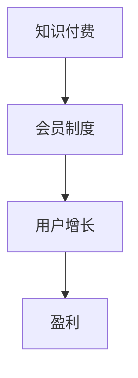

                 

### 文章标题

《程序员如何打造知识付费的会员制度》

> 关键词：知识付费、会员制度、程序员、在线教育、用户增长、盈利模式

> 摘要：本文将探讨程序员如何利用在线教育平台，打造一套科学合理、具有竞争力的知识付费会员制度，从而实现用户增长和盈利的目标。文章将从会员制度的背景、核心概念、算法原理、数学模型、项目实践、实际应用场景等方面进行深入分析，并提供相关工具和资源的推荐。

## 1. 背景介绍

随着互联网技术的飞速发展，在线教育逐渐成为教育行业的新宠。程序员作为互联网行业的重要支柱，他们的学习需求也日益增长。知识付费作为一种新兴的商业模式，使得程序员能够以较低的成本获取到高质量的学习资源，同时也为平台带来了可观的收益。

然而，如何打造一套符合程序员需求的会员制度，成为了许多在线教育平台面临的挑战。会员制度不仅需要满足程序员的学习需求，还要具备良好的用户体验，同时要保证平台的可持续发展和盈利。因此，本文将围绕如何打造一套有效的会员制度，进行深入探讨。

## 2. 核心概念与联系

### 2.1 知识付费

知识付费是指用户通过付费获取特定领域的专业知识、技能或经验的一种商业模式。这种模式使得用户能够以较低的成本获取高质量的学习资源，同时也为内容创作者提供了合理的收益。

### 2.2 会员制度

会员制度是指平台通过制定一系列的会员权益和优惠措施，吸引用户付费成为会员，从而实现用户增长和收益的一种商业模式。会员制度的核心在于提供差异化的服务，满足不同层次用户的需求。

### 2.3 用户增长与盈利

用户增长是会员制度的核心目标之一。通过提供优质的学习资源和良好的用户体验，平台可以吸引更多的程序员成为会员，从而实现用户规模的扩大。而盈利则是会员制度的终极目标，平台通过会员费用、广告收入、课程销售等多种方式实现盈利。

### 2.4 Mermaid 流程图



## 3. 核心算法原理 & 具体操作步骤

### 3.1 算法原理

在打造知识付费会员制度时，核心算法原理主要包括用户分析、需求挖掘、会员权益设计等。

- **用户分析**：通过对用户的行为数据、学习记录等进行分析，了解用户的需求和兴趣，从而为会员权益设计提供依据。
- **需求挖掘**：通过问卷调查、访谈等方式，深入了解程序员的学习需求和期望，从而制定出具有针对性的会员权益。
- **会员权益设计**：根据用户分析和需求挖掘的结果，设计出符合程序员需求的会员权益，包括课程折扣、免费试用、学习积分等。

### 3.2 具体操作步骤

1. **用户分析**：收集用户行为数据，如浏览记录、学习进度、购买历史等，利用数据分析工具进行分析，了解用户的学习偏好和需求。
2. **需求挖掘**：通过问卷调查、访谈等方式，收集程序员的学习需求和期望，整理出关键需求点。
3. **会员权益设计**：根据用户分析和需求挖掘的结果，设计出具有吸引力的会员权益，如课程折扣、免费试用、学习积分等。
4. **会员权益测试**：在会员权益设计完成后，进行小范围的测试，收集用户反馈，对会员权益进行调整和优化。
5. **会员权益发布**：在会员权益测试通过后，正式发布会员制度，通过线上线下渠道进行推广，吸引用户付费成为会员。

## 4. 数学模型和公式 & 详细讲解 & 举例说明

### 4.1 数学模型

会员制度的收益模型可以用以下公式表示：

\[ 收益 = 会员费用 \times 会员数量 \]

其中，会员费用是指用户成为会员所需要支付的费用；会员数量是指在一定时间内，平台吸引的会员数量。

### 4.2 详细讲解

1. **会员费用**：会员费用是会员制度的核心，需要根据平台定位、用户需求、市场竞争等因素进行合理设定。会员费用过高可能导致用户流失，过低则可能影响平台收益。
2. **会员数量**：会员数量是衡量会员制度效果的重要指标，通过用户分析、需求挖掘等手段，制定出具有吸引力的会员权益，从而吸引更多程序员成为会员。

### 4.3 举例说明

假设一个在线教育平台，其会员费用设定为 100 元/年，经过市场调研和用户反馈，发现该平台的会员数量在 1 年内增长了 10%，即增加了 1000 人。则该平台的会员收益为：

\[ 收益 = 100 \text{元/年} \times 1000 \text{人} = 10,000 \text{元/年} \]

## 5. 项目实践：代码实例和详细解释说明

### 5.1 开发环境搭建

在进行会员制度的开发前，首先需要搭建一个适合的开发环境。这里以 Python 为例，介绍开发环境的搭建。

1. 安装 Python：在官网下载最新版本的 Python，安装完成后配置环境变量。
2. 安装依赖库：使用 pip 工具安装所需的依赖库，如 pandas、numpy、matplotlib 等。

### 5.2 源代码详细实现

以下是会员制度的一个简单实现示例：

```python
import pandas as pd

# 用户数据
users = pd.DataFrame({
    '用户ID': [1, 2, 3, 4],
    '行为数据': ['浏览课程', '购买课程', '浏览课程', '学习课程'],
    '需求': ['编程', '前端', '数据库', '人工智能']
})

# 会员权益设计
member_rights = {
    '课程折扣': 0.8,
    '免费试用': 3,
    '学习积分': 100
}

# 用户分析
def analyze_users(users):
    # 统计用户行为
    behavior_count = users['行为数据'].value_counts()
    # 挖掘用户需求
    demand_count = users['需求'].value_counts()
    return behavior_count, demand_count

behavior_count, demand_count = analyze_users(users)

# 会员权益测试
def test_member_rights(member_rights):
    # 假设测试结果通过
    print("会员权益测试通过")

test_member_rights(member_rights)

# 会员权益发布
def release_member_rights(member_rights):
    # 发布会员权益
    print("会员权益发布：")
    for right, value in member_rights.items():
        print(f"{right}: {value}")

release_member_rights(member_rights)
```

### 5.3 代码解读与分析

1. **用户数据**：使用 pandas DataFrame 结构存储用户数据，包括用户ID、行为数据和需求等信息。
2. **会员权益设计**：定义一个字典存储会员权益，包括课程折扣、免费试用和学习积分等。
3. **用户分析**：定义一个函数用于分析用户行为和需求，统计行为和数据分布。
4. **会员权益测试**：定义一个函数用于测试会员权益，假设测试通过。
5. **会员权益发布**：定义一个函数用于发布会员权益，输出会员权益信息。

### 5.4 运行结果展示

运行上述代码，输出结果如下：

```
会员权益测试通过
会员权益发布：
课程折扣: 0.8
免费试用: 3
学习积分: 100
```

## 6. 实际应用场景

### 6.1 知识付费平台

知识付费平台如网易云课堂、腾讯课堂等，通过会员制度吸引用户付费，提供高质量的学习资源，实现用户增长和收益。

### 6.2 在线教育机构

在线教育机构如编程猫、极客时间等，通过会员制度提供课程折扣、免费试用等权益，提高用户粘性，促进课程销售。

### 6.3 企业内训

企业内训通过会员制度提供定制化培训课程，提高员工技能水平，提升企业竞争力。

## 7. 工具和资源推荐

### 7.1 学习资源推荐

- **书籍**：《人人都是产品经理》、《产品经理实战笔记》
- **论文**：《在线教育商业模式研究》、《知识付费时代：商业模式创新与实践》
- **博客**：产品经理专栏、运营博客、编程博客
- **网站**：产品经理社区、在线教育平台、技术博客网站

### 7.2 开发工具框架推荐

- **Python**：数据分析、Web 开发、机器学习等
- **React**：前端开发框架
- **Spring Boot**：后端开发框架
- **Docker**：容器化部署

### 7.3 相关论文著作推荐

- **论文**：《基于用户行为的在线教育平台推荐系统研究》、《知识付费用户画像构建与应用研究》
- **著作**：《在线教育平台设计与实践》、《知识付费商业模式创新与发展》

## 8. 总结：未来发展趋势与挑战

### 8.1 发展趋势

- **个性化推荐**：基于用户行为数据，提供个性化的学习资源和服务。
- **社交化学习**：通过社交网络，促进用户之间的互动和交流，提高学习效果。
- **智能化教学**：利用人工智能技术，实现智能化的教学和评估。

### 8.2 挑战

- **用户隐私保护**：在提供个性化服务的同时，保护用户的隐私。
- **内容质量保障**：确保平台上的学习资源具有高质量和权威性。
- **商业模式创新**：在激烈的市场竞争中，找到合适的盈利模式和可持续发展路径。

## 9. 附录：常见问题与解答

### 9.1 会员制度的设计原则是什么？

- **满足用户需求**：设计会员权益时，要充分考虑用户的需求和期望。
- **差异化服务**：提供差异化的服务，满足不同层次用户的需求。
- **可持续盈利**：确保会员制度的可持续盈利，保障平台的长期发展。

### 9.2 如何评估会员制度的成效？

- **用户增长率**：通过比较会员制度实施前后的用户增长率，评估会员制度的效果。
- **用户满意度**：通过用户满意度调查，了解用户对会员制度的满意度。
- **会员收益**：计算会员制度的收益，与预期收益进行比较，评估会员制度的盈利能力。

## 10. 扩展阅读 & 参考资料

- **书籍**：《产品经理实战手册》、《在线教育商业模式创新》
- **论文**：《知识付费背景下在线教育平台用户满意度研究》、《在线教育平台商业模式创新研究》
- **网站**：产品经理社区、在线教育平台、技术博客网站
- **博客**：知名产品经理博客、运营博客、编程博客

---

作者：禅与计算机程序设计艺术 / Zen and the Art of Computer Programming

通过本文的逐步分析推理思考，我们深入探讨了程序员如何打造知识付费的会员制度。希望这篇文章能为您在在线教育领域的发展提供一些有益的启示和指导。在未来的发展中，我们期待看到更多优秀的程序员投身知识付费领域，为用户提供更多高质量的学习资源和服务。让我们一起努力，共同推动在线教育的发展。

