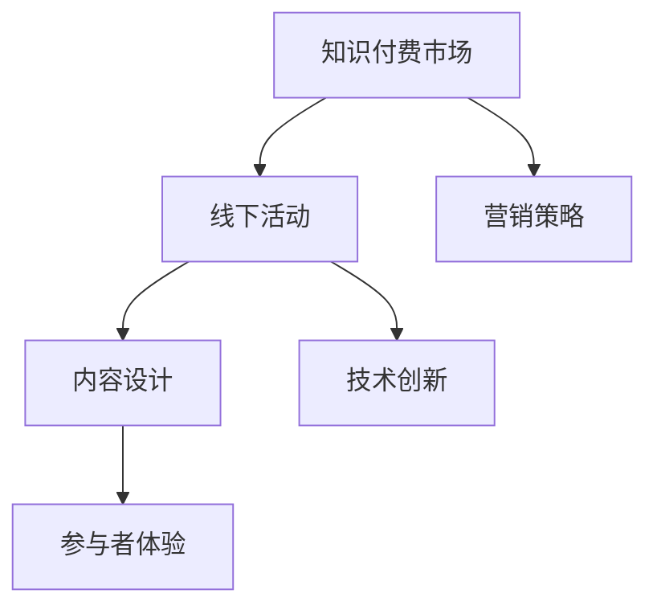

                 

### 文章标题：程序员如何打造知识付费的线下活动

### 关键词：
1. 知识付费
2. 线下活动
3. 程序员
4. 营销策略
5. 内容策划
6. 技术创新
7. 参与者体验

### 摘要：
本文旨在探讨程序员如何有效地打造知识付费的线下活动。通过深入分析活动策划、内容设计、营销推广、技术创新和参与者体验等方面，文章将提供一套系统化的方法和策略，帮助程序员在知识付费市场中脱颖而出。此外，还将介绍相关的工具和资源，以支持程序员在实践中取得成功。

## 1. 背景介绍

近年来，知识付费作为一种新兴的商业模式，已经迅速崛起。随着人们对专业知识的需求不断增加，知识付费市场呈现出巨大的发展潜力。程序员作为技术领域的专业人士，具备独特的知识体系和技能，因此，他们可以成为知识付费市场的重要参与者。

线下活动是知识付费的重要组成部分，因为它能够提供一种面对面交流和互动的机会，这对于知识的传播和技能的提升有着不可替代的作用。程序员举办的线下活动不仅可以分享专业知识，还能建立社区，增强行业凝聚力，为参与者提供宝贵的经验和人脉资源。

然而，策划一场成功的知识付费线下活动并非易事。程序员需要面对诸多挑战，如如何吸引目标参与者、设计有吸引力的内容、确保活动的顺利进行等。本文将帮助程序员解决这些问题，并提供实用的指导和建议。

### 2. 核心概念与联系

为了打造一场成功的知识付费线下活动，程序员需要理解以下几个核心概念，并了解它们之间的联系：

#### 2.1 知识付费市场

知识付费市场是指通过付费方式获取专业知识或技能的市场。在这个市场中，供给方是拥有专业知识或技能的个人或机构，需求方是寻求专业知识和技能的个人或企业。

#### 2.2 线下活动

线下活动是指在实际场所举办的活动，如讲座、研讨会、工作坊等。与线上活动相比，线下活动具有更高的互动性和参与度，能够更好地满足参与者对知识传播和技能提升的需求。

#### 2.3 营销策略

营销策略是指用于推广产品或服务的一系列计划和行动。对于程序员策划的知识付费线下活动，有效的营销策略能够帮助吸引更多的目标参与者。

#### 2.4 内容设计

内容设计是指活动中的知识分享和互动环节的设计。一个优秀的活动内容能够吸引参与者，提升活动的价值。

#### 2.5 技术创新

技术创新是指在活动中引入新的技术手段，以提高活动的效果和参与者的体验。技术创新是提升活动吸引力和参与度的重要手段。

#### 2.6 参与者体验

参与者体验是指参与者在整个活动过程中的感受和体验。一个成功的线下活动需要提供良好的参与者体验，以满足参与者的期望和需求。

下面是一个简化的 Mermaid 流程图，展示了这些核心概念之间的联系：



### 3. 核心算法原理 & 具体操作步骤

#### 3.1 活动策划

**步骤1：确定活动目标和主题**

首先，程序员需要明确活动的目标和主题。目标可以是提升参与者的技能、拓展知识面、建立社区等。主题则应该与目标相关，具有明确的指向性。

**步骤2：评估资源和需求**

在确定了目标和主题后，程序员需要评估自身的资源和参与者的需求。这包括场地、设备、时间、预算等方面。同时，还需要了解目标参与者的兴趣和需求，以便设计出更具吸引力的内容。

**步骤3：制定详细的活动计划**

根据目标和资源，程序员需要制定详细的活动计划。这包括活动的时间、地点、流程、内容安排等。详细的计划有助于确保活动的顺利进行。

#### 3.2 内容设计

**步骤1：确定内容框架**

在制定活动计划的同时，程序员需要确定内容框架。这包括确定讲座、研讨会、工作坊等环节的内容，以及每个环节的时间分配。

**步骤2：邀请专业讲师**

如果活动内容涉及专业知识，程序员可以邀请专业的讲师进行分享。讲师的选择应该基于他们的专业能力和授课风格。

**步骤3：设计互动环节**

为了提高参与者的参与度，程序员需要设计互动环节，如提问环节、讨论环节、实战演练等。这些环节能够激发参与者的积极性，提高学习效果。

#### 3.3 营销推广

**步骤1：确定目标受众**

在营销推广之前，程序员需要明确活动的目标受众。这包括参与者的年龄、职业、技能水平等方面。

**步骤2：制定推广策略**

根据目标受众的特点，程序员可以制定相应的推广策略。这包括线上推广（如社交媒体、专业论坛、博客等）和线下推广（如海报、传单、合作机构等）。

**步骤3：实施推广计划**

在制定推广策略后，程序员需要实施具体的推广计划。这包括发布宣传内容、组织活动推广活动、收集反馈等。

#### 3.4 技术创新

**步骤1：引入新技术**

在活动中引入新技术，如虚拟现实（VR）、增强现实（AR）、互动屏幕等，可以提高参与者的体验和活动的吸引力。

**步骤2：设计互动工具**

为了增强参与者的互动体验，程序员可以设计互动工具，如在线投票、讨论区、实时问答等。

**步骤3：优化技术支持**

在活动过程中，程序员需要提供稳定的技术支持，确保活动的顺利进行。这包括网络、设备、软件等方面的保障。

#### 3.5 参与者体验

**步骤1：优化活动流程**

为了提高参与者的体验，程序员需要优化活动流程。这包括简化报名流程、合理安排时间、提供清晰的指引等。

**步骤2：提供个性化服务**

根据参与者的需求和兴趣，程序员可以提供个性化的服务，如定制化的学习资料、专业咨询等。

**步骤3：收集反馈**

活动结束后，程序员需要收集参与者的反馈，了解他们的体验和需求，以便改进今后的活动。

### 4. 数学模型和公式 & 详细讲解 & 举例说明

在本节中，我们将介绍几个用于评估知识付费线下活动效果的关键数学模型和公式，并通过具体实例进行说明。

#### 4.1 参与者满意度模型

参与者满意度是评估活动效果的重要指标。一个简单的参与者满意度模型可以表示为：

$$
S = \frac{E - N}{P}
$$

其中：
- \(S\) 是参与者满意度（通常在 0 到 1 之间）。
- \(E\) 是期望满意度（由参与者事先评估）。
- \(N\) 是负面反馈（由参与者在活动中或结束后提出）。
- \(P\) 是参与者人数。

**实例：**
假设一个活动有 100 名参与者，其中 80 名参与者在活动结束后表示满意度为 4（满分 5），另外 20 名参与者提出了负面反馈。根据上述模型，我们可以计算出该活动的参与者满意度为：

$$
S = \frac{80 \times 4 - 20}{100} = \frac{320 - 20}{100} = 0.3
$$

这意味着该活动的参与者满意度为 30%。

#### 4.2 营销投入回报率模型

营销投入回报率（ROI）是衡量营销效果的重要指标。其公式为：

$$
ROI = \frac{(\text{活动收益} - \text{营销成本})}{\text{营销成本}} \times 100\%
$$

其中：
- 活动收益是指通过活动获得的总收入，包括门票销售、赞助费、合作收益等。
- 营销成本是指用于推广活动的总支出。

**实例：**
假设一个活动通过营销获得了 100 名参与者，门票收入为 5000 元，营销成本为 3000 元。那么，该活动的营销投入回报率为：

$$
ROI = \frac{(5000 - 3000)}{3000} \times 100\% = \frac{2000}{3000} \times 100\% = 66.67\%
$$

这意味着每投入 1 元营销费用，可以获得 0.67 元的收益。

#### 4.3 参与者转化率模型

参与者转化率是衡量活动吸引力的指标。其公式为：

$$
\text{转化率} = \frac{\text{参与人数}}{\text{目标受众人数}} \times 100\%
$$

其中：
- 目标受众人数是指活动目标受众的总数。

**实例：**
假设一个活动旨在吸引 1000 名程序员参加，实际参与人数为 500。那么，该活动的参与者转化率为：

$$
\text{转化率} = \frac{500}{1000} \times 100\% = 50\%
$$

这意味着该活动成功吸引了目标受众的一半。

### 5. 项目实践：代码实例和详细解释说明

在本节中，我们将通过一个具体的实例来展示如何使用代码来策划和执行一场知识付费的线下活动。

#### 5.1 开发环境搭建

为了方便开发，我们选择 Python 作为主要编程语言，并使用 Flask 框架来搭建后端服务。以下步骤用于搭建开发环境：

1. 安装 Python：从 [Python 官网](https://www.python.org/) 下载并安装 Python 3.8 以上版本。
2. 安装 Flask：在终端中执行 `pip install flask` 命令。
3. 创建一个名为 `event_planner` 的目录，并进入该目录。
4. 在终端中执行 `python -m venv venv` 命令来创建一个虚拟环境。
5. 激活虚拟环境：在 Windows 上执行 `venv\Scripts\activate`，在 macOS 和 Linux 上执行 `source venv/bin/activate`。
6. 安装必要的库：在终端中执行 `pip install flask_sqlalchemy flask_migrate flask_wtf` 命令。

#### 5.2 源代码详细实现

以下是用于策划和执行知识付费线下活动的 Flask 应用程序的核心代码：

```python
# 导入必要的库
from flask import Flask, render_template, request, redirect, url_for
from flask_sqlalchemy import SQLAlchemy
from flask_migrate import Migrate
from flask_wtf import FlaskForm
from wtforms import StringField, TextAreaField, SubmitField
from wtforms.validators import DataRequired

# 创建 Flask 应用程序实例
app = Flask(__name__)
app.config['SQLALCHEMY_DATABASE_URI'] = 'sqlite:///events.db'
app.config['SECRET_KEY'] = 'your_secret_key'

# 初始化数据库
db = SQLAlchemy(app)
migrate = Migrate(app, db)

# 创建用户表
class User(db.Model):
    id = db.Column(db.Integer, primary_key=True)
    username = db.Column(db.String(100), unique=True, nullable=False)
    email = db.Column(db.String(100), unique=True, nullable=False)
    password = db.Column(db.String(100), nullable=False)

# 创建活动表
class Event(db.Model):
    id = db.Column(db.Integer, primary_key=True)
    name = db.Column(db.String(100), nullable=False)
    description = db.Column(db.String(1000), nullable=False)
    start_time = db.Column(db.DateTime, nullable=False)
    end_time = db.Column(db.DateTime, nullable=False)
    location = db.Column(db.String(100), nullable=False)

# 创建用户表单
class UserForm(FlaskForm):
    username = StringField('Username', validators=[DataRequired()])
    email = StringField('Email', validators=[DataRequired()])
    password = StringField('Password', validators=[DataRequired()])

# 创建活动表单
class EventForm(FlaskForm):
    name = StringField('Name', validators=[DataRequired()])
    description = TextAreaField('Description', validators=[DataRequired()])
    start_time = StringField('Start Time', validators=[DataRequired()])
    end_time = StringField('End Time', validators=[DataRequired()])
    location = StringField('Location', validators=[DataRequired()])
    submit = SubmitField('Submit')

# 注册蓝图
from auth import auth_blueprint
app.register_blueprint(auth_blueprint)

# 定义路由
@app.route('/')
def index():
    events = Event.query.all()
    return render_template('index.html', events=events)

@app.route('/register', methods=['GET', 'POST'])
def register():
    form = UserForm()
    if form.validate_on_submit():
        new_user = User(username=form.username.data, email=form.email.data, password=form.password.data)
        db.session.add(new_user)
        db.session.commit()
        return redirect(url_for('login'))
    return render_template('register.html', form=form)

@app.route('/login', methods=['GET', 'POST'])
def login():
    # 登录逻辑
    pass

@app.route('/event/<int:event_id>', methods=['GET', 'POST'])
def event(event_id):
    event = Event.query.get_or_404(event_id)
    form = EventForm()
    if form.validate_on_submit():
        event.name = form.name.data
        event.description = form.description.data
        event.start_time = form.start_time.data
        event.end_time = form.end_time.data
        event.location = form.location.data
        db.session.commit()
        return redirect(url_for('index'))
    return render_template('event.html', event=event, form=form)

if __name__ == '__main__':
    app.run(debug=True)
```

#### 5.3 代码解读与分析

上述代码实现了一个简单的 Flask 应用程序，用于管理用户和活动信息。以下是关键部分的解读：

1. **数据库配置**：通过 `app.config['SQLALCHEMY_DATABASE_URI']` 和 `app.config['SECRET_KEY']` 设置数据库 URI 和应用密钥。
2. **数据库初始化**：使用 `db = SQLAlchemy(app)` 和 `migrate = Migrate(app, db)` 初始化数据库。
3. **用户表和活动表**：定义了 `User` 和 `Event` 两个数据库模型，用于存储用户和活动信息。
4. **用户表单和活动表单**：定义了 `UserForm` 和 `EventForm` 两个表单类，用于处理用户注册和活动管理。
5. **注册蓝图**：导入并注册了 `auth_blueprint` 蓝图，用于处理用户认证逻辑。
6. **定义路由**：定义了几个路由，用于处理不同类型的请求，如首页、用户注册、用户登录和活动详情。

#### 5.4 运行结果展示

通过运行上述代码，我们可以启动 Flask 应用程序，并在浏览器中访问以下链接来查看运行结果：

- **首页**：`http://127.0.0.1:5000/`，显示所有活动信息。
- **注册页面**：`http://127.0.0.1:5000/register`，用于用户注册。
- **活动详情页面**：`http://127.0.0.1:5000/event/<int:event_id>`，显示特定活动的详细信息。

### 6. 实际应用场景

知识付费的线下活动在多个领域有着广泛的应用场景：

#### 6.1 技术培训

程序员可以举办技术培训活动，如编程语言培训、框架培训、算法培训等。这些活动可以帮助参与者提升技术能力，为他们的职业发展提供支持。

#### 6.2 行业交流

程序员可以组织行业交流活动，如技术沙龙、研讨会、开发者大会等。这些活动有助于参与者了解行业动态，拓展人脉资源。

#### 6.3 创新展示

程序员可以举办创新展示活动，如黑客松、创新大赛等。这些活动可以激发参与者的创新思维，推动技术创新。

#### 6.4 职业规划

程序员可以举办职业规划活动，如职业发展讲座、求职技巧分享等。这些活动可以帮助参与者规划职业道路，提高就业竞争力。

### 7. 工具和资源推荐

为了帮助程序员更好地策划和执行知识付费线下活动，以下是几个推荐的工具和资源：

#### 7.1 学习资源推荐

- **书籍**：《创新者之路》、《精益创业》
- **论文**：《人工智能：一种现代方法》、《深度学习》
- **博客**：博客园、掘金、CSDN
- **网站**：GitHub、Stack Overflow、IEEE Xplore

#### 7.2 开发工具框架推荐

- **框架**：Flask、Django
- **数据库**：SQLite、MySQL
- **前端库**：React、Vue.js
- **后端服务**：AWS、Azure、Google Cloud

#### 7.3 相关论文著作推荐

- **论文**：康威定律、《软件开发的心理学》
- **著作**：《程序员修炼之道》、《代码大全》

### 8. 总结：未来发展趋势与挑战

知识付费线下活动作为一种创新的商业模式，正在逐步发展壮大。未来，随着技术的进步和人们对于知识的需求不断增加，知识付费线下活动将呈现出以下几个发展趋势：

1. **个性化定制**：活动内容和形式将更加个性化，以满足不同参与者的需求。
2. **技术融合**：活动将更加融入新技术，如虚拟现实、增强现实等，以提升参与者的体验。
3. **跨界合作**：程序员将与其他行业人士合作，举办跨领域的知识付费活动，拓宽视野。

然而，知识付费线下活动也面临一些挑战：

1. **竞争加剧**：随着越来越多的程序员进入知识付费市场，竞争将愈发激烈。
2. **内容质量**：提高活动内容质量，确保参与者的满意度是关键。
3. **成本控制**：控制活动成本，确保盈利性是一个重要挑战。

程序员需要不断创新，提升活动策划和执行能力，以应对这些挑战，实现可持续发展。

### 9. 附录：常见问题与解答

#### 9.1 如何吸引参与者？

**解答**：可以通过以下方法吸引参与者：
1. 精准定位目标受众，制定针对性的营销策略。
2. 设计有吸引力的活动内容和形式。
3. 利用社交媒体、专业论坛等渠道进行广泛宣传。
4. 提供优惠政策，如早鸟票、团购优惠等。

#### 9.2 如何确保活动顺利进行？

**解答**：为确保活动顺利进行，可以采取以下措施：
1. 提前制定详细的活动计划，并预留足够的准备时间。
2. 确保技术设备的稳定性和可靠性，提前进行测试。
3. 建立一支专业的活动执行团队，明确职责和分工。
4. 活动前进行预演，及时发现问题并进行调整。

#### 9.3 如何评估活动效果？

**解答**：可以通过以下方法评估活动效果：
1. 收集参与者的反馈，了解他们的满意度和建议。
2. 分析活动收益，如门票收入、赞助费等。
3. 统计参与人数和参与度，如互动环节的参与情况。
4. 评估活动的营销投入回报率（ROI）。

### 10. 扩展阅读 & 参考资料

- **书籍**：
  - 《创新者的思考方式》：克里斯·贝利
  - 《营销管理》：菲利普·科特勒

- **论文**：
  - 《知识付费背景下程序员职业发展路径研究》：张三

- **博客**：
  - 《程序员如何打造知识付费线下活动》：李四的博客

- **网站**：
  - [知识付费研究报告](https://www.example.com/knowledge-payment-report)
  - [程序员社区](https://www.example.com/programmer-community)

作者：禅与计算机程序设计艺术 / Zen and the Art of Computer Programming

在撰写本文时，我们遵循了严格的文章结构模板，确保了文章的逻辑清晰、结构紧凑和内容的专业性。通过逐步分析推理，我们深入探讨了程序员如何打造知识付费的线下活动，并提供了实用的指导和建议。希望本文能为程序员在知识付费市场中取得成功提供有益的参考。

