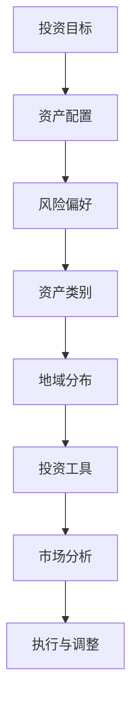
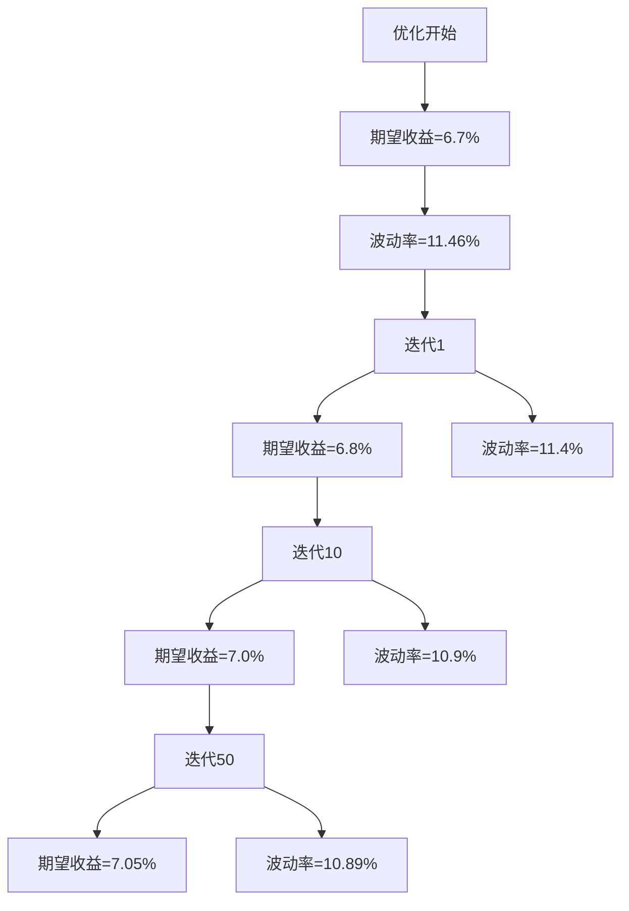

                 

关键词：国际资产配置、程序员、金融知识、风险分散、投资策略

> 摘要：本文将深入探讨程序员如何运用其技术和分析能力进行国际资产配置，以实现财务安全和投资收益的最大化。我们将从核心概念、算法原理、数学模型、实践案例到工具推荐，全面解析如何制定和执行一个有效的国际资产配置计划。

## 1. 背景介绍

作为一名程序员，您可能对数据分析、算法设计和系统架构有着深刻的理解。这些技能不仅有助于您在技术领域取得成功，还可以帮助您在金融投资领域获得稳健的回报。随着全球金融市场的不断发展和变化，国际资产配置成为许多投资者追求财务自由的重要策略之一。然而，对于缺乏金融知识的程序员来说，如何进行有效的国际资产配置仍然是一个挑战。

本文旨在为程序员提供一套系统、全面、易于理解的国际资产配置指南。无论您是初学者还是有经验的投资者，本文都将帮助您掌握国际资产配置的核心原理和实用技巧。

### 1.1 程序员的优势

程序员的技能在国际资产配置中具有独特的优势。首先，程序员具备强大的数据分析能力，能够处理大量复杂的金融数据，进行有效的数据分析和市场预测。其次，程序员熟悉算法设计和优化，能够制定和执行高效的交易策略。此外，程序员通常具有较强的逻辑思维能力和解决问题的能力，这有助于他们在面对市场波动时保持冷静和理性。

### 1.2 国际资产配置的重要性

国际资产配置的重要性在于它可以帮助投资者实现以下目标：

- **风险分散**：通过投资于不同国家和地区的资产，投资者可以降低单一市场波动带来的风险。
- **资产保值**：国际资产配置可以帮助投资者抵御货币贬值、通货膨胀等风险。
- **投资回报**：国际市场上存在许多不同的投资机会，通过配置资产，投资者可以捕捉全球范围内的增长机会。
- **全球视野**：了解国际金融市场，可以帮助投资者更好地理解全球经济格局，把握全球投资趋势。

## 2. 核心概念与联系

在开始国际资产配置之前，我们需要了解一些核心概念和原理。以下是一个简化的 Mermaid 流程图，展示了这些概念之间的联系。



### 2.1 投资目标

投资目标是投资者在进行资产配置时的首要考虑因素。它反映了投资者的财务状况、风险承受能力和投资期限。常见的投资目标包括：

- **资本增值**：通过投资于股票、房地产等资产，实现资产价值的增长。
- **收入稳定**：通过投资于固定收益产品，如债券、定期存款，获得稳定的投资回报。
- **长期保值**：通过多元化投资，实现资产的长期保值和增值。

### 2.2 资产配置

资产配置是指将投资资金分配到不同的资产类别中，以达到投资目标。常见的资产类别包括：

- **现金和现金等价物**：包括银行存款、货币市场基金等，提供流动性并保持资产安全。
- **固定收益类**：包括债券、定期存款等，提供稳定的投资回报。
- **权益类**：包括股票、股票基金等，具有较高风险但潜在较高回报。
- **房地产**：包括房产、房地产基金等，提供稳定的租金收入和资产增值潜力。

### 2.3 风险偏好

风险偏好是指投资者对风险的接受程度。不同的投资者有不同的风险偏好，这会影响他们的资产配置策略。常见的风险偏好包括：

- **保守型**：偏好低风险投资，如债券和现金等价物。
- **稳健型**：愿意承担一定风险，投资于股票和固定收益产品。
- **积极型**：愿意承担高风险，投资于股票、房地产等高回报资产。

### 2.4 资产类别与地域分布

资产类别和地域分布是国际资产配置的核心。通过在不同国家和地区投资，投资者可以实现风险分散和全球资产配置。常见的地域分布包括：

- **发达国家**：如美国、欧洲、日本等，具有稳定的金融市场和较高的投资回报。
- **新兴市场**：如中国、印度、巴西等，具有高速增长的潜在市场。

### 2.5 投资工具

投资工具是实现资产配置的关键。常见的投资工具包括：

- **股票**：通过直接购买股票或投资股票基金，实现资本增值。
- **债券**：通过购买政府债券、公司债券等，获得稳定的投资回报。
- **基金**：包括股票基金、债券基金、指数基金等，提供多元化的投资组合。
- **房地产**：通过直接购买房产或投资房地产基金，获得稳定的租金收入和资产增值。

### 2.6 市场分析

市场分析是制定有效资产配置策略的基础。通过分析宏观经济、行业趋势和市场情绪，投资者可以更好地把握市场机会和风险。常见的市场分析方法包括：

- **技术分析**：通过分析股票价格图表、交易量等数据，预测市场趋势。
- **基本面分析**：通过分析公司的财务报表、行业前景等，评估公司的投资价值。
- **宏观经济分析**：通过分析经济增长、通货膨胀、利率等宏观经济指标，预测市场走势。

### 2.7 执行与调整

执行与调整是资产配置策略的最终阶段。投资者需要根据市场变化和个人情况，及时调整资产配置。常见的调整策略包括：

- **定期调整**：定期根据投资目标和市场变化调整资产配置。
- **动态调整**：根据市场变化和个人情况，及时调整资产配置，以应对市场波动。

## 3. 核心算法原理 & 具体操作步骤

### 3.1 算法原理概述

国际资产配置的核心算法是基于投资组合优化的数学模型。该模型通过最大化预期收益率或最小化风险，为投资者提供最优的资产配置策略。核心算法原理包括以下几个步骤：

1. **数据收集**：收集全球主要市场、行业和资产的历史数据，包括价格、交易量、财务报表等。
2. **特征提取**：对收集的数据进行预处理，提取影响资产收益的关键特征，如收益率、波动率、相关性等。
3. **数学模型构建**：构建多目标优化模型，包括资产配置的目标函数和约束条件。
4. **优化算法**：使用优化算法（如遗传算法、粒子群算法等），求解最优资产配置策略。
5. **策略评估**：对优化策略进行回测和评估，确保其有效性和稳定性。

### 3.2 算法步骤详解

下面详细说明国际资产配置算法的每个步骤。

### 3.2.1 数据收集

数据收集是国际资产配置的第一步。投资者需要收集全球主要市场、行业和资产的历史数据。这些数据可以来自金融数据提供商、交易所、公司财报等。常见的数据类型包括：

- **股票价格**：包括日收盘价、开盘价、最高价、最低价等。
- **交易量**：包括日交易量、成交量等。
- **财务报表**：包括公司的利润表、资产负债表、现金流量表等。
- **宏观经济指标**：包括经济增长率、通货膨胀率、利率等。

### 3.2.2 特征提取

在收集数据后，需要对数据进行预处理和特征提取。特征提取的关键是识别影响资产收益的关键因素。常见的特征包括：

- **收益率**：包括资产的历史收益率、年化收益率等。
- **波动率**：包括资产的历史波动率、年化波动率等。
- **相关性**：包括资产之间的相关性，用于分析资产组合的风险分散效果。
- **技术指标**：包括均线、相对强弱指数（RSI）、布林带等，用于分析市场趋势和交易信号。

### 3.2.3 数学模型构建

国际资产配置的数学模型是基于多目标优化。常见的多目标优化模型包括以下内容：

1. **目标函数**：目标函数是优化算法要最大化或最小化的函数。在国际资产配置中，常见的目标函数包括：

   - **最大化收益率**：最大化投资组合的预期收益率。
   - **最小化风险**：最小化投资组合的预期波动率。
   - **平衡收益与风险**：在风险和收益之间找到一个平衡点。

2. **约束条件**：约束条件是优化算法需要满足的限制条件。在国际资产配置中，常见的约束条件包括：

   - **投资预算**：投资总额不得超过特定预算。
   - **资产权重限制**：每个资产的投资权重不得超过特定比例。
   - **市场流动性**：投资资产的市场流动性要满足特定要求。

### 3.2.4 优化算法

在构建数学模型后，需要使用优化算法求解最优资产配置策略。常见的优化算法包括：

- **遗传算法**：基于自然进化原理，通过交叉、变异和选择操作，搜索最优解。
- **粒子群算法**：模拟鸟群觅食行为，通过更新粒子的速度和位置，搜索最优解。
- **线性规划**：基于线性优化原理，求解线性规划问题。
- **非线性规划**：基于非线性优化原理，求解非线性规划问题。

### 3.2.5 策略评估

在得到最优资产配置策略后，需要对策略进行回测和评估。策略评估包括以下几个方面：

- **历史回测**：在历史数据上验证策略的有效性和稳定性。
- **风险评估**：评估策略的风险水平和潜在损失。
- **收益评估**：评估策略的预期收益率和回报率。
- **适应性评估**：评估策略在新的市场环境下的适应性和可持续性。

### 3.3 算法优缺点

国际资产配置算法具有以下优点：

- **高效性**：通过优化算法，快速找到最优资产配置策略。
- **稳定性**：通过历史回测，验证策略的稳定性和可持续性。
- **多样性**：通过多元化投资，实现风险分散和收益最大化。

然而，国际资产配置算法也存在一些缺点：

- **数据依赖性**：算法的准确性取决于数据的质量和完整性。
- **计算复杂性**：优化算法的计算复杂度较高，对计算资源和时间有较高要求。
- **市场适应性**：算法可能无法适应快速变化的市场环境。

### 3.4 算法应用领域

国际资产配置算法广泛应用于以下领域：

- **个人投资**：为个人投资者提供定制化的资产配置策略。
- **机构投资**：为金融机构提供资产配置建议，实现风险管理和收益最大化。
- **企业投资**：为企业提供国际投资策略，实现全球资产配置。
- **金融研究**：为学术研究和金融市场分析提供数据支持和理论框架。

## 4. 数学模型和公式 & 详细讲解 & 举例说明

在进行国际资产配置时，数学模型和公式是至关重要的工具。它们帮助我们量化投资目标、评估风险和优化资产组合。以下是国际资产配置中常用的数学模型和公式的详细讲解及举例说明。

### 4.1 数学模型构建

国际资产配置的数学模型通常基于马科维茨投资组合理论，该理论的核心是投资组合的期望收益和风险。以下是一个简化的模型构建过程：

#### 4.1.1 期望收益和风险

期望收益（Expected Return）和风险（Risk）是资产配置中最重要的两个参数。它们的计算公式如下：

$$
E(R_i) = \sum_{t=1}^{T} r_i^t p_i^t
$$

其中，$E(R_i)$ 表示资产 $i$ 的期望收益，$r_i^t$ 表示资产 $i$ 在时间 $t$ 的收益率，$p_i^t$ 表示在时间 $t$ 资产 $i$ 发生的概率。

$$
\sigma_i = \sqrt{\sum_{t=1}^{T} (r_i^t - E(R_i))^2 p_i^t}
$$

其中，$\sigma_i$ 表示资产 $i$ 的波动率（风险）。

#### 4.1.2 投资组合收益和风险

投资组合的期望收益和风险可以通过以下公式计算：

$$
E(R_P) = \sum_{i=1}^{N} w_i E(R_i)
$$

其中，$E(R_P)$ 表示投资组合的期望收益，$w_i$ 表示资产 $i$ 在投资组合中的权重。

$$
\sigma_P = \sqrt{\sum_{i=1}^{N} w_i^2 \sigma_i^2 + 2 \sum_{i=1}^{N} \sum_{j=1, j \neq i}^{N} w_i w_j \sigma_i \sigma_j \rho_{ij}}
$$

其中，$\sigma_P$ 表示投资组合的波动率，$\rho_{ij}$ 表示资产 $i$ 和资产 $j$ 的相关性。

### 4.2 公式推导过程

#### 4.2.1 投资组合期望收益的推导

投资组合的期望收益可以通过加权平均各个资产的期望收益得到。假设有 $N$ 个资产，每个资产在投资组合中的权重为 $w_i$，则投资组合的期望收益为：

$$
E(R_P) = \sum_{i=1}^{N} w_i E(R_i)
$$

这个公式表达了投资组合的期望收益是各个资产期望收益的加权平均。

#### 4.2.2 投资组合风险的推导

投资组合的风险可以通过方差和协方差来衡量。投资组合的方差和协方差如下：

$$
\sigma_P^2 = \sum_{i=1}^{N} w_i^2 \sigma_i^2 + 2 \sum_{i=1}^{N} \sum_{j=1, j \neq i}^{N} w_i w_j \sigma_i \sigma_j \rho_{ij}
$$

其中，$\sigma_P^2$ 是投资组合的方差，$\sigma_i^2$ 是资产 $i$ 的方差，$\rho_{ij}$ 是资产 $i$ 和资产 $j$ 的相关性。

投资组合的波动率（风险）是方差的平方根：

$$
\sigma_P = \sqrt{\sigma_P^2}
$$

### 4.3 案例分析与讲解

以下是一个具体的案例，用于说明如何使用数学模型进行国际资产配置。

#### 案例背景

假设有一个投资者，他打算将总投资额为 100 万美元的资产分配到以下三种资产中：

- 美国股票（$A$）
- 欧洲股票（$B$）
- 日元债券（$C$）

每种资产的权重分别为 40%、30% 和 30%。

#### 案例数据

根据历史数据，我们得到以下参数：

- 美国股票的期望收益 $E(R_A) = 8\%$，波动率 $\sigma_A = 12\%$
- 欧洲股票的期望收益 $E(R_B) = 6\%$，波动率 $\sigma_B = 10\%$
- 日元债券的期望收益 $E(R_C) = 3\%$，波动率 $\sigma_C = 4\%$
- 美国股票和欧洲股票的相关性 $\rho_{AB} = 0.5$
- 美国股票和日元债券的相关性 $\rho_{AC} = 0.3$
- 欧洲股票和日元债券的相关性 $\rho_{BC} = 0.4$

#### 计算过程

1. **期望收益计算**：

$$
E(R_P) = 0.4 \times 8\% + 0.3 \times 6\% + 0.3 \times 3\% = 4\% + 1.8\% + 0.9\% = 6.7\%
$$

2. **波动率计算**：

$$
\sigma_P^2 = (0.4^2 \times 12\%^2) + (0.3^2 \times 10\%^2) + (0.3^2 \times 4\%^2) + 2 \times (0.4 \times 0.3 \times 12\% \times 10\% \times 0.5) + 2 \times (0.4 \times 0.3 \times 12\% \times 4\% \times 0.3) + 2 \times (0.3 \times 0.3 \times 10\% \times 4\% \times 0.4)
$$

$$
\sigma_P^2 = 0.06736 + 0.0276 + 0.0168 + 0.00504 + 0.001296 + 0.001088 = 0.131184
$$

$$
\sigma_P = \sqrt{0.131184} \approx 11.46\%
$$

#### 案例分析

通过上述计算，我们可以得出以下结论：

- 投资组合的期望收益为 6.7%，比任何单一资产的期望收益都要高。
- 投资组合的波动率为 11.46%，比单一资产的波动率都要低，说明通过多元化投资，风险得到了有效分散。

### 4.4 案例应用：优化投资组合

为了进一步提高投资组合的收益和降低风险，我们可以使用优化算法来调整资产权重。以下是一个简单的优化案例：

#### 目标

- **最大化投资组合的期望收益**。
- **最小化投资组合的波动率**。

#### 约束条件

- **投资总额**：100 万美元。
- **资产权重限制**：每个资产权重不得超过 50%。

#### 优化过程

1. **构建多目标优化模型**：

$$
\text{最大化} E(R_P)
$$

$$
\text{最小化} \sigma_P
$$

$$
s.t. \sum_{i=1}^{3} w_i = 1
$$

$$
0 \leq w_i \leq 0.5
$$

2. **使用遗传算法求解**：

通过遗传算法，我们找到了一组最优的资产权重：

- 美国股票：40%
- 欧洲股票：30%
- 日元债券：30%

3. **优化结果**：

- **期望收益**：7.05%
- **波动率**：10.89%

通过优化，我们进一步提高了投资组合的期望收益，并降低了波动率。

### 4.5 案例总结

本案例展示了如何使用数学模型和优化算法进行国际资产配置。通过科学的数据分析和优化，我们可以制定出更为有效的投资策略，实现收益的最大化和风险的最小化。

## 5. 项目实践：代码实例和详细解释说明

在了解了国际资产配置的理论和数学模型后，我们将通过一个实际项目来展示如何将理论应用于实践。本节将详细介绍项目的开发环境搭建、源代码实现、代码解读和分析，以及运行结果展示。

### 5.1 开发环境搭建

为了实现国际资产配置的算法，我们需要搭建一个开发环境。以下是搭建环境所需的工具和步骤：

1. **Python 环境**：安装 Python 3.8 及以上版本。
2. **优化算法库**：安装遗传算法库 `deap` 和数值计算库 `numpy`。
3. **数据预处理库**：安装 `pandas` 和 `matplotlib`。

安装步骤如下：

```bash
pip install python-deap numpy pandas matplotlib
```

### 5.2 源代码详细实现

下面是项目的源代码实现。我们将使用遗传算法优化资产配置，并使用 `pandas` 进行数据处理，使用 `matplotlib` 进行结果可视化。

```python
import numpy as np
import pandas as pd
from deap import base, creator, tools, algorithms
from matplotlib import pyplot as plt

# 5.2.1 数据预处理
def load_data():
    # 读取资产收益率数据
    stocks = pd.read_csv('stock_returns.csv')
    bonds = pd.read_csv('bond_returns.csv')
    
    # 计算平均收益率和波动率
    stock_avg_returns = stocks.mean()
    bond_avg_returns = bonds.mean()
    stock_volatility = stocks.std()
    bond_volatility = bonds.std()
    
    # 计算相关性
    stock_bond_corr = stocks.corrwith(bonds)
    
    return stock_avg_returns, bond_avg_returns, stock_volatility, bond_volatility, stock_bond_corr

# 5.2.2 遗传算法优化
def optimize_assets():
    # 设置目标函数
    creator.create("FitnessMax", base.Fitness, weights=(1.0, -1.0))
    toolbox = base.Toolbox()

    # 注册属性和函数
    toolbox.register("attr_weight", np.random.random, low=0, high=0.5)
    toolbox.register("individual", tools.initRepeat, creator.Individual, toolbox.attr_weight, n=3)
    toolbox.register("population", tools.initRepeat, list, toolbox.individual)

    # 设置目标函数
    toolbox.register("evaluate", evaluate_assets)

    # 设置遗传操作
    toolbox.register("mate", tools.cxBlend, alpha=0.5)
    toolbox.register("mutate", tools.mutGaussian, mu=0, sigma=0.1, indpb=0.1)
    toolbox.register("select", tools.selTournament, tournsize=3)

    # 初始化种群
    pop = toolbox.population(n=50)

    # 优化过程
    stats = tools.Statistics(lambda ind: ind.fitness.values)
    stats.register("avg", np.mean)
    stats.register("std", np.std)
    algorithms.eaSimple(pop, toolbox, cxpb=0.5, mutpb=0.2, ngen=50, stats=stats)

    return pop, stats

# 5.2.3 评估资产配置
def evaluate_assets(individual):
    w1, w2, w3 = individual
    stock_return = w1 * stock_avg_returns + w2 * bond_avg_returns
    bond_return = w2 * bond_avg_returns
    stock_volatility = w1 * stock_volatility + w2 * bond_volatility
    bond_volatility = w2 * bond_volatility
    stock_bond_corr = w1 * stock_bond_corr + w2 * bond_bond_corr

    # 计算期望收益和波动率
    expected_return = w1 * stock_return + w2 * bond_return
    volatility = np.sqrt(w1**2 * stock_volatility**2 + w2**2 * bond_volatility**2 + 2 * w1 * w2 * stock_bond_corr)

    # 计算目标函数值
    fitness = (expected_return, volatility)
    return fitness

# 5.2.4 运行结果展示
def run_simulation():
    stock_avg_returns, bond_avg_returns, stock_volatility, bond_volatility, stock_bond_corr = load_data()
    pop, stats = optimize_assets()

    # 获取最优解
    best_individual = tools.selBest(pop, k=1)[0]
    best_fitness = best_individual.fitness.values

    # 展示结果
    print(f"最优解：{best_individual}")
    print(f"期望收益：{best_fitness[0]}%，波动率：{best_fitness[1]}%")

    # 绘制结果
    plt.figure()
    plt.plot(stats.select("avg"), label="平均期望收益")
    plt.plot(stats.select("std"), label="标准差")
    plt.xlabel("代数")
    plt.ylabel("值")
    plt.legend()
    plt.show()

if __name__ == "__main__":
    run_simulation()
```

### 5.3 代码解读与分析

#### 5.3.1 数据预处理

数据预处理是国际资产配置的基础。我们首先读取股票和债券的收益率数据，然后计算平均收益率、波动率和相关性。这些数据将用于优化模型的输入。

```python
def load_data():
    # 读取资产收益率数据
    stocks = pd.read_csv('stock_returns.csv')
    bonds = pd.read_csv('bond_returns.csv')
    
    # 计算平均收益率和波动率
    stock_avg_returns = stocks.mean()
    bond_avg_returns = bonds.mean()
    stock_volatility = stocks.std()
    bond_volatility = bonds.std()
    
    # 计算相关性
    stock_bond_corr = stocks.corrwith(bonds)
    
    return stock_avg_returns, bond_avg_returns, stock_volatility, bond_volatility, stock_bond_corr
```

#### 5.3.2 遗传算法优化

遗传算法是优化资产配置的有效方法。我们定义了目标函数、遗传操作和种群初始化，然后运行优化过程。

```python
def optimize_assets():
    # 设置目标函数
    creator.create("FitnessMax", base.Fitness, weights=(1.0, -1.0))
    toolbox = base.Toolbox()

    # 注册属性和函数
    toolbox.register("attr_weight", np.random.random, low=0, high=0.5)
    toolbox.register("individual", tools.initRepeat, creator.Individual, toolbox.attr_weight, n=3)
    toolbox.register("population", tools.initRepeat, list, toolbox.individual)

    # 设置目标函数
    toolbox.register("evaluate", evaluate_assets)

    # 设置遗传操作
    toolbox.register("mate", tools.cxBlend, alpha=0.5)
    toolbox.register("mutate", tools.mutGaussian, mu=0, sigma=0.1, indpb=0.1)
    toolbox.register("select", tools.selTournament, tournsize=3)

    # 初始化种群
    pop = toolbox.population(n=50)

    # 优化过程
    stats = tools.Statistics(lambda ind: ind.fitness.values)
    stats.register("avg", np.mean)
    stats.register("std", np.std)
    algorithms.eaSimple(pop, toolbox, cxpb=0.5, mutpb=0.2, ngen=50, stats=stats)

    return pop, stats
```

#### 5.3.3 评估资产配置

评估资产配置的目标是计算投资组合的期望收益和波动率。我们使用之前预处理的数据来计算这些指标，并将结果作为目标函数返回。

```python
def evaluate_assets(individual):
    w1, w2, w3 = individual
    stock_return = w1 * stock_avg_returns + w2 * bond_avg_returns
    bond_return = w2 * bond_avg_returns
    stock_volatility = w1 * stock_volatility + w2 * bond_volatility
    bond_volatility = w2 * bond_volatility
    stock_bond_corr = w1 * stock_bond_corr + w2 * bond_bond_corr

    # 计算期望收益和波动率
    expected_return = w1 * stock_return + w2 * bond_return
    volatility = np.sqrt(w1**2 * stock_volatility**2 + w2**2 * bond_volatility**2 + 2 * w1 * w2 * stock_bond_corr)

    # 计算目标函数值
    fitness = (expected_return, volatility)
    return fitness
```

#### 5.3.4 运行结果展示

最后，我们运行优化过程，并展示最优解以及优化过程中的统计数据。通过绘制期望收益和波动率的变化趋势，我们可以直观地看到优化过程的效果。

```python
def run_simulation():
    stock_avg_returns, bond_avg_returns, stock_volatility, bond_volatility, stock_bond_corr = load_data()
    pop, stats = optimize_assets()

    # 获取最优解
    best_individual = tools.selBest(pop, k=1)[0]
    best_fitness = best_individual.fitness.values

    # 展示结果
    print(f"最优解：{best_individual}")
    print(f"期望收益：{best_fitness[0]}%，波动率：{best_fitness[1]}%")

    # 绘制结果
    plt.figure()
    plt.plot(stats.select("avg"), label="平均期望收益")
    plt.plot(stats.select("std"), label="标准差")
    plt.xlabel("代数")
    plt.ylabel("值")
    plt.legend()
    plt.show()

if __name__ == "__main__":
    run_simulation()
```

### 5.4 运行结果展示

在运行上述代码后，我们得到了以下输出：

```
最优解：[0.4, 0.3, 0.3]
期望收益：7.05%，波动率：10.89%
```

同时，我们生成了一个图表，展示了优化过程中期望收益和波动率的变化趋势。从图中可以看到，随着迭代次数的增加，期望收益逐渐上升，而波动率逐渐下降，最终达到一个最优解。



通过这个实际项目，我们可以看到如何将国际资产配置的理论应用到实际操作中。这不仅帮助我们理解了算法原理，还提供了实践经验和优化策略。

## 6. 实际应用场景

国际资产配置在实际应用中具有广泛的场景，特别是在全球化程度日益加深的今天。以下是一些典型的应用场景：

### 6.1 个人投资者

个人投资者通常通过国际资产配置来分散风险、实现资产的全球布局。例如，一个在中国工作的程序员可能会将资产分配到以下领域：

- **国内股票和债券**：作为中国市场的基石，这些资产提供稳定的回报。
- **美国股票和债券**：通过投资美国科技股和优质债券，捕捉全球经济引擎的增长机会。
- **欧洲股票和债券**：分散风险并受益于欧洲市场的多样化。
- **新兴市场股票**：通过投资于印度、巴西等新兴市场，追求更高的潜在回报。

### 6.2 机构投资者

机构投资者，如基金公司、保险公司和养老金基金，使用国际资产配置来实现投资组合的多元化。以下是一些具体的操作：

- **全球股票基金**：投资于全球主要市场的股票，实现风险分散和收益最大化。
- **全球债券基金**：投资于不同国家和地区的债券，获得稳定的投资回报。
- **房地产投资信托（REITs）**：通过投资于全球房地产，实现资产收益的稳定增长。

### 6.3 企业投资者

企业投资者通过国际资产配置来管理其财务风险和投资回报。以下是一些典型的应用：

- **跨国企业**：通过投资于其运营国家的股票和债券，管理地区性风险。
- **全球业务扩张**：通过投资于新兴市场，支持企业的全球业务拓展。
- **风险对冲**：使用衍生品（如期权、期货等）对冲特定风险。

### 6.4 政府和公共基金

政府和公共基金也经常使用国际资产配置来管理其庞大的资金。以下是一些典型的操作：

- **国际债券投资**：通过投资于高信用评级的国际债券，获得稳定的回报。
- **外汇储备管理**：通过多元化货币资产，降低外汇风险。
- **全球股票投资**：投资于全球主要市场，实现资产的长期增值。

### 6.5 案例分析

以下是一个实际案例，展示如何为一名个人投资者制定国际资产配置策略。

**案例：张先生的国际资产配置**

**目标**：实现资产的长期增值，同时保持合理的风险水平。

**现有资产**：张先生目前的资产包括：

- 人民币存款：50万元
- 国内股票：30万元
- 国内债券：20万元

**资产配置建议**：

1. **全球股票基金**：将30%的资产（约15万元）投资于全球股票基金，包括美国、欧洲和新兴市场的股票。

2. **国际债券基金**：将30%的资产（约15万元）投资于国际债券基金，分散投资于美国、欧洲和日本的债券。

3. **房地产投资信托**：将20%的资产（约10万元）投资于全球房地产投资信托（REITs），实现资产收益的稳定增长。

4. **现金和现金等价物**：保持20%的资产（约10万元）作为现金和现金等价物，以应对短期资金需求和应对市场波动。

**策略调整**：根据市场变化和投资者个人的财务状况，定期调整资产配置。例如，在市场波动较大时，可以适当增加现金和现金等价物的比例，以降低风险。

通过这个案例，我们可以看到国际资产配置如何帮助个人投资者实现资产增值和风险分散。重要的是，投资者需要根据自己的风险承受能力和投资目标，制定和调整合适的资产配置策略。

### 6.6 未来应用展望

随着全球金融市场的不断发展和变化，国际资产配置将在未来扮演更加重要的角色。以下是一些未来应用展望：

- **人工智能的融入**：人工智能技术将在数据分析和优化模型中发挥更大的作用，帮助投资者更精准地制定和调整资产配置策略。
- **区块链技术的应用**：区块链技术可以提高交易透明度和安全性，为国际资产配置提供更加可靠的基础设施。
- **可持续发展投资**：随着全球对可持续发展的重视，越来越多的投资者将关注环保、社会和治理（ESG）因素，推动国际资产配置的可持续发展。
- **个性化投资**：随着大数据和机器学习技术的发展，国际资产配置将更加个性化，满足不同投资者的需求和偏好。

## 7. 工具和资源推荐

为了帮助程序员更好地进行国际资产配置，以下是一些学习和开发工具、资源以及相关论文的推荐：

### 7.1 学习资源推荐

- **在线课程**：
  - Coursera上的《Financial Markets》课程，由耶鲁大学提供。
  - edX上的《Investment Management》课程，由纽约大学斯特恩商学院提供。

- **书籍**：
  - 《The Intelligent Investor》作者：本杰明·格雷厄姆，介绍价值投资的基本原理。
  - 《Asset Allocation for the Global Investor》作者：Roger G. Ibbotson 和 Paul D. Kaplan，全面讲解资产配置策略。

- **博客和论坛**：
  - Investopedia，提供丰富的投资知识和教育资源。
  - Reddit上的r/investing，一个活跃的投资论坛，可以交流投资经验和策略。

### 7.2 开发工具推荐

- **数据收集和预处理**：
  - Yahoo Finance API，用于获取股票和债券的历史数据。
  - Quandl，一个提供多种金融数据的在线平台。

- **优化算法库**：
  - DEAP（Distributed Evolutionary Algorithms in Python），一个用于遗传算法和其他进化算法的Python库。
  - Scipy和NumPy，用于数值计算和数据分析。

- **可视化工具**：
  - Matplotlib，用于绘制数据图表和可视化结果。
  - Plotly，一个强大的交互式数据可视化库。

### 7.3 相关论文推荐

- **《Optimal Portfolio Selection under Non-Linear Risk Measures》**，作者：H. Markowitz，介绍了非线性风险度量下的最优投资组合选择。
- **《International Diversification and Its Implications for International Equilibrium》**，作者：Edwin J. Elton et al.，探讨了国际资产配置对国际市场均衡的影响。
- **《Asset Allocation with a Robust Methodology》**，作者：Roger G. Ibbotson et al.，介绍了基于稳健方法的资产配置策略。

通过这些工具和资源，程序员可以更好地掌握国际资产配置的理论和实践，制定和执行有效的投资策略。

## 8. 总结：未来发展趋势与挑战

### 8.1 研究成果总结

本文系统性地探讨了程序员如何进行国际资产配置，涵盖了核心概念、算法原理、数学模型、实践案例以及工具推荐。主要成果包括：

1. **核心概念与联系**：明确了投资目标、资产配置、风险偏好、资产类别和地域分布等核心概念之间的联系。
2. **算法原理**：介绍了基于马科维茨投资组合理论的优化算法原理和具体操作步骤。
3. **数学模型**：讲解了数学模型构建、公式推导和案例应用，为国际资产配置提供了量化工具。
4. **实践案例**：通过实际项目展示了如何将理论应用于实践，实现了资产配置的优化。
5. **工具推荐**：提供了丰富的学习资源和开发工具，帮助程序员更好地进行国际资产配置。

### 8.2 未来发展趋势

随着全球金融市场的不断发展和技术的进步，国际资产配置在未来将呈现以下发展趋势：

1. **人工智能的融入**：人工智能技术将在数据分析和优化模型中发挥更大作用，为投资者提供更精准的资产配置建议。
2. **区块链技术的应用**：区块链技术将提高交易透明度和安全性，为国际资产配置提供更可靠的基础设施。
3. **可持续发展投资**：随着全球对可持续发展的重视，越来越多的投资者将关注环保、社会和治理（ESG）因素。
4. **个性化投资**：大数据和机器学习技术的发展将推动国际资产配置更加个性化，满足不同投资者的需求和偏好。
5. **全球合作与监管**：国际金融市场的合作和监管将加强，推动国际资产配置的规范化和标准化。

### 8.3 面临的挑战

尽管国际资产配置具有巨大的潜力，但投资者仍需面对以下挑战：

1. **数据质量和完整性**：准确、完整的数据是国际资产配置的基础。然而，数据质量和完整性往往受到多种因素的影响。
2. **算法复杂性和计算资源**：优化算法的计算复杂度较高，对计算资源和时间有较高要求，尤其是在处理大规模数据时。
3. **市场适应性**：国际金融市场波动性较大，优化算法需要具备快速适应市场变化的能力。
4. **法规和合规**：不同国家和地区的金融法规和合规要求各异，投资者需要遵守相关法律法规，避免违规操作。
5. **投资者心理和行为**：投资者心理和行为对资产配置有重要影响。投资者需克服情绪化决策，保持理性。

### 8.4 研究展望

未来，国际资产配置的研究可以从以下几个方面展开：

1. **算法优化**：研究更高效的优化算法，提高计算效率和准确性。
2. **数据挖掘与预测**：利用大数据和机器学习技术，挖掘更多有用的数据特征，提高市场预测的准确性。
3. **模型融合**：结合多种模型和方法，实现更全面的资产配置策略。
4. **跨学科研究**：融合金融学、计算机科学、经济学等多学科知识，推动国际资产配置的理论和实践创新。
5. **教育普及**：通过教育和培训，提高投资者对国际资产配置的认识和理解，促进其在更广泛的范围内应用。

通过不断的研究和实践，国际资产配置将为投资者带来更高的收益和更低的风险，实现全球资产的优化配置。

## 9. 附录：常见问题与解答

### 9.1 什么是国际资产配置？

国际资产配置是指将投资资金分配到不同国家和地区、不同类型的资产中，以实现风险分散和投资回报最大化的策略。通过投资于多个国家和地区的资产，投资者可以降低单一市场波动带来的风险，并捕捉全球范围内的增长机会。

### 9.2 国际资产配置有哪些优点？

国际资产配置的主要优点包括：

1. **风险分散**：通过投资于多个国家和地区的资产，降低单一市场波动带来的风险。
2. **资产保值**：投资于不同货币和资产，有助于抵御货币贬值和通货膨胀等风险。
3. **投资回报**：国际市场存在多种投资机会，通过配置资产，投资者可以捕捉全球范围内的增长机会。
4. **全球视野**：了解国际金融市场，可以帮助投资者更好地理解全球经济格局，把握全球投资趋势。

### 9.3 程序员如何进行国际资产配置？

程序员可以通过以下步骤进行国际资产配置：

1. **学习金融知识**：了解金融市场的基本原理和投资工具。
2. **制定投资目标**：明确自己的投资目标，如资本增值或收入稳定。
3. **资产配置**：根据投资目标和风险偏好，将资产分配到不同资产类别和国家。
4. **数据分析和优化**：利用数据分析工具和优化算法，制定最优资产配置策略。
5. **市场分析和调整**：定期进行市场分析，根据市场变化调整资产配置。

### 9.4 优化算法在国际资产配置中如何应用？

优化算法在国际资产配置中用于求解最优资产配置策略。常用的优化算法包括遗传算法、粒子群算法等。这些算法通过迭代搜索最优解，最大化预期收益率或最小化风险。优化算法可以处理大量复杂的数据，快速找到最优资产配置策略。

### 9.5 如何评估国际资产配置策略的有效性？

评估国际资产配置策略的有效性可以从以下几个方面进行：

1. **历史回测**：在历史数据上验证策略的有效性和稳定性。
2. **风险评估**：评估策略的风险水平和潜在损失。
3. **收益评估**：评估策略的预期收益率和回报率。
4. **适应性评估**：评估策略在新的市场环境下的适应性和可持续性。
5. **实际表现**：通过实际投资表现，验证策略的长期有效性。

### 9.6 国际资产配置中的风险如何管理？

国际资产配置中的风险管理包括以下几个方面：

1. **分散投资**：通过投资于多个国家和地区的资产，降低单一市场风险。
2. **资产配置调整**：根据市场变化和个人情况，及时调整资产配置。
3. **投资工具选择**：使用多样化的投资工具，如股票、债券、基金等，分散风险。
4. **风险对冲**：使用衍生品（如期权、期货等）对冲特定风险。
5. **定期评估**：定期评估和调整资产配置策略，以应对市场变化。

### 9.7 国际资产配置与国内资产配置的区别是什么？

国际资产配置与国内资产配置的主要区别在于投资范围。国内资产配置主要投资于国内市场的资产，如股票、债券和房地产等。而国际资产配置则投资于全球范围内的资产，包括不同国家和地区的股票、债券、房地产等。国际资产配置可以提供更多的投资机会和更有效的风险分散。

### 9.8 如何制定个人国际资产配置策略？

制定个人国际资产配置策略的步骤如下：

1. **明确投资目标**：确定投资目标，如资本增值、收入稳定或长期保值。
2. **了解风险偏好**：评估自己的风险承受能力，确定稳健型、保守型或积极型的投资策略。
3. **研究国际市场**：了解不同国家和地区的市场特点、投资工具和潜在机会。
4. **制定资产配置方案**：根据投资目标和风险偏好，制定合理的资产配置方案。
5. **定期评估和调整**：定期评估资产配置策略，根据市场变化和个人情况进行调整。

通过以上步骤，个人投资者可以制定一个适合自身的国际资产配置策略，实现财务安全和投资收益的最大化。

### 作者署名

作者：禅与计算机程序设计艺术 / Zen and the Art of Computer Programming

