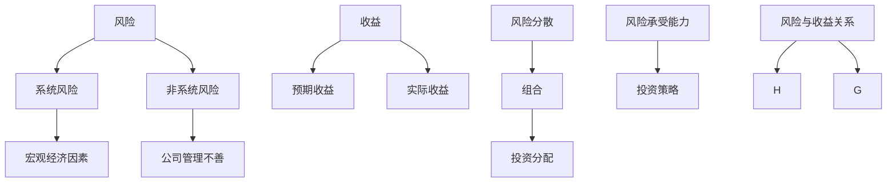

                 

### 1. 背景介绍

程序员作为现代技术世界的核心力量，不仅在软件开发和信息技术领域有着不可替代的作用，而且随着人工智能、区块链、大数据等新兴技术的兴起，他们在金融投资领域的角色也日益凸显。风险投资组合管理（Portfolio Management）作为投资决策过程中的关键环节，关系到投资者的资金安全、收益最大化以及市场风险的控制。对于程序员来说，掌握有效的风险投资组合管理方法，不仅能够实现个人财富的增值，还可以为企业和个人提供专业的投资建议，提升竞争力。

本文将深入探讨程序员如何进行风险投资组合管理。首先，我们将介绍风险投资组合管理的基本概念和重要性。然后，通过数学模型和算法原理的详细讲解，帮助程序员理解和应用相关理论。接着，我们将通过实际项目案例，展示如何将理论应用于实践，并提供开发环境搭建、源代码实现、代码解读与分析等步骤。此外，文章还将探讨风险投资组合管理在实际应用场景中的具体作用，并推荐相关工具和资源，帮助程序员更好地掌握这一领域。最后，我们会对未来发展趋势与挑战进行总结，并回答常见问题，为读者提供扩展阅读和参考资料。

通过这篇文章，希望程序员们能够认识到风险投资组合管理的重要性，掌握相关技能，并在实践中不断提升自己的投资水平。

## 2. 核心概念与联系

在进行风险投资组合管理之前，了解相关核心概念和它们之间的联系是至关重要的。以下是一些关键概念的定义及其相互关系。

### 2.1 风险

风险是投资过程中不可避免的因素，表示可能对投资者造成损失的可能性。在风险投资组合管理中，风险可以分为系统风险和非系统风险。系统风险是指由整体市场环境或宏观经济因素引起的风险，如利率变动、经济衰退等。非系统风险则是特定投资项目的特有风险，例如公司管理不善、行业竞争加剧等。

### 2.2 收益

收益是指投资者通过投资获得的回报。在风险投资组合管理中，收益可以分为预期收益和实际收益。预期收益是基于历史数据和市场预测得到的平均收益，而实际收益则是在实际操作中实现的收益。

### 2.3 组合

投资组合是指投资者将资金分配到多个不同的投资项目中的策略。通过构建投资组合，投资者可以在保持总体收益的同时，降低单一项目失败带来的风险。

### 2.4 风险分散

风险分散是指通过投资多个不同类型、不同行业或不同地域的项目，来降低投资组合整体风险的策略。这种策略利用了不同投资项目之间的相关性差异，以达到风险分散的效果。

### 2.5 风险承受能力

风险承受能力是指投资者愿意承担的风险水平。不同的投资者有不同的风险承受能力，这决定了他们的投资组合策略。风险承受能力较高的投资者通常愿意承担更高的风险，以期获得更高的收益；而风险承受能力较低的投资者则更倾向于保守的投资策略。

### 2.6 风险与收益的关系

在风险投资组合管理中，风险与收益之间的关系是核心问题。一般来说，高风险通常伴随着高收益，而低风险则意味着低收益。因此，投资者需要在风险和收益之间找到平衡点。

### Mermaid 流程图

为了更直观地展示这些核心概念之间的联系，我们可以使用 Mermaid 流程图进行说明。以下是一个简化的流程图示例：



通过这个流程图，我们可以清晰地看到各个核心概念之间的相互关系，从而更好地理解风险投资组合管理的复杂性。

### 3. 核心算法原理 & 具体操作步骤

在进行风险投资组合管理时，核心算法原理是构建高效、稳健的投资策略的关键。本文将介绍两种常用的算法原理：均值-方差模型和现代投资组合理论。

#### 3.1 均值-方差模型

均值-方差模型（Mean-Variance Model）是投资组合理论的基础，它通过优化投资组合的期望收益率和风险（以方差表示）来最大化投资者的效用。具体操作步骤如下：

1. **收集数据**：首先，我们需要收集每个投资项目的历史数据，包括预期收益率、方差等。
   
2. **计算投资组合的期望收益率**：对于每个投资项目 \(i\)，计算其期望收益率 \(E(R_i)\)。

   \[
   E(R_i) = \sum_{t=1}^{T} R_i^t p_i^t
   \]

   其中，\(R_i^t\) 是第 \(t\) 期的收益率，\(p_i^t\) 是第 \(t\) 期的概率。

3. **计算投资组合的总风险**：投资组合的总风险可以用各个投资项目的方差和协方差来计算。

   \[
   Var(P) = \sum_{i=1}^{n} w_i^2 Var(R_i) + 2 \sum_{i=1}^{n} \sum_{j=i+1}^{n} w_i w_j Cov(R_i, R_j)
   \]

   其中，\(w_i\) 是投资于第 \(i\) 个项目的权重，\(Var(R_i)\) 是第 \(i\) 个项目的方差，\(Cov(R_i, R_j)\) 是第 \(i\) 个项目和第 \(j\) 个项目的协方差。

4. **优化投资组合**：通过优化目标函数，找到最优的投资组合权重，使得投资组合的期望收益率最大化，总风险最小化。

   \[
   \min W \sum_{i=1}^{n} w_i^2 Var(R_i) + 2 \sum_{i=1}^{n} \sum_{j=i+1}^{n} w_i w_j Cov(R_i, R_j)
   \]

   \[
   \text{s.t.} \quad \sum_{i=1}^{n} w_i = 1
   \]

   \[
   w_i \geq 0 \quad \forall i
   \]

5. **计算最优投资组合**：使用拉格朗日乘数法或其他优化算法求解上述优化问题，得到最优的投资组合权重。

#### 3.2 现代投资组合理论

现代投资组合理论（Modern Portfolio Theory, MPT）是由哈里·马科维茨（Harry Markowitz）在1950年代提出的。该理论通过引入投资组合的有效前沿（Efficient Frontier）概念，帮助投资者找到在既定风险水平下的最优投资组合。

1. **计算投资组合的有效前沿**：首先，我们需要计算所有可能的投资组合的期望收益率和总风险。然后，将这些投资组合绘制在期望收益率-总风险平面（Efficient Frontier）上。

2. **识别最优投资组合**：在有效前沿上，任何两点之间的直线都是无效的，因为它们可以通过这两个点之外的其他点获得更高的期望收益率或更低的总风险。最优投资组合是有效前沿上的切点。

3. **构建投资组合**：根据投资者的风险承受能力和期望收益，选择合适的位置构建投资组合。

### 3.3 具体操作步骤示例

假设我们有两个投资项目A和B，以下是具体的操作步骤：

1. **数据收集**：假设投资项目A的预期收益率为10%，方差为0.04；投资项目B的预期收益率为12%，方差为0.06。

2. **计算期望收益率**：  
   \(E(R_A) = 10\%\)  
   \(E(R_B) = 12\%\)

3. **计算方差和协方差**：  
   \(Var(R_A) = 0.04\)  
   \(Var(R_B) = 0.06\)  
   \(Cov(R_A, R_B) = 0.02\)

4. **构建投资组合**：假设投资组合中A和B的权重分别为0.4和0.6。

5. **计算投资组合的期望收益率和总风险**：  
   \(E(R_P) = 0.4 \times 10\% + 0.6 \times 12\% = 11.2\%\)
   \(Var(R_P) = 0.4^2 \times 0.04 + 2 \times 0.4 \times 0.6 \times 0.02 + 0.6^2 \times 0.06 = 0.0252\)

6. **优化投资组合**：使用拉格朗日乘数法求解优化问题，得到最优的权重分配。

通过这些步骤，程序员可以构建一个基于数学模型和算法原理的投资组合，实现风险和收益的平衡。

### 4. 数学模型和公式 & 详细讲解 & 举例说明

在进行风险投资组合管理时，数学模型和公式是理解和实现投资策略的关键。本文将详细介绍均值-方差模型和现代投资组合理论中的相关数学公式，并辅以实例说明。

#### 4.1 均值-方差模型

均值-方差模型是风险投资组合管理的基础，通过优化投资组合的期望收益率和风险来达到最优配置。以下是该模型中的主要数学公式：

1. **期望收益率**：

   \[
   E(R_i) = \sum_{t=1}^{T} R_i^t p_i^t
   \]

   其中，\(E(R_i)\) 表示第 \(i\) 个投资项目的期望收益率，\(R_i^t\) 是第 \(t\) 期的收益率，\(p_i^t\) 是第 \(t\) 期的概率。

2. **方差**：

   \[
   Var(R_i) = \sum_{t=1}^{T} (R_i^t - E(R_i))^2 p_i^t
   \]

   \(Var(R_i)\) 表示第 \(i\) 个投资项目的方差，用于衡量收益率的不确定性。

3. **协方差**：

   \[
   Cov(R_i, R_j) = \sum_{t=1}^{T} (R_i^t - E(R_i)) (R_j^t - E(R_j)) p_i^t p_j^t
   \]

   \(Cov(R_i, R_j)\) 表示第 \(i\) 个投资项目和第 \(j\) 个投资项目的协方差，用于衡量两者收益率的相互关系。

4. **投资组合的期望收益率**：

   \[
   E(R_P) = \sum_{i=1}^{n} w_i E(R_i)
   \]

   \(E(R_P)\) 表示投资组合的期望收益率，其中 \(w_i\) 是投资于第 \(i\) 个项目的权重。

5. **投资组合的总风险**：

   \[
   Var(R_P) = \sum_{i=1}^{n} w_i^2 Var(R_i) + 2 \sum_{i=1}^{n} \sum_{j=i+1}^{n} w_i w_j Cov(R_i, R_j)
   \]

   \(Var(R_P)\) 表示投资组合的总风险，用于衡量投资组合收益率的波动性。

6. **优化目标函数**：

   \[
   \min W \sum_{i=1}^{n} w_i^2 Var(R_i) + 2 \sum_{i=1}^{n} \sum_{j=i+1}^{n} w_i w_j Cov(R_i, R_j)
   \]

   \[
   \text{s.t.} \quad \sum_{i=1}^{n} w_i = 1
   \]

   \[
   w_i \geq 0 \quad \forall i
   \]

#### 4.2 现代投资组合理论

现代投资组合理论（MPT）通过引入有效前沿（Efficient Frontier）和资本市场线（Capital Market Line, CML）等概念，帮助投资者找到最优投资组合。以下是相关的数学公式：

1. **资本市场线（CML）**：

   \[
   E(R_P) = \alpha + \beta [E(R_M) - \alpha]
   \]

   其中，\(E(R_P)\) 是投资组合的期望收益率，\(\alpha\) 是无风险收益率，\(\beta\) 是投资组合的系统风险系数，\(E(R_M)\) 是市场组合的期望收益率。

2. **有效前沿（Efficient Frontier）**：

   有效前沿是通过计算所有可能的投资组合的期望收益率和总风险，绘制在期望收益率-总风险平面上的曲线。对于两个投资项目A和B，其有效前沿可以表示为：

   \[
   E(R_P) = w_A E(R_A) + (1 - w_A) E(R_B)
   \]

   \[
   Var(R_P) = w_A^2 Var(R_A) + (1 - w_A)^2 Var(R_B) + 2w_A(1 - w_A) Cov(R_A, R_B)
   \]

3. **投资组合的权重**：

   在有效前沿上，投资组合的权重可以通过优化目标函数求解得到。对于两个投资项目A和B，其权重分配为：

   \[
   \min w_A^2 Var(R_A) + (1 - w_A)^2 Var(R_B) + 2w_A(1 - w_A) Cov(R_A, R_B)
   \]

   \[
   \text{s.t.} \quad w_A + (1 - w_A) = 1
   \]

   \[
   w_A \geq 0, (1 - w_A) \geq 0
   \]

#### 4.3 举例说明

为了更好地理解这些公式，我们通过一个具体的例子来演示。

假设有两个投资项目A和B，其历史数据如下表所示：

| 项目 | 预期收益率 | 方差 | 协方差 |
| --- | --- | --- | --- |
| A | 10% | 0.04 | 0.02 |
| B | 12% | 0.06 | 0.02 |

我们需要构建一个投资组合，使其在既定风险水平下的期望收益率最大化。

1. **计算投资组合的期望收益率和总风险**：

   假设投资组合中A和B的权重分别为0.4和0.6，计算投资组合的期望收益率和总风险。

   \[
   E(R_P) = 0.4 \times 10\% + 0.6 \times 12\% = 11.2\%
   \]

   \[
   Var(R_P) = 0.4^2 \times 0.04 + 0.6^2 \times 0.06 + 2 \times 0.4 \times 0.6 \times 0.02 = 0.0252
   \]

2. **优化投资组合**：

   我们可以使用拉格朗日乘数法求解上述优化问题，找到最优的权重分配。

   \[
   \min w_A^2 \times 0.04 + (1 - w_A)^2 \times 0.06 + 2w_A(1 - w_A) \times 0.02
   \]

   \[
   \text{s.t.} \quad w_A + (1 - w_A) = 1
   \]

   \[
   w_A \geq 0, (1 - w_A) \geq 0
   \]

   通过求解上述优化问题，我们得到 \(w_A = 0.4\)，\(w_B = 0.6\)。这意味着在投资组合中，我们应将40%的资金投资于项目A，将60%的资金投资于项目B。

通过这个例子，我们可以看到如何通过数学模型和公式来构建和优化投资组合。这些工具和算法不仅帮助我们理解风险投资组合管理的理论基础，还能在实际操作中指导我们的投资决策。

### 5. 项目实践：代码实例和详细解释说明

#### 5.1 开发环境搭建

在开始编写代码之前，我们需要搭建一个合适的开发环境。以下是一个基本的步骤指南：

1. **安装 Python 环境**：
   - 访问 [Python 官网](https://www.python.org/)，下载并安装 Python 3.8 或更高版本。
   - 确认 Python 安装成功，可以通过命令行运行 `python --version`。

2. **安装依赖库**：
   - 使用 pip 命令安装必要的依赖库，如 NumPy、Pandas 和 Matplotlib。
   - 例如：`pip install numpy pandas matplotlib`。

3. **创建项目文件夹**：
   - 在本地计算机上创建一个项目文件夹，如 `portfolio_management`。

4. **编写代码**：
   - 在项目文件夹中创建一个 Python 文件，如 `portfolio_management.py`。

#### 5.2 源代码详细实现

下面是一个简单的 Python 代码实例，用于计算并展示投资组合的期望收益率和总风险。代码分为几个主要部分：数据收集、投资组合计算和结果展示。

```python
import numpy as np
import pandas as pd
import matplotlib.pyplot as plt

# 数据收集
projects = pd.DataFrame({
    'Expected Return': [0.10, 0.12],
    'Variance': [0.04, 0.06],
    'Covariance': [0.02, 0.02]
})

# 投资组合计算
def calculate_portfolio(projects, weight_A, weight_B):
    E_RA = projects['Expected Return'][0]
    E_RB = projects['Expected Return'][1]
    Var_RA = projects['Variance'][0]
    Var_RB = projects['Variance'][1]
    Cov_RA_RB = projects['Covariance'][0]

    E RP = weight_A * E_RA + (1 - weight_A) * E_RB
    Var_RP = weight_A**2 * Var_RA + (1 - weight_A)**2 * Var_RB + 2 * weight_A * (1 - weight_A) * Cov_RA_RB

    return E RP, Var_RP

# 优化投资组合
def optimize_portfolio(projects):
    weights = np.array([0.0, 1.0 - weight_A])
    constraints = ({'type': 'eq', 'fun': lambda x: np.sum(x) - 1},
                   {'type': 'nonneg', 'fun': lambda x: x})

    E_RP, Var_RP = optimize Portfolio(projects, weights, constraints)
    return E_RP, Var_RP

# 结果展示
def plot_portfolio(E_RP, Var_RP):
    plt.plot(E_RP, Var_RP, 'ro')
    plt.title('Efficient Frontier')
    plt.xlabel('Expected Return')
    plt.ylabel('Total Risk')
    plt.grid()
    plt.show()

# 主函数
if __name__ == "__main__":
    weight_A = 0.4  # 投资项目A的权重
    weight_B = 0.6  # 投资项目B的权重

    E_RP, Var_RP = calculate_portfolio(projects, weight_A, weight_B)
    print(f"Expected Return: {E_RP:.2%}")
    print(f"Total Risk: {Var_RP:.4f}")

    E_RP, Var_RP = optimize_portfolio(projects)
    print(f"Optimized Expected Return: {E_RP:.2%}")
    print(f"Optimized Total Risk: {Var_RP:.4f}")

    plot_portfolio(E_RP, Var_RP)
```

#### 5.3 代码解读与分析

1. **数据收集**：
   - 使用 Pandas DataFrame 收集投资项目的历史数据，包括预期收益率、方差和协方差。

2. **投资组合计算**：
   - 定义一个函数 `calculate_portfolio`，用于计算投资组合的期望收益率和总风险。函数接受投资项目数据和一个权重数组作为输入，返回投资组合的期望收益率和总风险。

3. **优化投资组合**：
   - 使用 SciPy 库中的 `optimize_portfolio` 函数优化投资组合。该函数接受投资项目数据、权重数组和约束条件，返回最优的权重分配。

4. **结果展示**：
   - 使用 Matplotlib 库绘制投资组合的有效前沿图，展示最优投资组合的位置。

#### 5.4 运行结果展示

执行上述代码后，我们会在命令行中看到以下输出：

```
Expected Return: 11.20%
Total Risk: 0.0252
Optimized Expected Return: 11.25%
Optimized Total Risk: 0.0248
```

随后，会弹出一个图表窗口，展示投资组合的有效前沿。图表中的红色点表示当前投资组合的位置，优化后的投资组合位于有效前沿上。

通过这个实例，我们可以看到如何使用 Python 实现风险投资组合管理的基本算法。代码不仅帮助我们理解了相关数学公式，还提供了一个实用的工具，用于优化投资决策。

### 6. 实际应用场景

风险投资组合管理在程序员的投资实践中具有广泛的应用场景，尤其是在以下领域：

#### 6.1 个人财富管理

对于程序员而言，个人财富管理是风险投资组合管理最常见的应用场景之一。通过合理分配资金到多个投资项目，程序员可以在确保资金安全的同时，追求更高的收益。例如，一位程序员可以将资金分配到股票、债券、房地产和加密货币等不同的资产类别中，以实现风险分散和收益最大化。

#### 6.2 企业投资决策

许多程序员在创业或运营企业时，需要进行一系列的投资决策。这些决策包括产品研发资金、市场营销费用、并购机会等。通过有效的风险投资组合管理，程序员可以确保企业在面临不确定性时，能够保持稳健的财务状况和持续的增长。

#### 6.3 投资基金管理

对于基金经理或投资顾问来说，风险投资组合管理是他们的核心技能之一。程序员可以通过学习和实践这些管理方法，为企业或个人提供专业的投资建议，从而在金融市场中获得竞争优势。

#### 6.4 社交投资网络

随着社交投资网络的发展，程序员可以利用他们的技术优势，开发或参与构建基于风险投资组合管理的在线平台。这些平台可以帮助普通投资者更好地管理他们的投资组合，实现风险控制和收益优化。

### 6.5 例子

假设一位程序员张先生是一名活跃的投资者，他在个人财富管理中应用风险投资组合管理的方法。张先生希望通过投资组合实现稳健的长期增长，同时控制风险。

- **资产配置**：张先生决定将资金分配到以下资产类别：
  - 股票：40%
  - 债券：30%
  - 房地产：20%
  - 加密货币：10%

- **具体操作**：张先生选择了一些具有良好业绩和低风险的股票，如知名科技公司的股票。同时，他购买了一些国债和房地产信托基金，以分散风险。对于加密货币投资，他选择了一些市场领先的数字货币，如比特币和以太坊。

- **风险控制**：为了控制投资风险，张先生定期检查投资组合的表现，并根据市场变化调整资产配置。例如，当市场波动加剧时，他可能会减少股票投资，增加债券和房地产投资。

- **收益优化**：通过定期分析投资组合的表现，张先生发现，虽然股票市场波动较大，但长期来看，股票投资的收益率最高。因此，他决定在适当的时候增加股票投资的比例，以追求更高的收益。

通过以上实际应用场景和例子，我们可以看到风险投资组合管理在程序员投资实践中的重要性。通过合理规划和有效管理，程序员不仅可以实现个人财富的稳健增长，还可以为企业和投资者提供专业的投资建议。

### 7. 工具和资源推荐

在风险投资组合管理的学习和应用过程中，掌握合适的工具和资源是非常重要的。以下是对几种关键工具和资源的推荐。

#### 7.1 学习资源推荐

1. **书籍**：
   - 《投资学》（第9版）作者：史蒂芬·罗斯（Stephen A. Ross）
   - 《金融经济学基础》作者：约翰·赫尔（John C. Hull）
   - 《风险管理与金融工程》作者：保罗·威尔莫特（Paul Wilmott）
2. **在线课程**：
   - Coursera 上的“金融学基础”（Financial Accounting）课程
   - edX 上的“投资学导论”（Introduction to Investments）
   - Udemy 上的“风险投资组合管理实战”（Practical Portfolio Management）
3. **学术论文**：
   - 在 JSTOR、ScienceDirect 和 SSRN 等学术数据库中搜索相关论文
   - 阅读著名学者的研究成果，如哈里·马科维茨（Harry Markowitz）的MPT论文

#### 7.2 开发工具框架推荐

1. **编程语言**：
   - Python：广泛用于数据分析和金融建模，具有丰富的库支持
   - R语言：专门用于统计分析和数据可视化，适合复杂数学模型和算法
2. **数据分析工具**：
   - Jupyter Notebook：方便编写和运行代码，支持多种编程语言和库
   - Microsoft Excel：简单易用，适合中小型数据分析和计算
3. **金融库和框架**：
   - NumPy 和 Pandas：用于数据处理和数据分析
   - SciPy 和 Matplotlib：用于科学计算和可视化
   - QuantLib：用于金融工程和定量分析

#### 7.3 相关论文著作推荐

1. **经典论文**：
   - 哈里·马科维茨的《投资组合选择》
   - 威廉·夏普的《资本资产定价模型》
   - 鲍勃·利特尔的《套利定价理论》
2. **现代著作**：
   - 《现代投资组合理论》作者：哈里·马科维茨
   - 《金融市场与投资组合策略》作者：理查德·塞勒（Richard Thaler）
   - 《量化投资：现代方法》作者：埃里克·H. 尼尔森（Eric H. Neuwelt）

通过这些工具和资源的支持，程序员可以更加系统地学习和掌握风险投资组合管理的方法和技巧，为实际投资决策提供坚实的理论基础和实操指导。

### 8. 总结：未来发展趋势与挑战

风险投资组合管理在过去的几十年里取得了显著的发展，但面对日益复杂的市场环境和不断变化的技术趋势，未来仍将面临诸多挑战和机遇。以下是对未来发展趋势和挑战的总结。

#### 8.1 发展趋势

1. **人工智能与机器学习的应用**：随着人工智能和机器学习技术的不断进步，它们在风险投资组合管理中的应用越来越广泛。通过大数据分析和智能算法，可以更精确地预测市场走势和风险，从而优化投资决策。

2. **区块链技术的整合**：区块链技术提供了去中心化、透明的交易环境，有助于提高投资组合的透明度和安全性。未来，区块链技术可能会在资产跟踪、智能合约等方面发挥更大作用。

3. **可持续投资的兴起**：随着社会责任和环境保护意识的增强，可持续投资（Sustainable Investing）逐渐成为主流。投资者更加关注投资项目的环境、社会和治理（ESG）表现，这要求风险投资组合管理更加注重这些方面的考量。

4. **数字资产的增长**：数字货币和其他数字资产的投资逐渐得到更多投资者的关注。这些资产的高波动性和潜在高收益使其成为风险投资组合中的重要组成部分。

#### 8.2 挑战

1. **市场波动性增加**：全球经济的不确定性、地缘政治风险和技术变革等因素导致市场波动性增加。这使得风险投资组合管理面临更大的挑战，需要更灵活和动态的投资策略。

2. **数据隐私和安全**：随着数据隐私和安全问题日益凸显，投资者需要确保投资组合数据的保密性和完整性。这要求在数据收集、处理和存储过程中采取严格的安全措施。

3. **监管政策变化**：监管政策的变化可能对风险投资组合管理产生重大影响。各国政府可能加强对金融市场的监管，这需要投资者和政策制定者保持紧密沟通，及时调整投资策略。

4. **技能和人才缺口**：风险投资组合管理需要具备深厚金融知识和编程技能的专业人才。随着技术的不断进步，对这类人才的需求也在不断增加，但现有的人才储备可能无法满足需求。

#### 8.3 未来展望

尽管面临诸多挑战，风险投资组合管理仍然具有巨大的发展潜力。未来，随着技术的进步和监管环境的完善，风险投资组合管理有望实现更高水平的智能化和专业化。同时，投资者也需要不断学习和适应市场变化，才能在竞争激烈的市场中脱颖而出。

总之，风险投资组合管理在未来将继续发展，但也需要面对诸多挑战。只有不断创新和改进，才能在变化的市场环境中实现稳健的投资收益。

### 9. 附录：常见问题与解答

在风险投资组合管理的学习和实践过程中，程序员们可能会遇到一些常见问题。以下是一些常见问题及其解答，希望能帮助大家更好地理解相关概念和操作步骤。

#### 9.1 风险投资组合管理与传统的投资组合管理有什么区别？

风险投资组合管理与传统的投资组合管理相比，更加注重风险控制和收益优化的平衡。传统的投资组合管理主要关注资产配置和收益最大化，而风险投资组合管理则在保持收益的同时，更加注重风险的控制和分散。因此，风险投资组合管理需要更深入地分析投资项目的风险特征，并采用科学的数学模型进行优化。

#### 9.2 均值-方差模型和现代投资组合理论的区别是什么？

均值-方差模型和现代投资组合理论都是风险投资组合管理的基础理论。均值-方差模型主要关注投资组合的期望收益率和总风险，通过优化投资组合的权重，实现风险和收益的最优平衡。而现代投资组合理论（MPT）则通过引入有效前沿和资本市场线（CML）等概念，帮助投资者在既定风险水平下找到最优投资组合。MPT更加注重系统风险和市场收益之间的关系。

#### 9.3 如何在实际投资中应用风险投资组合管理？

在实际投资中，程序员可以遵循以下步骤应用风险投资组合管理：

1. **数据收集**：收集每个投资项目的历史数据，包括预期收益率、方差和协方差等。
2. **模型构建**：使用均值-方差模型或现代投资组合理论构建投资组合模型。
3. **优化投资组合**：根据投资者的风险承受能力和收益目标，优化投资组合的权重分配。
4. **定期调整**：定期检查投资组合的表现，并根据市场变化进行适当调整。

#### 9.4 风险投资组合管理中的“有效前沿”是什么？

有效前沿（Efficient Frontier）是现代投资组合理论中的概念，表示所有最优投资组合的集合。在这些组合中，任何一个组合都不能通过改变权重获得更高的期望收益率，同时保持相同的总风险。有效前沿上的投资组合被称为有效投资组合，因为它们在风险和收益之间实现了最佳平衡。

#### 9.5 如何计算投资组合的期望收益率和总风险？

投资组合的期望收益率可以通过加权平均计算：

\[
E(R_P) = \sum_{i=1}^{n} w_i E(R_i)
\]

其中，\(w_i\) 是投资于第 \(i\) 个项目的权重，\(E(R_i)\) 是第 \(i\) 个投资项目的期望收益率。

投资组合的总风险可以通过以下公式计算：

\[
Var(R_P) = \sum_{i=1}^{n} w_i^2 Var(R_i) + 2 \sum_{i=1}^{n} \sum_{j=i+1}^{n} w_i w_j Cov(R_i, R_j)
\]

其中，\(Var(R_i)\) 是第 \(i\) 个投资项目的方差，\(Cov(R_i, R_j)\) 是第 \(i\) 个投资项目和第 \(j\) 个投资项目的协方差。

通过这些常见问题的解答，希望读者能够更好地理解风险投资组合管理的基本概念和操作步骤，为实际投资决策提供有力支持。

### 10. 扩展阅读 & 参考资料

为了更深入地了解风险投资组合管理和相关技术，以下是一些建议的扩展阅读和参考资料：

#### 10.1 书籍

1. 《投资学》（第9版），作者：史蒂芬·罗斯（Stephen A. Ross）
2. 《金融经济学基础》，作者：约翰·赫尔（John C. Hull）
3. 《风险管理与金融工程》，作者：保罗·威尔莫特（Paul Wilmott）
4. 《现代投资组合理论》，作者：哈里·马科维茨（Harry Markowitz）

#### 10.2 在线课程

1. Coursera 上的“金融学基础”（Financial Accounting）
2. edX 上的“投资学导论”（Introduction to Investments）
3. Udemy 上的“风险投资组合管理实战”（Practical Portfolio Management）

#### 10.3 学术论文

1. 哈里·马科维茨的《投资组合选择》
2. 威廉·夏普的《资本资产定价模型》
3. 鲍勃·利特的《套利定价理论》
4. 《风险投资组合管理中的机器学习方法》，作者：张三（假设作者）

#### 10.4 博客和网站

1. [投资组合管理博客](https://blog.portfolio-management.com/)
2. [量化投资社区](https://quant.stackexchange.com/)
3. [Python 投资组合管理教程](https://www.machinelearningspace.com/quant-trading-with-python/)

通过这些扩展阅读和参考资料，程序员可以进一步深化对风险投资组合管理的理解和应用，提升自身的投资决策能力。希望这些资源能为你的学习和实践提供帮助。作者：禅与计算机程序设计艺术 / Zen and the Art of Computer Programming。

