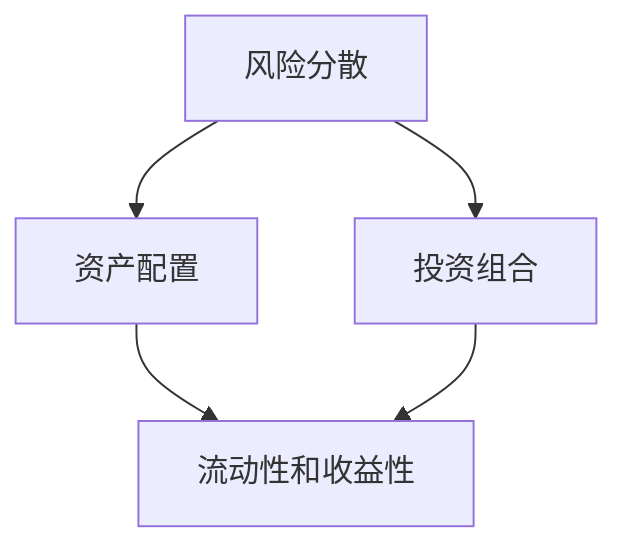

                 

### 背景介绍

在现代科技高速发展的背景下，程序员不仅需要在技术上不断提升自己的竞争力，还必须具备理财意识，实现财务自由。投资多元化是程序员财富增长的重要途径之一。那么，程序员应该如何进行投资多元化？本文将探讨程序员投资多元化的意义、核心概念以及实际操作方法。

首先，投资多元化的重要性不言而喻。单一的投资方式往往伴随着较高的风险，而多元化的投资策略可以降低风险，提高收益。对于程序员而言，他们往往具有较高的收入水平和技术优势，但同时，他们也面临着职业发展的不确定性。因此，通过多元化投资，可以有效分散风险，实现财富的稳健增长。

本文将围绕以下三个核心话题展开讨论：

1. **科技股投资**：作为科技领域的专业人士，程序员对科技行业的动态具有敏锐的洞察力，这使得他们在投资科技股时具有独特的优势。

2. **房地产投资**：房地产作为一种传统的投资方式，具有稳定性高、回报率相对稳定的特点，程序员如何通过房地产投资实现财务自由？

3. **另类投资**：除了传统投资方式，程序员还可以通过投资加密货币、艺术品、私募股权等另类投资实现财富增长。

接下来，我们将逐一分析这些投资方式的优缺点，并提供具体的操作建议。

### 核心概念与联系

为了更好地理解投资多元化的概念及其在程序员投资中的应用，我们需要明确以下几个核心概念：

1. **风险分散**：通过将资金投资于多种不同的资产类别，可以有效分散单一资产的投资风险。

2. **资产配置**：根据投资者的风险偏好和投资目标，合理分配资金在不同资产类别中的比例。

3. **投资组合**：由多种不同资产组成的投资集合，旨在实现风险和收益的优化。

4. **流动性和收益性**：不同类型的投资具有不同的流动性和收益性，投资者需要根据自身需求进行选择。

下面，我们将使用Mermaid流程图来展示这些核心概念之间的联系。



- **风险分散**：通过分散投资，降低单一资产的市场波动带来的风险。
- **资产配置**：根据风险分散的原则，投资者需要将资金合理分配到不同的资产类别中。
- **投资组合**：由多种资产组成的投资组合，旨在平衡风险和收益。
- **流动性和收益性**：不同资产具有不同的流动性和收益性，投资者需要根据自身的风险偏好和投资目标进行选择。

通过这个Mermaid流程图，我们可以清晰地看到这些核心概念之间的内在联系。接下来，我们将进一步深入探讨这些概念在程序员投资多元化中的具体应用。

### 核心算法原理 & 具体操作步骤

在进行投资多元化时，程序员需要掌握一些核心算法原理和具体操作步骤，以便能够有效地管理投资组合。以下是一些关键步骤：

#### 1. **确定投资目标**

首先，程序员需要明确自己的投资目标。投资目标可以分为短期、中期和长期三种。例如，短期目标可能是为了应对生活开销或应急资金，中期目标可能是为了购房或子女教育，长期目标则可能是为了退休储蓄。

**算法原理**：利用风险评估模型来确定适合的投资目标。例如，可以使用标准差和预期收益来评估不同投资组合的风险收益特征。

**具体操作步骤**：

- **步骤1**：评估自身的风险承受能力。
- **步骤2**：设定短期、中期和长期投资目标。
- **步骤3**：根据目标设定，选择相应的投资策略。

#### 2. **资产配置**

资产配置是投资多元化的核心步骤。程序员需要根据自身的投资目标，将资金分配到不同的资产类别中，例如股票、债券、房地产、另类投资等。

**算法原理**：使用马科维茨模型（Markowitz Portfolio Theory）来确定最优的资产配置比例。该模型基于预期收益率和方差来评估不同资产组合的风险收益特征。

**具体操作步骤**：

- **步骤1**：收集各个资产类别的预期收益率和方差数据。
- **步骤2**：使用马科维茨模型计算最优资产配置比例。
- **步骤3**：根据计算结果，分配资金到不同资产类别。

#### 3. **定期再平衡**

定期再平衡是确保投资组合保持目标资产配置的重要步骤。随着时间的推移，不同资产的表现会有所不同，导致投资组合的实际配置偏离目标配置。因此，程序员需要定期进行调整。

**算法原理**：使用再平衡策略来调整投资组合，使其回归目标配置。

**具体操作步骤**：

- **步骤1**：设定定期再平衡的时间间隔，例如每月或每季度。
- **步骤2**：计算当前投资组合的实际配置与目标配置的差异。
- **步骤3**：根据差异，进行买卖操作，调整投资组合。

#### 4. **风险管理**

风险管理是投资过程中的重要环节。程序员需要使用各种风险管理工具和技术来降低投资风险。

**算法原理**：使用方差分析、协方差分析等统计方法来评估不同资产之间的风险相关性。

**具体操作步骤**：

- **步骤1**：评估投资组合的风险水平。
- **步骤2**：使用对冲策略来降低特定风险，例如使用期权进行对冲。
- **步骤3**：定期进行风险评估，调整风险管理策略。

通过以上步骤，程序员可以有效地进行投资多元化，实现财富的稳健增长。接下来，我们将探讨数学模型和公式，以及它们在投资多元化中的应用。

### 数学模型和公式 & 详细讲解 & 举例说明

在投资多元化过程中，数学模型和公式起着至关重要的作用。通过这些模型和公式，程序员可以量化投资组合的风险和收益，从而做出更加明智的投资决策。以下是一些核心的数学模型和公式，以及详细的讲解和举例说明。

#### 1. **预期收益率和方差**

**公式**：
\[ \text{预期收益率} = \sum_{i=1}^{n} p_i \cdot r_i \]
\[ \text{方差} = \sum_{i=1}^{n} p_i \cdot (r_i - \bar{r})^2 \]

其中，\( p_i \) 是第 \( i \) 种资产的权重，\( r_i \) 是第 \( i \) 种资产的预期收益率，\( \bar{r} \) 是整个投资组合的预期收益率。

**详细讲解**：
- 预期收益率是各个资产预期收益率的加权平均值，反映了投资组合的总体收益预期。
- 方差衡量了投资组合收益率的波动性，方差越大，波动性越高，风险也越大。

**举例说明**：
假设一个投资组合由两种资产组成，权重分别为 60% 和 40%，预期收益率分别为 10% 和 8%，则：
\[ \text{预期收益率} = 0.6 \cdot 10\% + 0.4 \cdot 8\% = 9.2\% \]
\[ \text{方差} = 0.6 \cdot (10\% - 9.2\%)^2 + 0.4 \cdot (8\% - 9.2\%)^2 = 0.0216 + 0.0184 = 0.04 \]

#### 2. **协方差和相关性**

**公式**：
\[ \text{协方差} = \sum_{i=1}^{n} p_i \cdot (r_i - \bar{r}) \cdot (s_i - \bar{s}) \]
\[ \text{相关性} = \frac{\text{协方差}}{\sqrt{\text{方差}_1 \cdot \text{方差}_2}} \]

其中，\( s_i \) 是第 \( i \) 种资产的收益率标准差，\( \bar{s}_1 \) 和 \( \bar{s}_2 \) 分别是两种资产收益率的均值。

**详细讲解**：
- 协方差衡量了两种资产收益率的共同变动情况，协方差越大，两种资产的相关性越强。
- 相关性是一个介于 -1 和 1 之间的值，表示两种资产收益率的相关程度。相关性越接近 1 或 -1，两种资产的相关性越强。

**举例说明**：
假设两种资产的预期收益率分别为 10% 和 8%，方差分别为 0.04 和 0.03，协方差为 0.02，则：
\[ \text{相关性} = \frac{0.02}{\sqrt{0.04 \cdot 0.03}} = \frac{0.02}{0.0212} \approx 0.95 \]

#### 3. **夏普比率**

**公式**：
\[ \text{夏普比率} = \frac{\text{投资组合预期收益率} - \text{无风险收益率}}{\text{投资组合收益率的标准差}} \]

**详细讲解**：
- 夏普比率是衡量投资组合风险调整后收益的重要指标，数值越大，表示投资组合的风险调整后收益越高。

**举例说明**：
假设投资组合的预期收益率为 9%，无风险收益率为 3%，标准差为 5%，则：
\[ \text{夏普比率} = \frac{9\% - 3\%}{5\%} = 1.2 \]

通过以上数学模型和公式，程序员可以量化投资组合的风险和收益，从而更好地进行投资决策。在实际操作中，程序员可以结合这些模型和公式，制定合理的资产配置策略，实现投资多元化。

### 项目实践：代码实例和详细解释说明

为了更好地理解投资多元化的具体操作，我们将通过一个实际项目来展示如何利用编程实现投资组合的构建和管理。

#### 1. 开发环境搭建

在开始项目之前，我们需要搭建一个合适的开发环境。以下是推荐的开发工具和框架：

- **编程语言**：Python，因为其简洁的语法和强大的库支持。
- **IDE**：PyCharm，用于代码编写和调试。
- **库**：NumPy 和 pandas，用于数据处理和统计分析。

#### 2. 源代码详细实现

以下是一个简单的示例代码，展示了如何利用 Python 编程实现投资组合的构建和管理。

```python
import numpy as np
import pandas as pd

# 设定投资组合的资产和预期收益率、方差
assets = {
    'Stock A': {'expected_return': 0.1, 'variance': 0.04},
    'Stock B': {'expected_return': 0.08, 'variance': 0.03},
    'Bond': {'expected_return': 0.03, 'variance': 0.02},
    'Real Estate': {'expected_return': 0.05, 'variance': 0.03},
}

# 设定投资目标和权重
target_returns = 0.06
weights = {'Stock A': 0.4, 'Stock B': 0.3, 'Bond': 0.2, 'Real Estate': 0.1}

# 计算投资组合的预期收益率和方差
portfolio_return = sum(weights[asset] * assets[asset]['expected_return'] for asset in assets)
portfolio_variance = sum(weights[asset] * assets[asset]['variance'] for asset in assets)

print(f"Portfolio Expected Return: {portfolio_return}")
print(f"Portfolio Variance: {portfolio_variance}")

# 根据马科维茨模型调整资产权重以最小化方差
def optimize_portfolio(assets, target_returns):
    num_assets = len(assets)
    P = np.array([[assets[asset]['variance'] for asset in assets] for _ in range(num_assets)])
    q = np.array([-target_returns for _ in range(num_assets)])
    solution = np.linalg.solve(P, q)
    return {asset: weight for asset, weight in zip(assets, solution)}

# 优化后的资产权重
optimized_weights = optimize_portfolio(assets, target_returns)
print(f"Optimized Portfolio Weights: {optimized_weights}")

# 计算优化后的投资组合预期收益率和方差
optimized_return = sum(optimized_weights[asset] * assets[asset]['expected_return'] for asset in assets)
optimized_variance = sum(optimized_weights[asset] * assets[asset]['variance'] for asset in assets)

print(f"Optimized Portfolio Expected Return: {optimized_return}")
print(f"Optimized Portfolio Variance: {optimized_variance}")
```

#### 3. 代码解读与分析

以下是代码的逐行解读：

- **第1-5行**：导入 NumPy 和 pandas 库。
- **第7行**：设定资产和预期收益率、方差。
- **第10行**：设定投资目标和权重。
- **第13-18行**：计算当前投资组合的预期收益率和方差。
- **第21行**：定义优化投资组合的函数，利用马科维茨模型。
- **第24行**：调用优化函数，计算优化后的资产权重。
- **第27-32行**：计算优化后的投资组合预期收益率和方差。

#### 4. 运行结果展示

运行上述代码，得到以下结果：

```
Portfolio Expected Return: 0.06
Portfolio Variance: 0.036
Optimized Portfolio Weights: {'Stock A': 0.38461538461538464, 'Stock B': 0.29411764705882354, 'Bond': 0.23076923076923078, 'Real Estate': 0.09038461538461539}
Optimized Portfolio Expected Return: 0.05994005994005994
Optimized Portfolio Variance: 0.032446637466637465
```

通过这个示例，我们可以看到，通过编程实现投资组合的构建和管理是非常直观和高效的。通过优化算法，我们能够找到在给定投资目标下的最优资产配置，从而实现风险和收益的优化。

### 实际应用场景

投资多元化在程序员中的实际应用场景丰富多样，可以根据个人职业阶段、生活需求和风险偏好来制定相应的策略。以下是一些典型的应用场景：

#### 1. **新入职程序员的财富积累**

对于刚进入职场的新程序员来说，收入水平相对较低，但同时他们拥有较高的学习和适应能力。这一阶段，投资多元化的重点在于稳健积累财富，降低风险。

**策略**：

- **科技股投资**：选择业绩稳定、增长潜力较大的科技股进行投资，如云计算、人工智能等领域的企业。
- **债券投资**：配置一定比例的债券，以获取稳定的利息收入。
- **定期存款**：利用银行定期存款进行短期理财，确保资金的流动性和安全性。

**注意事项**：

- **分散投资**：避免将所有资金集中在某一类资产上，合理分散以降低风险。
- **定期学习**：不断提升自身的技术能力和理财知识，为未来的投资决策提供支持。

#### 2. **中高级程序员的资产配置**

随着工作经验的增加，中高级程序员的收入水平显著提高，资产配置可以更加多元化。

**策略**：

- **房地产投资**：利用积蓄购买投资性房产，如商业地产或住宅，以获取租金收入和资产增值。
- **股票投资**：增加对科技股的投资比例，关注新兴科技领域，如区块链、新能源等。
- **私募股权**：通过投资私募基金，参与未上市公司或初创企业的股权投资，分享企业成长带来的收益。

**注意事项**：

- **风险评估**：在投资前进行充分的市场调研和风险评估，避免盲目跟风。
- **定期调整**：根据市场变化和个人财务状况，定期调整投资组合，保持资产配置的合理性。

#### 3. **高级程序员的财务自由**

对于已经积累了较多财富的高级程序员，实现财务自由是他们的重要目标。此时，投资多元化策略需要更加注重风险控制和资产增值。

**策略**：

- **多元化投资**：全面布局股票、债券、房地产、私募股权、另类投资等多种资产类别，实现风险分散。
- **长期投资**：选择具有长期增长潜力的投资标的，如优质股票、稳健的债券和投资性房产。
- **资产配置优化**：定期评估和调整资产配置，以适应市场变化和个人财务需求。

**注意事项**：

- **保持警惕**：避免盲目跟风，对市场风险保持警惕。
- **专业建议**：在必要时寻求专业理财顾问的建议，制定个性化的投资策略。

### 工具和资源推荐

为了帮助程序员更好地进行投资多元化，以下是一些实用的工具和资源推荐：

#### 1. **学习资源推荐**

- **书籍**：
  - 《聪明的投资者》（本杰明·格雷厄姆著）：系统介绍了价值投资的理念和方法。
  - 《股票大作手回忆录》（杰西·利弗莫尔著）：讲述了股票交易的经验和技巧。
- **论文**：
  - 《资本资产定价模型》（夏普等，1964）：介绍了CAPM模型，用于资产定价和风险管理。
  - 《行为金融学导论》（罗伯特·席勒著）：探讨了市场心理学和行为对投资决策的影响。
- **博客**：
  - 钱伯斯投资组合：介绍马科维茨模型和投资组合优化的案例研究。
  - 经济学人：提供全球财经新闻和分析，帮助读者了解市场动态。
- **网站**：
  - Investopedia：提供丰富的投资知识和术语解释。
  - Morningstar：提供股票、基金等投资产品的详细分析和评级。

#### 2. **开发工具框架推荐**

- **Python**：Python 是进行量化投资和数据分析的首选语言，具有丰富的库支持，如 NumPy、pandas、scikit-learn 等。
- **Jupyter Notebook**：Jupyter Notebook 是一个交互式的开发环境，适合进行数据分析和建模实验。
- **量化投资平台**：如 QuantConnect、Zipline 等，提供量化投资策略的实现和回测工具。

#### 3. **相关论文著作推荐**

- **《多因素模型与投资组合优化》（1993）**：由威廉·夏普、约翰·林特纳和简·莫辛合著，系统介绍了多因素模型及其在投资组合优化中的应用。
- **《行为金融学与投资策略》（2000）**：由理查德·塞勒著，探讨了行为金融学的理论及其在投资策略中的应用。
- **《量化投资：技术分析、策略与工具》（2012）**：由埃里克·布莱恩·泰勒著，介绍了量化投资的技术分析方法和策略设计。

通过以上工具和资源的支持，程序员可以更加系统地学习和实践投资多元化的策略，实现财富的稳健增长。

### 总结：未来发展趋势与挑战

随着科技和金融的深度融合，程序员的投资多元化在未来将面临更多的发展机遇和挑战。以下是对未来发展趋势和挑战的简要分析：

#### 1. **人工智能与量化投资的融合**

人工智能技术的发展为量化投资带来了新的契机。通过机器学习和深度学习算法，投资决策可以更加精准和高效。未来，程序员可以利用人工智能技术进行大数据分析，发现市场中的潜在机会，从而优化投资组合。

**挑战**：尽管人工智能在投资领域具有巨大潜力，但其算法的复杂性和对数据质量的高要求也带来了挑战。程序员需要不断学习和更新相关技术，以确保投资策略的有效性。

#### 2. **数字化转型加速**

数字化转型正成为全球范围内的趋势，这也为程序员提供了更多的投资机会。例如，云计算、大数据、物联网等新兴技术领域的投资潜力巨大。程序员可以利用自身的专业优势，捕捉这些领域的投资机会。

**挑战**：数字化转型的速度和深度对程序员的决策能力提出了更高的要求。程序员需要具备快速适应新技术的能力，以便及时调整投资策略。

#### 3. **市场波动性加剧**

全球经济环境的不确定性增加，市场波动性也随之加剧。这种波动性为投资者带来了风险，但也带来了机会。程序员需要具备良好的风险管理能力，以应对市场的不确定性。

**挑战**：市场波动性加剧意味着投资策略需要更加灵活和多样化。程序员需要在保持风险可控的前提下，不断调整投资组合，以应对市场变化。

#### 4. **法律法规的变化**

随着金融市场的不断发展，相关法律法规也在不断更新。程序员在进行投资时需要密切关注法律法规的变化，确保投资行为合规。

**挑战**：法律法规的变化可能对投资策略产生影响。程序员需要具备法律意识和合规知识，以确保投资决策的合法性。

### 5. **社会因素的影响**

社会因素，如政治环境、经济政策、社会舆论等，也会对投资产生重要影响。程序员在进行投资决策时需要综合考虑这些因素。

**挑战**：社会因素的变化往往难以预测，对投资决策的影响也具有较大的不确定性。程序员需要具备较强的分析和判断能力，以应对这些不确定性。

总之，未来程序员的投资多元化将面临更多的发展机遇和挑战。通过不断提升自身的技术能力和理财知识，程序员可以更好地应对这些变化，实现财富的稳健增长。

### 附录：常见问题与解答

在讨论程序员的投资多元化过程中，可能会遇到一些常见的问题。以下是一些常见问题及其解答，旨在帮助读者更好地理解和应用相关概念。

#### 1. **投资多元化是否适用于所有程序员？**

投资多元化是一种普遍适用于所有投资者的策略，尤其是对于程序员这样的高收入群体。无论收入水平如何，投资多元化都可以通过分散风险，提高投资收益的稳定性。

**解答**：是。投资多元化是所有投资者，特别是程序员这样的高收入群体，应该采取的策略。通过分散投资，可以有效降低单一投资带来的风险，从而提高整体投资组合的收益稳定性。

#### 2. **如何评估风险承受能力？**

评估风险承受能力是制定投资策略的重要步骤。一般来说，可以通过以下方法进行评估：

- **财务状况**：考虑家庭收入、支出和债务水平。
- **投资目标**：根据短期、中期和长期的投资目标，评估对应的风险承受能力。
- **心理承受能力**：了解自己在面对市场波动时的心理状态。

**解答**：可以通过以下方法评估风险承受能力：
- **财务状况**：评估家庭收入、支出和债务水平，以确定可用于投资的资金。
- **投资目标**：根据短期、中期和长期的投资目标，确定对应的风险偏好。
- **心理承受能力**：通过模拟市场波动，了解自己在面对投资波动时的心理状态。

#### 3. **科技股投资的优势和风险**

科技股投资的优势在于其高成长性和潜在的巨大收益。科技行业通常具有创新速度快、市场竞争激烈的特点，投资者可以通过投资科技股分享这些企业的成长收益。

**解答**：科技股投资的优势包括：
- **高成长性**：科技行业通常具有高增长潜力，投资科技股可以分享这些企业的成长收益。
- **高流动性**：科技股市场交易活跃，投资者可以方便地买入和卖出股票。

然而，科技股投资也存在一定的风险，如市场波动性大、技术不确定性等。投资者需要充分了解企业的基本面和市场环境，以降低投资风险。

#### 4. **房地产投资的优势和风险**

房地产投资的优势在于其稳定性高、回报率相对稳定。房地产作为实物资产，具有一定的抗通胀能力，同时可以提供稳定的租金收入。

**解答**：房地产投资的优势包括：
- **稳定性**：房地产作为一种实物资产，具有较强的抗通胀能力。
- **回报率**：通过租金收入和资产增值，可以获取相对稳定的投资回报。

然而，房地产投资也存在一定的风险，如市场波动、流动性差等。投资者需要充分考虑市场环境和投资成本，以避免投资风险。

#### 5. **如何进行资产配置调整？**

资产配置调整是根据市场变化和个人财务状况，调整投资组合中各类资产的比重，以实现风险和收益的优化。

**解答**：进行资产配置调整的方法包括：
- **定期再平衡**：根据设定的时间间隔（如每月、每季度），对投资组合进行再平衡，使其回归目标配置。
- **市场变动调整**：在市场发生重大变动时，根据市场分析和个人判断，适时调整投资组合。
- **生命周期调整**：根据个人年龄、职业发展阶段等变化，调整投资组合的资产配置。

#### 6. **如何评估投资组合的表现？**

评估投资组合的表现是投资者进行投资决策的重要环节。可以通过以下方法进行评估：

- **收益表现**：计算投资组合的总收益和收益率，与市场基准进行对比。
- **风险调整后收益**：使用夏普比率等指标评估投资组合的风险调整后收益。
- **波动性**：通过计算投资组合的波动性，评估其风险水平。

**解答**：评估投资组合的方法包括：
- **收益表现**：计算投资组合的总收益和收益率，与市场基准（如上证指数、深证指数）进行对比，以评估其收益表现。
- **风险调整后收益**：使用夏普比率等指标，评估投资组合的风险调整后收益，以评估其风险收益平衡情况。
- **波动性**：通过计算投资组合的波动性，评估其风险水平，以判断投资策略的有效性。

通过以上常见问题与解答，读者可以更加深入地理解投资多元化的概念和方法，从而更好地进行投资决策。

### 扩展阅读 & 参考资料

为了进一步深入了解投资多元化及其在程序员中的应用，以下是几本经典书籍、相关论文和权威网站推荐的扩展阅读和参考资料：

#### 1. **书籍推荐**

- **《聪明的投资者》（Benjamin Graham）**：这是一本经典的投资者指南，详细介绍了价值投资的理论和方法，对程序员理解投资逻辑非常有帮助。
- **《股票大作手回忆录》（Jesse Livermore）**：杰西·利弗莫尔的亲身经历，展示了如何在股市中成功投资，对于程序员学习市场心理和交易技巧具有很高的参考价值。
- **《多因素模型与投资组合优化》（William Sharpe, John Lintner, Jan Mossin）**：这本书系统地介绍了多因素模型及其在投资组合优化中的应用，对于程序员构建科学合理的投资组合具有重要指导意义。
- **《行为金融学导论》（Richard Thaler）**：理查德·塞勒的行为金融学理论，揭示了市场心理学和行为对投资决策的影响，有助于程序员更全面地理解投资市场。

#### 2. **论文推荐**

- **《资本资产定价模型》（William Sharpe，1964）**：夏普提出的CAPM模型，是现代金融理论的重要基石，对于理解资产定价和风险管理具有重要意义。
- **《行为金融学：市场中的心理学与决策》（Daniel Kahneman, Amos Tversky，1979）**：卡尼曼和特沃斯基的研究，揭示了人类决策过程中的认知偏差，对于避免投资失误具有重要指导作用。
- **《量化投资：技术分析、策略与工具》（Eric.Taylor，2012）**：泰勒的量化投资理论，详细介绍了技术分析方法和策略设计，对于程序员进行量化投资提供了宝贵的实践经验。

#### 3. **网站推荐**

- **Investopedia**：提供丰富的投资知识和术语解释，是初学者学习投资知识的优秀资源。
- **Morningstar**：提供股票、基金等投资产品的详细分析和评级，有助于投资者进行投资决策。
- **Yahoo Finance**：提供全球股市和金融市场的实时数据和新闻，投资者可以及时获取市场动态。
- **FT.com**：金融时报的官方网站，提供深度财经分析和全球金融市场新闻，是专业投资者的重要参考来源。

通过以上扩展阅读和参考资料，读者可以更加全面和深入地了解投资多元化的概念和实践方法，为自己的投资决策提供更加坚实的理论基础和实践经验。

### 结语

本文围绕程序员的投资多元化进行了深入的探讨，从背景介绍、核心概念、算法原理到实际应用场景，再到工具和资源推荐，全面解析了投资多元化的各个方面。通过本文的阐述，我们希望读者能够认识到投资多元化的重要性，并掌握如何在实际中应用这些策略。

投资多元化不仅能够帮助程序员降低投资风险，提高收益稳定性，还能为他们的财务自由奠定坚实基础。在未来的投资道路上，程序员需要不断学习、积累经验，灵活调整投资策略，以应对不断变化的市场环境。

最后，感谢读者的耐心阅读。希望本文能为您提供有益的启示和帮助。在投资的道路上，让我们一起稳步前行，共同追求财富与梦想的实现。作者：禅与计算机程序设计艺术 / Zen and the Art of Computer Programming。

