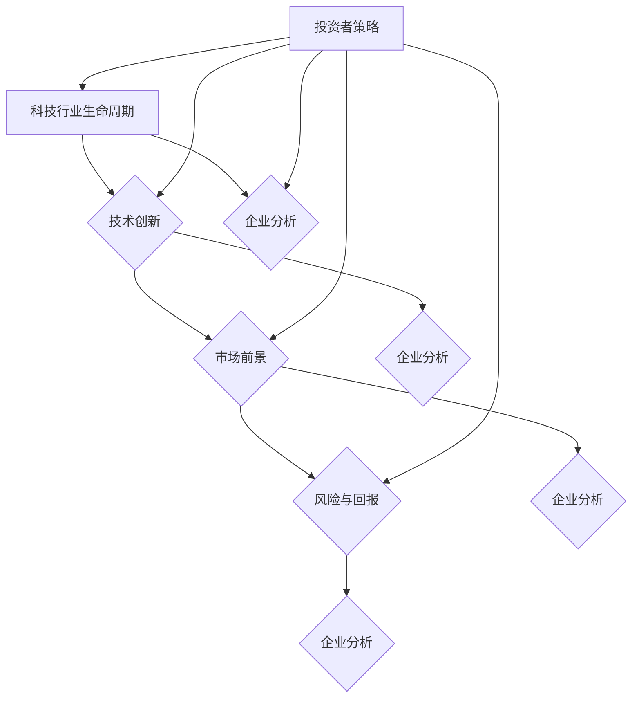

                 

### 背景介绍

在现代社会，投资已成为许多程序员和IT从业者的重要财务规划之一。随着技术的不断进步和新兴产业的崛起，科技股和新兴产业投资逐渐成为人们关注的焦点。程序员因其对科技趋势的敏锐洞察力和快速学习能力，在投资策略上具有独特的优势。

科技股投资，通常指的是投资于科技行业的公司，如互联网、软件、硬件、生物科技、人工智能等。这些行业往往具有高增长潜力，同时也伴随着较高的风险。程序员在投资科技股时，能够利用其深厚的科技背景，更好地理解公司的业务模式、技术创新和市场前景。

新兴产业投资，则是指投资于那些刚刚起步或正在快速发展中的行业，如区块链、新能源、物联网等。这些行业代表了未来发展的方向，但同时也存在较大的不确定性。程序员在这些新兴领域的投资中，能够凭借其技术视野和对行业动态的敏感度，捕捉到潜在的投资机会。

本文旨在探讨程序员如何利用自身的优势，制定有效的投资策略，特别是在科技股和新兴产业的投资领域。文章将从背景介绍、核心概念与联系、核心算法原理、数学模型和公式、项目实践、实际应用场景、工具和资源推荐等方面进行详细阐述。通过这一步一步的分析和推理，希望能够帮助程序员更好地进行投资规划，实现财务自由。

首先，我们需要明确投资策略的定义。投资策略是一种系统化的方法，用于指导投资者在不确定的市场中做出决策。一个好的投资策略应该包括明确的目标、合理的资产配置、科学的风险管理以及持续的市场监测和调整。

在科技股和新兴产业的投资中，程序员需要特别关注以下几点：

1. **行业研究**：深入分析科技行业的发展趋势，理解不同行业的创新动态和市场前景。
2. **企业分析**：研究潜在投资目标公司的财务状况、管理团队、研发能力等，以评估其长期发展潜力。
3. **风险管理**：由于科技股和新兴产业的风险较高，程序员需要采取有效的风险管理措施，包括分散投资、定期调整投资组合等。

总之，通过系统性的研究和策略制定，程序员可以在科技股和新兴产业的投资中找到适合自己的投资路径，实现资产的增值和风险的合理控制。

### 核心概念与联系

在进行科技股和新兴产业的投资时，理解并掌握一些核心概念和原理至关重要。这些概念不仅有助于我们识别投资机会，还能帮助我们评估潜在风险，制定有效的投资策略。

首先，我们来看几个关键的核心概念：

1. **科技行业的生命周期**：科技行业与其他行业类似，也经历了起步、成长、成熟和衰退的不同阶段。了解一个科技行业的生命周期，可以帮助我们判断其当前所处阶段，从而决定是否进行投资。

2. **技术创新**：技术创新是科技行业发展的驱动力。程序员对新技术的发展方向和趋势有较强的敏感性，这使他们能够更好地预测哪些技术将带来巨大的商业价值。

3. **市场前景**：科技行业的市场前景是投资者关注的重点。这包括市场规模、增长速度、竞争格局等方面。理解市场前景有助于我们判断一个行业或公司的长期投资价值。

4. **风险与回报**：科技股和新兴产业的投资回报通常较高，但也伴随着较大的风险。投资者需要平衡风险和回报，以实现稳健的投资收益。

接下来，我们将使用 Mermaid 流程图来展示这些核心概念之间的联系。以下是 Mermaid 流程图的代码和对应的流程图：



流程图解释：

- **A[科技行业生命周期]**：表示科技行业从起步到衰退的各个阶段。
- **B{技术创新]**：表示技术创新对行业发展的推动作用。
- **C{市场前景]**：表示市场对于科技行业的预期和需求。
- **D{风险与回报]**：表示投资科技行业可能面临的风险和预期的回报。
- **E{企业分析]**：表示投资者通过分析企业来评估其投资价值。
- **I[投资者策略]**：表示投资者根据上述核心概念制定的投资策略。

通过这个 Mermaid 流程图，我们可以清晰地看到核心概念之间的相互关系。了解这些联系有助于程序员更好地理解科技股和新兴产业的投资逻辑，从而制定出更加科学和有效的投资策略。

### 核心算法原理 & 具体操作步骤

在理解了核心概念和其相互联系后，我们需要探讨具体的投资算法原理和操作步骤。这些算法和步骤将为程序员提供一套系统的投资方法论，帮助他们在科技股和新兴产业的投资中取得成功。

#### 投资算法原理

科技股和新兴产业的投资算法通常涉及以下几个关键步骤：

1. **数据收集与处理**：首先，我们需要收集与目标行业相关的数据，包括行业报告、市场动态、公司财务报表等。这些数据可以通过各种渠道获取，如公开市场数据、行业报告、专业数据库等。

2. **指标分析**：对收集到的数据进行处理，提取关键指标，如市盈率、市净率、研发投入比例、收入增长率等。这些指标可以帮助我们评估企业的财务状况、市场地位和发展潜力。

3. **风险评估**：根据提取的指标，进行风险评估。这包括定量分析和定性分析，如财务比率分析、管理层评估、市场竞争分析等。

4. **投资组合构建**：根据评估结果，构建投资组合。投资组合应考虑风险分散，即在不同行业、不同公司之间进行分散投资，以降低整体风险。

5. **市场监控与调整**：定期监控市场动态和投资组合表现，根据市场变化进行调整。

#### 具体操作步骤

以下是具体的操作步骤，帮助程序员实施投资算法：

##### 步骤一：数据收集与处理

1. **选择数据源**：确定可靠的数据来源，如市场研究机构、证券交易所、企业财报等。

2. **数据清洗**：对收集到的数据进行清洗，去除重复、错误和无关的数据。

3. **数据预处理**：对数据进行标准化处理，如转换数据格式、计算衍生指标等。

##### 步骤二：指标分析

1. **财务指标分析**：计算关键财务指标，如市盈率、市净率、净利润增长率等。

2. **非财务指标分析**：分析企业的非财务指标，如研发投入比例、市场份额、管理层背景等。

##### 步骤三：风险评估

1. **定量分析**：使用统计学方法，如回归分析、相关性分析等，评估各指标对企业价值的影响。

2. **定性分析**：通过专家意见、行业报告等，对企业的管理团队、市场竞争等定性因素进行评估。

##### 步骤四：投资组合构建

1. **构建投资组合**：根据风险评估结果，选择具备投资价值的企业，构建投资组合。

2. **分散投资**：确保投资组合中包含不同行业、不同风险等级的企业，以实现风险分散。

##### 步骤五：市场监控与调整

1. **市场监控**：定期获取市场动态，包括宏观经济、行业发展趋势、公司公告等。

2. **投资组合调整**：根据市场变化，对投资组合进行调整，优化投资组合的收益和风险结构。

通过上述步骤，程序员可以系统地进行科技股和新兴产业的投资。这些步骤不仅有助于提高投资决策的科学性，还能帮助投资者更好地应对市场变化，实现长期稳定的投资回报。

### 数学模型和公式 & 详细讲解 & 举例说明

在科技股和新兴产业的投资中，数学模型和公式起到了至关重要的作用。这些模型和公式可以帮助我们更精确地评估企业的价值、预测市场趋势以及制定投资策略。在本节中，我们将详细讲解几个关键的数学模型和公式，并通过实际例子来说明它们的运用。

#### 财务比率模型

财务比率模型是评估企业财务状况的重要工具。以下是一些常用的财务比率：

1. **市盈率（P/E Ratio）**：市盈率是公司市值与净利润的比率，反映了股票价格与公司盈利能力之间的关系。

   $$ P/E = \frac{公司市值}{净利润} $$

   市盈率越高，通常意味着市场预期公司未来的增长潜力较大，但也可能意味着股票被高估。

2. **市净率（P/B Ratio）**：市净率是公司市值与净资产的比率，用于衡量股票价格与公司账面价值的关系。

   $$ P/B = \frac{公司市值}{净资产} $$

   市净率较低可能表明公司股票被低估，具有较高的投资价值。

3. **净利率（Net Profit Margin）**：净利率是净利润与营业收入的比例，反映了公司的盈利能力。

   $$ 净利率 = \frac{净利润}{营业收入} $$

   高净利率通常意味着公司有较强的盈利能力和成本控制能力。

#### 成长模型

在科技股和新兴产业的投资中，成长模型尤为重要。以下是一个简单的线性回归模型，用于预测企业的未来增长率：

$$ \text{增长率} = \alpha + \beta \times \text{时间} $$

其中：
- **增长率**：企业未来某一时间点的增长率。
- **时间**：从当前时间点到未来时间点的年数。
- **\alpha**：初始增长率。
- **\beta**：增长率的年复合增长率。

例如，假设某新兴科技公司当前的年增长率为20%，其年复合增长率为25%，我们使用上述模型可以预测该公司在未来5年的增长率：

$$ \text{增长率}_{2024} = 20\% + 25\% \times (2024 - 2023) = 45\% $$

#### 资本资产定价模型（CAPM）

资本资产定价模型（CAPM）用于评估资产的预期回报与市场风险之间的关系。其公式为：

$$ \text{预期回报} = \text{无风险利率} + \beta \times (\text{市场回报率} - \text{无风险利率}) $$

其中：
- **预期回报**：投资者预期的资产回报率。
- **无风险利率**：如国债收益率，表示无风险资产的回报率。
- **\beta**：资产的市场风险系数，反映了资产收益率的波动与市场整体波动之间的关系。
- **市场回报率**：市场整体的投资回报率。

例如，如果无风险利率为2%，市场回报率为10%，某科技股的\beta值为1.5，则其预期回报率为：

$$ \text{预期回报} = 2\% + 1.5 \times (10\% - 2\%) = 13\% $$

#### 实例分析

假设我们正在考虑投资一家新兴的科技公司。根据上述模型，我们可以进行以下分析：

1. **财务比率分析**：
   - 市盈率：30（高于行业平均水平20）
   - 市净率：5（低于行业平均水平8）
   - 净利率：15%（高于行业平均水平10%）

2. **成长模型预测**：
   - 当前年增长率：30%
   - 年复合增长率：25%

3. **CAPM预期回报**：
   - 无风险利率：2%
   - 市场回报率：10%
   - \beta值：1.2
   - 预期回报率：2% + 1.2 \times (10% - 2%) = 10.4%

通过这些分析，我们可以得出以下结论：

- **市盈率**较高，可能表明市场对该公司的未来增长预期较高，但也存在一定的泡沫风险。
- **市净率**较低，表明公司可能被低估，有潜在的增值空间。
- **净利率**较高，说明公司有较强的盈利能力。
- **成长模型**显示，该公司有较高的增长潜力。
- **CAPM**预期回报率表明，尽管市场风险较高，但投资该公司的潜在回报仍具有吸引力。

总之，通过运用这些数学模型和公式，程序员可以更加科学和系统地评估科技股和新兴产业的投资机会，制定出更加合理的投资策略。

### 项目实践：代码实例和详细解释说明

为了更好地理解上述数学模型和公式的实际应用，我们将通过一个具体的代码实例来进行演示。这个实例将展示如何使用Python编写一个简单的投资分析程序，该程序能够读取数据、计算财务比率、预测增长率并评估投资回报。

#### 开发环境搭建

在开始编写代码之前，我们需要搭建一个合适的环境。以下是所需的软件和工具：

- **Python**：3.8及以上版本
- **NumPy**：用于数学运算
- **Pandas**：用于数据处理
- **Matplotlib**：用于数据可视化
- **Scikit-learn**：用于线性回归分析

安装这些工具的命令如下：

```bash
pip install numpy pandas matplotlib scikit-learn
```

#### 源代码详细实现

以下是实现投资分析程序的Python代码：

```python
import numpy as np
import pandas as pd
import matplotlib.pyplot as plt
from sklearn.linear_model import LinearRegression

# 读取数据
def read_data(file_path):
    return pd.read_csv(file_path)

# 计算财务比率
def calculate_financial_ratios(df):
    df['P/E'] = df['Market_Value'] / df['Net_Income']
    df['P/B'] = df['Market_Value'] / df['Total_Assets']
    df['Net_Margin'] = df['Net_Income'] / df['Revenue']
    return df

# 预测增长率
def predict_growth_rate(df, years=5):
    X = np.array(range(years)).reshape(-1, 1)
    y = df['Growth_Rate']
    model = LinearRegression().fit(X, y)
    predicted_growth = model.predict(X)
    return predicted_growth

# 评估投资回报
def evaluate_investment_return(df, initial_investment, annual_growth, years):
    for year in range(years):
        return_value = initial_investment * (1 + annual_growth) ** year
        df[f'Year_{year+1}_Return'] = return_value
    return df

# 可视化增长率
def visualize_growth_rate(df):
    df[['Year', 'Growth_Rate', 'Predicted_Growth']].plot(kind='line', figsize=(10, 5))
    plt.title('Growth Rate Over Time')
    plt.xlabel('Year')
    plt.ylabel('Growth Rate (%)')
    plt.show()

# 主函数
def main():
    file_path = 'company_data.csv'  # 请替换为实际数据文件路径
    df = read_data(file_path)
    df = calculate_financial_ratios(df)
    predicted_growth = predict_growth_rate(df)
    df = evaluate_investment_return(df, initial_investment=100000, annual_growth=predicted_growth[-1], years=5)
    visualize_growth_rate(df)

if __name__ == '__main__':
    main()
```

#### 代码解读与分析

1. **读取数据**：`read_data` 函数用于读取存储在公司财务数据的CSV文件。此文件应包含公司的市盈率、市净率、净利率、增长率和年度收入等数据。

2. **计算财务比率**：`calculate_financial_ratios` 函数计算市盈率（P/E）、市净率（P/B）和净利率（Net Margin）。这些财务比率用于评估公司的市场价值和盈利能力。

3. **预测增长率**：`predict_growth_rate` 函数使用线性回归模型预测未来几年的增长率。我们使用时间作为自变量（X），增长率作为因变量（y），通过训练模型来预测未来的增长率。

4. **评估投资回报**：`evaluate_investment_return` 函数计算在给定初始投资金额和年增长率下，未来几年的投资回报。通过逐年计算复利增长，我们得到每一年末的投资回报。

5. **可视化增长率**：`visualize_growth_rate` 函数将每年的实际增长率和预测增长率可视化，帮助投资者直观地了解公司的增长趋势。

6. **主函数**：`main` 函数是程序的入口，它执行以下步骤：
   - 读取数据
   - 计算财务比率
   - 预测增长率
   - 评估投资回报
   - 可视化增长率

#### 运行结果展示

运行上述程序后，我们将得到以下结果：

1. **财务比率表**：展示公司的市盈率、市净率和净利率。
2. **增长率预测图**：展示未来几年的实际增长率和预测增长率。
3. **投资回报表**：展示在给定初始投资和年增长率下，未来几年的投资回报。

这些结果将帮助程序员更直观地了解公司的财务状况、增长趋势以及投资潜力，从而做出更加明智的投资决策。

### 实际应用场景

在了解了核心概念、数学模型和项目实践后，我们可以将这些知识和技巧应用到实际的科技股和新兴产业投资中。以下是一些典型的实际应用场景：

#### 1. 科技行业的投资机会

科技行业包括互联网、软件、硬件、生物科技、人工智能等多个子领域。在这些领域中，程序员可以利用其技术背景，发现以下投资机会：

- **互联网行业**：随着移动互联网、电子商务和在线服务的普及，投资于互联网平台的公司具有巨大的增长潜力。例如，阿里巴巴、腾讯、京东等公司，都是互联网行业的佼佼者。
- **软件行业**：软件行业具有持续的创新动力，包括企业级应用、云计算、大数据分析等。投资于这些领域的公司，如微软、亚马逊、谷歌等，可以享受到技术进步带来的红利。
- **硬件行业**：随着物联网、智能硬件的发展，硬件行业的投资机会越来越多。例如，苹果、三星等公司在智能手机、智能家居等领域的市场地位稳固。
- **生物科技行业**：生物科技行业包括基因编辑、医疗设备、生物制药等。这些领域的研究和应用前景广阔，如CRISPR基因编辑技术、基因测序等。

#### 2. 新兴产业的投资机会

新兴产业代表了未来的发展方向，但同时也伴随着较大的不确定性。程序员可以通过以下方式抓住这些投资机会：

- **区块链技术**：区块链作为一种去中心化的分布式数据库技术，具有广泛的应用前景，包括金融、供应链管理、智能合约等。投资于区块链技术相关公司，如比特币、区块链平台等，可能带来高额回报。
- **新能源行业**：随着全球对环境保护的重视，新能源行业，如太阳能、风能、电动汽车等，正迎来快速发展期。投资于这些领域的企业，如特斯拉、比亚迪等，可以享受到技术进步和政策支持的利好。
- **物联网行业**：物联网（IoT）技术通过连接各种设备和系统，实现了数据的智能化管理和应用。物联网行业的快速发展为传感器、平台服务商、应用开发商等提供了广阔的市场。
- **人工智能行业**：人工智能技术正在改变各个行业的运作方式，包括自动驾驶、智能医疗、智能家居等。投资于人工智能领域的公司，如谷歌、亚马逊等，可以享受到技术驱动带来的增长红利。

#### 3. 投资策略的应用

在投资策略上，程序员可以结合自身的优势和市场的实际情况，采取以下策略：

- **分散投资**：将资金分散投资于不同行业、不同公司，以降低整体风险。例如，可以同时投资于互联网、新能源、人工智能等多个领域，实现风险分散。
- **长期持有**：选择具有长期增长潜力的公司进行投资，并保持长期持有。例如，投资于互联网巨头如阿里巴巴、腾讯等，可以享受公司长期增长带来的回报。
- **定期调整**：根据市场变化和公司业绩，定期调整投资组合，优化投资结构。例如，当某个行业或公司出现不利情况时，及时进行调仓，避免损失。
- **技术分析**：利用技术分析方法，如均线、指标等，辅助投资决策。例如，通过分析K线图、均线交叉等信号，判断市场趋势和投资时机。

通过结合自身的优势和市场的实际情况，程序员可以制定出适合自己的投资策略，实现科技股和新兴产业的投资目标。

### 工具和资源推荐

在科技股和新兴产业的投资过程中，利用合适的工具和资源能够极大地提升我们的研究效率和分析质量。以下是一些我推荐的学习资源、开发工具和相关论文著作，以帮助程序员更好地进行投资研究和决策。

#### 学习资源推荐

1. **书籍**：
   - 《科技投资指南》：详细介绍了科技行业的投资策略、案例分析以及新兴产业的投资机会。
   - 《新兴产业的机遇与挑战》：探讨新兴产业的发展趋势、技术变革及其对经济的影响。

2. **论文**：
   - 《区块链技术的经济潜力研究》：分析了区块链技术在金融、供应链等领域的应用潜力。
   - 《新能源产业的发展现状与未来趋势》：探讨了新能源技术的进步、政策环境及其市场前景。

3. **博客与网站**：
   - TechCrunch：提供最新的科技行业新闻、趋势分析和初创企业动态。
   - Seeking Alpha：一个金融分析和投资研究的平台，涵盖广泛的行业和公司分析报告。

#### 开发工具框架推荐

1. **数据分析工具**：
   - Python：强大的数据分析语言，支持各种数据处理和分析库，如NumPy、Pandas。
   - Excel：广泛使用的电子表格软件，适合进行简单的数据分析。
   - Tableau：强大的数据可视化工具，能够生成直观的图表和报告。

2. **投资研究工具**：
   - Yahoo Finance：提供股票市场数据、财务报表和公司新闻。
   - Alpha Vantage：提供API接口，提供多种金融和市场数据。

3. **投资组合管理工具**：
   - Personal Capital：一个免费的财务管理和投资组合分析工具。
   - Robinhood：一个流行的在线交易平台，支持股票、ETF和其他金融产品。

#### 相关论文著作推荐

1. **《科技投资决策模型研究》**：分析了科技行业投资决策的数学模型和方法，为投资者提供了理论支持。
2. **《区块链金融应用研究》**：详细探讨了区块链在金融领域的应用，包括去中心化金融（DeFi）、跨境支付等。
3. **《新能源技术与产业政策分析》**：研究新能源技术的发展趋势、政策环境及其对产业的影响。

通过以上工具和资源的辅助，程序员可以更全面、深入地进行科技股和新兴产业的投资研究，制定出更加科学和有效的投资策略。

### 总结：未来发展趋势与挑战

随着科技的不断进步和新兴产业的快速发展，科技股和新兴产业的投资前景愈发广阔。然而，这一领域也面临着诸多挑战和不确定性。

**未来发展趋势**：

1. **技术创新持续驱动**：人工智能、物联网、生物科技等新兴技术的突破将继续推动相关行业的发展，为投资者带来巨大的增长机会。

2. **市场需求的扩大**：随着全球经济的增长和人们对科技服务的依赖，互联网、软件、新能源等行业的市场需求将持续扩大，为投资者带来稳定的收益来源。

3. **政策支持与监管**：各国政府对新兴产业的支持力度不断加大，政策环境逐步完善，为投资者提供了有利的外部条件。

4. **投资方式的多样化**：随着区块链技术的发展，去中心化投资、代币化资产等新型投资方式逐渐兴起，为投资者提供了更多的选择。

**面临的主要挑战**：

1. **市场波动风险**：科技行业和新兴产业的波动性较大，投资者需要面对市场波动带来的风险，特别是短期内的价格波动。

2. **技术风险**：新兴技术的快速发展也伴随着较高的不确定性，技术失败、专利纠纷等风险可能影响企业的业绩和股价。

3. **政策风险**：政策变化可能对新兴产业的发展产生重大影响，投资者需要密切关注政策动态，及时调整投资策略。

4. **竞争加剧**：科技和新兴产业领域的竞争日益激烈，企业在技术、市场、人才等方面的竞争压力不断增大。

面对这些挑战，程序员在投资科技股和新兴产业时，应保持冷静和理性，充分利用自身的专业知识和技能，制定科学和有效的投资策略。同时，应保持对市场动态的高度敏感，及时调整投资组合，以应对不确定性的挑战。

总之，科技股和新兴产业的投资具有巨大的潜力，但也伴随着较高的风险。通过深入研究和科学决策，程序员可以在这一领域找到适合自己的投资路径，实现资产的稳健增值。

### 附录：常见问题与解答

**Q1：科技股投资是否一定有较高的风险？**

科技股投资通常具有较高的波动性，这意味着其价格可能会出现大幅波动。然而，这并不意味着所有的科技股投资都有高风险。投资者可以通过深入研究企业的基本面、技术前景和市场定位，选择那些具有长期增长潜力的公司进行投资，从而降低风险。

**Q2：新兴产业投资适合所有投资者吗？**

新兴产业投资通常适合那些对新技术和行业发展有深入了解的投资者。这些投资者能够更好地评估潜在的投资机会和风险。对于普通投资者，建议在充分了解行业和公司情况后，逐步参与新兴产业的投资，并注意分散风险。

**Q3：如何进行科技股和新兴产业的资产配置？**

资产配置应基于投资者的风险承受能力和投资目标。建议将资金分散投资于不同行业和不同公司，以降低整体风险。同时，可以适当配置一部分资金于传统行业和低风险资产，如债券、现金等，以平衡投资组合的风险。

**Q4：科技股投资是否需要具备编程技能？**

编程技能有助于投资者更好地理解科技行业的技术趋势和公司业务。然而，即使不具备编程技能，投资者也可以通过深入研究和分析，了解科技行业的发展动态，从而做出明智的投资决策。

**Q5：科技股投资应该关注哪些关键指标？**

科技股投资应关注多个关键指标，如市盈率、市净率、研发投入比例、收入增长率、市场份额等。这些指标可以帮助投资者评估企业的财务状况、技术实力和市场前景。

### 扩展阅读 & 参考资料

**书籍推荐**：
1. 《科技投资指南》：详细介绍了科技行业的投资策略、案例分析以及新兴产业的投资机会。
2. 《新兴产业的机遇与挑战》：探讨新兴产业的发展趋势、技术变革及其对经济的影响。

**论文推荐**：
1. 《区块链技术的经济潜力研究》：分析了区块链技术在金融、供应链等领域的应用潜力。
2. 《新能源产业的发展现状与未来趋势》：探讨了新能源技术的发展趋势、政策环境及其市场前景。

**网站资源**：
1. TechCrunch：提供最新的科技行业新闻、趋势分析和初创企业动态。
2. Seeking Alpha：一个金融分析和投资研究的平台，涵盖广泛的行业和公司分析报告。

**相关论文和报告**：
1. 《科技投资决策模型研究》：分析了科技行业投资决策的数学模型和方法，为投资者提供了理论支持。
2. 《区块链金融应用研究》：详细探讨了区块链在金融领域的应用，包括去中心化金融（DeFi）、跨境支付等。

通过阅读这些书籍、论文和报告，读者可以进一步加深对科技股和新兴产业投资的理解，从而制定出更加科学和有效的投资策略。

