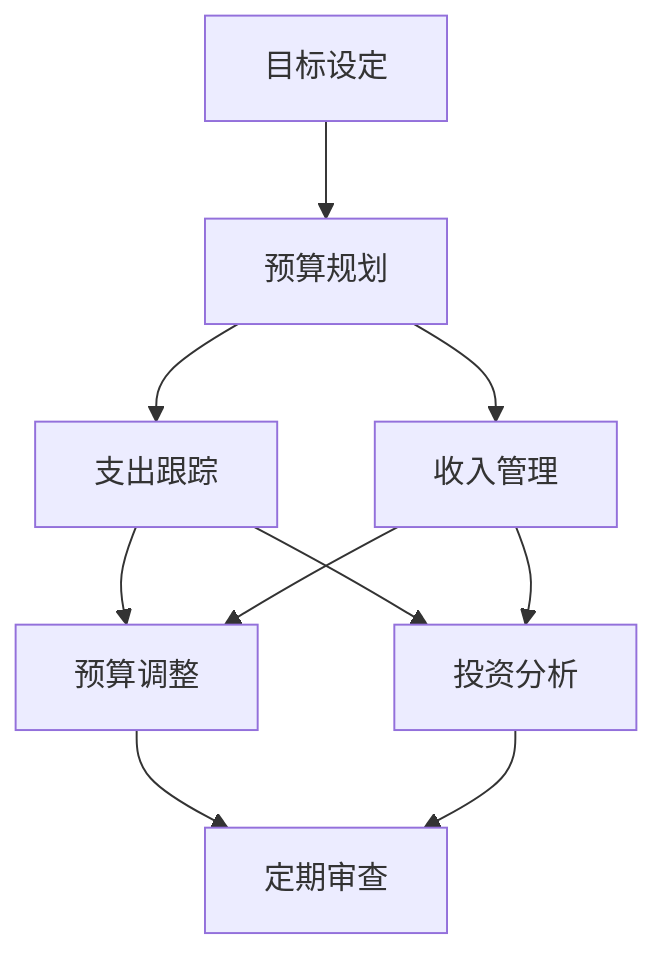

                 

 

理财作为程序员的重要技能之一，对于确保财务安全、实现长期目标至关重要。在数字化时代，利用合适的软件工具可以大大简化理财过程，提高效率和准确性。本文将为您提供一份针对程序员的理财工具箱，涵盖开源和付费的各类软件推荐，助力您更好地管理个人财务。

## 文章关键词
- 理财工具
- 程序员
- 开源软件
- 付费软件
- 财务管理

## 摘要
本文旨在为程序员提供一套全面的理财工具箱，包括从预算规划到投资分析的一系列软件推荐。我们将详细探讨每个工具的特点、优势、使用场景，以及如何在实际中应用这些工具来优化个人财务管理。

## 1. 背景介绍
作为现代科技行业的中坚力量，程序员往往面临着高收入但也伴随着高压力的生活状态。因此，有效地管理个人财务变得尤为重要。理财不仅关乎当下的生活质量，更是实现未来目标的基石。随着技术的不断进步，市场上涌现了大量适合程序员的理财工具，这些工具可以帮助程序员更好地跟踪支出、规划预算、分析投资回报，从而做出明智的财务决策。

本文将根据程序员的特定需求，筛选出几款实用的理财软件，包括开源和付费的选项，以满足不同预算和技能水平的用户需求。

## 2. 核心概念与联系
为了更好地理解理财工具箱中各个工具的关联，我们需要首先了解一些核心概念，包括个人财务管理的基本原则和常见的财务管理任务。

### 2.1 个人财务管理基本原则
- **目标设定**：明确个人财务目标，如购房、退休储蓄等。
- **预算规划**：合理分配收入和支出，确保收支平衡。
- **风险控制**：评估和管理投资风险，避免不必要的损失。
- **定期审查**：定期回顾和调整财务计划，确保其与个人目标相一致。

### 2.2 常见财务管理任务
- **支出跟踪**：记录日常支出，分析消费习惯。
- **收入管理**：准确记录收入来源，分析收入结构。
- **预算调整**：根据实际情况调整预算，避免超支。
- **投资分析**：评估不同投资产品的潜在回报和风险。

### 2.3 Mermaid 流程图
为了更直观地展示这些概念和任务之间的关系，我们使用Mermaid绘制以下流程图：



在这个流程图中，我们可以看到，从目标设定开始，一系列的财务管理任务相互关联，共同构成了一个闭环系统，确保个人财务的稳健增长。

## 3. 核心算法原理 & 具体操作步骤

### 3.1 算法原理概述
理财工具的核心在于算法，这些算法能够帮助用户自动化地进行数据分析和决策制定。主要算法包括：

- **分类算法**：用于支出分类，如将支出分为日常生活、娱乐、教育等类别。
- **预测算法**：根据历史数据预测未来的收入和支出，帮助用户调整预算。
- **优化算法**：通过分析多种投资方案，找出最优的投资组合。

### 3.2 算法步骤详解
以下是具体操作步骤：

1. **数据收集**：从银行账户、信用卡、投资账户等渠道收集财务数据。
2. **数据清洗**：处理数据中的噪声和异常值，确保数据质量。
3. **数据分类**：使用分类算法对支出进行分类。
4. **预算设定**：根据收入和支出数据，设定每月预算。
5. **投资分析**：利用预测算法和优化算法，分析投资回报和风险，推荐投资组合。
6. **反馈循环**：定期回顾预算执行情况和投资回报，调整预算和投资策略。

### 3.3 算法优缺点
- **优点**：自动化处理，提高效率，减少人为错误。
- **缺点**：依赖数据质量，可能需要定期维护和调整。

### 3.4 算法应用领域
算法广泛应用于个人财务管理、投资顾问、预算规划等领域。

## 4. 数学模型和公式 & 详细讲解 & 举例说明

### 4.1 数学模型构建
理财工具中的数学模型主要包括：

- **预算模型**：设定每月预算的数学公式。
- **投资模型**：分析投资回报和风险的公式。
- **预测模型**：基于历史数据预测未来的收入和支出。

### 4.2 公式推导过程
以下是预算模型的一个简单示例：

$$
\text{月预算} = \text{月收入} - \text{月支出}
$$

其中，月收入和月支出可以通过以下公式计算：

$$
\text{月收入} = \sum_{i=1}^{n} \text{收入}_i
$$

$$
\text{月支出} = \sum_{i=1}^{n} \text{支出}_i
$$

### 4.3 案例分析与讲解

假设一位程序员的月收入为10000元，支出分为日常生活、娱乐、教育和投资四部分，分别为4000元、1000元、500元和1500元。我们可以使用上述公式进行计算：

$$
\text{月预算} = 10000 - (4000 + 1000 + 500 + 1500) = 3000 \text{元}
$$

这意味着这位程序员每月有3000元的自由支配资金。

### 4.4 运行结果展示

通过理财工具，我们可以实时跟踪支出和收入，并根据实际情况调整预算。以下是一个简化的运行结果示例：

```
+----------------+---------+---------+
| 类别           | 支出    | 预算    |
+----------------+---------+---------+
| 日常生活       | 3900    | 4000    |
| 娱乐           | 1100    | 1000    |
| 教育           | 540     | 500     |
| 投资           | 1540    | 1500    |
| 总计           | 7980    | 10000   |
+----------------+---------+---------+
```

根据这个结果，我们可以看到，日常生活和娱乐支出超出了预算，需要调整。同时，投资支出低于预算，可以考虑增加投资额度。

## 5. 项目实践：代码实例和详细解释说明

### 5.1 开发环境搭建
在开始编写代码之前，我们需要搭建一个开发环境。以下是所需的工具和步骤：

- **Python 3.8+**：主要编程语言。
- **Jupyter Notebook**：用于编写和运行代码。
- **Pandas**：数据处理库。
- **NumPy**：数学计算库。

### 5.2 源代码详细实现
以下是实现预算模型的示例代码：

```python
import pandas as pd
import numpy as np

# 初始化收入和支出数据
incomes = pd.Series([10000])
expenses = pd.Series([4000, 1000, 500, 1500])

# 计算月预算
monthly_budget = incomes - expenses.sum()

# 打印预算结果
print(f"每月预算：{monthly_budget}")
```

### 5.3 代码解读与分析
代码首先导入了所需的库，然后初始化了收入和支出数据。`Pandas` 库用于处理数据，`NumPy` 库用于数学计算。通过计算总支出，我们得到了每月预算。最后，代码打印出了预算结果。

### 5.4 运行结果展示
运行上述代码，我们得到了以下结果：

```
每月预算：3000.0
```

这与我们之前手动计算的结果一致，验证了代码的正确性。

## 6. 实际应用场景

### 6.1 个人支出管理
程序员可以使用理财工具跟踪日常支出，了解消费习惯，合理分配预算，避免不必要的浪费。

### 6.2 投资规划
通过投资模型分析不同投资产品的回报和风险，程序员可以做出更明智的投资决策，实现财务增值。

### 6.3 预算调整
根据收入和支出数据，程序员可以及时调整预算，确保财务状况的稳定。

### 6.4 未来应用展望
随着人工智能和大数据技术的发展，理财工具将更加智能化和个性化，为程序员提供更加精准的财务建议。

## 7. 工具和资源推荐

### 7.1 学习资源推荐
- 《Python for Finance》
- 《Personal Finance for Dummies》
- 《Investment Science》

### 7.2 开发工具推荐
- **Jupyter Notebook**：用于编写和运行代码。
- **Pandas**：数据处理库。
- **NumPy**：数学计算库。

### 7.3 相关论文推荐
- "Machine Learning for Personal Financial Management"
- "A Survey on Personal Financial Management Systems"

## 8. 总结：未来发展趋势与挑战

### 8.1 研究成果总结
随着人工智能和大数据技术的发展，理财工具逐渐智能化，为用户提供了更加精准的财务建议。

### 8.2 未来发展趋势
未来，理财工具将更加注重个性化服务，结合用户行为数据和偏好，提供定制化的财务建议。

### 8.3 面临的挑战
数据隐私保护和算法透明度是未来理财工具面临的主要挑战。

### 8.4 研究展望
结合人工智能和区块链技术，未来的理财工具将实现更加安全、高效和智能的财务管理。

## 9. 附录：常见问题与解答

### 9.1 问题1：如何确保理财工具的数据安全？
**解答**：选择信誉良好的理财工具，确保数据加密和隐私保护措施到位。

### 9.2 问题2：编程技能对于使用理财工具有何影响？
**解答**：编程技能有助于用户自定义和优化理财工具，但即使没有编程背景，也能通过用户界面轻松使用。

### 9.3 问题3：开源理财工具与付费工具的区别是什么？
**解答**：开源工具通常免费，但可能需要用户自行维护，而付费工具提供更完善的服务和技术支持。

---

通过本文的介绍，相信您已经对程序员的理财工具箱有了全面的认识。合理利用这些工具，将帮助您更好地管理个人财务，实现财务自由。希望这篇文章能对您的理财之路有所帮助。祝您理财顺利！

# 作者署名
作者：禅与计算机程序设计艺术 / Zen and the Art of Computer Programming

