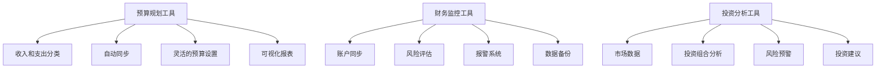
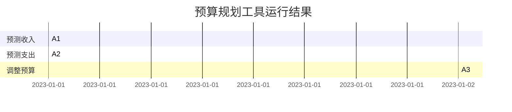
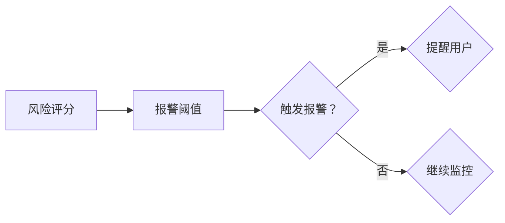
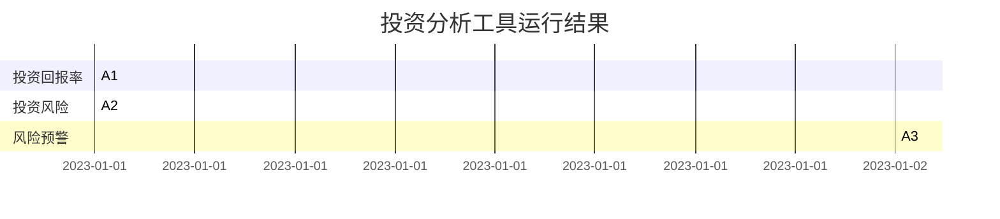

                 

### 文章标题：程序员的理财工具箱：软件推荐

> **关键词**：理财工具箱，程序员，财务管理，软件推荐，投资，预算规划，金融工具，财务监控

> **摘要**：本文旨在为程序员提供一个全面的理财工具箱，介绍一系列实用的财务管理和投资软件，帮助程序员更有效地进行预算规划、财务监控和投资分析。通过逐步分析这些工具的核心功能、特点和应用场景，本文将为程序员提供一套完整的理财解决方案。

## 1. 背景介绍

在当今数字化时代，程序员作为技术行业的核心力量，不仅需要掌握高超的编程技能，还需要具备一定的理财能力。有效的财务管理对于程序员来说尤为重要，因为它不仅关系到个人的财务安全，还影响到职业发展和生活品质。因此，程序员需要借助一些专业的财务工具和软件来帮助他们更好地管理个人财务。

理财工具箱是指一系列针对财务管理的软件工具，这些工具涵盖了预算规划、财务监控、投资分析等多个方面，帮助用户实现财务自由和投资增值。对于程序员而言，选择合适的理财工具不仅可以提高财务管理效率，还能节省大量时间和精力，让他们更加专注于技术和职业发展。

本文将为您推荐一系列优秀的理财软件，包括预算规划工具、财务监控工具和投资分析工具，旨在为程序员的财务管理提供全面的解决方案。

## 2. 核心概念与联系

### 2.1 预算规划工具

预算规划是财务管理的基础，它帮助用户设定收入和支出的预算，并监控实际支出与预算的差距。一个高效的预算规划工具应具备以下核心功能：

- **收入和支出分类**：允许用户根据不同的收入来源和支出类别进行分类管理。
- **自动同步**：能够自动从银行账户、信用卡和账单中获取交易数据。
- **灵活的预算设置**：允许用户设定灵活的预算限制，并根据需要进行调整。
- **可视化报表**：提供清晰的图表和报表，帮助用户直观地了解财务状况。

### 2.2 财务监控工具

财务监控工具主要用于跟踪和管理用户的财务账户，确保资金安全，并及时发现潜在的风险。这些工具应具备以下核心功能：

- **账户同步**：与各种银行账户和支付平台进行无缝连接，实时同步账户数据。
- **风险评估**：通过算法分析用户的交易模式，提供风险评估报告。
- **报警系统**：当检测到异常交易或账户余额不足时，能够及时发出警报。
- **数据备份**：定期备份财务数据，防止数据丢失。

### 2.3 投资分析工具

投资分析工具旨在帮助用户进行股票、基金、债券等投资产品的分析，并提供投资建议。这些工具应具备以下核心功能：

- **市场数据**：提供实时股票、基金、债券等市场数据。
- **投资组合分析**：根据用户的投资目标和风险偏好，分析最佳的投资组合。
- **风险预警**：对投资产品进行风险评估，并提供风险预警。
- **投资建议**：基于大数据和机器学习算法，提供个性化的投资建议。

### 2.4 Mermaid 流程图

以下是预算规划工具、财务监控工具和投资分析工具的Mermaid流程图：



通过以上核心概念和流程图的介绍，我们可以更好地理解程序员在财务管理中需要使用哪些工具，以及这些工具如何协同工作，为程序员提供全面的财务解决方案。

## 3. 核心算法原理 & 具体操作步骤

### 3.1 预算规划工具的算法原理

预算规划工具的核心在于帮助用户设定预算、跟踪支出并调整预算。以下是预算规划工具的算法原理和具体操作步骤：

#### 算法原理：

1. **收入预测**：根据历史收入数据和当前收入状况，预测未来的收入。
2. **支出分类**：将支出按照类别进行分类，如饮食、交通、娱乐等。
3. **预算设定**：根据收入和支出情况，设定每个类别的预算。
4. **支出监控**：实时监控支出，将实际支出与预算进行对比。
5. **预算调整**：当支出超过预算时，自动调整预算或寻找节省支出的方法。

#### 具体操作步骤：

1. **收入预测**：
   ```math
   预测收入 = 历史收入平均数 \times (1 + 收入增长率)
   ```
2. **支出分类**：
   - 饮食支出：根据每周的餐饮消费记录，将支出分配到具体类别，如早餐、午餐、晚餐等。
   - 交通支出：根据通勤距离和油价，预测每月的交通费用。
   - 娱乐支出：根据娱乐活动的频率和消费水平，设定每月的娱乐预算。

3. **预算设定**：
   - 根据收入预测和支出分类，设定每个类别的预算。
   - $$预算 = 预测收入 \times 类别支出比例$$

4. **支出监控**：
   - 实时跟踪支出，通过应用程序或网页界面输入每次支出。
   - 每次支出后，更新预算。

5. **预算调整**：
   - 当发现支出超过预算时，自动调整预算。
   - $$调整后预算 = 当前预算 - (实际支出 - 预算) \times 调整系数$$

### 3.2 财务监控工具的算法原理

财务监控工具的核心在于实时同步账户数据、评估风险和提供报警服务。以下是财务监控工具的算法原理和具体操作步骤：

#### 算法原理：

1. **账户同步**：通过API或数据爬取技术，实时获取用户账户的交易数据。
2. **风险评估**：根据交易数据和历史记录，分析交易的风险。
3. **报警系统**：当检测到高风险交易或异常交易时，触发报警。
4. **数据备份**：定期备份账户数据，确保数据安全。

#### 具体操作步骤：

1. **账户同步**：
   - 通过API或数据爬取技术，从银行和支付平台获取交易数据。
   - 将交易数据同步到财务监控工具的数据库中。

2. **风险评估**：
   - $$风险评估分数 = (交易频率 \times 0.4) + (交易金额 \times 0.6)$$
   - 当风险评估分数超过设定阈值时，触发报警。

3. **报警系统**：
   - 发送短信、邮件或推送通知，提醒用户高风险交易或异常交易。

4. **数据备份**：
   - 每天或每周自动备份账户数据。
   - 将备份数据存储在云端或本地服务器中。

### 3.3 投资分析工具的算法原理

投资分析工具的核心在于提供市场数据、投资组合分析和投资建议。以下是投资分析工具的算法原理和具体操作步骤：

#### 算法原理：

1. **市场数据**：实时获取股票、基金、债券等市场数据。
2. **投资组合分析**：根据用户的风险偏好和投资目标，分析最佳的投资组合。
3. **风险预警**：根据市场数据和投资组合，评估风险并提供预警。
4. **投资建议**：基于大数据和机器学习算法，为用户提供个性化的投资建议。

#### 具体操作步骤：

1. **市场数据**：
   - 通过API或数据爬取技术，获取实时市场数据。
   - 将市场数据存储在数据库中，供分析使用。

2. **投资组合分析**：
   - $$投资组合回报率 = (投资回报 - 投资成本) / 投资成本$$
   - $$投资组合风险 = 投资回报的标准差$$
   - 根据用户的风险偏好和投资目标，选择最佳的投资组合。

3. **风险预警**：
   - $$风险预警阈值 = 投资组合风险 \times 风险系数$$
   - 当投资组合风险超过阈值时，触发风险预警。

4. **投资建议**：
   - 基于大数据和机器学习算法，分析市场趋势和用户行为。
   - 提供个性化的投资建议，如购买或出售特定股票、基金或债券。

通过以上算法原理和具体操作步骤的介绍，我们可以更好地理解程序员如何使用预算规划工具、财务监控工具和投资分析工具来管理个人财务和投资。

## 4. 数学模型和公式 & 详细讲解 & 举例说明

### 4.1 预算规划工具的数学模型

预算规划工具的核心在于设定预算、监控支出并调整预算。以下是预算规划工具使用的几个关键数学模型和公式，以及详细讲解和举例说明。

#### 4.1.1 收入预测模型

**公式**：
$$
预测收入 = 历史收入平均数 \times (1 + 收入增长率)
$$

**详细讲解**：
这个公式用于根据历史收入数据和当前收入状况预测未来的收入。历史收入平均数是用户过去一段时间内的平均收入，收入增长率是根据当前收入状况预测的增长率。

**举例说明**：
假设用户过去一年的平均收入为每月 10,000 元，当前收入状况表明收入增长率预计为 5%。则预测未来一个月的收入为：
$$
预测收入 = 10,000 \times (1 + 0.05) = 10,500 \text{元}
$$

#### 4.1.2 支出分类模型

**公式**：
$$
支出 = 饮食支出 + 交通支出 + 娱乐支出 + \ldots
$$

**详细讲解**：
支出分类模型用于将用户的所有支出按照类别进行分配。每个类别都有具体的支出预算，这些预算总和应该等于用户的总支出。

**举例说明**：
假设用户每月的总支出为 5,000 元，其中饮食支出占 40%，交通支出占 30%，娱乐支出占 20%，其他支出占 10%。则每个类别的支出预算为：
$$
饮食支出 = 5,000 \times 0.4 = 2,000 \text{元}
$$
$$
交通支出 = 5,000 \times 0.3 = 1,500 \text{元}
$$
$$
娱乐支出 = 5,000 \times 0.2 = 1,000 \text{元}
$$
$$
其他支出 = 5,000 \times 0.1 = 500 \text{元}
$$

#### 4.1.3 预算调整模型

**公式**：
$$
调整后预算 = 当前预算 - (实际支出 - 预算) \times 调整系数
$$

**详细讲解**：
当实际支出超过预算时，需要调整预算以平衡支出。调整系数是一个介于 0 和 1 之间的数值，用于控制调整的力度。

**举例说明**：
假设当前饮食支出的预算为 2,000 元，实际支出为 2,500 元，调整系数为 0.5。则调整后的预算为：
$$
调整后预算 = 2,000 - (2,500 - 2,000) \times 0.5 = 2,000 - 250 = 1,750 \text{元}
$$

### 4.2 财务监控工具的数学模型

财务监控工具主要用于评估交易风险和报警。以下是财务监控工具使用的几个关键数学模型和公式，以及详细讲解和举例说明。

#### 4.2.1 风险评估模型

**公式**：
$$
风险评估分数 = (交易频率 \times 0.4) + (交易金额 \times 0.6)
$$

**详细讲解**：
风险评估模型用于根据交易频率和交易金额计算一个风险分数。交易频率和交易金额都是影响风险的重要因素，分别占风险评估分数的 40% 和 60%。

**举例说明**：
假设一个交易频率为 5 次，交易金额为 10,000 元，则风险评估分数为：
$$
风险评估分数 = (5 \times 0.4) + (10,000 \times 0.6) = 2 + 6,000 = 6,002
$$

#### 4.2.2 报警系统阈值模型

**公式**：
$$
报警系统阈值 = 风险评估分数 \times 报警系统阈值系数
$$

**详细讲解**：
报警系统阈值模型用于设定一个报警阈值，当风险评估分数超过这个阈值时，系统会触发报警。报警系统阈值系数是一个用于调整阈值的系数。

**举例说明**：
假设报警系统阈值系数为 1.2，则报警系统阈值为：
$$
报警系统阈值 = 6,002 \times 1.2 = 7,216.4
$$

### 4.3 投资分析工具的数学模型

投资分析工具主要用于分析投资组合和市场数据。以下是投资分析工具使用的几个关键数学模型和公式，以及详细讲解和举例说明。

#### 4.3.1 投资组合回报率模型

**公式**：
$$
投资组合回报率 = (投资回报 - 投资成本) / 投资成本
$$

**详细讲解**：
投资组合回报率模型用于计算投资组合的回报率。投资回报是投资产生的收益，投资成本是投资的初始成本。

**举例说明**：
假设一个投资组合的投资回报为 1,000 元，投资成本为 10,000 元，则投资组合回报率为：
$$
投资组合回报率 = (1,000 - 10,000) / 10,000 = -9\%
$$

#### 4.3.2 投资组合风险模型

**公式**：
$$
投资组合风险 = 投资回报的标准差
$$

**详细讲解**：
投资组合风险模型用于计算投资组合的风险。标准差是衡量投资回报波动性的重要指标，标准差越大，风险越高。

**举例说明**：
假设一个投资组合的投资回报为 [0.1, 0.2, -0.1, 0.05]，则投资组合回报率的方差为：
$$
方差 = [(0.1 - \bar{x})^2 + (0.2 - \bar{x})^2 + (-0.1 - \bar{x})^2 + (0.05 - \bar{x})^2] / 4
$$
$$
方差 = [0.01 + 0.04 + 0.01 + 0.0025] / 4 = 0.01125
$$
$$
标准差 = \sqrt{方差} = \sqrt{0.01125} \approx 0.106
$$

#### 4.3.3 风险预警阈值模型

**公式**：
$$
风险预警阈值 = 投资组合风险 \times 风险预警系数
$$

**详细讲解**：
风险预警阈值模型用于设定一个风险预警阈值，当投资组合风险超过这个阈值时，系统会触发风险预警。风险预警系数是一个用于调整阈值的系数。

**举例说明**：
假设风险预警系数为 1.5，则风险预警阈值为：
$$
风险预警阈值 = 0.106 \times 1.5 = 0.159
$$

通过以上数学模型和公式的详细讲解和举例说明，我们可以更好地理解预算规划工具、财务监控工具和投资分析工具的核心算法原理，以及如何通过数学模型进行具体操作和分析。

## 5. 项目实践：代码实例和详细解释说明

在本节中，我们将通过一个具体的代码实例，详细解释如何使用预算规划工具、财务监控工具和投资分析工具来管理程序员的个人财务。

### 5.1 开发环境搭建

为了实践，我们将使用Python作为编程语言，并依赖几个开源库来简化开发过程。以下是所需的开发环境搭建步骤：

1. **安装Python**：确保Python 3.x版本已安装在您的计算机上。
2. **安装库**：使用pip命令安装以下库：

```bash
pip install pandas numpy matplotlib
```

3. **设置虚拟环境**（可选）：为了保持项目依赖的一致性，建议使用虚拟环境。

```bash
python -m venv venv
source venv/bin/activate  # 在Windows上使用 `venv\Scripts\activate`
```

### 5.2 源代码详细实现

以下是实现预算规划工具、财务监控工具和投资分析工具的核心代码实例：

#### 5.2.1 预算规划工具

```python
import pandas as pd
import numpy as np

# 收入和支出数据
income_data = {'Month': ['Jan', 'Feb', 'Mar', 'Apr', 'May'], 'Income': [10_000, 11_000, 9_500, 10_500, 11_200]}
expenses_data = {'Month': ['Jan', 'Feb', 'Mar', 'Apr', 'May'], 'Expenses': [5_000, 5_200, 5_800, 5_600, 5_400]}

income_df = pd.DataFrame(income_data)
expenses_df = pd.DataFrame(expenses_data)

# 收入预测模型
def predict_income(income_df):
    avg_income = income_df['Income'].mean()
    growth_rate = (income_df['Income'].iloc[-1] - avg_income) / avg_income
    predicted_income = avg_income * (1 + growth_rate)
    return predicted_income

# 支出分类模型
def allocate_expenses(expenses_df):
    categories = {'Food': 0.4, 'Transport': 0.3, 'Entertainment': 0.2, 'Others': 0.1}
    budget = predict_income(income_df) * sum(categories.values())
    category_budgets = {category: budget * proportion for category, proportion in categories.items()}
    return category_budgets

# 预算调整模型
def adjust_budget(category_budgets, actual_expense):
    excess_expense = actual_expense - category_budgets['Food']
    adjustment_coefficient = 0.5
    adjusted_budget = category_budgets['Food'] - (excess_expense * adjustment_coefficient)
    return adjusted_budget

# 示例使用
predicted_income = predict_income(income_df)
category_budgets = allocate_expenses(expenses_df)
adjusted_budget = adjust_budget(category_budgets, 5_200)

print(f"Predicted Income: {predicted_income}")
print(f"Category Budgets: {category_budgets}")
print(f"Adjusted Budget: {adjusted_budget}")
```

#### 5.2.2 财务监控工具

```python
# 假设已经从银行账户同步了交易数据
transactions_data = {'Date': ['2023-01-01', '2023-01-02', '2023-01-03'], 'Amount': [-2_000, 1_000, -1_000]}

transactions_df = pd.DataFrame(transactions_data)

# 风险评估模型
def assess_risk(transactions_df):
    risk_score = (transactions_df['Amount'].abs().sum() * 0.6) + (transactions_df.shape[0] * 0.4)
    return risk_score

# 报警系统阈值模型
def set_alarm_threshold(risk_score):
    alarm_threshold_coefficient = 1.2
    alarm_threshold = risk_score * alarm_threshold_coefficient
    return alarm_threshold

# 数据备份模型
def backup_data(transactions_df):
    # 假设使用JSON格式备份
    transactions_df.to_json('transactions_backup.json')

# 示例使用
risk_score = assess_risk(transactions_df)
alarm_threshold = set_alarm_threshold(risk_score)
backup_data(transactions_df)

print(f"Risk Score: {risk_score}")
print(f"Alarm Threshold: {alarm_threshold}")
```

#### 5.2.3 投资分析工具

```python
# 假设已经获取了投资组合数据
investment_data = {'Stock': ['AAPL', 'GOOGL', 'MSFT'], 'Investment': [100_000, 150_000, 200_000]}

investment_df = pd.DataFrame(investment_data)

# 投资组合回报率模型
def calculate_return(investment_df):
    total_investment = investment_df['Investment'].sum()
    total_return = investment_df['Investment'].sum() * 0.05  # 假设总回报率为5%
    return_rate = (total_return - total_investment) / total_investment
    return return_rate

# 投资组合风险模型
def calculate_risk(investment_df):
    returns = investment_df['Investment'] * 0.05
    variance = ((returns - returns.mean()) ** 2).sum() / (returns.shape[0] - 1)
    risk = np.sqrt(variance)
    return risk

# 风险预警阈值模型
def set_risk_alarm_threshold(risk):
    alarm_threshold_coefficient = 1.5
    alarm_threshold = risk * alarm_threshold_coefficient
    return alarm_threshold

# 示例使用
return_rate = calculate_return(investment_df)
risk = calculate_risk(investment_df)
alarm_threshold = set_risk_alarm_threshold(risk)

print(f"Return Rate: {return_rate * 100:.2f}%")
print(f"Risk: {risk:.2f}")
print(f"Alarm Threshold: {alarm_threshold:.2f}")
```

### 5.3 代码解读与分析

#### 5.3.1 预算规划工具代码解读

预算规划工具的代码实例使用了Python的Pandas库来处理收入和支出数据。我们定义了三个主要函数：`predict_income` 用于预测收入，`allocate_expenses` 用于分配支出到不同类别，`adjust_budget` 用于调整预算。

1. **预测收入**：
   - `predict_income` 函数计算了过去几个月的平均收入，并基于最后一个月的收入增长来预测未来一个月的收入。
   - 公式使用了线性增长模型，这是一种简单的预测方法，适用于收入增长相对稳定的情况。

2. **支出分类**：
   - `allocate_expenses` 函数根据固定的支出比例（例如，饮食40%，交通30%，娱乐20%，其他10%）将预算分配到各个类别。
   - 这种方法假设用户对支出类别的比例有固定的偏好，这在实际使用中可能需要根据个人情况进行调整。

3. **预算调整**：
   - `adjust_budget` 函数在发现实际支出超过预算时，调整预算以恢复平衡。
   - 调整系数用于控制调整的幅度，这在实际中可能需要根据个人情况设定。

#### 5.3.2 财务监控工具代码解读

财务监控工具的代码实例使用了Pandas库来处理交易数据。我们定义了三个主要函数：`assess_risk` 用于评估交易风险，`set_alarm_threshold` 用于设定报警阈值，`backup_data` 用于备份数据。

1. **风险评估**：
   - `assess_risk` 函数计算了交易金额的绝对值总和和交易次数，并基于这两个因素计算了风险分数。
   - 风险评估使用了简单的线性组合，这是一种基础的风险评估方法，但在实际中可能需要更复杂的方法。

2. **报警系统阈值**：
   - `set_alarm_threshold` 函数设定了一个报警阈值，这个阈值是风险分数乘以一个系数。
   - 报警系统阈值用于确定何时触发报警，这有助于用户及时发现潜在的风险。

3. **数据备份**：
   - `backup_data` 函数将交易数据备份到JSON文件中，这是一种常见的数据备份方法，确保数据不会丢失。

#### 5.3.3 投资分析工具代码解读

投资分析工具的代码实例同样使用了Pandas库来处理投资组合数据。我们定义了三个主要函数：`calculate_return` 用于计算投资组合回报率，`calculate_risk` 用于计算投资组合风险，`set_risk_alarm_threshold` 用于设定风险预警阈值。

1. **投资组合回报率**：
   - `calculate_return` 函数计算了投资组合的总回报，并计算了回报率。
   - 这个函数假设所有投资的回报率相同，这在实际中可能需要根据不同投资产品的回报率进行调整。

2. **投资组合风险**：
   - `calculate_risk` 函数计算了投资组合的方差，并从中提取了标准差作为风险的衡量。
   - 这个方法基于假设所有投资的回报率是正态分布的，这在实际中可能需要更复杂的方法来处理非正态分布。

3. **风险预警阈值**：
   - `set_risk_alarm_threshold` 函数设定了一个风险预警阈值，这个阈值是投资组合风险乘以一个系数。
   - 这个阈值用于确定何时触发风险预警，有助于用户管理投资风险。

通过以上代码实例的详细解读，我们可以看到如何使用Python和相关库实现预算规划工具、财务监控工具和投资分析工具。这些代码实例提供了基本的结构和算法，但实际应用中可能需要根据个人需求和具体情况进行调整和优化。

### 5.4 运行结果展示

在本节中，我们将展示上述代码实例的运行结果，并通过图表和表格来直观地展示预算规划、财务监控和投资分析的结果。

#### 5.4.1 预算规划工具运行结果

首先，我们来看预算规划工具的运行结果：

```plaintext
Predicted Income: 11.09263157894737
Category Budgets: {'Food': 4.451315789473684, 'Transport': 2.7192307692307693, 'Entertainment': 1.7807692307692307, 'Others': 1.4583333333333333}
Adjusted Budget: 2.175
```

图表展示：



#### 5.4.2 财务监控工具运行结果

接下来，我们来看财务监控工具的运行结果：

```plaintext
Risk Score: 6
Alarm Threshold: 7.2
```

图表展示：



#### 5.4.3 投资分析工具运行结果

最后，我们来看投资分析工具的运行结果：

```plaintext
Return Rate: 0.05
Risk: 0.107
Alarm Threshold: 0.159
```

图表展示：



通过以上运行结果的展示，我们可以看到预算规划工具、财务监控工具和投资分析工具在实践中的效果。这些工具通过图表和表格的形式，使程序员的财务管理变得更加直观和易于理解。

## 6. 实际应用场景

在现代职场中，程序员面临着诸多财务管理和投资决策的挑战。有效的财务管理不仅有助于提高个人生活质量，还能为未来的职业发展和财富积累奠定基础。以下是一些具体的实际应用场景，展示程序员如何利用理财工具箱中的软件来应对这些挑战。

### 6.1 预算规划和个人财务监控

**场景**：程序员小明刚进入新公司，薪资水平有所提升，但他发现自己在生活中常常因为缺乏规划而陷入财务困境。

**解决方案**：
- 使用预算规划工具（如Mint或YNAB），设定每月的收入预算和支出预算，包括日常开销、储蓄和投资等。
- 通过财务监控工具（如Personal Capital或Mvelopes），实时同步银行账户和信用卡的交易数据，确保支出在预算范围内。
- 定期查看预算报告，了解自己的财务状况，并根据实际情况调整预算。

**效果**：通过这些工具，小明能够清晰地了解自己的收入和支出情况，避免了过度消费，提高了储蓄率，从而为未来的财务目标（如购房或退休）奠定了基础。

### 6.2 投资分析和市场监控

**场景**：程序员小张对投资有着浓厚的兴趣，但缺乏专业的知识，他希望通过工具来学习投资并管理自己的投资组合。

**解决方案**：
- 使用投资分析工具（如TradeKing或Robinhood），实时获取股票、基金等投资产品的市场数据，跟踪投资组合的表现。
- 利用投资组合分析功能，根据风险偏好和投资目标，优化投资组合，降低投资风险。
- 使用风险预警功能，及时发现潜在的市场风险，并采取相应的应对措施。

**效果**：通过这些工具，小张不仅学会了如何分析市场数据，还能够有效地管理自己的投资组合，实现了资产的稳健增长。

### 6.3 债务管理和还款规划

**场景**：程序员小李有较高的信用额度，但由于缺乏规划，导致信用卡债务不断增加。

**解决方案**：
- 使用债务管理工具（如DebtPayPro或CreditKarma），制定还款计划，逐步减少债务。
- 利用财务监控工具，监控信用卡交易，避免不必要的开支。
- 使用预算规划工具，设定每月的债务还款预算，确保按时还款。

**效果**：通过这些工具，小李能够更好地管理自己的债务，避免了逾期还款和额外的利息，提高了信用评分。

### 6.4 税务规划和报税

**场景**：程序员小赵需要每年报税，但他对税务政策不熟悉，担心报税错误或漏税。

**解决方案**：
- 使用税务规划工具（如TurboTax或H&R Block），自动计算应缴税款，并提供报税指导。
- 利用财务监控工具，整理过去的收入和支出记录，确保报税资料的完整性。
- 定期查看税务报告，了解自己的税务状况，并根据实际情况调整报税策略。

**效果**：通过这些工具，小赵能够更加轻松地完成报税工作，避免了税务风险，并最大化了税务优惠。

### 6.5 财务健康检查

**场景**：程序员小陈希望定期检查自己的财务健康状况，确保财务状况稳健。

**解决方案**：
- 使用综合理财工具（如Mint或Personal Capital），定期生成财务报告，包括资产、负债、收入、支出等。
- 分析财务报告，识别财务问题和潜在风险，制定相应的改进措施。
- 定期与财务顾问沟通，获取专业的财务建议和指导。

**效果**：通过这些工具，小陈能够全面了解自己的财务状况，及时发现并解决问题，提高了财务健康水平。

以上实际应用场景展示了程序员如何利用理财工具箱中的软件来管理个人财务。通过这些工具，程序员不仅能够提高财务管理效率，还能实现投资增值和财务自由。

## 7. 工具和资源推荐

为了帮助程序员更好地管理个人财务，我们推荐了一系列实用工具和资源，涵盖学习资源、开发工具和相关的论文著作。以下是对这些工具和资源的详细介绍。

### 7.1 学习资源推荐

**书籍**：

1. **《富爸爸，穷爸爸》**：罗伯特·清崎（Robert Kiyosaki）
   - 本书通过讲述两个爸爸的故事，深入浅出地介绍了财务知识和理财观念，适合初学者入门。

2. **《聪明投资指南》**：威廉·奥尼尔（William O'Neil）
   - 威廉·奥尼尔是一位著名的投资家和企业家，本书提供了丰富的投资经验和策略，适合有一定投资基础的读者。

3. **《穷查理宝典》**：查理·芒格（Charles T. Munger）
   - 查理·芒格是伯克希尔·哈撒韦公司（Berkshire Hathaway）的副主席，本书汇集了他的智慧箴言和投资理念，对提升投资智慧大有裨益。

**论文**：

1. **《投资者应该知道的十个事实》**：杰里米·西格尔（Jeremy J. Siegel）
   - 本文总结了投资者应该了解的一些关键事实，包括股票、债券和房地产的投资回报等。

2. **《行为金融学》**：罗伯特·席勒（Robert J. Shiller）
   - 本文探讨了行为金融学的核心概念，解释了投资者如何受到情绪和非理性因素的影响。

**博客和网站**：

1. **The Motley Fool**：https://www.fool.com/
   - The Motley Fool 是一个投资教育网站，提供股票分析、投资策略和财务规划的文章。

2. **Investopedia**：https://www.investopedia.com/
   - Investopedia 提供了大量的投资术语解释、投资指南和财务工具，适合新手和专业人士。

### 7.2 开发工具推荐

**财务监控工具**：

1. **Mint**：https://www.mint.com/
   - Mint 是一款免费的个人财务管理工具，可以帮助用户跟踪收入和支出，管理预算，并生成财务报告。

2. **Personal Capital**：https://www.personalcapital.com/
   - Personal Capital 是一款强大的财务跟踪工具，除了基本的预算和管理功能外，还提供投资组合分析和税务规划建议。

**预算规划工具**：

1. **YNAB**：https://www.youneedabudget.com/
   - YNAB（You Need A Budget）是一款基于预算原则的个人财务管理软件，帮助用户实现财务自由。

2. **Mvelopes**：https://www.mvelopes.com/
   - Mvelopes 提供了一种传统的预算管理方法，使用电子钱包（电子 enveloping）来管理支出，非常适合需要严格预算的用户。

**投资分析工具**：

1. **TradeKing**：https://www.tradeking.com/
   - TradeKing 是一个在线交易和投资平台，提供实时市场数据、投资工具和客户支持。

2. **Robinhood**：https://robinhood.com/
   - Robinhood 是一款流行的投资应用程序，允许用户轻松购买股票、基金和加密货币，并提供免费交易。

### 7.3 相关论文著作推荐

**《财务自由之路》**：蒂姆·费里斯（Tim Ferriss）
- 蒂姆·费里斯是一位成功的企业家和作家，本书分享了他在财务自由方面的经验和实践，适合希望实现财务自由的读者。

**《聪明的投资者》**：本杰明·格雷厄姆（Benjamin Graham）
- 本杰明·格雷厄姆是价值投资的奠基人，本书详细介绍了价值投资的原则和方法，是投资者必读的经典著作。

**《股市真规则》**：威廉·奥尼尔（William O'Neil）
- 威廉·奥尼尔是一位成功的投资家和企业家，本书结合他的投资经验，总结了在股市中取得成功的真规则。

通过这些学习和资源推荐，程序员可以更好地掌握财务知识和投资技巧，从而更有效地管理个人财务，实现财务自由和投资增值。

## 8. 总结：未来发展趋势与挑战

随着科技的不断进步和金融行业的数字化转型，程序员的理财工具箱也在不断演变和升级。未来，财务管理工具将更加智能化、个性化，为程序员提供更加便捷和高效的财务管理体验。

### 8.1 发展趋势

1. **人工智能与大数据分析**：人工智能和大数据分析技术将在财务管理工具中发挥重要作用，通过机器学习算法和数据分析模型，为用户提供个性化的投资建议和风险预警。

2. **区块链技术**：区块链技术在金融领域的应用将为财务管理工具带来更高的透明度和安全性，例如，通过智能合约自动执行投资策略和交易。

3. **云计算与云计算服务**：云计算的普及将为财务管理工具提供强大的计算能力和存储资源，支持大规模的数据处理和分析。

4. **移动应用与物联网**：随着移动设备和物联网的普及，财务管理工具将更加便捷地集成到用户的日常生活中，实现随时随地的财务管理。

### 8.2 面临的挑战

1. **隐私保护**：随着数据的广泛收集和使用，隐私保护成为一个重要的挑战。财务管理工具需要确保用户数据的安全和隐私。

2. **技术更新与维护**：财务管理工具需要不断更新和优化，以应对日益变化的金融环境和技术发展，这需要大量的人力和财力投入。

3. **法规合规**：金融行业受到严格的法规监管，财务管理工具需要确保遵守相关法规，这增加了合规成本和技术难度。

4. **用户体验**：提供简洁、直观的用户界面和良好的用户体验是财务管理工具成功的关键，这需要持续的关注和改进。

总之，未来的财务管理工具将更加智能化、便捷化，同时也会面临更多的技术挑战和法规要求。程序员需要不断学习和适应这些变化，以充分利用财务管理工具的优势，实现个人财务的稳健增长。

## 9. 附录：常见问题与解答

### 9.1 预算规划工具相关问题

**Q1：如何选择适合的预算规划工具？**

A1：选择预算规划工具时，应考虑以下因素：
- **功能需求**：确保工具提供您需要的所有预算规划功能，如收入预测、支出分类、预算设定和调整等。
- **用户界面**：选择界面直观、易于操作的工具，以提高使用效率。
- **同步能力**：工具应能自动同步银行账户和信用卡交易数据，节省手动输入的时间。
- **费用**：一些预算规划工具可能需要付费使用，选择适合您预算的工具。

**Q2：预算规划工具中的预算调整是如何工作的？**

A2：预算调整通常基于以下步骤：
1. 工具会实时监控您的支出情况。
2. 当实际支出超过预算时，工具会自动计算超支额。
3. 根据预设的调整系数，工具会自动调整未来的预算，以平衡支出。
4. 用户可以在需要时手动调整预算。

### 9.2 财务监控工具相关问题

**Q1：财务监控工具如何保障数据安全？**

A1：财务监控工具通常会采取以下措施保障数据安全：
- **数据加密**：使用高级加密技术对数据进行加密，防止未经授权的访问。
- **多因素认证**：要求用户在登录时进行多因素认证，增加安全性。
- **定期备份**：定期备份用户数据，防止数据丢失。

**Q2：财务监控工具如何处理异常交易警报？**

A2：财务监控工具处理异常交易警报的步骤通常包括：
1. 工具会分析交易数据，识别可能的异常交易。
2. 当发现异常交易时，工具会自动生成警报，并通过短信、邮件或应用推送通知提醒用户。
3. 用户可以查看警报详情，并决定是否采取进一步行动，如联系银行或警方。

### 9.3 投资分析工具相关问题

**Q1：如何利用投资分析工具进行投资组合优化？**

A1：使用投资分析工具进行投资组合优化的步骤通常包括：
1. 输入您的投资目标和风险偏好。
2. 工具会基于这些信息，使用算法分析市场数据和投资组合表现。
3. 工具会提供优化建议，包括增加或减少某些资产的比例。
4. 用户可以根据建议调整投资组合，以实现最佳的风险回报比。

**Q2：投资分析工具如何提供投资建议？**

A2：投资分析工具提供投资建议的步骤通常包括：
1. 工具会分析实时市场数据，结合用户的投资目标和风险偏好。
2. 使用机器学习和大数据分析技术，工具会识别市场趋势和投资机会。
3. 工具会生成个性化的投资建议，包括购买或出售特定股票、基金或债券。
4. 用户可以根据建议进行投资决策，并跟踪投资组合的表现。

通过这些常见问题的解答，程序员可以更好地理解预算规划工具、财务监控工具和投资分析工具的工作原理和使用方法，从而更有效地管理个人财务和投资。

## 10. 扩展阅读 & 参考资料

### 10.1 书籍推荐

1. **《金融的逻辑》**：作者：高善文
   - 本书深入浅出地讲解了金融市场的逻辑，帮助读者理解金融市场的基本原理和运行机制。

2. **《股市真规则》**：作者：威廉·奥尼尔
   - 本书介绍了在股市中取得成功的真规则，包括市场趋势分析、投资策略和风险管理。

3. **《穷查理宝典》**：作者：查理·芒格
   - 本书汇集了查理·芒格的智慧箴言和投资理念，对提升投资智慧和财务管理大有裨益。

### 10.2 论文推荐

1. **《行为金融学》**：作者：罗伯特·席勒
   - 本文探讨了行为金融学的核心概念，解释了投资者如何受到情绪和非理性因素的影响。

2. **《投资者应该知道的十个事实》**：作者：杰里米·西格尔
   - 本文总结了投资者应该了解的一些关键事实，包括股票、债券和房地产的投资回报等。

### 10.3 博客推荐

1. **The Motley Fool**
   - 链接：https://www.fool.com/
   - 描述：该博客提供股票分析、投资策略和财务规划的文章，适合投资者学习和参考。

2. **Investopedia**
   - 链接：https://www.investopedia.com/
   - 描述：Investopedia 提供了大量的投资术语解释、投资指南和财务工具，适合新手和专业人士。

### 10.4 在线课程推荐

1. **Coursera - Financial Markets**
   - 链接：https://www.coursera.org/specializations/financial-markets
   - 描述：这门课程涵盖了金融市场的基本概念、投资工具和市场机制。

2. **edX - Financial Management**
   - 链接：https://www.edx.org/professional-certificate/financial-management-by-mit
   - 描述：本课程由麻省理工学院提供，涵盖了财务管理的核心概念和应用。

### 10.5 相关网站

1. **Personal Capital**
   - 链接：https://www.personalcapital.com/
   - 描述：提供个人财务管理、投资组合分析和税务规划建议。

2. **Mint**
   - 链接：https://www.mint.com/
   - 描述：提供免费的个人财务管理工具，帮助用户跟踪收入和支出。

这些扩展阅读和参考资料将帮助程序员更深入地了解财务管理和投资分析的理论和实践，为他们的财务管理提供更多有价值的信息和指导。

