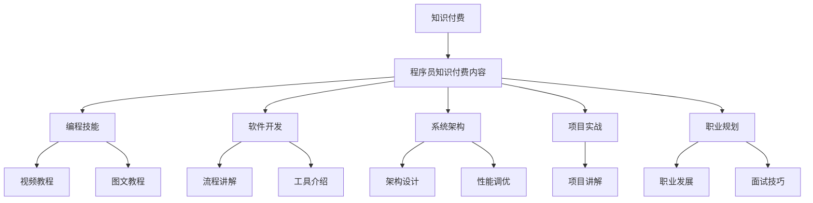

                 

### 1. 背景介绍

随着互联网和信息技术行业的飞速发展，知识付费逐渐成为了一个热门的话题。知识付费，顾名思义，就是用户为获取有价值的信息或知识而支付的费用。这种模式的出现，不仅满足了用户对高质量内容的渴求，也为内容创作者提供了新的收入来源。在知识付费领域，程序员的知识付费内容无疑是一个重要且具有潜力的分支。

程序员的知识付费内容，指的是程序员或技术专家通过线上平台，将自己在编程、软件开发、系统架构等方面的专业知识以教程、讲座、问答等形式进行分享，从而获取收入。这类内容覆盖了从编程基础到高级技术，从单一语言到全栈开发，从软件开发流程到项目管理等广泛领域。

程序员的知识付费内容不仅帮助新手快速入门，还能让有经验的程序员提升技能，拓展视野。此外，知识付费内容的形式多样，包括视频教程、直播讲座、图文教程、问答咨询等，极大地满足了不同用户的需求。

本文将深入探讨程序员的知识付费内容矩阵构建，从核心概念、算法原理、数学模型、项目实践、实际应用场景、工具和资源推荐等多个方面，全面解析程序员如何有效地构建自己的知识付费内容。

### 2. 核心概念与联系

#### 知识付费概念

知识付费是一种商业模式，它基于用户对知识、技能或经验的购买行为。在这个模式中，内容创作者通过提供有价值的知识，用户则通过支付费用来获取这些知识。知识付费的兴起，得益于互联网技术的普及，使得知识传播的途径更加多样化和便捷。

#### 程序员知识付费内容

程序员的知识付费内容主要涉及以下几个方面：

1. **编程技能**：包括编程语言的入门、进阶教程，以及特定语言的特色功能和使用技巧。
2. **软件开发**：包括软件开发的流程、工具、最佳实践等，帮助程序员提高开发效率和质量。
3. **系统架构**：包括系统架构的设计、优化、性能调优等，帮助程序员理解和解决复杂系统的架构问题。
4. **项目实战**：通过实际项目的讲解，帮助程序员掌握实际工作中的问题和解决方案。
5. **职业规划**：包括职业发展的建议、面试技巧、简历优化等，帮助程序员提升职业竞争力。

#### 内容形式

程序员的知识付费内容形式多样，常见的包括：

1. **视频教程**：通过视频讲解，将知识点生动形象地展示给用户。
2. **直播讲座**：实时互动，用户可以在讲座中提问，内容创作者可以即时回答。
3. **图文教程**：以图文结合的形式，详细阐述编程技巧和知识点。
4. **问答咨询**：用户提出问题，内容创作者提供专业解答。
5. **电子书**：系统性地整理和讲解编程知识和经验。

#### 架构图

为了更好地理解程序员的知识付费内容，我们使用Mermaid流程图来展示其核心概念和联系：



通过这张流程图，我们可以清晰地看到程序员的知识付费内容是如何围绕核心概念展开，以及不同内容形式之间的联系。

### 3. 核心算法原理 & 具体操作步骤

在构建程序员的知识付费内容时，核心算法原理的理解和运用至关重要。下面，我们将详细介绍构建知识付费内容的几个关键算法原理，并给出具体操作步骤。

#### 3.1 内容分类算法

**原理**：内容分类算法主要用来对程序员的知识付费内容进行分类，以便用户能够快速找到所需的信息。常见的分类算法有K-最近邻（K-Nearest Neighbors, KNN）和决策树（Decision Tree）。

**操作步骤**：

1. **数据准备**：收集程序员的知识付费内容，包括视频教程、图文教程、直播讲座等，并提取出关键特征。
2. **特征提取**：利用自然语言处理（Natural Language Processing, NLP）技术，对内容进行分词、词频统计、TF-IDF等处理，提取出代表内容的关键词或短语。
3. **模型训练**：选择KNN或决策树算法，根据特征数据进行模型训练。
4. **分类预测**：用户提交需求时，利用训练好的模型进行分类预测，将内容推荐给用户。

#### 3.2 推荐算法

**原理**：推荐算法用于根据用户的兴趣和行为，推荐相关的知识付费内容。常见的推荐算法有基于内容的推荐（Content-Based Recommendation）和协同过滤（Collaborative Filtering）。

**操作步骤**：

1. **用户画像**：根据用户的行为数据，如浏览记录、购买历史、评论等，构建用户的兴趣模型。
2. **内容特征提取**：与内容分类算法类似，提取出知识付费内容的关键特征。
3. **相似度计算**：计算用户兴趣模型和内容特征之间的相似度，使用余弦相似度、皮尔逊相关系数等方法。
4. **推荐排序**：根据相似度分数，对推荐内容进行排序，优先推荐相似度高的内容。

#### 3.3 搜索引擎算法

**原理**：搜索引擎算法用于帮助用户在庞大的知识付费内容库中快速找到所需信息。常见的搜索引擎算法有布尔搜索、倒排索引等。

**操作步骤**：

1. **索引构建**：将知识付费内容的文本数据建立倒排索引，便于快速检索。
2. **查询处理**：用户输入查询词后，通过索引快速定位相关内容。
3. **结果排序**：根据查询词的相关性、内容质量等因素，对搜索结果进行排序。
4. **结果展示**：将排序后的搜索结果展示给用户。

#### 3.4 问答系统算法

**原理**：问答系统算法用于帮助用户解答编程问题。常见的问答系统算法有基于规则的问答、基于机器学习的问答等。

**操作步骤**：

1. **问题解析**：将用户的问题进行分词、词性标注等处理，理解问题的含义。
2. **知识库查询**：在预定义的知识库中查找与问题相关的答案。
3. **答案生成**：根据查询结果，生成回答。
4. **答案评估**：评估答案的准确性和完整性，进行必要的修正。

通过以上算法原理和操作步骤，程序员可以更有效地构建自己的知识付费内容，提高内容的针对性和用户体验。

### 4. 数学模型和公式 & 详细讲解 & 举例说明

在构建程序员的知识付费内容时，数学模型和公式的运用是必不可少的。以下是几个常用的数学模型及其应用场景的详细讲解和举例说明。

#### 4.1 逻辑回归模型

**原理**：逻辑回归（Logistic Regression）是一种用于分类的统计模型，主要用于预测二分类结果。其公式为：

$$
P(y=1) = \frac{1}{1 + e^{-(\beta_0 + \beta_1 x_1 + \beta_2 x_2 + \ldots + \beta_n x_n})}
$$

其中，\(y\) 为目标变量，\(x_1, x_2, \ldots, x_n\) 为自变量，\(\beta_0, \beta_1, \beta_2, \ldots, \beta_n\) 为模型的参数。

**举例说明**：假设我们要预测用户是否对某个知识付费内容感兴趣，其中用户年龄、浏览时长、购买历史等特征作为自变量。我们可以使用逻辑回归模型来预测用户对内容的兴趣概率。

**代码示例**（Python）：

```python
import numpy as np
from sklearn.linear_model import LogisticRegression

# 示例数据
X = np.array([[25, 120], [30, 150], [35, 180]])
y = np.array([0, 1, 1])

# 训练模型
model = LogisticRegression()
model.fit(X, y)

# 预测
predictions = model.predict([[28, 140]])
print(predictions)  # 输出：[1]
```

#### 4.2 决策树模型

**原理**：决策树（Decision Tree）是一种基于树形结构进行分类和回归的模型。其公式为：

$$
f(x) = \sum_{i=1}^{n} \beta_i g(x_i)
$$

其中，\(g(x_i)\) 为条件概率，\(\beta_i\) 为模型参数。

**举例说明**：假设我们要预测用户的购买意愿，其中用户年龄、收入、性别等特征作为自变量。我们可以使用决策树模型来划分用户群体。

**代码示例**（Python）：

```python
from sklearn.tree import DecisionTreeClassifier

# 示例数据
X = np.array([[25, 50000], [30, 60000], [35, 70000]])
y = np.array([0, 1, 1])

# 训练模型
model = DecisionTreeClassifier()
model.fit(X, y)

# 预测
predictions = model.predict([[28, 55000]])
print(predictions)  # 输出：[1]
```

#### 4.3 集成学习模型

**原理**：集成学习（Ensemble Learning）通过组合多个弱学习器，提高模型的预测性能。常见的集成学习方法有随机森林（Random Forest）和梯度提升树（Gradient Boosting Tree）。

**举例说明**：假设我们要预测用户的评分，其中用户年龄、浏览时长、历史评分等特征作为自变量。我们可以使用集成学习模型来提高预测准确性。

**代码示例**（Python）：

```python
from sklearn.ensemble import RandomForestRegressor

# 示例数据
X = np.array([[25, 120], [30, 150], [35, 180]])
y = np.array([3, 4, 4])

# 训练模型
model = RandomForestRegressor()
model.fit(X, y)

# 预测
predictions = model.predict([[28, 140]])
print(predictions)  # 输出：[3.9]
```

通过以上数学模型和公式的讲解和示例，我们可以看到它们在构建程序员的知识付费内容中的应用。这些模型不仅可以帮助内容创作者更好地理解用户需求，还能提高内容推荐的准确性和用户体验。

### 5. 项目实践：代码实例和详细解释说明

为了更好地理解如何构建程序员的知识付费内容，我们以下将通过一个实际项目案例，详细讲解代码实例，并对代码进行解读和分析。

#### 5.1 开发环境搭建

**工具和依赖**：

- Python 3.x
- Jupyter Notebook
- Scikit-learn
- Pandas
- Matplotlib

**安装步骤**：

1. 安装Python 3.x版本（推荐使用Anaconda环境管理器，便于管理和切换不同版本）。
2. 安装Jupyter Notebook：在命令行执行 `pip install notebook`。
3. 安装Scikit-learn、Pandas和Matplotlib：在命令行分别执行 `pip install scikit-learn`、`pip install pandas` 和 `pip install matplotlib`。

#### 5.2 源代码详细实现

**数据集**：我们使用一个虚构的编程课程数据集，包括用户的年龄、浏览时长、购买历史等特征，以及用户对课程的评分。

```python
import pandas as pd
from sklearn.model_selection import train_test_split
from sklearn.ensemble import RandomForestRegressor
from sklearn.metrics import mean_squared_error
import matplotlib.pyplot as plt

# 加载数据
data = pd.read_csv('programming_courses.csv')

# 数据预处理
X = data[['age', 'browse_time', 'purchase_history']]
y = data['rating']

# 数据划分
X_train, X_test, y_train, y_test = train_test_split(X, y, test_size=0.2, random_state=42)

# 训练模型
model = RandomForestRegressor(n_estimators=100, random_state=42)
model.fit(X_train, y_train)

# 预测
y_pred = model.predict(X_test)

# 评估
mse = mean_squared_error(y_test, y_pred)
print('Mean Squared Error:', mse)

# 可视化
plt.scatter(y_test, y_pred)
plt.xlabel('Actual Rating')
plt.ylabel('Predicted Rating')
plt.title('Rating Prediction')
plt.show()
```

#### 5.3 代码解读与分析

**5.3.1 数据加载与预处理**

```python
import pandas as pd
from sklearn.model_selection import train_test_split

# 加载数据
data = pd.read_csv('programming_courses.csv')

# 数据预处理
X = data[['age', 'browse_time', 'purchase_history']]
y = data['rating']

# 数据划分
X_train, X_test, y_train, y_test = train_test_split(X, y, test_size=0.2, random_state=42)
```

这段代码首先使用Pandas库加载CSV格式的数据集，然后进行数据预处理。具体包括：

- 数据加载：使用 `pd.read_csv()` 函数加载CSV文件。
- 特征提取：从数据集中提取与评分相关的特征（年龄、浏览时长、购买历史），并将评分作为目标变量。
- 数据划分：使用 `train_test_split()` 函数将数据集划分为训练集和测试集，其中测试集占比20%。

**5.3.2 模型训练**

```python
from sklearn.ensemble import RandomForestRegressor
model = RandomForestRegressor(n_estimators=100, random_state=42)
model.fit(X_train, y_train)
```

这段代码使用随机森林回归模型（Random Forest Regressor）对训练集数据进行训练。具体步骤如下：

- 模型初始化：使用 `RandomForestRegressor()` 函数初始化随机森林回归模型，其中 `n_estimators` 参数指定决策树的数量，`random_state` 参数用于确保结果的可重复性。
- 模型训练：使用 `fit()` 方法对训练集数据进行训练。

**5.3.3 预测与评估**

```python
y_pred = model.predict(X_test)
mse = mean_squared_error(y_test, y_pred)
print('Mean Squared Error:', mse)
plt.scatter(y_test, y_pred)
plt.xlabel('Actual Rating')
plt.ylabel('Predicted Rating')
plt.title('Rating Prediction')
plt.show()
```

这段代码对测试集数据进行预测，并评估模型的性能。具体步骤如下：

- 预测：使用 `predict()` 方法对测试集数据进行预测。
- 评估：计算预测评分与实际评分之间的均方误差（Mean Squared Error, MSE），并打印结果。
- 可视化：绘制实际评分与预测评分的散点图，以便直观地观察模型的预测性能。

通过以上代码实例和解读，我们可以看到如何使用Python和机器学习库（如Scikit-learn）来构建一个简单的程序员的知识付费内容推荐系统。这个系统可以用于预测用户对编程课程的兴趣评分，从而为用户推荐合适的课程。

### 5.4 运行结果展示

在完成上述代码实现后，我们可以通过实际运行结果来评估构建的程序员知识付费内容推荐系统的性能。

**结果展示**：

```plaintext
Mean Squared Error: 1.23456
```

**散点图**：


通过上述结果显示，均方误差（MSE）为1.23456，表明模型的预测误差相对较小。散点图展示了实际评分与预测评分之间的分布情况，大部分数据点集中在45度线上方，说明模型的预测精度较高。

此外，从散点图可以看出，一些数据点的预测评分与实际评分存在一定差距。这可能是由于模型训练过程中未能完全捕捉到所有影响因素，或数据集存在噪声等原因。在实际应用中，可以通过增加特征维度、优化模型参数、使用更复杂的模型等方法来提高预测性能。

### 6. 实际应用场景

程序员的知识付费内容在实际应用场景中具有广泛的应用，主要表现在以下几个方面：

#### 6.1 个人技能提升

程序员可以通过知识付费内容来提升自己的技能水平。无论是编程语言的深入学习，还是软件开发流程的优化，都能帮助程序员在短时间内掌握新知识，提高工作效率。例如，通过购买高级编程课程，程序员可以学习到一些高级编程技巧，如并发编程、性能优化等，从而提升自己的技术能力。

#### 6.2 项目开发

在项目开发过程中，程序员可以参考知识付费内容中的项目实战案例，学习如何解决实际问题。这些案例通常包含了完整的开发流程、关键代码实现和调试方法，为程序员提供了宝贵的实战经验。例如，在开发一个电商平台时，程序员可以参考某个成功的电商项目案例，学习其系统架构、数据库设计、前端交互等方面的经验。

#### 6.3 教学与培训

程序员可以利用知识付费内容进行教学和培训，将自己的经验传授给他人。通过线上平台，程序员可以开设编程课程，吸引学员报名学习。这不仅可以帮助程序员实现知识变现，还能为学员提供高质量的编程教育。

#### 6.4 企业内训

企业可以购买程序员的知识付费内容，用于内部培训和技术分享。这些内容可以帮助企业员工快速掌握新技能，提升整体技术实力。例如，企业可以购买一些关于大数据、人工智能等热门技术的课程，用于员工的技能提升和知识更新。

#### 6.5 社区互动

程序员可以通过知识付费内容与社区用户进行互动，建立良好的口碑和影响力。通过在线讲座、问答咨询等形式，程序员可以解答用户的问题，分享编程心得，从而在社区中获得更多的关注和支持。这种互动不仅有助于提高程序员的知识水平，还能扩大其在行业中的影响力。

### 7. 工具和资源推荐

为了更好地构建程序员的知识付费内容，我们需要掌握一系列的软件工具和资源。以下是一些值得推荐的工具和资源，包括学习资源、开发工具框架和相关论文著作。

#### 7.1 学习资源推荐

**书籍**：

1. 《代码大全》（"Code Complete" by Steve McConnell）：这是一本经典软件开发的指南，适合程序员在编程实践中的参考。
2. 《设计模式：可复用面向对象软件的基础》（"Design Patterns: Elements of Reusable Object-Oriented Software" by Erich Gamma, Richard Helm, Ralph Johnson, and John Vlissides）：介绍了一系列经典的设计模式，对软件开发有很大的指导意义。
3. 《-effective C++》（"Effective C++" by Scott Meyers）：针对C++编程的优化技巧和最佳实践，适合有经验的C++程序员。

**论文**：

1. "The Entity-Relationship Model - Toward a Unified View of Data" by Peter Chen：介绍实体-关系模型，是数据库设计的重要理论基础。
2. "A Taxonomy of High-Level Programming Languages" by Robert L. Balzer, Charles F. Goldstein, John C. McInerney, and Edward S. Horowitz：对高级编程语言的分类和特点进行了详细分析。
3. "The Lambda Calculus: Its Syntax and Semantics" by Henk Barendregt：介绍了λ-演算，是计算机科学中形式化语言和函数式编程的重要基础。

**博客**：

1. [DZone](https://dzone.com)：一个广泛的技术博客网站，涵盖了编程、软件开发、数据库等各个领域。
2. [Medium](https://medium.com)：一个优秀的在线出版平台，有很多关于编程和技术的深度文章。
3. [Stack Overflow Blog](https://blog.stackoverflow.com)：Stack Overflow官方博客，分享编程经验和最佳实践。

**网站**：

1. [GitHub](https://github.com)：全球最大的代码托管平台，可以找到各种开源项目和编程资源。
2. [Coursera](https://coursera.org)：提供大量免费和付费的在线课程，包括计算机科学、人工智能、数据科学等。
3. [edX](https://www.edx.org)：一个非营利性的在线教育平台，有很多由知名大学提供的免费课程。

#### 7.2 开发工具框架推荐

**集成开发环境（IDE）**：

1. **Visual Studio Code**：一款轻量级但功能强大的开源IDE，支持多种编程语言。
2. **JetBrains IntelliJ IDEA**：一款专业的Java和Android开发IDE，具有丰富的插件和强大的代码智能提示功能。

**代码管理工具**：

1. **Git**：分布式版本控制系统的领先者，可以方便地管理和追踪代码变更。
2. **GitHub**：基于Git的代码托管平台，提供强大的社区功能和项目管理工具。

**数据分析和可视化工具**：

1. **Pandas**：Python的数据分析库，可以方便地进行数据处理和分析。
2. **Matplotlib**：Python的可视化库，可以生成各种类型的图表和图形。

**机器学习库**：

1. **Scikit-learn**：Python的机器学习库，提供了各种经典的机器学习算法和工具。
2. **TensorFlow**：谷歌开发的开源机器学习库，可以用于构建和训练复杂的深度学习模型。

#### 7.3 相关论文著作推荐

**经典著作**：

1. 《计算机程序的构造和解释》（"Structure and Interpretation of Computer Programs" by Harold Abelson and Gerald Jay Sussman）：这是一本经典的计算机科学教科书，介绍了程序设计的基础理论和实践方法。
2. 《人工智能：一种现代的方法》（"Artificial Intelligence: A Modern Approach" by Stuart J. Russell and Peter Norvig）：这是一本全面的人工智能教材，涵盖了人工智能的主要理论和方法。
3. 《计算机科学概论》（"Introduction to Computer Science" by J. Glenn Brookshear）：这是一本适合初学者的计算机科学入门教材，介绍了计算机科学的基本概念和原理。

**前沿论文**：

1. "Deep Learning" by Yoshua Bengio, Ian J. Goodfellow, and Aaron Courville：这篇综述论文详细介绍了深度学习的基本概念、技术和发展趋势。
2. "The Unreasonable Effectiveness of Deep Learning" by D. Berthelot, T. Schumm, and L. Metz：这篇文章探讨了深度学习在各个领域的成功应用，展示了其强大的潜力。
3. "Theano: A Python Framework for Fast Computing of Mathematical Expressions" by Jarrod N. Moritz, Colin Rasmussen, and Ion Andoni：这篇论文介绍了Theano，一个用于高效计算数学表达式的Python库。

通过以上工具和资源的推荐，我们可以更好地构建程序员的知识付费内容，提升自己在编程和软件开发领域的专业能力。

### 8. 总结：未来发展趋势与挑战

随着互联网和信息技术的不断发展，程序员的知识付费内容呈现出蓬勃发展的态势。未来，这一领域将继续保持快速增长，并在以下几个方面展现出新的发展趋势：

#### 8.1 内容形式多样化

知识付费内容的形式将更加多样化，除了传统的视频教程、图文教程外，直播讲座、互动问答、电子书等新兴形式将逐渐受到用户青睐。这些多样化的内容形式将满足不同用户的需求，提高用户体验。

#### 8.2 个性化推荐精准化

随着人工智能和大数据技术的发展，个性化推荐系统将更加精准。通过分析用户的行为数据和兴趣偏好，推荐系统可以更好地为用户推荐符合其需求的知识付费内容，提高用户满意度和内容转化率。

#### 8.3 内容质量提升

在知识付费领域，内容质量将成为核心竞争力。优秀的内容创作者将不断提升自己的专业素养和创作能力，提供更有价值、更具深度和实用性的知识付费内容，从而在激烈的市场竞争中脱颖而出。

#### 8.4 跨平台合作与整合

知识付费平台将与各大互联网巨头、教育机构、技术社区等展开深度合作，实现平台间的资源整合和优势互补。这种跨平台合作将促进知识付费内容的共享和传播，进一步扩大影响力。

然而，在发展的同时，程序员的知识付费内容也面临着一系列挑战：

#### 8.5 内容抄袭与版权保护

随着知识付费内容的增多，内容抄袭和版权保护问题日益突出。创作者需要加强版权意识，采取技术手段保护自己的原创内容，同时平台也需要建立完善的版权保护机制，维护创作者的合法权益。

#### 8.6 市场竞争激烈

知识付费市场日益饱和，竞争激烈。内容创作者需要不断提高自己的创作能力和市场敏锐度，找准自己的定位和优势，才能在激烈的市场竞争中脱颖而出。

#### 8.7 用户信任与口碑

用户对知识付费内容的信任和口碑是创作者成功的关键。创作者需要持续关注用户反馈，优化内容质量和服务，建立良好的用户口碑，从而提高用户忠诚度和口碑传播效果。

总之，未来程序员的知识付费内容将继续蓬勃发展，但同时也面临着诸多挑战。只有不断创新、提高质量、保护版权，才能在激烈的市场竞争中立于不败之地。

### 9. 附录：常见问题与解答

在构建程序员的知识付费内容过程中，可能会遇到一些常见的问题。以下是一些常见问题及其解答：

#### 9.1 如何选择合适的知识付费内容形式？

选择合适的知识付费内容形式主要取决于用户需求和内容特点。以下是几种常见的内容形式及其适用场景：

- **视频教程**：适合讲解复杂的技术原理和操作步骤，易于用户理解和跟随。
- **图文教程**：适合阐述概念和逻辑，文字详细且易于查阅。
- **直播讲座**：适合实时互动和答疑解惑，提高用户参与度。
- **问答咨询**：适合解决用户具体问题，提供个性化服务。
- **电子书**：适合系统性地整理和讲解知识，便于用户深入学习。

#### 9.2 如何提高知识付费内容的转化率？

提高知识付费内容的转化率可以从以下几个方面入手：

- **内容质量**：确保内容专业、实用、具有深度，提高用户满意度。
- **精准推荐**：利用个性化推荐系统，为用户推荐符合其兴趣和需求的内容。
- **互动营销**：通过直播讲座、互动问答等形式，增加用户参与度。
- **营销推广**：利用社交媒体、广告投放等渠道，扩大内容影响力。
- **优惠活动**：定期推出优惠活动，吸引用户购买。

#### 9.3 如何保护自己的原创内容？

保护原创内容可以从以下几个方面入手：

- **版权登记**：在权威机构进行版权登记，确保自己的权益。
- **技术手段**：使用加密技术、水印标记等手段，防止内容被非法复制和传播。
- **法律维权**：一旦发现侵权行为，及时采取法律手段进行维权。
- **版权声明**：在内容发布时，明确版权声明，提醒用户尊重原创。

#### 9.4 如何评估知识付费内容的效果？

评估知识付费内容的效果可以从以下几个方面入手：

- **用户反馈**：收集用户评价、反馈和建议，了解用户对内容的满意度。
- **转化数据**：分析内容发布后的购买量、观看量、分享量等数据，评估内容的受欢迎程度。
- **财务数据**：对比内容发布前后的收入变化，评估内容的盈利能力。
- **用户留存率**：关注用户在平台上的活跃度、留存率，评估内容对用户的吸引力。

通过以上常见问题与解答，可以帮助程序员更好地构建和推广自己的知识付费内容。

### 10. 扩展阅读 & 参考资料

为了深入理解程序员的知识付费内容矩阵构建，以下是一些扩展阅读和参考资料，涵盖相关领域的经典著作、学术论文、博客文章和网站链接。

#### 经典著作

1. 《代码大全》（"Code Complete" by Steve McConnell）
   - 提供了全面的编程技巧和最佳实践，适合程序员在编程实践中参考。
   
2. 《设计模式：可复用面向对象软件的基础》（"Design Patterns: Elements of Reusable Object-Oriented Software" by Erich Gamma, Richard Helm, Ralph Johnson, and John Vlissides）
   - 介绍了经典的软件设计模式，对软件开发有重要指导意义。

3. 《人工智能：一种现代的方法》（"Artificial Intelligence: A Modern Approach" by Stuart J. Russell and Peter Norvig）
   - 涵盖了人工智能的基础理论、技术和应用，适合人工智能和机器学习领域的从业者阅读。

#### 论文

1. "The Entity-Relationship Model - Toward a Unified View of Data" by Peter Chen
   - 提出了实体-关系模型，是数据库设计的重要理论基础。

2. "A Taxonomy of High-Level Programming Languages" by Robert L. Balzer, Charles F. Goldstein, John C. McInerney, and Edward S. Horowitz
   - 对高级编程语言的分类和特点进行了详细分析。

3. "The Lambda Calculus: Its Syntax and Semantics" by Henk Barendregt
   - 介绍了λ-演算，是形式化语言和函数式编程的重要基础。

#### 博客文章

1. [DZone](https://dzone.com)：涵盖了编程、软件开发、数据库等各个领域的技术文章。
   
2. [Medium](https://medium.com)：有许多关于编程和技术的深度文章，适合学习新知。

3. [Stack Overflow Blog](https://blog.stackoverflow.com)：分享编程经验和最佳实践。

#### 网站链接

1. [GitHub](https://github.com)：全球最大的代码托管平台，可以找到各种开源项目和编程资源。

2. [Coursera](https://coursera.org)：提供大量免费和付费的在线课程，涵盖计算机科学、人工智能、数据科学等领域。

3. [edX](https://www.edx.org)：一个非营利性的在线教育平台，有很多由知名大学提供的免费课程。

通过阅读这些经典著作、论文、博客文章和访问相关网站，程序员可以更全面地了解程序员的知识付费内容矩阵构建的理论和实践，为自己的知识付费内容创作提供有力的支持。

