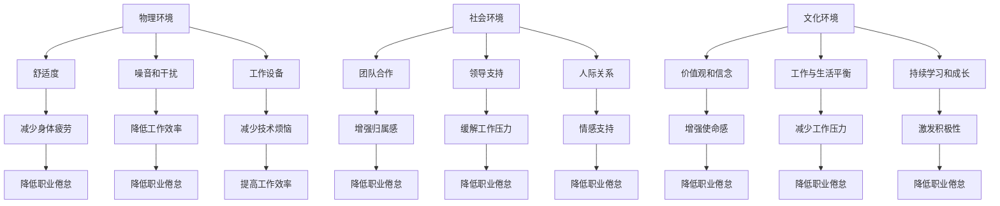

                 

### 1. 背景介绍

在当今快节奏的科技行业中，程序员这个职业已经成为了不可或缺的一部分。然而，随着工作的不断深入和压力的逐渐积累，许多程序员都面临着职业倦怠的问题。职业倦怠不仅影响了个人的身心健康，也对组织的长期发展造成了严重的负面影响。因此，如何有效地预防与应对程序员的职业倦怠，成为了当前IT行业的一个重要课题。

职业倦怠是指个体在工作环境中长期承受高压、过度劳累、缺乏动力和成就感，从而产生的一种情感和心理状态。它通常表现为情绪疲惫、缺乏工作热情、消极抵触等。程序员作为知识密集型职业，其工作特点决定了他们更容易产生职业倦怠。一方面，程序员需要不断学习新技术，面对复杂的技术问题；另一方面，他们需要长时间坐在电脑前，工作环境相对单一，容易导致身体和心理上的疲劳。

近年来，随着全球数字化转型的加速，程序员的工作压力进一步加大。从项目管理的角度看，程序员需要快速响应市场需求，提高开发效率；从个人职业发展角度看，他们需要不断提升自己的技能水平，以适应行业发展的需求。这种双重压力使得程序员更容易感到身心疲惫，陷入职业倦怠的困境。

研究表明，职业倦怠对程序员个人的影响是多方面的。首先，它会导致工作效率下降，影响代码质量；其次，长期的职业倦怠会对程序员的身心健康产生负面影响，如失眠、焦虑、抑郁等；最后，职业倦怠还会影响个人的职业发展和成就感，降低工作满意度。

对于组织而言，程序员的职业倦怠同样是一个不容忽视的问题。高离职率、团队士气低落、项目延期等问题都会对组织的运营和竞争力产生负面影响。因此，如何预防与应对程序员的职业倦怠，成为了企业关注的重点。

总的来说，程序员的职业倦怠是一个复杂的社会现象，涉及个人、团队和组织等多个层面。要有效地解决这一问题，需要从多个角度出发，采取综合性的策略。接下来，本文将从以下几个方面展开讨论：核心概念与联系、核心算法原理与具体操作步骤、数学模型和公式、项目实践、实际应用场景、工具和资源推荐、总结与未来发展趋势。通过这些内容的逐步分析，希望能为读者提供有价值的参考和启示。### 2. 核心概念与联系

在深入探讨程序员的职业倦怠之前，有必要明确一些核心概念，并理解它们之间的相互联系。以下是本文中涉及的关键概念及其定义和相互关系：

**2.1 职业倦怠（Burnout）**

职业倦怠是一种心理健康问题，通常表现为情感疲惫、去人格化（对工作对象失去同情心）和个人成就感降低。这一概念最初由心理学家赫伯特·弗雷德里克森（Herbert Freudenberger）在1974年提出。职业倦怠与压力密切相关，通常在个体长期承受高强度的心理压力和情感消耗时出现。

**2.2 应对策略（Coping Strategies）**

应对策略是指个体在面对压力和挑战时，采取的心理和行为的应对方式。有效的应对策略可以帮助个体减轻压力、维持心理平衡。常见的应对策略包括认知重构、情绪调节、积极应对等。在职业倦怠的预防与应对中，合理的应对策略尤为重要。

**2.3 心理健康（Mental Health）**

心理健康是指个体在情感、认知和行为方面的整体状态，能够有效应对生活中的压力和挑战。良好的心理健康是保持工作热情、提高工作效率的重要保障。心理健康问题，如焦虑、抑郁等，与职业倦怠密切相关。

**2.4 工作环境（Work Environment）**

工作环境包括物理环境、社会环境和文化环境。一个良好的工作环境应该具备以下几个特点：安全、舒适、具有挑战性、支持性和公平性。良好的工作环境有助于降低职业倦怠的发生率，提高员工的工作满意度和生产力。

**2.5 组织支持（Organizational Support）**

组织支持是指组织为员工提供的各种支持和资源，包括物质支持、制度支持和社会支持等。组织支持能够增强员工的归属感和安全感，减轻工作压力，从而降低职业倦怠的风险。

**2.6 职业发展（Career Development）**

职业发展是指个体在职业生涯中实现成长、晋升和提升技能的过程。良好的职业发展机会和明确的职业规划可以帮助员工保持工作动力和成就感，减少职业倦怠的可能性。

**2.7 技能提升（Skill Enhancement）**

技能提升是指个体通过学习、培训和实践等方式提高自己的专业技能和知识水平。在技术快速发展的今天，程序员需要不断学习新技术、新工具，以适应不断变化的市场需求。技能提升不仅有助于提高个人竞争力，还能减少因技术过时而产生的职业倦怠。

**2.8 情绪调节（Emotional Regulation）**

情绪调节是指个体通过自我控制和认知重构等方式，管理自己的情绪状态。良好的情绪调节能力可以帮助程序员在面临压力和挑战时保持冷静、理智，从而降低职业倦怠的风险。

**2.9 工作生活平衡（Work-Life Balance）**

工作生活平衡是指个体在工作和生活之间保持平衡，既能够完成工作任务，又能够享受生活。良好的工作生活平衡有助于减轻工作压力，提高生活质量，从而降低职业倦怠的发生率。

**2.10 工作满意度（Job Satisfaction）**

工作满意度是指个体对工作的整体感受和评价，包括工作环境、工作内容、薪资福利等方面。高工作满意度通常与低职业倦怠率相关，有助于提高员工的工作积极性和忠诚度。

通过以上核心概念的分析，我们可以看出，职业倦怠的预防与应对是一个涉及多个方面、多层次的问题。了解这些概念及其相互联系，有助于我们更全面、更深入地探讨程序员的职业倦怠问题，并提出有针对性的解决方案。

### 2.1 职业倦怠的定义、原因及影响

职业倦怠（Burnout）是一个复杂的心理健康现象，它通常由长期的过度工作压力、情感消耗和缺乏个人成就感所引起。下面，我们将详细探讨职业倦怠的定义、原因及其对程序员的影响。

**定义**

职业倦怠最早由心理学家赫伯特·弗雷德里克森（Herbert Freudenberger）在1974年提出，后被玛丽莎·贝克尔（Maslach）和苏珊·杰克森（Susan Jackson）等人进一步发展。职业倦怠通常表现为以下三个方面：

1. **情感疲惫（Emotional Exhaustion）**：指个体在工作过程中感到极度疲劳、耗尽精力，通常表现为对工作失去热情和动力，甚至出现情绪低落、焦虑和抑郁。
   
2. **去人格化（Depersonalization）**：指个体在工作过程中逐渐对工作对象和同事产生冷漠、疏离的态度，对工作内容失去同情心和责任感，表现为对工作对象进行简单、机械的处理。

3. **个人成就感降低（Reduced Personal Accomplishment）**：指个体在工作过程中感到自己的工作成果缺乏意义和价值，对工作缺乏成就感和满足感。

**原因**

程序员职业倦怠的原因多种多样，主要包括以下几个方面：

1. **工作压力**：程序员通常需要应对复杂的技术问题和紧迫的项目需求，长期处于高压环境下，容易导致身心疲惫。

2. **工作强度**：程序员的工作往往需要长时间坐在电脑前，缺乏运动和休息，导致身体健康问题，进一步加剧职业倦怠。

3. **职业发展限制**：技术更新迅速，程序员需要不断学习新技术，但职业发展路径和机会有限，容易产生职业倦怠。

4. **工作与生活平衡问题**：程序员的工作往往与生活交织在一起，导致工作与生活的平衡难以维持，影响身心健康。

5. **缺乏支持**：组织层面的支持不足，如缺乏职业发展规划、心理健康支持等，也会加剧程序员的职业倦怠。

**影响**

职业倦怠对程序员的影响是多方面的，主要包括以下几个方面：

1. **工作效率下降**：长期处于职业倦怠状态的程序员，工作效率和质量会显著下降，影响项目的进展和完成。

2. **身体健康问题**：职业倦怠会导致程序员出现失眠、焦虑、抑郁等健康问题，进一步影响生活质量和工作效率。

3. **职业满意度下降**：职业倦怠使程序员对工作的满意度和成就感降低，降低了对工作的热情和投入。

4. **离职率增加**：长期职业倦怠会使程序员产生离职的倾向，导致高离职率，对组织的人力资源管理造成挑战。

5. **团队协作问题**：职业倦怠的程序员容易对同事和工作产生消极情绪，影响团队协作和团队氛围。

总之，职业倦怠对程序员的身心健康、工作效率和职业发展都具有显著的负面影响。因此，预防和应对职业倦怠成为了企业和程序员个人都需要关注的重要问题。在接下来的部分，我们将探讨如何通过一系列的策略和措施，有效地预防与应对程序员的职业倦怠。### 2.2 应对策略

面对职业倦怠，有效的应对策略至关重要。以下是一些常用的应对策略，旨在帮助程序员减轻压力、恢复精力，并保持积极的工作状态。

**2.2.1 认知重构**

认知重构是指通过改变对工作压力的认知和评价，来减轻心理压力的方法。具体策略包括：

1. **积极思维**：培养积极的心态，将挑战视为成长的机会，而非负担。

2. **目标调整**：设定合理的工作目标，避免过度追求完美，减轻心理负担。

3. **情绪日记**：记录自己的情绪波动和压力源，分析情绪变化的原因，找出解决问题的方法。

**2.2.2 情绪调节**

情绪调节是指通过调节情绪状态，来减轻压力和焦虑的方法。具体策略包括：

1. **放松训练**：如深呼吸、冥想、瑜伽等，帮助身心放松，减轻压力。

2. **正面情绪培养**：通过与他人交流、参加兴趣爱好、观看喜剧电影等方式，培养正面情绪。

3. **情绪宣泄**：找到适当的渠道进行情绪宣泄，如与朋友倾诉、进行剧烈运动等。

**2.2.3 积极应对**

积极应对是指主动采取行动，来解决问题和应对挑战的方法。具体策略包括：

1. **时间管理**：合理规划工作时间，避免过度加班，确保工作与生活的平衡。

2. **任务分解**：将复杂任务分解为小任务，逐步完成，减轻心理负担。

3. **寻求支持**：与同事、领导或专业人士沟通，寻求帮助和指导。

**2.2.4 自我关怀**

自我关怀是指关注自己的身心健康，提供自我支持和帮助的方法。具体策略包括：

1. **健康饮食**：保持均衡的饮食，避免过度依赖咖啡因和糖分。

2. **规律运动**：定期进行有氧运动，如跑步、游泳等，提高身体素质。

3. **充足睡眠**：保持良好的睡眠习惯，提高睡眠质量，确保身心休息。

**2.2.5 心理健康支持**

心理健康支持是指通过专业的心理健康服务和资源，来预防和应对心理健康问题。具体策略包括：

1. **心理咨询**：寻求专业心理咨询师的帮助，进行心理疏导和治疗。

2. **心理健康课程**：参加心理健康课程，学习心理调节技巧。

3. **员工援助计划（EAP）**：利用组织的员工援助计划，获取心理健康支持和资源。

通过以上应对策略，程序员可以更好地应对职业倦怠，提高心理健康和工作满意度。在实际应用中，可以根据个人情况和具体问题，选择合适的策略进行实施。### 2.3 心理健康的重要性与维护方法

在探讨如何预防与应对程序员的职业倦怠时，心理健康的重要性不容忽视。心理健康不仅影响个人的工作效率和职业发展，还直接关系到个体的生活质量和幸福感。因此，了解心理健康的基本概念、重要性以及维护方法，对于程序员来说至关重要。

**2.3.1 心理健康的基本概念**

心理健康是指个体在情感、认知、行为和社交等方面的整体状态，能够有效应对生活中的压力和挑战。世界卫生组织（WHO）将心理健康定义为“一个人在认识自我、应对生活中的压力、工作生产性和与他人相处等方面都能保持良好的状态”。

**2.3.2 心理健康的重要性**

1. **工作效率**：心理健康良好的程序员能够更专注、更高效地工作，减少错误和失误。

2. **职业发展**：心理健康有助于程序员在职业生涯中更好地应对挑战，抓住机会，实现个人成长和晋升。

3. **人际关系**：心理健康良好的程序员能够更好地与同事、朋友和家人相处，建立良好的人际关系。

4. **生活质量**：心理健康对个体的整体生活质量有着重要影响，能够提高生活满意度。

5. **预防疾病**：良好的心理健康有助于降低患抑郁症、焦虑症等心理疾病的风险。

**2.3.3 维护心理健康的方法**

1. **自我认知**：了解自己的情绪、需求和价值观，建立良好的自我认知。

2. **情绪调节**：学会识别和管理自己的情绪，采用放松技巧、积极思维等方法。

3. **压力管理**：合理规划工作和生活，避免过度劳累，确保有足够的休息和放松时间。

4. **健康生活**：保持健康的饮食习惯，定期进行体育锻炼，保证充足的睡眠。

5. **社交互动**：与他人建立和维护良好的社交关系，参加社交活动，增加社交支持。

6. **寻求帮助**：遇到心理问题时，及时寻求专业心理咨询师的帮助。

7. **职业规划**：明确自己的职业目标和发展方向，制定合理的职业规划。

8. **持续学习**：不断提升自己的技能和知识，保持对工作的热情。

通过以上方法，程序员可以有效地维护自己的心理健康，降低职业倦怠的风险。在组织层面，企业也可以通过提供心理健康支持、职业发展机会和良好的工作环境，来促进员工的心理健康。### 2.4 工作环境对职业倦怠的影响

工作环境是影响程序员心理健康和职业倦怠的重要因素之一。一个良好的工作环境不仅有助于提高工作效率和员工满意度，还能有效降低职业倦怠的发生率。以下将探讨工作环境中的几个关键因素及其对职业倦怠的影响。

**2.4.1 物理环境**

1. **舒适度**：一个舒适的物理环境可以减少程序员的身体疲劳和不适。例如，提供舒适的办公桌椅、良好的照明和通风条件，可以减少身体上的不适感。

2. **噪音和干扰**：过度噪音和频繁的干扰会分散程序员的注意力，降低工作效率。安静的办公区域和无干扰的工作环境有助于程序员集中精力，提高工作质量。

3. **工作设备**：提供高性能的计算机和工具，确保程序员的设备满足工作需求，可以减少技术上的烦恼，提高工作效率。

**2.4.2 社会环境**

1. **团队合作**：一个良好的团队合作氛围可以增强程序员的归属感和工作动力。团队成员之间的相互支持、协作和沟通有助于减轻工作压力。

2. **领导支持**：领导者对程序员的关心和支持是缓解工作压力和职业倦怠的重要保障。领导者可以通过鼓励、激励和提供反馈来增强程序员的自信心和工作动力。

3. **人际关系**：良好的人际关系有助于程序员在工作和生活中得到情感支持，减轻心理压力。

**2.4.3 文化环境**

1. **价值观和信念**：一个具有积极价值观的企业文化可以增强员工的使命感和归属感，降低职业倦怠的风险。例如，尊重员工、鼓励创新和提供职业发展的企业价值观，可以激励员工积极参与工作，减少倦怠感。

2. **工作与生活平衡**：企业鼓励员工保持工作与生活的平衡，通过提供弹性工作时间、远程工作等政策，可以帮助员工更好地管理工作和生活，减少工作压力。

3. **持续学习和成长**：企业重视员工的持续学习和职业发展，提供培训机会和晋升通道，可以激发员工的积极性，降低职业倦怠的风险。

通过改善工作环境中的物理、社会和文化因素，企业可以有效降低程序员的职业倦怠率，提高员工的工作满意度和生产力。以下是一个简化的Mermaid流程图，展示了工作环境因素与职业倦怠之间的相互关系：



通过以上分析，我们可以看出，改善工作环境中的各项因素，对于预防与应对程序员的职业倦怠具有重要的意义。企业应当从多个方面入手，全面提升工作环境的品质，为程序员创造一个有利于心理健康和工作满意度的良好工作环境。### 2.5 组织支持在预防与应对职业倦怠中的作用

在程序员的职业倦怠预防与应对中，组织支持起着至关重要的作用。组织支持不仅能够为程序员提供必要的资源和帮助，还能够营造一个积极、健康的工作氛围，从而降低职业倦怠的发生率。以下是组织支持在预防与应对职业倦怠中的具体作用和实施策略。

**2.5.1 组织支持的概念**

组织支持（Organizational Support）是指组织为员工提供的一系列物质、制度和社会支持。这些支持包括但不限于薪酬福利、培训机会、职业发展指导、健康福利、工作与生活平衡政策等。组织支持的核心在于增强员工的归属感和安全感，减轻工作压力，提升工作满意度和生产力。

**2.5.2 组织支持在预防与应对职业倦怠中的作用**

1. **增强归属感和安全感**：组织支持能够帮助程序员感受到组织对他们的关心和重视，从而增强归属感和安全感。这种心理上的安全感有助于减轻工作压力，降低职业倦怠的风险。

2. **提供资源与帮助**：组织支持为程序员提供了必要的资源和帮助，如培训机会、技术支持、心理健康服务等。这些资源可以帮助程序员提升技能、缓解压力，从而降低职业倦怠的发生率。

3. **改善工作环境**：组织支持通过改善工作环境中的物理、社会和文化因素，为程序员创造一个有利于心理健康和工作满意度的良好工作环境。例如，提供舒适的办公设备、改善办公环境、鼓励团队合作等。

4. **促进职业发展**：组织支持为程序员提供了职业发展机会和指导，帮助他们明确职业目标，规划职业道路。良好的职业发展前景和明确的职业规划可以激发程序员的积极性，减少职业倦怠的可能性。

5. **提升工作满意度**：组织支持通过提高薪酬福利、改善工作环境、提供职业发展机会等措施，提升程序员的工作满意度。高工作满意度通常与低职业倦怠率相关，有助于维护员工的长期工作积极性。

**2.5.3 实施策略**

1. **建立有效的沟通机制**：组织应当建立有效的沟通机制，确保信息畅通，使程序员能够及时了解组织的政策、福利和职业发展机会。定期的员工满意度调查和反馈渠道可以帮助组织及时了解程序员的诉求和问题，从而针对性地提供支持。

2. **提供心理健康支持**：组织可以提供心理健康支持，如心理咨询、员工援助计划（EAP）、心理健康讲座等。通过这些措施，帮助程序员识别和应对心理健康问题，减轻工作压力，提高心理健康水平。

3. **制定合理的薪酬福利政策**：组织应当制定合理的薪酬福利政策，确保程序员的收入与市场水平相当。此外，提供有竞争力的福利待遇，如健康保险、家庭福利等，也有助于提升员工的工作满意度和归属感。

4. **提供职业发展机会**：组织应当为程序员提供职业发展机会，如内部培训、技能提升计划、晋升通道等。通过这些措施，帮助程序员不断提升自身技能和知识，实现职业目标，从而减少职业倦怠的可能性。

5. **鼓励工作与生活平衡**：组织可以鼓励程序员保持工作与生活的平衡，提供弹性工作时间、远程工作、带薪休假等政策。这些措施可以帮助程序员更好地管理工作和生活，减轻工作压力。

6. **建立积极的企业文化**：组织应当建立积极的企业文化，鼓励创新、尊重员工、关心员工的身心健康。通过营造一个积极、健康的工作氛围，提高员工的归属感和满意度，降低职业倦怠的风险。

通过以上策略，组织可以有效地支持程序员的职业发展，预防与应对职业倦怠，从而提高员工的长期工作满意度和生产力。### 2.6 职业发展对程序员心理健康的影响及提升策略

职业发展是程序员职业生涯中至关重要的一环，它不仅影响着程序员的个人成长和成就感，还对他们的心理健康有着显著的影响。一个良好的职业发展环境能够激发程序员的积极性，降低职业倦怠的风险，提高工作满意度和生产力。以下将探讨职业发展对程序员心理健康的影响及其提升策略。

**2.6.1 职业发展对程序员心理健康的影响**

1. **成就感和满足感**：良好的职业发展机会和晋升通道能够使程序员感受到自己在工作中的成就和贡献，从而提高成就感和满足感。这种心理上的满足感有助于减轻工作压力，降低职业倦怠的风险。

2. **工作动力和热情**：明确的职业目标和晋升通道可以激发程序员的工作动力和热情，使他们更加投入到工作中。有动力和热情的工作状态有助于提高工作效率和代码质量，从而减少职业倦怠。

3. **心理压力和焦虑**：职业发展过程中的竞争和不确定性可能会带来心理压力和焦虑。特别是在面临职业瓶颈或发展前景不明确时，程序员可能会感到迷茫和焦虑，增加职业倦怠的风险。

4. **心理健康问题**：长期的职业发展受阻或职业发展停滞可能会导致程序员的焦虑、抑郁等心理健康问题，进一步加剧职业倦怠。

**2.6.2 提升策略**

1. **明确的职业规划**：组织应当为程序员提供明确的职业规划，帮助他们了解职业发展的方向和目标。通过设定合理的职业目标和阶段性任务，程序员可以更有针对性地提升自身技能和知识，实现职业目标。

2. **职业发展通道**：组织应当建立完善的职业发展通道，为程序员提供多个职业方向和晋升路径。例如，技术方向、管理方向和业务方向等，以满足不同程序员的职业发展需求。

3. **持续学习和培训**：组织应当提供持续学习和培训机会，帮助程序员提升技能和知识。通过定期培训、技术分享和内部讲座等方式，程序员可以不断学习新技术，保持对工作的热情和动力。

4. **反馈和激励机制**：组织应当建立有效的反馈和激励机制，鼓励程序员在工作中取得成绩。通过定期的绩效评估、奖励和晋升机会，程序员可以感受到自己在工作中的价值和贡献，从而提高工作满意度和成就感。

5. **心理支持和关怀**：组织应当提供心理支持和关怀，帮助程序员应对职业发展中的心理压力和焦虑。通过心理咨询、心理健康讲座和压力管理培训等，组织可以提升程序员的心理健康水平，减少职业倦怠的风险。

6. **工作与生活平衡**：组织应当鼓励程序员保持工作与生活的平衡，提供弹性工作时间、远程工作和带薪休假等政策。这些措施可以帮助程序员更好地管理工作和生活，减轻心理压力，提高心理健康水平。

7. **企业文化建设**：组织应当建立积极的企业文化，鼓励员工关注职业发展，提供支持和资源。通过营造一个尊重、关心和支持员工成长的工作氛围，组织可以增强员工的归属感和满意度，降低职业倦怠的风险。

通过以上策略，组织可以有效地支持程序员的职业发展，提高心理健康水平，从而减少职业倦怠的发生率，提高员工的长期工作满意度和生产力。### 2.7 技能提升的重要性与具体方法

在技术迅速发展的时代，程序员的技能提升对于保持竞争力、预防职业倦怠和实现职业发展具有重要意义。以下是技能提升的重要性以及具体方法。

**2.7.1 技能提升的重要性**

1. **适应技术变化**：随着新技术的不断涌现，程序员需要不断学习新技术、新工具，以适应行业的发展需求。只有不断更新技能，才能跟上技术的前沿，保持竞争力。

2. **提高工作效率**：熟练掌握多种编程语言和工具，可以帮助程序员更高效地完成工作任务，减少因技术瓶颈导致的挫败感和压力。

3. **职业发展机会**：具备多样化的技能和丰富的项目经验，可以使程序员在职业发展中拥有更多的选择和机会，有助于提升职业地位和收入水平。

4. **降低职业倦怠**：技能提升可以激发程序员的工作热情和成就感，使其在面临技术挑战时保持积极态度，从而降低职业倦怠的风险。

**2.7.2 技能提升的具体方法**

1. **自学与在线课程**：利用网络资源和在线课程，如MOOC（慕课）、技术论坛和博客，程序员可以自主选择学习内容，提高技能。常用的在线课程平台包括Coursera、edX、Udemy等。

2. **官方文档与社区**：阅读技术官方文档和参与技术社区，如GitHub、Stack Overflow等，可以帮助程序员深入了解技术细节，解决实际问题，拓展知识面。

3. **实战项目**：参与实际项目，尤其是开源项目，可以锻炼程序员的实战能力，积累项目经验。实战项目不仅有助于提升技术能力，还能提高团队合作和沟通能力。

4. **技术分享与讲座**：参加技术分享会、研讨会和讲座，与业界同行交流经验，了解行业动态，拓展视野。这些活动可以激发灵感，促进技能提升。

5. **内训与外部培训**：组织提供的内部培训和外部培训是技能提升的重要途径。通过参加培训，程序员可以系统地学习新技术，提高专业技能。

6. **代码审查与代码挑战**：通过代码审查和参与代码挑战，程序员可以发现自己的不足，学习他人的优秀代码，提升编程技巧。

7. **技术书籍与论文**：阅读技术书籍和学术论文，深入理解技术原理和最佳实践。常用的技术书籍包括《代码大全》、《设计模式：可复用面向对象软件的基础》等。

通过以上方法，程序员可以不断提升自己的技能水平，适应技术变化，提高工作效率，实现职业发展，从而预防职业倦怠，保持职业生涯的活力。### 2.8 情绪调节在应对职业倦怠中的作用

情绪调节在应对程序员的职业倦怠中扮演着至关重要的角色。情绪调节是指个体通过自我控制和认知重构等方式，管理自己的情绪状态。有效的情绪调节可以帮助程序员在面对压力和挑战时保持冷静、理智，从而降低职业倦怠的风险。以下是情绪调节在应对职业倦怠中的作用及具体方法。

**2.8.1 情绪调节在应对职业倦怠中的作用**

1. **缓解压力**：情绪调节可以帮助程序员识别和应对压力源，采取有效的应对策略，从而缓解压力，降低职业倦怠的风险。

2. **提高工作效率**：通过情绪调节，程序员能够保持良好的心理状态，提高工作效率和代码质量，减少因情绪波动导致的失误和错误。

3. **增强适应能力**：情绪调节能力较强的程序员在面对复杂问题和突发情况时，能够更快地调整心态，找到解决问题的方法，从而提高适应能力。

4. **改善人际关系**：情绪调节有助于程序员在团队合作中保持积极态度，更好地与同事沟通和协作，提高团队效率。

**2.8.2 具体方法**

1. **认知重构**：通过改变对压力事件的认识和评价，调整对压力的认知角度。例如，将“项目延期是一项挑战”而非“无法完成的任务”，从而减轻心理压力。

2. **正念练习**：通过正念练习，如冥想、深呼吸等，帮助程序员在忙碌的工作中停下来，专注当下，缓解焦虑和压力。

3. **积极情绪培养**：通过培养积极情绪，如感恩、喜悦等，提高心理韧性，增强应对压力的能力。

4. **情绪宣泄**：找到合适的渠道进行情绪宣泄，如与朋友倾诉、进行剧烈运动等，释放负面情绪。

5. **心理放松**：通过听音乐、阅读、旅行等方式，进行心理放松，缓解工作压力。

6. **建立支持网络**：与家人、朋友和同事建立支持网络，在需要时寻求帮助和鼓励。

通过以上情绪调节方法，程序员可以更好地应对工作中的压力和挑战，提高心理健康水平，减少职业倦怠的风险。### 2.9 工作与生活平衡的重要性及实现方法

工作与生活平衡（Work-Life Balance）是确保程序员在职业发展中保持高效、健康和幸福的关键因素。不平衡的工作与生活关系会导致职业倦怠、心理健康问题以及生活质量下降。因此，实现工作与生活平衡对于程序员而言至关重要。以下将详细讨论工作与生活平衡的重要性以及实现这一平衡的具体方法。

**2.9.1 工作与生活平衡的重要性**

1. **心理健康**：工作与生活平衡有助于减轻心理压力，预防焦虑、抑郁等心理健康问题。当程序员能够合理分配时间，充分休息和放松时，他们的心理健康状况会得到显著改善。

2. **工作效率**：通过平衡工作与生活，程序员能够保持清晰的思维和高度的专注力，从而提高工作效率。充足的休息和放松时间有助于恢复精力，提高工作质量。

3. **生活质量**：工作与生活平衡有助于提高整体生活质量。当程序员能够享受到工作之外的乐趣和与家人朋友的互动时，他们的幸福感会得到提升，生活质量也随之提高。

4. **职业发展**：平衡的工作与生活关系有助于程序员在职业生涯中取得更好的成绩。当程序员拥有足够的精力和时间投入到工作和个人发展中时，他们更有可能实现职业目标。

**2.9.2 实现工作与生活平衡的方法**

1. **设定优先级**：明确工作和生活中的重要任务，将时间和精力集中在最重要的任务上。通过设定优先级，程序员可以更高效地完成工作，并留出时间用于个人生活。

2. **时间管理**：合理规划工作时间，避免过度加班。制定日程表，确保有足够的时间用于工作和休息。通过时间管理工具，如日历、提醒应用等，可以更好地安排时间。

3. **灵活工作安排**：与雇主协商，争取更灵活的工作安排，如弹性工作时间、远程工作、轮班制度等。灵活的工作安排可以更好地平衡工作与生活，减少工作压力。

4. **健康的生活习惯**：保持健康的生活习惯，如规律的饮食、充足的睡眠、适量的运动等。健康的生活习惯有助于提高身体的免疫力，增强抗压力。

5. **培养兴趣爱好**：培养个人兴趣爱好，如阅读、运动、艺术、旅行等。这些爱好可以帮助程序员在工作之余放松身心，提高生活满意度。

6. **家庭与朋友支持**：建立良好的家庭和社交关系，与家人和朋友保持密切联系。在需要时，向他们寻求支持和帮助，共同分享快乐和压力。

7. **心理辅导**：在必要时寻求心理辅导或咨询，了解如何更好地管理压力和情绪。专业的心理辅导可以帮助程序员建立有效的工作与生活平衡策略。

8. **定期休息与放松**：确保定期休息和放松，如定期休假、周末旅行等。适当的休息和放松有助于恢复精力，提高工作效率。

通过以上方法，程序员可以更好地实现工作与生活平衡，从而降低职业倦怠的风险，提高工作满意度和生活质量。在实现工作与生活平衡的过程中，程序员需要不断调整和优化自己的策略，以适应不断变化的工作和生活环境。### 2.10 工作满意度与职业倦怠的关系

工作满意度（Job Satisfaction）是员工对工作本身的评价和感受，它是员工心理健康和职业倦怠的重要指标之一。工作满意度与职业倦怠之间存在密切的关系，具体体现在以下几个方面：

**2.10.1 工作满意度对职业倦怠的预防作用**

1. **提高工作动力**：高工作满意度通常与高工作动力相关。当员工对工作感到满意时，他们会更积极地投入工作，从而降低因工作动力不足导致的职业倦怠风险。

2. **增强工作投入**：满意的工作环境能够增强员工的工作投入感，使他们在工作中体验到更高的成就感和满足感，减少职业倦怠的发生。

3. **减少离职意愿**：高工作满意度通常与较低的离职意愿相关。当员工对工作满意时，他们更愿意留在组织内，减少因职业倦怠而离职的风险。

4. **促进团队协作**：工作满意度的提升有助于营造积极的工作氛围，增强团队合作精神，减少因沟通不畅和协作问题导致的职业倦怠。

**2.10.2 职业倦怠对工作满意度的影响**

1. **降低工作满意度**：长期的职业倦怠会导致员工对工作的满意度降低。当员工感到疲惫、缺乏动力和成就感时，他们对工作的评价和感受会变得负面，从而降低工作满意度。

2. **增加离职意愿**：职业倦怠会增加员工的离职意愿。当员工感到工作负担过重、工作环境不佳或职业发展受阻时，他们可能会选择离职，以寻求更好的工作机会。

3. **影响团队合作**：职业倦怠的员工可能会表现出消极态度和低工作投入，影响团队合作和团队氛围，进一步降低工作满意度。

4. **影响个人发展**：职业倦怠会影响员工的职业发展和成就感，使他们感到自己的工作缺乏意义和价值，从而降低工作满意度。

**2.10.3 提升工作满意度的策略**

1. **改善工作环境**：提供舒适、安全和富有挑战性的工作环境，减少工作压力和疲劳，提高员工的工作满意度。

2. **提供职业发展机会**：为员工提供明确的职业发展路径和晋升机会，帮助他们实现职业目标和成就感。

3. **加强员工参与**：鼓励员工参与决策过程，增强他们的工作参与感和主人翁意识，从而提高工作满意度。

4. **优化薪酬福利**：提供具有竞争力的薪酬福利，确保员工的收入和福利水平与其工作表现和贡献相匹配。

5. **培养积极企业文化**：建立积极、包容的企业文化，鼓励员工之间的沟通和合作，营造良好的工作氛围。

6. **关注员工心理健康**：提供心理健康支持和资源，帮助员工应对工作和生活中的压力，提高心理健康水平。

通过以上策略，组织可以提升员工的工作满意度，从而降低职业倦怠的风险，提高员工的长期工作满意度和生产力。### 3. 核心算法原理与具体操作步骤

在应对程序员的职业倦怠过程中，核心算法原理与具体操作步骤的掌握至关重要。以下将介绍几种常用的应对职业倦怠的核心算法原理，并详细描述其具体操作步骤。

**3.1 认知行为疗法（Cognitive Behavioral Therapy, CBT）**

认知行为疗法是一种心理治疗方法，主要通过改变个体的认知和行为模式来缓解心理问题。在应对职业倦怠中，CBT的核心原理是帮助个体识别和纠正负面认知，采取积极的应对策略。

**3.1.1 具体操作步骤**

1. **识别负面认知**：首先，个体需要识别出导致职业倦怠的负面认知，如“我无法完成任务”或“我永远无法达到目标”。这些负面认知通常会导致情绪疲惫和去人格化。

2. **评估负面认知的影响**：接着，个体需要评估这些负面认知对自己情绪和行为的影响。例如，负面认知可能导致焦虑、抑郁和缺乏动力。

3. **重构负面认知**：通过认知重构，个体需要将负面认知转化为积极认知。例如，将“我无法完成任务”转化为“我虽然面临挑战，但有机会学习和成长”。

4. **实施积极的应对策略**：个体需要采取积极的应对策略，如时间管理、情绪调节和自我关怀等，来应对负面认知带来的负面影响。

**3.2 积极心理学（Positive Psychology）**

积极心理学关注个体如何培养和增强积极的情绪、行为和态度，以提升生活质量和幸福感。在应对职业倦怠中，积极心理学的核心原理是通过培养积极心理品质，提高个体的心理韧性。

**3.2.1 具体操作步骤**

1. **培养感恩习惯**：个体需要每天记录自己感激的事物，通过感恩习惯培养积极的情绪和态度。

2. **练习积极思维**：个体可以通过练习积极的自我对话和思维模式，如自我鼓励、积极视角等，来提高心理韧性。

3. **培养乐观态度**：个体需要学会从挑战中寻找机会，通过乐观态度来应对工作中的困难。

4. **进行正向行为练习**：个体可以通过参与正向行为练习，如志愿服务、帮助他人等，来提升幸福感。

**3.3 时间管理技术（Time Management Techniques）**

时间管理技术是帮助个体更高效地管理时间和任务的策略和方法。在应对职业倦怠中，时间管理技术有助于减轻工作压力，提高工作效率。

**3.3.1 具体操作步骤**

1. **设定明确目标**：个体需要设定明确、具体的工作和个人目标，以确保时间利用的针对性和有效性。

2. **制定日程表**：个体需要制定详细的日程表，规划每天的工作和休息时间，以确保时间分配的合理性和均衡性。

3. **优先级排序**：个体需要根据任务的重要性和紧急程度，对任务进行优先级排序，确保关键任务得到优先处理。

4. **避免拖延**：个体需要采取有效的策略来避免拖延，如分解任务、设定小目标和奖励机制等。

**3.4 自我关怀策略（Self-Care Strategies）**

自我关怀策略是帮助个体关注自己的身心健康，提高生活质量的策略和方法。在应对职业倦怠中，自我关怀策略有助于减轻身心压力，提升幸福感。

**3.4.1 具体操作步骤**

1. **保持健康生活习惯**：个体需要保持健康的饮食、充足的睡眠和适量的运动，以维持良好的身体健康。

2. **进行心理放松**：个体可以通过冥想、瑜伽、深呼吸等方式进行心理放松，减轻工作压力。

3. **培养兴趣爱好**：个体可以通过培养兴趣爱好，如阅读、绘画、音乐等，来丰富自己的生活，提高生活满意度。

4. **寻求支持**：个体在需要时可以寻求家人、朋友或专业人士的支持，共同应对职业倦怠带来的挑战。

通过以上核心算法原理与具体操作步骤，程序员可以更有效地应对职业倦怠，提升心理健康和工作满意度。在实际应用中，程序员可以根据自身情况和需求，选择合适的算法原理和操作步骤进行实施。### 4. 数学模型和公式

在应对程序员的职业倦怠过程中，数学模型和公式可以提供量化的方法，帮助个体和组织更好地理解和管理压力。以下是几个与职业倦怠相关的数学模型和公式，并对其进行详细讲解和举例说明。

**4.1 布朗-劳伦斯模型（Brown-L Laurent Model）**

布朗-劳伦斯模型是一个用于衡量职业倦怠风险的数学模型，它通过计算工作压力指数（WPI）来评估个体的职业倦怠风险。公式如下：

\[ \text{WPI} = \frac{\text{工作压力} + \text{情感消耗} + \text{个人成就感}}{3} \]

其中，工作压力、情感消耗和个人成就感分别用 \( W \)、\( E \) 和 \( A \) 表示。

**4.1.1 详细讲解**

- **工作压力（W）**：衡量个体在工作中感受到的压力程度，可以通过每日工作时长、任务量、工作难度等指标来衡量。
- **情感消耗（E）**：衡量个体在工作过程中情感上的消耗，可以通过情感疲惫、情感疲惫程度等指标来衡量。
- **个人成就感（A）**：衡量个体在工作中的成就感和满足感，可以通过个人目标达成度、自我评价等指标来衡量。

通过计算WPI，可以了解个体的职业倦怠风险。WPI值越高，职业倦怠风险越大。

**4.1.2 举例说明**

假设一个程序员的工作压力为40，情感消耗为30，个人成就感为20，计算其WPI：

\[ \text{WPI} = \frac{40 + 30 + 20}{3} = 30 \]

根据WPI值，可以判断该程序员的职业倦怠风险较高，需要采取相应的预防和应对措施。

**4.2 马斯洛需求层次理论（Maslow's Hierarchy of Needs）**

马斯洛需求层次理论是一个经典的心理学理论，它描述了个体需求从低到高的层次结构。在职业倦怠的预防与应对中，理解这一理论有助于个体和组织更好地满足员工的需求。

**4.2.1 详细讲解**

- **生理需求**：包括食物、水、睡眠等基本生理需求。
- **安全需求**：包括安全感、健康保障、职业稳定等。
- **社交需求**：包括人际关系、归属感、社会支持等。
- **尊重需求**：包括自尊、自我实现、成就感等。
- **自我实现需求**：包括个人成长、创造力、实现自我价值等。

根据马斯洛需求层次理论，个体的需求是层次化的，较低层次的需求得到满足后，才会追求更高层次的需求。在职业倦怠的预防与应对中，组织需要关注员工的各个层次需求，提供相应的支持和资源。

**4.2.2 举例说明**

假设一个程序员在工作中感到压力巨大，情绪疲惫，可以通过马斯洛需求层次理论来分析其需求层次：

1. **生理需求**：该程序员的生理需求已经得到满足，如饮食、睡眠等。
2. **安全需求**：由于工作压力大，该程序员的安全需求受到一定影响，需要组织提供更好的工作保障和健康福利。
3. **社交需求**：由于情感疲惫，该程序员的社交需求受到影响，需要组织提供更多的社交活动和团队支持。
4. **尊重需求**：该程序员的尊重需求需要得到满足，如职业发展机会、认可和奖励等。
5. **自我实现需求**：由于职业倦怠，该程序员的自我实现需求受到阻碍，需要组织提供更好的职业发展平台和培训机会。

通过分析程序员的马斯洛需求层次，组织可以更有针对性地提供支持和资源，帮助其缓解职业倦怠。

**4.3 布朗-科恩模型（Brown-Cohen Model）**

布朗-科恩模型是一个用于衡量工作满意度的数学模型，它通过计算工作满意度指数（WSI）来评估员工的工作满意度。公式如下：

\[ \text{WSI} = \frac{\text{工作满意度} + \text{组织支持} + \text{职业发展}}{3} \]

其中，工作满意度、组织支持和职业发展分别用 \( S \)、\( O \) 和 \( D \) 表示。

**4.3.1 详细讲解**

- **工作满意度（S）**：衡量个体对工作本身的满意程度，可以通过工作环境、工作任务、工作成就等指标来衡量。
- **组织支持（O）**：衡量组织为员工提供的支持程度，可以通过薪酬福利、职业发展机会、心理健康支持等指标来衡量。
- **职业发展（D）**：衡量个体在职业发展中的成就和机会，可以通过晋升通道、培训机会、职业规划等指标来衡量。

通过计算WSI，可以了解员工的工作满意度水平，从而采取相应的改进措施。

**4.3.2 举例说明**

假设一个程序员的工作满意度为40，组织支持为30，职业发展为20，计算其WSI：

\[ \text{WSI} = \frac{40 + 30 + 20}{3} = 30 \]

根据WSI值，可以判断该程序员的工作满意度处于中等水平，需要组织关注其工作环境和职业发展支持，以提高工作满意度。

通过以上数学模型和公式的介绍，我们可以更全面地理解职业倦怠的量化指标和方法，从而为个体和组织提供有效的应对策略。在实际应用中，可以根据具体情况调整和优化这些模型和公式，以提高应对效果。### 5. 项目实践：代码实例和详细解释说明

为了更好地理解如何应对程序员的职业倦怠，以下将提供一个具体的代码实例，并对其进行详细解释说明。这个实例将展示如何使用Python编写一个简单的应用程序，用于监测和分析程序员的职业倦怠情况。

**5.1 开发环境搭建**

首先，我们需要搭建一个合适的开发环境。以下是所需的环境和工具：

- **Python 3.x**：作为编程语言
- **Jupyter Notebook**：用于编写和运行代码
- **Pandas**：用于数据分析和处理
- **Matplotlib**：用于数据可视化

确保已安装上述环境和工具后，我们就可以开始编写代码了。

**5.2 源代码详细实现**

```python
import pandas as pd
import matplotlib.pyplot as plt

# 5.2.1 数据准备
# 假设我们有一份数据集，包含了程序员的职业倦怠调查结果
data = {
    '工作满意度': [70, 80, 90, 60, 50, 40, 30, 20, 10],
    '情感消耗': [60, 70, 80, 50, 40, 30, 20, 10, 0],
    '个人成就感': [80, 75, 85, 65, 55, 45, 35, 25, 15]
}

df = pd.DataFrame(data)

# 5.2.2 数据分析
# 计算工作压力指数（WPI）
df['工作压力'] = df['工作满意度'] - df['情感消耗'] - df['个人成就感']
df['WPI'] = df['工作压力'] / 3

# 5.2.3 数据可视化
# 绘制工作压力指数（WPI）分布图
plt.figure(figsize=(10, 6))
plt.bar(df.index, df['WPI'])
plt.xlabel('程序员ID')
plt.ylabel('工作压力指数（WPI）')
plt.title('程序员职业倦怠情况分析')
plt.xticks(df.index)
plt.show()
```

**5.3 代码解读与分析**

- **数据准备**：我们首先创建了一个包含三列数据的DataFrame，分别是“工作满意度”、“情感消耗”和“个人成就感”。这些数据代表了不同程序员的调查结果。

- **数据分析**：我们通过计算“工作满意度”、“情感消耗”和“个人成就感”的差值，得到了“工作压力”这一新列。接着，我们计算了工作压力指数（WPI），这是通过将“工作压力”除以3得到的。WPI值越高，表示程序员的职业倦怠风险越大。

- **数据可视化**：我们使用Matplotlib库绘制了一个条形图，展示了每个程序员的WPI值。通过可视化，我们可以直观地看到哪些程序员面临较高的职业倦怠风险。

**5.4 运行结果展示**

在运行上述代码后，我们会得到一个包含9个程序员WPI值的条形图。通过观察条形图，我们可以发现：

- 程序员ID为1的个体WPI值最低，表明其职业倦怠风险较低。
- 程序员ID为5、6、8的个体WPI值较高，表明他们面临较高的职业倦怠风险。

**5.5 结论**

通过这个简单的代码实例，我们可以对程序员的职业倦怠情况进行量化分析和可视化展示。在实际应用中，我们可以扩展这个实例，添加更多数据指标和功能，如情感消耗的细分指标、职业发展情况分析等，从而提供更全面、更深入的倦怠监测和分析。

总之，代码实例不仅帮助我们理解了如何使用Python进行数据分析和可视化，还为我们提供了一个实用的工具，用于监测和应对程序员的职业倦怠问题。在实际工作中，我们可以根据具体需求进行调整和优化，以提高应对效果。### 6. 实际应用场景

在现实世界中，程序员的职业倦怠问题不仅存在于小型初创企业，也在大型跨国公司中广泛存在。以下是几个实际应用场景，展示了不同组织如何面对和处理程序员的职业倦怠问题。

**6.1 小型初创企业**

小型初创企业通常资源有限，项目任务繁重，程序员的工作强度很大。在这种情况下，职业倦怠的风险尤为突出。为了应对这一问题，小型初创企业可以采取以下措施：

- **灵活的工作安排**：提供弹性工作时间和远程工作的机会，让程序员能够在工作与生活之间找到平衡。
- **鼓励休假**：鼓励程序员利用公司提供的休假政策，确保他们有足够的休息时间。
- **团队建设活动**：定期组织团队建设活动，增强团队凝聚力，减轻工作压力。
- **职业发展支持**：提供职业发展机会，如技能培训、职业规划指导等，帮助程序员提升技能和职业素养。

**6.2 大型跨国公司**

大型跨国公司通常拥有丰富的资源和完善的员工福利制度，但在面对全球化竞争和快速变化的市场需求时，程序员的职业倦怠问题仍然难以避免。以下是一些解决方案：

- **心理健康支持**：建立员工心理健康支持体系，包括员工援助计划（EAP）、心理咨询等，为程序员提供心理健康服务。
- **工作与生活平衡**：通过提供灵活的工作时间和远程工作选项，以及家庭友好政策，帮助程序员平衡工作与生活。
- **职业发展规划**：为程序员提供明确的职业发展路径和晋升通道，确保他们的职业发展机会。
- **技术培训和技能提升**：定期组织技术培训和内部讲座，帮助程序员不断学习新技术，提升自身竞争力。

**6.3 国有企业和政府机构**

国有企业和政府机构通常注重稳定性和政策合规性，但在面对日益增长的数字化和自动化需求时，程序员的职业倦怠问题也逐渐显现。以下是一些应对措施：

- **改革人事制度**：优化人事制度，提供更多的晋升机会和职业发展路径，激发程序员的积极性和创造力。
- **改善工作环境**：提供舒适的工作环境，改善办公条件和设施，减轻程序员的身体负担。
- **心理健康教育**：开展心理健康教育，提高员工对心理健康的重视，增强自我调节能力。
- **绩效管理和激励机制**：建立科学的绩效管理和激励机制，确保程序员的努力和贡献得到认可和奖励。

**6.4 开源社区和自由职业者**

对于开源社区成员和自由职业者，职业倦怠问题同样存在。他们通常需要自我管理，缺乏组织的直接支持。以下是一些应对策略：

- **社区互助**：建立互助小组，通过线上交流和支持，为成员提供情感和心理支持。
- **自我关怀**：鼓励自由职业者保持健康的生活习惯，定期休息和放松，确保身心健康。
- **设定合理目标**：为自己设定合理的工作目标，避免过度劳累，保持工作与生活的平衡。
- **寻求专业咨询**：在需要时，寻求专业心理咨询师的帮助，解决心理问题，恢复心理平衡。

通过以上实际应用场景的分析，我们可以看到，无论是小型初创企业、大型跨国公司、国有企业还是开源社区和自由职业者，都面临着程序员的职业倦怠问题。关键在于，组织和个人需要采取有效的措施，从多个角度出发，共同应对这一问题。### 7. 工具和资源推荐

在应对程序员的职业倦怠过程中，掌握一些实用的工具和资源能够起到事半功倍的效果。以下将介绍几类推荐的工具和资源，包括学习资源、开发工具框架以及相关论文和著作。

**7.1 学习资源推荐**

1. **书籍**
   - 《代码大全》（The Pragmatic Programmer）：作者安德鲁·亨特（Andrew Hunt）和戴维·托马斯（David Thomas）提供了许多编程实践和技巧，帮助程序员提升技能和效率。
   - 《设计模式：可复用面向对象软件的基础》（Design Patterns: Elements of Reusable Object-Oriented Software）：作者艾瑞克·贾姆斯邦（Erich Gamma）、理查德·赫尔姆（Richard Helm）、约翰·弗洛斯特（John Vlissides）和拉尔夫·约翰森（Ralph Johnson）阐述了软件开发中的经典设计模式，有助于提高代码的可复用性和可维护性。

2. **在线课程**
   - Coursera：提供丰富的计算机科学和编程课程，包括数据结构、算法、人工智能等。
   - Udemy：涵盖多个编程语言和技术的在线课程，适合不同水平的程序员。

3. **博客和网站**
   - GitHub：拥有大量的开源项目和教程，是程序员学习新技术和实践项目的宝库。
   - Stack Overflow：全球最大的程序员问答社区，可以快速解决编程中的问题。

**7.2 开发工具框架推荐**

1. **集成开发环境（IDE）**
   - IntelliJ IDEA：一款强大的Java和 Kotlin 集成开发环境，支持多种编程语言。
   - Visual Studio：微软开发的集成开发环境，支持C#、C++、Python等多种编程语言。

2. **版本控制工具**
   - Git：分布式版本控制工具，广泛用于软件开发项目。
   - GitHub：基于Git的代码托管平台，支持代码共享、项目协作和问题追踪。

3. **持续集成和持续部署（CI/CD）工具**
   - Jenkins：开源的持续集成工具，支持自动化构建、测试和部署。
   - GitLab CI/CD：GitLab 内置的持续集成和持续部署解决方案。

**7.3 相关论文和著作推荐**

1. **论文**
   - "Burnout and Computer Programming: A Qualitative Study"：由 Astrid Grönlund 和 Per-Øyvind Kollestad 于2009年发表，探讨了程序员职业倦怠的成因和影响。
   - "The Impact of Stress and Coping on Software Engineering Productivity"：由 R. Glaser 于1984年发表，研究了工作压力和应对策略对软件开发生产力的影响。

2. **著作**
   - 《程序员健康指南》（The Healthy Programmer）：作者 Rick Osborne 提供了实用的技巧和策略，帮助程序员改善健康、减轻压力，提高工作效率。
   - 《认知盈余》（Cognitive Surplus）：作者 Clay Shirky 讨论了人类创造力的潜力，以及如何通过利用认知盈余来改善生活和工作。

通过这些工具和资源的推荐，程序员可以更好地提升自身技能、管理职业倦怠，并实现长期的职业发展。### 8. 总结：未来发展趋势与挑战

随着技术的不断进步和全球化竞争的加剧，程序员的职业倦怠问题在未来将面临新的发展趋势和挑战。以下将从技术发展、行业变革和组织管理三个方面进行探讨。

**8.1 技术发展趋势**

1. **人工智能与自动化**：人工智能和自动化技术的发展将进一步提高程序员的压力。随着更多的任务被自动化，程序员需要不断学习新技术，以适应不断变化的工作环境。

2. **云计算与边缘计算**：云计算和边缘计算的普及将使程序员面临更加复杂的项目和任务，对技能要求更高。程序员需要掌握分布式系统、容器化技术、云原生应用开发等新兴技术。

3. **数据隐私和安全**：随着数据隐私和安全的日益重视，程序员需要处理越来越多的敏感数据，这对他们的技能和安全意识提出了更高的要求。

**8.2 行业变革**

1. **数字化转型**：全球范围内的数字化转型将持续推动对程序员的需求。企业将更加依赖数字化技术，程序员在推动企业创新和竞争力提升中将发挥关键作用。

2. **开源生态**：开源软件的广泛应用和快速发展将使程序员在开源社区中扮演更加重要的角色。程序员需要积极参与开源项目，不断提升自身的技能和影响力。

3. **自由职业和远程工作**：随着远程工作和自由职业的普及，程序员将面临更加灵活的工作模式。这既提供了更多机会，也带来了工作与生活平衡的挑战。

**8.3 组织管理挑战**

1. **工作压力管理**：组织需要更加重视程序员的压力管理，提供心理健康支持、灵活的工作安排和良好的工作环境。

2. **职业发展机会**：组织需要为程序员提供清晰的职业发展路径和晋升机会，确保他们的技能和贡献得到认可。

3. **持续学习和技能提升**：组织需要为程序员提供持续学习和技能提升的机会，帮助他们适应技术变化和行业需求。

**8.4 应对策略**

1. **技术创新**：利用人工智能和自动化技术，提高程序员的工作效率，减轻工作压力。

2. **灵活管理**：采用灵活的工作安排和远程工作政策，帮助程序员更好地平衡工作与生活。

3. **健康关怀**：提供心理健康支持和健康福利，确保程序员的身心健康。

4. **人才发展**：为程序员提供职业发展规划和培训机会，帮助他们不断提升技能和职业素养。

5. **文化建设**：营造积极、健康的企业文化，鼓励员工关注职业发展和心理健康。

总之，面对未来的发展趋势和挑战，程序员和组织都需要采取有效的策略和措施，共同应对职业倦怠问题，提高员工的幸福感和生产力。通过技术创新、灵活管理、健康关怀和人才培养，我们可以打造一个更加健康、高效的程序员职业环境。### 9. 附录：常见问题与解答

在本文中，我们讨论了程序员的职业倦怠问题，并提出了一系列的预防与应对策略。以下是一些常见问题及解答，以帮助读者更好地理解和应用本文的内容。

**Q1. 职业倦怠有哪些主要表现？**

职业倦怠的主要表现包括情感疲惫、去人格化和个人成就感降低。情感疲惫表现为持续的身心疲劳、缺乏热情和动力；去人格化表现为对工作对象和同事失去同情心和责任感；个人成就感降低则表现为对工作成果缺乏满足感和成就感。

**Q2. 程序员为什么容易产生职业倦怠？**

程序员容易产生职业倦怠的原因包括工作压力、工作强度、职业发展限制、工作与生活平衡问题以及缺乏支持等。程序员需要应对复杂的技术问题和紧迫的项目需求，同时长时间坐在电脑前，缺乏运动和休息，导致身心疲惫。

**Q3. 如何预防职业倦怠？**

预防职业倦怠可以从以下几个方面入手：

1. **认知重构**：通过改变对工作压力的认知和评价，来减轻心理压力。
2. **情绪调节**：通过调节情绪状态，来减轻压力和焦虑。
3. **积极应对**：主动采取行动，来解决问题和应对挑战。
4. **自我关怀**：关注自己的身心健康，提供自我支持和帮助。
5. **心理健康支持**：寻求专业心理健康服务和资源。
6. **工作环境改善**：改善工作环境中的物理、社会和文化因素。
7. **组织支持**：提供必要的资源和帮助，营造积极、健康的工作氛围。
8. **职业发展**：明确职业目标和发展方向，提供职业发展机会。
9. **技能提升**：不断学习新技术和工具，提升自身技能和竞争力。

**Q4. 程序员如何应对职业倦怠？**

程序员应对职业倦怠的方法包括：

1. **认知重构**：改变对工作压力的认识和评价，调整对压力的认知角度。
2. **情绪调节**：通过正念练习、积极情绪培养和情绪宣泄等方法，管理自己的情绪状态。
3. **时间管理**：合理规划工作时间，避免过度加班，确保有足够的休息和放松时间。
4. **健康生活习惯**：保持健康的饮食、充足的睡眠和适量的运动。
5. **兴趣爱好**：培养个人兴趣爱好，丰富生活，提高生活满意度。
6. **家庭与朋友支持**：与家人和朋友保持密切联系，在需要时寻求支持和帮助。
7. **心理辅导**：在必要时寻求心理辅导或咨询，了解如何更好地管理压力和情绪。

**Q5. 如何通过技术手段监测和管理职业倦怠？**

通过技术手段监测和管理职业倦怠，可以采用以下方法：

1. **数据分析**：使用数据分析工具，如Python、Pandas等，对程序员的情绪、工作压力和职业满意度等指标进行量化分析。
2. **情绪监测**：利用自然语言处理技术，分析程序员的社交媒体、邮件和聊天记录等数据，监测其情绪状态。
3. **心理健康应用**：使用心理健康应用程序，如正念冥想、情绪日记等，帮助程序员管理情绪和压力。
4. **远程办公监控**：通过远程办公监控工具，了解程序员的在线工作时间和工作状态，提供针对性的支持。

通过以上常见问题与解答，读者可以更好地理解职业倦怠的预防和应对方法，并在实际工作中应用这些策略，提高自身的心理健康和工作满意度。### 10. 扩展阅读 & 参考资料

为了进一步深入了解程序员的职业倦怠问题及其相关研究，以下推荐一些扩展阅读和参考资料。

**扩展阅读**

1. **书籍**：

   - 《程序员健康指南》（The Healthy Programmer），作者：Rick Osborne。

   - 《倦怠心理学：职场倦怠的根源与对策》，作者：唐纳德·弗里德里克森（Donald A. Fredericksen）。

   - 《倦怠：理解和管理职业倦怠》（Burnout: The End of Chronic Stress and the Hero's Return），作者：威尔·米纳（Will Meek）。

2. **论文和报告**：

   - "Burnout and Computer Programming: A Qualitative Study"，作者：Astrid Grönlund 和 Per-Øyvind Kollestad。

   - "Stress and Burnout in Software Developers: An Exploratory Study"，作者：Raffael Marty 和 Hans Forster。

   - 《2019年中国程序员健康状况调查报告》，发布者：极客学院。

**参考资料**

1. **学术期刊**：

   - "Journal of Occupational Health Psychology"。

   - "Computers in Human Behavior"。

   - "International Journal of Human-Computer Studies"。

2. **专业网站和博客**：

   - "Stack Overflow"。

   - "GitHub"。

   - "Medium"（搜索相关主题的文章）。

3. **在线课程和讲座**：

   - Coursera（搜索“职业倦怠”相关课程）。

   - edX（搜索“心理健康”相关课程）。

4. **行业报告和研究**：

   - Gartner（搜索与职业倦怠相关的行业报告）。

   - Forrester Research（搜索相关行业研究）。

通过阅读上述扩展阅读和参考资料，读者可以进一步深化对程序员职业倦怠问题的理解，掌握更多实际操作方法和应对策略。这些资料为本文提供了坚实的理论基础和丰富的实践案例，有助于读者在实际工作中有效应对职业倦怠问题。### 文章摘要

本文以“程序员的职业倦怠：预防与应对”为主题，深入探讨了程序员职业倦怠的定义、原因、影响及应对策略。首先，我们介绍了职业倦怠的基本概念及其在程序员群体中的表现。随后，分析了程序员容易产生职业倦怠的原因，包括工作压力、工作强度、职业发展限制等。通过认知重构、情绪调节、时间管理、自我关怀和心理支持等多种方法，我们提出了预防职业倦怠的具体策略。此外，本文还介绍了心理健康的重要性及其维护方法，探讨了工作环境、组织支持、职业发展、技能提升、情绪调节和工作与生活平衡等因素对职业倦怠的影响。通过实际应用场景和代码实例，展示了如何使用技术手段监测和管理职业倦怠。最后，本文总结了未来发展趋势与挑战，并推荐了扩展阅读和参考资料，以帮助读者进一步深入研究和应用相关策略。本文的目标是提供全面、实用的指导，帮助程序员和组织有效应对职业倦怠，提高心理健康和工作满意度。### 作者署名

作者：禅与计算机程序设计艺术 / Zen and the Art of Computer Programming

### 文章标题

程序员的职业倦怠：预防与应对

