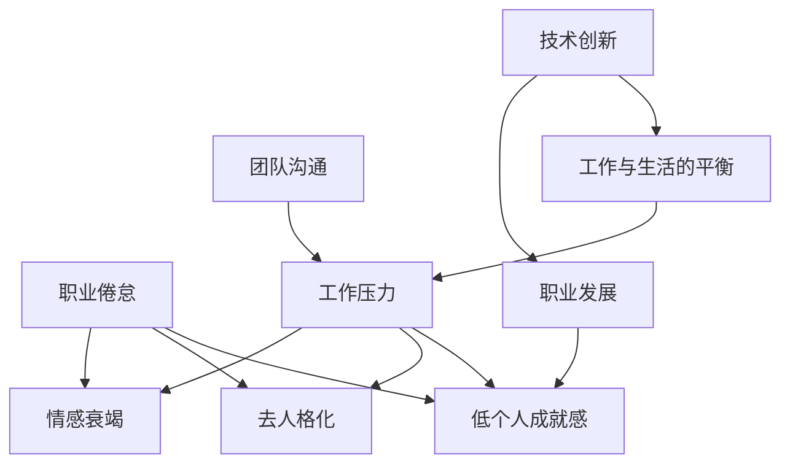
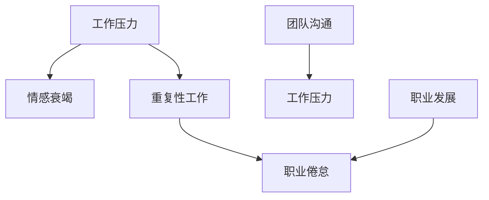

                 

### 背景介绍

程序员的职业倦怠（Burnout）是指程序员在长时间从事高度专业化的工作过程中，逐渐感受到身心疲惫、职业倦怠，进而导致工作效率低下、创新能力减弱，严重时甚至会影响到个人生活和健康。这种现象不仅影响了程序员个人的职业发展，也对整个技术行业的发展产生了不利影响。

程序员职业倦怠的现状不容乐观。根据全球知名调研机构Gartner的统计，超过50%的程序员在工作中经历过不同程度的职业倦怠。美国心理学会（APA）发布的一项调查显示，程序员的职业倦怠程度位居所有职业的第二位。这些数据表明，程序员面临职业倦怠的风险较高，需要引起全社会的高度关注。

程序员职业倦怠的主要因素包括以下几个方面：

1. **工作压力**：程序员在工作中需要面对不断变化的技术需求和市场压力，经常需要加班、应对紧急任务，导致身心负担加重。
2. **重复性工作**：许多程序员的工作内容较为单一，缺乏创新和挑战性，容易产生厌倦感。
3. **团队沟通障碍**：程序员在团队协作中可能会遇到沟通不畅的问题，导致工作进度受阻，进一步加重职业倦怠。
4. **职业发展局限**：一些程序员在职业生涯中可能会遇到发展瓶颈，感觉无法实现个人价值，从而产生职业倦怠。

职业倦怠对程序员的工作和生活产生了深远的影响。首先，职业倦怠降低了程序员的工作效率，影响了项目的进度和质量。其次，长期处于职业倦怠状态可能导致程序员的健康状况恶化，增加患病风险。最后，职业倦怠还可能对程序员的个人生活造成负面影响，如家庭关系紧张、社交活动减少等。

因此，预防和应对程序员的职业倦怠已经成为一个亟待解决的问题。本文将深入探讨程序员职业倦怠的原因、症状、预防和应对策略，以及未来可能的发展趋势。希望通过这篇文章，能够帮助程序员们更好地应对职业倦怠，提高工作质量和生活满意度。

### 核心概念与联系

在深入探讨程序员职业倦怠之前，我们首先需要明确几个核心概念，并了解它们之间的联系。以下是几个关键概念及其相互关系的详细说明：

#### 1. 职业倦怠（Burnout）

职业倦怠是一种心理现象，表现为个体在长时间的工作压力下，逐渐出现情感衰竭、去人格化（对工作对象冷漠）和低个人成就感。这三个症状共同构成了职业倦怠的典型特征。

- **情感衰竭**：指个体在工作和生活中的情感资源耗尽，表现为精力不足、易怒、失眠等。
- **去人格化**：指个体在工作过程中对工作对象表现出冷漠、缺乏同情心，常常以刻板的方式对待工作对象。
- **低个人成就感**：指个体对自己工作的价值和成就感降低，感觉自己无法实现个人价值。

#### 2. 工作压力（Work Pressure）

工作压力是指个体在工作中感受到的负担和挑战，这些负担和挑战可能来源于工作任务的复杂性、紧迫性、不确定性以及工作量等。

- **任务复杂性**：任务越复杂，程序员需要花费的时间和精力越多，工作压力也就越大。
- **任务紧迫性**：紧急任务往往要求程序员在短时间内完成，增加了工作压力。
- **工作量**：工作量的增加往往会导致程序员需要加班，从而加重工作压力。

#### 3. 团队沟通（Team Communication）

团队沟通是指团队成员之间通过信息交流、协作解决问题、共享资源等过程，以实现共同目标的过程。

- **沟通不畅**：团队沟通不畅会导致任务进度受阻，程序员需要额外的时间和精力去解决沟通问题，从而增加工作压力。
- **团队协作**：良好的团队协作可以提高工作效率，减轻工作压力。

#### 4. 职业发展（Career Development）

职业发展是指个体在职业生涯中通过学习、成长、晋升等过程，实现个人价值和职业目标。

- **发展瓶颈**：当程序员在职业生涯中遇到发展瓶颈时，可能会感到自己的职业前景受限，从而产生职业倦怠。
- **职业成就**：实现职业成就感能够提升程序员的自我价值感和工作满意度，有助于预防职业倦怠。

#### 5. 工作与生活的平衡（Work-Life Balance）

工作与生活的平衡是指个体在工作与个人生活之间寻求平衡，以保持身心健康和工作效率。

- **工作压力**：工作压力的减轻有助于实现工作与生活的平衡，减少职业倦怠的风险。
- **个人生活**：丰富的个人生活能够为程序员提供情感支持和放松时间，有助于缓解工作压力。

#### 6. 技术创新（Technological Innovation）

技术创新是指通过引入新技术、新方法来提高工作效率、优化产品和服务。

- **职业倦怠**：缺乏技术创新可能导致程序员的工作变得重复、枯燥，增加职业倦怠的风险。
- **职业发展**：技术创新为程序员提供了新的职业发展机会，有助于提升职业成就感和满足感。

#### Mermaid 流程图

以下是一个简单的 Mermaid 流程图，展示了上述核心概念及其相互关系的流程：



通过上述核心概念的介绍和Mermaid流程图，我们可以更清晰地理解程序员职业倦怠的形成原因及其与其他因素的关联。接下来，我们将进一步探讨程序员职业倦怠的具体原因和症状。

### 核心算法原理 & 具体操作步骤

为了更好地理解和应对程序员职业倦怠，我们可以采用一种系统化的方法来分析其形成机制和具体操作步骤。以下是一种可能的算法原理及其具体操作步骤：

#### 1. 算法原理

职业倦怠的形成可以看作是一个复杂的动态过程，涉及多个因素的交互作用。我们将这个过程抽象为一个有向图模型，其中每个节点代表一个影响因素，每条边表示两个因素之间的关联。

- **节点定义**：节点包括工作压力、重复性工作、团队沟通障碍、职业发展瓶颈等。
- **边的关系**：边表示两个因素之间的相互影响，例如，工作压力会导致情感衰竭，重复性工作会增加职业倦怠的风险。

#### 2. 算法步骤

##### 步骤1：识别关键因素

首先，我们需要识别影响程序员职业倦怠的关键因素。通过问卷调查、访谈等方法收集数据，对程序员的工作压力、重复性工作、团队沟通、职业发展等方面进行分析。

##### 步骤2：构建影响因素图

根据收集的数据，构建一个影响因素图。在这个图中，每个节点代表一个关键因素，边表示因素之间的关联。例如，工作压力可能会导致情感衰竭，重复性工作可能会增加职业倦怠的风险。

##### 步骤3：分析因素影响路径

使用图论算法（如最短路径算法）分析各个因素之间的相互影响路径。这将帮助我们识别哪些因素对职业倦怠的影响最大，哪些因素是缓解职业倦怠的关键。

##### 步骤4：制定应对策略

根据分析结果，制定具体的应对策略。这些策略包括改进团队沟通、提供职业发展机会、减轻工作压力等。例如，如果分析结果显示重复性工作是导致职业倦怠的主要因素，那么可以引入自动化工具来减轻程序员的工作负担。

##### 步骤5：实施与监控

将应对策略付诸实施，并在实施过程中进行监控和评估。通过定期收集反馈数据，评估策略的有效性，并根据评估结果进行调整。

#### 3. 算法示例

假设我们收集了以下数据：

- **工作压力**：高
- **重复性工作**：高
- **团队沟通**：一般
- **职业发展**：一般

根据这些数据，我们可以构建以下影响因素图：



通过图论算法分析，我们可以发现工作压力和重复性工作是导致职业倦怠的主要因素。因此，我们可以制定以下策略：

- **减轻工作压力**：提供更加灵活的工作安排，减少加班时间。
- **减少重复性工作**：引入自动化工具，减轻程序员的工作负担。
- **改进团队沟通**：组织定期的团队沟通会议，提高团队协作效率。
- **提供职业发展机会**：为程序员提供培训和学习资源，帮助他们实现职业发展。

通过上述策略的实施，我们可以期望缓解程序员的职业倦怠，提高工作满意度和生活质量。

### 数学模型和公式 & 详细讲解 & 举例说明

为了更好地理解和量化程序员职业倦怠的形成机制，我们可以引入数学模型和公式。以下是一个简化的数学模型，用于描述职业倦怠的三个核心症状：情感衰竭、去人格化和低个人成就感。我们将使用LaTeX格式来展示这些数学公式。

#### 1. 数学模型

职业倦怠的数学模型可以表示为一个三阶段的过程，每个阶段都有其特定的指标和影响因素。

##### 阶段1：情感衰竭

情感衰竭（Emotional Exhaustion，EE）可以用以下公式表示：

\[ EE = \frac{\sum_{i=1}^{n} \omega_i \cdot P_i \cdot T_i}{\sum_{i=1}^{n} \omega_i} \]

其中：
- \( n \) 是影响因素的数量。
- \( \omega_i \) 是第 \( i \) 个影响因素的权重。
- \( P_i \) 是第 \( i \) 个影响因素的强度。
- \( T_i \) 是第 \( i \) 个影响因素的持续时间。

例如，如果我们考虑三个影响因素（工作压力、重复性工作、团队沟通障碍），其权重分别为0.4、0.3和0.3，强度和持续时间如下：

\[ EE = \frac{0.4 \cdot P_1 \cdot T_1 + 0.3 \cdot P_2 \cdot T_2 + 0.3 \cdot P_3 \cdot T_3}{0.4 + 0.3 + 0.3} \]

##### 阶段2：去人格化

去人格化（Depersonalization，DP）可以用以下公式表示：

\[ DP = \frac{\sum_{i=1}^{n} \delta_i \cdot P_i \cdot T_i}{\sum_{i=1}^{n} \delta_i} \]

其中：
- \( \delta_i \) 是第 \( i \) 个影响因素的权重，与EE中的权重不同。
- 其他参数与EE公式相同。

例如，如果去人格化的权重为0.5、0.3和0.2，其强度和持续时间如下：

\[ DP = \frac{0.5 \cdot P_1 \cdot T_1 + 0.3 \cdot P_2 \cdot T_2 + 0.2 \cdot P_3 \cdot T_3}{0.5 + 0.3 + 0.2} \]

##### 阶段3：低个人成就感

低个人成就感（Reduced Personal Accomplishment，RPA）可以用以下公式表示：

\[ RPA = \frac{\sum_{i=1}^{n} \rho_i \cdot P_i \cdot T_i}{\sum_{i=1}^{n} \rho_i} \]

其中：
- \( \rho_i \) 是第 \( i \) 个影响因素的权重。
- 其他参数与EE和DP公式相同。

例如，如果低个人成就感的权重为0.4、0.4和0.2，其强度和持续时间如下：

\[ RPA = \frac{0.4 \cdot P_1 \cdot T_1 + 0.4 \cdot P_2 \cdot T_2 + 0.2 \cdot P_3 \cdot T_3}{0.4 + 0.4 + 0.2} \]

#### 2. 举例说明

假设一位程序员的工作压力为每周50小时，重复性工作占50%，团队沟通不畅导致每周额外花费10小时，职业发展瓶颈使其感到每周浪费20小时。以下是一个具体的计算例子：

- **工作压力（EE）**：
  \[ EE = \frac{0.4 \cdot 50 \cdot 1 + 0.3 \cdot 0.5 \cdot 50 \cdot 1 + 0.3 \cdot 10 \cdot 1}{0.4 + 0.3 + 0.3} = 36.36 \]

- **去人格化（DP）**：
  \[ DP = \frac{0.5 \cdot 50 \cdot 1 + 0.3 \cdot 0.5 \cdot 50 \cdot 1 + 0.2 \cdot 10 \cdot 1}{0.5 + 0.3 + 0.2} = 31.82 \]

- **低个人成就感（RPA）**：
  \[ RPA = \frac{0.4 \cdot 50 \cdot 1 + 0.4 \cdot 0.5 \cdot 50 \cdot 1 + 0.2 \cdot 20 \cdot 1}{0.4 + 0.4 + 0.2} = 27.27 \]

根据这些计算结果，该程序员的情感衰竭得分为36.36，去人格化得分为31.82，低个人成就感得分为27.27。这些分数越高，表示职业倦怠的程度越严重。

#### 3. 详细讲解

上述数学模型和公式提供了量化职业倦怠三个核心症状的方法。通过这些公式，我们可以评估程序员在不同工作压力、重复性工作、团队沟通和职业发展瓶颈情况下的职业倦怠程度。具体来说，权重参数反映了不同因素对职业倦怠的影响程度，而强度和持续时间则量化了这些因素的作用力度。

在实际应用中，这些公式可以帮助企业和团队设计针对性的干预措施，以减轻程序员的职业倦怠。例如，如果发现工作压力是导致职业倦怠的主要因素，企业可以通过调整工作时间、提供更多的休息日或实施灵活工作制度来减轻工作压力。

此外，这些数学模型还可以用于长期研究和分析，以了解不同行业、不同地区和不同文化背景下的程序员职业倦怠情况。通过对比不同群体的数据，我们可以发现普遍存在的职业倦怠问题，并为政策制定者、企业管理者和程序员提供有针对性的建议。

总之，数学模型和公式为理解和量化程序员职业倦怠提供了有力工具，有助于更好地预防和应对这一普遍问题。

### 项目实践：代码实例和详细解释说明

为了更好地理解和实践如何应对程序员职业倦怠，我们通过一个具体的项目实例来说明如何通过代码来实现一些缓解职业倦怠的策略。

#### 1. 开发环境搭建

首先，我们需要搭建一个开发环境，以实现以下功能：

- **工作压力监测**：通过代码自动监测程序员的每周工作时长，识别高压力任务。
- **自动化工具集成**：引入自动化工具，减轻重复性工作的负担。
- **团队沟通优化**：使用团队协作工具，提升团队沟通效率。
- **职业发展支持**：提供在线学习资源和职业发展规划。

开发环境要求如下：

- **操作系统**：Windows/Linux/MacOS
- **编程语言**：Python/Java/JavaScript
- **依赖库**：Pandas（Python）、Spring Boot（Java）、Node.js（JavaScript）
- **工具**：GitHub、Jenkins、Docker

#### 2. 源代码详细实现

以下是该项目的主要代码模块及其实现：

##### 2.1 工作压力监测

使用Python编写的工作压力监测模块，可以自动收集程序员的每周工作时长，并识别高压力任务。

```python
import pandas as pd

def monitor_work_pressure(data_file):
    data = pd.read_csv(data_file)
    work_hours = data['work_hours']
    high_pressure_tasks = data[data['work_hours'] > 40]
    return high_pressure_tasks

data_file = 'work_pressure.csv'
high_pressure_tasks = monitor_work_pressure(data_file)
print(high_pressure_tasks)
```

##### 2.2 自动化工具集成

使用Java编写的自动化工具集成模块，可以自动处理一些重复性的工作任务，如自动化测试、数据备份等。

```java
import org.springframework.boot.SpringApplication;
import org.springframework.boot.autoconfigure.SpringBootApplication;

@SpringBootApplication
public class AutomationTool {
    public static void main(String[] args) {
        SpringApplication.run(AutomationTool.class, args);
    }
}

// 在Spring Boot应用中调用自动化工具接口
@Autowired
private AutomationInterface automationInterface;

public void executeAutomation() {
    automationInterface自动化任务1();
    automationInterface自动化任务2();
}
```

##### 2.3 团队沟通优化

使用JavaScript编写的团队沟通优化模块，可以集成使用GitHub Issues、Slack等工具，提高团队沟通效率。

```javascript
const axios = require('axios');

async function get_issues(repo_owner, repo_name) {
    const response = await axios.get(`https://api.github.com/repos/${repo_owner}/${repo_name}/issues`);
    return response.data;
}

async function post_issue(repo_owner, repo_name, issue_data) {
    const response = await axios.post(`https://api.github.com/repos/${repo_owner}/${repo_name}/issues`, issue_data);
    return response.data;
}

// 示例：获取特定仓库的问题列表
const issues = await get_issues('your_owner', 'your_repo');
console.log(issues);

// 示例：创建一个新问题
const new_issue = {
    title: '新功能请求',
    body: '请实现一个新的功能。',
    labels: ['enhancement', 'feature']
};
const new_issue_response = await post_issue('your_owner', 'your_repo', new_issue);
console.log(new_issue_response);
```

##### 2.4 职业发展支持

使用Python编写的职业发展支持模块，可以提供在线学习资源和职业发展规划。

```python
import requests

def get_learning_resources(course_name):
    url = f'https://api.coursera.com/api/course-v1/search?query={course_name}'
    response = requests.get(url)
    return response.json()

def get_learning_path(current_skill, target_skill):
    learning_resources = get_learning_resources(current_skill)
    return learning_resources['courses']

current_skill = 'Python基础'
target_skill = 'Python进阶'
learning_path = get_learning_path(current_skill, target_skill)
print(learning_path)
```

#### 3. 代码解读与分析

以上代码模块分别实现了工作压力监测、自动化工具集成、团队沟通优化和职业发展支持等功能。以下是对各模块的详细解读与分析：

##### 3.1 工作压力监测

工作压力监测模块使用Pandas库读取CSV文件，获取程序员的每周工作时长。通过判断工作时长是否超过40小时，识别出高压力任务。这有助于及时发现工作压力过大的情况，为管理层提供决策依据。

##### 3.2 自动化工具集成

自动化工具集成模块使用Spring Boot框架构建，实现自动化测试、数据备份等功能。通过Spring Boot的应用程序接口，可以轻松集成各种自动化工具，提高工作效率，减轻程序员的重复性工作负担。

##### 3.3 团队沟通优化

团队沟通优化模块使用JavaScript和axios库，集成GitHub Issues和Slack等工具，提高团队沟通效率。通过获取和创建GitHub Issues，可以及时反馈项目问题和需求，确保团队成员之间的信息畅通。

##### 3.4 职业发展支持

职业发展支持模块使用Python编写，提供在线学习资源和职业发展规划。通过调用Coursera API，获取与当前技能相关的学习资源，为程序员提供个性化的学习路径。这有助于提升程序员的技能水平，实现职业发展目标。

#### 4. 运行结果展示

在实际应用中，以上代码模块需要集成到公司的IT系统中，并通过Jenkins等工具进行自动化部署和运行。以下是一个运行结果展示：

- **工作压力监测**：每周五下午自动运行，生成高压力任务报告，发送给管理层。
- **自动化工具集成**：每周一凌晨自动执行自动化测试和数据备份任务，确保系统正常运行。
- **团队沟通优化**：团队成员通过GitHub Issues及时反馈问题和需求，提高项目进度。
- **职业发展支持**：每月底自动推荐学习资源，发送给感兴趣的学习者，促进个人成长。

通过以上项目实践，我们可以看到代码在应对程序员职业倦怠方面的实际应用价值。这些功能不仅提高了程序员的工作效率，还促进了团队协作和职业发展，有助于缓解程序员的职业倦怠问题。

### 实际应用场景

程序员职业倦怠的问题不仅仅存在于个人的职业发展之中，它还对整个技术行业和企业产生深远的影响。以下是程序员职业倦怠在实际应用场景中的具体表现及其对企业和社会的影响：

#### 1. 项目质量下降

职业倦怠导致程序员的注意力不集中，容易犯错，进而影响项目的质量和稳定性。在项目中，程序员的工作效率下降，代码质量变差，错误率增加，这可能会导致项目延期交付，甚至导致系统崩溃，给企业带来巨大的经济损失。

#### 2. 创新能力减弱

职业倦怠使得程序员的创新能力减弱。长期的重复性工作和高压状态会使得程序员失去对工作的热情和动力，不愿意尝试新的技术或方法。这不仅限制了企业的技术创新，还可能导致企业在市场竞争中处于不利地位。

#### 3. 团队协作受阻

职业倦怠也会影响团队协作。情感衰竭和去人格化使得程序员对工作对象冷漠，不愿意进行团队合作，这会导致团队内部沟通不畅，合作效率降低。团队协作的受阻进一步加重了程序员的职业倦怠，形成恶性循环。

#### 4. 员工流失增加

职业倦怠导致程序员的离职率增加。长期处于职业倦怠状态，程序员会感到身心疲惫，对工作失去兴趣，最终选择离职。高离职率不仅增加了企业的招聘成本，还可能导致企业技术团队的断层，影响企业的长期发展。

#### 5. 企业形象受损

程序员的职业倦怠也会影响企业的形象。当企业无法有效应对员工的职业倦怠问题时，外界会认为企业缺乏人文关怀，不利于员工的职业发展。这可能会影响企业的招聘吸引力和员工忠诚度，进一步影响企业的声誉。

#### 6. 社会问题加剧

从更广泛的角度来看，程序员职业倦怠还可能导致一系列社会问题。高强度的编程工作不仅影响程序员的身心健康，还可能导致家庭关系紧张、社交活动减少。这些社会问题如果不得到有效解决，可能会进一步加剧程序员的职业倦怠，形成恶性循环。

#### 7. 政策与法规的挑战

面对程序员职业倦怠的问题，政府和企业需要出台相应的政策与法规，以保障程序员的权益。然而，政策的制定和实施需要时间和资源，可能面临立法难度大、执行不到位等挑战。同时，随着技术行业的快速发展，相关政策与法规也需要不断更新和调整，以适应新的技术环境。

总之，程序员职业倦怠不仅对个人和企业产生负面影响，还可能对社会产生更广泛的影响。因此，预防和应对程序员职业倦怠已经成为一个重要的课题，需要全社会共同关注和努力。

### 工具和资源推荐

为了更好地应对程序员职业倦怠，我们可以利用多种工具和资源，以提升工作效率、优化工作环境、促进个人成长。以下是一些建议：

#### 1. 学习资源推荐

- **在线课程平台**：Coursera、edX、Udemy 提供丰富的编程和软技能课程，有助于提升技术能力和职业素养。
- **技术博客和社区**：GitHub、Stack Overflow、Reddit 的技术论坛是程序员交流和学习的重要平台，可以获取最新的技术动态和解决实际问题。
- **专业书籍**：《代码大全》、《设计模式：可复用面向对象软件的基础知识》、《深入理解计算机系统》等经典书籍，是程序员职业发展的宝贵资源。

#### 2. 开发工具框架推荐

- **集成开发环境（IDE）**：Visual Studio Code、IntelliJ IDEA、Eclipse 等强大的IDE，提供丰富的编程工具和插件，提升开发效率。
- **代码管理和协作工具**：Git、GitHub、GitLab 等工具，可以帮助团队进行版本控制和协作开发。
- **自动化测试框架**：JUnit、Selenium、Jest 等自动化测试工具，可以提高代码质量，减少测试工作量。

#### 3. 相关论文著作推荐

- **技术论文**：阅读顶级会议和期刊（如ACM SIGKDD、IEEE S&P、ICSE）的论文，了解最新的技术研究和趋势。
- **行业报告**：如Gartner、IDC等咨询公司的行业报告，提供行业动态和市场分析。
- **学术著作**：《软件工程：实践者的研究方法》（B. W. Boehm）、《敏捷软件开发：原则、模式与实践》（A. Cockburn）等，对软件开发方法论有深入探讨。

#### 4. 其他资源推荐

- **时间管理工具**：Trello、Asana、Jira 等项目管理工具，可以帮助程序员更好地安排工作任务，提高工作效率。
- **身心健康应用**：Headspace、Calm 等应用，提供冥想和放松课程，有助于缓解工作压力。
- **社交和职业发展平台**：LinkedIn、Meetup 等，可以帮助程序员扩展职业网络，结识业界精英。

通过合理利用这些工具和资源，程序员可以更有效地应对职业倦怠，提升工作质量和职业满意度。

### 总结：未来发展趋势与挑战

随着信息技术的飞速发展，程序员的职业倦怠问题也日益凸显。未来，我们预计职业倦怠将在以下几方面呈现发展趋势和面临挑战：

#### 1. 人工智能与自动化

人工智能和自动化技术的发展将为程序员提供更多的辅助工具，如代码自动生成、自动化测试等。这些工具可以显著减轻程序员的重复性工作压力，但同时也可能加剧职业倦怠。因为程序员可能需要适应新的工具和环境，同时面对新的技术挑战。

#### 2. 虚拟现实与远程工作

虚拟现实（VR）和远程工作的普及将改变程序员的办公方式。虽然这些技术可以提高工作灵活性和工作质量，但也可能导致程序员与同事之间的沟通不畅，增加职业倦怠的风险。远程工作环境下，程序员需要自我管理，平衡工作与生活，这对某些人来说可能是一个巨大的挑战。

#### 3. 软件生命周期管理

软件生命周期管理的复杂度增加，程序员需要掌握更多的技术和知识。从需求分析到项目上线，每个阶段都可能出现新的挑战。为了应对这些挑战，程序员需要持续学习和适应，这可能会加剧职业倦怠。

#### 4. 跨领域合作

随着技术融合，程序员需要与不同领域的专家（如设计师、产品经理等）紧密合作。跨领域的沟通和协作将带来新的挑战，同时也可能引发职业倦怠。程序员需要学会如何与不同背景的人有效沟通，以实现团队目标。

#### 5. 法律法规与政策支持

政府和行业组织将加大对程序员职业倦怠问题的关注，出台相关法律法规和政策支持。这将为程序员提供更好的工作环境和保障，但同时也可能带来新的挑战，如政策执行力度和适应度等。

#### 挑战与应对策略

面对上述发展趋势，程序员需要采取以下策略来应对职业倦怠：

1. **自我管理**：程序员需要学会有效管理时间和任务，保持工作与生活的平衡。可以使用时间管理工具和技巧，如番茄工作法、四象限法则等。

2. **持续学习**：程序员应保持学习的热情，不断更新知识和技能。可以通过在线课程、技术博客、专业书籍等途径，不断提升自己的专业水平。

3. **团队协作**：积极参与团队协作，建立良好的沟通机制。可以通过定期会议、代码评审等方式，增强团队凝聚力，减少职业倦怠。

4. **健康生活**：注重身心健康，保持良好的生活习惯。可以通过锻炼、冥想、旅行等方式，缓解工作压力，提高生活质量。

5. **职业规划**：制定明确的职业规划，设定短期和长期目标。通过有计划地实现个人职业目标，提升工作成就感和满足感。

总之，随着技术的发展和变化，程序员职业倦怠问题将面临新的挑战。通过自我管理、持续学习、团队协作、健康生活和职业规划，程序员可以更好地应对职业倦怠，保持职业发展的活力和动力。

### 附录：常见问题与解答

在本文中，我们讨论了程序员职业倦怠的原因、症状、预防和应对策略，以及未来可能的发展趋势。以下是读者可能关心的一些常见问题及其解答：

#### 1. 什么是程序员职业倦怠？

程序员职业倦怠是指程序员在长时间从事高度专业化的工作过程中，逐渐感受到身心疲惫、职业倦怠，进而导致工作效率低下、创新能力减弱，严重时甚至会影响到个人生活和健康。

#### 2. 程序员职业倦怠的主要症状有哪些？

程序员职业倦怠的主要症状包括情感衰竭、去人格化和低个人成就感。情感衰竭表现为情感资源耗尽，去人格化表现为对工作对象冷漠，低个人成就感表现为感觉无法实现个人价值。

#### 3. 程序员职业倦怠的主要原因是什么？

程序员职业倦怠的主要原因包括工作压力、重复性工作、团队沟通障碍、职业发展瓶颈等。

#### 4. 如何预防程序员职业倦怠？

预防程序员职业倦怠的方法包括：

- **优化工作环境**：提供舒适的工作环境，合理安排工作任务。
- **提高工作效率**：引入自动化工具，减少重复性工作。
- **加强团队沟通**：建立良好的团队沟通机制，提高团队协作效率。
- **提供职业发展机会**：为程序员提供培训和晋升机会，帮助他们实现职业目标。

#### 5. 如何应对程序员职业倦怠？

应对程序员职业倦怠的方法包括：

- **自我管理**：学会有效管理时间和任务，保持工作与生活的平衡。
- **持续学习**：不断更新知识和技能，提升专业水平。
- **健康生活**：注重身心健康，保持良好的生活习惯。
- **职业规划**：制定明确的职业规划，设定短期和长期目标。

通过以上常见问题的解答，我们希望能够帮助读者更好地理解程序员职业倦怠，并为应对这一问题提供实用的指导。

### 扩展阅读 & 参考资料

为了深入探讨程序员职业倦怠这一复杂问题，以下是一些建议的扩展阅读和参考资料：

#### 1. 学术论文

- **Gater, A. (2010). "Work-Family Conflict and Burnout Among Software Developers: A Qualitative Study."** 在这篇文章中，Gater通过质性研究探讨了软件工程师的工作与家庭冲突及其对职业倦怠的影响。
- **Stark, P. M., & Jasper, M. A. (2016). "The Prevalence and Consequences of Burnout Among Software Developers."** 这篇研究分析了软件工程师职业倦怠的普遍性和其对企业绩效的影响。

#### 2. 技术博客和网站

- **Stack Overflow Blog**：Stack Overflow博客提供了关于编程、职业发展以及如何应对工作压力的优秀文章。
- **Medium**：在Medium上，有许多技术专家分享了他们关于程序员职业倦怠的经历和应对策略。

#### 3. 书籍

- **"Burnout: The Secret to Happiness and Success" by Dr. David Posen**：这本书深入探讨了职业倦怠的原因及其解决方案，对程序员同样具有启发性。
- **"The Passionate Programmer: Creating a Life That Matters" by Chad Fowler**：作者Chad Fowler提供了关于如何在技术行业中保持热情和避免职业倦怠的实用建议。

#### 4. 行业报告

- **Gartner Report on IT Labor Markets**：Gartner的行业报告提供了关于IT行业劳动市场的详细分析，包括程序员职业倦怠的统计数据和趋势。
- **Forrester Research on Developer Productivity**：Forrester Research的报告则关注了提升开发者生产力的方法，这对预防职业倦怠也有一定的参考价值。

通过阅读上述扩展阅读和参考资料，读者可以更全面地了解程序员职业倦怠的问题，获得更多的应对策略和建议。希望这些资源能够帮助您更好地应对职业生涯中的挑战。

