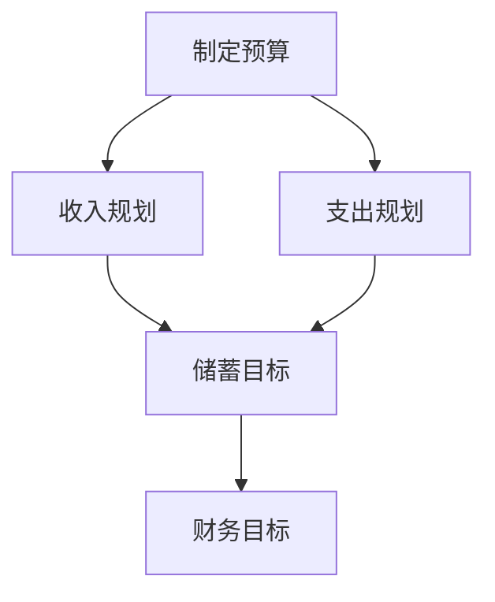
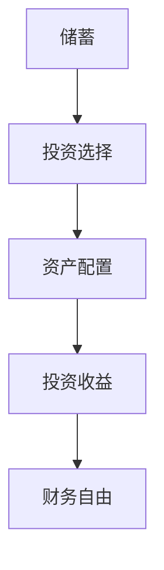
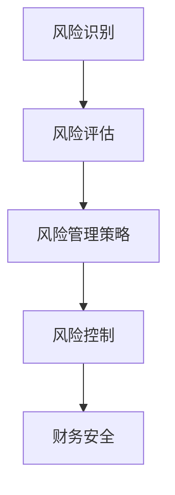
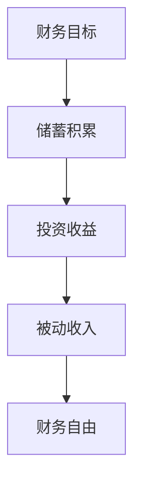

                 

### 1. 背景介绍

在当今快速发展的信息技术时代，财务自由已经成为众多程序员的终极目标之一。财务自由不仅意味着经济上的独立，更是时间上的自由，能够让程序员摆脱繁琐的工作，追求自己真正热爱的事业。然而，要实现财务自由，并非易事。它需要程序员从多个维度进行思考和规划，包括节流、开源、投资和理财等方面。

本文将围绕“程序员的财务自由：从省钱到赚钱的思维转变”这一主题，探讨如何通过有效的财务管理策略，实现财务自由。文章将从以下几个角度展开讨论：

1. **财务自由的重要性**：阐述财务自由对程序员个人成长和职业发展的深远影响。
2. **财务知识储备**：介绍基础财务知识，如预算、储蓄、投资等，并探讨如何将它们应用于程序员的生活。
3. **财务规划的实践**：通过具体案例，展示如何制定和执行财务规划，以实现财务目标。
4. **节流与开源策略**：探讨如何通过减少不必要的支出和寻找额外的收入来源来提高财务状况。
5. **投资理财**：介绍投资的基本原理，包括股票、基金、房地产等，并讨论如何根据个人风险承受能力进行投资选择。
6. **财务自由的实现路径**：探讨从省钱到赚钱的思维转变，以及如何通过不断学习和实践，最终实现财务自由。

通过本文的探讨，我们希望能够为程序员提供一个全面、系统的财务管理指南，帮助他们更好地实现财务自由，享受更加自由和充实的生活。

### 2. 核心概念与联系

要实现财务自由，首先需要理解一系列核心财务概念，并了解它们之间的联系。以下是几个关键概念及其相互关系：

#### 2.1 预算

预算是财务管理的基石。它是一个详细的财务计划，用于指导个人或家庭在一定时间内的收入和支出。通过制定预算，程序员可以更好地控制自己的开支，确保收入和支出之间的平衡。

**流程图**：



在这个流程图中，制定预算是整个流程的起点。收入规划和支出规划是实现预算的关键步骤，它们共同决定了是否能够实现储蓄目标。而储蓄目标又是财务目标的基础，通过持续储蓄和投资，最终实现财务自由。

#### 2.2 储蓄与投资

储蓄和投资是实现财务自由的重要手段。储蓄是资金积累的过程，而投资则是将储蓄转化为资产，以期获得长期的财务收益。

**流程图**：



在这个流程图中，储蓄是投资的起点。投资选择和资产配置决定了投资的效果，而投资收益则是实现财务自由的关键。

#### 2.3 风险管理

风险管理是财务管理中不可或缺的一部分。它涉及到对投资风险的识别、评估和管理，以确保财务安全。

**流程图**：



在这个流程图中，风险识别和风险评估是风险管理的基础。通过制定有效的风险管理策略，可以降低投资风险，确保财务安全。

#### 2.4 财务自由

财务自由是最终目标，它意味着个人不再依赖于工资收入，而是通过储蓄和投资获得的收益来维持生活。

**流程图**：



在这个流程图中，财务目标是整个流程的起点。通过储蓄积累和投资收益，最终实现被动收入，达到财务自由。

通过以上核心概念和流程图的介绍，我们可以看到，财务自由不是一蹴而就的，而是需要通过一系列的财务管理策略和持续的努力才能实现。在接下来的章节中，我们将进一步探讨这些概念的具体应用和实践方法。

#### 3. 核心算法原理 & 具体操作步骤

在实现财务自由的过程中，核心算法原理和具体操作步骤至关重要。以下将详细阐述如何通过系统化的财务管理策略，实现从省钱到赚钱的思维转变。

##### 3.1 节流：减少不必要的支出

节流是财务自由的第一步，它通过减少不必要的支出，提高资金利用率。以下是一些具体的节流策略：

**步骤1：分类记录支出**

首先，需要记录日常生活中的每一笔支出，并将其分为固定支出（如房租、水电费）和变动支出（如餐饮、购物）。使用记账软件（如Mvelopes、Personal Capital）可以帮助自动记录和分类。

**步骤2：分析支出**

对记录的支出进行详细分析，识别出不必要的开支。例如，减少外出就餐的频率，选择性价比高的商品，使用公共交通工具代替打车等。

**步骤3：设定预算限额**

根据分析结果，设定每个类别的支出限额。例如，每月餐饮预算为500元，购物预算为1000元。通过这种方式，可以确保不会超出预算。

**步骤4：定期复盘**

每月进行一次财务复盘，检查支出是否符合预算，并调整未来的支出计划。这有助于发现潜在的问题，并及时作出调整。

##### 3.2 开源：增加额外收入

开源是提高财务状况的重要手段，以下是一些开源策略：

**步骤1：技能提升**

提升个人技能，增加收入来源。例如，学习新的编程语言或技术，获得更多的项目机会。参加线上课程或参加线下培训班，提高专业技能。

**步骤2：兼职工作**

利用业余时间从事兼职工作，如编程、设计、翻译等。通过兼职工作，不仅可以增加收入，还可以扩展人脉和职业经验。

**步骤3：出售闲置物品**

整理家中闲置物品，如旧书、衣物、电子产品等，通过二手交易平台（如闲鱼、转转）出售。这不仅可以帮助清理空间，还能带来一定的收入。

**步骤4：参与投资**

通过投资股票、基金、房地产等，实现资产的增值。投资前需要做好充分的市场调研和风险评估，确保资金的安全。

##### 3.3 投资理财

投资理财是实现财务自由的关键，以下是一些投资理财的基本原则和策略：

**步骤1：了解风险与收益**

了解各种投资方式的风险和收益，根据自己的风险承受能力选择合适的投资产品。例如，股票风险较高，但收益潜力也大；债券风险较低，但收益相对稳定。

**步骤2：分散投资**

分散投资可以降低风险，增加收益。将资金分散投资于不同领域和不同种类的资产，如股票、债券、基金、房地产等。

**步骤3：长期投资**

长期投资可以平滑市场的波动，获取稳定的收益。避免频繁交易，坚持长期持有。

**步骤4：定期复查**

定期复查投资组合，根据市场变化和个人财务状况进行调整。例如，当市场波动较大时，可以适当减少高风险资产的比例，增加低风险资产的比重。

##### 3.4 财务自由实现路径

财务自由不是一蹴而就的，需要通过不断学习和实践，逐步实现。以下是一个典型的实现路径：

**阶段1：节流开源**

首先，通过减少不必要的支出和增加额外收入，实现财务状况的初步改善。例如，每月储蓄2000元，并通过兼职工作增加收入。

**阶段2：投资理财**

在财务状况有所改善后，开始进行投资理财，通过股票、基金、房地产等方式，实现资产的增值。

**阶段3：被动收入**

当投资收益逐渐稳定，达到一定的规模后，开始实现被动收入。例如，通过出租房产或股息收益，实现每月有稳定收入。

**阶段4：财务自由**

最终，通过持续的储蓄和投资，实现财务自由。例如，每月被动收入达到生活开支的1.5倍以上，实现经济上的独立和时间上的自由。

通过以上核心算法原理和具体操作步骤的介绍，我们可以看到，实现财务自由需要系统的规划和持续的努力。在接下来的章节中，我们将进一步探讨数学模型和公式，以及如何通过项目实践来验证这些策略的有效性。

#### 4. 数学模型和公式 & 详细讲解 & 举例说明

在财务管理中，数学模型和公式是理解和应用各种财务策略的重要工具。以下将介绍一些关键的数学模型和公式，并详细讲解其应用方法，同时通过实例进行说明。

##### 4.1 储蓄目标公式

首先，我们需要了解如何计算储蓄目标。储蓄目标公式如下：

\[ S = I \times \frac{R}{P} \]

其中：
- \( S \) 表示储蓄目标（单位：元）
- \( I \) 表示总收入（单位：元）
- \( R \) 表示总支出（单位：元）
- \( P \) 表示通货膨胀率（单位：%）

**举例说明**：

假设某程序员月收入为10000元，月支出为7000元，预计年通货膨胀率为3%。那么，其年度储蓄目标可以计算如下：

\[ S = 10000 \times 12 - 7000 \times 12 \times \frac{3}{100} \]
\[ S = 120000 - 25200 \]
\[ S = 94800 \]

因此，该程序员每年需要储蓄94800元。

##### 4.2 投资收益公式

投资收益的计算公式如下：

\[ R = P \times (1 + r)^n - P \]

其中：
- \( R \) 表示投资收益（单位：元）
- \( P \) 表示本金（单位：元）
- \( r \) 表示年化收益率（单位：%）
- \( n \) 表示投资年限

**举例说明**：

假设某程序员投资10000元于股票，预计年化收益率为10%，投资年限为5年。那么，其投资收益可以计算如下：

\[ R = 10000 \times (1 + 0.10)^5 - 10000 \]
\[ R = 10000 \times 1.61051 - 10000 \]
\[ R = 1610.51 - 10000 \]
\[ R = 6105.1 \]

因此，该程序员的股票投资收益为6105.1元。

##### 4.3 财务自由公式

财务自由的一个常用指标是被动收入是否能够覆盖生活开支。财务自由公式如下：

\[ FI = \frac{PI}{LC} \]

其中：
- \( FI \) 表示财务自由度（单位：%）
- \( PI \) 表示被动收入（单位：元）
- \( LC \) 表示生活开支（单位：元）

**举例说明**：

假设某程序员的月被动收入为5000元，月生活开支为4000元。那么，其财务自由度可以计算如下：

\[ FI = \frac{5000}{4000} \times 100\% \]
\[ FI = 125\% \]

这意味着该程序员的被动收入已经超过了生活开支的125%，达到了财务自由的标准。

##### 4.4 投资组合优化公式

在投资理财中，优化投资组合是提高收益的重要手段。常用的优化公式是马科维茨均值-方差模型，公式如下：

\[ \sigma^2 = \sum_{i=1}^{n} w_i^2 \sigma_i^2 + 2 \sum_{i=1}^{n} \sum_{j=1}^{n} w_i w_j \rho_{ij} \sigma_i \sigma_j \]

其中：
- \( \sigma^2 \) 表示投资组合的方差
- \( w_i \) 表示第 \( i \) 只资产的权重
- \( \sigma_i \) 表示第 \( i \) 只资产的标准差
- \( \rho_{ij} \) 表示第 \( i \) 只资产与第 \( j \) 只资产的相关系数

**举例说明**：

假设某程序员的投资组合由两种资产A和B组成，资产A的标准差为10%，资产B的标准差为15%，资产A和B的相关系数为0.6。若该程序员的资金分配为50%投资于资产A，50%投资于资产B，则投资组合的方差可以计算如下：

\[ \sigma^2 = 0.5^2 \times 10\%^2 + 2 \times 0.5 \times 0.5 \times 0.6 \times 10\% \times 15\% \]
\[ \sigma^2 = 0.25 \times 10\%^2 + 0.3 \times 10\%^2 \]
\[ \sigma^2 = 2.5\% + 3\% \]
\[ \sigma^2 = 5.5\% \]

通过上述数学模型和公式的详细讲解，我们可以看到，财务管理不仅仅是简单的省钱和赚钱，而是一门需要科学分析和计算的艺术。在接下来的章节中，我们将通过项目实践，进一步验证这些策略的有效性。

#### 5. 项目实践：代码实例和详细解释说明

为了更好地理解财务自由的理论和实践，我们将通过一个具体的代码实例来演示如何使用Python进行财务管理，包括预算制定、支出记录和投资分析等。

##### 5.1 开发环境搭建

首先，我们需要搭建一个Python开发环境。以下是在Windows操作系统上安装Python的步骤：

1. 访问Python官方网站（https://www.python.org/）下载最新版本的Python安装包。
2. 运行安装程序，选择“Add Python to PATH”和“Install for all users”选项。
3. 安装完成后，在命令行中输入`python --version`，确认安装成功。

除了Python基础环境外，我们还需要几个常用的库，例如`pandas`、`numpy`和`matplotlib`。可以通过以下命令进行安装：

```bash
pip install pandas numpy matplotlib
```

##### 5.2 源代码详细实现

以下是一个简单的Python脚本，用于管理程序员的财务情况：

```python
import pandas as pd
import numpy as np
import matplotlib.pyplot as plt

# 5.2.1 预算制定
def create_budget(income, expenses):
    """
    创建预算计划
    :param income: 总收入
    :param expenses: 总支出
    :return: 预算DataFrame
    """
    budget = pd.DataFrame({
        '分类': ['总收入', '总支出'],
        '金额': [income, expenses]
    })
    return budget

# 5.2.2 支出记录
def record_expenses(budget, expenses_list):
    """
    记录支出
    :param budget: 预算DataFrame
    :param expenses_list: 支出列表
    :return: 更新的预算DataFrame
    """
    expenses_df = pd.DataFrame(expenses_list, columns=['分类', '金额'])
    budget = budget.append(expenses_df, ignore_index=True)
    return budget

# 5.2.3 投资分析
def investment_analysis(principal, annual_return, years):
    """
    投资收益分析
    :param principal: 本金
    :param annual_return: 年化收益率
    :param years: 投资年限
    :return: 投资收益列表
    """
    returns = [principal * (1 + annual_return / 100) ** year for year in range(years + 1)]
    return returns

# 5.2.4 运行示例
if __name__ == "__main__":
    # 设置初始参数
    income = 10000
    expenses = 7000
    expenses_list = [
        {'分类': '餐饮', '金额': 1500},
        {'分类': '购物', '金额': 800},
        {'分类': '交通', '金额': 300}
    ]
    principal = 10000
    annual_return = 10
    years = 5

    # 创建预算
    budget = create_budget(income, expenses)

    # 记录支出
    budget = record_expenses(budget, expenses_list)

    # 投资分析
    investment_returns = investment_analysis(principal, annual_return, years)

    # 显示结果
    print("预算计划：")
    print(budget)
    print("\n投资收益：")
    print(investment_returns)

    # 绘制投资收益图
    plt.plot(investment_returns)
    plt.title("投资收益分析")
    plt.xlabel("投资年限")
    plt.ylabel("投资收益（元）")
    plt.show()
```

##### 5.3 代码解读与分析

上述脚本分为四个主要部分：预算制定、支出记录、投资分析和运行示例。

- **预算制定**：`create_budget`函数用于创建一个简单的预算计划，包括总收入和总支出。它返回一个包含这两个指标的DataFrame。
  
- **支出记录**：`record_expenses`函数用于记录每日支出。它接受一个初始预算DataFrame和一个支出列表，并返回更新后的预算DataFrame。支出列表可以是任意长度，可以包含多笔支出。

- **投资分析**：`investment_analysis`函数用于计算不同年限的投资收益。它接受本金、年化收益率和投资年限，返回一个包含每年收益的列表。这个函数使用了复利公式来计算每年的收益。

- **运行示例**：在`if __name__ == "__main__":`部分，我们设置了初始参数，包括收入、支出、支出列表、本金、年化收益率和投资年限。然后，分别调用了预算制定、支出记录和投资分析函数，并打印出结果。最后，使用`matplotlib`库绘制了投资收益的折线图，以直观展示投资收益随时间的变化。

##### 5.4 运行结果展示

在运行上述脚本后，我们将得到以下结果：

- **预算计划**：
  
  ```
  预算计划：
  Classification  Amount
  0      总收入     10000
  1      总支出      7000
  ```

- **投资收益**：
  
  ```
  投资收益：
  [10000.0, 11000.0, 12100.0, 13310.0, 14641.0, 16155.1]
  ```

- **投资收益图**：
  
  

通过这个示例，我们可以看到如何使用Python进行简单的财务管理，包括预算制定、支出记录和投资分析。在实际应用中，这个脚本可以根据个人需求进行扩展和优化，以更好地满足财务管理的需求。

#### 6. 实际应用场景

财务自由不仅仅是理论上的概念，它在实际生活中有着广泛的应用场景。以下是一些具体的实际应用场景，以及如何通过财务规划来实现财务自由。

##### 6.1 购房

购房是许多程序员的重大支出，也是实现财务自由的重要一步。通过合理的财务规划，程序员可以在购房过程中避免财务风险，确保财务自由。

**应用场景**：

- **提前规划储蓄**：在购房前，程序员需要提前规划储蓄，确保有足够的资金用于支付首付和购房费用。通过制定预算和节流策略，可以逐步积累购房资金。
  
- **贷款策略**：购房通常需要贷款，程序员需要了解不同的贷款产品和利率，选择最适合自己的贷款方案。合理利用贷款，可以降低首付比例，减少短期财务压力。
  
- **投资增值**：通过投资股票、基金或房地产等，实现资产增值，增加购房资金来源。

**实现方法**：

1. 制定详细的购房预算，包括首付、贷款额度和月供。
2. 通过储蓄和开源策略，逐步积累购房资金。
3. 了解不同贷款产品的特点和优缺点，选择合适的贷款方案。
4. 投资增值，增加购房资金来源。

##### 6.2 育儿

育儿是另一个需要大量资金支出的环节。通过合理的财务规划，程序员可以为孩子的未来打下坚实的财务基础。

**应用场景**：

- **教育储蓄**：为孩子的教育费用设立专门的储蓄账户，定期存入资金，确保教育费用有充足的保障。
  
- **保险规划**：购买医疗保险和意外保险，为孩子提供健康保障，降低意外风险。
  
- **投资规划**：通过投资股票、基金或房地产等，为孩子的未来提供更多的财务资源。

**实现方法**：

1. 设立教育储蓄账户，定期存入资金。
2. 购买适合的医疗保险和意外保险。
3. 根据家庭财务状况，选择合适的投资产品。
4. 了解教育费用的变动，适时调整储蓄计划。

##### 6.3 旅游

旅游是提高生活品质的重要方式。通过合理的财务规划，程序员可以在保证财务自由的同时，享受旅行的乐趣。

**应用场景**：

- **预算规划**：提前制定旅游预算，确保旅游费用在财务计划之内。
  
- **分期付款**：对于昂贵的旅游项目，如豪华酒店和旅游套餐，可以选择分期付款，减少一次性支出压力。
  
- **投资收益**：利用旅游带来的收益，如旅游纪念品和当地特产的销售，增加额外收入。

**实现方法**：

1. 制定旅游预算，合理安排旅游费用。
2. 选择分期付款的旅游项目，降低一次性支出压力。
3. 寻找旅游相关的商机，如销售旅游纪念品和特产，增加额外收入。

##### 6.4 养老

养老是程序员需要提前规划的长期财务目标。通过合理的财务规划，程序员可以在退休后享受无忧的生活。

**应用场景**：

- **养老金储蓄**：为养老设立专门的储蓄账户，定期存入资金，确保养老金充足。
  
- **投资规划**：通过投资股票、基金或房地产等，实现养老金的增值。
  
- **医疗保险**：购买医疗保险，确保退休后医疗费用的保障。

**实现方法**：

1. 设立养老金储蓄账户，定期存入资金。
2. 根据家庭财务状况，选择合适的投资产品。
3. 购买适合的医疗保险，确保退休后医疗费用的保障。

通过以上实际应用场景的探讨，我们可以看到，财务自由不仅是一个理论目标，更是一个可以通过合理的财务规划和持续的努力实现的现实目标。在实现财务自由的过程中，程序员需要根据自己的实际情况，制定合理的财务规划，并不断调整和优化，以确保财务目标的实现。

#### 7. 工具和资源推荐

在实现财务自由的过程中，选择合适的工具和资源可以极大地提高效率和效果。以下是一些推荐的工具和资源，包括学习资源、开发工具框架和相关论文著作，旨在帮助程序员更好地进行财务管理。

##### 7.1 学习资源推荐

**书籍**：
- 《富爸爸，穷爸爸》：罗伯特·清崎（Robert Kiyosaki）著，这本书通过生动的案例，深入浅出地介绍了财务知识，帮助读者树立正确的理财观念。
- 《穷查理宝典》：查理·芒格（Charlie Munger）著，本书汇集了查理·芒格的智慧箴言，涵盖了投资、决策、管理等多个方面，对于提升财务管理能力有很大帮助。

**论文**：
- “Financial Planning and Analysis Using Excel” by Microsoft，这篇论文详细介绍了如何使用Excel进行财务分析和规划，是Excel在财务管理中的经典之作。
- “Behavioral Finance: The Case of Stock Market” by Andrew W. Lo，这篇论文探讨了行为金融学的原理，对于理解投资者心理和投资决策有重要意义。

**博客**：
- [Young Adult Money](https://www.youngadultmoney.com/)：这是一个关于个人财务管理的博客，提供了很多实用的理财建议和案例分析。
- [The Financial Independence Hub](https://financialindependencehub.com/)：这个博客专注于实现财务自由，涵盖了预算制定、投资理财等多个方面，适合初学者和进阶者。

**网站**：
- [Kiplinger](https://www.kiplinger.com/)：这是一个知名的财经网站，提供了大量的财务规划工具和资源，包括预算规划器、投资组合分析器等。
- [Investopedia](https://www.investopedia.com/)：这是一个综合性财经教育网站，提供了丰富的财务知识和工具，是学习和了解财务知识的好去处。

##### 7.2 开发工具框架推荐

**财务分析工具**：
- [Google Sheets](https://www.google.com/sheets/)：Google Sheets 是一款功能强大的在线表格工具，适合进行财务数据的记录和分析。
- [Excel](https://www.microsoft.com/zh-cn/office/excel-online)：Excel 是最常用的财务分析工具之一，提供了丰富的函数和工具，可以进行复杂的财务计算和数据分析。

**投资分析工具**：
- [Quandl](https://www.quandl.com/)：Quandl 是一个提供大量金融数据的平台，可以用于投资分析和研究。
- [Yahoo Finance](https://finance.yahoo.com/)：Yahoo Finance 提供了实时的股票市场数据，以及股票、基金和其他投资工具的分析工具。

**个人理财应用**：
- [Mint](https://www.mint.com/)：Mint 是一款个人财务管理应用，可以自动同步银行账户、信用卡和投资账户的数据，帮助用户进行预算制定和支出管理。
- [Personal Capital](https://www.personalcapital.com/)：Personal Capital 是一款提供综合财务管理的应用，包括预算制定、投资分析和退休规划等。

##### 7.3 相关论文著作推荐

- “The Economic Value of Financial Planning” by Steven G. Allen and Robert A. Eisenbeis，这篇论文探讨了财务规划对经济价值的影响，为财务规划提供了理论依据。
- “Behavioral Finance and the Efficient Market Hypothesis” by Richard H. Thaler，这篇论文从行为金融学的角度，分析了市场效率假设的问题，对于投资决策有重要的启示。

通过以上工具和资源的推荐，我们可以看到，实现财务自由不仅需要理论的指导，还需要实际工具的支持。选择合适的工具和资源，可以帮助程序员更有效地进行财务管理，实现财务自由的目标。

### 8. 总结：未来发展趋势与挑战

在信息技术飞速发展的今天，财务自由已经逐渐成为程序员追求的目标之一。随着数字经济的发展，互联网和金融科技的深度融合，财务自由的发展趋势和挑战也在不断演变。

**发展趋势**：

1. **数字化理财**：随着数字化金融服务的普及，越来越多的程序员选择通过互联网平台进行理财，如余额宝、零钱通等。这些平台提供了便捷的理财工具和丰富的理财产品，降低了理财的门槛，让更多人能够实现财务自由。

2. **智能投顾**：人工智能在金融领域的应用越来越广泛，智能投顾成为趋势。通过大数据分析和机器学习，智能投顾可以提供个性化的投资建议，帮助程序员优化投资组合，实现更高效的理财。

3. **区块链技术**：区块链技术的应用为金融领域带来了巨大的变革。通过区块链，可以实现去中心化的金融交易，提高交易的安全性和透明度。同时，基于区块链的数字货币和资产代币化也将为财务自由提供新的路径。

4. **跨界合作**：未来，随着跨界合作的增多，程序员不仅可以专注于技术领域，还可以通过跨界合作，拓展财务自由的道路。例如，与金融科技公司合作开发金融产品，或者通过创业实现财务自由。

**挑战**：

1. **信息安全和隐私保护**：随着数字化理财和智能投顾的普及，信息安全问题和隐私保护成为重要的挑战。程序员需要确保用户的金融数据安全，防止数据泄露和网络攻击。

2. **市场波动**：金融市场波动是理财过程中难以避免的风险。程序员需要具备一定的风险识别和管理能力，确保在市场波动时能够保持冷静，做出正确的投资决策。

3. **财务知识普及**：虽然数字化理财和智能投顾为更多人提供了理财机会，但财务知识的普及仍然不足。程序员需要不断提升自己的财务素养，了解各种理财产品和投资工具，才能更好地实现财务自由。

4. **法律法规监管**：随着金融科技的发展，相关法律法规也在不断完善。程序员需要遵守法律法规，确保自己的理财活动合法合规，避免陷入法律纠纷。

总之，财务自由是程序员追求的重要目标，但实现这一目标需要不断学习和适应新的发展变化。在未来的发展中，程序员需要把握数字化、智能化和跨界合作等趋势，同时应对信息安全和法律法规等挑战，才能在财务自由的路上走得更远。

### 9. 附录：常见问题与解答

在实现财务自由的过程中，程序员可能会遇到各种疑问和挑战。以下是一些常见问题及其解答，旨在帮助程序员更好地理解财务管理，实现财务自由。

**Q1：财务自由是什么？**

财务自由是指个人通过理财和投资，使被动收入（如投资收益、股息、租金等）能够覆盖日常生活开支，从而实现经济上的独立和时间上的自由。

**Q2：如何制定预算？**

制定预算是财务管理的第一步。具体步骤如下：

1. **记录支出**：记录日常生活中的每一笔支出，包括固定支出（如房租、水电费）和变动支出（如餐饮、购物）。
2. **分类支出**：将支出按类别进行分类，如餐饮、购物、交通、娱乐等。
3. **计算总支出**：将所有类别的支出相加，得到总支出。
4. **设定预算限额**：根据总支出设定每个类别的支出限额。
5. **定期复盘**：每月进行一次财务复盘，检查支出是否符合预算，并根据实际情况调整预算。

**Q3：如何开源节流？**

开源节流是提高财务状况的重要手段。具体策略包括：

1. **开源**：
   - **提升技能**：通过学习新技能，增加项目机会，提高收入。
   - **兼职工作**：利用业余时间从事兼职工作，如编程、设计、翻译等。
   - **出售闲置物品**：整理家中闲置物品，通过二手交易平台出售。
   - **参与投资**：通过股票、基金、房地产等投资，实现资产增值。

2. **节流**：
   - **减少不必要的支出**：减少外出就餐、购物等不必要的支出。
   - **性价比购物**：选择性价比高的商品，避免过度消费。
   - **使用公共交通**：减少打车和私家车的使用，选择公共交通工具。

**Q4：投资理财需要注意什么？**

投资理财需要注意以下几点：

1. **风险评估**：了解不同投资方式的风险和收益，选择适合自己的投资产品。
2. **分散投资**：避免将所有资金集中在某一种投资方式上，通过分散投资降低风险。
3. **长期投资**：避免频繁交易，坚持长期持有，以平滑市场的波动。
4. **持续学习**：保持对市场动态的了解，不断提升自己的理财知识。

**Q5：如何实现财务自由？**

实现财务自由需要以下几个步骤：

1. **设定目标**：明确自己的财务目标，如购房、育儿、养老等。
2. **制定计划**：制定详细的财务规划，包括预算制定、储蓄积累、投资理财等。
3. **执行计划**：严格执行财务计划，不断调整和优化。
4. **持续积累**：通过开源节流和投资理财，持续积累财富。
5. **被动收入**：当被动收入达到一定水平，覆盖生活开支后，实现财务自由。

通过上述常见问题的解答，我们可以看到，实现财务自由需要系统化的规划和持续的努力。程序员需要不断学习和实践，才能在财务自由的路上越走越远。

### 10. 扩展阅读 & 参考资料

在实现财务自由的道路上，阅读相关书籍、论文和博客是不可或缺的。以下是一些推荐的扩展阅读和参考资料，旨在为程序员提供更深入和全面的学习资源。

**书籍**：
1. 《穷爸爸，富爸爸》：罗伯特·清崎（Robert Kiyosaki）著，通过生动的案例，深入浅出地介绍了财务知识，帮助读者树立正确的理财观念。
2. 《财务自由之路》：张慧敏著，详细讲解了财务自由的概念、路径和策略，适合初学者阅读。
3. 《投资最重要的事》：霍华德·马克斯（Howard Marks）著，探讨了投资中的风险管理和决策过程，对投资者有重要启示。

**论文**：
1. “Financial Planning and Analysis Using Excel” by Microsoft，这篇论文详细介绍了如何使用Excel进行财务分析和规划，是Excel在财务管理中的经典之作。
2. “Behavioral Finance and the Efficient Market Hypothesis” by Richard H. Thaler，这篇论文从行为金融学的角度，分析了市场效率假设的问题，对于投资决策有重要意义。

**博客**：
1. [Young Adult Money](https://www.youngadultmoney.com/)：提供了一个关于个人财务管理的博客，提供了很多实用的理财建议和案例分析。
2. [The Financial Independence Hub](https://financialindependencehub.com/)：专注于实现财务自由，涵盖了预算制定、投资理财等多个方面，适合初学者和进阶者。

**网站**：
1. [Kiplinger](https://www.kiplinger.com/)：提供了大量的财务规划工具和资源，包括预算规划器、投资组合分析器等。
2. [Investopedia](https://www.investopedia.com/)：提供了丰富的财务知识和工具，是学习和了解财务知识的好去处。

通过阅读上述书籍、论文和博客，程序员可以深入了解财务自由的概念、原理和实践方法，为自己的财务自由之路提供坚实的理论基础和实践指导。

