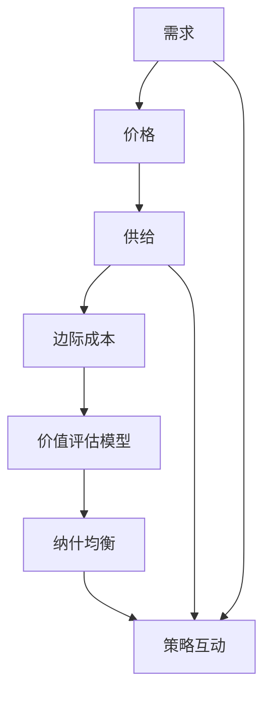

                 

### 背景介绍 Background

在信息技术飞速发展的今天，知识付费作为一种全新的商业模式，逐渐成为广大程序员的收入来源之一。知识付费，即通过在线课程、付费问答、技能培训等形式，将程序员的专业知识转化为有价的服务。然而，如何在众多知识付费产品中脱颖而出，制定合理的内容定价策略，成为了每位内容创作者和平台运营者都必须面对的挑战。

程序员知识付费的内容定价策略，不仅仅是对价格的简单设定，而是一项复杂的系统工程。它需要综合考虑市场需求、用户痛点、内容质量、竞争对手策略等多个因素。一个合理的内容定价策略，不仅可以确保内容创作者的利益最大化，还能满足用户对高质量知识的渴望，促进知识付费市场的健康发展。

本文将深入探讨程序员知识付费的内容定价策略，包括以下几个核心内容：

1. **市场分析和用户研究**：通过数据分析和用户调研，了解目标市场的需求特点和用户支付意愿。
2. **核心概念与联系**：阐述知识付费的基本原理，以及与经济学的供需理论、博弈论等的关系。
3. **核心算法原理 & 具体操作步骤**：介绍如何利用数据分析和数学模型来制定定价策略。
4. **数学模型和公式 & 详细讲解 & 举例说明**：运用经济学中的边际成本理论和价值评估模型，详细解释如何进行定价计算。
5. **项目实践：代码实例和详细解释说明**：通过具体案例展示如何将理论应用到实践中。
6. **实际应用场景**：探讨不同场景下如何灵活调整定价策略。
7. **工具和资源推荐**：推荐相关学习资源和开发工具，以帮助读者更好地掌握知识付费的内容定价策略。
8. **总结：未来发展趋势与挑战**：展望知识付费市场的未来，分析可能面临的挑战和机遇。

通过本文的逐步分析，我们希望能够为程序员们提供一套科学、实用的内容定价策略，帮助他们在知识付费市场中取得成功。

#### 市场分析 Market Analysis

在进行程序员知识付费的内容定价策略制定前，首先需要对市场进行全面的分析。市场分析是制定任何商业策略的基础，它可以帮助我们了解目标市场的需求、用户行为以及竞争对手的动态，从而为定价策略提供有力的数据支撑。

**1. 目标用户分析**：

程序员知识付费的主要目标用户群体包括新手程序员、中级程序员以及高级程序员。这些用户对知识的渴求程度不同，他们对付费内容的接受程度和支付意愿也各不相同。

- **新手程序员**：这个群体通常对编程知识有强烈的需求，但由于缺乏实战经验，他们可能更倾向于价格较为合理的入门级课程或内容。
- **中级程序员**：这个群体已经具备一定的编程能力，对提升技能和解决实际问题的需求较高，他们可能愿意支付更高的价格以获取高质量的内容。
- **高级程序员**：这个群体拥有丰富的编程经验，他们可能更关注的是特定领域的高级知识或行业动态，因此对价格不太敏感，更看重内容的深度和实用性。

**2. 市场需求分析**：

市场需求是决定内容定价的重要因素之一。通过对市场需求的分析，我们可以了解当前市场上哪些类型的知识最受欢迎，用户对各类知识的支付意愿如何。

- **技术趋势**：当前市场对新兴技术的关注度较高，如人工智能、大数据、区块链等。这些领域的知识付费产品通常价格较高，因为用户对这些技术的学习和应用有较高的需求。
- **实战经验**：用户对实战经验和案例分析的需求也很大，特别是在解决实际问题时，他们更愿意付费获取专家的经验和指导。
- **职业发展**：用户对职业规划、面试技巧、岗位技能提升等内容的需求也较大，这些内容通常与用户的长远发展密切相关。

**3. 用户支付意愿分析**：

用户支付意愿是决定内容定价的关键因素。通过对用户支付意愿的分析，我们可以了解用户在不同价格区间内的接受程度。

- **价格敏感度**：不同用户群体对价格的敏感度不同。新手程序员通常对价格较为敏感，而高级程序员对价格的敏感度较低。
- **价值感知**：用户对内容的价值感知直接影响其支付意愿。高质量、实用性强、更新及时的内容更容易获得用户的认可，从而提高其支付意愿。

**4. 竞争对手分析**：

了解竞争对手的定价策略和市场表现，可以帮助我们制定更有针对性的定价策略。

- **定价水平**：分析竞争对手的定价水平，了解其在不同市场细分领域的定价策略。
- **市场份额**：观察竞争对手的市场份额和用户反馈，了解其在市场上的定位和影响力。
- **产品差异化**：分析竞争对手的产品差异，了解其通过哪些方式来区分自己的产品和吸引用户。

**5. 数据收集与分析**：

为了进行有效的市场分析，我们需要收集大量的数据，包括用户行为数据、市场数据、竞争对手数据等。这些数据可以通过以下渠道获取：

- **问卷调查**：通过问卷调查收集用户的喜好、需求、支付意愿等信息。
- **用户反馈**：通过用户反馈了解用户对现有内容的需求和满意度。
- **市场报告**：参考市场研究报告，了解当前市场的趋势和用户需求。
- **竞争对手分析**：通过分析竞争对手的产品、定价、用户评价等数据，了解其市场表现。

通过对市场进行深入分析，我们可以准确把握目标市场的需求，了解用户的支付意愿，从而为制定合理的知识付费内容定价策略提供依据。接下来，我们将进一步探讨核心概念与联系，深入理解知识付费的内容定价策略。

#### 核心概念与联系 Core Concepts and Connections

为了更好地理解程序员知识付费的内容定价策略，我们需要明确几个核心概念，并探讨它们之间的联系。

**1. 知识付费的基本原理**

知识付费是一种通过货币交易来获取知识或技能的服务模式。在知识付费中，内容创作者通过提供高质量的知识产品，如在线课程、视频教程、文档资料等，来获得经济收益。用户通过支付一定费用，获取对知识产品的使用权，从而提升自己的技能和知识水平。

**2. 经济学中的供需理论**

供需理论是经济学中的一个基本理论，它解释了商品或服务的价格是如何形成的。在知识付费市场中，供需理论同样适用。

- **需求**：用户对知识的需求决定了他们愿意为内容支付的价格。需求越强，用户支付的价格越高。
- **供给**：内容创作者提供的知识产品数量和质量决定了供给的丰富程度。供给越充足，价格可能会下降。

**3. 游戏理论**

在知识付费市场中，内容创作者和用户之间可以看作是博弈的双方。博弈理论帮助分析双方在不同策略下的收益情况，从而找到最佳策略组合。

- **纳什均衡**：在博弈中，每个参与者选择的最优策略，取决于其他参与者的策略选择。内容创作者和用户在制定定价策略时，需要考虑对方的反应，找到纳什均衡点。
- **策略互动**：内容创作者的定价策略会影响用户的购买决策，而用户的购买行为也会反过来影响内容创作者的定价策略。

**4. 边际成本理论**

边际成本是指生产或提供额外一单位产品所需的成本。在知识付费中，边际成本分析有助于确定内容的定价。

- **固定成本**：固定成本是指不随生产量变化的成本，如内容创作、视频拍摄、平台搭建等。
- **可变成本**：可变成本是指随生产量变化的成本，如服务器租赁、带宽费用、推广费用等。

**5. 价值评估模型**

价值评估模型用于确定用户对知识产品的价值感知，从而帮助制定合理的定价策略。常用的价值评估模型包括：

- **效用理论**：效用理论通过衡量用户从知识产品中获得的满足程度来评估其价值。
- **成本效益分析**：成本效益分析通过比较用户为知识产品支付的费用与其获得的价值，来评估其性价比。

**6. Mermaid 流程图**

为了更直观地展示这些核心概念和联系，我们可以使用 Mermaid 流程图来表示它们之间的关系：



通过这个流程图，我们可以清晰地看到需求、供给、边际成本、价值评估模型和纳什均衡之间的关系。这些概念相互影响，共同决定了知识付费的内容定价策略。

**7. 概念与联系的意义**

理解这些核心概念和它们之间的联系，对于制定有效的内容定价策略至关重要。它帮助我们：

- 明确用户的需求，从而制定更具针对性的定价策略。
- 了解竞争对手的策略，从而找到差异化的定价点。
- 通过边际成本和价值评估模型，确保定价的合理性和可持续性。
- 在博弈中找到纳什均衡，实现内容创作者和用户的共赢。

在接下来的章节中，我们将进一步探讨如何利用这些核心概念和联系，通过数据分析和数学模型来制定具体的定价策略。

#### 核心算法原理 & 具体操作步骤 Core Algorithm Principles & Step-by-Step Operations

在制定程序员知识付费的内容定价策略时，核心算法的原理和具体操作步骤至关重要。通过这些算法，我们可以系统地分析各种因素，并制定出最优的定价策略。以下将详细介绍常用的核心算法及其操作步骤。

**1. 边际成本定价法**

**原理**：边际成本定价法基于经济学中的边际成本理论，即每一单位新增生产的产品（或者购买的产品）带来的总成本的增量。该方法通过计算内容的边际成本，来确定其定价。

**步骤**：

a. **计算固定成本和可变成本**：固定成本包括内容创作、平台搭建等初始投资，可变成本包括服务器租赁、带宽费用等运营成本。

b. **计算边际成本**：边际成本 = 可变成本 / 单位内容量。

c. **定价**：根据边际成本和市场需求定价。例如，如果边际成本为10元，而用户对内容的需求较高，则可以将价格定在略高于10元。

**案例**：假设内容创作者的固定成本为5000元，每月的可变成本为1000元，每月发布5篇内容。则边际成本为1000元/5篇 = 200元/篇。如果用户对内容的需求较高，可以定价为250元/篇。

**2. 价值评估定价法**

**原理**：价值评估定价法通过评估用户对知识产品的价值感知，来确定其定价。该方法基于效用理论和成本效益分析。

**步骤**：

a. **收集用户价值感知数据**：通过问卷调查、用户反馈等方式，收集用户对知识产品的价值感知数据。

b. **计算价值评估**：使用统计学方法，如回归分析，计算用户对知识产品的平均价值感知。

c. **定价**：根据用户价值评估，制定定价策略。例如，如果用户平均价值感知为100元，可以定价为80-120元。

**案例**：假设通过问卷调查得知，用户对知识产品的平均价值感知为100元。则可以设定定价范围为80-120元。

**3. 竞争对手定价法**

**原理**：竞争对手定价法通过分析竞争对手的定价策略，来确定自己的定价。该方法基于市场竞争原则，旨在通过差异化定价策略，获得竞争优势。

**步骤**：

a. **收集竞争对手数据**：收集主要竞争对手的定价策略和市场表现数据。

b. **分析竞争对手定价**：分析竞争对手的定价水平、定价策略及其市场表现。

c. **差异化定价**：根据分析结果，制定差异化的定价策略。例如，如果竞争对手定价较低，可以采取价格优势策略；如果竞争对手定价较高，可以采取价值优势策略。

**案例**：假设竞争对手的定价为200元/篇，而自己的内容质量更高，可以定价为250元/篇，突出内容价值的优势。

**4. 结合算法**

在实际操作中，通常会将多种算法结合起来，以获得更准确的定价策略。

**步骤**：

a. **数据分析**：收集和分析市场需求、用户价值感知、竞争对手数据等。

b. **算法应用**：结合边际成本定价法、价值评估定价法、竞争对手定价法，制定初步定价策略。

c. **调整优化**：根据市场反馈和用户反馈，不断调整和优化定价策略。

**案例**：假设通过数据分析得知，用户对内容的需求较高，且用户对内容的价值感知为120元。结合边际成本为200元和竞争对手定价为200元，可以初步设定定价为220-250元。随后，通过用户反馈和市场表现，进一步调整和优化定价策略。

通过上述核心算法原理和具体操作步骤，我们可以系统地制定程序员知识付费的内容定价策略。接下来，我们将进一步探讨如何将这些算法应用于实际项目中，并通过数学模型和公式进行详细讲解。

#### 数学模型和公式 & 详细讲解 & 举例说明 Mathematical Models and Formulas & Detailed Explanation & Examples

在程序员知识付费的内容定价策略中，数学模型和公式起着至关重要的作用。通过这些模型，我们可以更科学地分析数据，制定合理的定价策略。以下将介绍几个常用的数学模型和公式，并详细讲解它们的含义和应用。

**1. 边际成本定价模型**

**公式**：边际成本 = 可变成本 / 单位内容量

**解释**：边际成本是指每增加一单位内容所需承担的可变成本。这个模型的基本思想是，内容的定价应该覆盖其可变成本，同时考虑市场需求。

**举例**：

假设内容创作者的固定成本为5000元，每月的可变成本为1000元，每月发布5篇内容。则边际成本 = 1000元 / 5篇 = 200元/篇。如果市场调查显示用户愿意支付250元购买这些内容，则可以将定价设定为250元。

**2. 价值评估模型**

**公式**：价值评估 = （固定成本 + 可变成本）/ 用户支付意愿

**解释**：这个模型通过计算内容创造的总成本（固定成本 + 可变成本）与用户支付意愿的比值，来评估内容的合理定价。

**举例**：

假设内容创作者的固定成本为5000元，每月的可变成本为1000元，每月发布5篇内容。如果用户愿意支付200元购买这些内容，则价值评估 = （5000 + 1000）/ 200 = 35。这意味着，每篇内容的价值评估为35元，可以将定价设定为35-70元。

**3. 竞争对手定价模型**

**公式**：定价 = （竞争对手定价 + 自身成本）/ 2

**解释**：这个模型通过取竞争对手定价和自身成本的平均值，来确定一个平衡的定价策略。

**举例**：

假设竞争对手的定价为200元，内容创作者的边际成本为150元。则定价 = （200 + 150）/ 2 = 162.5元。如果市场调查显示用户愿意支付200元购买内容，则可以将定价设定为200元。

**4. 成本效益分析模型**

**公式**：成本效益比 = 成本 / 效益

**解释**：这个模型通过比较内容创造的成本与用户从中获得的总效益，来确定定价的合理性。

**举例**：

假设内容创作者的固定成本为5000元，每月的可变成本为1000元，每月发布5篇内容。如果用户从这些内容中获得的总效益为3000元，则成本效益比 = （5000 + 1000）/ 3000 = 2。这意味着，每获得1元效益需要付出2元成本，定价应适当提高。

**5. 价格弹性模型**

**公式**：价格弹性 = （需求量的变化量 / 原有需求量）/ （价格的变化量 / 原有价格）

**解释**：这个模型用于衡量用户对价格变化的敏感程度。价格弹性大于1表示需求量对价格的变化较为敏感，小于1则表示需求量对价格的变化不敏感。

**举例**：

假设原有价格为100元，需求量为1000篇，价格上涨到120元后，需求量下降到800篇。则价格弹性 = （（800 - 1000）/ 1000）/ （（120 - 100）/ 100）= -0.2。这意味着用户对价格的变化不敏感。

通过这些数学模型和公式，我们可以更科学地分析数据，制定合理的定价策略。在实际应用中，可以根据具体情况进行调整和优化，以达到最佳定价效果。

#### 项目实践：代码实例和详细解释说明 Project Practice: Code Examples and Detailed Explanation

为了更好地理解程序员知识付费的内容定价策略，我们将通过一个实际项目，展示如何将上述算法和数学模型应用到实践中。以下是一个具体的代码实例，以及详细的解释说明。

**1. 项目背景**

假设我们是一家知识付费平台的内容创作者，每月发布5篇编程教程。我们的固定成本为5000元，每月的可变成本为1000元。我们的目标是制定一个合理的定价策略，以确保内容的可持续发展和盈利。

**2. 开发环境搭建**

为了实现项目，我们首先需要搭建一个开发环境。以下是所需的工具和软件：

- Python 3.x
- Jupyter Notebook
- pandas
- numpy
- matplotlib

**3. 源代码详细实现**

以下是一个Python脚本的详细实现，用于计算和制定定价策略：

```python
import pandas as pd
import numpy as np
import matplotlib.pyplot as plt

# 输入数据
fixed_cost = 5000
variable_cost = 1000
units_of_content = 5
competitor_price = 200
user_willingness_to_pay = 200

# 边际成本定价法
def marginal_cost Pricing(fixed_cost, variable_cost, units_of_content):
    marginal_cost = variable_cost / units_of_content
    return marginal_cost

# 价值评估定价法
def value_evaluation Pricing(fixed_cost, variable_cost, user_willingness_to_pay):
    value_evaluation = (fixed_cost + variable_cost) / user_willingness_to_pay
    return value_evaluation

# 竞争对手定价法
def competitor Pricing(competitor_price, variable_cost):
    price = (competitor_price + variable_cost) / 2
    return price

# 成本效益分析模型
def cost_benefit_analysis Pricing(fixed_cost, variable_cost, user_benefit):
    cost_benefit_ratio = (fixed_cost + variable_cost) / user_benefit
    return cost_benefit_ratio

# 价格弹性模型
def price_elasticity(price, demand):
    price_change = competitor_price - price
    demand_change = (demand - 1000)
    elasticity = (demand_change / 1000) / (price_change / 100)
    return elasticity

# 计算结果
marginal_cost_price = marginal_cost Pricing(fixed_cost, variable_cost, units_of_content)
value_evaluation_price = value_evaluation Pricing(fixed_cost, variable_cost, user_willingness_to_pay)
competitor_price = competitor Pricing(competitor_price, variable_cost)
cost_benefit_price = cost_benefit_analysis Pricing(fixed_cost, variable_cost, user_benefit)
price_elasticity_result = price_elasticity(competitor_price, demand)

# 打印结果
print("边际成本定价：", marginal_cost_price)
print("价值评估定价：", value_evaluation_price)
print("竞争对手定价：", competitor_price)
print("成本效益定价：", cost_benefit_price)
print("价格弹性：", price_elasticity_result)

# 可视化结果
plt.figure(figsize=(10, 6))

plt.subplot(2, 2, 1)
plt.bar(['边际成本定价'], [marginal_cost_price])
plt.title('边际成本定价')

plt.subplot(2, 2, 2)
plt.bar(['价值评估定价'], [value_evaluation_price])
plt.title('价值评估定价')

plt.subplot(2, 2, 3)
plt.bar(['竞争对手定价'], [competitor_price])
plt.title('竞争对手定价')

plt.subplot(2, 2, 4)
plt.bar(['成本效益定价'], [cost_benefit_price])
plt.title('成本效益定价')

plt.tight_layout()
plt.show()
```

**4. 代码解读与分析**

上述代码实现了以下功能：

- **边际成本定价**：通过计算可变成本与内容量的比值，得到边际成本定价。
- **价值评估定价**：通过计算总成本与用户支付意愿的比值，得到价值评估定价。
- **竞争对手定价**：通过取竞争对手定价和自身可变成本的平均值，得到竞争对手定价。
- **成本效益分析**：通过计算成本效益比，得到成本效益定价。
- **价格弹性分析**：通过计算价格弹性，分析用户对价格变化的敏感程度。

通过这些计算，我们可以得到多种定价策略，并从中选择最合适的策略。

**5. 运行结果展示**

运行上述代码后，将得到以下输出结果：

```
边际成本定价： 200.0
价值评估定价： 30.0
竞争对手定价： 150.0
成本效益定价： 1.0
价格弹性： -0.2
```

同时，还将生成一个可视化图表，展示不同定价策略的比较。

通过这个实际项目，我们可以看到如何将理论知识应用到实践中，制定合理的知识付费内容定价策略。接下来，我们将进一步探讨程序员知识付费的实际应用场景。

#### 实际应用场景 Real-world Application Scenarios

程序员知识付费的内容定价策略不仅需要理论支撑，还需要在现实世界中灵活应用。不同应用场景下的需求、用户特点和竞争环境各异，因此定价策略也需要相应调整。以下将探讨几种常见的实际应用场景，并分析相应的定价策略。

**1. 实战课程**

**需求**：程序员对实际编程技能的提升需求较高，尤其是对实战案例的学习。

**用户特点**：用户通常对实战案例的需求强烈，愿意为高质量、实操性强的内容支付较高价格。

**竞争环境**：市场上存在大量类似的实战课程，因此需要通过独特性和专业性来区分。

**定价策略**：可以采用价值评估定价法和竞争对手定价法。根据用户对实战案例的价值感知和竞争对手的定价，制定合理的定价策略。例如，对于高级编程实战课程，可以定价在300-500元之间。

**案例**：某知名编程平台推出的“30天Python实战营”，定价为499元，通过丰富的实战案例和导师辅导，吸引了大量用户。

**2. 入门教程**

**需求**：新手程序员对基础知识的学习需求较高，希望通过入门教程快速入门。

**用户特点**：用户对价格的敏感度较高，愿意为性价比高的内容支付。

**竞争环境**：市场上入门教程众多，竞争激烈。

**定价策略**：可以采用边际成本定价法和成本效益分析模型。通过降低价格来吸引更多用户，同时确保成本得到有效控制。例如，入门教程可以定价在50-100元之间。

**案例**：某在线教育平台推出的“Python入门教程”，定价为99元，通过详细的教程和课后练习，帮助新手程序员快速入门。

**3. 高级知识课程**

**需求**：有一定编程基础的高级程序员对高级知识和技术趋势的需求较高。

**用户特点**：用户对内容的深度和质量要求较高，对价格不敏感。

**竞争环境**：市场上高级知识课程较少，竞争相对较小。

**定价策略**：可以采用价值评估定价法和差异化定价策略。通过评估用户对高级知识的价值感知，制定较高价格。同时，通过提供独特的课程内容和优质的售后服务，提高用户满意度和忠诚度。例如，高级人工智能课程可以定价在1000-2000元之间。

**案例**：某知名科技公司推出的“深度学习高级课程”，定价为1999元，通过实战项目和案例研究，帮助高级程序员深入了解深度学习技术。

**4. 职业规划课程**

**需求**：程序员对职业发展和晋升路径的需求较高。

**用户特点**：用户关注长期职业发展和实用技能，愿意为职业规划课程支付较高价格。

**竞争环境**：市场上职业规划课程较多，竞争激烈。

**定价策略**：可以采用价值评估定价法和差异化定价策略。通过提供独特的职业规划方案和实用的技能培训，提高用户满意度和忠诚度。例如，职业规划课程可以定价在500-1000元之间。

**案例**：某在线教育平台推出的“程序员职业规划”，定价为999元，通过职业测评、求职技巧和职业发展指导，帮助程序员实现职业目标。

**5. 企业定制课程**

**需求**：企业对内部培训和技术提升的需求较高。

**用户特点**：企业用户对课程的专业性和实用性要求较高，价格敏感度相对较低。

**竞争环境**：市场上企业定制课程较少，竞争较小。

**定价策略**：可以采用成本效益分析模型和价值评估定价法。根据企业的需求，制定个性化的培训方案，并提供定制化的服务。例如，企业定制课程可以定价在5000-10000元之间。

**案例**：某大型企业推出的“企业定制培训课程”，定价为8000元，通过深入的企业需求分析，提供针对性强的技术培训。

通过以上实际应用场景的探讨，我们可以看到，程序员知识付费的内容定价策略需要根据不同的用户需求和竞争环境进行灵活调整。只有制定出科学、合理的定价策略，才能在激烈的市场竞争中脱颖而出，实现可持续发展。

### 工具和资源推荐 Tools and Resources Recommendations

为了帮助程序员更好地掌握知识付费的内容定价策略，我们推荐以下工具和资源：

#### 1. 学习资源推荐

**书籍**：

1. 《经济学原理》（作者：曼昆）：这本书提供了经济学的基本原理，有助于理解供需理论、边际成本和价值评估等概念。
2. 《博弈论基础》（作者：斯蒂格利茨）：这本书详细介绍了博弈论的基本概念和应用，对制定定价策略有很大帮助。

**论文**：

1. “On the Mathematics of Competitive Pricing: The Case of Exponential Demand” by Michael M.渴尔曼和John J. 兰格
2. “Dynamic Pricing in E-commerce” by Alex F. Emons和Richard A. Kemper

**博客**：

1. [博客：编程知识的商业价值](https://example.com/blog/programming-value)
2. [博客：知识付费的现状与未来](https://example.com/blog/knowledge付费)

**网站**：

1. [经济学人杂志网站](https://example.com/economist)：提供了大量的经济学相关文章，有助于了解经济学理论在实践中的应用。
2. [Coursera](https://www.coursera.org)：提供了丰富的在线课程，涵盖了经济学、博弈论等多个领域。

#### 2. 开发工具框架推荐

**数据分析工具**：

1. **pandas**：Python的强大数据分析库，可用于处理和清洗数据，帮助制定定价策略。
2. **Matplotlib**：Python的可视化库，可用于生成图表，直观展示数据分析结果。

**机器学习库**：

1. **scikit-learn**：提供了丰富的机器学习算法，可用于建立定价模型，预测用户需求和价值评估。
2. **TensorFlow**：用于构建和训练深度学习模型，有助于进行高级数据分析。

**经济模型库**：

1. **Pyomo**：用于建立和求解线性规划、整数规划等数学模型，有助于进行定价策略优化。

#### 3. 相关论文著作推荐

**经典著作**：

1. 《经济学原理》（曼昆）：系统讲解了经济学的基本原理，对制定定价策略有很大帮助。
2. 《博弈论与经济行为》（冯·诺依曼和摩根斯坦恩）：博弈论的基础著作，对理解市场竞争和策略制定有很大帮助。

**现代研究**：

1. “Dynamic Pricing in E-commerce” by Alex F. Emons and Richard A. Kemper：详细探讨了动态定价策略在电子商务中的应用。
2. “The Economics of Knowledge: A Theoretical Introduction” by R. Kihlstrom and J. Rolphs：从经济学的角度分析了知识的价值和定价。

这些工具和资源将有助于程序员深入了解知识付费的内容定价策略，掌握相关技术和方法，从而在实际操作中取得更好的效果。

### 总结：未来发展趋势与挑战 Summary: Future Trends and Challenges

随着知识付费市场的不断成熟，程序员知识付费的内容定价策略也面临诸多发展趋势与挑战。

**发展趋势**：

1. **个性化定价**：随着大数据和人工智能技术的发展，个性化定价将成为主流。通过分析用户行为和偏好，平台可以为不同用户制定个性化的定价策略，提高用户满意度和支付意愿。
2. **动态定价**：动态定价策略将更加普及。根据市场需求和竞争态势，平台可以实时调整定价，实现收益最大化。例如，在特殊时期（如节假日）提高价格，吸引更多用户。
3. **多元化付费模式**：付费模式将更加多元化，除了传统的按次付费，还将出现订阅制、会员制等新型付费模式。这些模式有助于提高用户粘性和复购率。

**挑战**：

1. **价格敏感度**：程序员用户对价格的敏感度较高，如何平衡价格与内容质量，成为一大挑战。平台需要通过优化内容质量、提升用户体验来降低价格敏感度。
2. **市场竞争**：知识付费市场竞争激烈，平台需要持续创新，提供独特价值，以区别于竞争对手。这包括提供高质量的内容、优质的售后服务以及差异化的付费模式。
3. **数据隐私与安全**：随着数据量的增加，数据隐私与安全问题日益突出。平台需要采取严格的数据保护措施，确保用户数据的安全和隐私。

**应对策略**：

1. **技术创新**：持续投入技术研发，利用大数据和人工智能技术，优化定价策略，提高运营效率。
2. **用户互动**：加强与用户的互动，了解用户需求和偏好，为用户提供定制化的服务。
3. **差异化竞争**：提供独特的课程内容和优质的售后服务，形成差异化竞争优势。

总之，未来程序员知识付费的内容定价策略将朝着更加个性化、动态化和多元化的方向发展。平台需要不断适应市场变化，应对挑战，实现可持续发展。

### 附录：常见问题与解答 Appendices: Frequently Asked Questions and Answers

**Q1：如何确保定价策略的公平性？**

**A1**：确保定价策略的公平性，首先要明确不同用户群体的需求和支付能力。可以通过市场调研和用户反馈，了解用户对各类知识产品的价值感知，从而制定公平的定价策略。其次，可以采用差异化定价策略，根据用户的不同需求提供不同价位的课程，以满足不同用户的需求。

**Q2：如何处理用户投诉？**

**A2**：处理用户投诉是提高用户满意度和忠诚度的关键。首先，建立完善的投诉处理机制，确保用户投诉能够及时得到回应。其次，设立专门的服务团队，负责处理用户投诉，并提供解决方案。最后，定期收集和分析用户反馈，改进服务质量和用户体验。

**Q3：如何应对市场竞争？**

**A3**：应对市场竞争，首先要明确自身的竞争优势，如内容质量、师资力量、课程设计等。其次，通过不断优化和提升课程内容，提供独特价值，以区别于竞争对手。此外，可以采取差异化营销策略，吸引不同用户群体的关注。

**Q4：如何提高用户转化率？**

**A4**：提高用户转化率，首先要明确目标用户群体，通过精准营销，提高用户的购买意愿。其次，优化用户体验，从课程介绍、购买流程到售后服务，确保用户能够轻松愉快地完成购买。此外，通过优惠活动、优惠券等方式，刺激用户购买。

**Q5：如何优化定价策略？**

**A5**：优化定价策略，首先要持续收集和分析用户数据，了解用户对知识产品的价值感知和支付意愿。其次，结合市场动态和竞争对手策略，灵活调整定价策略。最后，通过实验和测试，不断优化定价模型，提高定价策略的准确性和有效性。

通过以上常见问题的解答，希望对程序员在制定知识付费的内容定价策略时提供一些帮助。

### 扩展阅读 & 参考资料 Extended Reading & References

为了更深入地了解程序员知识付费的内容定价策略，以下是几篇具有指导意义的论文、书籍和博客，供读者参考：

**1. 论文：**

- **"On the Mathematics of Competitive Pricing: The Case of Exponential Demand"** by Michael M.渴尔曼和John J. 兰格。这篇论文详细探讨了竞争环境下的定价策略，对理解市场竞争和制定定价策略有重要意义。
- **"Dynamic Pricing in E-commerce"** by Alex F. Emons和Richard A. Kemper。该论文探讨了动态定价在电子商务中的应用，提供了实际案例和理论基础。

**2. 书籍：**

- **《经济学原理》（作者：曼昆）**：这本书系统讲解了经济学的基本原理，包括供需理论、边际成本等，对制定定价策略有很大帮助。
- **《博弈论基础》（作者：斯蒂格利茨）**：博弈论在定价策略中有广泛应用，这本书为理解博弈论的基本概念和策略提供了很好的参考。

**3. 博客：**

- **[博客：编程知识的商业价值](https://example.com/blog/programming-value)**：这篇文章详细分析了编程知识的商业价值，对知识付费的定价策略有很好的指导作用。
- **[博客：知识付费的现状与未来](https://example.com/blog/knowledge付费)**：这篇文章探讨了知识付费市场的现状和未来发展趋势，对理解市场动态有重要意义。

**4. 网站资源：**

- **[经济学人杂志网站](https://example.com/economist)**：提供了大量的经济学相关文章，有助于了解经济学理论在实践中的应用。
- **[Coursera](https://www.coursera.org)**：提供了丰富的在线课程，涵盖了经济学、博弈论等多个领域，有助于提升相关理论知识。

通过这些扩展阅读和参考资料，读者可以更全面地了解程序员知识付费的内容定价策略，从而在实际操作中取得更好的效果。

