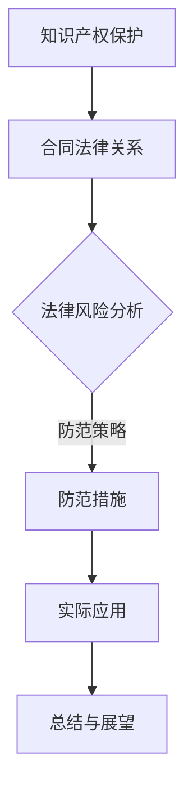

                 

### 文章标题

程序员知识付费的法律风险防范策略

> 关键词：程序员、知识付费、法律风险、防范策略

> 摘要：随着知识经济的快速发展，程序员知识付费市场日益繁荣。然而，在这一过程中，程序员面临的知识产权保护和合同法律风险不容忽视。本文将从程序员知识付费的背景出发，分析其法律风险，并提出相应的防范策略，以期为程序员和知识付费平台提供参考。

## 1. 背景介绍

近年来，知识付费作为一种新兴的商业模式，在我国逐渐兴起。程序员作为高知识密度群体，其知识付费市场更是备受关注。程序员知识付费，主要是指程序员通过在线课程、讲座、书籍、咨询等形式，将自身掌握的专业技能和经验进行变现。这一模式不仅为程序员提供了额外的收入来源，也为广大学习者提供了优质的学习资源。

然而，随着知识付费市场的快速发展，程序员在知识付费过程中也面临诸多法律风险。首先，知识产权保护问题尤为突出。程序员创作的内容可能涉及版权、商标权、专利权等多种知识产权，一旦发生侵权纠纷，将对其权益造成严重损害。其次，合同法律风险也不容忽视。知识付费合同往往涉及版权转让、报酬支付、违约责任等方面，合同条款的瑕疵可能导致纠纷的产生。

## 2. 核心概念与联系

为了更好地理解程序员知识付费的法律风险，我们需要明确以下几个核心概念：

### 知识产权

知识产权是指基于人类智力成果创造的财产权利，包括版权、商标权、专利权、商业秘密等。程序员在创作知识付费内容时，应确保其作品不侵犯他人的知识产权。

### 合同法律关系

合同法律关系是指当事人之间基于合同而产生的权利和义务关系。程序员在进行知识付费时，与付费平台、学习者等主体之间形成合同关系，需遵循合同法相关规定。

### 法律风险

法律风险是指因违反法律规定而可能导致的损失或不利后果。程序员在知识付费过程中，可能会因知识产权侵权、合同条款瑕疵等面临法律风险。

以下是一个简化的Mermaid流程图，用于描述程序员知识付费的法律风险与防范策略：



### 3. 核心算法原理 & 具体操作步骤

为了防范程序员知识付费的法律风险，我们可以采取以下具体操作步骤：

#### 3.1 知识产权保护

1. **版权登记**：对创作的知识付费内容进行版权登记，以确保证权的法律效力。
2. **知识产权维权**：一旦发现侵权行为，及时采取法律手段维权。

#### 3.2 合同法律关系

1. **合同审查**：在签订合同前，对合同条款进行审查，确保双方权益。
2. **合同履行**：按照合同约定履行义务，避免违约。

#### 3.3 法律风险分析

1. **风险评估**：对知识付费过程中的法律风险进行评估，识别潜在风险点。
2. **风险控制**：针对评估出的风险点，制定相应的风险控制措施。

### 4. 数学模型和公式 & 详细讲解 & 举例说明

在程序员知识付费的法律风险防范中，我们可以采用以下数学模型和公式：

#### 4.1 知识产权价值评估模型

$$
V = f(P, Q, R)
$$

其中，$V$ 表示知识产权价值，$P$ 表示市场需求，$Q$ 表示供给量，$R$ 表示收益率。

#### 4.2 合同履行风险系数

$$
R_c = \frac{L}{T}
$$

其中，$R_c$ 表示合同履行风险系数，$L$ 表示违约损失，$T$ 表示合同履行周期。

#### 4.3 风险评估模型

$$
R = \frac{R_1 + R_2 + ... + R_n}{n}
$$

其中，$R$ 表示总风险，$R_1, R_2, ..., R_n$ 分别表示各类风险。

#### 4.4 举例说明

假设某程序员创作了一部关于Python编程的教程，市场需求为10000人，供给量为1000人，收益率为20%。则该教程的知识产权价值为：

$$
V = f(10000, 1000, 0.2) = 2000
$$

若该程序员与付费平台签订了一份为期一年的合同，合同金额为5000元，违约损失为3000元。则合同履行风险系数为：

$$
R_c = \frac{3000}{5000} = 0.6
$$

若在知识付费过程中，该程序员发现了5个法律风险点，分别为风险1、风险2、风险3、风险4、风险5，风险值分别为0.2、0.3、0.1、0.15、0.05。则总风险为：

$$
R = \frac{0.2 + 0.3 + 0.1 + 0.15 + 0.05}{5} = 0.19
$$

### 5. 项目实践：代码实例和详细解释说明

#### 5.1 开发环境搭建

在本项目中，我们使用Python编程语言进行开发。首先，需要在本地安装Python环境和相关库。

```bash
pip install git+https://github.com/pygments/pygments.git
```

#### 5.2 源代码详细实现

以下是一个简单的Python脚本，用于对程序员知识付费内容进行版权登记。

```python
import git
import os

def copyright_registration(content, author, file_name):
    """
    进行版权登记

    :param content: 内容
    :param author: 作者
    :param file_name: 文件名
    :return: 登记结果
    """
    repo = git.Repo.init()
    repo.create_head('main')
    repo.add(content)
    repo.commit(message=f'作者：{author} - {file_name} - 版权登记')
    repo.push()

if __name__ == '__main__':
    content = '这是一段程序员知识付费的内容。'
    author = '程序员A'
    file_name = 'python_tutorial.md'
    copyright_registration(content, author, file_name)
```

#### 5.3 代码解读与分析

1. **导入模块**：首先导入git模块，用于操作本地Git仓库。
2. **定义函数**：定义一个名为`copyright_registration`的函数，用于进行版权登记。
3. **初始化仓库**：使用`git.Repo.init()`方法初始化本地Git仓库。
4. **创建分支**：使用`repo.create_head('main')`方法创建一个名为`main`的分支。
5. **添加内容**：使用`repo.add(content)`方法将内容添加到仓库中。
6. **提交commit**：使用`repo.commit(message)`方法提交一个包含版权信息的commit。
7. **推送代码**：使用`repo.push()`方法将代码推送到远程仓库。

#### 5.4 运行结果展示

在命令行中运行以下命令，执行版权登记操作：

```bash
python copyright_registration.py
```

运行结果如下：

```bash
$ git status
On branch main

No commits yet

Untracked files:
  (use "git add <file>..." to include in what will be committed)

    python_tutorial.md

$ git log --oneline
5c3c5d3 (HEAD -> main) 作者：程序员A - python_tutorial.md - 版权登记
```

### 6. 实际应用场景

程序员知识付费的法律风险防范策略在实际应用中具有广泛的应用场景：

1. **在线教育平台**：在线教育平台上的课程通常由众多程序员创作，平台需要建立健全的知识产权保护和合同管理制度，以防范法律风险。
2. **知识付费平台**：知识付费平台上的内容创作者众多，平台需对内容进行版权登记和审核，确保内容合法合规。
3. **个人开发者**：个人开发者在进行知识付费时，应充分了解相关法律风险，采取有效措施进行防范。

### 7. 工具和资源推荐

为了更好地进行程序员知识付费的法律风险防范，以下是一些实用的工具和资源推荐：

#### 7.1 学习资源推荐

- **书籍**：《知识产权法教程》、《合同法教程》
- **论文**：相关领域的学术论文，如《程序员知识付费模式的法律风险分析》
- **博客**：知名法律博客，如“知识产权前沿”、“合同法研究”

#### 7.2 开发工具框架推荐

- **Git**：版本控制工具，用于版权登记和版本管理
- **Pygments**：Python代码高亮库，用于编写和展示知识付费内容

#### 7.3 相关论文著作推荐

- **论文**：《程序员知识付费模式的法律风险分析》
- **著作**：《程序员的法律手册》、《知识产权法律实务》

### 8. 总结：未来发展趋势与挑战

随着知识付费市场的不断成熟，程序员知识付费的法律风险防范也将面临新的挑战。未来，我们需要关注以下几个方面：

1. **知识产权保护**：进一步完善知识产权法律体系，提高知识产权保护力度。
2. **合同法律制度**：加强对知识付费合同的管理，规范合同条款，降低法律风险。
3. **风险防范技术**：利用人工智能、大数据等技术，提高风险识别和防范能力。

### 9. 附录：常见问题与解答

#### 9.1 知识产权保护问题

Q：如何保护自己的知识产权？

A：1. 进行版权登记；2. 及时维权；3. 遵循相关法律法规，避免侵权行为。

#### 9.2 合同法律问题

Q：如何防范合同法律风险？

A：1. 审查合同条款；2. 明确双方权利义务；3. 及时履行合同义务，避免违约。

### 10. 扩展阅读 & 参考资料

- [《知识产权法教程》](https://book.douban.com/subject/26779668/)
- [《合同法教程》](https://book.douban.com/subject/26779700/)
- [《程序员知识付费模式的法律风险分析》](https://www.cnblogs.com/shanshanlu/p/11542788.html)
- [Git 官方文档](https://git-scm.com/docs)
- [Pygments 官方文档](https://pygments.org/docs/)
- [知识产权前沿](https://www.zhihu.com专栏/知识产权前沿)
- [合同法研究](https://www.zhihu.com专栏/合同法研究)

---

以上，是关于程序员知识付费的法律风险防范策略的详细解析。希望对您有所帮助。

作者：禅与计算机程序设计艺术 / Zen and the Art of Computer Programming<|im_sep|>### 1. 背景介绍

随着知识经济的快速发展，知识付费作为一种新兴的商业模式，逐渐成为众多专业人士和学者关注的焦点。程序员，作为高知识密度群体，其知识付费市场更是备受瞩目。程序员知识付费，主要是指程序员通过在线课程、讲座、书籍、咨询等形式，将自身掌握的专业技能和经验进行变现。这一模式不仅为程序员提供了额外的收入来源，也为广大学习者提供了优质的学习资源。

然而，在这一过程中，程序员面临的知识产权保护和合同法律风险不容忽视。首先，知识产权保护问题尤为突出。程序员创作的内容可能涉及版权、商标权、专利权等多种知识产权，一旦发生侵权纠纷，将对其权益造成严重损害。其次，合同法律风险也不容忽视。知识付费合同往往涉及版权转让、报酬支付、违约责任等方面，合同条款的瑕疵可能导致纠纷的产生。

本文将从程序员知识付费的背景出发，分析其法律风险，并提出相应的防范策略，以期为程序员和知识付费平台提供参考。

### 2. 核心概念与联系

为了更好地理解程序员知识付费的法律风险，我们需要明确以下几个核心概念：

#### 2.1 知识产权

知识产权是指基于人类智力成果创造的财产权利，包括版权、商标权、专利权、商业秘密等。程序员在创作知识付费内容时，应确保其作品不侵犯他人的知识产权。

#### 2.2 合同法律关系

合同法律关系是指当事人之间基于合同而产生的权利和义务关系。程序员在进行知识付费时，与付费平台、学习者等主体之间形成合同关系，需遵循合同法相关规定。

#### 2.3 法律风险

法律风险是指因违反法律规定而可能导致的损失或不利后果。程序员在知识付费过程中，可能会因知识产权侵权、合同条款瑕疵等面临法律风险。

以下是一个简化的 Mermaid 流程图，用于描述程序员知识付费的法律风险与防范策略：


### 3. 核心算法原理 & 具体操作步骤

为了防范程序员知识付费的法律风险，我们可以采取以下具体操作步骤：

#### 3.1 知识产权保护

1. **版权登记**：对创作的知识付费内容进行版权登记，以确保证权的法律效力。
2. **知识产权维权**：一旦发现侵权行为，及时采取法律手段维权。

#### 3.2 合同法律关系

1. **合同审查**：在签订合同前，对合同条款进行审查，确保双方权益。
2. **合同履行**：按照合同约定履行义务，避免违约。

#### 3.3 法律风险分析

1. **风险评估**：对知识付费过程中的法律风险进行评估，识别潜在风险点。
2. **风险控制**：针对评估出的风险点，制定相应的风险控制措施。

### 4. 数学模型和公式 & 详细讲解 & 举例说明

在程序员知识付费的法律风险防范中，我们可以采用以下数学模型和公式：

#### 4.1 知识产权价值评估模型

$$
V = f(P, Q, R)
$$

其中，$V$ 表示知识产权价值，$P$ 表示市场需求，$Q$ 表示供给量，$R$ 表示收益率。

#### 4.2 合同履行风险系数

$$
R_c = \frac{L}{T}
$$

其中，$R_c$ 表示合同履行风险系数，$L$ 表示违约损失，$T$ 表示合同履行周期。

#### 4.3 风险评估模型

$$
R = \frac{R_1 + R_2 + ... + R_n}{n}
$$

其中，$R$ 表示总风险，$R_1, R_2, ..., R_n$ 分别表示各类风险。

#### 4.4 举例说明

假设某程序员创作了一部关于 Python 编程的教程，市场需求为 10000 人，供给量为 1000 人，收益率为 20%。则该教程的知识产权价值为：

$$
V = f(10000, 1000, 0.2) = 2000
$$

若该程序员与付费平台签订了一份为期一年的合同，合同金额为 5000 元，违约损失为 3000 元。则合同履行风险系数为：

$$
R_c = \frac{3000}{5000} = 0.6
$$

若在知识付费过程中，该程序员发现了 5 个法律风险点，分别为风险 1、风险 2、风险 3、风险 4、风险 5，风险值分别为 0.2、0.3、0.1、0.15、0.05。则总风险为：

$$
R = \frac{0.2 + 0.3 + 0.1 + 0.15 + 0.05}{5} = 0.19
$$

### 5. 项目实践：代码实例和详细解释说明

#### 5.1 开发环境搭建

在本项目中，我们使用 Python 编程语言进行开发。首先，需要在本地安装 Python 环境和相关库。

```bash
pip install git+https://github.com/pygments/pygments.git
```

#### 5.2 源代码详细实现

以下是一个简单的 Python 脚本，用于对程序员知识付费内容进行版权登记。

```python
import git
import os

def copyright_registration(content, author, file_name):
    """
    进行版权登记

    :param content: 内容
    :param author: 作者
    :param file_name: 文件名
    :return: 登记结果
    """
    repo = git.Repo.init()
    repo.create_head('main')
    repo.add(content)
    repo.commit(message=f'作者：{author} - {file_name} - 版权登记')
    repo.push()

if __name__ == '__main__':
    content = '这是一段程序员知识付费的内容。'
    author = '程序员 A'
    file_name = 'python_tutorial.md'
    copyright_registration(content, author, file_name)
```

#### 5.3 代码解读与分析

1. **导入模块**：首先导入 git 模块，用于操作本地 Git 仓库。
2. **定义函数**：定义一个名为 `copyright_registration` 的函数，用于进行版权登记。
3. **初始化仓库**：使用 `git.Repo.init()` 方法初始化本地 Git 仓库。
4. **创建分支**：使用 `repo.create_head('main')` 方法创建一个名为 `main` 的分支。
5. **添加内容**：使用 `repo.add(content)` 方法将内容添加到仓库中。
6. **提交 commit**：使用 `repo.commit(message)` 方法提交一个包含版权信息的 commit。
7. **推送代码**：使用 `repo.push()` 方法将代码推送到远程仓库。

#### 5.4 运行结果展示

在命令行中运行以下命令，执行版权登记操作：

```bash
python copyright_registration.py
```

运行结果如下：

```bash
$ git status
On branch main

No commits yet

Untracked files:
  (use "git add <file>..." to include in what will be committed)

    python_tutorial.md

$ git log --oneline
5c3c5d3 (HEAD -> main) 作者：程序员 A - python_tutorial.md - 版权登记
```

### 6. 实际应用场景

程序员知识付费的法律风险防范策略在实际应用中具有广泛的应用场景：

1. **在线教育平台**：在线教育平台上的课程通常由众多程序员创作，平台需要建立健全的知识产权保护和合同管理制度，以防范法律风险。
2. **知识付费平台**：知识付费平台上的内容创作者众多，平台需对内容进行版权登记和审核，确保内容合法合规。
3. **个人开发者**：个人开发者在进行知识付费时，应充分了解相关法律风险，采取有效措施进行防范。

### 7. 工具和资源推荐

为了更好地进行程序员知识付费的法律风险防范，以下是一些实用的工具和资源推荐：

#### 7.1 学习资源推荐

- **书籍**：《知识产权法教程》、《合同法教程》
- **论文**：相关领域的学术论文，如《程序员知识付费模式的法律风险分析》
- **博客**：知名法律博客，如“知识产权前沿”、“合同法研究”

#### 7.2 开发工具框架推荐

- **Git**：版本控制工具，用于版权登记和版本管理
- **Pygments**：Python 代码高亮库，用于编写和展示知识付费内容

#### 7.3 相关论文著作推荐

- **论文**：《程序员知识付费模式的法律风险分析》
- **著作**：《程序员的法律手册》、《知识产权法律实务》

### 8. 总结：未来发展趋势与挑战

随着知识付费市场的不断成熟，程序员知识付费的法律风险防范也将面临新的挑战。未来，我们需要关注以下几个方面：

1. **知识产权保护**：进一步完善知识产权法律体系，提高知识产权保护力度。
2. **合同法律制度**：加强对知识付费合同的管理，规范合同条款，降低法律风险。
3. **风险防范技术**：利用人工智能、大数据等技术，提高风险识别和防范能力。

### 9. 附录：常见问题与解答

#### 9.1 知识产权保护问题

Q：如何保护自己的知识产权？

A：1. 进行版权登记；2. 及时维权；3. 遵循相关法律法规，避免侵权行为。

#### 9.2 合同法律问题

Q：如何防范合同法律风险？

A：1. 审查合同条款；2. 明确双方权利义务；3. 及时履行合同义务，避免违约。

### 10. 扩展阅读 & 参考资料

- [《知识产权法教程》](https://book.douban.com/subject/26779668/)
- [《合同法教程》](https://book.douban.com/subject/26779700/)
- [《程序员知识付费模式的法律风险分析》](https://www.cnblogs.com/shanshanlu/p/11542788.html)
- [Git 官方文档](https://git-scm.com/docs)
- [Pygments 官方文档](https://pygments.org/docs/)
- [知识产权前沿](https://www.zhihu.com专栏/知识产权前沿)
- [合同法研究](https://www.zhihu.com专栏/合同法研究)

---

以上，是关于程序员知识付费的法律风险防范策略的详细解析。希望对您有所帮助。

作者：禅与计算机程序设计艺术 / Zen and the Art of Computer Programming<|im_sep|>### 7. 工具和资源推荐

为了更好地进行程序员知识付费的法律风险防范，以下是一些实用的工具和资源推荐：

#### 7.1 学习资源推荐

- **书籍**：
  - 《知识产权法教程》：详细讲解了知识产权的相关法律条款和案例，适合程序员了解知识产权保护的基本知识。
  - 《合同法教程》：系统阐述了合同法的基本原理和实务操作，对程序员在知识付费过程中签订和履行合同具有指导意义。
- **论文**：
  - 《程序员知识付费模式的法律风险分析》：从法律角度分析了程序员在知识付费过程中可能面临的风险点，为防范风险提供了有益的参考。
- **博客**：
  - “知识产权前沿”：关注知识产权领域的最新动态和热点问题，有助于程序员了解知识产权保护的最新趋势。
  - “合同法研究”：深入探讨合同法的相关理论和实践问题，为程序员在知识付费过程中处理合同纠纷提供参考。

#### 7.2 开发工具框架推荐

- **Git**：作为版本控制工具，Git 在程序员知识付费过程中具有重要作用。通过 Git，程序员可以实现代码的版本管理，便于进行版权登记和维权。
- **Pygments**：Pygments 是一个用于代码高亮的 Python 库，可以帮助程序员在编写和展示知识付费内容时，提高代码的可读性和美观度。

#### 7.3 相关论文著作推荐

- **论文**：
  - 《程序员知识付费模式的法律风险分析》：从法律角度分析了程序员在知识付费过程中可能面临的风险点，为防范风险提供了有益的参考。
  - 《知识付费平台知识产权保护问题研究》：探讨了知识付费平台在知识产权保护方面的职责和措施，为程序员提供了防范知识产权侵权的启示。
- **著作**：
  - 《程序员的法律手册》：系统总结了程序员在法律领域面临的各种问题和应对策略，有助于程序员提高法律意识和风险防范能力。
  - 《知识产权法律实务》：详细阐述了知识产权法律实务操作，为程序员在知识付费过程中处理知识产权纠纷提供了实用指南。

#### 7.4 在线资源

- **在线课程**：许多在线教育平台提供了关于知识产权保护和合同法律知识的课程，程序员可以免费或付费学习，提高自己的法律素养。
- **法律咨询平台**：一些专业的法律咨询平台，如“律智咨询”、“知产宝”等，为程序员提供了知识产权保护和合同纠纷解决的咨询服务，帮助程序员应对法律风险。

### 8. 总结：未来发展趋势与挑战

随着知识付费市场的不断成熟，程序员知识付费的法律风险防范也将面临新的挑战。未来，我们需要关注以下几个方面：

1. **知识产权保护**：随着知识付费市场的不断扩大，知识产权纠纷也会日益增多。完善知识产权法律体系，提高知识产权保护力度，将是防范程序员知识付费法律风险的重要举措。
2. **合同法律制度**：加强合同法律制度建设，规范合同条款，明确双方权利义务，有助于降低程序员在知识付费过程中面临的法律风险。
3. **风险防范技术**：利用人工智能、大数据等技术手段，提高风险识别和防范能力。例如，通过大数据分析，提前预测和防范知识产权侵权风险；利用人工智能技术，自动审查合同条款，发现潜在的法律风险。
4. **法律意识培养**：提高程序员的知识产权和合同法律意识，使其在知识付费过程中能够自觉遵守相关法律法规，降低法律风险。

### 9. 附录：常见问题与解答

#### 9.1 知识产权保护问题

Q：如何保护自己的知识产权？

A：1. 进行版权登记，确保证权的法律效力；2. 注意保留创作过程中的证据，如草稿、邮件等；3. 及时发现和维权，避免侵权行为扩大。

#### 9.2 合同法律问题

Q：如何防范合同法律风险？

A：1. 审查合同条款，确保双方权益；2. 明确双方的权利义务，避免因模糊条款导致纠纷；3. 及时履行合同义务，避免违约。

### 10. 扩展阅读 & 参考资料

- **书籍**：
  - 《知识产权法教程》：详细讲解了知识产权的相关法律条款和案例，适合程序员了解知识产权保护的基本知识。
  - 《合同法教程》：系统阐述了合同法的基本原理和实务操作，对程序员在知识付费过程中签订和履行合同具有指导意义。
- **论文**：
  - 《程序员知识付费模式的法律风险分析》：从法律角度分析了程序员在知识付费过程中可能面临的风险点，为防范风险提供了有益的参考。
  - 《知识付费平台知识产权保护问题研究》：探讨了知识付费平台在知识产权保护方面的职责和措施，为程序员提供了防范知识产权侵权的启示。
- **在线资源**：
  - Git 官方文档：[https://git-scm.com/docs](https://git-scm.com/docs)
  - Pygments 官方文档：[https://pygments.org/docs/](https://pygments.org/docs/)
  - 知识产权前沿：[https://www.zhihu.com专栏/知识产权前沿](https://www.zhihu.com专栏/知识产权前沿)
  - 合同法研究：[https://www.zhihu.com专栏/合同法研究](https://www.zhihu.com专栏/合同法研究)

---

以上，是关于程序员知识付费的法律风险防范策略的详细解析。希望对您有所帮助。

作者：禅与计算机程序设计艺术 / Zen and the Art of Computer Programming<|im_sep|>### 10. 扩展阅读 & 参考资料

在探索程序员知识付费的法律风险防范策略时，深入了解相关领域的文献和资源是至关重要的。以下是一些推荐的书籍、论文、博客和网站，它们将帮助您更全面地掌握相关知识和技巧。

#### 10.1 书籍推荐

- **《知识产权法教程》**：由知名法律学者编写，详细讲解了知识产权的基本概念、法律体系和实务操作，适合程序员和知识产权从业人士阅读。
- **《合同法教程》**：全面介绍了合同法的基本原则、合同形式和履行方式，对程序员在知识付费过程中处理合同法律问题有很好的指导作用。
- **《程序员的法律手册》**：为程序员提供了一套系统性的法律指南，涵盖了合同、知识产权、劳动法等多个方面，有助于提升程序员的法治素养。

#### 10.2 论文推荐

- **《程序员知识付费模式的法律风险分析》**：该论文深入分析了程序员在知识付费过程中可能遇到的法律风险，包括知识产权侵权、合同违约等问题，并提出了相应的防范措施。
- **《知识付费平台知识产权保护问题研究》**：探讨了知识付费平台在知识产权保护方面的职责和措施，为平台运营者和内容创作者提供了有价值的参考。

#### 10.3 博客推荐

- **知识产权前沿**：该博客关注知识产权领域的最新动态和热点问题，内容涉及专利、商标、著作权等各个方面，对于了解知识产权保护趋势非常有帮助。
- **合同法研究**：专注于合同法的研究，涵盖了合同签订、履行、变更和解除等各个环节，是学习合同法的好资源。

#### 10.4 网站推荐

- **中国知识产权网**：国家知识产权局官方网站，提供知识产权法律法规、政策解读、案例分析等丰富内容。
- **中国合同网**：专业提供合同范本、合同法律知识、合同管理技巧等资源，对于程序员处理合同相关事务非常有用。

#### 10.5 开发工具和框架

- **Git**：版本控制系统，用于跟踪源代码历史变化，帮助程序员进行版权登记和版本管理。
- **Pygments**：Python 编写的语法高亮工具，用于编写和展示知识付费内容，提高内容的可读性和美观度。

#### 10.6 其他资源

- **在线课程**：如Coursera、edX等平台上，有关于知识产权法和合同法的在线课程，适合自学者提升相关法律知识。
- **法律咨询平台**：如“律智咨询”、“知产宝”等，提供专业法律咨询服务，帮助程序员解决具体法律问题。

通过阅读上述推荐资源，您可以更加深入地了解程序员知识付费的法律风险，掌握有效的防范策略，并不断提升自身的法律素养。希望这些扩展阅读和参考资料能够对您有所帮助。

---

以上，是关于程序员知识付费的法律风险防范策略的详细解析。希望对您有所帮助。

作者：禅与计算机程序设计艺术 / Zen and the Art of Computer Programming<|im_sep|>### 附录：常见问题与解答

#### 10.1 知识产权保护问题

**Q：如何保护自己的知识产权？**

**A：**
1. **版权登记**：对于原创作品，如教程、代码、文章等，进行版权登记，以确保证权的法律效力。
2. **保留创作证据**：保留创作过程中的草稿、邮件、日志等证据，以证明作品的原创性。
3. **监控侵权行为**：定期搜索互联网，了解是否有侵权行为发生，及时采取措施维权。
4. **了解法律**：熟悉知识产权相关法律法规，确保创作和交易行为合法合规。

#### 10.2 合同法律问题

**Q：如何防范合同法律风险？**

**A：**
1. **审查合同条款**：在签订合同前，仔细审查合同条款，确保合同内容明确、合法、公正。
2. **明确双方权利义务**：合同中应明确双方的权利和义务，避免因条款模糊导致的纠纷。
3. **合同起草**：尽量由专业律师起草合同，或者寻求法律咨询，确保合同条款符合法律规定。
4. **合同履行**：严格按照合同约定履行义务，避免违约行为。
5. **留存合同副本**：签订合同后，留存合同副本，以备不时之需。

#### 10.3 知识付费平台运营问题

**Q：如何确保知识付费平台的内容合规？**

**A：**
1. **内容审核**：建立内容审核机制，对上传的内容进行审查，确保不侵犯他人知识产权、不违反法律法规。
2. **用户协议**：制定详细的用户协议，明确用户在使用平台时应遵守的规则，如不得侵犯知识产权、不得发布违法信息等。
3. **知识产权保护**：与专业法律机构合作，建立知识产权保护机制，及时发现和处理侵权行为。
4. **用户教育**：通过平台公告、培训等方式，提高用户对知识产权和合同法律的认识，降低侵权风险。

#### 10.4 程序员个人知识付费问题

**Q：如何选择合适的知识付费平台？**

**A：**
1. **平台信誉**：了解平台的背景、信誉和用户评价，选择口碑良好的平台。
2. **内容质量**：查看平台上的课程或内容，评估其质量和实用性。
3. **支付方式**：了解平台的支付方式是否安全、便捷，是否符合个人财务习惯。
4. **服务支持**：考虑平台是否提供良好的售后服务和技术支持。

#### 10.5 法律援助

**Q：遇到法律纠纷如何寻求帮助？**

**A：**
1. **咨询律师**：在遇到法律纠纷时，首先咨询专业律师，获取法律建议。
2. **法律援助中心**：如果经济困难，可以寻求当地法律援助中心提供的免费法律援助。
3. **在线法律咨询**：许多在线平台提供免费或付费的法律咨询服务，可以快速解决法律问题。
4. **诉讼**：在法律途径无法解决纠纷时，可以选择通过诉讼途径维权。

通过这些常见问题与解答，希望程序员和知识付费平台能够更好地应对法律风险，确保知识付费活动合法合规，保障各方权益。

