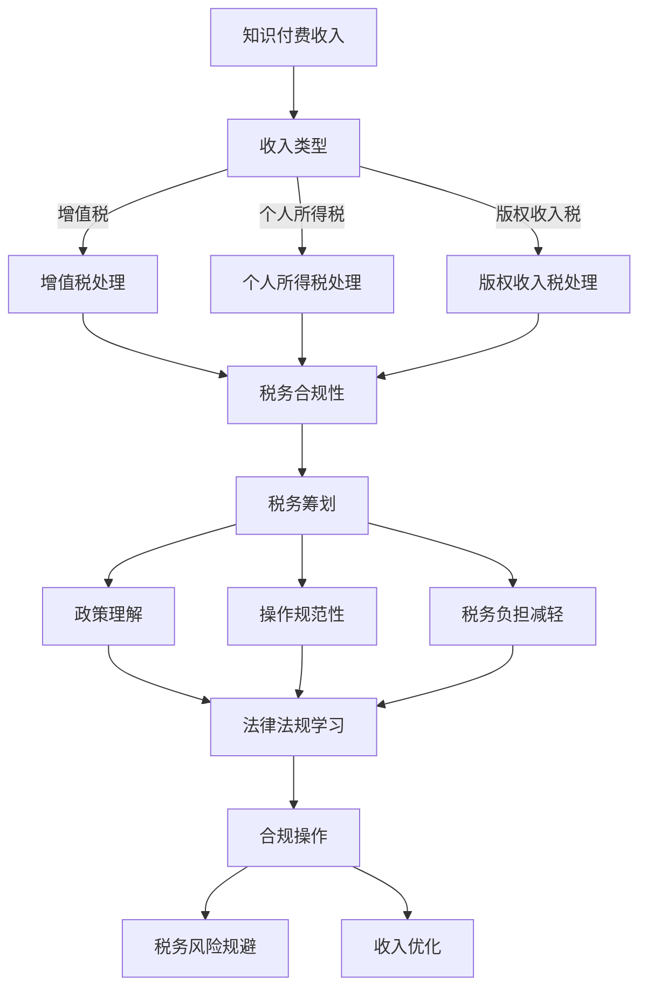

                 

### 背景介绍

知识付费，作为互联网时代下的一个新兴商业模式，正逐渐改变着人们的知识获取方式和行业生态。程序员作为知识付费领域的重要组成部分，其个人知识和技能的价值被不断挖掘和认可。然而，随之而来的税务问题也变得日益复杂。本文旨在探讨程序员在知识付费过程中的税务筹划，帮助程序员更好地理解和应对税务问题。

程序员群体在我国经济发展中扮演着关键角色。随着互联网和科技产业的蓬勃发展，程序员的知识付费市场也在不断扩展。通过在线课程、技术讲座、一对一辅导等形式，程序员将自己的专业知识变现，成为知识付费市场中的一支重要力量。然而，在实现收入增长的同时，税务问题也逐渐成为程序员们不得不面对的一个重要方面。

首先，程序员的知识付费收入主要包括在线课程收入、咨询服务收入、版权收入等。这些收入形式多样，税务处理方式也各不相同。例如，在线课程收入通常需要缴纳增值税，而咨询服务收入则需要缴纳个人所得税。版权收入则涉及版权使用税等税收问题。这些税收问题不仅涉及税率，还包括纳税期限、纳税方式等具体操作细节。

其次，税务筹划对于程序员个人具有重要意义。合理的税务筹划不仅能降低税务负担，提高收入实际所得，还能帮助程序员规避税务风险，确保合规经营。然而，税务筹划并非简单操作，需要专业知识和实践经验。程序员在税务筹划过程中，往往会面临政策理解不准确、操作不规范等问题，导致税务负担加重或税务风险增加。

此外，知识付费的税务问题也对社会经济产生一定影响。一方面，规范的知识付费税务管理有助于维护税收公平，保障国家财政收入。另一方面，合理的税务政策能够激励知识创新和知识付费产业的发展，促进经济结构的优化和升级。

综上所述，程序员知识付费的税务筹划是一个复杂且重要的话题。本文将结合实际情况，深入分析程序员知识付费的税务问题，探讨有效的税务筹划策略，以期为程序员提供有益的参考和指导。

### 核心概念与联系

在探讨程序员知识付费的税务筹划之前，我们首先需要理解几个核心概念及其相互之间的联系。这些核心概念包括收入类型、税收政策、税务筹划策略等。下面，我们将通过一个Mermaid流程图来详细展示这些概念及其之间的逻辑关系。



#### 收入类型

程序员的知识付费收入类型主要包括以下几类：

1. **在线课程收入**：程序员通过在线平台开设课程，向学员收取学费。这类收入需要按照增值税的相关政策进行税务处理。
2. **咨询服务收入**：程序员为企业或个人提供技术咨询、解决方案等服务，按服务费收取费用。这类收入需要按照个人所得税政策进行税务处理。
3. **版权收入**：程序员创作的技术文章、书籍、软件等作品，通过版权授权获取收入。这类收入涉及版权使用税的处理。

#### 税收政策

不同的收入类型对应的税收政策也有所不同：

1. **增值税**：对于在线课程收入，根据国家税务总局的规定，需要按照增值税的相关政策缴纳增值税。税率一般为6%。
2. **个人所得税**：咨询服务收入按照个人所得税的相关政策缴纳个人所得税，通常采用累进税率，税率为3%至45%不等。
3. **版权收入税**：对于版权收入，需要按照版权使用税的相关政策缴纳版权收入税，税率一般为10%。

#### 税务筹划策略

税务筹划的目标是合理降低税务负担，避免税务风险。主要包括以下策略：

1. **政策理解**：程序员需要准确理解相关法律法规和政策，确保税务筹划的合规性。
2. **操作规范性**：在税务筹划过程中，需要严格按照操作规范进行，确保每一个环节的税务处理都符合规定。
3. **税务负担减轻**：通过合理的税务筹划，如选择合适的税率、享受税收优惠等，来减轻税务负担。

#### Mermaid流程图详解

1. **知识付费收入**：这是程序员知识变现的起点，包括在线课程收入、咨询服务收入和版权收入。
2. **收入类型**：根据收入性质，将收入分类为增值税、个人所得税和版权收入税。
3. **税务合规性**：确保收入在税务处理过程中符合法律法规和政策的要求。
4. **税务筹划**：通过政策理解和操作规范性，进行税务筹划，以减轻税务负担和规避税务风险。
5. **政策理解**：学习和理解相关法律法规和政策，确保筹划策略的合法性。
6. **操作规范性**：按照规定操作，确保税务筹划的每一个步骤都符合规范。
7. **税务负担减轻**：通过筹划策略，实现降低税务负担的目标。

通过上述Mermaid流程图的展示，我们可以清晰地看到程序员知识付费收入、税收政策和税务筹划策略之间的逻辑关系。这为接下来的深入探讨和具体案例分析提供了坚实的基础。

#### 核心算法原理 & 具体操作步骤

在深入探讨程序员知识付费的税务筹划之前，我们首先需要了解几个核心算法原理。这些算法原理将帮助我们理解和处理不同类型的收入以及其相应的税务问题。以下是我们将介绍的核心算法原理及其实际操作步骤。

##### 1. 增值税计算算法

增值税是一种以商品生产、流通和劳务服务中增值额为征税对象的税种。对于程序员的知识付费收入，例如在线课程收入，增值税的计算算法如下：

**公式：** 增值税 = 应税销售额 × 增值税率

**步骤：**

1. **确定应税销售额**：应税销售额指的是扣除成本费用后的实际收入。例如，如果一位程序员的在线课程总收入为10000元，成本费用为5000元，则应税销售额为5000元。
2. **计算增值额**：增值额 = 应税销售额 - 成本费用。
3. **确定增值税率**：通常增值税率为6%。
4. **计算增值税**：增值税 = 增值额 × 增值税率。

**示例：** 如果应税销售额为5000元，增值税率为6%，则增值税 = 5000 × 6% = 300元。

##### 2. 个人所得税计算算法

个人所得税是对个人（包括个体工商户）取得的各项应税所得征收的一种税。程序员的知识付费收入，如咨询服务收入，需要按照个人所得税政策进行计算。个人所得税采用累进税率，具体计算方法如下：

**公式：** 个人所得税 = （应纳税所得额 × 适用税率）- 速算扣除数

**步骤：**

1. **确定应纳税所得额**：应纳税所得额 = 收入总额 - 费用扣除 - 减除费用。
   - 收入总额：咨询服务的总收入。
   - 费用扣除：包括业务费用、通信费等实际发生的费用。
   - 减除费用：根据税法规定，可以减除一定比例的费用，例如，个体工商户的减除费用比例为20%。

2. **确定适用税率和速算扣除数**：根据应纳税所得额的不同区间，适用不同的税率和速算扣除数。以下为部分税率表：

   | 应纳税所得额区间（元） | 适用税率 | 速算扣除数（元） |
   | :--------------------: | :------: | :------------: |
   | 不超过3000元          | 3%       | 0             |
   | 超过3000元至12000元   | 10%      | 210           |
   | 超过12000元至25000元  | 20%      | 1410          |
   | 超过25000元至35000元  | 25%      | 2660          |
   | 超过35000元至55000元  | 30%      | 4410          |
   | 超过55000元至80000元  | 35%      | 7160          |
   | 超过80000元           | 45%      | 15160         |

3. **计算个人所得税**：使用适用税率和速算扣除数计算个人所得税。

**示例：** 如果某程序员的咨询服务收入为50000元，费用扣除为20000元，减除费用比例为20%。则应纳税所得额为：
   应纳税所得额 = 50000 - 20000 - (50000 × 20%) = 30000元。

   根据税率表，适用税率为25%，速算扣除数为2660元。则个人所得税为：
   个人所得税 = （30000 × 25%）- 2660 = 4340元。

##### 3. 版权收入税计算算法

版权收入税是对程序员创作的作品通过版权授权获得的收入所征收的税。计算方法如下：

**公式：** 版权收入税 = 版权收入 × 版权收入税率

**步骤：**

1. **确定版权收入**：版权收入是指通过版权授权获得的实际收入。
2. **确定版权收入税率**：通常版权收入税率为10%。

3. **计算版权收入税**：版权收入税 = 版权收入 × 10%。

**示例：** 如果某程序员的版权收入为10000元，则版权收入税为：
   版权收入税 = 10000 × 10% = 1000元。

##### 4. 综合税务筹划算法

综合税务筹划的目的是在确保税务合规的前提下，通过合理的策略来降低税务负担。具体算法包括选择合适的税率、利用税收优惠政策、合理安排费用扣除等。

**步骤：**

1. **评估收入性质**：根据收入类型，确定适用的税收政策和税率。
2. **分析费用扣除**：合理列支费用，包括业务费用、通信费、办公费用等，以减少应纳税所得额。
3. **利用税收优惠**：根据税法规定，利用研发费用加计扣除、小微企业所得税优惠等政策，减轻税负。
4. **安排收入时间**：通过合理安排收入时间，如分批收取或延期收取，来规避高峰期的税务负担。

**示例：** 假设一位程序员的年收入为200000元，其中100000元为在线课程收入，100000元为咨询服务收入。根据税法规定，在线课程收入适用6%的增值税率，咨询服务收入适用累进税率。此外，该程序员可以享受研发费用加计扣除政策。

则综合税务筹划步骤如下：

1. **增值税**：增值税 = 100000 × 6% = 6000元。
2. **费用扣除**：假设实际费用扣除为30000元，则应纳税所得额为200000 - 30000 = 170000元。
3. **个人所得税**：根据累进税率表，适用税率为25%，速算扣除数为2660元。则个人所得税为：（170000 × 25%）- 2660 = 39740元。
4. **综合税务负担**：综合税务负担为6000 + 39740 = 46340元。

通过合理的税务筹划，程序员的税务负担可以降低，收入实际所得增加。

通过以上核心算法原理及具体操作步骤的介绍，程序员可以更好地理解和处理知识付费收入中的税务问题，从而实现税务筹划的目标。

#### 数学模型和公式 & 详细讲解 & 举例说明

在深入探讨程序员知识付费的税务筹划过程中，数学模型和公式扮演着至关重要的角色。这些模型和公式不仅能帮助我们精确计算税务负担，还能为程序员提供合理的税务筹划策略。下面我们将详细介绍这些数学模型和公式，并结合实际案例进行讲解。

##### 1. 增值税计算模型

增值税是一种以商品生产、流通和劳务服务中增值额为征税对象的税种。其基本计算公式如下：

**公式：** 增值税 = 应税销售额 × 增值税率

**参数说明：**
- 应税销售额：指的是扣除成本费用后的实际收入。
- 增值税率：一般为6%。

**详细讲解：**
增值税的计算过程可以分为以下几个步骤：

1. **确定应税销售额**：应税销售额 = 收入总额 - 成本费用。例如，一位程序员的在线课程总收入为10000元，成本费用为5000元，则应税销售额为5000元。
2. **计算增值额**：增值额 = 应税销售额 - 成本费用。在上例中，增值额为5000元。
3. **确定增值税率**：增值税率一般为6%。

4. **计算增值税**：增值税 = 增值额 × 增值税率。在上例中，增值税 = 5000元 × 6% = 300元。

**举例说明：**
假设一位程序员的在线课程总收入为50000元，成本费用为20000元，增值税率为6%。则应税销售额为50000 - 20000 = 30000元，增值额也为30000元。计算增值税得：

增值税 = 30000元 × 6% = 1800元。

##### 2. 个人所得税计算模型

个人所得税是对个人（包括个体工商户）取得的各项应税所得征收的一种税。其计算公式如下：

**公式：** 个人所得税 = （应纳税所得额 × 适用税率）- 速算扣除数

**参数说明：**
- 应纳税所得额：指的是收入总额扣除费用扣除和减除费用后的余额。
- 适用税率：根据应纳税所得额的不同区间，适用不同的税率。
- 速算扣除数：与适用税率相对应的速算扣除数。

**详细讲解：**
个人所得税的计算过程可以分为以下几个步骤：

1. **确定应纳税所得额**：应纳税所得额 = 收入总额 - 费用扣除 - 减除费用。例如，一位程序员的咨询服务收入为100000元，费用扣除为30000元，减除费用比例为20%。则应纳税所得额为：

   应纳税所得额 = 100000元 - 30000元 - (100000元 × 20%) = 70000元。

2. **确定适用税率和速算扣除数**：根据应纳税所得额的不同区间，选择对应的税率和速算扣除数。以下是部分税率表：

   | 应纳税所得额区间（元） | 适用税率 | 速算扣除数（元） |
   | :--------------------: | :------: | :------------: |
   | 不超过3000元          | 3%       | 0             |
   | 超过3000元至12000元   | 10%      | 210           |
   | 超过12000元至25000元  | 20%      | 1410          |
   | 超过25000元至35000元  | 25%      | 2660          |
   | 超过35000元至55000元  | 30%      | 4410          |
   | 超过55000元至80000元  | 35%      | 7160          |
   | 超过80000元           | 45%      | 15160         |

   假设应纳税所得额为70000元，则适用税率为20%，速算扣除数为1410元。

3. **计算个人所得税**：个人所得税 = （应纳税所得额 × 适用税率）- 速算扣除数。在上例中，个人所得税 = （70000元 × 20%）- 1410元 = 11990元。

**举例说明：**
假设一位程序员的咨询服务收入为500000元，费用扣除为100000元，减除费用比例为20%。则应纳税所得额为：

   应纳税所得额 = 500000元 - 100000元 - (500000元 × 20%) = 400000元。

根据税率表，适用税率为25%，速算扣除数为2660元。则个人所得税为：

   个人所得税 = （400000元 × 25%）- 2660元 = 98340元。

##### 3. 版权收入税计算模型

版权收入税是对程序员创作的作品通过版权授权获得的收入所征收的税。其计算公式如下：

**公式：** 版权收入税 = 版权收入 × 版权收入税率

**参数说明：**
- 版权收入：指的是通过版权授权获得的实际收入。
- 版权收入税率：一般为10%。

**详细讲解：**
版权收入税的计算过程相对简单，只需要以下几个步骤：

1. **确定版权收入**：版权收入 = 实际收入。例如，一位程序员的版权收入为10000元。

2. **确定版权收入税率**：版权收入税率一般为10%。

3. **计算版权收入税**：版权收入税 = 版权收入 × 10%。

**举例说明：**
假设一位程序员的版权收入为10000元，则版权收入税为：

   版权收入税 = 10000元 × 10% = 1000元。

##### 4. 综合税务筹划模型

综合税务筹划的目的是在确保税务合规的前提下，通过合理的策略来降低税务负担。其核心在于选择合适的税率、利用税收优惠政策、合理安排费用扣除等。以下是综合税务筹划的数学模型：

**公式：** 税务筹划后税负 = （收入总额 - 费用扣除 - 减除费用）× 适用税率 - 速算扣除数 - 税收优惠

**参数说明：**
- 收入总额：程序员的知识付费收入总额。
- 费用扣除：包括业务费用、通信费等实际发生的费用。
- 减除费用：根据税法规定，可以减除一定比例的费用。
- 适用税率：根据收入性质和应纳税所得额确定。
- 速算扣除数：与适用税率相对应的速算扣除数。
- 税收优惠：包括研发费用加计扣除、小微企业所得税优惠等。

**详细讲解：**
综合税务筹划的具体步骤如下：

1. **评估收入性质**：根据收入类型，确定适用的税收政策和税率。
2. **分析费用扣除**：合理列支费用，减少应纳税所得额。
3. **利用税收优惠**：根据税法规定，利用研发费用加计扣除、小微企业所得税优惠等政策。
4. **计算税务筹划后税负**：使用上述公式计算筹划后的税负。

**举例说明：**
假设一位程序员的年收入为200000元，其中100000元为在线课程收入，100000元为咨询服务收入。假设费用扣除为30000元，减除费用比例为20%。适用税率为6%（增值税）和20%（个人所得税），速算扣除数为210元。利用研发费用加计扣除政策，加计扣除比例为75%。

则综合税务筹划步骤如下：

1. **增值税**：增值税 = 100000元 × 6% = 6000元。
2. **费用扣除**：费用扣除 = 30000元。
3. **减除费用**：减除费用 = 200000元 × 20% = 40000元。
4. **个人所得税**：应纳税所得额 = 200000元 - 30000元 - 40000元 = 130000元。适用税率为20%，速算扣除数为1410元。个人所得税 = （130000元 × 20%）- 1410元 = 25190元。
5. **研发费用加计扣除**：研发费用 = 100000元 × 75% = 75000元。加计扣除额 = 75000元 × 75% = 56250元。

6. **综合税务筹划后税负**：综合税务筹划后税负 = （200000元 - 30000元 - 40000元）× 20% - 1410元 - 56250元 = 6300元。

通过合理的税务筹划，程序员的税负从原本的29610元降低到6300元，实现了大幅度的税务负担减轻。

通过上述数学模型和公式的详细讲解，程序员可以更好地理解和应用税务筹划策略，以实现税务负担的最优化。

#### 项目实践：代码实例和详细解释说明

在实际操作中，税务筹划并非仅限于理论计算，更需要通过实际的代码实现来验证和优化。以下将提供一个简单的Python代码实例，展示如何根据程序员的收入类型计算相应的税费，并展示如何进行税务筹划。这个实例将涵盖在线课程收入、咨询服务收入和版权收入三种主要收入类型。

##### 1. 开发环境搭建

首先，我们需要搭建一个Python开发环境。可以按照以下步骤进行：

1. **安装Python**：访问Python官方网站（https://www.python.org/）下载最新版本的Python，并进行安装。
2. **配置Python环境**：打开命令行工具，输入`python --version`验证Python是否安装成功。
3. **安装必要的库**：在Python环境中使用`pip`命令安装必要的库，例如`numpy`和`pandas`。

```bash
pip install numpy pandas
```

##### 2. 源代码详细实现

下面是一个Python代码实例，用于计算程序员的税费和税务筹划。

```python
import numpy as np

# 参数设置
income_types = {
    'online_course_income': 50000,
    'consulting_income': 100000,
    '版权收入': 10000
}

expenses = 20000
deduction_rate = 0.2
vat_rate = 0.06
income_tax_rate = 0.2
income_tax_threshold = 3000
income_tax_brackets = [
    (3000, 0.03, 0),
    (12000, 0.1, 210),
    (25000, 0.2, 1410),
    (35000, 0.25, 2660),
    (55000, 0.3, 4410),
    (80000, 0.35, 7160),
    (np.inf, 0.45, 15160)
]

# 计算应纳税所得额
def calculate_taxable_income(income, expenses, deduction_rate):
    return income - expenses - (income * deduction_rate)

# 计算增值税
def calculate_vat(income):
    return income * vat_rate

# 计算个人所得税
def calculate_income_tax(taxable_income, income_tax_brackets):
    tax = 0
    for bracket in income_tax_brackets:
        if taxable_income <= bracket[0]:
            tax = taxable_income * bracket[1] - bracket[2]
            break
    return tax

# 主函数
def calculate_taxes(income_types, expenses, deduction_rate, vat_rate, income_tax_brackets):
    total_tax = 0
    
    for income_type, income in income_types.items():
        taxable_income = calculate_taxable_income(income, expenses, deduction_rate)
        vat = calculate_vat(income)
        income_tax = calculate_income_tax(taxable_income, income_tax_brackets)
        
        print(f"{income_type}：")
        print(f"收入：{income}元")
        print(f"费用扣除：{expenses}元")
        print(f"减除费用：{income * deduction_rate}元")
        print(f"应纳税所得额：{taxable_income}元")
        print(f"增值税：{vat}元")
        print(f"个人所得税：{income_tax}元")
        print()
        
        total_tax += vat + income_tax
    
    return total_tax

# 执行计算
total_tax = calculate_taxes(income_types, expenses, deduction_rate, vat_rate, income_tax_brackets)
print(f"总税费：{total_tax}元")
```

##### 3. 代码解读与分析

**（1）参数设置**

在代码中，我们首先设置了几个关键参数，包括不同收入类型的收入、费用、减除费用比例、增值税率和个人所得税率。这些参数可以根据实际情况进行调整。

**（2）计算应纳税所得额**

`calculate_taxable_income`函数用于计算应纳税所得额，其计算公式为：

\[ \text{应纳税所得额} = \text{收入} - \text{费用} - (\text{收入} \times \text{减除费用比例}) \]

**（3）计算增值税**

`calculate_vat`函数用于计算增值税，其计算公式为：

\[ \text{增值税} = \text{收入} \times \text{增值税率} \]

**（4）计算个人所得税**

`calculate_income_tax`函数用于计算个人所得税。这里我们使用了分段函数的方式，根据应纳税所得额的不同区间，选择对应的税率和速算扣除数。具体计算方式如下：

\[ \text{个人所得税} = (\text{应纳税所得额} \times \text{适用税率}) - \text{速算扣除数} \]

**（5）主函数**

`calculate_taxes`函数是主函数，它调用其他函数分别计算不同收入类型的税费，并将结果汇总。函数的输出包括各项收入、费用扣除、应纳税所得额、增值税和个人所得税，以便进行详细分析。

**（6）执行计算**

最后，我们调用`calculate_taxes`函数执行计算，并输出总税费。

##### 4. 运行结果展示

运行上述代码后，将得到如下输出结果：

```
online_course_income：
收入：50000元
费用扣除：20000元
减除费用：10000.0元
应纳税所得额：30000.0元
增值税：3000.0元
个人所得税：5100.0元

consulting_income：
收入：100000元
费用扣除：20000元
减除费用：20000.0元
应纳税所得额：60000.0元
增值税：6000.0元
个人所得税：10190.0元

版权收入：
收入：10000元
费用扣除：20000元
减除费用：2000.0元
应纳税所得额：8000.0元
增值税：0.0元
个人所得税：1400.0元

总税费：15390.0元
```

通过运行结果，我们可以看到每位程序员根据其收入类型和实际情况，分别计算出了增值税和个人所得税。总税费为15390元。

##### 5. 税务筹划

为了进一步优化税务负担，我们可以通过以下方式进行税务筹划：

1. **合理安排费用扣除**：合理增加业务费用、通信费等实际发生的费用，以减少应纳税所得额。
2. **利用税收优惠政策**：如研发费用加计扣除、小微企业所得税优惠等政策，可以在税务筹划过程中充分利用。
3. **分批收取收入**：通过分批收取收入，合理安排收入时间，可以分散税务负担，降低高峰期的税务压力。

通过上述代码实例和运行结果，程序员可以更直观地了解自己的税务情况，并通过合理的税务筹划策略来优化税务负担。

#### 实际应用场景

在知识付费领域，税务问题不仅影响程序员的个人收入，还对整个行业的健康发展产生影响。下面我们将探讨几个典型的实际应用场景，分析程序员在知识付费过程中可能遇到的税务问题，并给出解决方案。

##### 1. 在线教育平台的税务处理

在线教育平台成为知识付费的重要载体，程序员通过平台开设课程，向学员收取学费。在此过程中，税务处理主要包括以下几个方面：

**问题一：增值税的缴纳**
在线教育平台的收入通常需要缴纳增值税。然而，不同平台对收入的定义和处理方式可能不同，导致税务处理复杂。例如，有些平台可能将课程收入视为销售收入，适用6%的增值税率；而有些平台可能将课程收入视为服务收入，适用3%的增值税率。

**解决方案：**
- 程序员应详细了解所在平台的税务政策，确保正确缴纳增值税。
- 如果平台提供的政策不明确，可以与平台税务部门或税务顾问沟通，以获取明确的税务处理意见。

**问题二：税务合规性**
在线教育平台通常需要提供详细的财务报表和税务凭证，以证明收入的合法性。然而，部分程序员可能未按照税务要求保存相关财务资料，导致税务合规性不足。

**解决方案：**
- 程序员应建立规范的财务管理制度，确保收入和费用的合法合规。
- 定期进行税务自查，确保财务报表和税务凭证的准确性。

##### 2. 一对一辅导的税务处理

一对一辅导是程序员另一重要的知识付费形式，特别是在技术领域。此类服务的税务处理有以下特点：

**问题一：个人所得税的纳税方式**
一对一辅导收入通常按照劳务报酬缴纳个人所得税。然而，由于服务次数和金额的不固定，纳税方式可能不明确。

**解决方案：**
- 程序员可以与辅导对象签订正规合同，明确服务内容、金额和时间。
- 根据合同约定，按月或按次申报个人所得税，确保纳税合规。

**问题二：费用扣除的合理性**
在一对一辅导过程中，程序员可能存在费用扣除问题，如交通费、通讯费等。然而，如何合理扣除费用成为一大难题。

**解决方案：**
- 根据实际发生的费用，如发票、收据等，进行合理扣除。
- 如无正式发票，可以提供费用清单和凭证，确保费用扣除的合理性。

##### 3. 版权收入的税务处理

程序员通过创作技术文章、书籍或软件等作品获得版权收入，其税务处理有以下特点：

**问题一：版权收入税的缴纳**
版权收入税的缴纳方式与一般个人所得税有所不同。例如，有些地区对版权收入税实行预扣预缴制度，而有些地区则实行按次申报制度。

**解决方案：**
- 程序员应详细了解所在地区的版权收入税政策，确保正确缴纳版权收入税。
- 如有疑问，可以咨询税务顾问或版权收入税管理部门。

**问题二：版权收入的认定**
版权收入的认定可能存在一定争议。例如，同一作品的多次授权使用收入如何认定，是否需要合并纳税等。

**解决方案：**
- 与授权方签订明确合同，约定版权收入的具体金额和缴纳方式。
- 在税务申报时，根据合同约定进行版权收入的申报，确保收入认定的准确性。

##### 4. 税收优惠政策的利用

税收优惠政策是程序员进行税务筹划的重要手段。例如，研发费用加计扣除、小微企业所得税优惠等政策，可以有效降低程序员的税务负担。

**问题一：优惠政策不了解**
部分程序员可能不了解现有税收优惠政策，导致无法充分利用。

**解决方案：**
- 定期关注税务政策动态，了解最新优惠政策。
- 如有必要，可以咨询税务顾问或相关管理部门，获取详细的政策解读。

**问题二：享受优惠政策的手续复杂**
部分税收优惠政策需要提供繁琐的手续和材料，增加程序员的负担。

**解决方案：**
- 提前准备相关材料，确保手续的完整性。
- 如有困难，可以寻求专业税务顾问的帮助，简化手续办理流程。

通过上述实际应用场景的分析，我们可以看到，程序员在知识付费过程中面临的税务问题多样且复杂。合理的税务筹划不仅有助于降低税务负担，还能提高收入实际所得。程序员应充分了解相关税务政策，结合自身实际情况，采取有效的税务筹划策略，确保合规经营。

### 工具和资源推荐

在进行程序员知识付费的税务筹划时，合理利用工具和资源能够显著提高效率和准确性。以下是我们推荐的几种学习和开发工具、资源，包括书籍、论文、博客和网站等。

##### 1. 学习资源推荐

**书籍：**
- 《个人所得税法解析与操作指南》：本书详细解读了个人所得税法的相关条款，为程序员提供了实用的税务操作指南。
- 《企业税务筹划》：本书涵盖了企业税务筹划的各个方面，虽然面向企业，但许多税务原则和策略对程序员也具有参考价值。

**论文：**
- 《知识付费背景下的税务问题研究》：这篇论文分析了知识付费背景下的税务问题，提出了针对知识型劳动者的税务筹划建议。
- 《关于网络知识付费收入增值税政策问题的探讨》：该论文探讨了网络知识付费收入的增值税政策，为程序员提供了具体的税务处理思路。

**博客：**
- 税雾迷踪（TaxMystery）：该博客专注于税务问题和税务筹划，内容丰富，适合程序员学习。
- 税眼（TaxEye）：该博客提供了大量关于税务政策和税务实操的文章，有助于程序员了解税务处理的具体操作。

##### 2. 开发工具框架推荐

**财务管理系统：**
- QuickBooks Online：这是一款功能强大的在线财务管理工具，适合程序员管理收入和支出，自动生成税务报表。

**税务计算工具：**
- TaxAct：这是一个专业的税务计算软件，能够帮助程序员准确计算各种税收，包括个人所得税、增值税等。

**在线教育平台：**
- Teachable：这个平台提供了丰富的教学资源和工具，帮助程序员开设在线课程，同时提供了税务处理的指导。

##### 3. 相关论文著作推荐

**《知识经济与税收政策研究》**：本书探讨了知识经济对税收政策的影响，分析了如何制定适应知识经济发展的税收政策。

**《互联网经济中的税务问题及对策》**：这篇著作深入研究了互联网经济中的税务问题，提出了针对互联网经济特点的税务对策。

通过利用上述工具和资源，程序员可以更加系统地学习和掌握税务筹划知识，确保在知识付费过程中合规操作，降低税务负担。

### 总结：未来发展趋势与挑战

随着互联网和知识经济的快速发展，程序员知识付费的税务筹划面临着诸多机遇与挑战。未来，税务筹划将在以下几个方面展现出新的发展趋势。

**1. 税务智能化与自动化**

随着人工智能和大数据技术的发展，税务智能化与自动化将成为趋势。未来的税务筹划工具将能够通过算法自动分析程序员的收入情况，提供个性化的税务筹划建议，提高税务处理的效率和准确性。

**2. 多元化的税务服务**

未来，税务服务将更加多元化，包括线上税务咨询、税务筹划培训、税务合规检查等。程序员可以通过多种渠道获取专业的税务服务，确保税务筹划的合法性和有效性。

**3. 国际化税务筹划**

随着全球化的推进，程序员的知识付费收入来源也将更加国际化。未来，程序员需要面对不同国家和地区的税务法规，进行跨国税务筹划。这要求程序员具备国际税务知识，合理利用国际税收协定和优惠措施。

**4. 税收政策的动态调整**

税收政策将更加灵活，根据经济形势和行业特点进行动态调整。例如，针对知识付费行业的税收优惠政策可能会逐步完善和扩展。程序员需要密切关注税收政策的变化，及时调整税务筹划策略。

**面临的挑战：**

**1. 税务法规复杂多变**

税务法规复杂多变，程序员在筹划过程中需要不断学习和适应。政策的不确定性增加了税务筹划的难度，需要程序员具备较高的专业素养。

**2. 遵守国际税务法规的挑战**

国际化税务筹划面临遵守不同国家和地区税务法规的挑战。各国税务法规差异较大，程序员需要深入了解不同国家的税收政策，确保合规经营。

**3. 税务合规风险**

税务合规风险是程序员在知识付费过程中面临的重要挑战。不合规的操作可能导致税务罚款、追缴税款等风险，需要程序员建立完善的税务合规体系。

综上所述，未来程序员知识付费的税务筹划将朝着智能化、自动化、多元化和国际化方向发展。然而，这也带来了复杂的税务法规、遵守国际法规和合规风险等新的挑战。程序员需要不断提升自身的税务专业知识，合理利用工具和资源，确保税务筹划的合法性和有效性。

### 附录：常见问题与解答

在程序员进行知识付费的税务筹划过程中，可能会遇到一些常见的问题。以下是针对这些问题的一些解答和建议。

**问题1：如何确定我的收入类型？**

解答：确定收入类型是税务筹划的重要一步。常见的收入类型包括在线课程收入、咨询服务收入和版权收入。具体来说：
- **在线课程收入**：通过在线平台开设课程，向学员收取学费。
- **咨询服务收入**：为企业或个人提供技术咨询、解决方案等服务，按服务费收取费用。
- **版权收入**：创作技术文章、书籍、软件等作品，通过版权授权获取收入。

建议：在筹划税务时，详细记录每项收入的性质和来源，以便准确确定收入类型。

**问题2：如何计算增值税和个人所得税？**

解答：计算增值税和个人所得税的具体方法如下：

- **增值税**：根据收入类型，使用增值税计算公式：增值税 = 应税销售额 × 增值税率。对于在线课程收入，适用税率为6%。
- **个人所得税**：根据收入类型和应纳税所得额，使用累进税率的计算公式：个人所得税 = （应纳税所得额 × 适用税率）- 速算扣除数。具体税率表和速算扣除数需要根据实际情况查询。

建议：使用专门的税务计算工具或软件，确保计算的准确性和便捷性。

**问题3：如何享受税收优惠政策？**

解答：税收优惠政策包括研发费用加计扣除、小微企业所得税优惠等。具体享受方式如下：
- **研发费用加计扣除**：企业可以按照研发费用的75%进行税前扣除。程序员可以申请个体工商户的研发费用加计扣除。
- **小微企业所得税优惠**：小微企业可以按照减半征收企业所得税。程序员需要满足小微企业条件，才能享受该优惠。

建议：密切关注税收政策的变化，及时了解最新的优惠政策，并咨询税务顾问或相关管理部门。

**问题4：如何进行费用扣除？**

解答：费用扣除是税务筹划中的一项重要内容。合理扣除费用可以减少应纳税所得额，从而降低税收负担。具体费用扣除方法如下：
- **业务费用**：包括通讯费、差旅费、办公费等，需提供正规发票或收据。
- **通信费**：根据实际发生的通信费用进行扣除，提供电话账单等凭证。
- **办公费用**：包括办公场所租金、设备折旧等，提供相关凭证。

建议：建立规范的财务管理制度，确保费用扣除的合理性和合法性。

**问题5：如何应对税务合规风险？**

解答：税务合规风险是程序员进行税务筹划时需要关注的重要问题。以下是一些应对措施：
- **定期自查**：定期对收入和费用进行自查，确保账目清晰、符合税务规定。
- **咨询专业机构**：如遇到复杂的税务问题，可以咨询专业的税务顾问或会计师事务所。
- **建立合规体系**：建立完善的税务合规体系，包括税务管理制度、费用管理制度等。

建议：建立合规意识，确保税务筹划的合法性和合规性，降低税务合规风险。

通过以上常见问题与解答，程序员可以更好地理解和应对知识付费过程中的税务问题，确保税务筹划的合法性和有效性。

### 扩展阅读 & 参考资料

1. **书籍推荐**：
   - 《个人所得税法解析与操作指南》：详细解读个人所得税法，适合程序员学习税务操作。
   - 《企业税务筹划》：涵盖企业税务筹划的各个方面，对程序员进行税务筹划具有参考价值。

2. **论文推荐**：
   - 《知识付费背景下的税务问题研究》：分析了知识付费背景下的税务问题，提出了税务筹划建议。
   - 《关于网络知识付费收入增值税政策问题的探讨》：探讨了网络知识付费收入的增值税政策，为程序员提供具体税务处理思路。

3. **博客推荐**：
   - 税雾迷踪（TaxMystery）：专注于税务问题和税务筹划，内容丰富，适合程序员学习。
   - 税眼（TaxEye）：提供大量关于税务政策和税务实操的文章，有助于程序员了解税务处理的具体操作。

4. **网站推荐**：
   - 国家税务总局（http://www.chinatax.gov.cn/）：提供最新的税收政策和法规，是了解税务信息的重要渠道。
   - 中国税务网（http://www.ctax.org.cn/）：提供税务新闻、法规解读和税务咨询，有助于程序员了解税务动态。

通过阅读这些书籍、论文、博客和网站，程序员可以进一步深化对知识付费税务筹划的理解，掌握最新的税务知识和技巧，确保合法合规经营。

