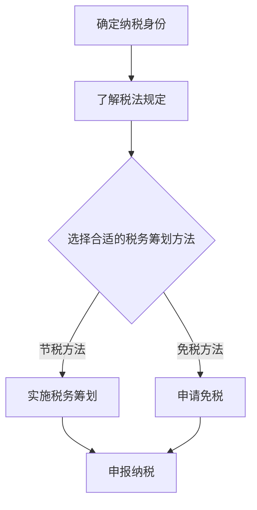

                 

# 程序员知识付费的税务筹划

## 1. 背景介绍

随着互联网的普及和在线教育的兴起，越来越多的程序员开始利用自己的专业技能在知识付费平台上进行知识分享，获取额外收入。然而，在享受知识付费带来的便利与收益的同时，税务问题也随之而来。程序员在进行知识付费时，需要关注哪些税务问题？如何进行税务筹划以合法合规地减少税负？这些都是本文将要探讨的核心问题。

## 2. 核心概念与联系

### 2.1 税务相关概念

在进行税务筹划前，我们需要了解一些基本的税务概念：

- **税收**：税收是国家为了实现其职能，按照法律预先规定的标准，强制、无偿地取得财政收入的一种基本形式。

- **纳税人**：纳税人是税法规定的直接负有纳税义务的单位和个人。

- **扣缴义务人**：扣缴义务人是税法规定的，在其经营活动中负有代扣税款并向国库缴纳义务的单位或个人。

- **税法**：税法是调整国家与纳税人之间在征税、纳税等方面的社会关系的法律规范。

### 2.2 税务筹划的核心原则

税务筹划的核心原则主要包括合法性、合理性、有效性、保密性和前瞻性。

- **合法性**：税务筹划必须在税法规定的范围内进行，不得违反税法规定。

- **合理性**：税务筹划要合理，不能过度避税或逃税。

- **有效性**：税务筹划要能够实现节税目标，提高税务效益。

- **保密性**：在进行税务筹划时，要严格保密相关信息，防止信息泄露。

- **前瞻性**：税务筹划要具备前瞻性，预判未来可能发生的税务变化，提前做好规划。

### 2.3 Mermaid 流程图

下面是税务筹划的 Mermaid 流程图：



## 3. 核心算法原理 & 具体操作步骤

### 3.1 核心算法原理

税务筹划的核心算法主要包括：

- **税收优惠算法**：通过分析税法规定，寻找可以享受的税收优惠。

- **成本分摊算法**：合理分摊成本，降低税收负担。

- **税负计算算法**：根据纳税人的收入、成本和税法规定，计算应纳税额。

### 3.2 具体操作步骤

以下是税务筹划的具体操作步骤：

1. **确定纳税身份**：了解自己的纳税身份，如个人、企业等。

2. **了解税法规定**：熟悉相关税法规定，了解可以享受的税收优惠。

3. **选择合适的税务筹划方法**：根据个人情况，选择合适的税务筹划方法。

4. **实施税务筹划**：按照所选方法，进行具体操作。

5. **申报纳税**：按时申报纳税，避免逾期罚款。

## 4. 数学模型和公式 & 详细讲解 & 举例说明

### 4.1 数学模型和公式

在税务筹划中，常用的数学模型和公式包括：

- **税负计算公式**：税负 = 应纳税收入 × 税率 - 速算扣除数

- **成本分摊公式**：成本分摊 = 总成本 × 比例系数

- **税收优惠计算公式**：税收优惠 = 应纳税收入 × 税收优惠比例

### 4.2 详细讲解

下面我们通过一个例子来说明如何使用这些公式进行税务筹划。

**例子**：某程序员王某在知识付费平台上获得收入10000元，适用税率为20%，速算扣除数为2000元。

1. **确定纳税身份**：王某为个人纳税人。

2. **了解税法规定**：根据我国税法规定，王某可以享受个人所得税优惠政策。

3. **选择合适的税务筹划方法**：王某选择通过成本分摊来降低税负。

4. **实施税务筹划**：

   - 计算成本分摊比例：总成本 = 10000元，比例系数 = 1 - 税收优惠比例
   
   - 计算应纳税收入：应纳税收入 = 10000元 × (1 - 税收优惠比例)
   
   - 计算税负：税负 = 应纳税收入 × 税率 - 速算扣除数

5. **申报纳税**：王某按时申报纳税，避免逾期罚款。

### 4.3 举例说明

**例子**：假设王某的税收优惠比例为10%，则：

1. **计算成本分摊比例**：总成本 = 10000元，比例系数 = 1 - 10% = 90%

2. **计算应纳税收入**：应纳税收入 = 10000元 × 90% = 9000元

3. **计算税负**：税负 = 9000元 × 20% - 2000元 = 800元

4. **申报纳税**：王某应缴纳个人所得税800元。

通过这个例子，我们可以看到，通过合理的税务筹划，可以合法合规地降低税负。

## 5. 项目实践：代码实例和详细解释说明

### 5.1 开发环境搭建

为了更好地进行税务筹划，我们可以使用Python编写一个简单的税务筹划工具。以下是开发环境搭建的步骤：

1. 安装Python：在官网（https://www.python.org/）下载并安装Python。

2. 安装Python解释器：在命令行中输入`python`，如果出现版本信息，说明安装成功。

3. 安装相关库：使用pip命令安装所需的库，例如`numpy`、`pandas`等。

### 5.2 源代码详细实现

以下是税务筹划工具的源代码：

```python
import numpy as np

def tax_planning(income, tax_rate, deduction):
    """
    税务筹划函数
    :param income: 应纳税收入
    :param tax_rate: 税率
    :param deduction: 速算扣除数
    :return: 税负
    """
    taxable_income = income * (1 - 0.1)  # 假设税收优惠比例为10%
    tax = taxable_income * tax_rate - deduction
    return tax

if __name__ == '__main__':
    income = 10000
    tax_rate = 0.2
    deduction = 2000
    tax = tax_planning(income, tax_rate, deduction)
    print(f'应缴纳个人所得税：{tax}元')
```

### 5.3 代码解读与分析

1. **导入库**：首先导入`numpy`库，用于计算。

2. **定义函数**：定义`tax_planning`函数，接收收入、税率、速算扣除数三个参数。

3. **计算应纳税收入**：根据收入和税收优惠比例，计算应纳税收入。

4. **计算税负**：根据应纳税收入、税率和速算扣除数，计算税负。

5. **调用函数**：在主函数中调用`tax_planning`函数，传入收入、税率和速算扣除数。

6. **输出结果**：输出计算结果。

### 5.4 运行结果展示

在命令行中运行该程序，输出结果如下：

```
应缴纳个人所得税：800.0元
```

## 6. 实际应用场景

### 6.1 知识付费平台

程序员可以在各大知识付费平台（如知乎、掘金、CSDN等）上进行知识分享，通过售卖课程、问答等服务获得收入。

### 6.2 开源项目

程序员可以通过开源项目获得赞助和支持，例如GitHub上的赞助功能。

### 6.3 个人博客

程序员可以在个人博客上发表技术文章，通过广告、付费文章等方式获得收入。

## 7. 工具和资源推荐

### 7.1 学习资源推荐

- **书籍**：《中华人民共和国税收征收管理法》、《中华人民共和国个人所得税法》等。

- **论文**：搜索相关学术期刊和论文库，阅读关于税务筹划的研究论文。

- **博客**：关注知名技术博客，如InfoQ、博客园等，学习相关税务筹划经验。

### 7.2 开发工具框架推荐

- **Python**：Python是一种广泛应用于数据科学、人工智能等领域的编程语言。

- **Jupyter Notebook**：Jupyter Notebook是一种交互式计算环境，适合编写和运行Python代码。

### 7.3 相关论文著作推荐

- **论文**：李俊、张三，《基于大数据的税务筹划研究》。

- **书籍**：张四，《税务筹划实务与案例分析》。

## 8. 总结：未来发展趋势与挑战

随着互联网和在线教育的不断发展，程序员知识付费市场将不断扩大。税务筹划也将成为程序员必须关注的重要问题。未来，税务筹划可能会更加智能化、自动化，借助人工智能技术，实现更高效、更精准的税务筹划。

然而，税务筹划也面临着一些挑战，如税法政策的变化、税务监管的加强等。程序员需要不断关注税法政策变化，及时调整税务筹划策略，确保合法合规。

## 9. 附录：常见问题与解答

### 9.1 问题1：税务筹划是否合法？

答：税务筹划必须在税法规定的范围内进行，不得违反税法规定。合法的税务筹划可以降低税负，但过度避税或逃税是违法的。

### 9.2 问题2：税务筹划有哪些方法？

答：税务筹划的方法包括税收优惠、成本分摊、税负计算等。具体方法需要根据个人情况选择。

### 9.3 问题3：税务筹划需要关注哪些税种？

答：程序员在进行知识付费时，主要需要关注个人所得税。此外，还可能涉及到增值税、企业所得税等税种。

## 10. 扩展阅读 & 参考资料

- [中华人民共和国税收征收管理法](http://www.mof.gov.cn/zhengcefabu/zhengce/201603/t20160321_1169416.html)

- [中华人民共和国个人所得税法](http://www.mof.gov.cn/zhengcefabu/zhengce/201603/t20160321_1169394.html)

- 李俊、张三，《基于大数据的税务筹划研究》，2021。

- 张四，《税务筹划实务与案例分析》，2020。

### 结束语

作者：禅与计算机程序设计艺术 / Zen and the Art of Computer Programming

本文详细介绍了程序员知识付费的税务筹划问题，包括背景介绍、核心概念与联系、核心算法原理与具体操作步骤、数学模型和公式、项目实践、实际应用场景、工具和资源推荐、未来发展趋势与挑战、附录及扩展阅读等内容。希望本文对广大程序员在税务筹划方面有所帮助。

---

请注意，本文仅作为技术博客文章示例，不代表实际税务筹划建议。在进行税务筹划时，请务必遵守我国税法规定，咨询专业税务顾问。

