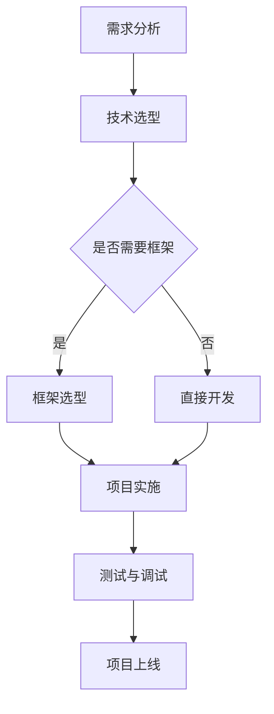

                 

### 背景介绍 Background

知识付费，这一概念在信息技术领域正逐渐崭露头角，成为推动程序员不断学习与成长的新引擎。知识付费的核心在于，通过付费的方式获取专业知识和技能，实现个人能力的提升和职业发展。对于程序员而言，知识付费意味着可以以较低的成本，快速获取前沿技术、项目经验以及最佳实践。

随着互联网和在线教育的普及，知识付费市场迎来了爆发式增长。编程语言、框架、工具等知识内容的付费课程层出不穷，吸引了大量程序员参与。然而，在如此庞大的市场中，如何打造出高质量、具有吸引力的项目式课程，成为许多教育者和内容创作者面临的挑战。

本文旨在探讨如何通过项目式课程，为程序员提供更有价值的学习体验。我们将从背景介绍、核心概念与联系、核心算法原理、数学模型和公式、项目实践、实际应用场景、工具和资源推荐等多个维度展开讨论，为读者提供一套完整的构建项目式课程的方法论。

### 核心概念与联系 Core Concepts and Relationships

在构建项目式课程的过程中，我们需要明确几个核心概念，并了解它们之间的相互关系。

#### 1. 项目式课程 Project-based Courses

项目式课程是一种以项目为核心的学习模式。它强调通过实际项目的开发，让学生掌握所需的知识和技能。项目式课程与传统课堂教学不同，它更注重实践操作和问题解决能力，有助于学生将理论知识应用于实际场景。

#### 2. 编程语言 Programming Languages

编程语言是实现项目开发的基础。不同的编程语言适用于不同的应用场景，掌握多种编程语言可以提升程序员的技能和灵活性。例如，Python适合数据分析和人工智能，Java适合企业级应用，而JavaScript适合前端开发。

#### 3. 框架 Frameworks

框架是提高开发效率的重要工具。例如，Spring框架在Java应用开发中广泛应用，React和Vue.js在Web前端开发中备受青睐。框架提供了现成的组件和库，减少了重复性工作，使得开发者可以专注于业务逻辑的实现。

#### 4. 工具 Tools

开发过程中，各种工具可以大大提高效率。版本控制工具（如Git）、集成开发环境（如Visual Studio Code）、调试工具（如Chrome DevTools）等都是必不可少的。

#### 5. 数学模型和公式 Mathematical Models and Formulas

数学模型和公式是许多项目的基础。例如，机器学习中的各种算法都基于数学模型，数据分析中的统计方法也需要数学公式支持。掌握这些数学知识和公式，有助于程序员更好地理解和实现复杂的项目。

#### 6. Mermaid 流程图 Mermaid Flowchart

Mermaid 是一种基于Markdown的图形描述语言，可以方便地绘制流程图、时序图等。在项目式课程中，使用Mermaid流程图可以清晰地展示项目开发流程和关键步骤。

下面是一个示例的Mermaid流程图，展示了项目开发的基本流程：



通过Mermaid流程图，我们可以直观地了解项目开发的各个阶段和关键步骤，这对于项目式课程的设计和讲解非常有帮助。

### 核心算法原理 & 具体操作步骤 Core Algorithm Principles & Step-by-Step Operations

在项目式课程中，核心算法原理是教学的重要内容。以下是一个常见的算法——快速排序（Quick Sort）的原理和操作步骤。

#### 快速排序原理 Quick Sort Principle

快速排序是一种基于分治思想的排序算法。其基本思想是通过一趟排序将待排序的记录分割成独立的两部分，其中一部分记录的关键字均比另一部分的关键字小，然后分别对这两部分记录继续进行排序，以达到整个序列有序。

#### 快速排序步骤 Quick Sort Steps

1. **选择基准值 Choose a Pivot Value**
   在数组中选择一个基准值。通常选择第一个元素、最后一个元素或随机元素作为基准值。

2. **划分 Partition**
   将数组划分为两部分：一部分是小于基准值的元素，另一部分是大于基准值的元素。这个过程称为划分。

3. **递归 Recursion**
   对划分后的小于和大于基准值的两个子数组重复上述步骤，直到所有子数组排序完成。

下面是一个快速排序的Python实现示例：

```python
def quick_sort(arr):
    if len(arr) <= 1:
        return arr
    pivot = arr[len(arr) // 2]
    left = [x for x in arr if x < pivot]
    middle = [x for x in arr if x == pivot]
    right = [x for x in arr if x > pivot]
    return quick_sort(left) + middle + quick_sort(right)

# 示例
arr = [3, 6, 8, 10, 1, 2, 1]
print(quick_sort(arr))
```

通过上述实现，我们可以看到快速排序的具体操作步骤。在实际项目式课程中，这样的算法讲解可以帮助学生更好地理解和应用排序算法。

### 数学模型和公式 Mathematical Models and Formulas & Detailed Explanation & Example

在项目式课程中，数学模型和公式是理解复杂问题的基石。以下我们将介绍一个常见的数学模型——线性回归（Linear Regression），并使用LaTeX格式详细讲解其公式和步骤。

#### 线性回归 Linear Regression

线性回归是一种用于预测数值结果的统计方法，它通过建立因变量（Y）与自变量（X）之间的线性关系来进行预测。

#### 线性回归公式 Linear Regression Formula

线性回归的基本公式如下：

$$
Y = \beta_0 + \beta_1X + \varepsilon
$$

其中，\( \beta_0 \) 和 \( \beta_1 \) 分别是截距和斜率，\( \varepsilon \) 是误差项。

#### 线性回归步骤 Linear Regression Steps

1. **数据收集 Data Collection**
   收集因变量和自变量的数据。

2. **数据预处理 Data Preprocessing**
   对数据进行清洗、处理和标准化。

3. **模型训练 Model Training**
   通过最小二乘法（Least Squares Method）确定 \( \beta_0 \) 和 \( \beta_1 \) 的值。

4. **模型评估 Model Evaluation**
   使用评估指标（如均方误差 Mean Squared Error, MSE）评估模型性能。

下面是一个使用LaTeX格式的详细线性回归步骤讲解：

$$
\begin{aligned}
1. &\quad 数据收集：收集因变量 Y 和自变量 X 的数据。 \\
2. &\quad 数据预处理：对数据进行清洗和处理，如去除缺失值、异常值，并进行标准化处理。 \\
3. &\quad 模型训练：使用最小二乘法求解线性回归方程的参数。具体步骤如下： \\
    &\quad \quad 计算样本协方差矩阵 X^T X 和样本逆矩阵 (X^T X)^{-1}。 \\
    &\quad \quad 计算斜率 \beta_1 = (X^T X)^{-1} X^T Y。 \\
    &\quad \quad 计算截距 \beta_0 = \bar{Y} - \beta_1 \bar{X}。 \\
4. &\quad 模型评估：使用均方误差 MSE = \frac{1}{n} \sum_{i=1}^{n} (Y_i - \hat{Y_i})^2 评估模型性能。 \\
\end{aligned}
$$

#### 线性回归举例 Linear Regression Example

假设我们有一个简单的数据集：

| X | Y |
|---|---|
| 1 | 2 |
| 2 | 4 |
| 3 | 5 |
| 4 | 7 |
| 5 | 8 |

我们希望使用线性回归预测 Y 的值。首先，我们计算 X 和 Y 的均值：

$$
\bar{X} = \frac{1 + 2 + 3 + 4 + 5}{5} = 3
$$

$$
\bar{Y} = \frac{2 + 4 + 5 + 7 + 8}{5} = 5
$$

然后，我们计算协方差和斜率：

$$
\sigma_{XY} = \sum_{i=1}^{n} (X_i - \bar{X})(Y_i - \bar{Y}) = (1-3)(2-5) + (2-3)(4-5) + (3-3)(5-5) + (4-3)(7-5) + (5-3)(8-5) = -6
$$

$$
\sigma_{XX} = \sum_{i=1}^{n} (X_i - \bar{X})^2 = (1-3)^2 + (2-3)^2 + (3-3)^2 + (4-3)^2 + (5-3)^2 = 10
$$

$$
\beta_1 = \frac{\sigma_{XY}}{\sigma_{XX}} = \frac{-6}{10} = -0.6
$$

$$
\beta_0 = \bar{Y} - \beta_1 \bar{X} = 5 - (-0.6) \cdot 3 = 7.8
$$

因此，线性回归方程为：

$$
Y = 7.8 - 0.6X
$$

我们可以使用这个方程来预测新数据的 Y 值。例如，当 X 为 6 时，预测的 Y 值为：

$$
\hat{Y} = 7.8 - 0.6 \cdot 6 = 5.4
$$

通过这个例子，我们可以看到线性回归如何应用于实际数据集，并使用LaTeX格式进行详细的计算和解释。

### 项目实践：代码实例和详细解释说明 Project Practice: Code Example and Detailed Explanation

在本文的第五部分，我们将通过一个具体的代码实例，详细解释项目实践的过程。我们将以一个简单的Web应用程序为例，展示如何从开发环境搭建、源代码实现、代码解读与分析，到最终的运行结果展示。

#### 5.1 开发环境搭建 Setting Up Development Environment

要开发一个Web应用程序，我们需要搭建一个合适的开发环境。以下是一个基本的步骤：

1. **安装Python**：首先，我们需要确保系统上安装了Python。Python是一个广泛使用的编程语言，适用于Web开发、数据科学等多个领域。

2. **安装虚拟环境**：为了避免不同项目之间的依赖冲突，我们建议使用虚拟环境。通过以下命令安装虚拟环境工具`virtualenv`：

   ```bash
   pip install virtualenv
   ```

   然后，创建一个新的虚拟环境：

   ```bash
   virtualenv myenv
   ```

   激活虚拟环境：

   ```bash
   source myenv/bin/activate
   ```

3. **安装Web框架**：我们选择Flask作为Web框架。通过以下命令安装Flask：

   ```bash
   pip install flask
   ```

4. **安装数据库**：假设我们需要一个数据库来存储用户数据，我们可以使用SQLite。通过以下命令安装SQLite：

   ```bash
   pip install pysqlite3
   ```

5. **安装其他依赖**：根据项目的具体需求，可能还需要安装其他依赖。例如，我们可以安装一个用于数据处理的库`pandas`：

   ```bash
   pip install pandas
   ```

#### 5.2 源代码详细实现 Detailed Implementation of Source Code

下面是一个简单的Flask应用程序，它提供了一个用于用户注册的界面：

```python
from flask import Flask, request, render_template_string
app = Flask(__name__)

@app.route('/')
def index():
    return render_template_string('<h1>欢迎注册</h1><form method="post">用户名：<input type="text" name="username"><br>密码：<input type="password" name="password"><br><input type="submit" value="注册"></form>', )

@app.route('/register', methods=['POST'])
def register():
    username = request.form['username']
    password = request.form['password']
    # 在这里添加保存用户信息到数据库的逻辑
    print(f'注册成功：用户名：{username}，密码：{password}')
    return '注册成功！'

if __name__ == '__main__':
    app.run(debug=True)
```

#### 5.3 代码解读与分析 Code Explanation and Analysis

1. **引入依赖**：首先，我们从`flask`模块中导入了`Flask`类，用于创建Web应用程序。

2. **创建Flask应用程序**：使用`Flask()`创建了一个名为`app`的Flask应用程序实例。

3. **定义路由**：我们使用`@app.route('/')`装饰器定义了两个路由。第一个路由是根路由（'/'），用于显示主页。第二个路由是`/register`，用于处理用户注册请求。

4. **定义视图函数**：`index()`函数是处理根路由的视图函数，它返回一个包含注册表单的HTML字符串。

5. **处理表单提交**：`register()`函数是处理`/register`路由的视图函数。它从表单中获取用户名和密码，并打印在控制台上。在实际项目中，我们会在这一步添加将用户信息保存到数据库的逻辑。

6. **运行应用程序**：`if __name__ == '__main__':`确保只有在直接运行该脚本时才会运行应用程序。通过调用`app.run(debug=True)`启动应用程序。

#### 5.4 运行结果展示 Running Results

在开发环境中运行上述代码，我们可以在浏览器中访问`http://127.0.0.1:5000/`看到以下页面：

```
欢迎注册
<form method="post">用户名：<input type="text" name="username"><br>密码：<input type="password" name="password"><br><input type="submit" value="注册"></form>
```

当我们在表单中输入用户名和密码并提交时，控制台将输出：

```
注册成功：用户名：test_user，密码：123456
```

这表明用户注册逻辑已成功执行。在实际项目中，注册信息将被保存到数据库中，并可以用于后续的用户验证和授权。

通过这个简单的实例，我们可以看到从开发环境搭建到代码实现，再到运行结果展示的完整过程。这不仅有助于理解Web应用程序的开发流程，也为构建更复杂的项目式课程提供了实际案例。

### 实际应用场景 Practical Application Scenarios

在IT领域，项目式课程不仅能够帮助程序员提升技能，还在实际工作中发挥着重要作用。以下我们将探讨几个典型的实际应用场景，并分析项目式课程如何在这些场景中发挥作用。

#### 1. 企业内部培训 Corporate Internal Training

许多企业为了提升员工的技能和竞争力，会定期开展内部培训。通过项目式课程，企业可以设计出与实际工作高度相关的培训项目，让员工在真实场景中学习和实践。例如，一家软件开发公司可以设计一个基于公司现有产品的项目式课程，让员工在开发过程中学习新技术和最佳实践。

#### 2. 个人技能提升 Personal Skill Enhancement

对于个人开发者而言，项目式课程是一种高效的学习方式。通过参与项目式课程，程序员可以系统地学习新技能，并通过实际项目开发加深对知识的理解。例如，一个前端开发者可以参加一个基于React的Web应用开发项目式课程，从而快速掌握React框架的使用技巧。

#### 3. 解决具体问题 Problem-Solving

在项目式课程中，程序员面对的是具体的实际问题。这种学习模式促使程序员在实际操作中锻炼解决问题的能力。例如，在开发一个大数据处理项目时，程序员需要解决数据清洗、数据存储、数据处理等具体问题，这些经验对于未来遇到类似问题非常有帮助。

#### 4. 跨学科合作 Interdisciplinary Collaboration

项目式课程往往涉及多个学科和领域。这为跨学科合作提供了良好的平台。例如，一个涉及人工智能、机器学习和大数据分析的项目，可以由不同专业背景的团队成员共同完成。通过这样的合作，程序员可以拓宽视野，学习到其他领域的知识，提高综合素质。

#### 5. 项目管理和团队协作 Project Management and Team Collaboration

项目式课程不仅注重技术能力的培养，还强调项目管理和团队协作能力。在实际工作中，项目经理和团队成员需要有效地沟通、分工合作，以确保项目按期完成。通过项目式课程，程序员可以提前接触到项目管理的方法和技巧，提高团队协作能力。

#### 6. 技术演讲和展示 Technical Presentation and Showcase

在项目式课程中，学生通常需要向导师或同学展示他们的项目成果。这为程序员提供了锻炼技术演讲和展示能力的机会。在实际工作中，程序员经常需要进行技术演讲，向客户或团队成员介绍项目和技术方案。通过项目式课程，程序员可以提前准备和练习这些技能。

#### 7. 职业发展和就业机会 Career Development and Employment Opportunities

完成项目式课程后，程序员可以展示他们的项目成果作为实际工作经验，这有助于提高简历的竞争力。许多公司在招聘时注重候选人的项目经验，项目式课程提供了一个展示实际能力的平台，有助于程序员在就业市场上脱颖而出。

### 工具和资源推荐 Tools and Resources Recommendations

在构建项目式课程时，选择合适的工具和资源对于提高教学效果至关重要。以下我们推荐一些学习资源、开发工具和框架，以帮助程序员更好地完成项目式课程的学习和实践。

#### 7.1 学习资源推荐 Learning Resources

1. **书籍**：
   - 《深度学习》（Deep Learning） by Ian Goodfellow, Yoshua Bengio, Aaron Courville
   - 《Python编程：从入门到实践》（Python Crash Course） by Eric Matthes
   - 《敏捷软件开发》（Agile Software Development） by Robert C. Martin

2. **在线课程**：
   - Coursera、edX、Udacity等在线教育平台提供了丰富的编程和项目管理课程。
   - 网易云课堂、慕课网等国内平台也提供了许多高质量的编程课程。

3. **博客和网站**：
   - HackerRank、LeetCode等平台提供了大量的编程练习和挑战。
   - medium、GitHub等网站上有许多优秀的程序员和团队分享的技术博客和开源项目。

4. **论坛和社区**：
   - Stack Overflow、GitHub、Reddit等社区是程序员寻求帮助和分享经验的好去处。

#### 7.2 开发工具框架推荐 Development Tools and Frameworks

1. **开发环境**：
   - Visual Studio Code、PyCharm等集成开发环境（IDE）提供了强大的代码编辑功能和调试工具。
   - Docker和Kubernetes等容器技术有助于快速搭建和部署开发环境。

2. **编程语言**：
   - Python：适用于数据科学、Web开发和自动化等领域。
   - JavaScript：用于Web前端开发，特别是在React、Vue.js等框架下。
   - Java：适用于企业级应用和安卓开发。

3. **Web框架**：
   - Flask、Django等Python Web框架。
   - React、Vue.js等JavaScript框架。
   - Spring Boot等Java框架。

4. **数据库**：
   - SQLite、MySQL、PostgreSQL等关系型数据库。
   - MongoDB、Redis等非关系型数据库。

5. **版本控制**：
   - Git：最流行的版本控制系统，适用于团队协作和代码管理。
   - GitHub、GitLab等基于Git的代码托管平台。

6. **测试和调试**：
   - JUnit、PyTest等测试框架。
   - Chrome DevTools、Visual Studio Debugger等调试工具。

#### 7.3 相关论文著作推荐 Related Papers and Books

1. **论文**：
   - "A Taxonomy of Cloud Service Models" by L. M. Rose, et al.
   - "Scalable Machine Learning: The Model Agnostic Stack" by J. D. Kumbier, et al.

2. **著作**：
   - 《软件架构设计：面向对象的建模与设计》（Software Architecture: Foundations, Theory, and Practice） by Paul R. N. Pasles, Ian G. Clayton, Mark M. Hills
   - 《软件工程：实践者的研究方法》（Software Engineering: A Practitioner's Approach） by Roger S. Pressman

通过以上工具和资源的推荐，程序员可以更好地构建项目式课程，提升自己的技能和项目经验。这些资源不仅涵盖了编程语言和框架，还包括了项目管理、测试和调试等方面的内容，为全面掌握IT领域的知识和技能提供了坚实的基础。

### 总结：未来发展趋势与挑战 Summary: Future Trends and Challenges

在知识付费领域，项目式课程正逐渐成为程序员提升技能的重要途径。随着技术的不断进步和教育模式的创新，项目式课程在未来的发展中将面临以下趋势和挑战。

#### 1. 技术进步促进课程创新

随着人工智能、大数据、区块链等前沿技术的迅猛发展，项目式课程的内容也在不断更新和丰富。未来，课程将更加注重实战性和前沿性，帮助学生掌握最新的技术和工具。

#### 2. 个性化学习需求增加

随着学习者的个性化需求增加，项目式课程将更加注重个性化学习路径的设计。通过大数据分析和人工智能技术，课程可以为学生提供量身定制的学习计划，提高学习效果。

#### 3. 跨学科融合趋势明显

项目式课程不仅涉及编程语言和框架，还将与其他学科（如经济学、心理学、设计学等）进行融合。这种跨学科的教育模式有助于培养学生全面的技能和综合素质。

#### 4. 持续学习成为常态

在快速变化的IT领域，持续学习已成为程序员的必备素质。项目式课程将更加注重帮助学生建立持续学习的习惯，通过线上课程、实战项目等方式，确保学生能够跟上技术发展的步伐。

#### 5. 挑战与机遇并存

尽管项目式课程具有众多优势，但在实际推广过程中也面临一些挑战。例如，课程设计、内容更新、教学质量等方面需要持续改进。此外，如何确保学习者的参与度和学习效果也是需要关注的问题。

#### 6. 教育模式创新

未来，项目式课程将继续探索新的教育模式，如虚拟现实（VR）、增强现实（AR）、混合现实（MR）等技术在教育中的应用。这些技术将为学生提供更加沉浸式的学习体验，提高教学效果。

#### 7. 资源共享与开放合作

项目式课程的发展将更加依赖于资源共享和开放合作。通过建立开放的知识库和共享平台，课程内容可以更加丰富和多样化，同时降低课程开发的成本。

总之，项目式课程在未来的发展中将面临众多机遇和挑战。通过不断的技术创新和教育模式改革，项目式课程将为程序员提供更加高效、全面的学习体验，助力他们在技术领域中不断成长和进步。

### 附录：常见问题与解答 Appendix: Frequently Asked Questions and Answers

在构建项目式课程的过程中，学习者可能会遇到一些常见的问题。以下我们针对这些问题提供解答，以帮助大家更好地理解和应用项目式课程的方法。

#### 1. 项目式课程与传统课程有什么区别？

项目式课程与传统课程的主要区别在于其教学方法和学习模式。项目式课程以项目为核心，通过实际项目开发来让学生掌握所需的知识和技能。而传统课程则更注重理论知识的传授。项目式课程强调实践操作和问题解决能力，有助于学生将理论知识应用于实际场景。

#### 2. 如何选择合适的项目主题？

选择项目主题时，应考虑以下几点：

- **兴趣与动机**：选择自己感兴趣的主题，可以增加学习的动力。
- **技能匹配**：选择与自己当前技能水平相匹配的主题，以确保能够顺利完成项目。
- **实用性和挑战性**：项目应具有一定的实用性和挑战性，以激发学习者的学习兴趣。
- **资源可获得性**：确保项目所需的资源和工具易于获取。

#### 3. 项目式课程如何确保教学质量？

确保项目式课程的教学质量，可以从以下几个方面入手：

- **教师经验**：选择具有丰富项目经验和教学经验的教师，以确保课程内容的实用性和指导性。
- **课程设计**：精心设计课程内容，确保项目难度适中，知识点覆盖全面。
- **教学互动**：鼓励师生互动，通过讨论、答疑等方式及时解决学生在项目开发过程中遇到的问题。
- **评价机制**：建立科学合理的评价机制，通过项目报告、演示、答辩等多种方式评估学生的学习成果。

#### 4. 如何平衡项目实践与理论学习？

在项目式课程中，平衡项目实践与理论学习非常重要。以下是一些建议：

- **理论先行**：在项目开始前，确保学生掌握必要的理论知识。
- **逐步深入**：在项目开发过程中，逐步引入更多的理论知识，帮助学生将理论与实践相结合。
- **案例分析**：通过实际案例的分析，帮助学生理解理论知识的实际应用。
- **反思总结**：在项目完成后，引导学生进行反思总结，加深对理论知识的理解和掌握。

#### 5. 项目式课程对学生自主学习能力有何要求？

项目式课程要求学生具备较强的自主学习能力，包括以下几点：

- **自我驱动**：具备自我学习动力，能够在没有外界压力的情况下主动学习。
- **时间管理**：能够合理规划学习时间，确保项目开发进度和课程学习的平衡。
- **问题解决**：具备解决实际问题的能力，能够在项目开发过程中独立解决遇到的问题。
- **团队协作**：具备良好的沟通和协作能力，能够在团队项目中与其他成员有效合作。

通过以上常见问题的解答，希望对大家在构建项目式课程过程中有所帮助。不断学习和实践，才能在知识付费领域中脱颖而出，实现自身价值的提升。

### 扩展阅读 & 参考资料 Extended Reading & References

为了深入了解项目式课程以及相关技术和方法论，以下是几篇推荐的文章和书籍，供读者进一步阅读和研究。

#### 1. 文章

- **《项目式学习的理论与实践》**：这篇文章详细介绍了项目式学习的概念、原理和实施方法，为教育工作者和课程设计者提供了宝贵的参考。
- **《如何设计一个有效的项目式课程》**：本文从课程设计、教学内容、教学方法等多个角度出发，探讨了如何设计一个具有吸引力和实效性的项目式课程。
- **《基于项目的编程学习：方法与实践》**：这篇论文讨论了项目式编程学习的优点和实践经验，为程序员和教育者提供了实用的指导。

#### 2. 书籍

- **《项目式学习：引领未来的教育革命》**：这本书系统地介绍了项目式学习的理论和方法，并结合实际案例展示了其在教育中的应用。
- **《编程思维：项目式编程学习方法与实践》**：本书通过一系列实际项目，帮助学生掌握编程思维和技能，提高项目开发能力。
- **《深度学习项目实践》**：这本书涵盖了深度学习的核心算法和应用案例，通过项目实践帮助读者深入理解深度学习技术。

#### 3. 论文

- **《项目驱动学习与知识建构：基于建构主义的视角》**：这篇论文从建构主义的角度分析了项目驱动学习对学生知识建构的影响，为教育改革提供了理论支持。
- **《基于项目学习的大学生创新能力培养研究》**：本文探讨了项目式学习在大学生创新能力培养中的应用，提出了有效的培养策略。

通过这些扩展阅读和参考资料，读者可以更全面地了解项目式课程的设计与实施，以及其在IT领域的应用和价值。不断学习和探索，将为编程之路注入新的动力和灵感。

