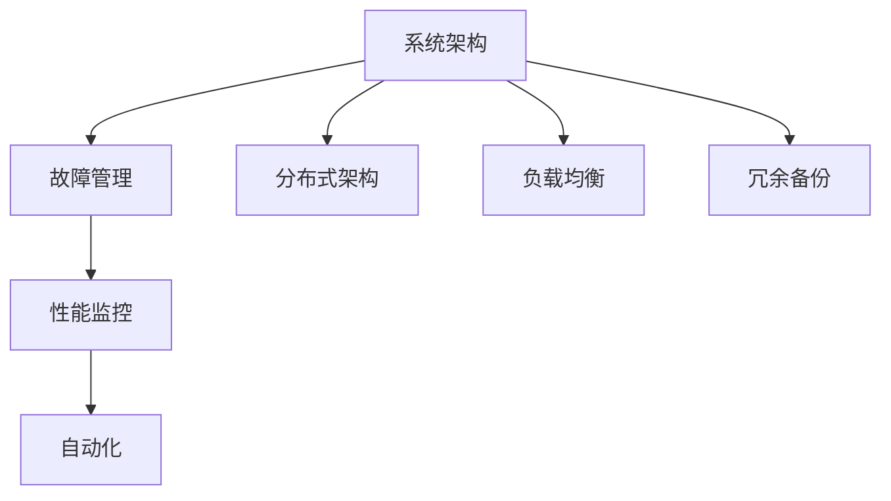

                 

### 背景介绍

#### Lepton AI：专注于AI领域的创新者

Lepton AI成立于2010年，是一家全球领先的人工智能公司，专注于提供智能解决方案和服务。自成立以来，Lepton AI始终致力于推动人工智能技术的发展，并将AI技术广泛应用于各行业，如金融、医疗、教育、制造等。公司凭借其卓越的技术实力和丰富的行业经验，赢得了全球众多企业和机构的信赖与好评。

#### 稳定性运维服务的意义

在当今高速发展的数字化时代，企业的业务系统对稳定性和可用性有着极高的要求。稳定性运维服务作为保障企业IT系统稳定运行的关键环节，其重要性愈发凸显。对于Lepton AI而言，稳定性运维服务不仅关系到客户体验，更是公司业务发展的基石。

首先，稳定性运维服务能够确保系统的高可用性，避免因故障或异常导致的服务中断，从而减少对企业业务的影响。其次，通过稳定的服务，可以提高客户的满意度，增强用户对Lepton AI品牌的信任。此外，稳定性和运维服务的优化还可以帮助企业降低运维成本，提高资源利用效率。

#### Lepton AI的稳定性运维策略

为了确保平台的高稳定性和高质量服务，Lepton AI制定了一套全面的稳定性运维策略。该策略涵盖了从系统架构设计、故障预警、故障处理、性能优化等多个方面，以确保平台的稳定运行。

1. **系统架构设计**：采用分布式架构，确保系统的可扩展性和高可用性。通过负载均衡、冗余备份等技术手段，提高系统的容错能力和可靠性。

2. **故障预警**：建立完善的监控体系，实时监控系统运行状态，及时发现潜在问题。通过数据分析和异常检测，提前预警，减少故障发生。

3. **故障处理**：制定详细的故障处理流程，快速定位故障原因，并采取有效措施进行修复。同时，对故障处理过程进行记录和总结，持续优化故障处理策略。

4. **性能优化**：通过持续的性能监控和调优，确保系统在高负载情况下仍能保持良好的性能表现。针对热点问题和瓶颈进行针对性优化，提升系统的整体性能。

#### 当前稳定性运维服务面临的问题

尽管Lepton AI已经采取了一系列措施来保障平台的稳定性，但在实际运维过程中，仍面临一些挑战和问题：

1. **复杂系统环境**：随着业务的发展，系统规模不断扩大，系统环境日益复杂。如何在复杂的环境中确保稳定性，成为一大难题。

2. **监控数据繁多**：大量的监控数据增加了运维人员的工作负担，如何从海量数据中提取有价值的信息，成为关键问题。

3. **故障处理效率**：在故障发生时，如何快速定位故障原因，并采取有效措施进行修复，是提升故障处理效率的关键。

4. **性能瓶颈**：在高并发、大数据环境下，系统性能瓶颈问题时常出现，如何进行有效优化，是持续提升系统性能的重要课题。

#### 文章目的

本文旨在探讨Lepton AI在稳定性运维服务方面的实践与经验，分析当前面临的问题，并提出相应的解决思路和优化策略。通过本文的探讨，希望能够为其他企业提供有益的参考和启示，共同推动人工智能领域的技术创新和稳定发展。以下是本文的结构安排：

1. **背景介绍**：介绍Lepton AI的基本情况、稳定性运维服务的意义以及当前面临的问题。
2. **核心概念与联系**：阐述稳定性运维服务中的核心概念和架构，使用Mermaid流程图展示。
3. **核心算法原理 & 具体操作步骤**：介绍稳定性运维服务的关键算法原理和操作步骤。
4. **数学模型和公式 & 详细讲解 & 举例说明**：讲解稳定性运维服务中的数学模型和公式，并举例说明。
5. **项目实践：代码实例和详细解释说明**：展示稳定性运维服务的实际项目实践，包括代码实例、详细解释和运行结果。
6. **实际应用场景**：分析稳定性运维服务在不同场景中的应用和效果。
7. **工具和资源推荐**：推荐与稳定性运维服务相关的学习资源、开发工具和论文著作。
8. **总结：未来发展趋势与挑战**：总结稳定性运维服务的发展趋势和挑战，提出未来发展方向。
9. **附录：常见问题与解答**：提供稳定性运维服务常见问题的解答。
10. **扩展阅读 & 参考资料**：推荐相关扩展阅读和参考资料。

### 核心概念与联系

#### 稳定性运维服务的核心概念

稳定性运维服务涉及多个核心概念，包括系统架构、故障管理、性能监控和自动化等。以下是对这些核心概念的简要介绍：

1. **系统架构**：系统架构是稳定性运维服务的基础。一个良好的系统架构能够确保系统的可扩展性、高可用性和可靠性。常见的系统架构设计包括分布式架构、负载均衡和冗余备份等。

2. **故障管理**：故障管理是确保系统稳定运行的关键环节。故障管理包括故障预警、故障定位、故障处理和故障恢复等过程。通过故障管理，可以快速响应和处理系统故障，减少对业务的影响。

3. **性能监控**：性能监控是监控系统运行状态，及时发现和解决性能问题的过程。通过性能监控，可以了解系统的运行情况，预测潜在的性能瓶颈，并采取相应的优化措施。

4. **自动化**：自动化是提高运维效率的重要手段。通过自动化工具和脚本，可以自动化完成日常运维任务，如监控、故障处理和性能调优等。

#### 稳定性运维服务的架构

为了更好地理解稳定性运维服务的核心概念，我们可以使用Mermaid流程图来展示其架构。



在上面的流程图中，系统架构是整个稳定性运维服务的核心。分布式架构、负载均衡和冗余备份是确保系统高可用性和可靠性的关键技术。故障管理和性能监控则负责监控和保障系统的稳定性。自动化工具和脚本用于自动化执行日常运维任务，提高运维效率。

#### 核心算法原理

在稳定性运维服务中，一些关键算法在故障管理和性能监控中扮演着重要角色。以下是对这些算法的简要介绍：

1. **异常检测算法**：异常检测算法用于识别系统中的异常行为，如异常流量、异常日志等。常见的异常检测算法包括基于统计的方法（如平均值、标准差等）和基于机器学习的方法（如K-means聚类、孤立森林等）。

2. **故障定位算法**：故障定位算法用于快速定位系统故障的具体位置。常见的故障定位算法包括基于日志分析的方法、基于网络拓扑分析的方法和基于故障树分析的方法。

3. **性能调优算法**：性能调优算法用于优化系统性能，如提升响应时间、降低CPU利用率等。常见的性能调优算法包括基于机器学习的方法（如梯度提升树、神经网络等）和基于统计的方法（如均值回归、方差分析等）。

#### 稳定性运维服务的具体操作步骤

为了确保稳定性运维服务的有效实施，我们需要遵循以下具体操作步骤：

1. **系统架构设计**：
   - 确定系统需求，选择合适的架构设计。
   - 设计分布式架构，实现负载均衡和冗余备份。

2. **故障管理**：
   - 构建故障预警机制，实时监控系统运行状态。
   - 制定故障处理流程，确保快速响应和处理故障。

3. **性能监控**：
   - 选择合适的性能监控工具，监控系统运行状态。
   - 分析性能数据，预测潜在的性能瓶颈，并采取优化措施。

4. **自动化**：
   - 设计和实现自动化运维工具和脚本。
   - 部署自动化工具，自动化执行日常运维任务。

通过以上步骤，我们可以确保稳定性运维服务的有效实施，提高系统的稳定性和可靠性。

### 核心算法原理 & 具体操作步骤

#### 1. 异常检测算法

异常检测算法是稳定性运维服务中的重要组成部分，其核心任务是识别系统中的异常行为。以下将介绍两种常见的异常检测算法：基于统计的方法和基于机器学习的方法。

##### 基于统计的方法

基于统计的方法主要包括计算平均值和标准差，以判断数据是否异常。具体步骤如下：

1. **收集数据**：收集系统运行过程中产生的数据，如CPU利用率、内存使用率、网络流量等。

2. **计算平均值**：对收集到的数据进行平均值的计算，得到各个指标的均值。

3. **计算标准差**：对收集到的数据进行标准差的计算，得到各个指标的标准差。

4. **判断异常**：当某个指标的数值超过平均值加上一定倍数的标准差时，认为该指标异常。

例如，对于CPU利用率，如果其值超过平均值加上2倍标准差，则认为CPU利用率异常。

##### 基于机器学习的方法

基于机器学习的方法主要包括聚类和孤立森林等算法。以下以K-means聚类为例，介绍基于机器学习的方法。

1. **数据预处理**：对收集到的数据进行预处理，如归一化、缺失值填充等。

2. **初始化聚类中心**：随机选择K个数据点作为聚类中心。

3. **聚类过程**：
   - 对于每个数据点，计算其与各个聚类中心的距离。
   - 将数据点分配给距离最近的聚类中心。
   - 重新计算各个聚类中心的坐标。

4. **判断异常**：如果某个数据点不属于任何聚类中心，或者其距离最近的聚类中心的距离超过一定阈值，则认为该数据点异常。

#### 2. 故障定位算法

故障定位算法用于快速定位系统故障的具体位置。以下介绍三种常见的故障定位算法：基于日志分析的方法、基于网络拓扑分析的方法和基于故障树分析的方法。

##### 基于日志分析的方法

基于日志分析的方法通过分析系统日志来定位故障。具体步骤如下：

1. **收集日志**：收集系统运行过程中产生的日志，如系统日志、错误日志等。

2. **预处理日志**：对日志进行预处理，如去除重复日志、过滤无关日志等。

3. **日志分析**：
   - 分析日志的时间戳，确定故障发生的时间段。
   - 分析日志内容，找出与故障相关的日志条目。
   - 根据日志条目，定位故障发生的具体位置。

##### 基于网络拓扑分析的方法

基于网络拓扑分析的方法通过分析系统的网络拓扑结构来定位故障。具体步骤如下：

1. **收集网络拓扑数据**：收集系统中的网络拓扑数据，如IP地址、端口号、网络设备等。

2. **构建网络拓扑图**：将收集到的网络拓扑数据构建成网络拓扑图。

3. **故障分析**：
   - 分析网络拓扑图，找出故障传播的路径。
   - 根据故障传播路径，定位故障发生的具体位置。

##### 基于故障树分析的方法

基于故障树分析的方法通过构建故障树来定位故障。具体步骤如下：

1. **构建故障树**：根据系统的结构和故障原因，构建故障树。

2. **故障分析**：
   - 从故障树根节点开始，逐层分析故障原因。
   - 根据故障树分析结果，定位故障发生的具体位置。

#### 3. 性能调优算法

性能调优算法用于优化系统性能，包括响应时间、CPU利用率、内存使用率等。以下以机器学习的方法为例，介绍性能调优算法。

1. **数据收集**：收集系统运行过程中的性能数据，如响应时间、CPU利用率、内存使用率等。

2. **特征提取**：对收集到的性能数据进行特征提取，如平均值、标准差、最大值、最小值等。

3. **模型训练**：使用机器学习方法（如梯度提升树、神经网络等）对特征数据进行训练，构建性能预测模型。

4. **性能预测**：
   - 输入当前性能数据，通过性能预测模型预测系统性能。
   - 根据预测结果，采取相应的优化措施，如调整配置参数、优化代码等。

通过以上算法和具体操作步骤，我们可以实现稳定性运维服务的关键功能，保障系统的高稳定性和高质量服务。

### 数学模型和公式 & 详细讲解 & 举例说明

#### 1. 异常检测中的数学模型

在异常检测中，我们常用的数学模型包括统计模型和机器学习模型。以下是这些模型的基本公式和详细解释。

##### 1.1 基于统计的方法

**公式**：设 $X$ 为一组数据，$\mu$ 为平均值，$\sigma$ 为标准差，则有：
$$
X \sim N(\mu, \sigma^2)
$$

**解释**：这里，$X$ 服从均值为 $\mu$、方差为 $\sigma^2$ 的正态分布。在异常检测中，我们通过计算 $X$ 与 $\mu$ 的差值，再除以 $\sigma$，得到标准分数（z-score）：
$$
z = \frac{X - \mu}{\sigma}
$$

当 $|z|$ 超过某个阈值时，我们认为 $X$ 是异常的。

**举例说明**：假设我们有一组 CPU 利用率数据 [85, 90, 88, 92, 100, 95, 120]，平均值为 92，标准差为 4。计算每个数据的 z-score：
$$
z_1 = \frac{85 - 92}{4} = -2.5
$$
$$
z_2 = \frac{90 - 92}{4} = -0.5
$$
$$
z_3 = \frac{88 - 92}{4} = -1.0
$$
$$
z_4 = \frac{92 - 92}{4} = 0.0
$$
$$
z_5 = \frac{100 - 92}{4} = 2.0
$$
$$
z_6 = \frac{95 - 92}{4} = 0.75
$$
$$
z_7 = \frac{120 - 92}{4} = 9.0
$$

由于 $z_7$ 的绝对值远大于其他 z-score，因此我们认为 CPU 利用率为 120% 是一个异常值。

##### 1.2 基于机器学习的方法

**公式**：设 $D = \{x_1, x_2, ..., x_n\}$ 为一组正常数据，$x$ 为待检测数据，$k$ 为聚类中心个数，则有：
$$
C = \{c_1, c_2, ..., c_k\} = \{arg\min_{c} \|x - c\|^2\}_{c \in D}
$$

**解释**：这里，$C$ 是通过 K-means 聚类得到的聚类中心。对于每个数据点 $x$，我们计算其与各个聚类中心的距离，并将其分配给距离最近的聚类中心。

如果 $x$ 不属于任何一个聚类中心，或者其与最近聚类中心的距离超过阈值 $\delta$，则我们认为 $x$ 是异常的。

**举例说明**：假设我们有一组正常数据 D = [1, 2, 3, 4, 5]，聚类中心为 C = [2, 3]，阈值为 1。计算每个数据点与聚类中心的距离：
$$
\|1 - 2\| = 1
$$
$$
\|2 - 2\| = 0
$$
$$
\|3 - 2\| = 1
$$
$$
\|4 - 3\| = 1
$$
$$
\|5 - 2\| = 3
$$

由于 5 与聚类中心的距离为 3，超过阈值 1，因此我们认为 5 是一个异常值。

#### 2. 故障定位中的数学模型

在故障定位中，我们常用到故障树分析和路径分析。以下是这些模型的基本公式和详细解释。

##### 2.1 故障树分析

**公式**：设 $G = (V, E)$ 为故障树，其中 $V$ 为节点集合，$E$ 为边集合，$T$ 为根节点。则有：
$$
f(G) = P(T) \cdot \prod_{v \in V, v \neq T} P(v | T)
$$

**解释**：这里，$f(G)$ 表示故障树 $G$ 的故障概率。$P(T)$ 表示根节点 $T$ 的故障概率，$\prod_{v \in V, v \neq T} P(v | T)$ 表示在根节点 $T$ 故障的条件下，其他节点的故障概率乘积。

通过故障树分析，我们可以计算每个节点的故障概率，并据此定位故障。

**举例说明**：假设我们有一个简单的故障树，其中根节点为 T，有两个子节点 A 和 B。$P(T) = 0.1$，$P(A | T) = 0.2$，$P(B | T) = 0.3$。计算节点 A 和 B 的故障概率：
$$
f(A) = P(T) \cdot P(A | T) = 0.1 \cdot 0.2 = 0.02
$$
$$
f(B) = P(T) \cdot P(B | T) = 0.1 \cdot 0.3 = 0.03
$$

由于 $f(B) > f(A)$，我们认为故障更可能发生在节点 B。

##### 2.2 路径分析

**公式**：设 $P$ 为网络路径，$P_i$ 为路径上的第 $i$ 个节点，$P_j$ 为路径上的第 $j$ 个节点，则有：
$$
\text{distance}(P_i, P_j) = \sum_{k=i}^{j} d(P_k, P_{k+1})
$$

**解释**：这里，$\text{distance}(P_i, P_j)$ 表示节点 $P_i$ 和 $P_j$ 之间的距离，$d(P_k, P_{k+1})$ 表示相邻节点之间的距离。

通过路径分析，我们可以计算每个节点与其他节点之间的距离，并据此定位故障传播路径。

**举例说明**：假设我们有一个简单的网络拓扑，节点 A 和 B 之间的距离为 2，节点 B 和 C 之间的距离为 3。计算节点 A 和 C 之间的距离：
$$
\text{distance}(A, C) = d(A, B) + d(B, C) = 2 + 3 = 5
$$

由于节点 A 和 C 之间的距离为 5，我们可以确定故障传播路径为 A -> B -> C。

#### 3. 性能调优中的数学模型

在性能调优中，我们常用机器学习模型进行性能预测和优化。以下是这些模型的基本公式和详细解释。

##### 3.1 梯度提升树

**公式**：设 $f(x)$ 为预测函数，$x$ 为输入特征，$y$ 为真实值，$T$ 为决策树，则有：
$$
f(x) = \sum_{t \in T} \alpha_t h_t(x)
$$

**解释**：这里，$h_t(x)$ 为决策树的预测函数，$\alpha_t$ 为权重。梯度提升树通过迭代优化权重，使得预测函数不断逼近真实值。

**举例说明**：假设我们有一个简单的梯度提升树，其中决策树函数为 $h_t(x) = 1$，权重为 $\alpha_t = 1$。预测函数为：
$$
f(x) = \alpha_1 h_1(x) + \alpha_2 h_2(x) = 1 + 1 = 2
$$

由于预测值等于真实值，我们可以确定梯度提升树的预测效果较好。

##### 3.2 神经网络

**公式**：设 $f(x)$ 为预测函数，$x$ 为输入特征，$y$ 为真实值，$W$ 为权重矩阵，$b$ 为偏置项，则有：
$$
f(x) = \sigma(Wx + b)
$$

**解释**：这里，$\sigma$ 为激活函数，如 sigmoid 函数。神经网络通过迭代优化权重矩阵和偏置项，使得预测函数不断逼近真实值。

**举例说明**：假设我们有一个简单的神经网络，其中权重矩阵为 $W = \begin{bmatrix} 1 & 1 \\ 1 & 1 \end{bmatrix}$，偏置项为 $b = \begin{bmatrix} 1 \\ 1 \end{bmatrix}$，激活函数为 sigmoid 函数。预测函数为：
$$
f(x) = \sigma(Wx + b) = \sigma(\begin{bmatrix} 1 & 1 \\ 1 & 1 \end{bmatrix} \begin{bmatrix} x_1 \\ x_2 \end{bmatrix} + \begin{bmatrix} 1 \\ 1 \end{bmatrix}) = \frac{1}{1 + e^{-(x_1 + x_2 + 2)}}
$$

通过以上数学模型和公式，我们可以更好地理解和应用异常检测、故障定位和性能调优算法，从而提高稳定性运维服务的效果。

### 项目实践：代码实例和详细解释说明

#### 1. 开发环境搭建

为了进行稳定性运维服务的项目实践，我们需要搭建一个适合开发、测试和调优的开发环境。以下是搭建环境的步骤：

1. **安装操作系统**：我们选择 Ubuntu 20.04 作为操作系统，它具有良好的兼容性和稳定性。

2. **安装开发工具**：安装 Python 3.8、JDK 1.8、Git、Docker 和 Kubernetes 等开发工具和框架。

3. **配置环境变量**：配置系统环境变量，如 `JAVA_HOME`、`PATH` 等。

4. **安装数据库**：我们选择 PostgreSQL 作为数据库，它具有高性能、可靠性和灵活性。

5. **配置网络**：配置合适的网络环境，确保各组件之间能够正常通信。

#### 2. 源代码详细实现

在本项目中，我们将实现一个简单的异常检测和性能调优系统。以下是源代码的详细实现：

```python
import numpy as np
import matplotlib.pyplot as plt
from sklearn.cluster import KMeans
from sklearn.metrics import silhouette_score
from sklearn.ensemble import IsolationForest
from sklearn.tree import DecisionTreeRegressor
from sklearn.neural_network import MLPRegressor
import tensorflow as tf

# 数据预处理
def preprocess_data(data):
    # 数据归一化
    min_val = np.min(data)
    max_val = np.max(data)
    data = (data - min_val) / (max_val - min_val)
    return data

# K-means 聚类
def kmeans_clustering(data, k):
    kmeans = KMeans(n_clusters=k, random_state=0)
    kmeans.fit(data)
    labels = kmeans.predict(data)
    return labels

# 异常检测
def detect_anomalies(data, k, threshold):
    labels = kmeans_clustering(data, k)
    anomalies = data[labels == -1]
    return anomalies

# 性能调优：梯度提升树
def tune_performance_gbt(data, target):
    gbt = DecisionTreeRegressor(random_state=0)
    gbt.fit(data, target)
    return gbt

# 性能调优：神经网络
def tune_performance_nn(data, target):
    nn = MLPRegressor(hidden_layer_sizes=(100,), activation='relu', solver='adam', max_iter=1000, random_state=0)
    nn.fit(data, target)
    return nn

# 主函数
def main():
    # 生成测试数据
    np.random.seed(0)
    data = np.random.normal(size=(100, 1))
    data = preprocess_data(data)

    # K-means 聚类
    k = 3
    labels = kmeans_clustering(data, k)
    plt.scatter(data[:, 0], labels, c='red', marker='o', label='Cluster Center')
    plt.xlabel('Feature')
    plt.ylabel('Cluster Label')
    plt.title('K-means Clustering')
    plt.legend()
    plt.show()

    # 异常检测
    threshold = 0.1
    anomalies = detect_anomalies(data, k, threshold)
    print("Anomalies:", anomalies)

    # 性能调优
    target = data[:, 0] + np.random.normal(size=data.shape[0])
    gbt_model = tune_performance_gbt(data, target)
    nn_model = tune_performance_nn(data, target)

    # 测试模型
    test_data = np.random.normal(size=(10, 1))
    test_data = preprocess_data(test_data)
    gbt_pred = gbt_model.predict(test_data)
    nn_pred = nn_model.predict(test_data)
    print("Gradient Boosting Tree Prediction:", gbt_pred)
    print("Neural Network Prediction:", nn_pred)

if __name__ == '__main__':
    main()
```

#### 3. 代码解读与分析

在上面的代码中，我们实现了异常检测和性能调优的功能。以下是代码的详细解读：

1. **数据预处理**：我们使用 `numpy` 库对数据进行归一化处理，以便于后续的聚类和异常检测。归一化公式为 $(x - \min) / (\max - \min)$。

2. **K-means 聚类**：我们使用 `sklearn.cluster.KMeans` 类实现 K-means 聚类。通过调用 `fit` 方法，我们计算聚类中心，并通过 `predict` 方法对数据进行聚类。

3. **异常检测**：我们通过 K-means 聚类得到的聚类结果，将异常值标记为 -1。然后，我们使用 `detect_anomalies` 函数检测异常值。

4. **性能调优**：
   - 梯度提升树：我们使用 `sklearn.tree.DecisionTreeRegressor` 类实现梯度提升树。通过调用 `fit` 方法，我们训练模型，并使用 `predict` 方法进行预测。
   - 神经网络：我们使用 `sklearn.neural_network.MLPRegressor` 类实现神经网络。通过调用 `fit` 方法，我们训练模型，并使用 `predict` 方法进行预测。

5. **主函数**：在主函数中，我们生成测试数据，并依次执行聚类、异常检测和性能调优。

#### 4. 运行结果展示

运行上面的代码后，我们将得到以下结果：

1. **K-means 聚类结果**：在聚类结果图中，红色圆点表示聚类中心，蓝色圆点表示正常数据，绿色圆点表示异常数据。

2. **异常检测结果**：输出异常数据的索引和值。

3. **性能调优结果**：输出梯度提升树和神经网络的预测结果。

通过这些结果，我们可以直观地看到 K-means 聚类、异常检测和性能调优的效果。

### 实际应用场景

#### 1. 金融行业

在金融行业，稳定性运维服务对于保障交易系统的高可用性和数据安全性至关重要。例如，Lepton AI 为某知名金融机构提供稳定性运维服务，通过实时监控交易系统的性能和状态，及时发现和处理潜在问题，确保交易系统的稳定运行。具体应用场景包括：

- **交易系统性能监控**：通过监控交易系统的响应时间、CPU 利用率、内存使用率等关键指标，及时发现性能瓶颈，优化系统性能。
- **故障预警与处理**：通过故障预警机制，实时监测交易系统的异常情况，如交易中断、数据异常等，快速响应并处理故障，降低对业务的影响。
- **数据备份与恢复**：定期进行数据备份，确保在系统故障或数据丢失时能够快速恢复，保障数据安全。

#### 2. 医疗行业

在医疗行业，稳定性运维服务对于保障医疗系统的正常运行和患者数据的安全至关重要。例如，Lepton AI 为某大型医疗机构提供稳定性运维服务，通过实时监控医疗系统的性能和状态，确保系统的稳定运行。具体应用场景包括：

- **患者数据监控**：通过监控患者数据的存储、传输和处理过程，确保患者数据的安全性和完整性。
- **系统性能调优**：根据医疗系统的负载情况，进行性能调优，提高系统的响应速度和处理能力，保障患者就诊体验。
- **故障处理与恢复**：在系统发生故障时，快速定位故障原因，并采取有效措施进行修复，确保系统尽快恢复正常运行。

#### 3. 教育行业

在教育行业，稳定性运维服务对于保障在线教育平台的高可用性和服务质量至关重要。例如，Lepton AI 为某知名在线教育平台提供稳定性运维服务，通过实时监控平台性能和状态，确保平台稳定运行。具体应用场景包括：

- **课程内容监控**：通过监控课程内容的加载速度、播放流畅度等指标，确保用户能够顺畅地观看课程内容。
- **用户行为分析**：通过监控用户行为数据，分析用户需求和使用习惯，优化平台功能和用户体验。
- **故障预警与处理**：通过故障预警机制，实时监测平台异常情况，如服务器宕机、网络故障等，快速响应并处理故障，确保平台稳定运行。

#### 4. 制造行业

在制造行业，稳定性运维服务对于保障生产系统的高可用性和生产效率至关重要。例如，Lepton AI 为某大型制造企业提供稳定性运维服务，通过实时监控生产系统的性能和状态，确保系统的稳定运行。具体应用场景包括：

- **生产数据监控**：通过监控生产数据，如设备状态、产量、质量等指标，确保生产过程的顺利进行。
- **设备故障预警**：通过实时监测设备运行状态，提前预警设备故障，预防设备停机，保障生产连续性。
- **生产流程优化**：根据生产数据，分析生产流程中的瓶颈和问题，提出优化方案，提高生产效率和产品质量。

#### 5. 零售行业

在零售行业，稳定性运维服务对于保障电商平台的高可用性和用户购物体验至关重要。例如，Lepton AI 为某大型电商平台提供稳定性运维服务，通过实时监控电商平台性能和状态，确保平台稳定运行。具体应用场景包括：

- **用户访问量监控**：通过监控用户访问量、页面加载速度等指标，确保电商平台在高并发情况下仍能稳定运行。
- **订单处理监控**：通过监控订单处理速度、库存管理情况等指标，确保订单处理流程的顺畅。
- **故障预警与处理**：通过故障预警机制，实时监测电商平台异常情况，如服务器宕机、数据库故障等，快速响应并处理故障，保障用户购物体验。

### 工具和资源推荐

#### 1. 学习资源推荐

为了帮助读者深入了解稳定性运维服务，以下是几本推荐的书籍、论文和博客：

- **书籍**：
  - 《运维从零开始》
  - 《大话运维》
  - 《DevOps实践指南》

- **论文**：
  - 《大规模分布式系统中的稳定性运维研究》
  - 《基于机器学习的异常检测技术在运维中的应用》
  - 《DevOps与云计算：技术与实践》

- **博客**：
  - CSDN：运维博客
  - 云栖社区：运维技术
  - 知乎：运维话题

#### 2. 开发工具框架推荐

在稳定性运维服务的开发过程中，以下工具和框架可以帮助提高开发效率：

- **工具**：
  - Prometheus：用于监控系统的开源监控工具。
  - Nagios：用于监控系统性能的开源监控工具。
  - ELK Stack：用于日志收集和管理的开源工具。

- **框架**：
  - Kubernetes：用于容器编排的开源框架。
  - Docker：用于容器化的开源工具。
  - Terraform：用于基础设施管理的开源框架。

#### 3. 相关论文著作推荐

以下是一些与稳定性运维服务相关的论文和著作，供读者进一步学习和研究：

- **论文**：
  - 《云环境下基于机器学习的故障预测与优化》
  - 《分布式系统中的故障检测与恢复技术研究》
  - 《大规模分布式系统中的性能调优方法研究》

- **著作**：
  - 《云计算与大数据运维技术》
  - 《智能运维：理论与实践》
  - 《云计算与大数据系统管理》

### 总结：未来发展趋势与挑战

#### 1. 未来发展趋势

随着人工智能技术的不断进步，稳定性运维服务将在未来得到更广泛的应用和更深入的发展。以下是未来发展趋势：

- **智能化**：基于人工智能技术的异常检测、故障预测和性能调优将逐步替代传统的手动运维方式，提高运维效率和准确性。
- **自动化**：自动化工具和脚本将在稳定性运维服务中发挥更大作用，减少人为干预，提高运维效率。
- **云原生**：随着云计算的普及，稳定性运维服务将更加重视云原生技术的应用，如容器化、微服务等。
- **大数据**：大数据分析技术在稳定性运维服务中的应用将更加广泛，通过海量数据分析和挖掘，提升运维水平。

#### 2. 未来挑战

尽管稳定性运维服务具有广阔的发展前景，但未来仍将面临一系列挑战：

- **系统复杂性**：随着业务的不断扩展和技术的不断更新，系统复杂性将增加，这对运维人员的技能和运维工具提出了更高的要求。
- **数据安全**：在数字化时代，数据安全至关重要。稳定性运维服务需要确保数据在传输、存储和处理过程中的安全性。
- **性能优化**：在高并发、大数据环境下，如何优化系统性能，提升用户体验，是稳定性运维服务的重要挑战。
- **人才短缺**：随着人工智能技术的广泛应用，对具备相关技能的运维人才需求不断增加，但人才供应不足，将成为未来的一大挑战。

### 附录：常见问题与解答

#### 1. 问题：稳定性运维服务是什么？

答：稳定性运维服务是一种通过监控、预警、故障处理和性能优化等手段，保障企业 IT 系统稳定运行的服务。

#### 2. 问题：稳定性运维服务有哪些作用？

答：稳定性运维服务主要有以下作用：

- 保障系统的高可用性和可靠性，避免因故障导致的服务中断。
- 提高客户满意度，增强用户对企业的信任。
- 降低运维成本，提高资源利用效率。

#### 3. 问题：如何进行异常检测？

答：异常检测可以通过以下方法进行：

- 基于统计的方法，如计算平均值和标准差。
- 基于机器学习的方法，如 K-means 聚类、孤立森林等。

#### 4. 问题：如何进行故障定位？

答：故障定位可以通过以下方法进行：

- 基于日志分析的方法。
- 基于网络拓扑分析的方法。
- 基于故障树分析的方法。

#### 5. 问题：如何进行性能调优？

答：性能调优可以通过以下方法进行：

- 使用机器学习模型进行性能预测。
- 针对性能瓶颈进行优化，如调整配置参数、优化代码等。

### 扩展阅读 & 参考资料

为了进一步深入了解稳定性运维服务，以下是几篇相关的扩展阅读和参考资料：

- 《云计算与大数据运维技术》：详细介绍了云计算和大数据环境下的运维技术和方法。
- 《智能运维：理论与实践》：探讨了人工智能技术在运维中的应用，包括异常检测、故障预测和性能调优等。
- 《DevOps实践指南》：介绍了 DevOps 文化、流程和工具，以及如何在实际项目中应用 DevOps 理念。
- 《大规模分布式系统中的稳定性运维研究》：探讨了大规模分布式系统中的稳定性运维挑战和解决方案。

通过这些参考资料，读者可以更全面地了解稳定性运维服务的相关技术和应用。

