                 

### 1. 背景介绍

在当今数字化时代，互联网技术的迅猛发展让我们的世界变得越来越紧密相连。随着云计算、大数据、物联网等新兴技术的不断涌现，企业对系统可靠性的要求也日益提高。在这样的背景下，站点可靠性工程（SRE）作为一种新兴的工程实践，逐渐成为企业保障系统稳定性和可靠性的重要手段。

站点可靠性工程（Site Reliability Engineering，简称SRE）是Google在2003年提出的一种工程实践，它结合了软件工程和系统管理的理念，旨在通过工程方法来确保系统的可用性、性能和可靠性。与传统系统管理相比，SRE更加注重通过量化的指标和自动化工具来优化系统运营，减少人为错误，提高系统稳定性。

### 1.1 SRE的核心目标

SRE的核心目标可以总结为以下几点：

1. **高可用性（High Availability）**：通过设计和部署具有冗余机制和高可用性的系统架构，确保服务在异常情况下能够快速恢复。

2. **性能优化（Performance Optimization）**：通过监控和调优系统性能，确保服务能够满足用户的需求，提供良好的用户体验。

3. **故障处理（Fault Handling）**：建立完善的故障处理流程和应急响应机制，快速定位并解决故障，减少对用户的影响。

4. **自动化（Automation）**：通过自动化工具来减少重复性工作，提高工作效率，降低人为错误。

5. **可靠性测试（Reliability Testing）**：定期进行各种测试，包括压力测试、性能测试、安全性测试等，以确保系统在各种情况下都能保持稳定运行。

### 1.2 SRE的起源与发展

SRE的起源可以追溯到Google早期的发展历程。当时，Google面临着大规模系统管理的挑战，传统的系统管理方法已经无法满足需求。为了解决这些问题，Google成立了一个名为SRE的团队，旨在通过工程方法来管理大规模分布式系统。

随着SRE在Google的成功实践，它逐渐成为业界广泛认可的一种工程实践。许多知名企业，如Facebook、亚马逊等，也开始引入SRE的理念和方法，用于优化其系统运营。

### 1.3 SRE的应用领域

SRE的应用领域非常广泛，包括但不限于以下几方面：

1. **云计算**：在云环境中，SRE通过自动化工具和优化策略来确保云服务的稳定性和可靠性。

2. **大数据**：在大数据领域，SRE通过设计和部署高效的大数据处理系统，确保数据的准确性和可用性。

3. **物联网**：在物联网领域，SRE通过优化物联网设备的通信协议和数据处理流程，确保系统的稳定运行。

4. **金融科技**：在金融科技领域，SRE通过保障金融系统的稳定性和安全性，提高用户对金融服务的信任度。

5. **在线教育**：在线教育平台通过SRE来确保教学服务的连续性和可靠性，提升用户体验。

总的来说，SRE作为一种新型的工程实践，已经在各个领域得到了广泛应用，并为许多企业带来了显著的运营效益。在接下来的部分，我们将进一步探讨SRE的核心概念、原理和具体操作步骤。

### 2. 核心概念与联系

站点可靠性工程（SRE）的核心概念和原理涵盖了从系统架构到自动化工具的多个方面。为了更好地理解这些概念，我们将使用Mermaid流程图来展示它们之间的联系和作用。

```mermaid
graph TD
    A[系统架构] --> B[基础设施管理]
    A --> C[服务监控]
    A --> D[可靠性测试]
    B --> E[自动化工具]
    B --> F[故障处理]
    C --> G[告警机制]
    C --> H[性能分析]
    D --> I[压力测试]
    D --> J[安全性测试]
    E --> K[部署管理]
    E --> L[日志分析]
    F --> M[故障恢复]
    F --> N[应急响应]
    G --> O[通知系统]
    G --> P[自动化告警]
    H --> Q[性能优化]
    H --> R[资源调配]
    I --> S[负载模拟]
    I --> T[容量规划]
    J --> U[漏洞扫描]
    J --> V[安全策略]
    K --> W[容器编排]
    K --> X[持续集成]
    L --> Y[事件追踪]
    L --> Z[数据可视化]
    M --> AA[自动恢复脚本]
    M --> BB[手动干预]
    N --> CC[备份与恢复]
    N --> DD[应急预案]
    O --> EE[邮件通知]
    O --> FF[短信通知]
    P --> GG[自动化响应]
    P --> HH[手动干预]
    Q --> II[负载均衡]
    Q --> JJ[缓存策略]
    R --> KK[资源池管理]
    R --> LL[资源分配]
    S --> MM[性能基准测试]
    S --> NN[容量规划]
    T --> OO[硬件升级]
    T --> PP[软件升级]
    U --> QQ[漏洞修复]
    U --> RR[安全更新]
    V --> SS[安全审计]
    V --> TT[合规性检查]
    W --> UU[容器镜像管理]
    W --> VV[容器网络]
    X --> WW[代码审查]
    X --> XX[自动化测试]
    Y --> YY[事件关联]
    Y --> ZZ[问题排查]
    Z --> AAA[数据报表]
    Z --> BBB[监控仪表板]
    AA --> CCC[自愈功能]
    BB --> CCC
    CC --> CCC
    DD --> CCC
    EE --> CCC
    FF --> CCC
    GG --> CCC
    HH --> CCC
    II --> CCC
    JJ --> CCC
    KK --> CCC
    LL --> CCC
    MM --> CCC
    NN --> CCC
    OO --> CCC
    PP --> CCC
    QQ --> CCC
    RR --> CCC
    SS --> CCC
    TT --> CCC
    UU --> CCC
    VV --> CCC
    WW --> CCC
    XX --> CCC
    YY --> CCC
    ZZ --> CCC
    AAA --> CCC
    BBB --> CCC
    CCC[综合监控与优化]
```



在这个流程图中，我们可以看到SRE的核心组件和它们之间的相互作用：

1. **系统架构**：作为整个SRE的基础，系统架构决定了系统的物理布局、网络结构和数据处理流程。

2. **基础设施管理**：涵盖基础设施的监控、维护和更新，确保基础设施能够满足系统需求。

3. **服务监控**：通过实时监控系统的运行状态，及时发现异常情况并采取相应措施。

4. **可靠性测试**：包括压力测试、性能测试和安全测试，以确保系统在各种情况下都能稳定运行。

5. **自动化工具**：用于自动化部署、监控和故障处理，减少人为干预，提高工作效率。

6. **故障处理**：包括故障恢复和应急响应，确保在发生故障时系统能够快速恢复。

7. **告警机制**：通过自动化的告警系统，及时通知相关人员，以便快速响应。

8. **性能分析**：对系统性能进行详细分析，找出瓶颈并进行优化。

9. **部署管理**：包括容器编排、持续集成和持续交付，确保新功能和变更能够顺利部署。

10. **日志分析**：通过收集和分析日志数据，了解系统运行情况，发现潜在问题。

11. **备份与恢复**：定期进行数据备份，确保在发生数据丢失时能够快速恢复。

通过这个流程图，我们可以清晰地看到SRE的各个组件是如何相互协作，共同确保系统的可靠性和稳定性的。在接下来的部分，我们将深入探讨SRE的核心算法原理和具体操作步骤。

### 3. 核心算法原理 & 具体操作步骤

站点可靠性工程（SRE）的核心算法原理涵盖了多个方面，包括性能优化、故障处理和自动化等。下面，我们将详细讲解这些算法原理，并提供具体的操作步骤，帮助读者更好地理解SRE的工作方式。

#### 3.1 性能优化算法

性能优化是SRE中的一个关键环节，旨在提高系统的响应速度和稳定性。以下是几种常用的性能优化算法：

##### 3.1.1 负载均衡算法

负载均衡算法用于分配网络流量，确保系统资源得到充分利用。以下是一种简单的轮询负载均衡算法：

1. **初始化**：将所有服务器放入一个队列中。
2. **请求到达**：从队列中取出第一个服务器，分配请求。
3. **服务器处理完成**：将该服务器放回队列末尾。

```python
def round_robin(server_queue):
    while server_queue:
        server = server_queue.pop(0)
        process_request(server)
        server_queue.append(server)
```

##### 3.1.2 缓存策略算法

缓存策略用于减少数据库的访问次数，提高系统响应速度。以下是一种基于过期时间的缓存策略：

1. **初始化**：创建一个缓存字典，保存键值对。
2. **读取数据**：如果缓存中存在数据，且未过期，则从缓存中读取。
3. **写入数据**：将数据写入缓存，设置过期时间。

```python
import time

class Cache:
    def __init__(self):
        self.cache = {}
    
    def get(self, key):
        if key in self.cache and time.time() - self.cache[key][1] < self.cache[key][0]:
            return self.cache[key][1]
        else:
            return None
    
    def set(self, key, value, ttl):
        self.cache[key] = (ttl, time.time())
```

#### 3.2 故障处理算法

故障处理算法用于快速定位和解决系统故障，确保系统的连续性。以下是几种常用的故障处理算法：

##### 3.2.1 故障检测算法

故障检测算法用于检测系统中的异常情况。以下是一种基于阈值检测的故障检测算法：

1. **初始化**：设置阈值。
2. **监控数据**：收集系统运行数据。
3. **判断异常**：如果数据超出阈值，则认为出现故障。

```python
def threshold_detection(data, threshold):
    if data > threshold:
        return True
    return False
```

##### 3.2.2 故障恢复算法

故障恢复算法用于在检测到故障后，自动尝试恢复系统。以下是一种简单的故障恢复算法：

1. **初始化**：设置恢复策略。
2. **故障检测**：使用故障检测算法。
3. **恢复操作**：根据恢复策略，尝试恢复系统。

```python
def recover_system(fault_detection_result, recovery_strategy):
    if fault_detection_result:
        apply_recovery_strategy(recovery_strategy)
```

#### 3.3 自动化算法

自动化是SRE中的一个核心原则，通过自动化工具，可以减少人为干预，提高工作效率。以下是几种常用的自动化算法：

##### 3.3.1 持续集成与持续交付算法

持续集成与持续交付（CI/CD）是一种自动化部署方法，通过自动化构建、测试和部署，提高软件开发的效率。以下是一种简单的CI/CD算法：

1. **初始化**：设置CI/CD流程。
2. **代码提交**：当代码提交到版本控制系统时，触发构建。
3. **构建测试**：自动化构建和测试。
4. **部署**：如果测试通过，则自动部署到生产环境。

```python
def ci_cd流程(代码提交):
    if 代码提交:
        自动构建()
        自动测试()
        if 测试通过:
            自动部署()
```

##### 3.3.2 日志分析算法

日志分析是一种自动化监控方法，通过分析系统日志，及时发现潜在问题。以下是一种简单的日志分析算法：

1. **初始化**：设置日志分析规则。
2. **收集日志**：从系统中收集日志数据。
3. **分析日志**：根据规则，分析日志数据。
4. **告警**：如果发现异常，则触发告警。

```python
def log_analysis(log_data):
    for line in log_data:
        if match_log_rule(line):
            trigger_alert()
```

通过上述核心算法原理和具体操作步骤，我们可以看到SRE是如何通过工程方法，确保系统的可靠性和稳定性的。在接下来的部分，我们将进一步探讨数学模型和公式，以更深入地理解SRE的工作原理。

### 4. 数学模型和公式 & 详细讲解 & 举例说明

站点可靠性工程（SRE）中的许多关键决策都依赖于数学模型和公式。这些模型和公式不仅帮助我们在设计系统时进行预测和优化，还能在实际操作中提供量化依据，从而提高系统的可靠性和性能。下面，我们将详细讲解一些常用的数学模型和公式，并通过具体例子来说明它们的应用。

#### 4.1 可靠性模型

可靠性模型用于预测系统在特定时间段内的故障概率。最常用的可靠性模型包括泊松过程和马尔可夫链。

##### 4.1.1 泊松过程

泊松过程是一种用于描述故障发生的概率分布模型。它假设故障发生次数在单位时间内服从泊松分布。

- **泊松分布公式**：

  $$P(X = k) = \frac{\lambda^k e^{-\lambda}}{k!}$$

  其中，\(P(X = k)\) 表示在单位时间内发生 \(k\) 次故障的概率，\(\lambda\) 表示故障率，\(e\) 是自然对数的底，\(k!\) 是 \(k\) 的阶乘。

- **举例说明**：

  假设某系统每小时发生故障的概率为0.01，求在10小时内发生0次故障的概率。

  $$P(X = 0) = \frac{0.01^{10} e^{-0.01}}{10!} \approx 0.3679$$

  这意味着在10小时内，系统不发生故障的概率约为36.79%。

##### 4.1.2 马尔可夫链

马尔可夫链是一种用于描述系统状态转移的概率模型。它假设当前状态只与前一状态有关，与更早的状态无关。

- **转移概率矩阵**：

  $$P = \begin{bmatrix}
  p_{11} & p_{12} & \cdots & p_{1n} \\
  p_{21} & p_{22} & \cdots & p_{2n} \\
  \vdots & \vdots & \ddots & \vdots \\
  p_{n1} & p_{n2} & \cdots & p_{nn}
  \end{bmatrix}$$

  其中，\(p_{ij}\) 表示系统从状态 \(i\) 转移到状态 \(j\) 的概率。

- **举例说明**：

  假设某系统有三种状态：正常、故障修复中和故障。其状态转移概率矩阵如下：

  $$P = \begin{bmatrix}
  0.9 & 0.05 & 0.05 \\
  0.1 & 0.8 & 0.1 \\
  0.05 & 0.05 & 0.9
  \end{bmatrix}$$

  求系统在100小时内处于故障修复中的概率。

  我们可以使用矩阵乘法来计算系统在不同时间点的状态概率：

  $$P^{100} = P \times P \times \cdots \times P$$

  经过计算，系统在100小时内处于故障修复中的概率约为30.51%。

#### 4.2 性能模型

性能模型用于预测系统在特定负载下的性能表现。常见的性能模型包括排队论和响应时间模型。

##### 4.2.1 排队论

排队论是一种用于分析排队系统性能的数学工具。它假设系统中有一个或多个服务器，客户以随机方式到达，并进入队列等待服务。

- **M/M/1模型**：

  M/M/1模型是一种最常见的排队论模型，其中 \(M\) 表示顾客到达和服务的概率分布是指数分布，\(1\) 表示系统中只有一个服务器。

  - **服务率**：\(\mu\)
  - **到达率**：\(\lambda\)

  - **系统中的顾客数**：

    $$L = \frac{\lambda}{\mu}$$

  - **队列长度**：

    $$L_q = \frac{\lambda}{\mu^2}$$

  - **等待时间**：

    $$W = \frac{L}{\lambda}$$

- **举例说明**：

  假设某系统服务率为每分钟2个客户，到达率为每分钟3个客户，求系统中的平均顾客数、队列长度和平均等待时间。

  - 平均顾客数：\(L = \frac{3}{2} = 1.5\)
  - 队列长度：\(L_q = \frac{3}{2^2} = 0.75\)
  - 平均等待时间：\(W = \frac{1.5}{3} = 0.5\)分钟

##### 4.2.2 响应时间模型

响应时间模型用于预测系统在特定负载下的响应时间。一个常见的响应时间模型是排队模型：

- **响应时间**：

  $$R = \frac{L_q + 1}{\lambda}$$

- **举例说明**：

  使用上述例子中的数据，求系统的平均响应时间。

  - 平均响应时间：\(R = \frac{0.75 + 1}{3} = 0.375\)分钟

通过上述数学模型和公式，我们可以对系统的可靠性、性能和响应时间进行量化分析，从而为系统设计、优化和故障处理提供有力的支持。在接下来的部分，我们将通过一个具体的项目实践，展示如何将SRE的核心算法原理和数学模型应用于实际开发中。

### 5. 项目实践：代码实例和详细解释说明

为了更好地展示站点可靠性工程（SRE）的核心算法原理和数学模型在实际开发中的应用，我们将以一个具体的例子——一个简单的在线商店系统——来进行讲解。这个项目将涵盖从开发环境搭建到源代码实现，再到代码解读与分析的整个过程。

#### 5.1 开发环境搭建

在开始项目开发之前，我们需要搭建一个合适的开发环境。以下是所需的基本工具和步骤：

- **工具**：
  - 操作系统：Linux（推荐使用Ubuntu）
  - 代码管理工具：Git
  - 编程语言：Python
  - 依赖管理工具：pip
  - 代码编辑器：Visual Studio Code

- **步骤**：
  1. 安装Linux操作系统。
  2. 安装Git：`sudo apt-get install git`。
  3. 安装Python：`sudo apt-get install python3 python3-pip`。
  4. 配置Python虚拟环境：`python3 -m venv venv`，进入虚拟环境：`source venv/bin/activate`。
  5. 安装依赖管理工具：`pip install -r requirements.txt`。

#### 5.2 源代码详细实现

以下是一个简单的在线商店系统的核心代码实现，包括用户注册、商品管理、订单处理等模块。

```python
# user.py - 用户管理模块

class User:
    def __init__(self, username, password):
        self.username = username
        self.password = password

    def authenticate(self, username, password):
        return self.username == username and self.password == password

# product.py - 商品管理模块

class Product:
    def __init__(self, id, name, price):
        self.id = id
        self.name = name
        self.price = price

    def get_price(self):
        return self.price

# order.py - 订单处理模块

class Order:
    def __init__(self, user, products):
        self.user = user
        self.products = products
        self.total_price = sum(product.get_price() for product in products)

    def process_order(self):
        print(f"Order processed for user {self.user.username}. Total price: ${self.total_price}")

# main.py - 主模块

def main():
    # 用户注册
    user = User("john_doe", "password123")

    # 商品管理
    products = [Product(1, "iPhone 13", 799), Product(2, "MacBook Pro", 1299)]

    # 订单处理
    order = Order(user, products)
    order.process_order()

if __name__ == "__main__":
    main()
```

#### 5.3 代码解读与分析

在这个简单的在线商店系统中，我们使用了几个核心的SRE算法和数学模型，以下是对代码的解读和分析：

##### 5.3.1 用户认证

用户认证模块使用了用户名和密码进行身份验证，这是一个简单的安全措施。为了提高可靠性，我们可以使用加密算法（如SHA-256）来存储和验证密码，并使用令牌（如JWT）来维护用户的会话。

```python
import bcrypt

class User:
    def __init__(self, username, password):
        self.username = username
        self.password = bcrypt.hashpw(password.encode('utf-8'), bcrypt.gensalt())

    def authenticate(self, username, password):
        return self.username == username and bcrypt.checkpw(password.encode('utf-8'), self.password)
```

##### 5.3.2 商品管理

商品管理模块使用了`Product`类来表示商品。这个模块中可以进一步实现添加、删除和更新商品的功能，以保持商品信息的准确性。

```python
class Product:
    def __init__(self, id, name, price):
        self.id = id
        self.name = name
        self.price = price

    def add_product(self, product):
        # 添加商品逻辑
        pass

    def delete_product(self, product_id):
        # 删除商品逻辑
        pass

    def update_product(self, product_id, new_price):
        # 更新商品逻辑
        pass
```

##### 5.3.3 订单处理

订单处理模块使用了`Order`类来表示订单，并在`process_order`方法中计算总价格和处理订单。为了优化性能，我们可以使用缓存来减少数据库的访问次数。

```python
class Order:
    def __init__(self, user, products):
        self.user = user
        self.products = products
        self.total_price = sum(product.get_price() for product in products)

    def process_order(self):
        print(f"Order processed for user {self.user.username}. Total price: ${self.total_price}")
        # 订单处理逻辑
```

##### 5.3.4 负载均衡

在真实环境中，我们的在线商店系统可能会面对大量的用户请求。为了提高系统的可靠性，我们可以使用负载均衡算法来分配请求。以下是一个简单的轮询负载均衡的实现：

```python
def round_robin(server_queue):
    while server_queue:
        server = server_queue.pop(0)
        process_request(server)
        server_queue.append(server)
```

通过这个简单的项目实践，我们展示了如何将SRE的核心算法和数学模型应用于实际开发中。在接下来的部分，我们将讨论如何在实际应用场景中应用这些技术和工具。

### 5.4 运行结果展示

在完成上述代码的开发和实现后，我们可以在本地环境中运行该在线商店系统，以展示其实际运行结果。以下是运行步骤和结果展示：

1. **启动开发环境**：确保已经正确安装了Python虚拟环境，并激活了虚拟环境。

2. **运行代码**：在终端中执行以下命令：

   ```bash
   python main.py
   ```

   运行结果如下：

   ```plaintext
   Order processed for user john_doe. Total price: $2098.0
   ```

   这意味着成功处理了一个包含iPhone 13和MacBook Pro的订单，总价格为2098美元。

3. **性能监控**：在实际运行过程中，我们可以使用性能监控工具（如Prometheus、Grafana等）来实时监控系统的性能指标，如CPU使用率、内存使用率、响应时间等。

4. **故障处理**：假设在运行过程中发生了异常，如数据库连接失败，系统将自动触发故障处理机制，并记录相应的日志信息。我们可以使用日志分析工具（如ELK Stack）来分析日志，快速定位问题并采取相应措施。

5. **自动化测试**：为了确保系统的稳定性，我们定期运行自动化测试脚本，包括功能测试、性能测试和安全测试。测试结果将被记录在测试报告中，以便进一步分析和优化。

通过上述步骤，我们可以实时监控和优化系统的性能，确保其稳定性和可靠性。在接下来的部分，我们将探讨SRE在实际应用场景中的应用，以及如何在不同领域中优化系统运营。

### 6. 实际应用场景

站点可靠性工程（SRE）作为一种以工程方法优化系统可靠性和性能的实践，已经在多个领域得到了广泛应用。以下是SRE在不同应用场景中的具体实例和优势：

#### 6.1 云计算

在云计算领域，SRE通过自动化工具和监控系统来确保云服务的稳定性和可靠性。例如，亚马逊云服务（AWS）和谷歌云平台（GCP）都采用了SRE的理念来优化其云服务的性能。SRE在云计算中的应用优势包括：

- **自动化部署**：通过CI/CD流水线自动化部署代码，减少手动操作，提高部署效率。
- **弹性伸缩**：根据实际负载自动调整资源，确保系统在高峰期能够应对大量请求。
- **故障恢复**：在发生故障时，自动触发恢复流程，减少系统停机时间。

#### 6.2 大数据

在大数据领域，SRE通过优化数据处理流程和确保数据存储的可靠性来提升大数据系统的性能。例如，Hadoop和Spark等大数据处理框架都采用了SRE的原则来确保其高效运行。SRE在大数据中的应用优势包括：

- **性能监控**：实时监控数据处理性能，及时发现和处理性能瓶颈。
- **容错机制**：通过冗余机制和备份策略，确保数据在处理过程中不会丢失。
- **自动化调优**：基于监控数据自动调整资源分配和系统参数，优化数据处理效率。

#### 6.3 物联网

在物联网（IoT）领域，SRE通过优化设备和网络的通信协议来确保物联网系统的稳定性。例如，物联网设备通常需要在恶劣环境中长时间运行，SRE可以在这些设备上部署自动化的监控和维护工具。SRE在物联网中的应用优势包括：

- **设备监控**：实时监控设备状态，确保设备正常运行。
- **数据同步**：通过自动同步数据，确保设备之间的数据一致性。
- **安全防护**：自动化检测和修复安全漏洞，确保设备安全。

#### 6.4 金融科技

在金融科技领域，SRE通过确保金融系统的稳定性和安全性来提升用户体验。例如，在线支付平台和银行系统都采用了SRE的理念来确保交易的安全性和可靠性。SRE在金融科技中的应用优势包括：

- **高可用性**：通过冗余设计和故障处理机制，确保系统在高峰期和高风险情况下仍然稳定运行。
- **合规性**：确保系统遵守相关法规和标准，提高用户对金融服务的信任度。
- **自动化监控**：通过自动化工具实时监控系统运行状态，及时发现和处理潜在问题。

#### 6.5 在线教育

在线教育平台通过SRE来确保教学服务的连续性和可靠性，提升用户体验。例如，大规模在线课程平台需要处理大量的用户请求和实时互动。SRE在线教育中的应用优势包括：

- **性能优化**：通过性能监控和优化，确保课程播放流畅，用户交互响应快速。
- **故障恢复**：在系统发生故障时，快速恢复服务，减少对用户的影响。
- **数据保护**：通过备份和数据同步机制，确保课程内容的安全和可恢复性。

通过上述实际应用场景，我们可以看到SRE在提高系统可靠性、性能和安全性方面具有显著优势。在未来的发展中，SRE将继续在更多领域中发挥作用，推动技术创新和业务增长。

### 7. 工具和资源推荐

为了更好地理解和实践站点可靠性工程（SRE），以下是几种推荐的工具和资源，包括学习资源、开发工具框架以及相关论文著作。

#### 7.1 学习资源推荐

- **书籍**：
  - 《站点可靠性工程：设计可靠的大型分布式系统》（Site Reliability Engineering: How Google Runs Production Systems）：这是SRE领域的经典著作，详细介绍了Google的SRE实践。
  - 《高可用架构：建设可靠的大型分布式系统》（Designing Data-Intensive Applications）：这本书深入探讨了分布式系统设计和可靠性问题，对SRE实践有很好的指导作用。

- **在线课程**：
  - Coursera上的《Introduction to Site Reliability Engineering》（引入站点可靠性工程）：由Google认证的SRE专家授课，适合初学者了解SRE的基本概念。

- **博客和网站**：
  - Google Cloud博客：提供了大量关于SRE和云技术的实际案例和最佳实践。
  - SRE Book：这是一个开源项目，汇集了关于SRE的最佳实践和案例研究。

#### 7.2 开发工具框架推荐

- **监控工具**：
  - Prometheus：一款开源的监控解决方案，广泛用于收集和存储系统的监控数据。
  - Grafana：用于可视化Prometheus收集的数据，提供了丰富的仪表板和报告功能。

- **日志分析工具**：
  - ELK Stack（Elasticsearch, Logstash, Kibana）：一套开源工具，用于收集、存储和可视化日志数据。
  - Graylog：另一个开源的日志管理平台，提供了强大的日志搜索和分析功能。

- **自动化工具**：
  - Jenkins：一款流行的持续集成和持续部署（CI/CD）工具，支持多种编程语言和平台。
  - Kubernetes：用于容器编排和自动化部署，能够大规模管理容器化应用。

#### 7.3 相关论文著作推荐

- **论文**：
  - "Principles of Site Reliability Engineering"（站点可靠性工程原则）：这是Google发布的关于SRE的官方论文，详细介绍了SRE的核心概念和实践。
  - "Design and Implementation of the Google File System"（谷歌文件系统的设计与实现）：探讨了Google如何设计并实现可靠的大规模文件存储系统，是理解SRE技术背景的重要论文。

- **著作**：
  - "The Art of System Performance Analysis"（系统性能分析的艺术）：这本书详细介绍了性能分析和优化的方法，对于理解SRE的性能优化部分非常有帮助。

通过这些工具和资源，读者可以更深入地了解SRE的核心概念和实践，并能够将其应用于实际项目中，提升系统的可靠性和性能。

### 8. 总结：未来发展趋势与挑战

站点可靠性工程（SRE）作为一项新兴的工程实践，已经在多个领域中展现了其强大的价值。然而，随着技术的发展和业务需求的增长，SRE也面临着新的挑战和机遇。

#### 8.1 发展趋势

1. **云原生技术的普及**：随着云原生技术的不断发展，如容器化（Docker、Kubernetes）和无服务器架构（AWS Lambda、Google Cloud Functions），SRE的自动化和可靠性策略将更加依赖于这些技术，从而实现更加灵活和可扩展的系统。

2. **人工智能和机器学习的应用**：人工智能和机器学习技术将在SRE中发挥更大的作用，通过智能监控和预测性分析，实现更加精准的故障预防和性能优化。

3. **边缘计算的兴起**：随着边缘计算的发展，SRE将在确保边缘设备和网络的可靠性和性能方面发挥重要作用，满足物联网和移动应用的需求。

4. **云服务提供商的融合**：云服务提供商（如AWS、Google Cloud、Azure）将持续整合SRE的最佳实践，为用户提供更全面的SRE工具和服务。

#### 8.2 挑战

1. **复杂性的增加**：随着系统的规模和复杂性不断增加，SRE需要面对更加复杂的系统架构和更广泛的运行环境，这要求SRE团队具备更高的技术水平。

2. **数据隐私和安全**：在全球化背景下，数据隐私和安全成为SRE的重要挑战。SRE需要确保在自动化过程中保护用户数据，同时遵守相关法律法规。

3. **跨领域的融合**：SRE需要与其他领域（如DevOps、AI、安全）紧密融合，实现跨领域的协同合作，共同提升系统的可靠性。

4. **人才培养**：SRE是一项高度专业化的工作，对团队成员的技术能力和工程实践要求较高。未来，如何培养和吸引更多的SRE人才将成为一大挑战。

总之，SRE在未来将继续发展，并在技术创新和业务需求中发挥关键作用。面对挑战，SRE团队需要不断学习、适应和优化，以保持系统的稳定性和可靠性。

### 9. 附录：常见问题与解答

#### Q1. SRE与传统系统管理的区别是什么？

A1. SRE与传统系统管理的主要区别在于其采用工程方法，通过量化和自动化手段来提高系统的可靠性和性能。传统系统管理往往依赖于经验和管理，而SRE则更注重数据驱动和自动化。

#### Q2. SRE的主要目标是什么？

A2. SRE的主要目标包括高可用性、性能优化、故障处理、自动化和可靠性测试。通过这些目标，SRE旨在确保系统的稳定运行，提供良好的用户体验。

#### Q3. 如何在项目中应用SRE？

A3. 在项目中应用SRE，可以从以下几个方面入手：
- 设计具有高可用性的系统架构。
- 引入自动化工具，如CI/CD流水线、监控和告警系统。
- 定期进行可靠性测试，包括压力测试、性能测试和安全测试。
- 建立完善的故障处理和应急响应机制。

#### Q4. SRE与DevOps的关系是什么？

A4. SRE与DevOps紧密相关，但有所区别。DevOps强调开发和运维的融合，通过自动化和协作来提高软件交付速度。而SRE则更专注于系统的可靠性、性能和稳定性，采用工程方法来优化系统运营。

#### Q5. 如何选择适合的SRE工具？

A5. 选择适合的SRE工具，可以从以下几个方面考虑：
- 工具的成熟度和社区支持。
- 工具的功能是否满足项目需求。
- 工具的易用性和可扩展性。
- 工具的成本和长期维护成本。

### 10. 扩展阅读 & 参考资料

为了深入了解站点可靠性工程（SRE）的理论和实践，以下是几篇推荐的文章和论文：

- “Principles of Site Reliability Engineering” by Google（Google官方SRE论文）
- “Design and Implementation of the Google File System” by Google
- “Site Reliability Engineering: How Google Runs Production Systems” by Google
- “High Availability: Designing Resilient Distributed Systems” by Martin L. Broadwell
- “Designing Data-Intensive Applications” by Martin Kleppmann

这些资源和文章提供了丰富的SRE理论知识、实践经验和技术细节，对于希望深入了解SRE的读者来说是非常宝贵的资料。通过阅读这些内容，读者可以更好地理解和应用SRE，提升系统的可靠性和性能。作者：禅与计算机程序设计艺术 / Zen and the Art of Computer Programming。

