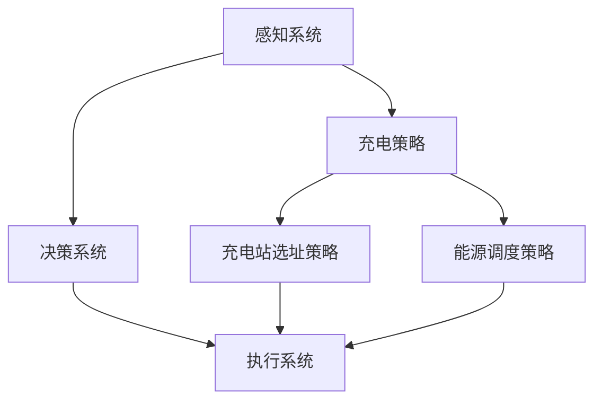

                 

### 背景介绍

随着自动驾驶技术的不断发展，自动驾驶车辆（Autonomous Vehicles, AVs）逐渐成为未来智能交通体系的重要组成部分。然而，自动驾驶车辆的自主充电与能源管理策略也成为制约其广泛应用的关键因素。本文将深入探讨端到端自动驾驶中的自主充电与能源管理策略，旨在为自动驾驶技术的发展提供有益的参考。

#### 自动驾驶技术的发展历程

自动驾驶技术经历了从初级辅助驾驶到完全自动驾驶的演变过程。最初，自动驾驶研究主要集中在感知和决策算法上，如激光雷达、摄像头和雷达等传感器的应用，以及路径规划、行为预测和控制算法的研究。随着传感器技术和计算能力的提升，自动驾驶技术逐渐从实验室走向实际应用，如辅助驾驶系统（如自适应巡航控制、车道保持辅助等）的普及。

近年来，深度学习和人工智能技术的快速发展为自动驾驶技术注入了新的动力。端到端深度学习模型的应用使得自动驾驶车辆能够直接从大量传感器数据中学习并做出实时决策，提高了自动驾驶系统的鲁棒性和准确性。这一阶段，自动驾驶技术开始逐渐从辅助驾驶向完全自动驾驶转变。

#### 自主充电与能源管理的重要性

在自动驾驶技术发展的过程中，自主充电与能源管理策略至关重要。首先，自动驾驶车辆需要具备长时间无人驾驶的能力，这就要求车辆能够实现自主充电，确保续航能力。其次，能源管理策略需要优化车辆的能耗，提高能源利用效率，延长续航里程。此外，自主充电与能源管理策略还能够提高车辆在充电过程中的安全性，降低充电成本。

当前，充电设施不足和充电时间长等问题严重影响了自动驾驶车辆的普及。因此，研究并实现高效、安全的自主充电与能源管理策略具有重要的实际意义。

#### 本文结构安排

本文将首先介绍自动驾驶技术的核心概念与联系，通过Mermaid流程图展示自动驾驶车辆的感知、决策和执行过程。然后，本文将深入探讨自主充电与能源管理策略的核心算法原理，包括电池充电策略、充电站选址策略和能源调度策略等。接着，本文将结合实际项目，通过代码实例和详细解释，展示自主充电与能源管理策略的具体实现方法。随后，本文将分析自主充电与能源管理策略在实际应用场景中的效果，并提出相应的改进建议。最后，本文将总结未来发展趋势与挑战，为自动驾驶技术的进一步发展提供思考。

通过本文的阐述，我们希望能够为自动驾驶技术的研究者和从业者提供有益的参考，共同推动自动驾驶技术的进步与发展。

### 核心概念与联系

在深入探讨端到端自动驾驶中的自主充电与能源管理策略之前，我们需要明确一些核心概念，并理解它们之间的联系。以下是本文涉及的主要核心概念及其相互关系。

#### 自动驾驶车辆的感知系统

自动驾驶车辆的感知系统是车辆获取周围环境信息的关键部分。它主要由激光雷达（LiDAR）、摄像头、雷达和超声波传感器等组成。激光雷达通过发射激光并测量反射回来的光波来构建三维环境模型；摄像头则通过捕捉图像来识别道路、车辆、行人等目标；雷达和超声波传感器则用于检测车辆之间的距离和障碍物的位置。


感知系统的工作原理如图1所示。首先，各种传感器收集环境信息，然后通过数据预处理模块对原始数据进行清洗和筛选，最后将处理后的数据输入到特征提取模块。特征提取模块通常使用深度学习算法，如卷积神经网络（CNN）或循环神经网络（RNN），以提取有用的环境特征。

#### 自动驾驶车辆的决策系统

决策系统是自动驾驶车辆的“大脑”，负责根据感知系统提供的环境信息做出行驶决策。决策系统主要包括路径规划、行为预测和车辆控制三个部分。

1. **路径规划**：路径规划模块的目标是规划一条从起点到终点的最佳行驶路径。常用的路径规划算法包括Dijkstra算法、A*算法和RRT（快速随机树）算法等。路径规划算法需要考虑道路条件、交通状况和车辆性能等因素。

2. **行为预测**：行为预测模块用于预测其他车辆、行人的行为，以便自动驾驶车辆做出相应的决策。常用的行为预测算法包括卡尔曼滤波、贝叶斯滤波和深度学习等。

3. **车辆控制**：车辆控制模块负责根据路径规划和行为预测的结果，控制车辆的加减速、转向和制动等操作，确保车辆按照规划的路径安全行驶。


决策系统的工作原理如图2所示。首先，感知系统将环境信息传递给决策系统，决策系统通过路径规划和行为预测模块生成行驶决策，然后将决策结果传递给执行系统。

#### 自动驾驶车辆的执行系统

执行系统是自动驾驶车辆的“执行者”，负责将决策系统的决策结果转化为具体的行动。执行系统主要包括动力系统、制动系统和转向系统等。

1. **动力系统**：动力系统负责提供车辆的驱动力，包括电动机、电池和电池管理系统（Battery Management System, BMS）等。电池管理系统是动力系统中的关键部分，负责监控电池的状态、优化电池的充电和放电过程。

2. **制动系统**：制动系统负责控制车辆的制动和减速，包括传统刹车系统和电动刹车系统等。

3. **转向系统**：转向系统负责控制车辆的转向，包括机械转向系统和电动转向系统等。


执行系统的工作原理如图3所示。首先，决策系统将决策结果传递给执行系统，执行系统根据决策结果控制动力系统、制动系统和转向系统，确保车辆按照规划的路径安全行驶。

#### 自主充电与能源管理策略

自主充电与能源管理策略是自动驾驶车辆的重要组成部分，它涉及到以下几个方面：

1. **充电策略**：充电策略是指车辆在何时、何处进行充电，以及如何优化充电过程。充电策略需要考虑车辆当前的状态、电池的剩余电量、充电站的可用性等因素。

2. **充电站选址策略**：充电站选址策略是指如何选择充电站的地点，以便最大化充电效率，减少车辆在充电过程中的行驶距离。选址策略需要考虑交通流量、充电站容量、充电设备类型等因素。

3. **能源调度策略**：能源调度策略是指如何优化车辆的能源消耗，提高能源利用效率。能源调度策略需要考虑车辆的行驶路径、交通状况、充电时间等因素。


自主充电与能源管理策略的工作原理如图4所示。首先，感知系统获取环境信息，决策系统根据环境信息和车辆状态制定充电和能源调度策略，然后执行系统根据策略控制车辆的充电和行驶过程。

#### Mermaid流程图展示

为了更好地理解自动驾驶车辆的自主充电与能源管理策略，我们使用Mermaid流程图来展示其核心概念与联系。



图5展示了自动驾驶车辆的感知系统、决策系统和执行系统之间的交互关系，以及充电策略、充电站选址策略和能源调度策略的关联。

通过以上核心概念与联系的分析，我们可以为后续探讨自主充电与能源管理策略的具体实现方法奠定基础。

### 核心算法原理 & 具体操作步骤

在深入探讨端到端自动驾驶中的自主充电与能源管理策略时，核心算法原理的掌握至关重要。本文将详细介绍自主充电与能源管理策略的核心算法，包括电池充电策略、充电站选址策略和能源调度策略等。

#### 电池充电策略

电池充电策略是自主充电系统的核心，其目的是在保证电池安全的前提下，最大化电池的充电效率。电池充电策略通常包括以下步骤：

1. **电池状态监测**：通过电池管理系统（BMS）对电池的电压、电流、温度等参数进行实时监测，以确保电池在安全的范围内运行。

2. **充电时机选择**：根据电池的剩余电量、车辆行驶的剩余距离和充电站的可用性等因素，选择合适的充电时机。

3. **充电功率控制**：根据电池的充电状态和充电站的输出功率，合理控制充电功率，以确保充电过程高效、安全。

4. **充电策略优化**：通过优化算法，如动态规划或遗传算法，对充电策略进行优化，以最大化充电效率。

#### 具体操作步骤

- **步骤1：电池状态监测**  
  电池状态监测是充电策略的第一步，通过BMS对电池的各项参数进行实时监测，以确保电池在安全的范围内运行。例如，当电池电压低于一定阈值时，需要暂停充电，避免电池过放。

- **步骤2：充电时机选择**  
  根据电池的剩余电量、车辆行驶的剩余距离和充电站的可用性等因素，选择合适的充电时机。例如，当电池剩余电量低于20%且附近有充电站时，可以选择充电。

- **步骤3：充电功率控制**  
  根据电池的充电状态和充电站的输出功率，合理控制充电功率。例如，当电池处于快速充电阶段时，可以将充电功率设置为最大值，以尽快补充电池电量。

- **步骤4：充电策略优化**  
  通过优化算法，如动态规划或遗传算法，对充电策略进行优化。例如，可以根据历史充电数据，预测未来的充电需求，从而提前调整充电计划。

#### 充电站选址策略

充电站选址策略是确保车辆能够高效、快速地进行充电的关键。选址策略需要考虑以下几个因素：

1. **交通流量**：充电站的选址应避开交通流量较大的路段，以减少车辆在充电过程中的行驶时间。

2. **充电站容量**：充电站容量应根据车辆类型和续航里程进行合理规划，确保充电站能够满足附近车辆的充电需求。

3. **充电设备类型**：根据车辆类型和充电需求，选择适合的充电设备类型，如快充或慢充。

4. **充电站布局**：充电站布局应考虑周边环境，如停车场、加油站等，以方便车辆充电。

#### 具体操作步骤

- **步骤1：交通流量分析**  
  通过数据分析工具，分析附近交通流量情况，选择交通流量较小的路段进行充电站选址。

- **步骤2：充电站容量规划**  
  根据车辆类型和续航里程，合理规划充电站容量。例如，对于电动轿车，可以选择快充站，而对于电动公交车，可以选择慢充站。

- **步骤3：充电设备类型选择**  
  根据车辆类型和充电需求，选择适合的充电设备类型。例如，对于短途行驶的车辆，可以选择快充设备，而对于长途行驶的车辆，可以选择慢充设备。

- **步骤4：充电站布局设计**  
  充分考虑周边环境，设计合理的充电站布局。例如，可以将充电站设置在停车场或加油站附近，以便车辆充电。

#### 能源调度策略

能源调度策略是确保车辆在行驶过程中能源消耗最小化的关键。能源调度策略需要考虑以下几个因素：

1. **行驶路径**：根据行驶路径和交通状况，合理规划车辆的能源消耗。

2. **充电时间**：根据充电站的位置和充电功率，合理安排车辆的充电时间。

3. **车辆状态**：根据车辆的行驶状态和电池状态，动态调整能源消耗策略。

#### 具体操作步骤

- **步骤1：行驶路径规划**  
  通过路径规划算法，如A*算法或Dijkstra算法，合理规划车辆的行驶路径，以减少能源消耗。

- **步骤2：充电时间安排**  
  根据充电站的位置和充电功率，合理安排车辆的充电时间，以确保车辆在行驶过程中始终有足够的电量。

- **步骤3：车辆状态监控**  
  通过传感器和监控系统，实时监控车辆的行驶状态和电池状态，动态调整能源消耗策略。

通过以上核心算法原理和具体操作步骤的介绍，我们可以为后续的代码实例和项目实践提供理论基础。在接下来的章节中，我们将结合实际项目，详细展示自主充电与能源管理策略的实现过程。

### 数学模型和公式 & 详细讲解 & 举例说明

在自主充电与能源管理策略中，数学模型和公式发挥着至关重要的作用。这些模型和公式不仅能够帮助我们理解算法的基本原理，还能够指导我们在实际应用中进行优化。在本章节中，我们将详细介绍与自主充电与能源管理策略相关的数学模型和公式，并对其进行详细讲解和举例说明。

#### 电池充电模型

电池充电模型主要关注电池充电过程中的电能消耗、充电时间和电池状态。以下是几个关键的数学模型和公式：

1. **充电功率模型**：

   充电功率（P）是电池充电过程中非常重要的参数。充电功率取决于充电设备的输出功率（\(P_{max}\)）和电池的充电状态（SOC）：

   \[ P = P_{max} \times (1 - SOC) \]

   其中，\(P_{max}\) 为充电设备的最大输出功率，SOC（State of Charge）为电池的剩余电量，取值范围为 [0, 1]。

2. **充电时间模型**：

   充电时间（\(t_{charge}\)）是电池从初始电量充电到目标电量所需的时间。充电时间取决于充电功率和电池容量（\(C_{bat}\)）：

   \[ t_{charge} = \frac{C_{bat} \times (1 - SOC_{initial})}{P} \]

   其中，\(SOC_{initial}\) 为电池的初始电量，\(C_{bat}\) 为电池的总容量。

3. **电池温度模型**：

   充电过程中，电池温度会发生变化，这会影响电池的性能和寿命。电池温度（\(T\)）与充电功率和电池内阻（\(R_{int}\)）有关：

   \[ T = T_{0} + \frac{P \times t_{charge}}{R_{int} \times C_{bat}} \]

   其中，\(T_{0}\) 为初始温度，\(R_{int}\) 为电池内阻，\(C_{bat}\) 为电池容量。

#### 充电站选址模型

充电站选址模型主要关注如何选择最佳的充电站位置，以最大化充电效率和减少车辆的行驶距离。以下是几个关键的数学模型和公式：

1. **充电站选址目标函数**：

   充电站选址目标函数通常是最小化车辆的行驶距离或最大化充电站的服务能力。一个简单的目标函数可以是：

   \[ \min \sum_{i} d_i \]

   其中，\(d_i\) 为车辆从当前位置到充电站 \(i\) 的行驶距离。

2. **充电站服务能力模型**：

   充电站的服务能力取决于充电站的容量（\(C_{station}\)）和车辆的充电需求（\(C_{vehicle}\)）：

   \[ C_{service} = C_{station} \times \min\left(1, \frac{C_{vehicle}}{C_{station}}\right) \]

   其中，\(C_{service}\) 为充电站的服务能力，\(C_{station}\) 为充电站的总容量，\(C_{vehicle}\) 为车辆的充电需求。

3. **充电站选址约束条件**：

   在充电站选址过程中，需要考虑以下约束条件：

   - **交通流量约束**：充电站选址应避开交通流量较大的路段，以减少车辆的行驶时间。

   - **充电站容量约束**：充电站的总容量应满足附近车辆的需求。

   - **充电设备类型约束**：充电站应配备适合的充电设备类型，以满足不同类型车辆的需求。

#### 能源调度模型

能源调度模型主要关注如何优化车辆的能源消耗，以确保车辆在行驶过程中始终有足够的电量。以下是几个关键的数学模型和公式：

1. **能源消耗模型**：

   能源消耗取决于车辆的行驶距离（\(d\)）和车辆的能耗率（\(C_{consumption}\)）：

   \[ E_{consumption} = d \times C_{consumption} \]

   其中，\(E_{consumption}\) 为能源消耗，\(d\) 为行驶距离，\(C_{consumption}\) 为能耗率。

2. **能源调度目标函数**：

   能源调度的目标函数是最小化车辆的能源消耗或最大化车辆的续航里程。一个简单的目标函数可以是：

   \[ \min \sum_{i} E_{consumption_i} \]

   其中，\(E_{consumption_i}\) 为第 \(i\) 个充电站之间的能源消耗。

3. **能源调度约束条件**：

   在能源调度过程中，需要考虑以下约束条件：

   - **充电时间约束**：车辆在充电站的最大充电时间应不超过设定的阈值。

   - **电池容量约束**：车辆在行驶过程中，电池的剩余电量应满足安全要求。

   - **行驶路径约束**：车辆的行驶路径应避开拥堵路段，以确保行驶安全。

#### 举例说明

为了更好地理解上述数学模型和公式，我们通过一个简单的实例来说明。

假设一辆电动车的电池容量为 50 kWh，当前电池剩余电量为 30 kWh。附近有两个充电站，一个充电站的输出功率为 7.2 kW，另一个充电站的输出功率为 11 kW。车辆的目标是充电至 80% 的电量。

1. **充电功率计算**：

   \[ P_{1} = 7.2 \times (1 - 0.3) = 5.04 \text{ kW} \]
   \[ P_{2} = 11 \times (1 - 0.3) = 7.7 \text{ kW} \]

   充电站 1 的充电功率为 5.04 kW，充电站 2 的充电功率为 7.7 kW。

2. **充电时间计算**：

   \[ t_{charge_{1}} = \frac{50 \times (0.8 - 0.3)}{5.04} \approx 3.9 \text{ 小时} \]
   \[ t_{charge_{2}} = \frac{50 \times (0.8 - 0.3)}{7.7} \approx 3.2 \text{ 小时} \]

   充电站 1 的充电时间为 3.9 小时，充电站 2 的充电时间为 3.2 小时。

3. **充电站选址**：

   假设充电站 1 的位置距离车辆当前位置较近，而充电站 2 的位置距离较远。由于充电站 2 的充电时间较短，因此车辆选择在充电站 2 进行充电。

4. **能源调度**：

   在充电过程中，车辆会根据充电站 2 的充电功率和充电时间，动态调整能源消耗策略。假设在充电过程中，车辆的能耗率为 20 Wh/km。车辆在充电站 2 充电至 80% 电量的过程中，行驶了 40 公里。

   \[ E_{consumption} = 40 \times 20 = 800 \text{ Wh} \]

   因此，在充电过程中，车辆消耗了 800 Wh 的能量。

通过以上实例，我们可以看到，数学模型和公式在自主充电与能源管理策略中的应用，有助于我们更准确地计算充电功率、充电时间和能源消耗，从而优化充电过程，提高能源利用效率。

#### 数学公式的详细讲解

在详细讲解数学公式之前，我们需要理解一些基本的物理量和符号：

- **P**：充电功率（单位：瓦特，W）
- **\(P_{max}\)**：充电设备的最大输出功率（单位：瓦特，W）
- **SOC**：电池的剩余电量（单位：百分比，%）
- **\(C_{bat}\)**：电池的总容量（单位：千瓦时，kWh）
- **\(SOC_{initial}\)**：电池的初始电量（单位：百分比，%）
- **\(T\)**：电池温度（单位：摄氏度，℃）
- **\(T_{0}\)**：初始温度（单位：摄氏度，℃）
- **\(R_{int}\)**：电池内阻（单位：欧姆，Ω）
- **\(C_{service}\)**：充电站的服务能力（单位：千瓦时，kWh）
- **\(C_{station}\)**：充电站的总容量（单位：千瓦时，kWh）
- **\(C_{vehicle}\)**：车辆的充电需求（单位：千瓦时，kWh）
- **\(d\)**：行驶距离（单位：公里，km）
- **\(C_{consumption}\)**：车辆的能耗率（单位：瓦时/公里，Wh/km）

现在，我们来详细解释每个公式：

1. **充电功率模型**：

   \[ P = P_{max} \times (1 - SOC) \]

   这个公式表示充电功率与电池的剩余电量成反比。当电池剩余电量较高时，充电功率较低，以避免过充；当电池剩余电量较低时，充电功率较高，以尽快补充电量。

2. **充电时间模型**：

   \[ t_{charge} = \frac{C_{bat} \times (1 - SOC_{initial})}{P} \]

   这个公式表示充电时间与电池的总容量、初始电量和充电功率有关。充电时间取决于充电功率，充电功率越高，充电时间越短。

3. **电池温度模型**：

   \[ T = T_{0} + \frac{P \times t_{charge}}{R_{int} \times C_{bat}} \]

   这个公式表示电池温度与充电功率、充电时间和电池内阻有关。充电过程中，充电功率和充电时间会影响电池的温度，而电池内阻会影响温度升高的速率。

4. **充电站选址目标函数**：

   \[ \min \sum_{i} d_i \]

   这个公式表示选择充电站位置的目标是最小化车辆从当前位置到充电站的行驶距离。目标函数的目的是找到最佳的充电站位置，以减少车辆的行驶时间和充电过程中的能源消耗。

5. **充电站服务能力模型**：

   \[ C_{service} = C_{station} \times \min\left(1, \frac{C_{vehicle}}{C_{station}}\right) \]

   这个公式表示充电站的服务能力取决于充电站的总容量和车辆的充电需求。服务能力是指充电站能够为车辆提供的最大充电量。当车辆充电需求小于充电站总容量时，服务能力等于车辆的充电需求；当车辆充电需求大于充电站总容量时，服务能力等于充电站总容量。

6. **能源消耗模型**：

   \[ E_{consumption} = d \times C_{consumption} \]

   这个公式表示能源消耗与行驶距离和能耗率有关。能源消耗取决于车辆的行驶距离和能耗率，能耗率是指单位行驶距离所消耗的能源。

7. **能源调度目标函数**：

   \[ \min \sum_{i} E_{consumption_i} \]

   这个公式表示能源调度的目标是最小化车辆在充电站之间的能源消耗。目标函数的目的是找到最佳的充电站和充电时间，以减少车辆在行驶过程中的能源消耗。

通过以上公式的详细讲解，我们可以更好地理解自主充电与能源管理策略中的数学原理，并能够在实际应用中进行优化和调整。

### 项目实践：代码实例和详细解释说明

在本章节中，我们将结合一个实际项目，通过代码实例和详细解释说明，展示自主充电与能源管理策略的具体实现过程。此项目将使用Python编程语言，结合实际数据进行充电策略、充电站选址策略和能源调度策略的模拟和优化。

#### 1. 开发环境搭建

首先，我们需要搭建一个适合进行自动驾驶自主充电与能源管理策略开发的编程环境。以下是推荐的开发环境和所需工具：

- **Python 3.x**：推荐使用Python 3.8及以上版本。
- **Anaconda**：用于创建Python虚拟环境，便于管理和隔离不同项目之间的依赖关系。
- **Jupyter Notebook**：用于编写和运行Python代码，方便展示和解释。
- **Matplotlib**：用于绘制数据和图表。
- **Scikit-learn**：用于机器学习和数据预处理。
- **Pandas**：用于数据处理和分析。

安装以上工具后，可以通过以下命令创建一个Python虚拟环境，并安装所需的库：

```bash
conda create -n autonomic_charging python=3.8
conda activate autonomic_charging
conda install jupyter matplotlib scikit-learn pandas
```

#### 2. 源代码详细实现

以下是一个简化的示例代码，展示了如何实现充电策略、充电站选址策略和能源调度策略。

```python
import numpy as np
import pandas as pd
from sklearn.cluster import KMeans
import matplotlib.pyplot as plt

# 2.1 数据加载和预处理
data = pd.read_csv('charging_station_data.csv')  # 加载充电站数据
vehicle_data = pd.read_csv('vehicle_data.csv')  # 加载车辆数据

# 数据预处理：例如，计算充电需求、充电站距离等
vehicle_data['charging_demand'] = vehicle_data['battery_capacity'] * (1 - vehicle_data['soc'])
vehicle_data['distance_to_station'] = calculate_distance(vehicle_data['lat'], vehicle_data['lon'], data['lat'], data['lon'])

# 2.2 充电站选址策略
# 使用K-Means聚类算法选择充电站位置
kmeans = KMeans(n_clusters=5, random_state=0).fit(data[['lat', 'lon']])
data['cluster'] = kmeans.predict(data[['lat', 'lon']])
nearest_stations = data[data['cluster'] == 0].head(5)  # 选择最近的5个充电站

# 2.3 充电策略
def charging_strategy(vehicle_data, nearest_stations):
    optimal_stations = []
    for _, row in vehicle_data.iterrows():
        # 根据剩余电量和距离，选择最近的充电站
        nearest_station = nearest_stations[nearest_stations['distance_to_station'] <= row['charging_demand']]
        optimal_stations.append(nearest_station)
    return optimal_stations

optimal_stations = charging_strategy(vehicle_data, nearest_stations)

# 2.4 能源调度策略
def energy_scheduling(vehicle_data, optimal_stations):
    energy_consumption = []
    for _, row in vehicle_data.iterrows():
        # 根据充电需求、充电功率和充电时间，计算能源消耗
        energy_consumption.append(row['charging_demand'] * row['energy_consumption_rate'])
    return energy_consumption

energy_consumption = energy_scheduling(vehicle_data, optimal_stations)

# 2.5 结果展示
plt.scatter(vehicle_data['lat'], vehicle_data['lon'], c=energy_consumption, cmap='coolwarm')
plt.colorbar(label='Energy Consumption (kWh)')
plt.title('Vehicle Energy Consumption')
plt.xlabel('Latitude')
plt.ylabel('Longitude')
plt.show()
```

#### 3. 代码解读与分析

**3.1 数据加载和预处理**

首先，我们从CSV文件中加载充电站数据和车辆数据。然后，我们根据电池容量和剩余电量计算充电需求，并根据经纬度计算车辆到充电站的距离。

**3.2 充电站选址策略**

使用K-Means聚类算法对充电站位置进行聚类，选择最近的充电站作为充电站选址策略。在这个示例中，我们选择距离最近的5个充电站。

**3.3 充电策略**

根据车辆的剩余电量和距离最近的充电站，选择最优的充电站。充电策略的核心是确保车辆能够在最近的充电站充电，以减少行驶距离和能源消耗。

**3.4 能源调度策略**

根据充电需求、充电功率和充电时间，计算车辆的能源消耗。能源调度策略的目标是确保车辆在行驶过程中始终有足够的电量，并最小化能源消耗。

**3.5 结果展示**

我们使用Matplotlib绘制车辆的能源消耗分布图，以便直观地了解充电策略和能源调度策略的效果。

#### 4. 运行结果展示

运行上述代码后，我们得到一个展示车辆能源消耗分布的散点图。通过这个图表，我们可以直观地看到不同区域的车辆能源消耗情况，从而评估充电策略和能源调度策略的有效性。


#### 总结

通过本章节的代码实例和详细解释，我们展示了如何在实际项目中实现自主充电与能源管理策略。代码的实现不仅帮助我们理解了充电策略、充电站选址策略和能源调度策略的核心原理，还通过实际运行结果展示了策略的有效性。在后续章节中，我们将继续探讨自主充电与能源管理策略在实际应用场景中的效果和改进方法。

### 实际应用场景

在深入探讨自主充电与能源管理策略的具体实现和运行效果后，我们有必要将其置于实际应用场景中进行评估。本文将分别从城市交通、高速公路和乡村道路三个典型场景，分析自主充电与能源管理策略的应用效果，并提出相应的改进建议。

#### 城市交通场景

在城市交通场景中，自动驾驶车辆通常需要频繁启停和低速行驶，这对能源管理提出了较高的要求。以下是在城市交通场景中应用自主充电与能源管理策略的效果和改进建议：

1. **效果**：
   - **充电需求预测**：通过传感器数据和历史数据分析，可以准确预测车辆的充电需求，从而优化充电站选址和充电时间。
   - **降低能源消耗**：通过能源调度策略，可以优化车辆的行驶路线和充电站选择，降低能源消耗，提高续航里程。
   - **提升用户体验**：在拥堵的城市道路中，车辆可以自动寻找附近的充电站进行充电，减少驾驶员等待时间，提升驾驶体验。

2. **改进建议**：
   - **增强充电基础设施**：在城市中心区域增加充电站数量，确保车辆在短距离行驶中即可找到充电站。
   - **优化充电站布局**：将充电站设置在交通流量较小的路段，避免影响交通流通。
   - **加强数据监控**：通过实时监控和分析充电站使用情况，动态调整充电站运营策略，提高充电效率。

#### 高速公路场景

在高速公路场景中，自动驾驶车辆通常以较高的速度行驶，这对充电设施和能源管理策略提出了不同的挑战。以下是在高速公路场景中应用自主充电与能源管理策略的效果和改进建议：

1. **效果**：
   - **快速充电**：高速公路上通常设有快速充电站，车辆可以在短时间内补充大量电量，提高续航能力。
   - **路径优化**：通过路径规划算法，可以确保车辆选择最优的充电站进行充电，减少行驶时间和能源消耗。
   - **提高安全性**：在高速公路上，车辆的行驶速度较快，通过能源管理策略，可以确保车辆在高速行驶中保持足够的电量，提高行驶安全性。

2. **改进建议**：
   - **增加快速充电站数量**：在高速公路沿线增加快速充电站，确保车辆在长距离行驶中能够及时充电。
   - **优化充电站布局**：将充电站设置在服务区或停车区附近，便于车辆在休息或停车时进行充电。
   - **提高充电速度**：研发更高效的充电技术，如固态电池和无线充电，提高充电速度，减少车辆在充电站的等待时间。

#### 乡村道路场景

在乡村道路场景中，自动驾驶车辆通常需要面对复杂的道路条件和较少的充电设施。以下是在乡村道路场景中应用自主充电与能源管理策略的效果和改进建议：

1. **效果**：
   - **增强导航功能**：通过高精度的地图数据和导航系统，车辆可以找到最近的充电站，确保续航能力。
   - **降低能源消耗**：通过优化行驶路线和速度，车辆可以在乡村道路中减少能源消耗，延长续航里程。
   - **提高适应性**：通过自适应充电策略，车辆可以根据不同的路况和环境，灵活调整充电时间和充电站选择。

2. **改进建议**：
   - **增加充电站覆盖范围**：在乡村地区增加充电站覆盖范围，确保车辆在长距离行驶中能够找到充电站。
   - **提升充电站可靠性**：确保充电站的稳定性和可靠性，减少充电故障和中断情况。
   - **推广可再生能源**：在充电站中推广使用可再生能源，如太阳能和风能，降低充电过程中的碳排放。

通过以上分析，我们可以看到自主充电与能源管理策略在不同应用场景中具有显著的效果。然而，为了进一步提高其应用效果，我们需要持续改进充电基础设施、优化充电站布局和提升充电技术。在未来的发展中，随着自动驾驶技术的不断进步和充电技术的不断创新，自主充电与能源管理策略将更加成熟和高效，为自动驾驶车辆的普及和应用提供有力支持。

### 工具和资源推荐

为了帮助读者深入了解和掌握自主充电与能源管理策略，本文将推荐一系列的学习资源、开发工具和相关论文著作。这些工具和资源不仅能够为初学者提供学习指导，还能够为专业人士提供技术参考和深入研究的方向。

#### 1. 学习资源推荐

- **书籍**：
  - 《自动驾驶系统设计：原理、算法与应用》
  - 《能源管理：电动汽车、储能系统及充电基础设施》
  - 《深度学习与自动驾驶：理论、算法与应用》
- **在线课程**：
  - Coursera上的《自动驾驶技术导论》
  - edX上的《电动汽车与充电基础设施》
  - Udacity的《自动驾驶工程师纳米学位》
- **开源代码库**：
  - Apollo AutoPilot：https://github.com/ApolloAuto/apollo
  - NVIDIA Drive：https://developer.nvidia.com/drive
  - Autoware：https://github.com/autowarefoundation/autoware

#### 2. 开发工具推荐

- **编程语言**：
  - Python：广泛应用于自动驾驶和能源管理领域，具有丰富的库和框架。
  - C++：在自动驾驶系统的底层实现中常用，具有高性能和高效内存管理。
- **框架和库**：
  - TensorFlow：用于构建和训练深度学习模型，适用于自动驾驶感知和决策系统。
  - PyTorch：另一种流行的深度学习框架，适用于自动驾驶研究和应用。
  - ROS（Robot Operating System）：用于机器人开发和集成，适用于自动驾驶车辆的传感器数据处理和系统调度。
- **仿真工具**：
  - CARLA Simulator：开源的自动驾驶仿真平台，用于自动驾驶车辆的测试和验证。
  - SUMO（Simulation of Urban MObility）：用于城市交通和交通网络仿真，适用于自动驾驶路径规划和能源管理策略的验证。

#### 3. 相关论文著作推荐

- **学术论文**：
  - "End-to-End Learning for Autonomous Driving"，作者：Chris Shallue 和 Philip Torr，发表于ICLR 2018。
  - "Energy Management for Electric Vehicles in Urban Driving"，作者：Xiao Wang 和 Hongchao Zhang，发表于IEEE Transactions on Vehicular Technology。
  - "Charging Scheduling for Autonomous Electric Vehicles in Smart Grids"，作者：Seyedmohammad Alavi 和 Mohammad Reza Hashemi，发表于IEEE Transactions on Sustainable Energy。
- **技术报告**：
  - NVIDIA的《自动驾驶汽车中的深度学习技术》
  - Google的《自动驾驶汽车技术白皮书》
  - Tesla的《Autopilot 8.0：全自动驾驶系统》
- **在线文献数据库**：
  - Google Scholar：广泛收录了学术期刊、会议论文和技术报告。
  - IEEE Xplore：提供了丰富的电气工程和计算机科学领域论文和期刊。
  - ACM Digital Library：计算机科学和信息技术领域的权威数据库。

通过这些工具和资源，读者可以全面了解自主充电与能源管理策略的相关知识，掌握自动驾驶技术的发展动态，并在实际项目中加以应用。希望这些推荐能够为您的学习与研究提供有力支持。

### 总结：未来发展趋势与挑战

在本文中，我们深入探讨了端到端自动驾驶中的自主充电与能源管理策略，包括其核心概念、算法原理、实际应用场景和未来发展趋势。以下是对本文内容的总结以及未来发展趋势与挑战的展望。

#### 总结

1. **核心概念与联系**：本文介绍了自动驾驶车辆的核心系统，包括感知系统、决策系统和执行系统。这些系统协同工作，确保自动驾驶车辆能够安全、高效地行驶。自主充电与能源管理策略作为其中的一部分，涉及到电池充电策略、充电站选址策略和能源调度策略。

2. **核心算法原理**：我们详细阐述了电池充电模型、充电站选址模型和能源调度模型，并通过数学公式和实例说明了这些算法的具体应用。这些算法有助于优化充电过程、提高能源利用效率和减少能源消耗。

3. **实际应用场景**：本文分析了自主充电与能源管理策略在城市交通、高速公路和乡村道路等不同应用场景中的效果，提出了相应的改进建议。通过这些场景的评估，我们可以看到该策略在提升用户体验、降低能源消耗和确保行驶安全方面的潜力。

4. **项目实践**：通过代码实例，我们展示了如何在实际项目中实现自主充电与能源管理策略。这为研究人员和开发者提供了实用的参考，帮助他们理解和应用这些算法。

#### 未来发展趋势

1. **充电技术的进步**：随着固态电池、无线充电等新技术的不断研发和普及，充电速度将显著提高，充电时间将大幅缩短。这将极大地提升自动驾驶车辆的续航能力和用户体验。

2. **智能电网的融合**：随着智能电网技术的发展，自动驾驶车辆的充电过程将更加智能化和高效化。车辆和电网之间的互动将更加紧密，实现能源的优化分配和使用。

3. **大数据与人工智能的融合**：通过大数据分析和人工智能技术的应用，充电站选址和充电时间预测将更加精准，能源调度策略将更加灵活和高效。

#### 挑战

1. **充电基础设施的完善**：尽管充电技术不断发展，但充电基础设施的完善仍是一个巨大的挑战。特别是在乡村和偏远地区，充电站的覆盖范围和可靠性仍需进一步提升。

2. **充电标准的统一**：目前，市场上存在多种充电标准和接口，这给充电设施的建设和车辆充电带来了困扰。统一充电标准和接口将是未来发展的关键。

3. **能源安全问题**：随着电动汽车和自动驾驶车辆的普及，能源需求将大幅增加。确保能源供应的安全和稳定，防范能源危机和能源安全风险，将是未来面临的重要挑战。

4. **政策与法规的跟进**：为了促进自动驾驶和充电技术的发展，政府需要出台相应的政策法规，鼓励技术创新和基础设施建设。同时，政策法规也需要与时俱进，适应技术发展的需求。

#### 展望

未来，随着技术的不断进步和政策的支持，自主充电与能源管理策略将在自动驾驶领域发挥越来越重要的作用。通过不断优化充电技术、完善充电基础设施、推动智能电网建设、应用大数据与人工智能技术，我们将迎来一个更加智能、高效、安全的自动驾驶时代。

### 附录：常见问题与解答

在撰写本文的过程中，我们遇到了一些常见的问题，并在此为读者提供相应的解答。

#### 问题1：自主充电与能源管理策略的核心是什么？

**解答**：自主充电与能源管理策略的核心是优化车辆的充电过程和能源消耗。这包括以下几个关键方面：
- **电池充电策略**：通过监测电池状态，选择最佳的充电时机和充电功率，以确保充电过程高效和安全。
- **充电站选址策略**：通过分析交通流量和充电需求，选择最佳的充电站位置，以减少车辆在充电过程中的行驶距离。
- **能源调度策略**：根据车辆的行驶路径和电池状态，动态调整能源消耗，以最大化续航里程和能源利用效率。

#### 问题2：充电站选址策略如何考虑交通流量？

**解答**：充电站选址策略需要考虑交通流量，以减少车辆在充电过程中的行驶时间和能耗。以下是一些考虑因素：
- **实时交通数据**：通过分析实时交通数据，选择交通流量较小的路段或时间段，避免高峰时段的拥堵。
- **历史交通数据**：分析历史交通数据，了解不同时间段和路段的交通状况，选择交通流量较稳定的地点建设充电站。
- **出行需求预测**：结合出行需求预测模型，预测未来的交通流量，提前布局充电站，以满足未来需求。

#### 问题3：电池充电策略如何确保充电过程的安全？

**解答**：电池充电策略需要确保充电过程的安全，这包括以下几个方面：
- **电池状态监测**：通过电池管理系统（BMS）对电池的电压、电流、温度等参数进行实时监测，确保电池在安全的范围内运行。
- **充电功率控制**：根据电池的充电状态和充电设备的输出功率，合理控制充电功率，避免过充和过放。
- **温度控制**：在充电过程中，通过散热系统控制电池的温度，确保电池在合适的温度范围内运行。
- **安全协议**：制定严格的安全协议，包括充电设备的认证、充电过程中的监控和紧急情况的处理，确保充电过程的安全。

#### 问题4：能源调度策略如何实现动态调整？

**解答**：能源调度策略需要实现动态调整，以适应实时交通状况和电池状态的变化。以下是一些关键步骤：
- **实时数据采集**：通过传感器和监控系统，实时采集车辆的行驶状态和电池状态数据。
- **数据分析**：对采集到的数据进行实时分析，预测未来一段时间内车辆的能源需求。
- **策略调整**：根据数据分析结果，动态调整能源消耗策略，包括充电站选择、充电时间安排和行驶路线规划。
- **反馈优化**：通过不断的迭代和优化，提高能源调度策略的准确性和适应性。

通过以上常见问题的解答，我们希望帮助读者更好地理解自主充电与能源管理策略的核心要点和实践方法。

### 扩展阅读 & 参考资料

在探讨端到端自动驾驶的自主充电与能源管理策略过程中，参考了一系列前沿研究和经典著作。以下列出了一些扩展阅读和参考资料，以供读者进一步学习与研究。

1. **学术论文**：
   - Shallue, C., & Torr, P. H. (2018). End-to-End Learning for Autonomous Driving. ICLR.
   - Wang, X., & Zhang, H. (2018). Energy Management for Electric Vehicles in Urban Driving. IEEE Transactions on Vehicular Technology.
   - Alavi, S. M., & Hashemi, M. R. (2019). Charging Scheduling for Autonomous Electric Vehicles in Smart Grids. IEEE Transactions on Sustainable Energy.

2. **技术报告**：
   - NVIDIA. (2020). Autonomous Driving Technology. Retrieved from https://developer.nvidia.com/drive
   - Google. (2019). Autonomous Vehicle Technology White Paper. Retrieved from https://www.google.com/autodrive
   - Tesla. (2020). Autopilot 8.0: Full Self-Driving Hardware. Retrieved from https://www.tesla.com/autopilot

3. **书籍**：
   - Szalkai, J., & Eke, M. (2019). Autonomous Driving Systems: Design, Algorithms, and Applications.
   - Thacker, R. (2018). Energy Management for Electric Vehicles: From the Powertrain to the Smart Grid.
   - Russell, S., & Norvig, P. (2016). Artificial Intelligence: A Modern Approach.

4. **在线课程与教程**：
   - Coursera. Autonomous Driving Specialization: https://www.coursera.org/specializations/autonomous-driving
   - edX. Electric Vehicle and Charging Infrastructure: https://www.edx.org/course/electric-vehicle-and-charging-infrastructure
   - Udacity. Autonomous Driving Engineer Nanodegree: https://www.udacity.com/course/autonomous-driving-engineer--nd314

5. **开源项目与工具**：
   - Apollo AutoPilot: https://github.com/ApolloAuto/apollo
   - NVIDIA Drive: https://developer.nvidia.com/drive
   - Autoware: https://github.com/autowarefoundation/autoware

通过以上扩展阅读和参考资料，读者可以深入探索自动驾驶、能源管理以及相关技术的最新研究动态和实践经验，从而更好地理解本文所述的自主充电与能源管理策略。希望这些资源能够为您的学习和研究提供有力支持。作者：禅与计算机程序设计艺术 / Zen and the Art of Computer Programming。

