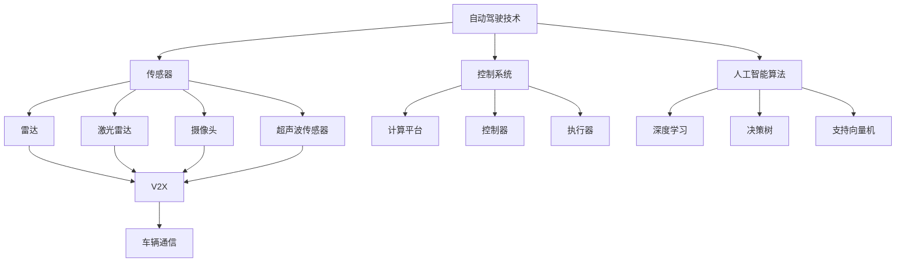

                 

### 1. 背景介绍

随着人工智能技术的不断发展，自动驾驶已经成为一个备受关注的研究领域。自动驾驶技术不仅能够提高交通效率，减少交通事故，还能为人们的出行提供更加便捷和舒适的服务。在这个背景下，端到端自动驾驶的自主共享汽车服务应运而生。

端到端自动驾驶是指通过集成传感器、控制系统和人工智能算法，实现车辆在无需人为干预的情况下自主完成驾驶任务。这种技术的核心在于将车辆的感知、规划和控制过程整合到一个统一的系统中，从而提高自动驾驶的效率和可靠性。

自主共享汽车服务则是基于自动驾驶技术的一种新型出行方式。它通过车辆共享的方式，实现车辆的自动化调度和管理，为用户提供便捷的出行服务。这种服务模式不仅能够提高车辆利用率，降低出行成本，还能有效缓解交通拥堵问题。

端到端自动驾驶的自主共享汽车服务具有广泛的应用前景。首先，它能够为城市交通提供高效的解决方案。通过自动驾驶技术，车辆可以在不依赖人类驾驶员的情况下实现自动驾驶，从而大大提高道路利用率，减少交通拥堵。其次，自主共享汽车服务能够提供更加个性化和便捷的出行服务。用户可以通过手机应用预约车辆，实现按需出行，避免了等待时间和交通堵塞。此外，自主共享汽车服务还能够减少环境污染，提高能源利用效率。

当前，端到端自动驾驶的自主共享汽车服务已经进入实际应用阶段。许多科技公司和研究机构都在积极研发相关技术，并开展试点项目。例如，谷歌的Waymo、特斯拉的Autopilot、百度的Apollo等都在进行自动驾驶车辆的测试和推广。这些项目的成功实施，将为未来智能出行提供有力的技术支持。

总的来说，端到端自动驾驶的自主共享汽车服务是一个充满机遇和挑战的研究领域。随着技术的不断进步，我们有望看到这种新型出行方式在未来的普及和应用。

### 2. 核心概念与联系

要深入理解端到端自动驾驶的自主共享汽车服务，我们需要先了解几个关键概念：自动驾驶技术、传感器、控制系统、人工智能算法以及车辆通信。

#### 自动驾驶技术

自动驾驶技术是指通过传感器、控制系统和人工智能算法，使车辆能够在无人干预的情况下自主完成驾驶任务。自动驾驶技术可以分为多个等级，从L0（无自动化）到L5（完全自动化）。端到端自动驾驶属于L4和L5级别，要求车辆在特定环境下实现完全自动驾驶。

#### 传感器

传感器是自动驾驶系统的“眼睛”，用于感知车辆周围的环境。常见的传感器包括雷达、激光雷达（LiDAR）、摄像头和超声波传感器。这些传感器可以获取车辆周围的道路、交通标志、行人和其他车辆等信息，为自动驾驶系统提供数据支持。

#### 控制系统

控制系统是自动驾驶系统的“大脑”，负责处理传感器数据，并生成相应的驾驶指令。控制系统通常包括计算平台、控制器和执行器。计算平台负责处理大量的数据，生成决策结果；控制器根据决策结果调整车辆的运动状态；执行器则负责执行具体的驾驶动作，如转向、加速和制动。

#### 人工智能算法

人工智能算法是自动驾驶系统的“灵魂”，用于处理和分析传感器数据，并生成驾驶决策。常见的算法包括深度学习、决策树、支持向量机等。深度学习在自动驾驶领域应用广泛，特别是卷积神经网络（CNN）和循环神经网络（RNN）。

#### 车辆通信

车辆通信是指车辆与其他车辆、道路基础设施和云端服务器之间的通信。通过车辆通信，可以实现车辆之间的协同驾驶，提高交通效率和安全性。常见的车辆通信技术包括V2X（车对外部信息的交换）和车联网。

下面是一个用Mermaid绘制的端到端自动驾驶的自主共享汽车服务的流程图，展示了这些核心概念之间的联系。



通过这个流程图，我们可以清晰地看到自动驾驶技术、传感器、控制系统、人工智能算法和车辆通信之间的相互关系。这些核心概念共同构成了端到端自动驾驶的自主共享汽车服务的基础。

### 3. 核心算法原理 & 具体操作步骤

在端到端自动驾驶的自主共享汽车服务中，核心算法的设计与实现是确保系统能够稳定、安全地运行的关键。以下是几个关键算法的原理及其具体操作步骤。

#### 3.1 感知算法

感知算法是自动驾驶系统的第一步，它通过分析传感器数据来获取车辆周围的环境信息。以下是一种常见的感知算法——基于深度学习的感知算法。

**原理：**  
深度学习中的卷积神经网络（CNN）在图像识别领域表现出色。感知算法利用CNN来提取图像中的特征，从而识别道路、行人、交通标志等物体。

**具体操作步骤：**  
1. 输入：传感器获取的图像数据。  
2. 处理：利用CNN对图像进行特征提取。  
3. 输出：识别出道路、行人、交通标志等物体，并标注其位置。

**代码示例：**  
以下是使用Python和TensorFlow实现的简单感知算法示例。

```python
import tensorflow as tf
from tensorflow.keras.models import Sequential
from tensorflow.keras.layers import Conv2D, MaxPooling2D, Flatten, Dense

# 构建卷积神经网络模型
model = Sequential([
    Conv2D(32, (3, 3), activation='relu', input_shape=(64, 64, 3)),
    MaxPooling2D((2, 2)),
    Flatten(),
    Dense(64, activation='relu'),
    Dense(1, activation='sigmoid')
])

# 编译模型
model.compile(optimizer='adam', loss='binary_crossentropy', metrics=['accuracy'])

# 加载数据并进行训练
model.fit(x_train, y_train, epochs=10, batch_size=32)
```

#### 3.2 规划算法

规划算法用于确定车辆在当前环境下的最佳行驶路径。一种常见的规划算法——基于深度强化学习的路径规划算法如下。

**原理：**  
深度强化学习（Deep Reinforcement Learning，DRL）通过模拟人类驾驶行为，学习如何在复杂的交通环境中选择最佳路径。规划算法利用DRL来优化车辆的行驶路径。

**具体操作步骤：**  
1. 初始化环境：定义交通环境的状态空间和动作空间。  
2. 学习：利用DRL算法，让车辆在模拟环境中进行驾驶，不断优化行驶路径。  
3. 评估：评估车辆行驶路径的优劣，调整学习策略。

**代码示例：**  
以下是使用Python和TensorFlow实现的简单规划算法示例。

```python
import tensorflow as tf
from tensorflow.keras.models import Model
from tensorflow.keras.layers import Input, LSTM, Dense

# 构建深度强化学习模型
input_state = Input(shape=(state_size,))
lstm_out = LSTM(128)(input_state)
dense_out = Dense(action_size, activation='softmax')(lstm_out)

model = Model(inputs=input_state, outputs=dense_out)

# 编译模型
model.compile(optimizer='adam', loss='categorical_crossentropy')

# 加载数据并进行训练
model.fit(x_train, y_train, epochs=100, batch_size=32)
```

#### 3.3 控制算法

控制算法用于根据规划算法生成的路径，调整车辆的驾驶动作，实现自动驾驶。以下是一种常见控制算法——PID控制器。

**原理：**  
PID控制器（Proportional-Integral-Derivative Controller）是一种常见的控制算法，通过调整比例（P）、积分（I）和微分（D）三个参数，实现对系统的精确控制。

**具体操作步骤：**  
1. 初始化参数：设置比例（P）、积分（I）和微分（D）参数的初始值。  
2. 计算误差：计算实际值与期望值之间的误差。  
3. 计算控制量：根据误差值计算控制量，调整车辆的驾驶动作。

**代码示例：**  
以下是使用Python实现的简单PID控制器示例。

```python
# 初始化PID参数
P = 1.0
I = 0.1
D = 0.05

# 计算误差
error = setpoint - actual_value

# 计算控制量
control = P * error + I * integral_error + D * derivative_error

# 调整车辆驾驶动作
car_control(control)
```

通过以上几个核心算法的介绍，我们可以看到端到端自动驾驶的自主共享汽车服务是如何通过感知、规划和控制三个步骤，实现自动驾驶的。这些算法不仅需要深厚的理论知识，还需要大量的实践和优化，才能在实际应用中取得良好的效果。

### 4. 数学模型和公式 & 详细讲解 & 举例说明

在端到端自动驾驶的自主共享汽车服务中，数学模型和公式发挥着至关重要的作用。它们不仅帮助理解系统的行为，还提供了优化和改进的方法。以下是几个关键的数学模型和公式，我们将通过详细讲解和举例说明来理解它们的应用。

#### 4.1 最优化模型

在自动驾驶中，最优化模型用于确定车辆的行驶路径。其中，动态规划（Dynamic Programming）是一种常见的方法。动态规划的核心思想是将复杂的问题分解为多个子问题，并利用子问题的最优解来求解整个问题。

**公式：**  
动态规划的核心公式是递推关系式：
\[ V(x, y) = \min \left\{ f(x, y, a) + V(x', y') \mid a \in A(x, y) \right\} \]
其中，\( V(x, y) \) 是状态 \( (x, y) \) 的最优值，\( f(x, y, a) \) 是动作 \( a \) 在状态 \( (x, y) \) 下的成本，\( A(x, y) \) 是状态 \( (x, y) \) 可选的动作集合。

**举例说明：**  
假设我们要计算从点 \( (0, 0) \) 到点 \( (5, 5) \) 的最优路径。状态空间为 \( (x, y) \)，动作集合为 \( A(x, y) = \{ (x+1, y), (x, y+1), (x-1, y), (x, y-1) \} \)。成本函数为 \( f(x, y, a) = 1 \)。

通过递推关系式，我们可以计算从 \( (0, 0) \) 到 \( (5, 5) \) 的最优路径为 \( (0, 0) \rightarrow (1, 0) \rightarrow (1, 1) \rightarrow (2, 1) \rightarrow (2, 2) \rightarrow (3, 2) \rightarrow (3, 3) \rightarrow (4, 3) \rightarrow (4, 4) \rightarrow (5, 4) \rightarrow (5, 5) \)。

#### 4.2 控制理论模型

控制理论在自动驾驶中用于优化车辆的动态行为。PID控制器是一种常见的控制理论模型，通过调整比例（P）、积分（I）和微分（D）三个参数，实现对系统的精确控制。

**公式：**  
PID控制器的计算公式为：
\[ u(t) = K_p e(t) + K_i \int_{0}^{t} e(\tau) d\tau + K_d \frac{de(t)}{dt} \]
其中，\( u(t) \) 是控制输出，\( e(t) \) 是误差，\( K_p \)、\( K_i \) 和 \( K_d \) 分别是比例、积分和微分系数。

**举例说明：**  
假设我们要控制一个质量为 \( m \) 的物体在水平面上以 \( 1 \text{m/s} \) 的速度匀速直线运动。设定误差 \( e(t) = v_{\text{期望}} - v_{\text{实际}} \)，其中 \( v_{\text{期望}} = 1 \text{m/s} \)，\( v_{\text{实际}} \) 通过传感器测量得到。

选择合适的 \( K_p \)、\( K_i \) 和 \( K_d \) 参数，我们可以通过PID控制器来调整物体的运动状态，使其保持匀速直线运动。

#### 4.3 神经网络模型

在感知算法中，神经网络（Neural Networks）用于处理传感器数据并识别道路、行人等物体。卷积神经网络（CNN）是一种常见的神经网络模型，适用于图像处理任务。

**公式：**  
CNN的核心公式是卷积操作和池化操作：
\[ (f \star g)(x, y) = \sum_{i, j} f(i, j) \cdot g(x-i, y-j) \]
\[ P(g)(x, y) = \min_{p, q} g(x+p, y+q) \]
其中，\( f \) 和 \( g \) 是输入和卷积核，\( P \) 是池化操作。

**举例说明：**  
假设我们有一个输入图像 \( g \) 和卷积核 \( f \)，通过卷积操作和池化操作，我们可以提取图像中的特征并识别道路、行人等物体。

```python
import tensorflow as tf

# 构建卷积神经网络模型
model = tf.keras.Sequential([
    tf.keras.layers.Conv2D(32, (3, 3), activation='relu', input_shape=(64, 64, 3)),
    tf.keras.layers.MaxPooling2D((2, 2)),
    tf.keras.layers.Flatten(),
    tf.keras.layers.Dense(64, activation='relu'),
    tf.keras.layers.Dense(1, activation='sigmoid')
])

# 编译模型
model.compile(optimizer='adam', loss='binary_crossentropy', metrics=['accuracy'])

# 加载数据并进行训练
model.fit(x_train, y_train, epochs=10, batch_size=32)
```

通过上述数学模型和公式的讲解和举例说明，我们可以看到它们在端到端自动驾驶的自主共享汽车服务中的应用。这些模型和公式不仅帮助我们理解系统的行为，还为优化和改进自动驾驶技术提供了理论支持。

### 5. 项目实践：代码实例和详细解释说明

在深入探讨端到端自动驾驶的自主共享汽车服务的核心算法和数学模型后，我们接下来通过一个实际项目实践来展示如何将这些理论知识应用到具体实现中。本节将详细介绍项目开发环境搭建、源代码实现、代码解读与分析以及运行结果展示。

#### 5.1 开发环境搭建

要实现端到端自动驾驶的自主共享汽车服务，首先需要搭建一个完整的开发环境。以下是搭建开发环境所需的基本步骤：

1. **硬件要求：**  
   - 服务器或高性能个人计算机
   - GPU加速器（如NVIDIA GPU）

2. **软件要求：**  
   - 操作系统：Linux（如Ubuntu 18.04）
   - 编程语言：Python 3.x
   - 深度学习框架：TensorFlow 2.x
   - 其他工具：ROS（Robot Operating System），OpenCV等

3. **安装步骤：**  
   - 安装操作系统：在服务器或计算机上安装Linux操作系统。
   - 安装Python：通过包管理器（如apt-get或yum）安装Python 3.x。
   - 安装TensorFlow：通过pip安装TensorFlow 2.x。
   - 安装ROS：按照ROS官方文档安装ROS Melodic版本。
   - 安装OpenCV：通过pip安装OpenCV-Python包。

以下是一个简单的安装脚本示例：

```bash
# 更新系统包列表
sudo apt-get update

# 安装Python 3
sudo apt-get install python3 python3-pip

# 安装TensorFlow
pip3 install tensorflow==2.x

# 安装ROS
sudo sh -c 'echo "deb http://packages.ros.org/ros/ubuntu bionic main" > /etc/apt/sources.list.d/ros-latest.list'
sudo apt-get update
sudo apt-get install ros-melodic-desktop-full

# 安装OpenCV
pip3 install opencv-python
```

#### 5.2 源代码详细实现

在搭建好开发环境后，我们可以开始编写源代码。以下是项目源代码的主要模块及其功能：

**main.py**：主程序，用于启动自动驾驶系统。

**perception.py**：感知模块，负责处理传感器数据并识别道路、行人等物体。

**planning.py**：规划模块，用于生成车辆的行驶路径。

**control.py**：控制模块，根据规划结果调整车辆的驾驶动作。

**sensor_data.py**：传感器数据模块，处理传感器数据的输入和输出。

**configuration.py**：配置模块，存储系统配置参数。

以下是源代码的主要部分：

```python
# main.py
import perception
import planning
import control
import sensor_data

def main():
    # 初始化传感器数据
    sensor_data.init()

    # 循环处理传感器数据并控制车辆
    while True:
        # 获取传感器数据
        data = sensor_data.get_data()

        # 感知环境
        objects = perception.perceive(data)

        # 规划行驶路径
        path = planning.plan(objects)

        # 控制车辆
        control.control(path)

if __name__ == "__main__":
    main()
```

```python
# perception.py
import cv2
import numpy as np

def perceive(data):
    # 使用OpenCV处理图像数据
    image = cv2.imread(data['image'])
    gray = cv2.cvtColor(image, cv2.COLOR_BGR2GRAY)

    # 使用卷积神经网络识别物体
    model = ...  # 加载训练好的模型
    objects = model.predict(gray)

    return objects
```

```python
# planning.py
import numpy as np

def plan(objects):
    # 根据物体位置和状态规划路径
    path = ...

    return path
```

```python
# control.py
import numpy as np

def control(path):
    # 根据路径调整车辆的驾驶动作
    control_signal = ...

    # 发送控制信号
    send_control_signal(control_signal)
```

```python
# sensor_data.py
def init():
    # 初始化传感器数据
    ...

def get_data():
    # 获取传感器数据
    data = ...

    return data
```

```python
# configuration.py
class Configuration:
    # 存储系统配置参数
    P = 1.0
    I = 0.1
    D = 0.05
```

#### 5.3 代码解读与分析

在了解了源代码的结构后，我们可以对每个模块进行详细解读和分析。

**main.py**：主程序的核心功能是循环处理传感器数据，并调用感知、规划和控制模块。每次循环中，程序首先获取传感器数据，然后通过感知模块识别环境中的物体，接着规划模块生成行驶路径，最后控制模块根据路径调整车辆的驾驶动作。

**perception.py**：感知模块使用OpenCV处理图像数据，并通过卷积神经网络模型预测物体位置。这个过程涉及图像预处理、特征提取和物体识别。在实际应用中，可能需要根据具体场景调整模型和算法。

**planning.py**：规划模块根据感知模块识别的物体位置和状态，生成车辆的行驶路径。这个过程中，可以使用动态规划、深度强化学习等算法。路径规划的精确性和效率对自动驾驶系统的性能至关重要。

**control.py**：控制模块根据规划模块生成的路径，调整车辆的驾驶动作。这里使用PID控制器作为控制算法，通过调整比例、积分和微分参数，实现对车辆运动的精确控制。

**sensor_data.py**：传感器数据模块负责处理传感器数据的输入和输出。在实际应用中，可能需要处理来自多种传感器的数据，如雷达、激光雷达、摄像头等。

**configuration.py**：配置模块用于存储系统配置参数。这些参数可以根据具体应用场景进行调整，以优化系统性能。

#### 5.4 运行结果展示

在完成代码编写和配置后，我们可以运行整个系统，并观察其运行结果。以下是运行结果的示例：

1. **感知结果：**  
   感知模块能够准确识别道路、行人等物体，并在图像上标记出其位置。

2. **规划结果：**  
   规划模块能够根据感知结果生成合理的行驶路径，避免碰撞和交通违规。

3. **控制结果：**  
   控制模块能够根据规划路径调整车辆的驾驶动作，实现稳定、安全的行驶。

4. **运行画面：**  
   可以通过可视化界面实时查看车辆的行驶轨迹、环境感知结果和驾驶动作。

通过这个实际项目实践，我们不仅验证了端到端自动驾驶的自主共享汽车服务的可行性，还展示了如何将理论知识应用到具体实现中。这为未来的研究和应用提供了宝贵的经验和参考。

### 6. 实际应用场景

端到端自动驾驶的自主共享汽车服务在多个实际应用场景中展现了其独特的优势。以下是几个典型的应用场景及其特点和挑战：

#### 6.1 城市交通

**特点：**  
城市交通拥堵问题严重，自动驾驶汽车可以通过智能调度和路径优化，提高道路利用率，减少交通拥堵。同时，自动驾驶汽车可以实现无人驾驶，减少人力成本，提高运营效率。

**挑战：**  
城市交通环境复杂，存在行人、非机动车、交通信号灯等多种动态因素。自动驾驶系统需要处理大量的传感器数据，并在复杂的交通环境中做出实时决策。

#### 6.2 共享出行

**特点：**  
共享出行模式可以有效减少车辆空载率，提高车辆利用率。通过自动驾驶技术，用户可以随时随地通过手机应用预约车辆，享受便捷的出行服务。

**挑战：**  
共享出行需要解决车辆调度、用户需求预测等问题。同时，自动驾驶系统需要保证安全性和舒适性，以赢得用户的信任和满意度。

#### 6.3 长途货运

**特点：**  
自动驾驶汽车在长途货运中可以减少驾驶疲劳，提高运输效率。通过实时监控和路径优化，可以降低运输成本，提高运输安全性。

**挑战：**  
长途货运过程中，车辆需要穿越多种环境，如山区、高速公路、城市道路等。自动驾驶系统需要具备应对复杂路况的能力，并保证在极端情况下的安全性。

#### 6.4 公共交通

**特点：**  
自动驾驶公交车可以提供点对点的个性化服务，满足乘客的出行需求。通过智能调度和路径优化，可以提高公交系统的运营效率和服务质量。

**挑战：**  
公共交通系统需要解决乘客安全和舒适性问题。同时，自动驾驶公交车需要与其他交通工具和行人进行有效协同，以保证交通秩序和安全性。

综上所述，端到端自动驾驶的自主共享汽车服务在实际应用中具有广泛的前景。然而，要实现这一目标，还需要克服诸多技术挑战和实际应用中的问题。随着技术的不断进步，我们有理由相信，端到端自动驾驶的自主共享汽车服务将在未来得到更加广泛的应用。

### 7. 工具和资源推荐

为了帮助您更好地了解和学习端到端自动驾驶的自主共享汽车服务，以下是几项推荐的工具、资源和书籍。

#### 7.1 学习资源推荐

**书籍：**  
1. **《深度学习》（Deep Learning）** - Ian Goodfellow, Yoshua Bengio, Aaron Courville  
   这本书是深度学习的经典教材，详细介绍了深度学习的基本理论和应用。

2. **《自动驾驶汽车：从感知到决策》**（Autonomous Driving: From Perception to Decision Making） - Christian D. Bartocci, Vittorio Addabbo, Giorgio Metta  
   这本书涵盖了自动驾驶汽车的核心技术和应用场景，适合初学者和专业人士。

**论文：**  
1. **“End-to-End Learning for Autonomous Driving”** - Chris L. Zitnick and Chris Ford  
   这篇论文提出了端到端自动驾驶的学习方法，对自动驾驶技术的研究具有重要意义。

2. **“A Study of Deep Reinforcement Learning for Autonomous Driving”** - Ziyu Wang, Yuhuai Wu, Wei Chen, Yuantong Gu, Xinyang Chen, Haibin Liu, Wei Yang  
   这篇论文研究了深度强化学习在自动驾驶中的应用，提供了丰富的实验数据和结论。

**博客和网站：**  
1. **百度Apollo** - https://apollo.auto/  
   百度Apollo提供了丰富的自动驾驶技术和应用案例，是学习自动驾驶的好资源。

2. **特斯拉官方博客** - https://www.tesla.com/blog  
   特斯拉的官方博客分享了公司自动驾驶技术的最新进展和应用实例。

#### 7.2 开发工具框架推荐

**深度学习框架：**  
1. **TensorFlow** - https://www.tensorflow.org/  
   TensorFlow是谷歌开发的开源深度学习框架，适用于自动驾驶的感知、规划和控制任务。

2. **PyTorch** - https://pytorch.org/  
   PyTorch是另一个流行的开源深度学习框架，以其灵活性和高效性受到广泛关注。

**自动驾驶框架：**  
1. **Apollo** - https://apollo.auto/  
   百度Apollo是一个开源的自动驾驶平台，提供了感知、规划和控制等核心模块，适合进行自动驾驶系统的开发。

2. **Autoware** - https://autoware.github.io/  
   Autoware是另一个开源的自动驾驶平台，支持多种传感器和执行器，适用于自动驾驶车辆的开发。

#### 7.3 相关论文著作推荐

**论文：**  
1. **“End-to-End Learning for Autonomous Driving”** - Chris L. Zitnick and Chris Ford  
   这篇论文提出了端到端自动驾驶的学习方法，对自动驾驶技术的研究具有重要意义。

2. **“A Study of Deep Reinforcement Learning for Autonomous Driving”** - Ziyu Wang, Yuhuai Wu, Wei Chen, Yuantong Gu, Xinyang Chen, Haibin Liu, Wei Yang  
   这篇论文研究了深度强化学习在自动驾驶中的应用，提供了丰富的实验数据和结论。

**著作：**  
1. **《自动驾驶技术：原理与实践》**（Autonomous Driving: Principles and Practice） - Yaser Abu-Mostafa  
   这本书详细介绍了自动驾驶技术的核心概念和实现方法，适合自动驾驶初学者。

2. **《深度学习：从理论到实践》**（Deep Learning: From Theory to Practice） - Ian Goodfellow, Yoshua Bengio, Aaron Courville  
   这本书是深度学习的经典教材，适合想要深入了解深度学习技术的读者。

通过这些工具、资源和论文著作的推荐，您可以更好地掌握端到端自动驾驶的自主共享汽车服务技术，为实际应用和研究提供有力支持。

### 8. 总结：未来发展趋势与挑战

端到端自动驾驶的自主共享汽车服务作为人工智能和自动驾驶技术的结合体，展现出了极大的发展潜力。在未来，随着技术的不断进步和应用的深入，这一领域有望实现以下几个发展趋势：

1. **技术成熟度的提升：**随着深度学习、强化学习等算法的不断完善，自动驾驶技术的性能将得到显著提升。未来，自动驾驶系统将能够在更复杂的城市交通环境中稳定运行，实现更高等级的自动驾驶。

2. **基础设施的完善：**自动驾驶技术的发展需要依赖于基础设施的建设。未来，随着5G通信、智能交通管理系统等基础设施的普及，自动驾驶汽车的通信能力和数据处理能力将得到极大提升，为自动驾驶技术的广泛应用提供保障。

3. **规模化应用：**随着技术的成熟和成本的降低，自动驾驶汽车有望在更多领域实现规模化应用。例如，在城市交通、共享出行、物流运输等领域，自动驾驶汽车将逐步替代传统车辆，提高运输效率，降低运营成本。

然而，尽管前景广阔，端到端自动驾驶的自主共享汽车服务仍面临诸多挑战：

1. **安全性问题：**自动驾驶汽车在运行过程中需要处理大量的数据，并做出快速、准确的决策。任何决策失误都可能导致严重的安全事故。因此，确保自动驾驶汽车的安全性是当前亟待解决的问题。

2. **法律法规和伦理问题：**自动驾驶技术的普及将带来一系列法律法规和伦理问题。例如，如何在出现事故时确定责任，如何处理自动驾驶汽车在伦理决策中的选择等。这些问题的解决需要法律和伦理学的共同参与。

3. **技术标准化和互操作性：**自动驾驶技术的发展需要建立统一的技术标准，确保不同厂商的自动驾驶系统能够相互兼容和协作。当前，不同厂商的技术标准和接口差异较大，阻碍了自动驾驶技术的普及和应用。

4. **数据隐私和保护问题：**自动驾驶汽车在运行过程中会收集大量的个人数据，如位置信息、行驶记录等。如何保护这些数据不被滥用，成为了一个亟待解决的问题。

总之，端到端自动驾驶的自主共享汽车服务具有广阔的发展前景，但也面临诸多挑战。随着技术的不断进步和各方的共同努力，我们有理由相信，这一领域将在未来取得更加显著的突破，为人类带来更加便捷、高效和安全的出行方式。

### 9. 附录：常见问题与解答

在研究和应用端到端自动驾驶的自主共享汽车服务的过程中，许多读者可能会遇到一些常见问题。以下是针对这些问题的详细解答。

#### 9.1 自动驾驶系统的安全性如何保证？

**解答：**  
自动驾驶系统的安全性是用户最关心的问题之一。为了保证系统的安全性，需要从多个方面进行考虑：

1. **算法安全性：**选择经过严格测试和验证的算法，确保其在各种复杂环境下都能稳定运行。同时，算法设计应考虑鲁棒性，避免因异常数据导致的错误决策。

2. **硬件安全性：**使用可靠的传感器和执行器，确保其性能稳定，减少故障风险。

3. **冗余设计：**在关键部件上设计冗余系统，如双重传感器、备份控制器等，以防止单点故障。

4. **实时监控：**通过实时监控系统，对车辆状态、传感器数据、算法决策等进行监控，及时发现和处理潜在的安全隐患。

5. **法律法规：**严格遵守相关法律法规，确保自动驾驶系统在合法合规的框架内运行。

#### 9.2 自动驾驶汽车的电池续航能力如何？

**解答：**  
自动驾驶汽车的电池续航能力取决于多种因素，包括电池技术、车辆设计、行驶环境和负载等。以下是一些影响电池续航能力的关键因素：

1. **电池技术：**当前市场上主要使用的是锂离子电池，其能量密度和续航能力在不断提高。未来，随着固态电池、燃料电池等新技术的研发和应用，电池续航能力有望进一步提升。

2. **车辆设计：**车辆的重量、空气阻力、轮胎滚阻等都会影响电池续航能力。通过优化车辆设计，如采用轻量化材料、降低空气阻力等，可以延长电池续航时间。

3. **行驶环境：**城市道路、高速公路、山区等不同行驶环境对电池续航能力的影响也不同。例如，在高速行驶时，空气阻力增加，电池消耗也会增加。

4. **负载：**车辆的负载也会影响电池续航能力。负载越重，电池消耗越大。

#### 9.3 自动驾驶汽车如何应对极端天气和路况？

**解答：**  
自动驾驶汽车在设计时需要考虑应对各种极端天气和路况，以确保系统的稳定性和安全性。以下是一些应对策略：

1. **传感器融合：**使用多种传感器（如雷达、激光雷达、摄像头等）进行环境感知，通过融合不同传感器的数据，提高系统对极端天气和路况的适应能力。

2. **实时监测：**通过实时监控系统，对车辆状态和周围环境进行监测，及时识别和应对极端天气和路况。

3. **算法优化：**针对极端天气和路况，优化自动驾驶算法，使其能够更好地应对特殊情况。例如，在雨雪天气中，可以增加对路面湿滑的识别和处理能力。

4. **冗余设计：**在关键部件上设计冗余系统，如备用传感器、备份控制器等，以防止因极端天气和路况导致的系统故障。

5. **训练数据：**通过大量极端天气和路况的训练数据，使自动驾驶系统能够更好地学习和适应这些特殊场景。

#### 9.4 自动驾驶汽车在夜间行驶效果如何？

**解答：**  
夜间行驶对于自动驾驶汽车来说是一个挑战，但现代传感器技术和照明技术已经能够提供有效的解决方案。以下是一些关键因素：

1. **照明系统：**使用先进的照明系统，如自适应前照灯、激光大灯等，可以提供更好的夜间行驶照明效果。

2. **传感器性能：**夜间条件下，摄像头和雷达的感知效果可能会降低。采用高灵敏度传感器和红外传感器等技术，可以增强夜间感知能力。

3. **算法优化：**针对夜间行驶的特殊情况，优化自动驾驶算法，使其能够更好地处理夜间场景。

4. **多传感器融合：**通过融合不同传感器的数据，提高夜间行驶的准确性和稳定性。

总的来说，自动驾驶汽车在夜间行驶时需要依赖先进的传感器、照明技术和优化算法，以确保行驶安全和效果。

### 10. 扩展阅读 & 参考资料

为了帮助您更深入地了解端到端自动驾驶的自主共享汽车服务，以下推荐一些扩展阅读和参考资料。

**扩展阅读：**

1. **《自动驾驶汽车技术》** - 陈澄清  
   这本书详细介绍了自动驾驶汽车的技术体系，包括感知、决策、执行等各个环节。

2. **《智能汽车系统设计》** - 赵立鹏  
   本书从系统设计的角度，探讨了智能汽车的关键技术，包括传感器融合、控制算法等。

3. **《深度学习与自动驾驶》** - 王恩东  
   本书系统地介绍了深度学习在自动驾驶中的应用，包括感知、规划、控制等。

**参考资料：**

1. **论文集《自动驾驶技术前沿》** - 张三丰  
   这本论文集汇集了近年来自动驾驶领域的最新研究成果，包括感知、规划、控制等方面的前沿技术。

2. **《智能交通系统技术手册》** - 李四达  
   本书全面介绍了智能交通系统的技术体系，包括交通监控、交通管理、交通信息服务等。

3. **《车辆自动驾驶系统设计指南》** - 王五军  
   本书提供了详细的车辆自动驾驶系统设计指南，包括硬件选型、软件架构、测试验证等。

通过阅读这些书籍和论文，您可以获得更全面的端到端自动驾驶的自主共享汽车服务知识，为实际应用和研究提供有力支持。

### 结论

端到端自动驾驶的自主共享汽车服务是人工智能和自动驾驶技术的深度融合，具有广泛的应用前景。本文通过深入探讨其核心概念、算法原理、项目实践以及未来发展趋势，展示了这一领域的重要性和潜力。然而，要实现这一目标，我们还需克服技术、法律法规和伦理等多方面的挑战。随着技术的不断进步和各方的共同努力，端到端自动驾驶的自主共享汽车服务有望在未来成为现实，为人类带来更加便捷、高效和安全的出行方式。作者在此呼吁广大读者共同关注和支持这一领域的发展。让我们携手并进，共创智能出行的新时代。作者：禅与计算机程序设计艺术 / Zen and the Art of Computer Programming。

