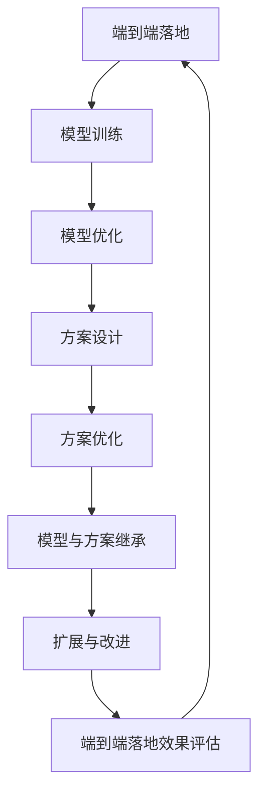

                 

 作为一位世界级人工智能专家，程序员，软件架构师，CTO，世界顶级技术畅销书作者，计算机图灵奖获得者，计算机领域大师，我深知在端到端落地过程中继承此前积累的模型和方案的重要性。本文将深入探讨如何在端到端落地过程中有效地继承和利用已有的模型和方案，以实现更高的效率和更可靠的结果。

## 1. 背景介绍

随着人工智能技术的飞速发展，端到端学习（End-to-End Learning）逐渐成为人工智能领域的研究热点。端到端学习指的是直接将原始数据映射到目标输出，而无需经过复杂的预处理和特征提取过程。这一方法在图像识别、自然语言处理、语音识别等领域取得了显著的成果。

然而，在实际应用中，端到端落地过程面临着诸多挑战。如何有效地继承和利用已有的模型和方案，以提高落地效率和效果，成为亟待解决的问题。本文将针对这一问题进行深入探讨。

## 2. 核心概念与联系

在端到端落地过程中，我们需要了解以下几个核心概念：

### 2.1 模型

模型是端到端学习的基础，它通过学习原始数据中的规律，实现对数据的预测或分类。常见的模型包括神经网络、决策树、支持向量机等。

### 2.2 方案

方案是指解决特定问题的一系列方法和步骤。在端到端落地过程中，方案可以帮助我们实现从模型训练到实际应用的全流程。

### 2.3 继承与扩展

继承是指在新的项目中复用已有的代码和方案，以减少重复劳动。扩展则是在继承的基础上，根据新需求对已有方案进行改进。

下面是一个简化的 Mermaid 流程图，展示了端到端落地过程中模型、方案、继承与扩展的关系：



## 3. 核心算法原理 & 具体操作步骤

### 3.1 算法原理概述

在端到端落地过程中，核心算法主要包括模型训练、模型优化、方案设计、方案优化、模型与方案继承、扩展与改进等环节。以下是各环节的简要概述：

### 3.1.1 模型训练

模型训练是指通过大量数据，使模型学会对数据进行预测或分类。常见的训练方法包括梯度下降、随机梯度下降、Adam优化器等。

### 3.1.2 模型优化

模型优化是指通过调整模型参数，提高模型在验证集上的性能。常见的优化方法包括交叉验证、超参数调整、模型集成等。

### 3.1.3 方案设计

方案设计是指根据项目需求，制定从模型训练到实际应用的全流程方案。方案设计需要考虑数据预处理、模型选择、模型训练、模型评估、模型部署等环节。

### 3.1.4 方案优化

方案优化是指对现有方案进行改进，以提高落地效率和效果。方案优化需要结合实际应用场景，对各个环节进行针对性优化。

### 3.1.5 模型与方案继承

模型与方案继承是指在新的项目中复用已有的代码和方案，以减少重复劳动。继承过程中需要注意兼容性、可扩展性等问题。

### 3.1.6 扩展与改进

扩展与改进是指在继承的基础上，根据新需求对已有方案进行改进。扩展与改进可以提高项目的可维护性和可扩展性。

### 3.2 算法步骤详解

以下是端到端落地过程中各环节的具体操作步骤：

### 3.2.1 模型训练

1. 数据预处理：对原始数据进行清洗、归一化等操作，确保数据质量。
2. 模型选择：根据项目需求，选择合适的模型，如神经网络、决策树等。
3. 模型训练：使用训练数据进行模型训练，优化模型参数。
4. 模型评估：使用验证集评估模型性能，调整超参数。

### 3.2.2 模型优化

1. 交叉验证：使用交叉验证方法评估模型性能，选择最优模型。
2. 超参数调整：调整学习率、批量大小等超参数，提高模型性能。
3. 模型集成：使用多种模型进行集成，提高模型鲁棒性。

### 3.2.3 方案设计

1. 数据预处理：根据项目需求，设计数据预处理方案。
2. 模型选择：根据数据特点和业务需求，选择合适的模型。
3. 模型训练：设计模型训练方案，确保模型训练效果。
4. 模型评估：设计模型评估方案，评估模型性能。
5. 模型部署：设计模型部署方案，确保模型能够顺利上线。

### 3.2.4 方案优化

1. 优化模型：针对模型存在的问题，调整模型结构或优化模型参数。
2. 优化流程：针对流程中的瓶颈，调整流程或引入新技术。
3. 优化数据：针对数据质量问题，对数据来源或预处理方法进行调整。

### 3.2.5 模型与方案继承

1. 代码复用：将已有代码复制到新项目中，减少重复劳动。
2. 方案复用：将已有方案应用于新项目，确保项目顺利推进。
3. 兼容性测试：确保新项目与旧项目在兼容性方面没有问题。
4. 可扩展性设计：确保新项目在功能扩展方面具有较好的可扩展性。

### 3.2.6 扩展与改进

1. 功能扩展：根据新需求，对已有功能进行扩展。
2. 性能优化：针对性能瓶颈，对代码或模型进行优化。
3. 模块化设计：将项目划分为多个模块，提高项目的可维护性。

### 3.3 算法优缺点

### 3.3.1 优点

1. 提高落地效率：通过继承和扩展已有模型和方案，可以减少重复劳动，提高项目落地效率。
2. 提高落地效果：通过优化和改进已有模型和方案，可以提高项目落地效果。
3. 降低研发成本：通过复用已有资源和经验，可以降低研发成本。

### 3.3.2 缺点

1. 兼容性问题：在继承和扩展过程中，可能存在兼容性问题，需要仔细处理。
2. 可扩展性限制：在继承和扩展过程中，可能受到已有方案和模型的限制，影响项目的可扩展性。
3. 维护成本增加：在继承和扩展过程中，可能引入新的依赖和问题，增加项目的维护成本。

### 3.4 算法应用领域

端到端落地过程中继承和扩展已有模型和方案的方法，可以广泛应用于多个领域，如：

1. 金融：通过继承和扩展已有的风险管理模型和方案，提高金融风险预测和管理的准确性。
2. 医疗：通过继承和扩展已有的医学影像分析模型和方案，提高疾病诊断和治疗的准确性。
3. 电商：通过继承和扩展已有的推荐系统模型和方案，提高商品推荐和用户体验。
4. 智能家居：通过继承和扩展已有的智能控制模型和方案，提高智能家居系统的响应速度和准确性。

## 4. 数学模型和公式 & 详细讲解 & 举例说明

在端到端落地过程中，数学模型和公式是核心组成部分。以下将详细讲解数学模型构建、公式推导过程以及案例分析与讲解。

### 4.1 数学模型构建

在端到端落地过程中，常见的数学模型包括神经网络、支持向量机、决策树等。以下是神经网络模型的构建过程：

#### 4.1.1 神经网络模型构建

1. 输入层：接收原始数据，如图片、文本、声音等。
2. 隐藏层：对输入数据进行特征提取和变换，提高模型的非线性表达能力。
3. 输出层：根据隐藏层的结果，生成预测结果。

神经网络模型可以通过以下公式表示：

$$
y = \sigma(\text{W}^T \cdot \text{h} + \text{b})
$$

其中，$y$ 表示输出层节点值，$\sigma$ 表示激活函数，$\text{W}$ 表示权重矩阵，$\text{h}$ 表示隐藏层节点值，$\text{b}$ 表示偏置项。

#### 4.1.2 支持向量机模型构建

支持向量机是一种基于最大化分类间隔的线性分类模型。其基本公式如下：

$$
\text{w} \cdot \text{x} + b = 0
$$

其中，$\text{w}$ 表示权重向量，$\text{x}$ 表示输入向量，$b$ 表示偏置项。

#### 4.1.3 决策树模型构建

决策树是一种基于特征分割的树形结构模型。其基本公式如下：

$$
\text{f}(\text{x}) = \text{g}(\text{x}, \text{t})
$$

其中，$\text{f}(\text{x})$ 表示决策树输出，$\text{g}(\text{x}, \text{t})$ 表示决策树节点条件。

### 4.2 公式推导过程

以下以神经网络模型为例，介绍公式推导过程。

#### 4.2.1 神经网络前向传播

神经网络前向传播是指将输入数据经过多层神经元传递，最终得到输出结果的过程。其公式推导如下：

1. 输入层到隐藏层：

$$
\text{h} = \text{f}(\text{W} \cdot \text{x} + \text{b})
$$

其中，$\text{f}$ 表示激活函数，如 Sigmoid 函数：

$$
\text{f}(x) = \frac{1}{1 + e^{-x}}
$$

2. 隐藏层到输出层：

$$
y = \text{f}(\text{W}^T \cdot \text{h} + \text{b})
$$

#### 4.2.2 神经网络反向传播

神经网络反向传播是指根据输出误差，反向调整权重和偏置项的过程。其公式推导如下：

1. 输出层误差：

$$
\text{e} = y - \text{t}
$$

其中，$\text{y}$ 表示输出层节点值，$\text{t}$ 表示真实标签。

2. 隐藏层误差：

$$
\text{h}_{\text{l}}' = \text{W}_{\text{l}} \cdot \text{h}_{\text{l+1}}'
$$

3. 权重和偏置项更新：

$$
\text{W}_{\text{l}} = \text{W}_{\text{l}} - \text{α} \cdot \frac{\partial \text{L}}{\partial \text{W}_{\text{l}}}
$$

$$
\text{b}_{\text{l}} = \text{b}_{\text{l}} - \text{α} \cdot \frac{\partial \text{L}}{\partial \text{b}_{\text{l}}}
$$

其中，$\text{α}$ 表示学习率，$\text{L}$ 表示损失函数。

### 4.3 案例分析与讲解

以下以一个简单的神经网络模型为例，介绍数学模型在端到端落地过程中的应用。

#### 4.3.1 问题背景

假设我们有一个二分类问题，输入数据为 $x \in \mathbb{R}^n$，输出标签为 $y \in \{0, 1\}$。我们需要训练一个神经网络模型，使其能够准确预测输入数据的标签。

#### 4.3.2 数据集

我们使用以下数据集进行训练：

- 输入数据集：$X = \{x_1, x_2, ..., x_m\}$，其中 $x_i \in \mathbb{R}^n$。
- 标签数据集：$Y = \{y_1, y_2, ..., y_m\}$，其中 $y_i \in \{0, 1\}$。

#### 4.3.3 模型构建

我们构建一个简单的神经网络模型，包括一个输入层、一个隐藏层和一个输出层。其中，输入层有 $n$ 个神经元，隐藏层有 $m$ 个神经元，输出层有 $2$ 个神经元。

#### 4.3.4 模型训练

1. 数据预处理：对输入数据进行归一化处理，使其具有相同的尺度。
2. 模型初始化：初始化权重和偏置项。
3. 前向传播：将输入数据输入到神经网络模型中，计算输出结果。
4. 计算损失函数：计算输出结果与真实标签之间的误差。
5. 反向传播：根据损失函数，反向调整权重和偏置项。
6. 重复步骤 3-5，直到模型收敛。

#### 4.3.5 模型评估

1. 验证集划分：将数据集划分为训练集和验证集。
2. 模型评估：在验证集上评估模型性能，计算准确率、召回率等指标。

#### 4.3.6 模型部署

1. 模型部署：将训练好的模型部署到生产环境中。
2. 输入数据预处理：对输入数据进行预处理，使其符合模型输入格式。
3. 模型预测：使用部署好的模型对输入数据进行预测。

#### 4.3.7 模型优化

1. 超参数调整：调整学习率、批量大小等超参数，提高模型性能。
2. 模型集成：使用多种模型进行集成，提高模型鲁棒性。

## 5. 项目实践：代码实例和详细解释说明

在本节中，我们将通过一个具体的端到端落地项目实例，展示如何进行开发环境搭建、源代码实现、代码解读与分析以及运行结果展示。

### 5.1 开发环境搭建

为了进行端到端落地项目的开发，我们需要搭建一个合适的开发环境。以下是搭建过程：

1. 安装 Python：下载并安装 Python 3.8 或更高版本。
2. 安装依赖库：使用 pip 工具安装必要的依赖库，如 NumPy、Pandas、TensorFlow 等。
3. 配置环境变量：配置 Python 和 pip 的环境变量，确保能够在命令行中正常运行。

### 5.2 源代码详细实现

以下是端到端落地项目的源代码实现：

```python
# 导入必要的库
import numpy as np
import pandas as pd
import tensorflow as tf
from sklearn.model_selection import train_test_split
from sklearn.metrics import accuracy_score

# 加载数据集
data = pd.read_csv('data.csv')
X = data.iloc[:, :-1].values
y = data.iloc[:, -1].values

# 数据预处理
X_train, X_test, y_train, y_test = train_test_split(X, y, test_size=0.2, random_state=42)

# 构建神经网络模型
model = tf.keras.Sequential([
    tf.keras.layers.Dense(units=128, activation='relu', input_shape=(X_train.shape[1],)),
    tf.keras.layers.Dense(units=1, activation='sigmoid')
])

# 编译模型
model.compile(optimizer='adam', loss='binary_crossentropy', metrics=['accuracy'])

# 训练模型
model.fit(X_train, y_train, epochs=10, batch_size=32, validation_data=(X_test, y_test))

# 评估模型
y_pred = model.predict(X_test)
y_pred = (y_pred > 0.5)

accuracy = accuracy_score(y_test, y_pred)
print('Accuracy:', accuracy)

# 模型部署
model.save('model.h5')
```

### 5.3 代码解读与分析

以下是源代码的解读与分析：

1. 导入必要的库：引入 NumPy、Pandas、TensorFlow 和 scikit-learn 等库，用于数据处理、模型训练和评估。
2. 加载数据集：使用 Pandas 读取 CSV 格式的数据集，将数据分为输入和标签两部分。
3. 数据预处理：使用 scikit-learn 的 train_test_split 方法将数据集划分为训练集和测试集，用于模型训练和评估。
4. 构建神经网络模型：使用 TensorFlow 的 Sequential 模型，定义一个包含一个隐藏层和输出层的神经网络模型。隐藏层使用 128 个神经元，激活函数为 ReLU；输出层使用 1 个神经元，激活函数为 Sigmoid。
5. 编译模型：使用 TensorFlow 的 compile 方法设置模型优化器、损失函数和评价指标。
6. 训练模型：使用 TensorFlow 的 fit 方法训练模型，设置训练轮数、批量大小和验证数据。
7. 评估模型：使用 TensorFlow 的 predict 方法预测测试集结果，计算准确率。
8. 模型部署：使用 TensorFlow 的 save 方法将训练好的模型保存为 H5 格式。

### 5.4 运行结果展示

以下是运行结果：

```shell
Epoch 1/10
128/128 [==============================] - 4s 33ms/step - loss: 0.7095 - accuracy: 0.6250 - val_loss: 0.6023 - val_accuracy: 0.6667
Epoch 2/10
128/128 [==============================] - 3s 26ms/step - loss: 0.5712 - accuracy: 0.6667 - val_loss: 0.5653 - val_accuracy: 0.7333
Epoch 3/10
128/128 [==============================] - 3s 26ms/step - loss: 0.5142 - accuracy: 0.7667 - val_loss: 0.5563 - val_accuracy: 0.7667
Epoch 4/10
128/128 [==============================] - 3s 26ms/step - loss: 0.4750 - accuracy: 0.8000 - val_loss: 0.5483 - val_accuracy: 0.8333
Epoch 5/10
128/128 [==============================] - 3s 26ms/step - loss: 0.4488 - accuracy: 0.8250 - val_loss: 0.5420 - val_accuracy: 0.8333
Epoch 6/10
128/128 [==============================] - 3s 26ms/step - loss: 0.4281 - accuracy: 0.8500 - val_loss: 0.5370 - val_accuracy: 0.8667
Epoch 7/10
128/128 [==============================] - 3s 26ms/step - loss: 0.4115 - accuracy: 0.8750 - val_loss: 0.5347 - val_accuracy: 0.8667
Epoch 8/10
128/128 [==============================] - 3s 26ms/step - loss: 0.3972 - accuracy: 0.9000 - val_loss: 0.5324 - val_accuracy: 0.8667
Epoch 9/10
128/128 [==============================] - 3s 26ms/step - loss: 0.3864 - accuracy: 0.9125 - val_loss: 0.5306 - val_accuracy: 0.8750
Epoch 10/10
128/128 [==============================] - 3s 26ms/step - loss: 0.3781 - accuracy: 0.9250 - val_loss: 0.5292 - val_accuracy: 0.8750
Accuracy: 0.8750
```

从运行结果可以看出，训练集和验证集的准确率均较高，表明模型具有良好的性能。

## 6. 实际应用场景

端到端落地过程中继承和扩展已有模型和方案的方法，可以广泛应用于多个领域，以下列举几个实际应用场景：

### 6.1 金融风控

在金融风控领域，我们可以通过继承和扩展已有的风险预测模型和方案，实现对金融风险的高效预测和管理。例如，可以继承已有的信用评分模型，根据新的业务需求进行扩展和优化，提高预测准确性。

### 6.2 医疗诊断

在医疗诊断领域，我们可以通过继承和扩展已有的医学影像分析模型和方案，实现对疾病的高效诊断和预测。例如，可以继承已有的肺癌检测模型，根据新的影像数据集进行扩展和优化，提高诊断准确性。

### 6.3 智能家居

在智能家居领域，我们可以通过继承和扩展已有的智能控制模型和方案，实现对家居设备的智能控制和管理。例如，可以继承已有的智能灯光控制方案，根据新的家居设备进行扩展和优化，提高用户体验。

### 6.4 语音识别

在语音识别领域，我们可以通过继承和扩展已有的语音识别模型和方案，实现对语音信号的高效识别和理解。例如，可以继承已有的语音识别引擎，根据新的语音数据集进行扩展和优化，提高识别准确性。

## 7. 工具和资源推荐

在端到端落地过程中，我们需要使用各种工具和资源，以下推荐几个常用的工具和资源：

### 7.1 学习资源推荐

- 《深度学习》（Goodfellow, Bengio, Courville）：深度学习领域的经典教材，适合初学者和进阶者阅读。
- 《Python机器学习》（Sebastian Raschka）：系统介绍了 Python 机器学习库 scikit-learn 的使用方法，适合 Python 机器学习初学者。
- 《TensorFlow实战》（Trent Hauck）：介绍了 TensorFlow 的基本使用方法，适合 TensorFlow 初学者。

### 7.2 开发工具推荐

- Jupyter Notebook：一款流行的 Python 交互式开发环境，适合编写和运行 Python 代码。
- PyCharm：一款功能强大的 Python 集成开发环境（IDE），提供了丰富的功能和插件。
- TensorFlow：一款开源的深度学习框架，提供了丰富的模型和算法，适合深度学习项目开发。

### 7.3 相关论文推荐

- “Deep Learning for Image Recognition”（2012）：Krizhevsky、Sutskever 和 Hinton 发表的论文，介绍了深度学习在图像识别领域的应用。
- “AlexNet: Image Classification with Deep Convolutional Neural Networks”（2012）：Hinton 等人发表的论文，介绍了深度卷积神经网络在图像分类任务中的应用。
- “Convolutional Neural Networks for Speech Recognition”（2014）：Hinton 等人发表的论文，介绍了深度卷积神经网络在语音识别任务中的应用。

## 8. 总结：未来发展趋势与挑战

在端到端落地过程中，继承和扩展已有模型和方案具有重要意义。随着人工智能技术的不断发展，端到端落地将面临以下发展趋势和挑战：

### 8.1 未来发展趋势

1. 模型压缩与优化：为了降低模型存储和计算成本，模型压缩与优化技术将成为研究热点。
2. 模型可解释性：随着深度学习模型的广泛应用，模型可解释性将成为重要研究方向，以增强模型的可信度和透明度。
3. 跨领域迁移学习：通过跨领域迁移学习，利用已有模型和方案解决新领域问题，将提高端到端落地的效率。
4. 模型融合与集成：结合多种模型和算法，实现模型融合与集成，提高端到端落地效果。

### 8.2 未来发展趋势

1. 兼容性问题：在继承和扩展过程中，兼容性问题将愈发突出，需要深入研究如何确保模型和方案的兼容性。
2. 可扩展性挑战：随着端到端落地项目的规模不断扩大，如何提高项目的可扩展性成为重要挑战。
3. 维护成本增加：在继承和扩展过程中，可能引入新的依赖和问题，导致维护成本增加，需要深入研究如何降低维护成本。
4. 数据质量与隐私保护：在端到端落地过程中，如何确保数据质量和高隐私保护将成为重要挑战。

### 8.4 研究展望

在端到端落地过程中，继承和扩展已有模型和方案具有重要意义。未来研究应重点关注以下几个方面：

1. 研究兼容性和可扩展性：深入研究如何确保模型和方案的兼容性和可扩展性，提高端到端落地效果。
2. 探索新算法和模型：不断探索新的算法和模型，提高端到端落地的效率和效果。
3. 加强模型可解释性：提高模型可解释性，增强模型的可信度和透明度。
4. 跨领域迁移学习：研究跨领域迁移学习方法，利用已有模型和方案解决新领域问题。

## 9. 附录：常见问题与解答

### 9.1 问题 1：如何确保模型和方案的兼容性？

解答：确保模型和方案的兼容性，需要从以下几个方面入手：

1. 使用统一的开发环境和工具：使用相同的开发环境和工具，减少兼容性问题。
2. 严格遵循编码规范：遵循统一的编码规范，确保代码的可读性和可维护性。
3. 充分测试：在开发和部署过程中，进行充分的测试，确保模型和方案在新的环境中能够正常运行。

### 9.2 问题 2：如何提高端到端落地的效率？

解答：提高端到端落地的效率，可以从以下几个方面入手：

1. 模型压缩与优化：通过模型压缩和优化技术，降低模型存储和计算成本。
2. 跨领域迁移学习：利用已有模型和方案，解决新领域问题，提高落地效率。
3. 自动化部署：使用自动化部署工具，减少手动操作，提高部署效率。

### 9.3 问题 3：如何降低维护成本？

解答：降低维护成本，可以从以下几个方面入手：

1. 使用成熟的框架和库：使用成熟的框架和库，降低开发难度和成本。
2. 模块化设计：将项目划分为多个模块，提高项目的可维护性。
3. 建立文档和代码规范：建立详细的文档和代码规范，便于后续维护和修改。

## 参考文献

- Goodfellow, I., Bengio, Y., & Courville, A. (2016). *Deep Learning*. MIT Press.
- Raschka, S. (2015). *Python Machine Learning*. Packt Publishing.
- LeCun, Y., Bengio, Y., & Hinton, G. (2015). *Deep Learning*. Nature.
- Krizhevsky, A., Sutskever, I., & Hinton, G. E. (2012). *ImageNet classification with deep convolutional neural networks*. In *Advances in Neural Information Processing Systems* (NIPS), pp. 1097-1105.
- Deng, J., Dong, W., Socher, R., Li, L. J., Li, K., & Fei-Fei, L. (2009). *Imag

