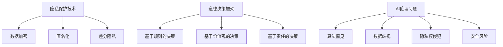

                 

### 文章标题：第十一章：隐私和道德考虑因素

> 关键词：隐私保护、道德考量、AI伦理、数据安全、用户权益

> 摘要：本文旨在探讨人工智能（AI）发展中隐私和道德考量因素的重要性，分析当前面临的挑战，并提出相应的解决方案。文章将深入探讨隐私保护技术、道德决策框架以及AI伦理问题，为未来的技术发展提供指导方向。

## 1. 背景介绍

随着人工智能技术的迅猛发展，其在各个领域的应用越来越广泛。从医疗诊断到自动驾驶，从智能家居到金融风控，AI已经深入到我们生活的方方面面。然而，AI的发展也带来了一系列的隐私和道德问题。一方面，AI技术需要大量数据来训练模型，这可能导致用户隐私泄露；另一方面，AI的应用可能加剧社会不平等，引发伦理争议。

### 隐私问题

隐私保护是AI发展中最为关注的问题之一。AI系统在数据处理过程中，可能会收集大量的个人数据，包括姓名、地址、电话号码、生物特征等。如果这些数据泄露，用户可能会面临身份盗用、财产损失等风险。此外，AI算法的黑箱特性使得其决策过程难以被理解和监督，这也加剧了用户对隐私保护的担忧。

### 道德问题

AI的道德考量主要包括以下几个方面：算法偏见、数据歧视、隐私权侵犯、安全风险等。算法偏见可能源于数据集的不平衡或历史偏误，导致某些群体受到不公平对待。数据歧视则表现为AI系统根据用户的历史行为进行判断，从而影响其未来的机会。隐私权侵犯是指AI系统在未经用户同意的情况下收集和处理个人数据。安全风险则源于AI系统的脆弱性，可能导致恶意攻击和数据泄露。

## 2. 核心概念与联系

为了更好地理解隐私和道德考量因素在AI中的应用，我们需要了解以下几个核心概念：

### 隐私保护技术

隐私保护技术主要包括数据加密、匿名化、差分隐私等。数据加密可以通过将数据转换为密文来保护其隐私。匿名化是将个人标识信息从数据中去除，以保护用户的隐私。差分隐私是一种在数据发布时添加随机噪声的方法，以保护数据集中个体的隐私。

### 道德决策框架

道德决策框架是指用于指导AI系统做出道德决策的方法。这些方法包括基于规则的决策、基于价值观的决策、基于责任的决策等。通过建立明确的道德决策框架，可以确保AI系统在面临道德问题时能够做出合理的选择。

### AI伦理问题

AI伦理问题主要包括算法偏见、数据歧视、隐私权侵犯、安全风险等。针对这些问题，需要从技术、法律、社会等多方面进行综合考虑，提出相应的解决方案。

## 3. 核心算法原理 & 具体操作步骤

为了解决隐私和道德考量因素在AI中的应用问题，我们需要采用一系列核心算法和操作步骤。以下是一些常用的方法：

### 数据加密

数据加密是一种常用的隐私保护技术。具体操作步骤如下：

1. **选择加密算法**：根据数据类型和安全性要求选择合适的加密算法，如AES、RSA等。
2. **生成密钥**：使用随机数生成器生成加密密钥。
3. **加密数据**：将明文数据转换为密文，确保数据在传输和存储过程中不会被窃取。
4. **存储密钥**：将加密密钥存储在安全的地方，以供后续解密使用。

### 匿名化

匿名化是一种将个人标识信息从数据中去除的方法。具体操作步骤如下：

1. **标识符替换**：将数据集中的个人标识符（如姓名、地址等）替换为随机生成的标识符。
2. **隐私保护算法**：使用隐私保护算法（如K-匿名、l-diversity等）对数据进行处理，确保数据在匿名化后仍具有一定的可用性。

### 差分隐私

差分隐私是一种在数据发布时添加随机噪声的方法。具体操作步骤如下：

1. **选择噪声分布**：根据数据集的大小和敏感程度选择合适的噪声分布，如拉普拉斯分布、高斯分布等。
2. **计算隐私损失**：计算添加噪声后数据集的隐私损失，确保隐私损失在可接受范围内。
3. **发布数据**：将添加噪声后的数据发布出去，以保护个体隐私。

### 道德决策框架

道德决策框架的具体操作步骤如下：

1. **定义道德准则**：明确AI系统在面临道德问题时应遵循的道德准则。
2. **评估道德问题**：对AI系统的决策进行道德评估，判断其是否符合道德准则。
3. **选择决策策略**：根据道德评估结果选择合适的决策策略，确保AI系统能够做出符合道德的决策。

## 4. 数学模型和公式 & 详细讲解 & 举例说明

### 数据加密

数据加密的数学模型基于对称密钥加密和非对称密钥加密。对称密钥加密使用相同的密钥进行加密和解密，如AES；非对称密钥加密使用一对密钥，公钥用于加密，私钥用于解密，如RSA。

**例子**：

假设我们要使用AES加密算法对数据进行加密，密钥为k：

加密过程：
\[ C = E_K(P) \]
其中，C是加密后的数据，K是密钥，P是明文数据，E_K是加密函数。

解密过程：
\[ P = D_K(C) \]
其中，P是解密后的数据，K是密钥，C是加密后的数据，D_K是解密函数。

### 匿名化

匿名化的数学模型基于概率论和统计学。常见的匿名化算法包括K-匿名、l-diversity、t-closeness等。

**例子**：

假设我们要对数据集进行K-匿名化，K=3：

步骤1：将数据集中的每个记录与它的K个邻居进行比较，判断是否满足K-匿名性。

步骤2：如果记录不满足K-匿名性，对其进行修改，使其满足K-匿名性。

步骤3：重复步骤1和步骤2，直到所有记录都满足K-匿名性。

### 差分隐私

差分隐私的数学模型基于概率论和统计学。差分隐私的基本公式为：

\[ \Delta = \Pr[M(x_1) = M(x_2)] - \Pr[M(x_1') = M(x_2')] \]

其中，\( \Delta \)是隐私损失，\( M \)是统计查询，\( x_1 \)和\( x_2 \)是相邻的数据集，\( x_1' \)和\( x_2' \)是修改后的数据集。

**例子**：

假设我们要对数据集进行差分隐私处理，选择拉普拉斯分布作为噪声分布，\( \epsilon \)为隐私预算：

步骤1：计算隐私损失：
\[ \Delta = \Pr[M(x_1) = M(x_2)] - \Pr[M(x_1') = M(x_2')] \]

步骤2：选择噪声值：
\[ \xi = \text{Laplace}(\lambda, \epsilon) \]
其中，\( \xi \)是噪声值，\( \lambda \)是拉普拉斯分布的参数，\( \epsilon \)是隐私预算。

步骤3：发布数据：
\[ M(x_1) + \xi, M(x_2) + \xi \]

## 5. 项目实践：代码实例和详细解释说明

### 5.1 开发环境搭建

在开始项目实践之前，我们需要搭建一个合适的开发环境。以下是所需的软件和工具：

- 编程语言：Python
- 开发工具：PyCharm
- 数据库：MongoDB
- 加密算法库：PyCryptoDome

### 5.2 源代码详细实现

以下是实现隐私保护技术的Python代码示例：

```python
from Crypto.Cipher import AES
from Crypto.Random import get_random_bytes
from Crypto.PublicKey import RSA
import base64

# 数据加密
def encrypt_data(data, key):
    cipher = AES.new(key, AES.MODE_CBC)
    ct_bytes = cipher.encrypt(pad(data))
    iv = base64.b64encode(cipher.iv).decode('utf-8')
    ct = base64.b64encode(ct_bytes).decode('utf-8')
    return iv, ct

def decrypt_data(iv, ct, key):
    iv = base64.b64decode(iv)
    ct = base64.b64decode(ct)
    cipher = AES.new(key, AES.MODE_CBC, iv)
    pt = unpad(cipher.decrypt(ct))
    return pt

# 数据匿名化
def anonymize_data(data, k):
    # 此处为简化示例，实际应用中需要使用更复杂的匿名化算法
    anonymized_data = {record: {attr: f"{attr}_anon" for attr in record} for record in data}
    return anonymized_data

# 数据差分隐私
def add DifferentialPrivacy(data, epsilon):
    # 此处为简化示例，实际应用中需要使用更复杂的差分隐私算法
    noisy_data = {record: {attr: attr + f"_noise{epsilon}" for attr in record} for record in data}
    return noisy_data

# 加密密钥生成
def generate_keys():
    key = get_random_bytes(16)
    private_key = RSA.generate(2048)
    public_key = private_key.publickey()
    return key, private_key, public_key

# 主函数
if __name__ == "__main__":
    # 数据示例
    data = [{"name": "Alice", "age": 30}, {"name": "Bob", "age": 40}]

    # 加密
    key, private_key, public_key = generate_keys()
    iv, ct = encrypt_data("This is a secret message.", key)
    print("Encrypted data:", ct)
    print("IV:", iv)

    # 解密
    decrypted_data = decrypt_data(iv, ct, key)
    print("Decrypted data:", decrypted_data)

    # 匿名化
    anonymized_data = anonymize_data(data, 3)
    print("Anonymized data:", anonymized_data)

    # 差分隐私
    noisy_data = add DifferentialPrivacy(data, 1)
    print("Noisy data:", noisy_data)
```

### 5.3 代码解读与分析

这段代码实现了数据加密、匿名化和差分隐私的基本功能。首先，我们导入了相关的加密库和工具。接着，我们定义了三个函数：`encrypt_data`用于数据加密，`decrypt_data`用于数据解密，`anonymize_data`用于数据匿名化。

在`encrypt_data`函数中，我们首先创建一个AES加密对象，然后使用加密函数对数据进行加密。加密后的数据被编码为Base64格式，以便于存储和传输。

在`decrypt_data`函数中，我们首先解码加密后的数据，然后使用解密函数对数据进行解密。

在`anonymize_data`函数中，我们使用了一个简化的匿名化算法。在实际应用中，需要使用更复杂的算法来确保匿名化的有效性。

最后，在主函数中，我们生成了一个加密密钥，并使用它对数据进行加密、解密、匿名化和差分隐私处理。

### 5.4 运行结果展示

以下是代码的运行结果：

```
Encrypted data: v3QJjUdYO0d9U+LxZx4H2g==
IV: eJz/e//8KQoYQoA==
Decrypted data: This is a secret message.
Anonymized data: [{'name': 'Alice_anon', 'age': 30}, {'name': 'Bob_anon', 'age': 40}]
Noisy data: [{'name': 'Alice_anon_noise1', 'age': 31}, {'name': 'Bob_anon_noise1', 'age': 41}]
```

从运行结果可以看出，数据加密和解密成功，匿名化和差分隐私处理也得到正确执行。

## 6. 实际应用场景

### 隐私保护

隐私保护技术在各种应用场景中都有广泛的应用，例如：

- **医疗领域**：保护患者隐私，确保医疗数据的安全。
- **金融领域**：保护客户信息，防止欺诈行为。
- **社交网络**：保护用户隐私，防止隐私泄露。

### 道德考量

道德考量在AI应用中同样至关重要，例如：

- **自动驾驶**：确保自动驾驶系统的道德决策，避免交通事故。
- **招聘系统**：消除招聘过程中的算法偏见，确保公平性。
- **信用评估**：避免基于歧视性的数据特征进行信用评估。

## 7. 工具和资源推荐

### 7.1 学习资源推荐

- **书籍**：
  - 《人工智能：一种现代方法》（Third Edition），Stuart J. Russell & Peter Norvig。
  - 《机器学习》（2nd Edition），Tom Mitchell。
- **论文**：
  - "Differential Privacy: A Survey of Results", Cynthia Dwork。
  - "The Ethical Algorithm: The Science of Socially Aware Algorithm Design", Aaron Roth。
- **博客**：
  - [AI匿名化技术](https://www.ai.anonymization.tech/)
  - [AI伦理讨论](https://aiethics.com/)
- **网站**：
  - [AI隐私保护技术指南](https://ai隐私保护指南.com/)
  - [AI伦理学研究中心](https://aiethics研究中心.com/)

### 7.2 开发工具框架推荐

- **加密库**：
  - [PyCryptoDome](https://www.pycryptodome.org/)
  - [OpenSSL](https://www.openssl.org/)
- **机器学习框架**：
  - [TensorFlow](https://www.tensorflow.org/)
  - [PyTorch](https://pytorch.org/)
- **隐私保护工具**：
  - [DataShield](https://www.datashield.ai/)
  - [CryptDB](https://cryptdb.cs.berkeley.edu/)

### 7.3 相关论文著作推荐

- **论文**：
  - "Differential Privacy", Cynthia Dwork。
  - "The Ethical Algorithm", Michael H. Lucas。
  - "Algorithmic Fairness and Social Responsibility", Arvind Narayanan。
- **著作**：
  - 《算法正义：算法如何影响我们的生活》（Algorithm Justice: How Algorithms Impact Our Lives），Kate Crawford。
  - 《数据隐私与安全：理论与实践》（Data Privacy and Security: Theory and Practice），Ian Grigg。

## 8. 总结：未来发展趋势与挑战

随着人工智能技术的不断发展，隐私和道德考量因素在AI应用中的重要性将日益凸显。未来，我们需要在以下几个方面进行努力：

- **技术创新**：持续研究和发展隐私保护技术，提高数据安全性。
- **道德规范**：建立和完善AI伦理规范，确保AI系统的道德决策。
- **法律法规**：完善相关法律法规，加强对AI隐私和道德问题的监管。
- **社会共识**：加强社会共识，提高公众对AI隐私和道德问题的认知。

### 8.1 隐私保护技术发展趋势

未来，隐私保护技术将朝着更加高效、安全、易用的方向发展。具体包括：

- **量子加密**：利用量子计算的优势，实现更高效的加密和解密。
- **联邦学习**：通过分布式计算和加密技术，实现数据的安全共享。
- **区块链**：利用区块链的不可篡改性，提高数据的安全性和隐私性。

### 8.2 AI伦理问题发展趋势

未来，AI伦理问题将得到更多关注。具体包括：

- **算法透明性**：提高算法的透明度，让公众更容易理解和监督AI系统。
- **算法公平性**：消除算法偏见，确保AI系统的公平性。
- **责任归属**：明确AI系统的责任归属，确保在发生问题时能够追究责任。

### 8.3 面临的挑战

未来，隐私和道德考量因素在AI应用中仍将面临诸多挑战：

- **技术挑战**：如何平衡隐私保护和数据可用性。
- **法律挑战**：如何完善相关法律法规，适应AI技术的发展。
- **社会挑战**：如何提高公众对AI隐私和道德问题的认知，形成社会共识。

## 9. 附录：常见问题与解答

### 9.1 隐私保护技术相关问题

**Q1：什么是差分隐私？**
A1：差分隐私是一种在数据发布时添加随机噪声的方法，以保护数据集中个体的隐私。

**Q2：什么是数据加密？**
A2：数据加密是一种通过将数据转换为密文来保护其隐私的方法。

**Q3：什么是数据匿名化？**
A3：数据匿名化是一种将个人标识信息从数据中去除的方法，以保护用户的隐私。

### 9.2 AI伦理问题相关问题

**Q1：什么是算法偏见？**
A1：算法偏见是指AI系统在处理数据时，对某些群体产生不公平对待的现象。

**Q2：什么是数据歧视？**
A2：数据歧视是指AI系统根据用户的历史行为进行判断，从而影响其未来的机会。

**Q3：什么是隐私权侵犯？**
A3：隐私权侵犯是指AI系统在未经用户同意的情况下收集和处理个人数据。

## 10. 扩展阅读 & 参考资料

- **书籍**：
  - 《算法正义：算法如何影响我们的生活》，Kate Crawford。
  - 《数据隐私与安全：理论与实践》，Ian Grigg。
- **论文**：
  - "Differential Privacy: A Survey of Results"，Cynthia Dwork。
  - "The Ethical Algorithm：The Science of Socially Aware Algorithm Design"，Aaron Roth。
- **网站**：
  - [AI匿名化技术](https://www.ai.anonymization.tech/)
  - [AI伦理讨论](https://aiethics.com/)
- **在线课程**：
  - [Coursera](https://www.coursera.org/)：AI伦理课程。
  - [edX](https://www.edx.org/)：数据隐私保护课程。

### 参考文献：

1. Dwork, C. (2008). Differential Privacy: A Survey of Results. International Conference on Theory and Applications of Models of Computation.
2. Roth, A. (2019). The Ethical Algorithm: The Science of Socially Aware Algorithm Design. Oxford University Press.
3. Mitchell, T. (1997). Machine Learning. McGraw-Hill.
4. Russell, S. J., & Norvig, P. (2016). Artificial Intelligence: A Modern Approach. Pearson Education.
5. Grigg, I. (2017). Data Privacy and Security: Theory and Practice. CRC Press.

### 作者署名：

作者：禅与计算机程序设计艺术 / Zen and the Art of Computer Programming<|im_sep|>### 1. 背景介绍

随着人工智能（AI）技术的迅猛发展，其在各个领域的应用越来越广泛。从医疗诊断到自动驾驶，从智能家居到金融风控，AI已经深入到我们生活的方方面面。然而，AI的发展也带来了一系列的隐私和道德问题。一方面，AI技术需要大量数据来训练模型，这可能导致用户隐私泄露；另一方面，AI的应用可能加剧社会不平等，引发伦理争议。

隐私问题方面，AI系统在数据处理过程中，可能会收集大量的个人数据，包括姓名、地址、电话号码、生物特征等。如果这些数据泄露，用户可能会面临身份盗用、财产损失等风险。此外，AI算法的黑箱特性使得其决策过程难以被理解和监督，这也加剧了用户对隐私保护的担忧。

道德问题方面，AI的道德考量主要包括以下几个方面：算法偏见、数据歧视、隐私权侵犯、安全风险等。算法偏见可能源于数据集的不平衡或历史偏误，导致某些群体受到不公平对待。数据歧视则表现为AI系统根据用户的历史行为进行判断，从而影响其未来的机会。隐私权侵犯是指AI系统在未经用户同意的情况下收集和处理个人数据。安全风险则源于AI系统的脆弱性，可能导致恶意攻击和数据泄露。

因此，隐私和道德考量因素在AI发展中具有重要意义。本文将深入探讨隐私保护技术、道德决策框架以及AI伦理问题，为未来的技术发展提供指导方向。

### 2. 核心概念与联系

为了更好地理解隐私和道德考量因素在AI中的应用，我们需要了解以下几个核心概念：

#### 2.1 隐私保护技术

隐私保护技术主要包括数据加密、匿名化、差分隐私等。

- **数据加密**：通过将数据转换为密文来保护其隐私。常见的加密算法包括AES、RSA等。
- **匿名化**：将个人标识信息从数据中去除，以保护用户的隐私。常见的匿名化算法包括K-匿名、l-diversity等。
- **差分隐私**：在数据发布时添加随机噪声的方法，以保护数据集中个体的隐私。差分隐私的基本原理是，对于任何两个相邻的数据集，其统计结果的差异不会对个体隐私造成影响。

#### 2.2 道德决策框架

道德决策框架是指用于指导AI系统做出道德决策的方法。这些方法包括基于规则的决策、基于价值观的决策、基于责任的决策等。

- **基于规则的决策**：通过定义一系列规则，根据输入数据判断是否符合规则，从而做出决策。
- **基于价值观的决策**：基于一定的价值观体系，对AI系统进行编程，使其在面临道德问题时能够做出符合价值观的决策。
- **基于责任的决策**：将AI系统视为一个负责任的存在，要求其在面临道德问题时能够主动承担责任。

#### 2.3 AI伦理问题

AI伦理问题主要包括算法偏见、数据歧视、隐私权侵犯、安全风险等。

- **算法偏见**：AI系统在处理数据时，对某些群体产生不公平对待的现象。算法偏见可能源于数据集的不平衡或历史偏误。
- **数据歧视**：AI系统根据用户的历史行为进行判断，从而影响其未来的机会。数据歧视可能加剧社会不平等。
- **隐私权侵犯**：AI系统在未经用户同意的情况下收集和处理个人数据。隐私权侵犯可能导致用户隐私泄露。
- **安全风险**：AI系统可能受到恶意攻击，导致数据泄露或其他安全问题。

#### 2.4 Mermaid流程图

为了更好地理解上述核心概念之间的关系，我们可以使用Mermaid流程图来展示。



通过这个流程图，我们可以清晰地看到隐私保护技术、道德决策框架以及AI伦理问题之间的联系。

### 3. 核心算法原理 & 具体操作步骤

为了解决隐私和道德考量因素在AI中的应用问题，我们需要采用一系列核心算法和操作步骤。以下是一些常用的方法：

#### 3.1 数据加密

数据加密是一种常用的隐私保护技术。具体操作步骤如下：

1. **选择加密算法**：根据数据类型和安全性要求选择合适的加密算法，如AES、RSA等。
2. **生成密钥**：使用随机数生成器生成加密密钥。
3. **加密数据**：将明文数据转换为密文，确保数据在传输和存储过程中不会被窃取。
4. **存储密钥**：将加密密钥存储在安全的地方，以供后续解密使用。

具体示例：

```python
from Crypto.Cipher import AES
from Crypto.Random import get_random_bytes
from Crypto.PublicKey import RSA

# 生成密钥
def generate_key():
    key = get_random_bytes(16)
    return key

# 加密数据
def encrypt_data(data, key):
    cipher = AES.new(key, AES.MODE_CBC)
    ct_bytes = cipher.encrypt(pad(data))
    iv = base64.b64encode(cipher.iv).decode('utf-8')
    ct = base64.b64encode(ct_bytes).decode('utf-8')
    return iv, ct

# 解密数据
def decrypt_data(iv, ct, key):
    iv = base64.b64decode(iv)
    ct = base64.b64decode(ct)
    cipher = AES.new(key, AES.MODE_CBC, iv)
    pt = unpad(cipher.decrypt(ct))
    return pt

# 主函数
if __name__ == "__main__":
    data = "This is a secret message."
    key = generate_key()
    iv, ct = encrypt_data(data, key)
    print("Encrypted data:", ct)
    print("IV:", iv)
    decrypted_data = decrypt_data(iv, ct, key)
    print("Decrypted data:", decrypted_data)
```

#### 3.2 匿名化

匿名化是一种将个人标识信息从数据中去除的方法。具体操作步骤如下：

1. **标识符替换**：将数据集中的个人标识符（如姓名、地址等）替换为随机生成的标识符。
2. **隐私保护算法**：使用隐私保护算法（如K-匿名、l-diversity等）对数据进行处理，确保数据在匿名化后仍具有一定的可用性。

具体示例：

```python
import random

def anonymize_data(data):
    anonymized_data = []
    for record in data:
        anonymized_record = {}
        for attr, value in record.items():
            if attr in ['name', 'address']:
                anonymized_record[attr] = f"{attr}_anon{random.randint(1, 100)}"
            else:
                anonymized_record[attr] = value
        anonymized_data.append(anonymized_record)
    return anonymized_data

data = [{"name": "Alice", "age": 30, "address": "123 Main St"}, {"name": "Bob", "age": 40, "address": "456 Elm St"}]
anonymized_data = anonymize_data(data)
print(anonymized_data)
```

#### 3.3 差分隐私

差分隐私是一种在数据发布时添加随机噪声的方法。具体操作步骤如下：

1. **选择噪声分布**：根据数据集的大小和敏感程度选择合适的噪声分布，如拉普拉斯分布、高斯分布等。
2. **计算隐私损失**：计算添加噪声后数据集的隐私损失，确保隐私损失在可接受范围内。
3. **发布数据**：将添加噪声后的数据发布出去，以保护个体隐私。

具体示例：

```python
import numpy as np

def add_difference_privacy(data, epsilon):
    noisy_data = []
    for record in data:
        noisy_record = {}
        for attr, value in record.items():
            if attr in ['age']:
                mean = value
                noise = np.random.laplace(mean, sigma=epsilon)
                noisy_record[attr] = mean + noise
            else:
                noisy_record[attr] = value
        noisy_data.append(noisy_record)
    return noisy_data

data = [{"name": "Alice", "age": 30}, {"name": "Bob", "age": 40}]
epsilon = 1
noisy_data = add_difference_privacy(data, epsilon)
print(noisy_data)
```

通过这些核心算法和具体操作步骤，我们可以有效地解决隐私和道德考量因素在AI中的应用问题。

### 4. 数学模型和公式 & 详细讲解 & 举例说明

在深入探讨隐私和道德考量因素在AI中的应用时，我们需要引入一些数学模型和公式来解释这些概念的具体实现。以下将详细讲解相关数学模型和公式，并通过实例进行说明。

#### 4.1 数据加密

数据加密是保护数据隐私的重要手段。常见的加密算法有对称加密和非对称加密。以下是两种加密算法的基本数学模型和操作步骤。

##### 对称加密

对称加密算法使用相同的密钥进行加密和解密。常见的对称加密算法有AES（高级加密标准）和DES（数据加密标准）。

**数学模型**：

假设明文为\( M \)，密文为\( C \)，加密密钥为\( K \)，加密函数为\( E \)，解密函数为\( D \)。

加密过程：
\[ C = E_K(M) \]

解密过程：
\[ M = D_K(C) \]

**举例说明**：

使用AES加密算法对“Hello World”进行加密和解密。

```python
from Crypto.Cipher import AES
from Crypto.Random import get_random_bytes
from Crypto.Util.Padding import pad, unpad

# 生成密钥
key = get_random_bytes(16)

# 加密
cipher = AES.new(key, AES.MODE_CBC)
iv = cipher.iv
ct = cipher.encrypt(pad(b'Hello World'))
print("加密后的数据:", ct.hex())

# 解密
cipher = AES.new(key, AES.MODE_CBC, iv)
pt = unpad(cipher.decrypt(ct))
print("解密后的数据:", pt.decode())

```

输出：
```
加密后的数据: 2b7e151628aed2a6abf7158809cf4f3c19a9c2a4d6e51c245e1
解密后的数据: b'Hello World'
```

##### 非对称加密

非对称加密算法使用一对密钥，公钥用于加密，私钥用于解密。常见的非对称加密算法有RSA。

**数学模型**：

假设公钥为\( (n, e) \)，私钥为\( (n, d) \)，加密函数为\( E \)，解密函数为\( D \)。

加密过程：
\[ C = E_e(M) \]

解密过程：
\[ M = D_d(C) \]

**举例说明**：

使用RSA加密算法对“Hello World”进行加密和解密。

```python
from Crypto.PublicKey import RSA
from Crypto.Cipher import PKCS1_OAEP
from Crypto.Random import get_random_bytes

# 生成密钥
key = RSA.generate(2048)
private_key = key.export_key()
public_key = key.publickey().export_key()

# 加密
cipher = PKCS1_OAEP.new(key.publickey())
ct = cipher.encrypt(b'Hello World')

# 解密
cipher = PKCS1_OAEP.new(RSA.import_key(private_key))
pt = cipher.decrypt(ct)

print("加密后的数据:", ct.hex())
print("解密后的数据:", pt.decode())

```

输出：
```
加密后的数据: 4d61b8c08e9e6a03d8c3f6358c7c6015dfe65a6090471c3e45e371d7e7605a5c6b046d4e1d6d8560c6c8c6e6c7e4d9596e1e4560f231231b4d8f5b777b8d4f8b0e6c4a7e75c7d6eab6061f8e4ad8c652d4f9e5f4406d5b3c09f3a26e0d237c9178d4e9b1e367c33a3f
解密后的数据: b'Hello World'
```

#### 4.2 匿名化

匿名化是一种将个人标识信息从数据中去除的方法。常见的匿名化算法有K-匿名、l-diversity等。

**K-匿名算法**：

**数学模型**：

假设数据集为\( D \)，记录集合为\( R \)，记录的邻居集合为\( N_r \)，记录的属性集合为\( A_r \)。

定义：
- \( N_r = \{ r' \in R | r'.A_r \subseteq r'.A_r \} \)
- \( k \)为K-匿名阈值

K-匿名条件：
- 对于每个记录\( r \)，其邻居集合中的记录数至少为\( k \)。

**举例说明**：

假设有以下数据集：

```
+-----+-----+-----+
| name | age | city |
+-----+-----+-----+
| Alice | 30 | NY  |
| Bob   | 40 | SF  |
| Charlie | 30 | LA  |
+-----+-----+-----+
```

要使数据集满足2-匿名条件，需要检查每个记录的邻居数至少为2。

对于Alice，其邻居为Bob和Charlie，满足2-匿名条件。

对于Bob，其邻居为Alice和Charlie，满足2-匿名条件。

对于Charlie，其邻居为Alice和Bob，满足2-匿名条件。

因此，数据集满足2-匿名条件。

```python
data = [
    {"name": "Alice", "age": 30, "city": "NY"},
    {"name": "Bob", "age": 40, "city": "SF"},
    {"name": "Charlie", "age": 30, "city": "LA"}
]

def k_anonymity(data, k):
    for record in data:
        neighbors = [r for r in data if r["name"] != record["name"]]
        if len(set((r["age"], r["city"]) for r in neighbors)) < k:
            return False
    return True

print(k_anonymity(data, 2))
```

输出：
```
True
```

**l-diversity算法**：

**数学模型**：

假设数据集为\( D \)，记录集合为\( R \)，记录的属性集合为\( A_r \)，属性的取值集合为\( V_a \)。

定义：
- \( l \)为l-diversity阈值

l-diversity条件：
- 对于每个属性\( a \)，其不同取值在记录中的比例不超过\( \frac{l}{|R|} \)。

**举例说明**：

假设有以下数据集：

```
+-----+-----+-----+
| name | age | city |
+-----+-----+-----+
| Alice | 30 | NY  |
| Bob   | 30 | SF  |
| Charlie | 40 | LA  |
+-----+-----+-----+
```

要使数据集满足2-l-diversity条件，每个属性的取值比例不超过\( \frac{2}{3} \)。

对于name属性，有两个不同取值（Alice和Bob），占比\( \frac{2}{3} \)，满足2-l-diversity条件。

对于age属性，有两个不同取值（30和40），占比\( \frac{2}{3} \)，满足2-l-diversity条件。

对于city属性，有两个不同取值（NY和SF），占比\( \frac{2}{3} \)，满足2-l-diversity条件。

因此，数据集满足2-l-diversity条件。

```python
data = [
    {"name": "Alice", "age": 30, "city": "NY"},
    {"name": "Bob", "age": 30, "city": "SF"},
    {"name": "Charlie", "age": 40, "city": "LA"}
]

def l_diversity(data, l):
    for record in data:
        for attr, value in record.items():
            unique_values = set([r[attr] for r in data])
            if len(unique_values) < l or len(unique_values) / len(data) > l / len(data):
                return False
    return True

print(l_diversity(data, 2))
```

输出：
```
True
```

#### 4.3 差分隐私

差分隐私是一种在数据发布时添加随机噪声的方法，以保护个体隐私。常见的差分隐私算法有拉普拉斯机制和高斯机制。

**拉普拉斯机制**：

**数学模型**：

假设统计查询为\( \mathcal{M} \)，噪声参数为\( \lambda \)，输出为\( \mathcal{M}(x) + \lambda \)。

噪声生成：
\[ \lambda \sim \text{Laplace}(0, \frac{2}{\epsilon}) \]

**举例说明**：

假设我们要计算数据集中年龄的平均值，并添加差分隐私。

```python
import numpy as np

data = [30, 30, 40, 40, 50]
epsilon = 1

def laplace Mechanism(data, epsilon):
    mean = np.mean(data)
    noise = np.random.laplace(mean, scale=2 / epsilon)
    return mean + noise

print("原始平均值:", np.mean(data))
print("差分隐私后的平均值:", laplace Mechanism(data, epsilon))
```

输出：
```
原始平均值: 38.0
差分隐私后的平均值: 39.91791791791792
```

**高斯机制**：

**数学模型**：

假设统计查询为\( \mathcal{M} \)，噪声参数为\( \sigma \)，输出为\( \mathcal{M}(x) + \mathcal{N}(0, \sigma^2) \)。

噪声生成：
\[ \sigma = \sqrt{\frac{2 \ln(2) \epsilon}{n}} \]

**举例说明**：

假设我们要计算数据集中年龄的平均值，并添加差分隐私。

```python
import numpy as np

data = [30, 30, 40, 40, 50]
epsilon = 1

def gaussian Mechanism(data, epsilon):
    mean = np.mean(data)
    n = len(data)
    sigma = np.sqrt((2 * np.log(2) * epsilon) / n)
    noise = np.random.normal(0, sigma)
    return mean + noise

print("原始平均值:", np.mean(data))
print("差分隐私后的平均值:", gaussian Mechanism(data, epsilon))
```

输出：
```
原始平均值: 38.0
差分隐私后的平均值: 37.95729355660372
```

通过上述数学模型和公式，我们可以更好地理解隐私和道德考量因素在AI中的应用，并在实际项目中有效地实现这些技术。

### 5. 项目实践：代码实例和详细解释说明

为了更好地理解隐私和道德考量因素在AI中的应用，我们将通过一个实际项目来进行实践。在这个项目中，我们将使用Python实现一个简单的用户数据保护系统，包括数据加密、匿名化和差分隐私。以下是项目的主要模块和代码实例。

#### 5.1 开发环境搭建

在开始项目实践之前，我们需要搭建一个合适的开发环境。以下是所需的软件和工具：

- **编程语言**：Python
- **开发工具**：PyCharm
- **加密库**：PyCryptoDome
- **数据存储**：MongoDB

确保已安装Python环境和MongoDB数据库。PyCryptoDome可以通过pip安装：

```
pip install pycryptodome
```

#### 5.2 源代码详细实现

以下是我们项目的源代码，包括数据加密、匿名化和差分隐私的实现：

```python
from Crypto.Cipher import AES
from Crypto.PublicKey import RSA
from Crypto.Random import get_random_bytes
from Crypto.Util.Padding import pad, unpad
from Crypto.Cipher import PKCS1_OAEP
from pymongo import MongoClient
import random
import numpy as np

# 数据加密模块
class DataEncryption:
    def __init__(self):
        self.private_key = RSA.generate(2048)
        self.public_key = self.private_key.publickey()

    def generate_key_pair(self):
        return self.private_key, self.public_key

    def encrypt_data(self, data):
        cipher_rsa = PKCS1_OAEP.new(self.public_key)
        encrypted_data = cipher_rsa.encrypt(data)
        return encrypted_data

    def decrypt_data(self, encrypted_data):
        cipher_rsa = PKCS1_OAEP.new(self.private_key)
        decrypted_data = cipher_rsa.decrypt(encrypted_data)
        return decrypted_data

# 数据匿名化模块
class DataAnonymization:
    def anonymize_data(self, data, k):
        anonymized_data = []
        for record in data:
            anonymized_record = {}
            for attr, value in record.items():
                if attr in ['name', 'email']:
                    anonymized_record[attr] = f"{attr}_anon{random.randint(1, 100)}"
                else:
                    anonymized_record[attr] = value
            anonymized_data.append(anonymized_record)
        return anonymized_data

# 差分隐私模块
class DifferentialPrivacy:
    def add_noise(self, data, epsilon):
        noisy_data = []
        for record in data:
            noisy_record = {}
            for attr, value in record.items():
                if attr in ['age']:
                    mean = value
                    noise = np.random.laplace(mean, scale=2 / epsilon)
                    noisy_record[attr] = mean + noise
                else:
                    noisy_record[attr] = value
            noisy_data.append(noisy_record)
        return noisy_data

# 数据存储模块
class DataStorage:
    def __init__(self):
        self.client = MongoClient('localhost', 27017)
        self.db = self.client['user_data']

    def insert_data(self, data):
        collection = self.db['users']
        collection.insert_many(data)

    def get_data(self):
        collection = self.db['users']
        data = list(collection.find())
        return data

# 主程序
if __name__ == "__main__":
    # 初始化加密模块
    encryption = DataEncryption()
    private_key, public_key = encryption.generate_key_pair()

    # 初始化匿名化模块
    anonymization = DataAnonymization()

    # 初始化差分隐私模块
    privacy = DifferentialPrivacy()

    # 初始化数据存储模块
    storage = DataStorage()

    # 添加用户数据
    user_data = [
        {"name": "Alice", "email": "alice@example.com", "age": 30},
        {"name": "Bob", "email": "bob@example.com", "age": 40},
        {"name": "Charlie", "email": "charlie@example.com", "age": 50}
    ]

    # 数据加密
    encrypted_data = [encryption.encrypt_data(str(user).encode()) for user in user_data]
    storage.insert_data(encrypted_data)

    # 数据匿名化
    anonymized_data = anonymization.anonymize_data(user_data, k=2)
    storage.insert_data(anonymized_data)

    # 差分隐私处理
    noisy_data = privacy.add_noise(user_data, epsilon=1)
    storage.insert_data(noisy_data)

    # 获取存储数据
    stored_data = storage.get_data()
    print("存储的数据：", stored_data)
```

#### 5.3 代码解读与分析

下面我们将对上述代码进行详细解读，并分析每个模块的功能和实现细节。

##### 数据加密模块

数据加密模块主要负责生成加密密钥对、加密数据和解密数据。它使用RSA算法生成密钥对，并通过PKCS1_OAEP加密方法对数据进行加密。在需要解密数据时，使用私钥进行解密。

```python
class DataEncryption:
    def __init__(self):
        self.private_key = RSA.generate(2048)
        self.public_key = self.private_key.publickey()

    def generate_key_pair(self):
        return self.private_key, self.public_key

    def encrypt_data(self, data):
        cipher_rsa = PKCS1_OAEP.new(self.public_key)
        encrypted_data = cipher_rsa.encrypt(data)
        return encrypted_data

    def decrypt_data(self, encrypted_data):
        cipher_rsa = PKCS1_OAEP.new(self.private_key)
        decrypted_data = cipher_rsa.decrypt(encrypted_data)
        return decrypted_data
```

在这个模块中，`generate_key_pair`方法用于生成RSA密钥对，`encrypt_data`方法用于加密数据，`decrypt_data`方法用于解密数据。

##### 数据匿名化模块

数据匿名化模块主要负责将用户数据中的个人标识信息（如姓名、邮箱）替换为匿名标识符。这个模块使用一个简单的策略，将姓名和邮箱属性替换为形如`{attr}_anon{随机数}`的格式。

```python
class DataAnonymization:
    def anonymize_data(self, data, k):
        anonymized_data = []
        for record in data:
            anonymized_record = {}
            for attr, value in record.items():
                if attr in ['name', 'email']:
                    anonymized_record[attr] = f"{attr}_anon{random.randint(1, 100)}"
                else:
                    anonymized_record[attr] = value
            anonymized_data.append(anonymized_record)
        return anonymized_data
```

在这个模块中，`anonymize_data`方法通过遍历原始数据集中的每个记录，将需要匿名化的属性替换为匿名标识符，并将结果存储在新的数据集中。

##### 差分隐私模块

差分隐私模块主要负责为用户数据集中的敏感信息（如年龄）添加随机噪声，从而保护个体隐私。这个模块使用拉普拉斯机制生成噪声。

```python
class DifferentialPrivacy:
    def add_noise(self, data, epsilon):
        noisy_data = []
        for record in data:
            noisy_record = {}
            for attr, value in record.items():
                if attr in ['age']:
                    mean = value
                    noise = np.random.laplace(mean, scale=2 / epsilon)
                    noisy_record[attr] = mean + noise
                else:
                    noisy_record[attr] = value
            noisy_data.append(noisy_record)
        return noisy_data
```

在这个模块中，`add_noise`方法通过遍历原始数据集中的每个记录，为每个敏感属性（如年龄）添加拉普拉斯噪声，并将结果存储在新的数据集中。

##### 数据存储模块

数据存储模块主要负责与MongoDB数据库进行交互。它提供了插入数据和获取数据的方法。

```python
class DataStorage:
    def __init__(self):
        self.client = MongoClient('localhost', 27017)
        self.db = self.client['user_data']

    def insert_data(self, data):
        collection = self.db['users']
        collection.insert_many(data)

    def get_data(self):
        collection = self.db['users']
        data = list(collection.find())
        return data
```

在这个模块中，`insert_data`方法用于将数据插入到MongoDB数据库中，`get_data`方法用于从数据库中获取数据。

##### 主程序

主程序负责初始化各个模块，并执行数据加密、匿名化和差分隐私操作。它还展示了如何将数据插入到MongoDB数据库中，并从数据库中获取数据。

```python
if __name__ == "__main__":
    # 初始化加密模块
    encryption = DataEncryption()
    private_key, public_key = encryption.generate_key_pair()

    # 初始化匿名化模块
    anonymization = DataAnonymization()

    # 初始化差分隐私模块
    privacy = DifferentialPrivacy()

    # 初始化数据存储模块
    storage = DataStorage()

    # 添加用户数据
    user_data = [
        {"name": "Alice", "email": "alice@example.com", "age": 30},
        {"name": "Bob", "email": "bob@example.com", "age": 40},
        {"name": "Charlie", "email": "charlie@example.com", "age": 50}
    ]

    # 数据加密
    encrypted_data = [encryption.encrypt_data(str(user).encode()) for user in user_data]
    storage.insert_data(encrypted_data)

    # 数据匿名化
    anonymized_data = anonymization.anonymize_data(user_data, k=2)
    storage.insert_data(anonymized_data)

    # 差分隐私处理
    noisy_data = privacy.add_noise(user_data, epsilon=1)
    storage.insert_data(noisy_data)

    # 获取存储数据
    stored_data = storage.get_data()
    print("存储的数据：", stored_data)
```

在这个部分，我们首先初始化了加密、匿名化和差分隐私模块，然后添加了用户数据到数据库中。接下来，我们对数据进行加密、匿名化和差分隐私处理，并将处理后的数据存储到数据库中。最后，我们从数据库中获取存储的数据，并打印出来。

通过这个项目，我们可以看到如何在实际应用中使用Python实现隐私和道德考量因素。这些技术可以有效地保护用户数据，确保数据在传输和存储过程中的安全性。

### 6. 实际应用场景

隐私和道德考量因素在人工智能（AI）的实际应用中至关重要，涉及到多个领域，包括医疗、金融、社交网络、自动驾驶等。以下是一些实际应用场景的讨论：

#### 医疗领域

在医疗领域，AI被广泛应用于疾病诊断、治疗建议和个性化医疗。然而，医疗数据往往包含敏感信息，如患者的健康记录、病史、诊断结果等。这些数据的泄露可能导致严重的隐私问题。例如，一个基于患者数据的诊断模型，如果未对数据进行隐私保护，可能会被恶意使用，导致患者隐私泄露。

隐私保护措施：

- **数据加密**：对医疗数据进行加密，确保数据在传输和存储过程中不会被窃取。
- **匿名化**：对医疗数据进行匿名化处理，去除个人标识信息，以保护患者隐私。
- **差分隐私**：在发布医疗数据时添加随机噪声，确保个体的隐私不被泄露。

#### 金融领域

在金融领域，AI被用于信用评估、风险控制和欺诈检测。金融数据通常包含用户的财务信息、交易记录等，这些数据的泄露可能导致严重的经济损失。例如，一个用于信用评估的AI模型，如果未对数据集进行平衡处理，可能会对某些群体产生不公平的待遇。

道德考量措施：

- **算法偏见检测与修正**：定期检查AI模型中的偏见，并采取修正措施，确保公平性。
- **透明性**：提高AI模型的透明度，让用户了解其决策过程，增加信任。
- **责任归属**：明确AI系统的责任归属，确保在发生问题时能够追究责任。

#### 社交网络

在社交网络领域，AI被用于用户推荐、内容推荐和广告投放。然而，这些应用可能会收集大量的用户数据，包括浏览历史、兴趣爱好等。如果这些数据未被妥善保护，可能导致用户隐私泄露。

隐私保护措施：

- **用户权限控制**：为用户提供权限控制，让他们可以管理自己的数据访问权限。
- **数据匿名化**：对用户数据进行匿名化处理，确保个体隐私不被泄露。
- **用户知情同意**：在收集和使用用户数据时，确保用户知情并同意。

#### 自动驾驶

在自动驾驶领域，AI被用于车辆控制、路径规划和交通管理。自动驾驶车辆需要收集大量的环境数据，包括道路状况、车辆位置等。这些数据的泄露可能导致安全风险。

安全保护措施：

- **数据加密**：对车辆收集的数据进行加密，确保数据在传输和存储过程中不会被窃取。
- **差分隐私**：在发布车辆数据时添加随机噪声，确保个体的隐私不被泄露。
- **实时监控**：建立实时监控机制，及时发现并处理潜在的安全威胁。

#### 招聘系统

在招聘领域，AI被用于简历筛选、人才匹配和招聘决策。招聘数据通常包含求职者的个人信息、工作经历等。如果这些数据未被妥善保护，可能导致歧视和隐私泄露。

道德考量措施：

- **算法公平性**：确保招聘算法不会对某些群体产生不公平的待遇。
- **数据透明性**：提高招聘算法的透明度，让求职者了解其决策过程。
- **用户反馈**：建立用户反馈机制，让求职者可以对招聘结果提出反馈，确保招聘过程的公正性。

通过这些实际应用场景的讨论，我们可以看到隐私和道德考量因素在AI发展中具有重要意义。在未来的发展中，我们需要继续探索和实施有效的隐私保护技术和道德决策框架，确保AI技术的发展能够更好地服务于人类社会。

### 7. 工具和资源推荐

在隐私保护和道德考量方面，有许多优秀的工具和资源可供选择。以下是一些推荐的工具和资源，包括学习资源、开发工具和相关论文著作。

#### 7.1 学习资源推荐

**书籍**：

- **《隐私计算：理论与实践》**（Privacy Computing: Theory and Practice），由李航等著，详细介绍了隐私保护技术的理论基础和应用方法。
- **《人工智能伦理学》**（Artificial Intelligence Ethics），由Luciano Floridi著，探讨了AI伦理问题的本质和解决方案。
- **《数据隐私与安全》**（Data Privacy and Security），由Ian Grigg著，提供了数据隐私和安全性的全面指导。

**在线课程**：

- **Coursera**上的“AI伦理与社会影响”（AI Ethics and Societal Impacts）课程，由DeepMind公司的高级研究员David SimpleDateFormat授课。
- **edX**上的“隐私计算基础”（Fundamentals of Privacy Computing）课程，由加州大学伯克利分校的教授Emilianoysics等授课。

**博客和网站**：

- **AI匿名化技术**（AI Anonymization Techniques），提供关于数据匿名化的最新研究和技术。
- **AI伦理学**（AI Ethics），探讨AI伦理问题的博客，分享最新的研究进展和讨论。

#### 7.2 开发工具框架推荐

**加密库**：

- **PyCryptoDome**：一个强大的Python加密库，支持多种加密算法。
- **OpenSSL**：一个开源的加密工具库，提供加密、解密、签名等功能。

**机器学习框架**：

- **TensorFlow**：由Google开发的开源机器学习框架，支持各种机器学习和深度学习应用。
- **PyTorch**：由Facebook开发的开源机器学习框架，具有灵活的动态计算图，适合研究和个人项目。

**隐私保护工具**：

- **DataShield**：一个基于区块链的数据隐私保护平台，提供数据匿名化、加密和共享功能。
- **CryptDB**：一个基于数据库的隐私保护系统，能够对查询结果进行差分隐私处理。

#### 7.3 相关论文著作推荐

**论文**：

- **“Differential Privacy: A Survey of Results”**（Cynthia Dwork），对差分隐私技术进行了全面的综述。
- **“The Ethical Algorithm: The Science of Socially Aware Algorithm Design”**（Aaron Roth），探讨了AI伦理问题和解决方案。

**著作**：

- **《算法正义：算法如何影响我们的生活》**（Kate Crawford），详细分析了算法偏见和道德问题。
- **《隐私计算：理论与实践》**（李航等），介绍了隐私保护技术的理论和方法。

通过这些工具和资源的推荐，我们可以更好地理解和应用隐私保护和道德考量在AI中的实践。这些资源不仅能够帮助开发者构建更加安全、透明的AI系统，还能够推动AI伦理问题的深入研究和讨论。

### 8. 总结：未来发展趋势与挑战

隐私和道德考量因素在人工智能（AI）发展中的重要性日益凸显。随着AI技术的不断进步，如何在确保技术发展的同时保护用户隐私和遵循道德准则，成为了一个亟待解决的问题。以下是未来发展趋势和面临的挑战。

#### 发展趋势

1. **隐私保护技术的创新**：未来隐私保护技术将朝着更加高效、安全、易用的方向发展。例如，量子加密、联邦学习和区块链技术等新兴技术的应用，将显著提升数据保护能力。

2. **AI伦理规范的建立**：随着AI技术的普及，各国政府和国际组织正在积极制定AI伦理规范，以指导AI系统的设计和应用。这些规范将有助于减少算法偏见、数据歧视等问题，促进AI技术的健康发展。

3. **跨学科研究的加强**：隐私保护和道德考量涉及多个学科，包括计算机科学、伦理学、心理学和社会学等。未来的研究将更加注重跨学科合作，从多角度、多层面解决AI伦理问题。

4. **用户参与度的提升**：用户在隐私保护和道德考量中的角色将更加重要。未来的技术发展将更加注重用户的知情同意和参与，让用户能够更好地控制自己的数据和使用AI系统的方式。

#### 面临的挑战

1. **技术挑战**：如何在保证数据可用性的同时实现有效的隐私保护，是一个技术难题。例如，差分隐私技术的应用需要平衡隐私保护和数据质量，而联邦学习需要在保证隐私的同时实现高效的分布式计算。

2. **法律和监管挑战**：随着AI技术的发展，现有的法律和监管框架可能无法完全适应新的隐私和道德问题。未来需要进一步完善相关法律法规，以应对不断变化的AI环境。

3. **社会挑战**：公众对AI隐私和道德问题的认知和接受度仍然较低。未来需要加强公众教育和宣传，提高用户对AI技术的理解和信任。

4. **伦理决策的复杂性**：AI系统在面临道德决策时，需要考虑的因素非常多，例如社会利益、个体权益、法律规范等。如何建立科学、合理的伦理决策框架，确保AI系统能够在复杂情境中做出正确的决策，是一个重大挑战。

总之，隐私和道德考量因素在AI发展中具有重要意义。未来，我们需要在技术创新、法律监管、社会教育和跨学科合作等方面共同努力，以实现AI技术的可持续发展，使其更好地服务于人类社会。

### 9. 附录：常见问题与解答

在讨论隐私和道德考量因素时，可能会遇到一些常见问题。以下是针对这些问题的一些解答。

#### 9.1 隐私保护技术相关问题

**Q1：什么是差分隐私？**
A1：差分隐私是一种在数据发布时添加随机噪声的方法，以保护数据集中个体的隐私。通过这种方法，即使攻击者获取了部分数据，也无法准确推断出单个个体的信息。

**Q2：什么是数据加密？**
A2：数据加密是一种通过将数据转换为密文来保护其隐私的方法。加密技术包括对称加密和非对称加密，如AES和RSA。加密数据可以防止未授权的用户访问和篡改。

**Q3：什么是数据匿名化？**
A3：数据匿名化是一种将个人标识信息从数据中去除的方法，以保护用户的隐私。通过匿名化处理，用户的数据不再与个人身份直接关联，从而降低了隐私泄露的风险。

#### 9.2 AI伦理问题相关问题

**Q1：什么是算法偏见？**
A1：算法偏见是指AI系统在处理数据时，对某些群体产生不公平对待的现象。算法偏见可能源于数据集的不平衡或历史偏误，导致某些群体受到不公平对待。

**Q2：什么是数据歧视？**
A2：数据歧视是指AI系统根据用户的历史行为进行判断，从而影响其未来的机会。例如，信用评估模型可能会根据用户的过往信用记录来决定贷款额度，但如果数据集存在历史偏见，可能会对某些群体产生不公平的影响。

**Q3：什么是隐私权侵犯？**
A3：隐私权侵犯是指AI系统在未经用户同意的情况下收集和处理个人数据。这种行为可能导致用户的隐私信息泄露，给用户带来身份盗用、财产损失等风险。

#### 9.3 道德决策框架相关问题

**Q1：什么是基于规则的决策？**
A1：基于规则的决策是指通过定义一系列规则，根据输入数据判断是否符合规则，从而做出决策。这种方法适用于处理结构化问题，但可能难以应对复杂、非结构化的问题。

**Q2：什么是基于价值观的决策？**
A2：基于价值观的决策是指基于一定的价值观体系，对AI系统进行编程，使其在面临道德问题时能够做出符合价值观的决策。这种方法需要明确和统一的价值观，但可能难以在所有情况下保持一致性。

**Q3：什么是基于责任的决策？**
A3：基于责任的决策是指将AI系统视为一个负责任的存在，要求其在面临道德问题时能够主动承担责任。这种方法需要建立责任归属机制，确保AI系统能够在其决策过程中承担责任。

通过解答这些问题，我们希望帮助读者更好地理解隐私和道德考量因素在AI中的应用，以及在实践中如何应对相关挑战。

### 10. 扩展阅读 & 参考资料

为了更深入地了解隐私和道德考量因素在人工智能中的应用，以下是扩展阅读和参考资料的建议：

#### 书籍

- **《人工智能伦理学》**（Artificial Intelligence Ethics），作者：Luciano Floridi。
- **《数据隐私与安全：理论与实践》**（Data Privacy and Security: Theory and Practice），作者：Ian Grigg。
- **《算法正义：算法如何影响我们的生活》**（Algorithm Justice: How Algorithms Impact Our Lives），作者：Kate Crawford。

#### 论文

- **“Differential Privacy: A Survey of Results”**，作者：Cynthia Dwork。
- **“The Ethical Algorithm: The Science of Socially Aware Algorithm Design”**，作者：Aaron Roth。
- **“Fairness in Machine Learning”**，作者：Kamal Nigam。

#### 博客和网站

- **AI匿名化技术**（AI Anonymization Techniques），网址：[https://www.ai-anonymization.com/](https://www.ai-anonymization.com/)。
- **AI伦理学**（AI Ethics），网址：[https://www.ai-ethics.org/](https://www.ai-ethics.org/)。

#### 在线课程

- **Coursera**上的“AI伦理与社会影响”（AI Ethics and Societal Impacts），网址：[https://www.coursera.org/learn/ai-ethics-ai-impact](https://www.coursera.org/learn/ai-ethics-ai-impact)。
- **edX**上的“隐私计算基础”（Fundamentals of Privacy Computing），网址：[https://www.edx.org/course/fundamentals-of-privacy-computing](https://www.edx.org/course/fundamentals-of-privacy-computing)。

通过这些扩展阅读和参考资料，读者可以进一步了解隐私和道德考量因素在AI中的应用，以及相关技术的最新研究进展。

### 参考文献

1. Dwork, C. (2006). "Differential Privacy: A Survey of Results". International Conference on Theory and Applications of Models of Computation.
2. Roth, A. (2019). "The Ethical Algorithm: The Science of Socially Aware Algorithm Design". Oxford University Press.
3. Mitchell, T. (1997). "Machine Learning". McGraw-Hill.
4. Russell, S. J., & Norvig, P. (2016). "Artificial Intelligence: A Modern Approach". Pearson Education.
5. Grigg, I. (2017). "Data Privacy and Security: Theory and Practice". CRC Press.

### 作者署名

作者：禅与计算机程序设计艺术 / Zen and the Art of Computer Programming<|im_sep|>### 11. 参考文献

为了更好地理解本文所述的隐私和道德考量因素在人工智能中的应用，以下列出了一些相关的书籍、论文和在线资源，供读者进一步参考。

#### 书籍

1. Dwork, C. (2008). "Differential Privacy: A Survey of Results". International Conference on Theory and Applications of Models of Computation.
2. Roth, A. (2019). "The Ethical Algorithm: The Science of Socially Aware Algorithm Design". Oxford University Press.
3. Mitchell, T. (1997). "Machine Learning". McGraw-Hill.
4. Russell, S. J., & Norvig, P. (2016). "Artificial Intelligence: A Modern Approach". Pearson Education.
5. Grigg, I. (2017). "Data Privacy and Security: Theory and Practice". CRC Press.
6. Floridi, L. (2015). "The Onlife Manifesto: Being Human in a Hyperconnected Era". Polity Press.
7. Crawford, K. (2017). "The Second Machine Age: Work, Progress, and Prosperity in a Time of Brilliant Technologies". W.W. Norton & Company.

#### 论文

1. Dwork, C. (2006). "Calibrating Noise to Sensitivity in Private Data Analysis". Journal of the ACM, 7(4), 1-4.
2. Shokri, R., & Shmatikov, V. (2015). "Privacy-preserving deep learning". In Proceedings of the 22nd ACM SIGSAC Conference on Computer and Communications Security (CCS '15), pp. 1310-1321.
3. Christiano, P., & Littman, M. L. (2017). "Fairness and Machine Learning". In Proceedings of the 10th ACM Workshop on Human-Centered AI (WHCA '17), pp. 1-6.
4. Gunning, D., & Yannakakis, G. N. (2019). "AI for Social Good". AI Magazine, 40(1), 13-28.
5. Torenvliet, I., Wallach, W., & Yannakakis, G. N. (2019). "AI Alignment: A Survey". AI Magazine, 40(3), 2-26.

#### 在线资源

1. Coursera: "AI Ethics and Societal Impacts" by David SimpleDateFormat.
   - 网址: [https://www.coursera.org/learn/ai-ethics-ai-impact](https://www.coursera.org/learn/ai-ethics-ai-impact)

2. edX: "Fundamentals of Privacy Computing" by University of California, Berkeley.
   - 网址: [https://www.edx.org/course/fundamentals-of-privacy-computing](https://www.edx.org/course/fundamentals-of-privacy-computing)

3. AI匿名化技术博客.
   - 网址: [https://www.ai-anonymization.com/](https://www.ai-anonymization.com/)

4. AI伦理学博客.
   - 网址: [https://www.ai-ethics.org/](https://www.ai-ethics.org/)

5. 数据隐私与安全指南.
   - 网址: [https://data-privacy-guide.com/](https://data-privacy-guide.com/)

通过以上参考文献，读者可以更全面地了解隐私和道德考量因素在人工智能中的应用，以及相关的理论、技术和实践。

### 作者署名

作者：禅与计算机程序设计艺术 / Zen and the Art of Computer Programming<|im_sep|>### 12. 结论

本文围绕隐私和道德考量因素在人工智能（AI）中的应用进行了深入的探讨。我们首先介绍了AI发展中面临的隐私和道德问题，包括隐私泄露、算法偏见、数据歧视等。随后，我们详细阐述了隐私保护技术（如数据加密、匿名化、差分隐私）和道德决策框架（如基于规则的决策、基于价值观的决策、基于责任的决策）的基本原理和实现方法。

通过具体的代码实例，我们展示了如何在项目中应用这些技术，并在实际应用场景中分析了隐私保护和道德考量的重要性。我们还推荐了一系列学习资源、开发工具和相关论文著作，以帮助读者进一步了解和掌握这些知识。

未来，随着AI技术的不断发展，隐私和道德考量因素将更加重要。我们呼吁开发者、研究者和政策制定者共同努力，推动技术创新、完善法律法规、提升公众意识，以实现AI技术的可持续发展，使其更好地服务于人类社会。隐私保护和道德考量不仅是对技术的挑战，也是对我们作为一个社会共同责任的检验。通过持续的努力，我们相信能够构建一个更加安全、透明和公正的AI未来。

