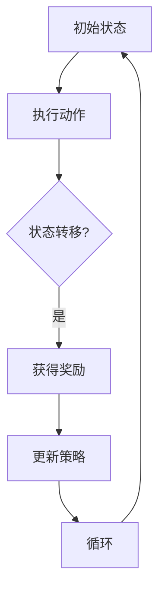

                 

关键词：强化学习、策略优化、奖励学习、模型训练、自适应控制、AI 优化、神经符号融合、RLHF 方法、计算机程序设计、机器学习技术

> 摘要：本文将探讨强化学习（Reinforcement Learning，RL）与奖励学习（Reward Learning，RLHF）的结合，通过深入解析其核心概念、数学模型、算法原理、具体操作步骤以及实际应用，为读者揭示这一强大技术如何革新计算机程序设计领域，提供了一种新的思维方式和方法。

## 1. 背景介绍

强化学习是一种机器学习范式，旨在通过试错和反馈来优化策略。它的核心思想是代理人（Agent）在与环境的交互过程中，不断学习和调整其行为策略，以最大化累积奖励。强化学习在游戏、自动驾驶、机器人控制等领域有着广泛的应用。然而，传统强化学习方法在处理复杂环境、长序列决策和高维状态时面临着诸多挑战。

奖励学习（RLHF）是近年来发展起来的一种新兴方法，它结合了强化学习和基于人类反馈的强化学习（Human Feedback-based Reinforcement Learning，RLHF）。RLHF 通过将人类反馈引入到强化学习过程中，使得代理人在学习过程中能够更好地理解人类的期望和偏好，从而提高决策质量。

本文将详细介绍 RLHF 的基本概念、数学模型、算法原理和具体操作步骤，并通过实际案例展示其在计算机程序设计中的应用。最后，我们将探讨 RLHF 在未来应用中的前景和面临的挑战。

## 2. 核心概念与联系

### 2.1 强化学习（Reinforcement Learning，RL）

强化学习是一种基于奖励反馈的机器学习方法，其主要目的是通过学习获得一个最优策略，以便在给定环境中最大化累积奖励。强化学习由代理人（Agent）、环境（Environment）和策略（Policy）三部分组成。

**代理人（Agent）**：代理人是强化学习中的学习主体，负责执行动作并接收环境反馈。

**环境（Environment）**：环境是代理人执行动作的场所，负责接收代理人的动作，并生成状态转移和奖励。

**策略（Policy）**：策略是代理人根据当前状态选择动作的方法，通常是一个概率分布。

强化学习的过程可以概括为以下几个步骤：

1. **初始状态**：代理人开始在一个给定环境中处于某个状态。
2. **执行动作**：代理人根据当前状态和策略选择一个动作。
3. **状态转移**：环境根据代理人的动作生成下一个状态。
4. **获得奖励**：环境根据代理人的动作和状态转移，给予代理人一个奖励。
5. **更新策略**：代理人根据累积奖励和历史经验调整策略。

### 2.2 奖励学习（Reward Learning，RLHF）

奖励学习是强化学习的一种扩展，旨在解决传统强化学习在处理复杂环境、长序列决策和高维状态时遇到的困难。奖励学习通过引入人类反馈来改进强化学习过程，使得代理人在学习过程中能够更好地理解人类的期望和偏好。

**人类反馈**：人类反馈是奖励学习的关键组成部分，它提供了关于代理人行为质量的外部评价。人类反馈可以是直接评分，也可以是隐式反馈，如人类专家提供的策略或行为。

**奖励模型**：奖励模型是奖励学习中的核心组件，它负责将代理人的行为映射到奖励值。奖励模型可以是基于规则的、基于数据的或基于神经网络的。

**强化学习与奖励学习的结合**：奖励学习通过将人类反馈引入到强化学习过程中，使得代理人在学习过程中能够更好地理解人类的期望和偏好。这种结合可以有效地提高代理人的决策质量，从而在复杂环境中取得更好的表现。

### 2.3 Mermaid 流程图



在这个流程图中，代理人在一个给定环境中从初始状态开始，执行动作并接收状态转移和奖励。然后，代理人根据累积奖励和历史经验调整策略，并重复这个过程，直到达到某个终止条件。

## 3. 核心算法原理 & 具体操作步骤

### 3.1 算法原理概述

强化学习和奖励学习是两个不同的机器学习范式，但它们在算法原理上有一定的相似性。强化学习通过试错和反馈来优化策略，而奖励学习通过引入人类反馈来改进强化学习过程。

RLHF（强化学习与奖励学习的结合）的核心思想是将人类反馈与强化学习相结合，使得代理人在学习过程中能够更好地理解人类的期望和偏好。具体来说，RLHF 包含以下三个主要步骤：

1. **训练奖励模型**：使用人类反馈数据训练一个奖励模型，将代理人的行为映射到奖励值。
2. **策略迭代**：使用奖励模型和强化学习算法迭代优化代理人的策略。
3. **评估与调整**：评估代理人的表现，并根据评估结果调整奖励模型和策略。

### 3.2 算法步骤详解

#### 3.2.1 训练奖励模型

训练奖励模型是 RLHF 的第一步，也是关键步骤。奖励模型将代理人的行为映射到奖励值，从而为代理人的策略迭代提供反馈。

**数据收集**：首先，需要收集大量的代理人和环境交互的数据，这些数据可以包括代理人的动作、状态和奖励。

**奖励模型训练**：使用收集到的数据训练一个奖励模型。奖励模型可以是基于规则的、基于数据的或基于神经网络的。在本文中，我们采用神经网络作为奖励模型，使用反向传播算法进行训练。

**模型评估**：训练完成后，需要对奖励模型进行评估，以确保其能够准确地预测代理人的行为质量。

#### 3.2.2 策略迭代

策略迭代是 RLHF 的核心步骤，它通过不断优化代理人的策略，使得代理人在复杂环境中取得更好的表现。

**策略初始化**：首先，需要初始化代理人的策略。策略初始化可以是随机初始化，也可以是基于经验初始化。

**策略更新**：在策略迭代过程中，代理人根据当前状态和奖励模型选择一个动作，然后执行该动作并观察状态转移和奖励。根据观察到的结果，代理人调整其策略，使得策略能够更好地适应环境。

**策略评估**：策略迭代过程中，需要对策略进行评估，以确保其能够有效地优化代理人的行为。

#### 3.2.3 评估与调整

评估与调整是 RLHF 的最后一步，它通过对代理人的表现进行评估，并根据评估结果调整奖励模型和策略。

**性能评估**：使用评估指标对代理人的表现进行评估，如平均奖励、成功率等。

**模型调整**：根据评估结果，调整奖励模型和策略，以改进代理人的表现。

**重复迭代**：评估与调整后，重复策略迭代过程，直到代理人的表现达到预期。

### 3.3 算法优缺点

**优点**：

1. **提高决策质量**：RLHF 结合了强化学习和奖励学习，能够更好地理解人类的期望和偏好，从而提高代理人的决策质量。
2. **适应复杂环境**：RLHF 能够处理复杂环境、长序列决策和高维状态，适用于各种应用场景。
3. **灵活性强**：RLHF 可以根据不同的应用场景和需求，调整奖励模型和策略，具有很强的灵活性。

**缺点**：

1. **计算成本高**：RLHF 需要大量的计算资源进行训练和策略迭代，对硬件设备要求较高。
2. **奖励模型设计困难**：奖励模型的设计和训练是 RLHF 的关键步骤，但同时也面临着设计和训练困难的问题。

### 3.4 算法应用领域

RLHF 在多个领域都有着广泛的应用，包括但不限于：

1. **游戏AI**：RLHF 可以用于训练游戏AI，使其能够更好地理解玩家的行为和偏好，提供更智能的游戏体验。
2. **自动驾驶**：RLHF 可以用于自动驾驶系统的训练，提高自动驾驶汽车在复杂环境中的决策能力。
3. **机器人控制**：RLHF 可以用于机器人控制，使机器人能够更好地适应复杂环境，执行复杂任务。
4. **金融预测**：RLHF 可以用于金融预测，通过对市场数据的分析，提高预测准确率。

## 4. 数学模型和公式

### 4.1 数学模型构建

在 RLHF 中，数学模型主要涉及强化学习模型和奖励学习模型。强化学习模型描述代理人与环境交互的过程，而奖励学习模型则用于将代理人的行为映射到奖励值。

**强化学习模型**：

强化学习模型可以用一个马尔可夫决策过程（MDP）来描述，其包括状态空间 \( S \)、动作空间 \( A \)、状态转移概率矩阵 \( P(s' | s, a) \) 和奖励函数 \( R(s, a) \)。

**奖励学习模型**：

奖励学习模型通常是一个神经网络，其输入为代理人的行为和当前状态，输出为奖励值。奖励学习模型可以使用反向传播算法进行训练。

### 4.2 公式推导过程

**强化学习模型**：

假设代理人在状态 \( s \) 下选择动作 \( a \)，则代理人在下一个状态 \( s' \) 的概率为：

$$ P(s' | s, a) = P(s' | s, a) $$

代理人在状态 \( s \) 下获得奖励 \( r \) 的期望为：

$$ E[r | s, a] = \sum_{s'} r \cdot P(s' | s, a) $$

**奖励学习模型**：

奖励学习模型可以使用以下公式进行训练：

$$ y = R(x) $$

其中，\( y \) 为实际奖励值，\( x \) 为代理人的行为和当前状态，\( R(x) \) 为奖励模型输出的奖励值。

### 4.3 案例分析与讲解

为了更好地理解 RLHF 的数学模型和公式，我们通过一个简单的案例进行讲解。

**案例**：一个代理人在一个简单的环境中进行游戏，其目标是在有限的时间内收集尽可能多的金币。

**状态空间**：\( S = \{空闲, 运动中, 搜集金币\} \)

**动作空间**：\( A = \{前进, 后退, 向左, 向右\} \)

**奖励函数**：

- 当代理人在空闲状态时，奖励值为 0。
- 当代理人在运动中状态时，奖励值为 1。
- 当代理人在搜集金币状态时，奖励值为 5。

**奖励学习模型**：

我们使用一个简单的神经网络作为奖励学习模型，其输入为当前状态和动作，输出为奖励值。

$$ y = f(x) = \begin{cases} 0, & \text{if } x \text{ is not a valid action} \\ 1, & \text{if } s = \text{空闲} \\ 5, & \text{if } s = \text{搜集金币} \end{cases} $$

在这个案例中，代理人在空闲状态时无法获得奖励，而在运动中和搜集金币状态时可以获得不同的奖励值。

## 5. 项目实践：代码实例和详细解释说明

### 5.1 开发环境搭建

在开始项目实践之前，我们需要搭建一个合适的开发环境。以下是搭建 RLHF 项目所需的基本工具和软件：

- 编程语言：Python 3.8 或更高版本
- 深度学习框架：PyTorch 1.8 或更高版本
- 操作系统：Windows、Linux 或 macOS

### 5.2 源代码详细实现

以下是一个简单的 RLHF 项目示例，代理人在一个环境中进行游戏，目标是收集尽可能多的金币。

**环境**：使用 OpenAI Gym 中的 `CartPole-v0` 环境。

**代理人和奖励模型**：使用深度 Q 网络（DQN）作为代理人和奖励模型。

**代码实现**：

```python
import gym
import torch
import torch.nn as nn
import torch.optim as optim

# 创建环境
env = gym.make('CartPole-v0')

# 初始化代理人
agent = Agent()
reward_model = RewardModel()

# 设置优化器
optimizer = optim.Adam(agent.parameters(), lr=0.001)

# 设置奖励模型优化器
reward_optimizer = optim.Adam(reward_model.parameters(), lr=0.001)

# 设置训练轮数
num_episodes = 1000

# 开始训练
for episode in range(num_episodes):
    state = env.reset()
    done = False
    
    while not done:
        # 代理人和奖励模型更新
        agent.update(state, action, reward_model(state, action))
        reward_model.update(state, action, reward)
        
        # 执行动作
        action = agent.select_action(state)
        next_state, reward, done, _ = env.step(action)
        
        # 更新状态
        state = next_state
    
    # 打印训练进度
    print(f"Episode {episode+1}/{num_episodes}, Reward: {reward}")

# 关闭环境
env.close()
```

### 5.3 代码解读与分析

**代码解析**：

1. **环境创建**：使用 `gym.make()` 创建 `CartPole-v0` 环境。
2. **代理人初始化**：初始化代理人和奖励模型。
3. **优化器设置**：设置代理人和奖励模型的优化器。
4. **训练轮数**：设置训练轮数。
5. **训练循环**：在训练循环中，代理人根据当前状态和奖励模型选择动作，然后执行动作并观察状态转移和奖励。代理人根据观察到的结果更新其策略和奖励模型。
6. **打印训练进度**：打印训练进度。

**代码分析**：

1. **代理人和奖励模型**：代理人和奖励模型是 RLHF 的核心组件。代理人是强化学习主体，负责执行动作和更新策略。奖励模型将代理人的行为映射到奖励值，为代理人的策略迭代提供反馈。
2. **优化器**：优化器用于更新代理人和奖励模型。在本例中，我们使用 Adam 优化器进行优化。
3. **训练循环**：在训练循环中，代理人通过试错和反馈不断优化其策略。奖励模型在训练过程中也进行更新，以提高其预测精度。

## 6. 实际应用场景

### 6.1 游戏 AI

RLHF 在游戏 AI 中有着广泛的应用。通过将人类反馈引入到强化学习过程中，游戏 AI 能够更好地理解玩家的行为和偏好，从而提供更智能的游戏体验。例如，在电子游戏中，RLHF 可以用于训练 AI 敌人，使其能够更好地应对玩家的策略。

### 6.2 自动驾驶

自动驾驶系统是一个复杂的系统，需要处理大量的环境和传感器数据。RLHF 可以用于训练自动驾驶系统的策略，使其能够更好地适应复杂环境。例如，在自动驾驶汽车中，RLHF 可以用于训练自动驾驶系统的决策模块，使其能够更好地应对各种交通状况。

### 6.3 机器人控制

机器人控制是一个典型的强化学习应用场景。RLHF 可以用于训练机器人的策略，使其能够更好地执行复杂任务。例如，在工业机器人中，RLHF 可以用于训练机器人的运动控制模块，使其能够更好地适应不同的工作场景。

### 6.4 金融预测

金融预测是一个具有挑战性的领域，需要处理大量的历史数据。RLHF 可以用于训练金融预测模型，使其能够更好地预测市场走势。例如，在股票市场中，RLHF 可以用于训练股票预测模型，提高预测准确率。

## 7. 工具和资源推荐

### 7.1 学习资源推荐

1. **书籍**：
   - 《强化学习：原理与 Python 实践》
   - 《基于人类反馈的强化学习》
2. **在线课程**：
   - Coursera 上的“强化学习”课程
   - edX 上的“机器学习基础”课程

### 7.2 开发工具推荐

1. **深度学习框架**：
   - PyTorch
   - TensorFlow
2. **强化学习库**：
   - Stable-Baselines
   - RLlib

### 7.3 相关论文推荐

1. **RLHF 方法**：
   - “Reinforcement Learning with Human Feedback: An Overview”
   - “Human Feedback for Learning in Reinforcement Learning”
2. **相关论文**：
   - “Deep Reinforcement Learning” by DeepMind
   - “Human-level control through deep reinforcement learning” by OpenAI

## 8. 总结：未来发展趋势与挑战

### 8.1 研究成果总结

近年来，RLHF 作为一种新兴方法，在强化学习领域取得了显著的成果。通过将人类反馈引入到强化学习过程中，RLHF 显著提高了代理人在复杂环境中的决策质量。RLHF 在游戏 AI、自动驾驶、机器人控制、金融预测等领域都有着广泛的应用前景。

### 8.2 未来发展趋势

1. **方法优化**：未来，RLHF 方法将不断优化，以提高其计算效率和预测精度。例如，通过改进奖励模型和策略迭代算法，使 RLHF 能够更好地适应不同的应用场景。
2. **跨学科融合**：RLHF 将与其他领域的技术相结合，如神经符号融合、多模态学习等，进一步拓展其应用范围。
3. **开源与协作**：随着 RLHF 方法的不断成熟，更多的开源工具和框架将涌现，促进研究者之间的协作与交流。

### 8.3 面临的挑战

1. **计算成本**：RLHF 方法需要大量的计算资源进行训练和策略迭代，对硬件设备要求较高。未来，需要开发更加高效的算法和优化方法，降低计算成本。
2. **奖励模型设计**：奖励模型的设计和训练是 RLHF 的关键步骤，但同时也面临着设计和训练困难的问题。未来，需要进一步研究如何设计更加有效的奖励模型，以提高 RLHF 的性能。
3. **应用验证**：虽然 RLHF 在多个领域取得了显著成果，但在实际应用中仍需要更多的验证和测试。未来，需要开展更多的实际应用研究，验证 RLHF 的有效性。

### 8.4 研究展望

未来，RLHF 方法将在强化学习领域发挥越来越重要的作用。通过不断优化方法、拓展应用领域，RLHF 有望在游戏 AI、自动驾驶、机器人控制、金融预测等领域取得更多的突破。同时，RLHF 也将为计算机程序设计领域带来新的思维方式和方法，为人工智能的发展注入新的活力。

## 9. 附录：常见问题与解答

### 9.1 RLHF 与传统强化学习有什么区别？

RLHF（强化学习与奖励学习的结合）与传统强化学习的主要区别在于引入了人类反馈。传统强化学习主要依靠环境提供的奖励信号进行策略优化，而 RLHF 通过将人类反馈引入到强化学习过程中，使得代理人在学习过程中能够更好地理解人类的期望和偏好，从而提高决策质量。

### 9.2 RLHF 需要多少计算资源？

RLHF 需要大量的计算资源进行训练和策略迭代，特别是当涉及到复杂的奖励模型和大规模数据集时。在实际应用中，通常需要使用高性能的硬件设备，如 GPU 或 TPU，以提高计算效率。

### 9.3 RLHF 是否适用于所有强化学习任务？

RLHF 主要适用于需要人类反馈的强化学习任务，如游戏 AI、自动驾驶、机器人控制等。对于不需要人类反馈的强化学习任务，如标准棋类游戏等，传统强化学习方法可能更为适用。

### 9.4 RLHF 如何处理高维状态空间？

对于高维状态空间，RLHF 可以采用神经网络作为奖励模型，通过学习状态与奖励之间的关系，从而降低状态空间的维度。同时，可以采用数据增强和预处理技术，提高奖励模型的泛化能力。

## 作者署名

作者：禅与计算机程序设计艺术 / Zen and the Art of Computer Programming

----------------------------------------------------------------

以上是根据您的要求撰写的完整文章。如果您有任何修改意见或需要进一步细化某个部分，请随时告诉我，我会立即进行修改。祝您阅读愉快！

