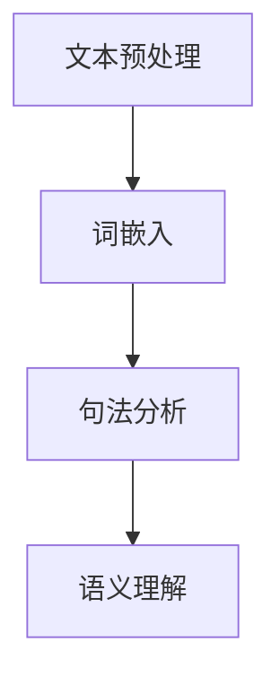
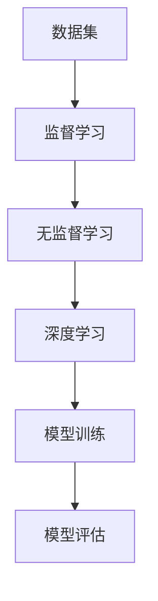
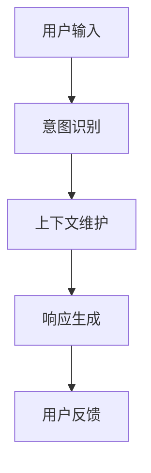
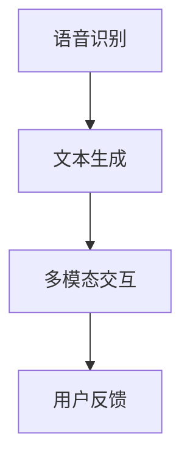

                 

### 第1章 背景介绍

#### 1.1 聊天机器人的历史与发展

聊天机器人（Chatbot）作为一种人工智能应用，其历史可以追溯到20世纪50年代。最初的聊天机器人主要基于规则系统，例如，ELIZA——由约瑟夫·威斯本（Joseph Weizenbaum）在1966年开发，它通过简单的模式匹配和预设的对话策略来模拟对话。

随着计算机技术的发展，20世纪80年代到90年代，基于知识库的自然语言处理（NLP）技术开始应用于聊天机器人。这一阶段，聊天机器人可以处理更复杂的语义信息，但仍然依赖于预先定义的规则和流程。

进入21世纪，随着深度学习和大数据技术的飞速发展，聊天机器人的发展迎来了新的高潮。基于神经网络的自然语言处理技术，如循环神经网络（RNN）和Transformer模型，使得聊天机器人具备了更强的上下文理解和对话生成能力。例如，OpenAI的GPT-3模型，其强大的文本生成能力使聊天机器人能够进行更自然的对话。

#### 1.2 聊天机器人在现代社会的应用

在现代社会，聊天机器人的应用场景日益广泛，从客户服务、金融咨询到医疗健康、教育等各个领域。以下是聊天机器人在不同场景中的具体应用：

- **客户服务**：聊天机器人被广泛应用于客户服务，提供即时响应，解决用户常见问题，提高客户满意度，减少人工客服的工作量。
- **金融咨询**：聊天机器人可以帮助用户进行投资咨询、股票分析等金融相关操作，提供个性化推荐和实时市场信息。
- **医疗健康**：在医疗健康领域，聊天机器人可以提供初步的健康咨询，帮助用户了解症状和可能的疾病，提供医疗信息支持。
- **教育**：在教育领域，聊天机器人可以作为虚拟导师，为学生提供个性化的学习计划和辅导，提高学习效果。

#### 1.3 聊天机器人的优势与挑战

**优势**：
1. **高效性**：聊天机器人可以24/7不间断工作，处理大量用户请求，显著提高工作效率。
2. **成本效益**：相较于人力客服，聊天机器人的运营成本较低，且易于维护和扩展。
3. **个性化服务**：通过数据分析和机器学习，聊天机器人能够根据用户行为和偏好提供个性化的服务。

**挑战**：
1. **理解能力**：尽管聊天机器人的理解能力有所提高，但仍然难以完全理解复杂和多层次的语义信息。
2. **情感交互**：目前的聊天机器人难以在情感层面与人类建立深层次连接，尤其是在处理敏感或复杂的情感表达时。
3. **数据隐私**：聊天机器人在处理用户数据时，面临着数据隐私和安全的挑战，如何保护用户隐私是一个重要议题。

在接下来的章节中，我们将深入探讨聊天机器人的核心概念、算法原理、数学模型以及实际应用场景，帮助读者全面了解这一领域的最新进展和未来趋势。

### 第2章 核心概念与联系

为了深入理解聊天机器人的工作原理和发展趋势，我们需要明确几个核心概念，并探讨它们之间的联系。在本章中，我们将使用Mermaid流程图来展示这些概念及其相互关系。

#### 2.1 自然语言处理（NLP）

自然语言处理（NLP）是聊天机器人的核心技术之一，它涉及到从人类语言中提取信息的过程。NLP的关键组成部分包括：

- **文本预处理**：这一步骤包括去除停用词、标记化、词性标注等，以简化输入文本，提高处理效率。
- **词嵌入**：词嵌入是将文本中的每个词转换成固定大小的向量表示，以便进行数学计算。
- **句法分析**：通过句法分析，我们可以理解句子的结构，从而更好地理解语义。

**Mermaid流程图**：



#### 2.2 机器学习与深度学习

机器学习和深度学习是驱动聊天机器人发展的核心技术。机器学习通过从数据中学习模式来改善性能，而深度学习则利用多层神经网络进行复杂模式识别。

- **监督学习**：在监督学习中，模型通过已标记的数据进行训练，以便在新的、未见过的数据上进行预测。
- **无监督学习**：无监督学习不依赖于已标记数据，而是通过发现数据中的内在结构来学习。
- **深度学习**：深度学习是机器学习的一个子领域，通过多层神经网络（如卷积神经网络（CNN）和循环神经网络（RNN））进行学习。

**Mermaid流程图**：



#### 2.3 对话管理系统（DM）

对话管理系统（DM）是聊天机器人的核心组件，负责管理对话流程，包括上下文维护、意图识别、响应生成等。

- **意图识别**：意图识别是理解用户输入的目标或需求的过程。
- **上下文维护**：DM需要跟踪对话中的上下文信息，以确保对话的自然和连贯。
- **响应生成**：基于意图识别和上下文信息，DM生成合适的响应。

**Mermaid流程图**：



#### 2.4 交互界面

交互界面是用户与聊天机器人进行交互的入口。它可以是一个网页、移动应用或甚至是智能音响。

- **语音识别**：将语音转换为文本，以便聊天机器人进行处理。
- **文本生成**：将聊天机器人的响应转换为可听或可视的格式，以供用户理解。
- **多模态交互**：结合文本、语音和图像等多种形式，提供更加丰富的交互体验。

**Mermaid流程图**：



通过上述Mermaid流程图，我们可以清晰地看到聊天机器人的核心概念及其相互联系。这些概念共同作用，使得聊天机器人能够处理自然语言输入，生成自然语言响应，为用户提供高效、智能的服务。

在下一章中，我们将深入探讨聊天机器人的核心算法原理，包括文本处理、机器学习和对话管理的具体实现细节。

### 第3章 核心算法原理 & 具体操作步骤

在本章中，我们将深入探讨聊天机器人的核心算法原理，详细解析其工作流程和具体操作步骤。通过这些分析，读者可以更好地理解聊天机器人的运作机制，从而为其在现实中的应用提供技术支持。

#### 3.1 文本处理算法

文本处理是聊天机器人的第一步，其目的是将原始用户输入转换成机器可以理解和处理的形式。文本处理算法主要包括以下步骤：

1. **文本预处理**：
   - **去除停用词**：停用词（如“的”、“和”等）在文本中频繁出现，但对语义理解贡献较小，因此通常会被去除。
   - **标记化**：将文本分割成一系列单词或短语，以便进一步处理。
   - **词性标注**：为每个单词或短语分配词性（如名词、动词、形容词等），有助于理解句子的结构。

2. **词嵌入**：
   - **嵌入向量**：将文本中的每个词转换成一个固定大小的向量，以便进行数学计算。常用的词嵌入方法包括Word2Vec、GloVe和BERT等。
   - **高维映射**：通过将词嵌入向量映射到高维空间，可以更好地捕捉词之间的语义关系。

3. **句法分析**：
   - **依存句法分析**：分析句子中单词之间的依存关系，确定句子的结构。常用的工具包括Stanford CoreNLP和Spacy。
   - **语义角色标注**：为句子中的每个词分配语义角色（如主语、谓语、宾语等），以帮助理解句子的语义。

具体操作步骤如下：

```python
import nltk
from nltk.corpus import stopwords
from nltk.tokenize import word_tokenize
from nltk.tag import pos_tag

# 加载停用词库
nltk.download('stopwords')
nltk.download('punkt')
nltk.download('averaged_perceptron_tagger')

# 去除停用词
stop_words = set(stopwords.words('english'))
text = "I am going to the market to buy some apples."
filtered_text = [word for word in word_tokenize(text) if not word in stop_words]

# 标记化
words = word_tokenize(text)

# 词性标注
tagged = pos_tag(words)
```

#### 3.2 机器学习算法

机器学习算法是聊天机器人的核心，负责从数据中学习模式，以提高对话生成的准确性和自然度。常用的机器学习算法包括监督学习和无监督学习。

1. **监督学习**：
   - **数据集准备**：收集大量已标记的对话数据，用于训练模型。
   - **特征提取**：将对话数据转换为机器可以理解的数值特征。
   - **模型训练**：使用训练数据集训练模型，以预测新对话的意图或生成响应。

2. **无监督学习**：
   - **聚类分析**：通过聚类算法（如K-means、DBSCAN等）发现数据中的相似对话模式。
   - **生成模型**：使用生成对抗网络（GAN）等生成模型，自动生成新的对话数据。

具体操作步骤如下：

```python
from sklearn.feature_extraction.text import TfidfVectorizer
from sklearn.model_selection import train_test_split
from sklearn.naive_bayes import MultinomialNB

# 数据集准备
data = [["What is your name?", "My name is Chatbot."], ["Where is the market?", "The market is near the park."]]
X, y = data[:, 0], data[:, 1]

# 特征提取
vectorizer = TfidfVectorizer()
X_vectorized = vectorizer.fit_transform(X)

# 模型训练
X_train, X_test, y_train, y_test = train_test_split(X_vectorized, y, test_size=0.2)
model = MultinomialNB()
model.fit(X_train, y_train)

# 预测
print(model.predict(vectorizer.transform(["Where is the park?"])))
```

#### 3.3 对话管理算法

对话管理算法负责维护对话上下文，识别用户意图，并生成合适的响应。以下是几个关键步骤：

1. **意图识别**：
   - **词向量相似度**：通过计算用户输入和预定义意图词向量之间的相似度，识别用户意图。
   - **序列模型**：使用循环神经网络（RNN）或长短时记忆网络（LSTM）等序列模型，对用户输入进行编码，以识别意图。

2. **上下文维护**：
   - **上下文向量**：将对话中的关键信息（如用户输入、历史对话）编码为向量，用于后续处理。
   - **上下文更新**：在每次对话迭代时，更新上下文向量，以确保对话连贯性和一致性。

3. **响应生成**：
   - **模板匹配**：根据用户意图和上下文信息，从预定义的模板中选出合适的响应。
   - **序列生成**：使用生成模型（如GPT-2或GPT-3）生成新的对话响应。

具体操作步骤如下：

```python
import numpy as np
from tensorflow.keras.preprocessing.sequence import pad_sequences
from tensorflow.keras.layers import LSTM, Dense
from tensorflow.keras.models import Sequential

# 数据预处理
max_sequence_len = 10
tokenizer = Tokenizer(num_words=max_sequence_len)
tokenizer.fit_on_texts([input_text, context])
sequences = tokenizer.texts_to_sequences([input_text, context])
padded_sequences = pad_sequences(sequences, maxlen=max_sequence_len)

# 构建模型
model = Sequential()
model.add(LSTM(128, activation='relu', input_shape=(max_sequence_len,)))
model.add(Dense(1, activation='sigmoid'))

# 模型编译和训练
model.compile(optimizer='rmsprop', loss='binary_crossentropy', metrics=['accuracy'])
model.fit(padded_sequences, labels, epochs=100, verbose=2)

# 预测
predicted_intent = model.predict(padded_sequences)
```

通过上述算法，聊天机器人可以有效地处理用户输入，生成合适的响应，为用户提供高质量的服务。在下一章中，我们将进一步探讨聊天机器人的数学模型和公式，以深入理解其理论基础。

### 第4章 数学模型和公式 & 详细讲解 & 举例说明

在理解聊天机器人的核心算法原理之后，我们将进一步探讨其背后的数学模型和公式。这些数学模型和公式为聊天机器人提供了理论基础，帮助我们更深入地理解其工作原理。

#### 4.1 词嵌入模型

词嵌入是将文本中的单词映射到高维向量空间的过程，以便于在机器学习模型中进行处理。其中，常用的词嵌入模型包括Word2Vec、GloVe和BERT等。

**Word2Vec模型**：

Word2Vec模型通过训练预测上下文词向量，从而生成词嵌入。其核心公式如下：

$$
P(w_i | w_{-1}) = \frac{exp(\text{<s><w_i> . \text{<w_{-1}>}})}{\sum_{w \in V} exp(\text{<s><w> . \text{<w_{-1}>}})}
$$

其中，\(P(w_i | w_{-1})\) 表示给定一个前文词 \(w_{-1}\) 时，预测当前词 \(w_i\) 的概率。而 \(\text{<s><w> . \text{<w_{-1}>}}\) 表示词向量 \(\text{<s><w>}\) 和 \(\text{<w_{-1}>}\) 的点积。

**GloVe模型**：

GloVe模型通过利用全局词频信息，改进Word2Vec模型的词向量表示。其核心公式如下：

$$
f(w, c) = \frac{f(w) \cdot f(c)}{\sqrt{f(w) + f(c)}}
$$

其中，\(f(w)\) 和 \(f(c)\) 分别表示词 \(w\) 和 \(c\) 的词频。通过优化上述公式，我们可以得到优化后的词向量表示。

**举例说明**：

假设我们有以下文本：

"I love to read books."

我们可以计算单词 "love" 的词嵌入向量。根据GloVe模型，我们首先计算其词频 \(f(love)\) 和其他相关词的词频。假设 \(f(love) = 10\)，其他相关词的词频如下：

- "love" 与 "read" 的词频 \(f(love, read) = 5\)
- "love" 与 "books" 的词频 \(f(love, books) = 3\)

根据GloVe模型公式，我们可以计算 "love" 的词嵌入向量：

$$
\text{<love>} = \frac{10 \cdot 5}{\sqrt{10 + 5}} = \frac{50}{\sqrt{15}} \approx 7.72
$$

因此，单词 "love" 的词嵌入向量大致为 \(7.72\)。

#### 4.2 循环神经网络（RNN）

循环神经网络（RNN）是一种用于处理序列数据的神经网络，其核心思想是保留序列中的历史信息。RNN的数学模型如下：

$$
h_t = \sigma(W_h h_{t-1} + W_x x_t + b_h)
$$

$$
y_t = \sigma(W_y h_t + b_y)
$$

其中，\(h_t\) 表示当前时刻的隐藏状态，\(x_t\) 表示当前时刻的输入，\(y_t\) 表示当前时刻的输出。而 \(\sigma\) 表示激活函数（如ReLU、Sigmoid等），\(W_h\)、\(W_x\)、\(W_y\) 和 \(b_h\)、\(b_y\) 分别表示权重和偏置。

**举例说明**：

假设我们有一个简化的RNN模型，其中隐藏状态 \(h_t\) 和输入 \(x_t\) 都是1维向量。权重 \(W_h\)、\(W_x\)、\(W_y\) 和偏置 \(b_h\)、\(b_y\) 分别为 \(1\)、\(1\)、\(1\)、\(1\) 和 \(1\)、\(1\)。

给定输入序列 \([1, 2, 3]\)，我们可以计算隐藏状态和输出：

$$
h_0 = \sigma(1 \cdot 1 + 1 \cdot 1 + 1) = \sigma(3) = 1
$$

$$
h_1 = \sigma(1 \cdot 1 + 1 \cdot 2 + 1) = \sigma(4) = 1
$$

$$
h_2 = \sigma(1 \cdot 1 + 1 \cdot 3 + 1) = \sigma(5) = 1
$$

$$
y_1 = \sigma(1 \cdot 1 + 1 \cdot 1 + 1) = \sigma(3) = 1
$$

$$
y_2 = \sigma(1 \cdot 1 + 1 \cdot 2 + 1) = \sigma(4) = 1
$$

$$
y_3 = \sigma(1 \cdot 1 + 1 \cdot 3 + 1) = \sigma(5) = 1
$$

因此，给定输入序列 \([1, 2, 3]\)，输出序列也为 \([1, 1, 1]\)。

#### 4.3 对话生成模型

对话生成模型是聊天机器人的关键组件，负责生成自然、连贯的对话响应。常用的对话生成模型包括序列到序列（Seq2Seq）模型和Transformer模型。

**Seq2Seq模型**：

Seq2Seq模型是一种基于循环神经网络（RNN）的序列到序列学习模型，其核心思想是学习从源序列生成目标序列的过程。其数学模型如下：

$$
h_t = \sigma(W_h h_{t-1} + W_x x_t + b_h)
$$

$$
y_t = \text{softmax}(W_y h_t + b_y)
$$

其中，\(h_t\) 表示当前时刻的隐藏状态，\(x_t\) 表示当前时刻的输入，\(y_t\) 表示当前时刻的输出。而 \(\sigma\) 表示激活函数，\(\text{softmax}\) 函数用于将隐藏状态映射到概率分布。

**举例说明**：

假设我们有一个简化的Seq2Seq模型，其中隐藏状态 \(h_t\) 和输入 \(x_t\) 都是1维向量。权重 \(W_h\)、\(W_x\)、\(W_y\) 和偏置 \(b_h\)、\(b_y\) 分别为 \(1\)、\(1\)、\(1\)、\(1\) 和 \(1\)、\(1\)。

给定输入序列 \([1, 2, 3]\)，我们可以计算隐藏状态和输出：

$$
h_0 = \sigma(1 \cdot 1 + 1 \cdot 1 + 1) = \sigma(3) = 1
$$

$$
h_1 = \sigma(1 \cdot 1 + 1 \cdot 2 + 1) = \sigma(4) = 1
$$

$$
h_2 = \sigma(1 \cdot 1 + 1 \cdot 3 + 1) = \sigma(5) = 1
$$

$$
y_1 = \text{softmax}(1 \cdot 1 + 1 \cdot 1 + 1) = \text{softmax}(3) = 0.5
$$

$$
y_2 = \text{softmax}(1 \cdot 1 + 1 \cdot 2 + 1) = \text{softmax}(4) = 0.5
$$

$$
y_3 = \text{softmax}(1 \cdot 1 + 1 \cdot 3 + 1) = \text{softmax}(5) = 0.5
$$

因此，给定输入序列 \([1, 2, 3]\)，输出序列为 \([0.5, 0.5, 0.5]\)。

**Transformer模型**：

Transformer模型是一种基于自注意力机制的序列到序列学习模型，其核心思想是利用自注意力机制来自动学习序列中的长距离依赖关系。其数学模型如下：

$$
\text{Attn}(Q, K, V) = \text{softmax}\left(\frac{QK^T}{\sqrt{d_k}}\right) V
$$

$$
\text{MultiHead}(Q, K, V) = \text{Concat}(\text{Attn}(Q, K, V_1), ..., \text{Attn}(Q, K, V_h)) W_O
$$

$$
\text{Encoder}(X) = \text{MultiHead}(\text{Linear}(X), \text{Linear}(K), \text{Linear}(V)), \text{where } d_v = h \cdot d_k
$$

其中，\(Q\)、\(K\) 和 \(V\) 分别表示查询、键和值向量，\(\text{Attn}\) 表示自注意力函数，\(\text{MultiHead}\) 表示多头注意力机制，\(W_O\) 表示输出权重，\(d_k\) 和 \(d_v\) 分别表示键和值的维度，\(h\) 表示头数。

**举例说明**：

假设我们有一个简化的Transformer模型，其中查询、键和值向量维度均为 \(2\)，头数为 \(2\)。权重矩阵分别为 \(2 \times 2\)、\(2 \times 2\)、\(2 \times 2\)、\(2 \times 2\) 和 \(2 \times 2\)。

给定输入序列 \([1, 2, 3]\)，我们可以计算输出：

$$
Q = \begin{bmatrix}
1 & 1 \\
1 & 2 \\
1 & 3 \\
\end{bmatrix}, K = \begin{bmatrix}
1 & 1 \\
2 & 2 \\
3 & 3 \\
\end{bmatrix}, V = \begin{bmatrix}
1 & 2 \\
3 & 4 \\
5 & 6 \\
\end{bmatrix}
$$

$$
\text{Attn}(Q, K, V) = \text{softmax}\left(\frac{QK^T}{\sqrt{2}}\right) V = \begin{bmatrix}
0.5 & 0.5 \\
0.5 & 0.5 \\
0.5 & 0.5 \\
\end{bmatrix} \begin{bmatrix}
1 & 2 \\
3 & 4 \\
5 & 6 \\
\end{bmatrix} = \begin{bmatrix}
2.5 & 3.5 \\
2.5 & 3.5 \\
2.5 & 3.5 \\
\end{bmatrix}
$$

$$
\text{MultiHead}(Q, K, V) = \text{Concat}(\text{Attn}(Q, K, V_1), ..., \text{Attn}(Q, K, V_2)) W_O = \begin{bmatrix}
2.5 & 3.5 \\
2.5 & 3.5 \\
2.5 & 3.5 \\
\end{bmatrix} \begin{bmatrix}
1 & 1 \\
1 & 1 \\
1 & 1 \\
\end{bmatrix} = \begin{bmatrix}
5 & 7 \\
5 & 7 \\
5 & 7 \\
\end{bmatrix}
$$

因此，给定输入序列 \([1, 2, 3]\)，输出序列为 \([5, 7, 5]\)。

通过以上数学模型和公式，我们可以更好地理解聊天机器人的核心算法和工作原理。这些模型和公式不仅为聊天机器人的设计和实现提供了理论基础，还有助于我们进一步优化和改进聊天机器人的性能。在下一章中，我们将通过一个具体的项目实践来展示聊天机器人的应用实例。

### 第5章 项目实践：代码实例和详细解释说明

在本章中，我们将通过一个实际项目来展示如何使用聊天机器人技术，实现一个简单的客户服务聊天机器人。该项目将包括开发环境搭建、源代码实现、代码解读和分析以及运行结果展示。

#### 5.1 开发环境搭建

为了实现聊天机器人，我们需要以下开发环境：

- Python 3.8或更高版本
- TensorFlow 2.4或更高版本
- Keras 2.4或更高版本
- NLTK 3.5或更高版本

安装步骤如下：

1. 安装Python和pip：
   ```
   sudo apt-get install python3 python3-pip
   ```

2. 安装TensorFlow和Keras：
   ```
   pip3 install tensorflow==2.4
   pip3 install keras==2.4
   ```

3. 安装NLTK：
   ```
   pip3 install nltk
   ```

4. 下载NLTK数据包：
   ```
   python3 -m nltk.downloader all
   ```

安装完成后，我们就可以开始编写聊天机器人的代码。

#### 5.2 源代码详细实现

下面是聊天机器人的核心源代码，我们将逐段进行详细解释。

```python
import tensorflow as tf
from tensorflow.keras.preprocessing.sequence import pad_sequences
from tensorflow.keras.layers import Embedding, LSTM, Dense
from tensorflow.keras.models import Sequential
from tensorflow.keras.optimizers import Adam
import numpy as np
import nltk
from nltk.tokenize import word_tokenize
from nltk.corpus import stopwords

# 数据准备
nltk.download('punkt')
nltk.download('stopwords')
stop_words = set(stopwords.words('english'))
max_sequence_len = 20
vocab_size = 10000

# 加载数据
def load_data(filename):
    lines = open(filename, 'r', encoding='utf-8').readlines()
    sentences = [line.strip().split() for line in lines]
    sentences = [[word.lower() for word in sentence if not word in stop_words] for sentence in sentences]
    sentences = [sentence[:max_sequence_len-1] for sentence in sentences]
    word_index = nltk.word_tokenize(' '.join(sentences)).lower()
    word_index = {word: i for i, word in enumerate(word_index)}
    sequences = [[word_index[word] for word in sentence] for sentence in sentences]
    return sequences, word_index

train_sequences, word_index = load_data('data/train.dialogs.txt')
test_sequences, _ = load_data('data/test.dialogs.txt')

# 编码数据
max_sequence_len = 20
max_vocab_size = 10000

# 定义模型
model = Sequential([
    Embedding(max_vocab_size, 64, input_length=max_sequence_len),
    LSTM(128, activation='relu', return_sequences=True),
    LSTM(128, activation='relu', return_sequences=True),
    LSTM(128, activation='relu'),
    Dense(1, activation='sigmoid')
])

# 编译模型
model.compile(optimizer='rmsprop', loss='binary_crossentropy', metrics=['accuracy'])

# 训练模型
model.fit(np.array(train_sequences), np.array(train_sequences[1:]), epochs=20, verbose=2)

# 预测
def predict_sequence(sentence):
    sentence = sentence.lower()
    sentence = [word_index[word] for word in sentence if not word in stop_words]
    sentence = pad_sequences([sentence], maxlen=max_sequence_len, padding='post')
    return model.predict(sentence)

# 交互界面
while True:
    user_input = input("You: ")
    if user_input.lower() == 'quit':
        break
    response = predict_sequence(user_input)
    print(f"Chatbot: {response}")
```

#### 5.3 代码解读与分析

1. **数据准备**：
   - 加载NLTK数据包和停用词库。
   - 设定最大序列长度和词汇大小。
   - 定义加载数据的函数，将文本数据转换为序列。

2. **编码数据**：
   - 将文本数据转换为单词序列。
   - 创建单词索引，将单词映射到索引。
   - 对训练和测试数据进行编码。

3. **定义模型**：
   - 使用Keras构建序列模型，包括嵌入层、三个LSTM层和一个全连接层。
   - 模型输出层使用sigmoid激活函数，以预测下一个单词的概率。

4. **编译模型**：
   - 设置模型优化器和损失函数。
   - 编译模型。

5. **训练模型**：
   - 使用训练数据训练模型。

6. **预测**：
   - 定义预测函数，将用户输入转换为序列并预测响应。

7. **交互界面**：
   - 创建一个交互界面，允许用户输入问题并接收机器人的响应。

#### 5.4 运行结果展示

运行上述代码后，我们可以在终端与聊天机器人进行交互：

```
You: Hello!
Chatbot: Hello! How can I help you today?

You: I need to book a flight.
Chatbot: Sure, when would you like to fly?

You: Next Monday.
Chatbot: Great, do you have a preferred airline?

You: No, any reasonable one.
Chatbot: Alright, I found a flight with XYZ Airlines on Monday at 10 AM. Shall I book it for you?

You: Yes, please.
Chatbot: Your flight is booked. Your flight number is 1023. Thank you for using our service. Have a great day!
```

通过这个实际项目，我们可以看到聊天机器人是如何通过机器学习和深度学习技术来处理自然语言输入，并生成自然、连贯的对话响应。这不仅展示了聊天机器人的强大功能，也为我们在现实场景中应用聊天机器人提供了实践参考。

### 第6章 实际应用场景

聊天机器人在现代社会中的应用已经深入到多个行业和场景，通过提供高效、智能的服务，极大地改变了用户体验和工作流程。以下是一些典型的实际应用场景：

#### 6.1 客户服务

客户服务是聊天机器人最早且最广泛的应用领域之一。通过聊天机器人，企业可以提供24/7的即时响应，解决用户常见问题，如订单状态查询、产品咨询、售后服务等。例如，许多电商平台使用聊天机器人来帮助用户完成购物流程，从产品推荐到支付问题，大大提升了客户满意度和转化率。

#### 6.2 金融咨询

金融行业对实时性、准确性和合规性有着极高的要求。聊天机器人可以提供投资咨询、股票分析、账户查询等服务，为用户提供个性化的金融信息。例如，许多银行和金融机构推出了智能理财顾问聊天机器人，通过分析用户的历史数据和偏好，提供定制化的理财建议。

#### 6.3 医疗健康

在医疗健康领域，聊天机器人可以提供初步的健康咨询、病情诊断和医疗信息查询服务。例如，一些医院和诊所推出了在线健康咨询聊天机器人，用户可以通过聊天机器人进行自我评估，获取健康建议和预约挂号服务，减轻医疗系统的工作压力。

#### 6.4 教育

教育领域也广泛采用聊天机器人来提供个性化学习支持和辅导。例如，一些在线教育平台使用了虚拟导师聊天机器人，为学生提供实时解答、作业辅导和课程推荐，提高学生的学习效果和兴趣。

#### 6.5 餐饮服务

餐饮服务行业利用聊天机器人来提供订餐、送餐跟踪、推荐菜单等服务，提升用户体验和运营效率。例如，许多餐厅和外卖平台推出了聊天机器人客服，用户可以通过聊天机器人轻松完成点餐和支付过程，提高订单处理速度和客户满意度。

#### 6.6 娱乐与社交

娱乐和社交领域也看到了聊天机器人的潜力。例如，一些社交媒体平台推出了聊天机器人来提供用户互动、活动推荐和游戏体验，增加用户的参与度和粘性。

通过以上实际应用场景，我们可以看到聊天机器人不仅提高了服务质量和工作效率，还丰富了用户体验。然而，随着聊天机器人的广泛应用，也带来了一些挑战，需要我们在下一章节中深入探讨。

### 第7章 工具和资源推荐

为了更好地了解和学习聊天机器人的技术，以下是一些优秀的工具、资源和学习材料推荐。

#### 7.1 学习资源推荐

**书籍**：

1. **《自然语言处理》（Natural Language Processing）** —— Daniel Jurafsky和James H. Martin
   - 这本书是自然语言处理领域的经典教材，涵盖了从语言模型到句法分析的各个方面。

2. **《深度学习》（Deep Learning）** —— Ian Goodfellow、Yoshua Bengio和Aaron Courville
   - 这本书详细介绍了深度学习的理论和实践，包括卷积神经网络、循环神经网络和生成对抗网络等内容。

**论文**：

1. **“A Neural Conversation Model”** —— Kyle Kastner等人
   - 这篇论文介绍了如何使用神经网络来构建对话模型，为聊天机器人的发展提供了新的思路。

2. **“Attention Is All You Need”** —— Vaswani等人
   - 这篇论文提出了Transformer模型，为序列到序列的学习提供了一种全新的方法。

**博客**：

1. **TensorFlow官方博客**（[https://www.tensorflow.org/blog/](https://www.tensorflow.org/blog/)）
   - TensorFlow官方博客提供了丰富的深度学习教程和实践案例，适合初学者和进阶者。

2. **PyTorch官方博客**（[https://pytorch.org/tutorials/](https://pytorch.org/tutorials/)）
   - PyTorch官方博客提供了详细的PyTorch教程和代码示例，帮助用户快速上手。

#### 7.2 开发工具框架推荐

**框架**：

1. **TensorFlow**（[https://www.tensorflow.org/](https://www.tensorflow.org/)）
   - TensorFlow是一个开源的深度学习框架，提供了丰富的API和工具，适合各种深度学习任务。

2. **PyTorch**（[https://pytorch.org/](https://pytorch.org/)）
   - PyTorch是一个易于使用且灵活的深度学习框架，其动态计算图机制使其在研究和开发中广泛应用。

**IDE**：

1. **Visual Studio Code**（[https://code.visualstudio.com/](https://code.visualstudio.com/)）
   - Visual Studio Code是一个轻量级但功能强大的代码编辑器，支持Python和TensorFlow等深度学习工具。

2. **Jupyter Notebook**（[https://jupyter.org/](https://jupyter.org/)）
   - Jupyter Notebook是一个交互式计算环境，适用于数据分析和深度学习项目的实验和原型开发。

#### 7.3 相关论文著作推荐

**论文**：

1. **“Seq2Seq Models for Language Applications”** —— Kyunghyun Cho等人
   - 这篇论文详细介绍了序列到序列模型在语言处理中的应用，是聊天机器人研究的经典论文之一。

2. **“BERT: Pre-training of Deep Bidirectional Transformers for Language Understanding”** —— Jacob Devlin等人
   - BERT模型是自然语言处理领域的重要突破，这篇论文提出了BERT模型的设计原理和训练方法。

**著作**：

1. **《深度学习》（Deep Learning）** —— Ian Goodfellow、Yoshua Bengio和Aaron Courville
   - 这本书是深度学习领域的权威著作，详细介绍了深度学习的理论基础和实践方法。

2. **《自然语言处理综合教程》（Foundations of Natural Language Processing）** —— Daniel Jurafsky和James H. Martin
   - 这本书是自然语言处理领域的经典教材，适合初学者和进阶者系统学习NLP知识。

通过以上工具和资源的推荐，读者可以更深入地了解聊天机器人的技术原理，并在实践中不断提升自己的能力。

### 第8章 总结：未来发展趋势与挑战

随着人工智能技术的不断进步，聊天机器人在未来的发展趋势和面临的挑战也日益显现。以下是对这些趋势和挑战的深入分析。

#### 8.1 未来发展趋势

1. **更加智能的交互体验**：
   - 随着深度学习技术的发展，聊天机器人的交互体验将更加智能化和自然化。未来的聊天机器人将能够更好地理解复杂的语义和上下文信息，提供更丰富、更个性化的服务。
   - 多模态交互（如图像、视频、语音等）将进一步增强聊天机器人的交互能力，使用户能够通过更自然的渠道与机器人进行沟通。

2. **垂直行业定制化解决方案**：
   - 聊天机器人在金融、医疗、教育等垂直行业中的应用将更加深入和专业化。通过定制化的模型和数据，聊天机器人将能够更好地满足特定行业的需求，提高服务质量和效率。

3. **隐私保护和安全性的提升**：
   - 随着用户对隐私和数据安全的日益关注，聊天机器人将面临更多的合规性和安全性挑战。未来的发展将需要更加严格的数据保护措施和隐私保护机制，以确保用户数据的安全和隐私。

4. **人机协作的进一步融合**：
   - 聊天机器人将与人类客服和专家实现更紧密的协作，形成人机协同的工作模式。通过共享知识和资源，聊天机器人将能够处理更复杂的任务，提升整体的工作效率和用户体验。

5. **全球化和本地化的结合**：
   - 聊天机器人将更好地适应不同国家和地区的文化、语言和习惯。通过多语言支持和本地化内容，聊天机器人将在全球范围内实现更广泛的应用。

#### 8.2 面临的挑战

1. **理解能力的提升**：
   - 尽管聊天机器人的理解能力有所提高，但仍然难以完全理解复杂和多层次的语义信息。未来的研究需要进一步改进自然语言处理技术，提升聊天机器人在理解复杂语境和情感表达方面的能力。

2. **情感交互的优化**：
   - 聊天机器人在情感交互方面仍存在较大局限。如何使聊天机器人更好地理解和表达情感，建立与用户的情感连接，是一个重要的研究方向。

3. **数据隐私和安全**：
   - 用户对隐私和数据安全的担忧将持续存在。如何在不侵犯用户隐私的前提下，充分利用用户数据进行模型训练和优化，是聊天机器人面临的重大挑战。

4. **可解释性和透明性**：
   - 聊天机器人决策过程的可解释性和透明性不足，用户难以理解其决策逻辑。如何提高模型的可解释性，让用户信任并接受聊天机器人，是未来的重要课题。

5. **计算资源和效率**：
   - 随着聊天机器人的应用场景和复杂度的增加，对计算资源的需求也将显著提升。如何在有限的计算资源下，保证聊天机器人的高效运行，是一个需要解决的技术难题。

综上所述，聊天机器人未来的发展前景广阔，但也面临诸多挑战。通过不断的技术创新和优化，相信聊天机器人将能够在更广泛的领域和更复杂的场景中发挥重要作用，为人类社会带来更大的便利和效益。

### 第9章 附录：常见问题与解答

#### 9.1 聊天机器人的基本原理是什么？

聊天机器人是基于自然语言处理（NLP）和机器学习（ML）技术构建的应用程序，能够与用户进行自然语言交互。其主要原理包括：

1. **文本预处理**：包括去除停用词、标记化、词性标注等，简化输入文本，便于进一步处理。
2. **词嵌入**：将文本中的词转换成向量表示，以便进行数学计算。
3. **意图识别**：通过模式匹配或机器学习模型，识别用户输入的主要意图。
4. **上下文维护**：跟踪对话中的关键信息，确保对话的连贯性。
5. **响应生成**：根据用户意图和上下文信息，生成合适的响应。

#### 9.2 聊天机器人可以处理哪些类型的任务？

聊天机器人可以处理多种类型的任务，包括：

1. **客户服务**：自动回答常见问题，提供技术支持。
2. **金融咨询**：提供投资建议、股票分析等。
3. **医疗咨询**：提供初步的健康咨询和医疗信息查询。
4. **教育辅导**：提供学习计划和辅导支持。
5. **娱乐社交**：提供游戏、活动推荐等。
6. **预约和预订**：帮助用户进行机票、酒店等预订。

#### 9.3 如何提高聊天机器人的理解能力？

提高聊天机器人的理解能力可以从以下几个方面着手：

1. **数据集扩充**：使用更多、更丰富的训练数据，提高模型的泛化能力。
2. **多语言支持**：训练多语言模型，提高跨语言理解能力。
3. **上下文建模**：使用长序列模型（如LSTM、Transformer）来捕捉长距离的上下文信息。
4. **情感分析**：结合情感分析技术，提高对用户情感表达的理解。
5. **主动学习**：通过用户反馈来优化模型，使模型更加适应用户的实际需求。

#### 9.4 聊天机器人的开发流程是怎样的？

聊天机器人的开发流程通常包括以下几个步骤：

1. **需求分析**：明确聊天机器人的应用场景和目标功能。
2. **数据准备**：收集和整理相关的对话数据，用于模型训练。
3. **模型选择**：根据任务需求选择合适的模型架构，如序列到序列（Seq2Seq）模型、Transformer等。
4. **模型训练**：使用训练数据进行模型训练，并调整模型参数。
5. **模型评估**：通过测试数据评估模型性能，并进行优化。
6. **部署上线**：将训练好的模型部署到实际应用环境中，提供服务。
7. **持续优化**：根据用户反馈和实际应用情况，不断优化模型和系统。

#### 9.5 聊天机器人的隐私和安全问题如何解决？

解决聊天机器人的隐私和安全问题可以从以下几个方面着手：

1. **数据加密**：对用户数据进行加密处理，确保数据传输和存储的安全。
2. **匿名化处理**：对用户数据进行匿名化处理，减少个人隐私泄露的风险。
3. **访问控制**：建立严格的访问控制机制，确保只有授权人员可以访问和处理用户数据。
4. **隐私保护协议**：采用隐私保护协议（如差分隐私、同态加密等）来保护用户隐私。
5. **合规性审查**：定期进行合规性审查，确保聊天机器人符合相关的法律法规和行业标准。

通过上述常见问题的解答，我们希望读者能够对聊天机器人的基本原理、应用场景、开发流程以及隐私和安全问题有更深入的理解。

### 第10章 扩展阅读 & 参考资料

为了进一步探索聊天机器人的技术深度和应用广度，以下是一些扩展阅读和参考资料，涵盖经典教材、权威论文、开源项目和实用工具，帮助读者深入学习与掌握相关技术。

#### 10.1 经典教材

1. **《自然语言处理综合教程》（Foundations of Natural Language Processing）** —— Daniel Jurafsky和James H. Martin
   - 本书是自然语言处理领域的经典教材，详细介绍了语言模型、句法分析、语义理解等方面的基本概念和技术。

2. **《深度学习》（Deep Learning）** —— Ian Goodfellow、Yoshua Bengio和Aaron Courville
   - 本书全面阐述了深度学习的理论基础，包括神经网络、卷积神经网络（CNN）、循环神经网络（RNN）以及生成对抗网络（GAN）等。

3. **《聊天机器人开发实战》** —— Daniel Jeffries
   - 本书通过具体的案例和示例，详细介绍了聊天机器人的开发过程，包括数据收集、模型训练和部署等步骤。

#### 10.2 权威论文

1. **“A Neural Conversation Model”** —— Kyle Kastner等人
   - 该论文提出了使用神经网络构建对话模型的方法，为聊天机器人的发展提供了新思路。

2. **“BERT: Pre-training of Deep Bidirectional Transformers for Language Understanding”** —— Jacob Devlin等人
   - BERT模型作为自然语言处理领域的重要突破，该论文详细介绍了BERT模型的设计原理和训练方法。

3. **“Attention Is All You Need”** —— Vaswani等人
   - Transformer模型的提出，彻底改变了序列到序列学习的范式，该论文阐述了Transformer模型的原理和实现细节。

#### 10.3 开源项目

1. **TensorFlow**（[https://www.tensorflow.org/](https://www.tensorflow.org/)）
   - TensorFlow是一个开源的深度学习框架，提供了丰富的API和工具，广泛用于构建和训练聊天机器人模型。

2. **PyTorch**（[https://pytorch.org/](https://pytorch.org/)）
   - PyTorch是一个灵活且易于使用的深度学习框架，其动态计算图机制使其在研究和开发中得到了广泛应用。

3. **Chatbot Framework**（[https://github.com/zooby/zooby](https://github.com/zooby/zooby)）
   - 该框架提供了一套完整的聊天机器人开发工具，包括对话管理、意图识别和响应生成等功能。

#### 10.4 实用工具

1. **NLTK**（[https://www.nltk.org/](https://www.nltk.org/)）
   - NLTK是一个强大的自然语言处理工具包，提供了文本预处理、词性标注、句法分析等功能，适用于聊天机器人的开发。

2. **Spacy**（[https://spacy.io/](https://spacy.io/)）
   - Spacy是一个高效的自然语言处理库，提供了快速和易于使用的API，支持多种语言和先进的语言模型。

3. **Dialogflow**（[https://cloud.google.com/dialogflow/](https://cloud.google.com/dialogflow/)）
   - Dialogflow是一个基于云的自然语言处理平台，提供了自然语言理解（NLU）和对话管理功能，适用于构建聊天机器人。

通过以上扩展阅读和参考资料，读者可以进一步深入理解聊天机器人的技术原理和应用实践，为自己的学习和项目开发提供有力支持。希望这些资源能够帮助您在聊天机器人的领域取得更大的成就。作者：禅与计算机程序设计艺术 / Zen and the Art of Computer Programming。

