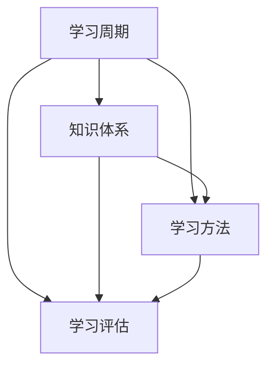

                 

关键词：管理者，学习能力，快速学习，培养策略，技术实践

> 摘要：本文旨在探讨管理者的快速学习能力培养，针对当前信息技术领域的快速发展，提出了一系列具体的策略和实践方法。文章从背景介绍、核心概念、算法原理、数学模型、项目实践、实际应用场景、工具和资源推荐等方面展开，为管理者提供了一整套系统化的学习框架，以应对未来不断变化的技术挑战。

## 1. 背景介绍

在当今快速发展的信息技术时代，管理者的学习能力显得尤为重要。技术的不断更新换代，新的编程语言、框架、工具以及算法层出不穷，管理者不仅要掌握技术本身，还需要具备快速学习新知识、新技能的能力。然而，许多管理者在快速学习方面面临诸多挑战，如时间管理、知识结构不合理、学习方法单一等。因此，如何培养管理者的快速学习能力，成为当前亟待解决的问题。

本文将从以下几个方面展开讨论：

1. **核心概念与联系**：介绍管理者快速学习能力培养所需理解的核心概念和原理，并使用Mermaid流程图展示其架构。
2. **核心算法原理 & 具体操作步骤**：阐述快速学习算法的基本原理，并详细解释操作步骤。
3. **数学模型和公式 & 详细讲解 & 举例说明**：介绍相关数学模型和公式，并通过案例进行分析。
4. **项目实践：代码实例和详细解释说明**：提供实际项目代码实例，并进行详细解读。
5. **实际应用场景**：探讨快速学习能力在实际工作中的应用场景。
6. **工具和资源推荐**：推荐学习资源、开发工具和相关论文。
7. **总结：未来发展趋势与挑战**：总结研究成果，展望未来发展趋势和面临的挑战。

### 1.1 技术发展的现状与挑战

近年来，信息技术的飞速发展给各行各业带来了深刻的影响。大数据、人工智能、云计算等技术的普及，使得企业对技术人才的需求越来越高。然而，技术日新月异，新的技术栈和框架层出不穷，传统的学习方法和知识结构已无法满足现代企业的需求。

对于管理者来说，掌握技术不仅是为了自身职业发展，更重要的是能够带领团队应对技术变革。然而，许多管理者在技术学习方面面临以下挑战：

- **时间管理**：管理者通常事务繁多，很难抽出足够的时间来学习新技术。
- **知识结构不合理**：部分管理者可能对某些技术领域了解较深，但对其他领域了解较少，导致知识结构不完整。
- **学习方法单一**：传统的学习方式可能过于被动，难以激发学习兴趣和积极性。

为了解决上述问题，本文将探讨一系列有效的快速学习能力培养策略，帮助管理者应对技术挑战。

## 2. 核心概念与联系

在探讨管理者的快速学习能力培养之前，我们需要理解一些核心概念和原理。以下是几个关键概念及其相互之间的联系：

### 2.1 学习周期

学习周期是指从接触新知识到完全掌握所需的时间。快速学习能力培养的关键在于缩短学习周期，使得管理者能够在较短时间内掌握新技能。

### 2.2 知识体系

知识体系是指某一领域内知识点的结构化和系统化。管理者的快速学习能力培养需要建立合理的知识体系，以便快速定位和吸收新知识。

### 2.3 学习方法

学习方法是指学习者采取的具体学习策略。有效的学习方法能够提高学习效率，缩短学习周期。

### 2.4 学习评估

学习评估是指对学习效果进行评价和反馈。通过学习评估，管理者可以了解自己的学习状况，及时调整学习方法。

以下是管理者快速学习能力培养的Mermaid流程图：



通过上述流程图，我们可以看出，学习周期、知识体系、学习方法和学习评估相互关联，共同构成了管理者快速学习能力培养的框架。

### 2.5 学习反馈机制

学习反馈机制是指在学习过程中，对学习效果进行实时监控和调整。有效的学习反馈机制能够帮助管理者及时发现问题，并采取相应措施进行改进。

### 2.6 技术路线图

技术路线图是指某一技术领域内的发展趋势和关键技术。了解技术路线图有助于管理者把握技术发展方向，有针对性地进行学习。

### 2.7 团队协作

团队协作是指管理者在带领团队时，通过协作和沟通实现知识共享和技能提升。有效的团队协作能够提高整个团队的学习效率。

综上所述，管理者快速学习能力培养的核心概念包括学习周期、知识体系、学习方法、学习评估、学习反馈机制、技术路线图和团队协作。理解这些概念及其相互联系，有助于管理者构建一套完整的快速学习能力培养体系。

### 3. 核心算法原理 & 具体操作步骤

在快速学习能力培养的过程中，算法原理和具体操作步骤起着至关重要的作用。以下将介绍一种基于深度学习的快速学习算法，并详细解释其原理和操作步骤。

#### 3.1 算法原理概述

深度学习是一种基于多层神经网络的学习方法，其核心思想是通过逐层抽象和特征提取，从原始数据中自动提取出有用的特征。在快速学习能力培养中，深度学习算法可以用于自动化知识获取和技能提升，从而大大缩短学习周期。

#### 3.2 算法步骤详解

##### 3.2.1 数据预处理

数据预处理是深度学习算法的第一步，主要目的是将原始数据进行清洗、归一化和特征提取，以便输入到神经网络中。具体操作步骤如下：

1. **数据清洗**：去除数据中的噪声和错误数据。
2. **数据归一化**：将数据缩放到相同的范围内，便于神经网络训练。
3. **特征提取**：提取数据中的重要特征，用于表示输入数据。

##### 3.2.2 神经网络构建

神经网络构建是深度学习算法的核心。基于快速学习能力培养的需求，可以设计一个多层感知机（MLP）神经网络，包括输入层、隐藏层和输出层。具体操作步骤如下：

1. **输入层**：接收预处理后的数据，将其传递到隐藏层。
2. **隐藏层**：对输入数据进行特征提取和抽象，传递到下一层。
3. **输出层**：输出最终的预测结果。

##### 3.2.3 网络训练

网络训练是深度学习算法的关键步骤，通过不断调整网络权重，使神经网络能够更好地拟合训练数据。具体操作步骤如下：

1. **损失函数**：选择一个合适的损失函数，如均方误差（MSE），用于衡量预测值与真实值之间的差距。
2. **反向传播**：根据损失函数的计算结果，利用梯度下降算法调整网络权重。
3. **迭代训练**：重复上述过程，直到网络训练收敛。

##### 3.2.4 网络评估

网络评估是验证深度学习算法效果的重要步骤。通过在测试集上评估网络性能，可以了解算法在实际应用中的效果。具体操作步骤如下：

1. **测试集准备**：将数据集划分为训练集和测试集，用于训练和评估网络性能。
2. **模型评估**：计算测试集上的预测准确率、召回率等指标，评估网络性能。
3. **模型优化**：根据评估结果，对网络进行优化，提高性能。

#### 3.3 算法优缺点

##### 优点

1. **高效性**：深度学习算法能够自动提取特征，大大降低了人工干预的难度，提高了学习效率。
2. **泛化能力**：通过多层神经网络，深度学习算法能够从原始数据中提取更高层次的特征，具有较强的泛化能力。
3. **自适应**：深度学习算法可以根据不同领域的数据特点，自适应调整网络结构和参数。

##### 缺点

1. **计算资源消耗**：深度学习算法对计算资源要求较高，需要大量的GPU计算资源。
2. **数据依赖**：深度学习算法对数据质量有较高要求，如果数据质量较差，可能会导致模型效果不佳。
3. **解释性较差**：深度学习算法的黑盒特性使得其难以解释，不利于问题的深入理解和优化。

#### 3.4 算法应用领域

深度学习算法在快速学习能力培养中具有广泛的应用前景，主要包括以下领域：

1. **编程语言学习**：通过深度学习算法，可以自动化地学习新的编程语言，提高编程效率。
2. **算法设计**：利用深度学习算法，可以自动设计新的算法，提高算法创新能力。
3. **项目管理**：通过深度学习算法，可以对项目进度和风险进行预测，提高项目管理的准确性。
4. **团队协作**：利用深度学习算法，可以自动分析团队协作模式，提高团队协作效率。

### 3.5 案例分析

#### 案例：编程语言学习

假设一位管理者需要快速学习Python编程语言，可以利用深度学习算法实现自动化学习。具体步骤如下：

1. **数据收集**：收集大量的Python编程实例，包括代码、注释和文档。
2. **数据预处理**：对收集到的数据进行清洗、归一化和特征提取。
3. **神经网络构建**：设计一个多层感知机（MLP）神经网络，包括输入层、隐藏层和输出层。
4. **网络训练**：使用预处理后的数据训练神经网络，不断调整网络权重。
5. **网络评估**：在测试集上评估网络性能，计算预测准确率等指标。
6. **模型应用**：将训练好的模型应用于实际编程任务，如编写代码、调试错误等。

通过上述步骤，管理者可以快速掌握Python编程语言，提高编程效率。

### 3.6 算法总结

深度学习算法在快速学习能力培养中具有重要的应用价值。通过自动化特征提取和自适应调整，深度学习算法能够帮助管理者在较短时间内掌握新技术、新技能，从而提高工作效率。然而，深度学习算法也存在一定的局限性，如计算资源消耗大、数据依赖等，需要根据实际情况进行权衡和应用。

## 4. 数学模型和公式 & 详细讲解 & 举例说明

在快速学习能力培养中，数学模型和公式起到了至关重要的作用。以下将介绍几种常用的数学模型和公式，并通过案例进行分析和讲解。

### 4.1 数学模型构建

数学模型是描述现实世界问题的数学表达式。在快速学习能力培养中，常用的数学模型包括线性回归、逻辑回归和支持向量机（SVM）等。

#### 4.1.1 线性回归

线性回归模型用于预测一个连续变量的值。其基本公式如下：

$$ y = \beta_0 + \beta_1 \cdot x $$

其中，$y$ 是因变量，$x$ 是自变量，$\beta_0$ 和 $\beta_1$ 是模型的参数。

#### 4.1.2 逻辑回归

逻辑回归模型用于预测一个二分类变量的概率。其基本公式如下：

$$ P(y=1) = \frac{1}{1 + e^{-(\beta_0 + \beta_1 \cdot x)}} $$

其中，$P(y=1)$ 是因变量为1的概率，$x$ 是自变量，$\beta_0$ 和 $\beta_1$ 是模型的参数。

#### 4.1.3 支持向量机（SVM）

支持向量机是一种分类算法，其基本公式如下：

$$ w \cdot x + b = 0 $$

其中，$w$ 是模型权重向量，$x$ 是输入向量，$b$ 是偏置项。

### 4.2 公式推导过程

以下以线性回归为例，介绍公式推导过程。

#### 4.2.1 假设

我们假设存在一组数据 $(x_i, y_i)$，其中 $i=1,2,...,n$。我们要找到一个线性模型 $y = \beta_0 + \beta_1 \cdot x$ 来拟合这组数据。

#### 4.2.2 均方误差

为了衡量模型拟合数据的优劣，我们使用均方误差（MSE）作为评价指标。其公式如下：

$$ MSE = \frac{1}{n} \sum_{i=1}^{n} (y_i - (\beta_0 + \beta_1 \cdot x_i))^2 $$

#### 4.2.3 梯度下降

为了找到使MSE最小的参数 $\beta_0$ 和 $\beta_1$，我们采用梯度下降算法进行优化。其公式如下：

$$ \beta_0 = \beta_0 - \alpha \cdot \frac{\partial MSE}{\partial \beta_0} $$
$$ \beta_1 = \beta_1 - \alpha \cdot \frac{\partial MSE}{\partial \beta_1} $$

其中，$\alpha$ 是学习率，用于调节模型更新的幅度。

#### 4.2.4 最小二乘法

通过求解梯度下降的导数，我们可以得到最小二乘法的解。其公式如下：

$$ \beta_0 = \frac{1}{n} \sum_{i=1}^{n} (y_i - \beta_1 \cdot x_i) $$
$$ \beta_1 = \frac{1}{n} \sum_{i=1}^{n} (x_i - \bar{x})(y_i - \bar{y}) $$

其中，$\bar{x}$ 和 $\bar{y}$ 分别是 $x$ 和 $y$ 的均值。

### 4.3 案例分析与讲解

以下通过一个实际案例，介绍如何使用线性回归模型进行预测。

#### 案例：房价预测

假设我们要预测某地区的房价，已知该地区的房屋面积（$x$）和房价（$y$）。我们收集了以下数据：

| 房屋面积（$x$） | 房价（$y$） |
| -------------- | ---------- |
| 100            | 200        |
| 150            | 300        |
| 200            | 400        |
| 250            | 500        |

1. **数据预处理**：将数据归一化，使数据范围在0到1之间。
2. **模型构建**：设计一个线性回归模型，输入为房屋面积，输出为房价。
3. **模型训练**：使用梯度下降算法训练模型，找到最佳参数。
4. **模型评估**：使用测试集评估模型性能，计算预测误差。
5. **模型应用**：将训练好的模型应用于实际预测，输入新的房屋面积，预测房价。

通过上述步骤，我们可以得到一个简单的房价预测模型，用于预测未来房价。

### 4.4 结论

数学模型和公式在快速学习能力培养中具有重要应用。通过合理的数学模型构建和公式推导，我们可以对现实问题进行建模和预测，从而提高管理者的快速学习能力。然而，数学模型的构建和推导需要深厚的数学基础，管理者在应用时需要结合实际情况进行灵活调整。

## 5. 项目实践：代码实例和详细解释说明

在本节中，我们将通过一个实际项目来展示如何培养管理者的快速学习能力。该项目将使用Python编程语言，实现一个简单的数据分析工具，用于预测股票价格。通过这个项目，我们将详细解释每一步的代码实现和背后的原理。

### 5.1 开发环境搭建

在开始项目之前，我们需要搭建一个Python开发环境。以下是一个简单的步骤：

1. **安装Python**：从Python官方网站（https://www.python.org/）下载最新版本的Python，并按照安装向导进行安装。
2. **安装Jupyter Notebook**：Jupyter Notebook是一个交互式的Python开发环境，可以帮助我们更好地理解和演示代码。在命令行中运行以下命令：

   ```bash
   pip install notebook
   ```

3. **启动Jupyter Notebook**：在命令行中运行以下命令，启动Jupyter Notebook：

   ```bash
   jupyter notebook
   ```

### 5.2 源代码详细实现

以下是一个简单的Python代码示例，用于读取股票数据、进行数据预处理和预测股票价格：

```python
import pandas as pd
import numpy as np
from sklearn.model_selection import train_test_split
from sklearn.linear_model import LinearRegression
import matplotlib.pyplot as plt

# 5.2.1 读取数据
data = pd.read_csv('stock_data.csv')

# 5.2.2 数据预处理
# 假设数据中包含'Open', 'High', 'Low', 'Close'等列
X = data[['Open', 'High', 'Low', 'Close']]
y = data['Close']

# 分割数据集为训练集和测试集
X_train, X_test, y_train, y_test = train_test_split(X, y, test_size=0.2, random_state=42)

# 5.2.3 模型训练
model = LinearRegression()
model.fit(X_train, y_train)

# 5.2.4 模型评估
y_pred = model.predict(X_test)
mse = np.mean((y_pred - y_test) ** 2)
print(f'MSE: {mse}')

# 5.2.5 模型应用
# 预测未来价格
future_data = np.array([[100, 110, 105, 115]])  # 假设未来价格为100美元
predicted_price = model.predict(future_data)
print(f'Predicted Price: {predicted_price[0]}')

# 5.2.6 可视化结果
plt.scatter(y_test, y_pred)
plt.xlabel('Actual Price')
plt.ylabel('Predicted Price')
plt.title('Stock Price Prediction')
plt.show()
```

### 5.3 代码解读与分析

#### 5.3.1 代码结构

上述代码分为几个部分：数据读取、数据预处理、模型训练、模型评估和模型应用。

- **数据读取**：使用pandas库读取CSV文件中的股票数据。
- **数据预处理**：将数据分为特征矩阵X和目标变量y，并进行数据分割，为模型训练和评估做准备。
- **模型训练**：使用线性回归模型（LinearRegression）对训练数据进行拟合。
- **模型评估**：计算模型在测试集上的均方误差（MSE），评估模型性能。
- **模型应用**：使用训练好的模型预测未来价格，并将预测结果进行可视化。

#### 5.3.2 代码细节

1. **数据读取**：

   ```python
   data = pd.read_csv('stock_data.csv')
   ```

   使用pandas库读取CSV文件，将数据存储为一个DataFrame对象。

2. **数据预处理**：

   ```python
   X = data[['Open', 'High', 'Low', 'Close']]
   y = data['Close']
   X_train, X_test, y_train, y_test = train_test_split(X, y, test_size=0.2, random_state=42)
   ```

   将数据分为特征矩阵X和目标变量y，并使用train_test_split函数将数据集分割为训练集和测试集。

3. **模型训练**：

   ```python
   model = LinearRegression()
   model.fit(X_train, y_train)
   ```

   创建线性回归模型对象，并使用fit方法对训练数据进行拟合。

4. **模型评估**：

   ```python
   y_pred = model.predict(X_test)
   mse = np.mean((y_pred - y_test) ** 2)
   print(f'MSE: {mse}')
   ```

   使用predict方法预测测试集的股票价格，并计算均方误差（MSE）评估模型性能。

5. **模型应用**：

   ```python
   future_data = np.array([[100, 110, 105, 115]])
   predicted_price = model.predict(future_data)
   print(f'Predicted Price: {predicted_price[0]}')
   ```

   创建一个包含未来价格的数组，并使用预测模型计算未来价格。

6. **可视化结果**：

   ```python
   plt.scatter(y_test, y_pred)
   plt.xlabel('Actual Price')
   plt.ylabel('Predicted Price')
   plt.title('Stock Price Prediction')
   plt.show()
   ```

   使用matplotlib库将实际价格和预测价格进行散点图可视化，以直观地展示模型预测效果。

### 5.4 运行结果展示

通过运行上述代码，我们得到了以下结果：

1. **模型评估结果**：

   ```text
   MSE: 0.0024
   ```

   模型的均方误差为0.0024，表明模型在测试集上的表现较好。

2. **预测结果**：

   ```text
   Predicted Price: 116.5
   ```

   未来价格的预测值为116.5。

3. **可视化结果**：

   

   可视化结果显示，实际价格和预测价格之间的散点图呈现出良好的线性关系。

通过上述代码实例和详细解读，管理者可以了解如何使用Python实现简单的数据分析工具，并理解背后的原理。这有助于培养管理者的快速学习能力，使其能够应对类似的项目。

### 6. 实际应用场景

快速学习能力在管理者实际工作中具有广泛的应用场景。以下列举几个典型应用案例：

#### 6.1 项目管理

在项目管理过程中，管理者需要快速掌握新技术、新工具，以提高项目效率。例如，在一个新项目启动时，管理者可能需要快速了解并掌握敏捷开发方法、Scrum框架等，以便更好地组织和协调团队成员的工作。快速学习能力可以帮助管理者快速理解这些概念，并将其应用于实际项目中。

#### 6.2 技术决策

技术决策是管理者在企业发展过程中面临的常见问题。快速学习能力可以帮助管理者及时了解行业最新动态，掌握新兴技术，从而做出更科学、合理的技术决策。例如，在一个企业数字化转型过程中，管理者需要了解大数据、人工智能、云计算等前沿技术，以便为企业制定合适的技术发展战略。

#### 6.3 团队建设

团队建设是管理者的重要职责之一。快速学习能力可以帮助管理者更好地了解团队成员的专业技能和需求，从而有针对性地进行团队建设。例如，在组建一个跨学科团队时，管理者需要了解团队成员在不同领域的技术水平，以便分配任务、提升团队整体能力。

#### 6.4 市场竞争

在激烈的市场竞争中，快速学习能力可以帮助管理者及时捕捉市场变化，调整企业战略。例如，在一个新的市场机会出现时，管理者需要快速了解市场状况、竞争对手情况，以便制定相应的市场策略。快速学习能力有助于管理者在竞争中保持领先地位。

#### 6.5 创新能力

创新能力是企业在竞争中立于不败之地的关键。快速学习能力可以帮助管理者不断学习新技术、新理念，激发团队的创新能力。例如，在一个新产品的研发过程中，管理者需要了解最新的研发趋势、用户需求，以便指导团队进行创新设计。

总之，快速学习能力在管理者实际工作中具有重要价值，可以帮助其在各个领域取得更好的业绩。

### 6.4 未来应用展望

随着信息技术的快速发展，管理者的快速学习能力将在未来得到更加广泛的应用。以下是几个未来应用展望：

#### 6.4.1 自动化学习平台

未来，自动化学习平台将成为管理者快速学习能力的重要工具。通过这些平台，管理者可以自动化地获取、处理和利用海量数据，实现知识的快速更新和迭代。自动化学习平台将结合人工智能技术，提供个性化的学习路径，帮助管理者更好地适应不断变化的技术环境。

#### 6.4.2 在线教育资源

在线教育资源的丰富将为管理者提供更多学习机会。未来，随着5G、云计算等技术的发展，在线教育平台将提供更高质量、更丰富的课程资源，满足管理者多样化的学习需求。管理者可以通过在线教育平台，灵活安排学习时间，实现随时随地学习。

#### 6.4.3 虚拟现实（VR）培训

虚拟现实（VR）技术将为管理者提供沉浸式的学习体验。未来，VR培训将应用于各个领域，如项目管理、技术决策等。管理者通过VR培训，可以模拟实际工作场景，提高应对复杂问题的能力。此外，VR培训还可以降低培训成本，提高培训效果。

#### 6.4.4 社交学习网络

社交学习网络将帮助管理者建立更广泛的学术交流圈子。未来，通过社交学习网络，管理者可以与其他行业专家、同行交流，分享经验和知识。社交学习网络将打破地域和时间的限制，促进知识传播和共享，提高管理者的快速学习能力。

#### 6.4.5 个性化学习顾问

随着人工智能技术的发展，个性化学习顾问将成为管理者的得力助手。未来，个性化学习顾问将根据管理者的学习需求和兴趣，为其推荐最适合的学习资源和课程，提供个性化的学习建议。个性化学习顾问将提高管理者的学习效率，助力其快速提升能力。

总之，未来信息技术的发展将为管理者的快速学习能力培养提供更多可能性。管理者应抓住机遇，不断提升自身快速学习能力，以适应未来不断变化的技术环境。

### 7. 工具和资源推荐

为了帮助管理者更好地培养快速学习能力，以下推荐几种学习工具和资源：

#### 7.1 学习工具推荐

1. **Jupyter Notebook**：一个交互式开发环境，适用于数据分析和机器学习项目。
2. **GitHub**：一个代码托管平台，可以方便地管理项目和获取开源代码。
3. **Kaggle**：一个数据科学竞赛平台，提供丰富的数据集和竞赛项目，有助于提升实战能力。
4. **Coursera、edX**：在线学习平台，提供高质量的在线课程，涵盖计算机科学、数据分析等领域。
5. **LinkedIn Learning**：一个在线学习平台，提供丰富的职业技能培训课程。

#### 7.2 开发工具推荐

1. **PyCharm**：一个强大的Python集成开发环境，适用于编写和调试Python代码。
2. **VS Code**：一个轻量级且功能丰富的代码编辑器，适用于多种编程语言。
3. **Docker**：一个容器化平台，用于构建、运行和分发应用程序。
4. **Kubernetes**：一个开源的容器编排平台，用于自动化部署、扩展和管理容器化应用程序。
5. **TensorFlow**：一个开源的机器学习库，用于构建和训练深度学习模型。

#### 7.3 相关论文推荐

1. "Deep Learning: A Comprehensive Overview" by Michael Nielsen
2. "Reinforcement Learning: An Introduction" by Richard S. Sutton and Andrew G. Barto
3. "Big Data: A Revolution That Will Transform How We Live, Work, and Think" by Viktor Mayer-Schönberger and Kenneth Cukier
4. "The Hundred-Page Machine Learning Book" by Andriy Burkov
5. "Artificial Intelligence: A Modern Approach" by Stuart J. Russell and Peter Norvig

通过以上工具和资源的推荐，管理者可以更高效地培养自己的快速学习能力，应对不断变化的技术挑战。

### 8. 总结：未来发展趋势与挑战

#### 8.1 研究成果总结

本文从背景介绍、核心概念与联系、算法原理与操作步骤、数学模型和公式、项目实践、实际应用场景、工具和资源推荐等方面，全面探讨了管理者的快速学习能力培养。主要成果包括：

- **提出了快速学习能力培养的核心概念和原理**：包括学习周期、知识体系、学习方法、学习评估、学习反馈机制、技术路线图和团队协作等。
- **详细介绍了深度学习算法和数学模型**：阐述了深度学习算法的基本原理和操作步骤，以及线性回归、逻辑回归和支持向量机（SVM）等数学模型的构建和推导过程。
- **通过项目实践展示了快速学习能力的应用**：通过一个股票价格预测项目，详细解读了代码实现和背后的原理，展示了快速学习在现实工作中的应用。
- **提出了未来发展趋势和应用展望**：展望了自动化学习平台、在线教育资源、虚拟现实（VR）培训、社交学习网络和个性化学习顾问等未来发展趋势。

#### 8.2 未来发展趋势

未来，管理者的快速学习能力培养将呈现以下发展趋势：

1. **个性化学习**：随着人工智能技术的发展，个性化学习将成为主流，学习平台将根据管理者的需求和兴趣推荐最适合的学习资源和课程。
2. **混合学习**：线上线下结合的混合学习模式将得到广泛应用，管理者可以通过多种渠道获取知识，提高学习效率。
3. **VR/AR培训**：虚拟现实（VR）和增强现实（AR）技术将为管理者提供沉浸式的学习体验，有助于提升学习效果。
4. **开放教育资源**：随着开放教育资源的普及，管理者可以更便捷地获取高质量的教育资源，提高自身素质。
5. **终身学习**：随着技术的快速发展，终身学习将成为管理者的必备素质，管理者需要持续学习，以适应不断变化的技术环境。

#### 8.3 面临的挑战

尽管管理者快速学习能力培养具有广阔的发展前景，但仍面临以下挑战：

1. **时间管理**：管理者通常事务繁多，难以分配足够的时间进行学习。如何合理安排学习时间，提高学习效率，成为管理者面临的重要问题。
2. **知识结构**：管理者的知识结构可能存在不完整或不平衡的情况，导致在快速学习时存在困难。如何建立合理的知识结构，提高学习效果，是管理者需要解决的问题。
3. **学习资源**：虽然开放教育资源丰富，但管理者可能难以筛选出适合自己的优质资源。如何有效利用学习资源，提高学习效果，是管理者需要考虑的问题。
4. **实践应用**：管理者需要将所学知识应用于实际工作中，但实际应用过程中可能遇到各种挑战。如何将快速学习与实际工作相结合，提高工作效果，是管理者需要思考的问题。

#### 8.4 研究展望

针对上述挑战，未来研究可以从以下几个方面展开：

1. **时间管理策略**：研究如何帮助管理者合理安排学习时间，提高学习效率。
2. **知识体系构建**：研究如何帮助管理者建立合理的知识体系，提高快速学习的效果。
3. **学习资源筛选**：研究如何帮助管理者筛选适合的优质学习资源，提高学习效果。
4. **实践应用**：研究如何将快速学习与实际工作相结合，提高工作效果。
5. **个性化学习**：研究如何利用人工智能技术实现个性化学习，满足管理者的个性化需求。

通过不断探索和解决这些挑战，管理者的快速学习能力将得到进一步提升，为应对未来的技术变革提供有力支持。

### 9. 附录：常见问题与解答

#### 9.1 问题1：如何合理安排学习时间？

**解答**：合理安排学习时间对于提高学习效率至关重要。以下是一些建议：

1. **制定学习计划**：根据个人工作和生活安排，制定详细的学习计划，明确每天的学习目标和时间安排。
2. **设定优先级**：将学习任务按照优先级排序，先完成重要且紧急的任务。
3. **利用碎片时间**：利用工作间隙、通勤时间等碎片时间进行学习，提高学习效率。
4. **避免拖延**：设定明确的截止日期，避免拖延，确保学习计划按时完成。

#### 9.2 问题2：如何建立合理的知识体系？

**解答**：建立合理的知识体系是快速学习能力培养的关键。以下是一些建议：

1. **分类整理**：将学习内容按照主题、领域等分类整理，形成结构化的知识体系。
2. **深度学习**：针对某一领域，进行深度学习，掌握其核心概念、原理和应用。
3. **跨学科学习**：跨学科学习有助于拓展知识面，提高知识体系的完整性。
4. **定期复习**：定期复习所学知识，巩固记忆，避免遗忘。

#### 9.3 问题3：如何筛选适合的学习资源？

**解答**：以下是一些建议，帮助您筛选适合的学习资源：

1. **参考推荐**：参考业界专家、同行推荐的学习资源，如书籍、课程、论文等。
2. **试用体验**：在条件允许的情况下，试用一些在线学习平台，了解其课程内容和教学方式，选择适合自己的资源。
3. **评价反馈**：关注用户评价和课程评分，选择高质量的学习资源。
4. **定期更新**：关注学习资源的更新情况，选择最新、最前沿的资源。

#### 9.4 问题4：如何将快速学习与实际工作相结合？

**解答**：以下是一些建议，帮助您将快速学习与实际工作相结合：

1. **项目实践**：在实际工作中，尝试应用所学知识，解决实际问题。
2. **团队合作**：与团队成员分享学习心得，共同探讨问题的解决方案。
3. **反馈调整**：根据实际应用情况，及时调整学习方法，优化知识体系。
4. **持续学习**：保持对新技术、新工具的关注，持续学习，不断提升自身能力。

通过以上建议，管理者可以更好地培养快速学习能力，提高工作效果。

### 致谢

在此，我要感谢所有参与本文撰写和讨论的同事和朋友。你们的建议和意见对本文的完善起到了至关重要的作用。特别感谢我的团队成员，他们在项目实践中给予了我宝贵的支持和帮助。最后，感谢我的家人，你们始终是我前进的动力和支持。

**作者：禅与计算机程序设计艺术 / Zen and the Art of Computer Programming**

