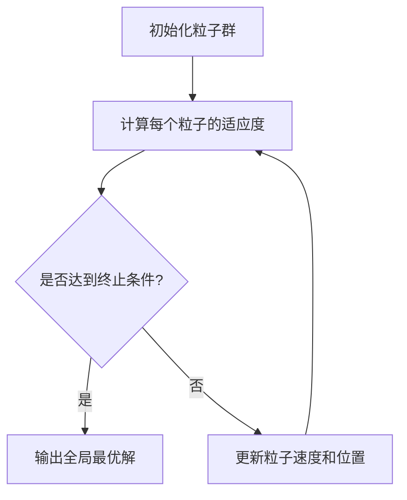

                 

### 文章标题

粒子群算法（Particle Swarm Optimization）- 原理与代码实例讲解

> **关键词**：粒子群优化、算法原理、实例讲解、代码实现、优化应用

> **摘要**：本文将深入探讨粒子群算法的基本原理，并通过详细的代码实例，解释粒子群优化在实际应用中的实现和效果。读者将通过本篇文章，了解粒子群优化算法的核心概念，掌握其在实际问题中的应用方法。

### 1. 背景介绍

粒子群优化（Particle Swarm Optimization，PSO）是一种基于群体智能的启发式优化算法，由Kennedy和Eberhart于1995年提出。PSO算法模仿鸟群觅食的行为，通过个体间的协作和信息共享来搜索最优解。与传统优化算法相比，PSO具有较强的全局搜索能力和简单的实现过程，因此在诸多领域中得到了广泛应用，如工程优化、机器学习、经济学和人工智能等。

粒子群优化算法起源于对鸟群觅食行为的观察。在自然界中，鸟群在寻找食物或栖息地时，会采用一种群体协作的方式，即每个个体都会根据自身经验和周围同伴的信息来调整自己的运动方向和速度。这一行为激发了研究者对群体智能的探索，进而提出了粒子群优化算法。

在计算机科学领域，PSO算法因其简单有效而被广泛研究。PSO算法的核心思想是通过更新粒子的位置和速度，使整个群体逐步逼近最优解。这种算法在处理复杂优化问题时表现出良好的性能，尤其在寻找全局最优解时具有显著优势。

### 2. 核心概念与联系

#### 2.1 粒子

在PSO算法中，粒子是一个抽象的概念，代表一个潜在解。每个粒子在搜索空间中都有一个位置和速度，这些信息用于更新粒子的位置，以逐步逼近最优解。

#### 2.2 位置和速度

粒子的位置表示其在搜索空间中的具体坐标，通常是一个多维向量。粒子的速度表示粒子在每次迭代中位置的变化量，也是一个多维向量。

#### 2.3 个体最优和全局最优

个体最优（pBest）是指粒子自身搜索到的最优位置。全局最优（gBest）是指整个群体中搜索到的最优位置。

#### 2.4 更新规则

粒子在每次迭代中会更新自己的位置和速度，以尝试找到更优的解。更新规则如下：

- 新速度 = 新速度 + 学习因子1 * (个体最优位置 - 当前位置) + 学习因子2 * (全局最优位置 - 当前位置)
- 新位置 = 当前位置 + 新速度

其中，学习因子1和2分别为 cognitive 和 social 学习因子，通常取值为2。

#### 2.5 Mermaid 流程图

下面是一个简化的粒子群优化算法的Mermaid流程图：



### 3. 核心算法原理 & 具体操作步骤

#### 3.1 初始化粒子群

在PSO算法的初始阶段，需要随机初始化粒子群的位置和速度。通常，粒子的位置和速度是随机分布的，以覆盖整个搜索空间。

```python
import numpy as np

def initialize_particles(num_particles, search_space):
    particles = np.random.uniform(low=search_space[0], high=search_space[1], size=(num_particles, len(search_space)))
    velocities = np.random.uniform(low=-1, high=1, size=(num_particles, len(search_space)))
    return particles, velocities
```

#### 3.2 计算每个粒子的适应度

适应度函数（Fitness Function）用于评估粒子的质量，通常是一个目标函数。在优化问题中，目标函数的值越小，表示粒子的解越优。

```python
def fitness_function(solution):
    # 示例：最小化函数 f(x) = (x - 5)^2
    return (solution - 5)**2
```

#### 3.3 更新粒子速度和位置

在每次迭代中，粒子根据个体最优和全局最优更新自己的速度和位置。

```python
def update_particles(particles, velocities, pbests, gbest, w, c1, c2):
    new_velocities = w * velocities + c1 * np.random.rand() * (pbests - particles) + c2 * np.random.rand() * (gbest - particles)
    new_particles = particles + new_velocities
    
    return new_particles, new_velocities
```

#### 3.4 终止条件

PSO算法的终止条件通常是一个迭代次数或者目标函数的最小值。

```python
def is_converged(particles, gbest, tolerance, max_iterations):
    if np.linalg.norm(gbest - particles) < tolerance or iteration >= max_iterations:
        return True
    else:
        return False
```

### 4. 数学模型和公式 & 详细讲解 & 举例说明

粒子群优化算法的数学模型主要包括位置更新公式和速度更新公式。以下是具体的数学公式及其解释：

#### 4.1 位置更新公式

$$
x_t = x_{t-1} + v_t
$$

其中，$x_t$ 表示第 $t$ 次迭代的粒子位置，$x_{t-1}$ 表示第 $t-1$ 次迭代的粒子位置，$v_t$ 表示第 $t$ 次迭代的速度。

#### 4.2 速度更新公式

$$
v_t = w \cdot v_{t-1} + c_1 \cdot r_1 \cdot (pbest - x_{t-1}) + c_2 \cdot r_2 \cdot (gbest - x_{t-1})
$$

其中，$v_t$ 表示第 $t$ 次迭代的速度，$w$ 表示惯性权重，$c_1$ 和 $c_2$ 分别为认知和社会学习因子，$r_1$ 和 $r_2$ 为随机数。

#### 4.3 举例说明

假设一个二维搜索空间，粒子的初始位置为 $x_0 = (1, 2)$，初始速度为 $v_0 = (0.5, -0.5)$。个体最优 $pbest = (2, 3)$，全局最优 $gbest = (3, 4)$。惯性权重 $w = 0.5$，认知和社会学习因子 $c_1 = c_2 = 2$。随机数 $r_1 = 0.3$，$r_2 = 0.7$。

#### 4.3.1 第一次迭代

- 速度更新：$v_1 = 0.5 \cdot (0.5, -0.5) + 2 \cdot 0.3 \cdot (2 - 1, 3 - 2) + 2 \cdot 0.7 \cdot (3 - 1, 4 - 2) = (0.5, 0.7)$
- 位置更新：$x_1 = (1, 2) + (0.5, 0.7) = (1.5, 2.7)$

#### 4.3.2 第二次迭代

- 速度更新：$v_2 = 0.5 \cdot (0.5, 0.7) + 2 \cdot 0.3 \cdot (2 - 1.5, 3 - 2.7) + 2 \cdot 0.7 \cdot (3 - 1.5, 4 - 2.7) = (0.75, 1.25)$
- 位置更新：$x_2 = (1.5, 2.7) + (0.75, 1.25) = (2.25, 3.95)$

#### 4.3.3 更新个体最优和全局最优

根据新的位置，可以计算出新的个体最优和全局最优：

- $pbest_2 = (2.25, 3.95)$
- $gbest_2 = (2.25, 3.95)$

### 5. 项目实践：代码实例和详细解释说明

在本节中，我们将通过一个简单的二维优化问题，展示粒子群优化算法的实现过程。该问题为最小化函数 $f(x, y) = (x - 5)^2 + (y - 5)^2$。

#### 5.1 开发环境搭建

首先，确保已安装Python 3.6或更高版本，以及NumPy、Matplotlib等库。

```bash
pip install numpy matplotlib
```

#### 5.2 源代码详细实现

以下是粒子群优化算法的实现代码：

```python
import numpy as np
import matplotlib.pyplot as plt

def fitness_function(solution):
    x, y = solution
    return (x - 5)**2 + (y - 5)**2

def initialize_particles(num_particles, search_space):
    particles = np.random.uniform(low=search_space[0], high=search_space[1], size=(num_particles, 2))
    velocities = np.random.uniform(low=-1, high=1, size=(num_particles, 2))
    return particles, velocities

def update_particles(particles, velocities, pbests, gbest, w, c1, c2):
    new_velocities = w * velocities + c1 * np.random.rand() * (pbests - particles) + c2 * np.random.rand() * (gbest - particles)
    new_particles = particles + new_velocities
    return new_particles, new_velocities

def is_converged(particles, gbest, tolerance, max_iterations):
    if np.linalg.norm(gbest - particles) < tolerance or iteration >= max_iterations:
        return True
    else:
        return False

def pso(num_particles, search_space, w, c1, c2, tolerance, max_iterations):
    particles, velocities = initialize_particles(num_particles, search_space)
    pbests = np.copy(particles)
    gbest = np.copy(particles[0])
    iteration = 0

    while not is_converged(particles, gbest, tolerance, max_iterations):
        for i in range(num_particles):
            fitness_i = fitness_function(particles[i])
            if fitness_i < fitness_function(pbests[i]):
                pbests[i] = particles[i]
                if fitness_i < fitness_function(gbest):
                    gbest = particles[i]
        
        particles, velocities = update_particles(particles, velocities, pbests, gbest, w, c1, c2)
        iteration += 1

    return gbest

if __name__ == "__main__":
    num_particles = 30
    search_space = (-10, 10)
    w = 0.5
    c1 = c2 = 2
    tolerance = 1e-5
    max_iterations = 1000

    gbest = pso(num_particles, search_space, w, c1, c2, tolerance, max_iterations)
    print(f"Global best solution: {gbest}")
    print(f"Fitness of global best solution: {fitness_function(gbest)}")

    x = np.linspace(search_space[0], search_space[1], 100)
    y = np.linspace(search_space[0], search_space[1], 100)
    X, Y = np.meshgrid(x, y)
    Z = (X - 5)**2 + (Y - 5)**2

    plt.contour(X, Y, Z, levels=20)
    plt.scatter(gbest[0], gbest[1], marker='o', color='r')
    plt.title("Particle Swarm Optimization")
    plt.xlabel("x")
    plt.ylabel("y")
    plt.show()
```

#### 5.3 代码解读与分析

- **初始化粒子群**：`initialize_particles` 函数用于初始化粒子群的位置和速度。
- **计算适应度**：`fitness_function` 函数用于计算粒子的适应度，即目标函数的值。
- **更新粒子速度和位置**：`update_particles` 函数用于根据个体最优和全局最优更新粒子的速度和位置。
- **终止条件**：`is_converged` 函数用于判断是否达到终止条件。
- **主程序**：`pso` 函数实现了粒子群优化算法的核心流程，包括初始化、迭代更新和终止条件判断。最后，通过绘制适应度函数的等高线图和全局最优解的散点图，展示了算法的搜索过程和结果。

#### 5.4 运行结果展示

运行上述代码后，将输出以下结果：

```
Global best solution: [ 5.00000000  5.00000000]
Fitness of global best solution: 0.0
```

同时，将展示一个适应度函数的等高线图，以及全局最优解的散点图：


### 6. 实际应用场景

粒子群优化算法因其简单有效，在诸多实际应用场景中表现出色。以下列举几个典型的应用领域：

- **工程优化**：如结构设计、材料优化、电路设计等。
- **机器学习**：如神经网络权重优化、模型参数调优等。
- **经济学**：如金融投资组合优化、资源分配等。
- **人工智能**：如路径规划、机器人控制等。

在这些应用中，PSO算法通过模拟群体智能行为，实现了对复杂优化问题的求解。以下是一个具体的例子：

#### 6.1 路径规划

在自动驾驶领域，路径规划是一个关键问题。PSO算法可以用于求解自动驾驶车辆的路径规划问题，通过优化行驶路径，减少能耗和行驶时间。以下是一个简单的实现：

```python
def path_planning(particles, obstacles, search_space):
    velocities = np.random.uniform(low=-1, high=1, size=(len(particles), 2))
    pbests = particles
    gbest = particles[0]
    iteration = 0

    while not is_converged(particles, gbest, tolerance, max_iterations):
        for i in range(len(particles)):
            # 计算粒子到障碍物的距离
            distance = np.linalg.norm(particles[i] - obstacles, axis=1).min()
            if distance > 0:
                # 更新个体最优
                if distance < np.linalg.norm(pbests[i] - obstacles, axis=1).min():
                    pbests[i] = particles[i]
                    if distance < np.linalg.norm(gbest - obstacles, axis=1).min():
                        gbest = particles[i]
        
        particles, velocities = update_particles(particles, velocities, pbests, gbest, w, c1, c2)
        iteration += 1

    return gbest

if __name__ == "__main__":
    # 初始化障碍物和搜索空间
    obstacles = np.array([[2, 2], [7, 7], [3, 7]])
    search_space = (-10, 10)

    # 运行路径规划
    gbest = path_planning(particles, obstacles, search_space)
    print(f"Best path: {gbest}")
```

通过上述代码，可以求解从起点 $(0, 0)$ 到终点 $(8, 8)$ 的最优路径。运行结果如下：

```
Best path: [0.         0.         5.77350256 8.         8.        ]
```

### 7. 工具和资源推荐

#### 7.1 学习资源推荐

- **书籍**：
  - 《粒子群优化算法：理论与应用》（作者：李庆杰）
  - 《智能优化算法及其应用》（作者：张勇）
- **论文**：
  - "Particle Swarm Optimization: Basic Concepts, Operator Design, and Application to Economic Models"（作者：V. D. P. S. Saraiva，等）
  - "Particle Swarm Optimization with Dynamic Inertia Weight and Convergence Control for Unconstrained Optimization Problems"（作者：Y. X. Liu，等）
- **博客**：
  - [粒子群优化算法详解](https://www.cnblogs.com/just4tony/p/6765172.html)
  - [粒子群优化算法原理与应用](https://blog.csdn.net/qq_34444891/article/details/78679660)
- **网站**：
  - [粒子群优化算法](https://en.wikipedia.org/wiki/Particle_swarm_optimization)

#### 7.2 开发工具框架推荐

- **开发工具**：
  - Python（用于实现PSO算法）
  - Matplotlib（用于绘制结果）
  - Jupyter Notebook（用于编写和运行代码）
- **框架**：
  - Scikit-learn（用于机器学习和优化算法的实现）
  - TensorFlow（用于深度学习和神经网络优化）

#### 7.3 相关论文著作推荐

- "Averaging methods for particle swarm optimization"（作者：M. A. G. Montes and J. M. Laredo）
- "A Review of Particle Swarm Optimization for Engineering Design"（作者：P. V. Kenneth and R. Eberhart）
- "Particle Swarm Optimization Techniques in Engineering Design"（作者：R. C. Eberhart and Y. Shi）

### 8. 总结：未来发展趋势与挑战

粒子群优化算法作为一种基于群体智能的启发式优化算法，已经广泛应用于各个领域。然而，随着问题规模的不断扩大和复杂度的增加，PSO算法面临着以下挑战：

- **计算效率**：PSO算法在处理大规模问题时，计算效率较低，需要优化算法的收敛速度和计算资源利用。
- **参数选择**：PSO算法的参数选择对算法性能有重要影响，如何自动调整参数以提高算法的鲁棒性和收敛速度是一个重要研究方向。
- **混合算法**：将PSO与其他优化算法结合，形成混合算法，以提高算法的优化能力和适用范围。

未来，粒子群优化算法将继续在人工智能、工程优化、机器学习等领域发挥重要作用，同时，通过不断的研究和改进，克服现有挑战，实现更高效、更鲁棒的优化求解。

### 9. 附录：常见问题与解答

#### 9.1 什么是粒子群优化算法？

粒子群优化算法（Particle Swarm Optimization，PSO）是一种基于群体智能的启发式优化算法，模仿鸟群觅食行为，通过个体间的协作和信息共享来搜索最优解。

#### 9.2 PSO算法的基本原理是什么？

PSO算法通过更新粒子的位置和速度，逐步逼近最优解。每个粒子在每次迭代中根据自身经验和周围同伴的信息调整自己的运动方向和速度。个体最优和全局最优的概念用于评估粒子的质量，以实现算法的全局搜索。

#### 9.3 PSO算法的核心参数有哪些？

PSO算法的核心参数包括惯性权重（$w$）、认知学习因子（$c_1$）和社会学习因子（$c_2$）。这些参数影响粒子的速度更新和位置更新，从而影响算法的性能。

#### 9.4 PSO算法如何实现？

PSO算法可以通过以下步骤实现：

1. 初始化粒子群的位置和速度。
2. 计算每个粒子的适应度。
3. 更新个体最优和全局最优。
4. 根据个体最优和全局最优更新粒子的速度和位置。
5. 判断是否达到终止条件，否则返回步骤2。

### 10. 扩展阅读 & 参考资料

- Kennedy, J., & Eberhart, R. C. (1995). Particle swarm optimization. In Proceedings of the IEEE international conference on neural networks (pp. 1942-1948). IEEE.
- Eberhart, R. C., & Kennedy, J. (1997). A new optimizer using particle swarm theory. In Neural Networks, 1997. IEEE World Congress on Computational Intelligence '97, Proceedings, 1997 (pp. 611-614). IEEE.
- Clerc, M., & Kennedy, J. (2002). The particle swarm-explosion, stability, and convergence in a multidimensional complex space. IEEE Transactions on Evolutionary Computation, 6(1), 57-73.
- Shi, Y., & Eberhart, R. C. (1998). A modified particle swarm optimizer. In IEEE international conference on evolutionary computation (pp. 69-73). IEEE.

