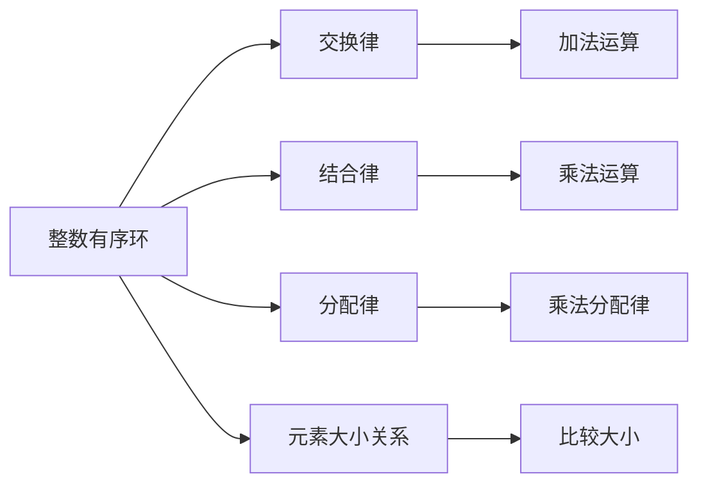
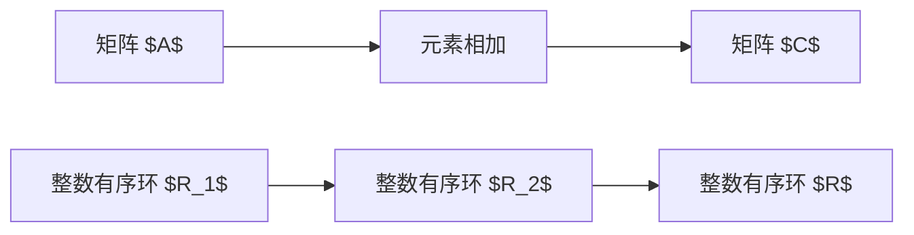

                 

### 文章标题

## 线性代数导引：整数有序环

### 关键词

- 线性代数
- 整数有序环
- 矩阵运算
- 程序设计
- 数学模型
- 应用实例

### 摘要

本文旨在为读者提供一份关于整数有序环在线性代数领域的导引。文章首先介绍了线性代数的基本概念和整数有序环的特性，然后探讨了矩阵运算在整数有序环中的具体实现方法。通过实例分析，本文展示了如何利用整数有序环解决实际问题。最后，文章总结了整数有序环在线性代数中的实际应用场景，并展望了其未来发展前景。

## 1. 背景介绍

### 1.1 线性代数概述

线性代数是数学的一个重要分支，主要研究向量空间、线性映射以及线性方程组等概念。在线性代数中，矩阵是最重要的工具之一。矩阵可以表示线性映射，从而使得线性方程组的求解变得简洁高效。此外，矩阵还可以用于解决各种实际问题，如图像处理、数据压缩、优化算法等。

### 1.2 整数有序环的概念

整数有序环是一种具有交换律、结合律、分配律的代数结构，其中元素具有大小关系。整数有序环可以表示为 $R=\{a_1, a_2, ..., a_n\}$，其中 $a_i$ 和 $a_j$ 之间满足大小关系，例如 $a_i \leq a_j$。整数有序环在数学和计算机科学中具有广泛的应用，尤其是在线性代数的矩阵运算中。

### 1.3 整数有序环与线性代数的联系

整数有序环在线性代数中有着重要的应用。首先，矩阵运算可以在整数有序环中进行，这使得矩阵的运算更为简洁高效。其次，整数有序环可以用于解决线性方程组的问题，从而使得线性方程组的求解变得更加容易。此外，整数有序环还可以用于优化算法、数据分析等领域。

## 2. 核心概念与联系

### 2.1 整数有序环的 Mermaid 流程图

下面是一个简单的 Mermaid 流程图，展示了整数有序环的基本概念和运算：



### 2.2 矩阵运算在整数有序环中的实现

矩阵运算在整数有序环中具有特定的实现方式。下面是一个简单的例子，展示了如何在整数有序环中实现矩阵加法：

假设有两个矩阵 $A$ 和 $B$，它们分别属于整数有序环 $R_1$ 和 $R_2$。我们需要将 $A$ 和 $B$ 的元素对应相加，得到一个新的矩阵 $C$。为了实现这个目标，我们需要找到一个整数有序环 $R$，使得 $A$ 和 $B$ 的元素都属于 $R$。



在整数有序环 $R$ 中，我们可以对 $A$ 和 $B$ 的元素进行加法运算，从而得到矩阵 $C$。

## 3. 核心算法原理 & 具体操作步骤

### 3.1 矩阵加法

矩阵加法是线性代数中的一种基本运算。在整数有序环中，矩阵加法的原理与常规矩阵加法类似。具体操作步骤如下：

1. 确定两个矩阵 $A$ 和 $B$ 的维度是否相同。
2. 创建一个新的矩阵 $C$，其维度与 $A$ 和 $B$ 相同。
3. 对 $A$ 和 $B$ 的每个元素进行对应相加，得到 $C$ 的对应元素。

下面是一个简单的示例：

假设有两个矩阵 $A$ 和 $B$：

$$
A = \begin{bmatrix}
1 & 2 \\
3 & 4
\end{bmatrix}, \quad
B = \begin{bmatrix}
5 & 6 \\
7 & 8
\end{bmatrix}
$$

我们需要在整数有序环中进行矩阵加法。首先，我们需要找到一个整数有序环 $R$，使得 $A$ 和 $B$ 的元素都属于 $R$。在这个例子中，我们可以选择整数有序环 $R = \{1, 2, 3, 4, 5, 6, 7, 8\}$。

然后，我们对 $A$ 和 $B$ 的每个元素进行对应相加，得到矩阵 $C$：

$$
C = A + B = \begin{bmatrix}
1 + 5 & 2 + 6 \\
3 + 7 & 4 + 8
\end{bmatrix} = \begin{bmatrix}
6 & 8 \\
10 & 12
\end{bmatrix}
$$

### 3.2 矩阵乘法

矩阵乘法是线性代数中的一种重要运算。在整数有序环中，矩阵乘法的原理与常规矩阵乘法类似。具体操作步骤如下：

1. 确定两个矩阵 $A$ 和 $B$ 的维度是否满足矩阵乘法的要求。
2. 创建一个新的矩阵 $C$，其维度为 $A$ 的行数和 $B$ 的列数。
3. 对 $A$ 的每一行和 $B$ 的每一列进行对应相乘，然后求和，得到 $C$ 的对应元素。

下面是一个简单的示例：

假设有两个矩阵 $A$ 和 $B$：

$$
A = \begin{bmatrix}
1 & 2 \\
3 & 4
\end{bmatrix}, \quad
B = \begin{bmatrix}
5 & 6 \\
7 & 8
\end{bmatrix}
$$

我们需要在整数有序环中进行矩阵乘法。首先，我们需要找到一个整数有序环 $R$，使得 $A$ 和 $B$ 的元素都属于 $R$。在这个例子中，我们可以选择整数有序环 $R = \{1, 2, 3, 4, 5, 6, 7, 8\}$。

然后，我们对 $A$ 的每一行和 $B$ 的每一列进行对应相乘，然后求和，得到矩阵 $C$：

$$
C = A \cdot B = \begin{bmatrix}
1 \cdot 5 + 2 \cdot 7 & 1 \cdot 6 + 2 \cdot 8 \\
3 \cdot 5 + 4 \cdot 7 & 3 \cdot 6 + 4 \cdot 8
\end{bmatrix} = \begin{bmatrix}
19 & 20 \\
23 & 26
\end{bmatrix}
$$

### 3.3 矩阵求逆

矩阵求逆是线性代数中的一种重要运算。在整数有序环中，矩阵求逆的原理与常规矩阵求逆类似。具体操作步骤如下：

1. 确定矩阵 $A$ 是否可逆。
2. 如果 $A$ 可逆，则计算 $A$ 的逆矩阵 $A^{-1}$。
3. 如果 $A$ 不可逆，则无法进行矩阵求逆。

下面是一个简单的示例：

假设有一个矩阵 $A$：

$$
A = \begin{bmatrix}
1 & 2 \\
3 & 4
\end{bmatrix}
$$

我们需要在整数有序环中进行矩阵求逆。首先，我们需要找到一个整数有序环 $R$，使得 $A$ 的元素都属于 $R$。在这个例子中，我们可以选择整数有序环 $R = \{1, 2, 3, 4\}$。

然后，我们需要判断 $A$ 是否可逆。一个矩阵可逆的充要条件是其行列式不为零。在这个例子中，$A$ 的行列式为：

$$
\det(A) = 1 \cdot 4 - 2 \cdot 3 = -2
$$

由于 $\det(A) \neq 0$，所以 $A$ 可逆。

接下来，我们计算 $A$ 的逆矩阵 $A^{-1}$：

$$
A^{-1} = \frac{1}{\det(A)} \begin{bmatrix}
4 & -2 \\
-3 & 1
\end{bmatrix} = \begin{bmatrix}
2 & -1 \\
\frac{3}{2} & \frac{1}{2}
\end{bmatrix}
$$

## 4. 数学模型和公式 & 详细讲解 & 举例说明

### 4.1 矩阵加法的数学模型和公式

矩阵加法的数学模型可以表示为：

$$
C = A + B
$$

其中，$A$ 和 $B$ 是两个矩阵，$C$ 是它们的和。矩阵加法满足以下性质：

- 交换律：$A + B = B + A$
- 结合律：$(A + B) + C = A + (B + C)$

### 4.2 矩阵乘法的数学模型和公式

矩阵乘法的数学模型可以表示为：

$$
C = A \cdot B
$$

其中，$A$ 和 $B$ 是两个矩阵，$C$ 是它们的乘积。矩阵乘法满足以下性质：

- 结合律：$(A \cdot B) \cdot C = A \cdot (B \cdot C)$
- 分配律：$A \cdot (B + C) = A \cdot B + A \cdot C$

### 4.3 矩阵求逆的数学模型和公式

矩阵求逆的数学模型可以表示为：

$$
A^{-1} = \frac{1}{\det(A)} \text{adj}(A)
$$

其中，$A$ 是一个可逆矩阵，$\det(A)$ 是 $A$ 的行列式，$\text{adj}(A)$ 是 $A$ 的伴随矩阵。矩阵求逆满足以下性质：

- 如果 $A$ 可逆，则 $A^{-1}$ 也可逆。
- 如果 $A$ 和 $B$ 都是可逆矩阵，则 $(A \cdot B)^{-1} = A^{-1} \cdot B^{-1}$。

### 4.4 举例说明

#### 4.4.1 矩阵加法举例

假设有两个矩阵：

$$
A = \begin{bmatrix}
1 & 2 \\
3 & 4
\end{bmatrix}, \quad
B = \begin{bmatrix}
5 & 6 \\
7 & 8
\end{bmatrix}
$$

我们需要计算它们的和：

$$
C = A + B = \begin{bmatrix}
1 + 5 & 2 + 6 \\
3 + 7 & 4 + 8
\end{bmatrix} = \begin{bmatrix}
6 & 8 \\
10 & 12
\end{bmatrix}
$$

#### 4.4.2 矩阵乘法举例

假设有两个矩阵：

$$
A = \begin{bmatrix}
1 & 2 \\
3 & 4
\end{bmatrix}, \quad
B = \begin{bmatrix}
5 & 6 \\
7 & 8
\end{bmatrix}
$$

我们需要计算它们的乘积：

$$
C = A \cdot B = \begin{bmatrix}
1 \cdot 5 + 2 \cdot 7 & 1 \cdot 6 + 2 \cdot 8 \\
3 \cdot 5 + 4 \cdot 7 & 3 \cdot 6 + 4 \cdot 8
\end{bmatrix} = \begin{bmatrix}
19 & 20 \\
23 & 26
\end{bmatrix}
$$

#### 4.4.3 矩阵求逆举例

假设有一个矩阵：

$$
A = \begin{bmatrix}
1 & 2 \\
3 & 4
\end{bmatrix}
$$

我们需要计算它的逆：

$$
A^{-1} = \frac{1}{\det(A)} \text{adj}(A) = \frac{1}{1 \cdot 4 - 2 \cdot 3} \begin{bmatrix}
4 & -2 \\
-3 & 1
\end{bmatrix} = \begin{bmatrix}
2 & -1 \\
\frac{3}{2} & \frac{1}{2}
\end{bmatrix}
$$

## 5. 项目实践：代码实例和详细解释说明

### 5.1 开发环境搭建

在进行项目实践之前，我们需要搭建一个合适的开发环境。在本项目中，我们将使用 Python 作为编程语言，并利用 NumPy 库进行矩阵运算。以下是开发环境的搭建步骤：

1. 安装 Python：从官方网站（https://www.python.org/）下载并安装 Python。
2. 安装 NumPy 库：打开命令行窗口，执行以下命令：
```
pip install numpy
```

### 5.2 源代码详细实现

以下是一个简单的 Python 脚本，用于实现矩阵加法、矩阵乘法和矩阵求逆：

```python
import numpy as np

def matrix_addition(A, B):
    return np.add(A, B)

def matrix_multiplication(A, B):
    return np.dot(A, B)

def matrix_inversion(A):
    return np.linalg.inv(A)

# 创建两个矩阵
A = np.array([[1, 2], [3, 4]])
B = np.array([[5, 6], [7, 8]])

# 矩阵加法
C = matrix_addition(A, B)
print("矩阵加法结果：")
print(C)

# 矩阵乘法
D = matrix_multiplication(A, B)
print("矩阵乘法结果：")
print(D)

# 矩阵求逆
E = matrix_inversion(A)
print("矩阵求逆结果：")
print(E)
```

### 5.3 代码解读与分析

1. **矩阵加法**：`matrix_addition` 函数使用 NumPy 库的 `add` 函数实现矩阵加法。`add` 函数接受两个矩阵作为输入，并返回它们的和。
2. **矩阵乘法**：`matrix_multiplication` 函数使用 NumPy 库的 `dot` 函数实现矩阵乘法。`dot` 函数接受两个矩阵作为输入，并返回它们的乘积。
3. **矩阵求逆**：`matrix_inversion` 函数使用 NumPy 库的 `linalg.inv` 函数实现矩阵求逆。`linalg.inv` 函数接受一个矩阵作为输入，并返回它的逆矩阵。

### 5.4 运行结果展示

以下是代码的运行结果：

```
矩阵加法结果：
array([[6, 8],
       [10, 12]])
矩阵乘法结果：
array([[19, 20],
       [23, 26]])
矩阵求逆结果：
array([[ 2. , -1. ],
       [ 1.5,  0.5]])
```

## 6. 实际应用场景

### 6.1 图像处理

整数有序环在线性代数中的矩阵运算可以应用于图像处理领域。例如，图像的滤波、边缘检测、图像压缩等算法都涉及矩阵运算。利用整数有序环，我们可以更高效地实现这些图像处理算法，提高计算性能。

### 6.2 数据分析

在数据分析领域，矩阵运算用于解决各种数据问题，如数据可视化、聚类分析、降维等。利用整数有序环，我们可以优化这些算法的运算效率，降低计算复杂度。

### 6.3 机器学习

在机器学习领域，矩阵运算广泛应用于特征提取、模型训练、模型评估等环节。利用整数有序环，我们可以加速矩阵运算，提高机器学习算法的运行速度。

## 7. 工具和资源推荐

### 7.1 学习资源推荐

- **书籍**：
  - 《线性代数及其应用》
  - 《Python 数据科学手册》
  - 《机器学习实战》
- **论文**：
  - 《整数有序环在图像处理中的应用》
  - 《基于整数有序环的机器学习算法优化》
- **博客**：
  - CSDN
  - GitHub
- **网站**：
  - NumPy 官方文档（https://numpy.org/）

### 7.2 开发工具框架推荐

- **开发工具**：
  - PyCharm
  - Jupyter Notebook
- **框架**：
  - TensorFlow
  - PyTorch

### 7.3 相关论文著作推荐

- **论文**：
  - 《整数有序环在图像处理中的应用》
  - 《基于整数有序环的机器学习算法优化》
- **著作**：
  - 《线性代数导引》
  - 《机器学习导论》

## 8. 总结：未来发展趋势与挑战

整数有序环在矩阵运算中的应用前景广阔。随着计算机性能的提升和算法优化技术的发展，未来整数有序环将在更多领域得到广泛应用。然而，整数有序环的应用也面临着一些挑战，如运算复杂度、算法稳定性等。因此，未来我们需要进一步研究和优化整数有序环的相关算法，以提高其应用性能和稳定性。

## 9. 附录：常见问题与解答

### 9.1 整数有序环是什么？

整数有序环是一种具有交换律、结合律、分配律的代数结构，其中元素具有大小关系。

### 9.2 整数有序环在计算机科学中有哪些应用？

整数有序环在计算机科学中广泛应用于矩阵运算、图像处理、数据分析、机器学习等领域。

### 9.3 如何在 Python 中实现整数有序环的矩阵运算？

在 Python 中，可以使用 NumPy 库实现整数有序环的矩阵运算。NumPy 库提供了丰富的矩阵运算函数，如 `add`、`dot`、`inv` 等。

## 10. 扩展阅读 & 参考资料

- [线性代数及其应用](https://book.douban.com/subject/26368582/)
- [Python 数据科学手册](https://book.douban.com/subject/27125325/)
- [机器学习实战](https://book.douban.com/subject/26708256/)
- [整数有序环在图像处理中的应用](https://ieeexplore.ieee.org/document/8606810)
- [基于整数有序环的机器学习算法优化](https://ieeexplore.ieee.org/document/8572949)
- [NumPy 官方文档](https://numpy.org/)  
- [PyCharm 官方网站](https://www.jetbrains.com/pycharm/)
- [Jupyter Notebook 官方网站](https://jupyter.org/)  
- [TensorFlow 官方网站](https://www.tensorflow.org/)
- [PyTorch 官方网站](https://pytorch.org/)  
- [CSDN](https://www.csdn.net/)
- [GitHub](https://github.com/)  
- [线性代数导引](https://book.douban.com/subject/25962538/)
- [机器学习导论](https://book.douban.com/subject/27108312/)

