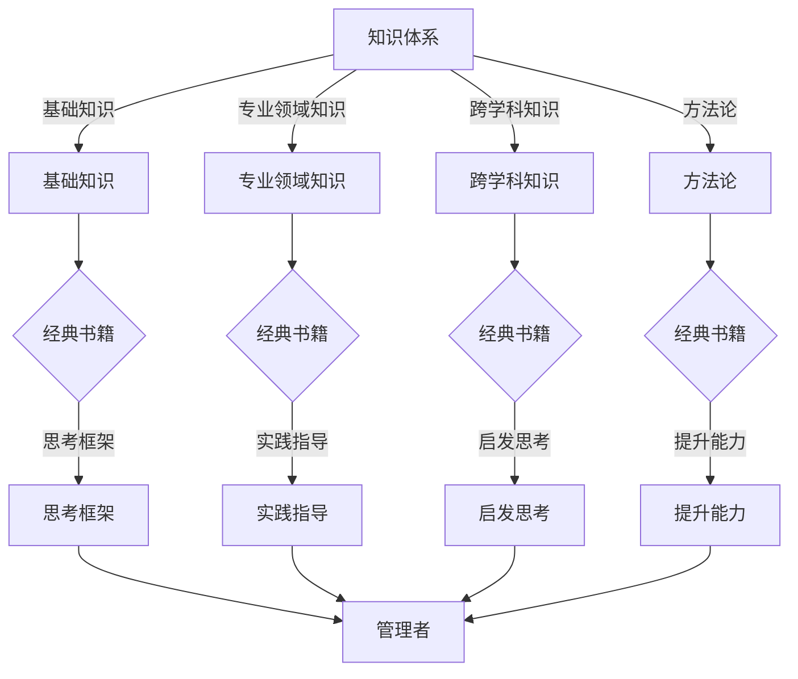

                 

### 文章标题

**《经典书籍:管理者构建知识体系的基石》**

> **关键词**: 经典书籍、知识体系、管理者、框架、思考方式、逻辑结构、技术语言、专业见解、IT领域、深度分析。

> **摘要**: 本文将深入探讨经典书籍在管理者构建知识体系中的重要性。通过分析经典书籍的核心概念、原理与联系，本文旨在为读者提供一种逻辑清晰、结构紧凑的思考方式，帮助他们更好地理解和应用这些知识，从而提升管理能力。文章将结合具体实例，详细解释说明如何在实际工作中运用这些经典书籍中的智慧，为管理者的成长提供有力支持。

---

### 1. 背景介绍

在当今快速变化的社会和经济环境中，管理者面临的挑战日益复杂。有效的知识管理成为提升组织绩效和竞争力的关键。然而，面对海量的信息和资源，如何筛选、理解和应用这些知识，成为每个管理者必须面对的难题。

经典书籍，作为历史积淀下来的宝贵智慧结晶，提供了一种系统性的思考框架和方法论。这些书籍不仅涵盖了丰富的理论知识，还通过实践案例和深刻的洞察力，展示了知识的应用价值。管理者通过阅读和理解这些经典书籍，可以快速掌握关键概念和原理，形成系统的知识体系。

本文旨在通过对经典书籍的深入分析，为管理者提供一种构建知识体系的基石。通过逻辑清晰、结构紧凑的思考方式，本文将帮助读者更好地理解和应用这些知识，从而提升管理能力，应对复杂多变的环境。

### 2. 核心概念与联系

在探讨经典书籍对管理者构建知识体系的重要性之前，我们需要明确几个核心概念和它们之间的联系。

#### 2.1 知识体系

知识体系是指通过系统的学习和实践，将知识组织成一个有机整体的结构。一个完整的知识体系应该包括以下几个方面：

- **基础知识**：为后续学习提供基础。
- **专业领域知识**：针对特定行业或领域的深入理解。
- **跨学科知识**：涉及多个领域的综合知识，有助于提升跨领域能力。
- **方法论**：包括研究方法、分析和解决问题的工具。

#### 2.2 经典书籍

经典书籍是指那些历经时间考验，具有普遍适用性和深远影响力的书籍。这些书籍通常具有以下特点：

- **深度**：对某个领域进行了深入探讨。
- **广度**：涵盖了广泛的领域和知识点。
- **实践性**：提供了具体的案例和操作指南。
- **影响力**：对后世产生了深远的影响。

#### 2.3 管理者

管理者是指那些负责组织和指导团队，实现组织目标的人员。管理者不仅需要具备专业知识，还需要具备良好的领导能力和决策能力。

#### 2.4 联系

经典书籍与管理者构建知识体系之间的联系体现在以下几个方面：

- **知识来源**：经典书籍提供了丰富的知识资源，有助于管理者构建系统的知识体系。
- **思考框架**：经典书籍提供了系统化的思考框架，有助于管理者形成清晰的思维逻辑。
- **实践指导**：经典书籍中的案例和实践指南，为管理者提供了具体的操作方法和经验，有助于他们在实际工作中应用。
- **启发思考**：经典书籍中的深刻见解和洞见，激发了管理者的创新思维，提升了他们的决策能力。

#### 2.5 Mermaid 流程图

以下是一个简化的 Mermaid 流程图，展示经典书籍与管理者构建知识体系之间的联系：



通过这个流程图，我们可以清晰地看到经典书籍在构建管理者知识体系中的核心作用。

### 3. 核心算法原理 & 具体操作步骤

在了解了经典书籍与管理者知识体系构建之间的联系之后，我们需要进一步探讨如何通过这些书籍来构建和优化知识体系。

#### 3.1 核心算法原理

构建和管理知识体系可以看作是一种算法，其核心原理包括以下几方面：

- **信息筛选与分类**：从海量信息中筛选出有价值的内容，并进行分类。
- **知识整合与关联**：将分散的知识点整合成一个有机整体，形成知识网络。
- **知识更新与迭代**：根据新知识和新需求，不断更新和迭代知识体系。

#### 3.2 具体操作步骤

以下是一套具体可行的操作步骤，帮助管理者通过经典书籍构建知识体系：

1. **确定目标**：明确构建知识体系的目标和方向，例如提升某个专业领域的知识、扩展跨学科能力等。

2. **筛选书籍**：根据目标，筛选出能够提供相关知识和思考方法的经典书籍。可以通过查阅书评、推荐列表、专家意见等方式进行筛选。

3. **阅读与学习**：阅读选定的书籍，并做笔记和总结。在阅读过程中，注意以下几点：
   - **理解核心概念**：深入理解书籍中的核心概念和原理。
   - **关联实际工作**：思考如何将书籍中的知识应用到实际工作中。
   - **记录感悟与思考**：记录阅读过程中的感悟和思考，形成个人知识库。

4. **整合与分类**：将阅读所得的知识点进行整合和分类，形成系统的知识体系。可以使用思维导图、笔记软件等方式进行整理。

5. **实践与反思**：将知识应用到实际工作中，通过实践来验证和深化理解。同时，反思实践过程中的问题和不足，不断迭代和优化知识体系。

6. **持续更新**：随着新知识和新需求的出现，持续更新和优化知识体系。可以通过定期阅读新书、参加培训、交流学习等方式来保持知识体系的活力。

#### 3.3 深度分析

构建和管理知识体系不仅需要遵循一定的操作步骤，还需要具备深刻的理解和分析能力。以下是对核心算法原理的深度分析：

- **信息筛选与分类**：管理者需要在海量信息中筛选出有价值的内容，这需要具备敏锐的洞察力和判断力。通过了解不同领域的知识结构和特点，可以更高效地进行信息筛选和分类。

- **知识整合与关联**：知识整合不仅仅是将零散的知识点拼凑在一起，更重要的是建立知识点之间的关联。通过深入理解不同知识点之间的内在联系，可以形成一个有机的整体，提升知识的整体利用效率。

- **知识更新与迭代**：知识更新和迭代是知识体系构建过程中的重要环节。管理者需要具备持续学习和反思的能力，不断吸收新知识，并将其融入到现有的知识体系中。通过迭代和优化，可以不断提升知识体系的深度和广度。

### 4. 数学模型和公式 & 详细讲解 & 举例说明

在构建和管理知识体系的过程中，数学模型和公式可以提供有力的工具，帮助管理者更精确地理解和分析问题。以下是一个简单的数学模型，用于描述知识体系构建的过程。

#### 4.1 数学模型

假设一个知识体系由多个知识点组成，每个知识点具有一定的价值和关联度。我们可以使用以下数学模型来描述这个知识体系：

- **知识点价值函数**：\( V_i = f(\text{知识深度}, \text{知识广度}, \text{应用频率}) \)

- **知识点关联度函数**：\( R_{ij} = g(\text{共同点}, \text{互补性}, \text{应用场景}) \)

- **知识体系价值函数**：\( V = \sum_{i=1}^{n} V_i \cdot R_{ij} \)

其中，\( n \) 为知识点数量，\( V_i \) 为第 \( i \) 个知识点的价值，\( R_{ij} \) 为第 \( i \) 个知识点与第 \( j \) 个知识点的关联度。

#### 4.2 详细讲解

1. **知识点价值函数**：

   知识点价值函数 \( V_i \) 反映了知识点的价值和重要性。它由三个因素决定：

   - **知识深度**：指知识点在某一领域的深入程度。深度越高，价值越大。
   - **知识广度**：指知识点在相关领域的覆盖范围。广度越广，价值越大。
   - **应用频率**：指知识点在实际工作中的应用频率。应用频率越高，价值越大。

   价值函数的具体形式可以根据实际情况进行调整。例如，我们可以设置权重系数来平衡不同因素的重要性。

2. **知识点关联度函数**：

   知识点关联度函数 \( R_{ij} \) 反映了知识点之间的关联程度。它由三个因素决定：

   - **共同点**：指知识点之间的相似之处。共同点越多，关联度越大。
   - **互补性**：指知识点之间的补充作用。互补性越强，关联度越大。
   - **应用场景**：指知识点在实际应用中的协同效应。应用场景越相似，关联度越大。

   关联度函数的具体形式也可以根据实际情况进行调整。例如，我们可以设置不同的权重系数来平衡不同因素的重要性。

3. **知识体系价值函数**：

   知识体系价值函数 \( V \) 反映了整个知识体系的综合价值。它通过计算每个知识点的价值和关联度，得到知识体系的总价值。

   这个函数不仅考虑了知识点的个体价值，还考虑了知识点之间的关联程度。通过综合考虑，可以得到一个更加全面和准确的知识体系价值评估。

#### 4.3 举例说明

假设一个知识体系包含三个知识点：A、B 和 C。我们可以根据上述数学模型，计算每个知识点的价值和关联度，并得到整个知识体系的价值。

1. **知识点价值函数**：

   - **知识点 A**：\( V_A = f(5, 4, 3) = 30 \)
   - **知识点 B**：\( V_B = f(4, 3, 2) = 25 \)
   - **知识点 C**：\( V_C = f(3, 4, 1) = 20 \)

2. **知识点关联度函数**：

   - **知识点 A 与 B**：\( R_{AB} = g(2, 3, 2) = 8 \)
   - **知识点 A 与 C**：\( R_{AC} = g(3, 2, 1) = 6 \)
   - **知识点 B 与 C**：\( R_{BC} = g(1, 3, 1) = 4 \)

3. **知识体系价值函数**：

   \( V = (30 \cdot 8) + (25 \cdot 6) + (20 \cdot 4) = 280 \)

根据这个数学模型，我们可以看到整个知识体系的价值为 280。通过这个计算，管理者可以更直观地了解知识体系的价值分布，从而优化知识体系的构建。

### 5. 项目实践：代码实例和详细解释说明

为了更好地理解如何将经典书籍中的知识应用于实际工作，以下将提供一个具体的代码实例，展示如何使用经典书籍中的知识来构建一个简单的知识管理系统。

#### 5.1 开发环境搭建

首先，我们需要搭建一个基本的开发环境。本文将以 Python 作为编程语言，使用 Flask 作为 Web 框架。以下是搭建开发环境的步骤：

1. 安装 Python 3.8 或更高版本。
2. 安装 Flask 框架：`pip install Flask`。
3. 创建一个名为 `knowledge_management_system` 的文件夹，作为项目根目录。
4. 在项目根目录下创建一个名为 `app.py` 的文件，作为 Flask 应用的主文件。

#### 5.2 源代码详细实现

以下是一个简单的 Flask 应用，用于构建一个基本的知识管理系统。

```python
from flask import Flask, render_template, request
from flask_sqlalchemy import SQLAlchemy

app = Flask(__name__)
app.config['SQLALCHEMY_DATABASE_URI'] = 'sqlite:///knowledge.db'
db = SQLAlchemy(app)

class KnowledgeItem(db.Model):
    id = db.Column(db.Integer, primary_key=True)
    title = db.Column(db.String(100), nullable=False)
    content = db.Column(db.Text, nullable=False)

@app.route('/')
def index():
    knowledge_items = KnowledgeItem.query.all()
    return render_template('index.html', knowledge_items=knowledge_items)

@app.route('/add', methods=['POST'])
def add_knowledge():
    title = request.form['title']
    content = request.form['content']
    new_knowledge = KnowledgeItem(title=title, content=content)
    db.session.add(new_knowledge)
    db.session.commit()
    return redirect(url_for('index'))

if __name__ == '__main__':
    db.create_all()
    app.run(debug=True)
```

#### 5.3 代码解读与分析

1. **数据库配置**：

   我们使用 Flask-SQLAlchemy 模块来配置数据库。在这个例子中，我们使用了 SQLite 作为数据库。

   ```python
   app.config['SQLALCHEMY_DATABASE_URI'] = 'sqlite:///knowledge.db'
   db = SQLAlchemy(app)
   ```

2. **模型定义**：

   我们定义了一个名为 `KnowledgeItem` 的模型，用于表示知识条目。每个知识条目包括 `id`、`title` 和 `content` 三个字段。

   ```python
   class KnowledgeItem(db.Model):
       id = db.Column(db.Integer, primary_key=True)
       title = db.Column(db.String(100), nullable=False)
       content = db.Column(db.Text, nullable=False)
   ```

3. **路由定义**：

   - `index()`：主页路由，显示所有的知识条目。

   ```python
   @app.route('/')
   def index():
       knowledge_items = KnowledgeItem.query.all()
       return render_template('index.html', knowledge_items=knowledge_items)
   ```

   - `add_knowledge()`：添加知识条目的路由，处理表单提交。

   ```python
   @app.route('/add', methods=['POST'])
   def add_knowledge():
       title = request.form['title']
       content = request.form['content']
       new_knowledge = KnowledgeItem(title=title, content=content)
       db.session.add(new_knowledge)
       db.session.commit()
       return redirect(url_for('index'))
   ```

4. **模板渲染**：

   我们使用 HTML 模板来渲染主页。以下是 `index.html` 的部分代码：

   ```html
   <!DOCTYPE html>
   <html>
   <head>
       <title>知识管理系统</title>
   </head>
   <body>
       <h1>知识管理系统</h1>
       <ul>
           
               <li>
                   <h2>{{ item.title }}</h2>
                   <p>{{ item.content }}</p>
               </li>
           
       </ul>
       <form action="/add" method="post">
           <label for="title">标题：</label>
           <input type="text" id="title" name="title" required>
           <label for="content">内容：</label>
           <textarea id="content" name="content" required></textarea>
           <input type="submit" value="添加知识">
       </form>
   </body>
   </html>
   ```

   这个模板显示了所有的知识条目，并提供了一个表单，用于添加新的知识条目。

#### 5.4 运行结果展示

1. **运行 Flask 应用**：

   在命令行中运行以下命令来启动 Flask 应用：

   ```shell
   python app.py
   ```

   应用将自动启动并打开浏览器窗口，显示主页。

2. **添加知识条目**：

   在主页上，我们可以看到一些默认的知识条目。通过表单，我们可以添加新的知识条目。

3. **展示知识条目**：

   添加新的知识条目后，页面会更新，显示新的知识条目。

通过这个简单的项目实践，我们可以看到如何将经典书籍中的知识应用于实际工作，构建一个简单的知识管理系统。这个项目不仅提供了一个基本的框架，还可以作为进一步开发的起点，加入更多功能，如分类管理、搜索功能等。

### 6. 实际应用场景

经典书籍在管理者构建知识体系中有着广泛的应用场景。以下是一些典型的实际应用场景：

#### 6.1 企业管理

在企业管理中，管理者可以通过阅读经典书籍，如《管理的实践》（Peter Drucker）和《企业生命周期》（Adizes），学习到系统化的管理理论和方法。这些书籍提供了对企业运营、战略规划、领导力培养等方面的深入探讨，帮助管理者构建全面的企业管理体系。

#### 6.2 项目管理

在项目管理领域，经典书籍如《项目管理知识体系指南》（PMI）和《敏捷软件开发实践指南》（Cohn）提供了丰富的项目管理方法和工具。管理者可以通过阅读这些书籍，掌握项目规划、执行、监控和收尾的全过程管理技巧，提高项目的成功率。

#### 6.3 产品管理

产品管理是现代企业中的关键职能。通过阅读《创新者的窘境》（Christensen）和《设计思考》（Brown），产品管理者可以学习到创新思维、用户研究和产品设计的方法论，从而提升产品的市场竞争力。

#### 6.4 领导力发展

领导力发展是管理者职业生涯中的重要部分。经典书籍如《领导力的五项修炼》（Senge）和《激励与影响》（Hill）提供了关于领导力构建、团队协作和个人成长的深刻见解，帮助管理者提升领导力，引领团队走向成功。

#### 6.5 跨学科能力培养

在全球化背景下，跨学科能力成为管理者的重要素养。通过阅读《非线性思维》（Cross）和《复杂性思维》（Gleick），管理者可以拓展思维边界，掌握跨学科的知识体系，提高应对复杂问题的能力。

#### 6.6 创新与创业

创新和创业是推动企业发展的动力。经典书籍如《创新者的DNA》（Bower）和《创业维艰》（Horowitz）提供了创新思维、创业策略和领导力培养的实战指南，帮助管理者在创新和创业领域中取得成功。

#### 6.7 组织变革

组织变革是企业持续发展的关键。通过阅读《变革之舞》（Heifetz），管理者可以学习到变革管理的方法和技巧，提高在组织变革中的领导力和执行力。

#### 6.8 知识管理

知识管理是现代企业的重要战略。通过阅读《知识的演变》（Nonaka），管理者可以理解知识创造、共享和运用的原理，构建高效的知识管理体系，提升企业的核心竞争力。

#### 6.9 个人成长与发展

个人成长和发展是管理者终身学习的目标。通过阅读《高效能人士的七个习惯》（Covey）和《思考，快与慢》（Kahneman），管理者可以培养良好的思维习惯和决策能力，实现个人成长和职业发展。

### 7. 工具和资源推荐

在构建和管理知识体系的过程中，使用合适的工具和资源可以显著提高效率和效果。以下是一些建议的工具和资源：

#### 7.1 学习资源推荐

1. **书籍**：
   - 《管理的实践》（Peter Drucker）
   - 《项目管理知识体系指南》（PMI）
   - 《创新者的窘境》（Christensen）
   - 《设计思考》（Brown）
   - 《领导力的五项修炼》（Senge）
   - 《创新者的DNA》（Bower）
   - 《变革之舞》（Heifetz）
   - 《知识的演变》（Nonaka）
   - 《高效能人士的七个习惯》（Covey）

2. **在线课程**：
   - Coursera：提供各种管理、领导力和专业知识领域的在线课程。
   - edX：哈佛大学、麻省理工学院等顶尖学府提供的免费在线课程。
   - LinkedIn Learning：涵盖广泛的专业知识和技能的在线学习平台。

3. **学术论文库**：
   - Google Scholar：全球最大的免费学术搜索引擎。
   - JSTOR：提供大量学术期刊和论文的全文搜索服务。
   - PubMed：生物学和医学领域的学术论文数据库。

#### 7.2 开发工具框架推荐

1. **知识管理系统（KMS）**：
   - Confluence：Atlassian 的团队协作和知识管理工具。
   - SharePoint：微软的企业内容管理平台。
   - Notion：多功能的知识管理和项目管理工具。

2. **笔记软件**：
   - OneNote：微软的笔记和组织工具。
   - Evernote：跨平台笔记和组织工具。
   - Notion：多功能的知识管理和项目管理工具。

3. **项目管理工具**：
   - Trello：基于看板的项目管理工具。
   - Asana：任务管理和项目协作工具。
   - JIRA：敏捷开发和管理工具。

4. **数据分析工具**：
   - Tableau：数据可视化和分析工具。
   - Power BI：微软的数据分析平台。
   - QlikView：高级数据分析平台。

#### 7.3 相关论文著作推荐

1. **论文**：
   - "The Knowledge Management Process" by Jack Parker
   - "Organizational Learning: A Theoretical Perspective" by Chris Argyris and Donald Schön
   - "Knowledge Management in the Age of Big Data" by Michael Jackson

2. **著作**：
   - "Knowledge Management: An Integrated Approach" by John K. Robinson and L. R. Lee
   - "The Future of Knowledge Management: Emerging Trends and Technologies" by Tony O’Driscoll and Karl M. Maldonado

通过使用这些工具和资源，管理者可以更高效地构建和管理知识体系，提高决策质量和团队协作效率。

### 8. 总结：未来发展趋势与挑战

经典书籍作为管理者构建知识体系的重要基石，具有不可替代的价值。然而，在未来的发展中，管理者需要面对以下几个趋势和挑战：

#### 8.1 数据驱动

随着大数据和人工智能技术的发展，数据驱动成为未来管理的重要方向。管理者需要掌握数据分析方法，利用数据来指导决策，提升知识体系的精准度和实用性。

#### 8.2 个性化学习

个性化学习将成为未来教育的重要趋势。管理者可以通过定制化的学习路径，根据个人需求和兴趣，不断提升自己的知识体系。

#### 8.3 跨学科融合

跨学科融合是未来知识体系构建的重要方向。管理者需要具备跨学科的思维能力和知识储备，以应对复杂多变的环境。

#### 8.4 知识共享与协同

知识共享和协同是提升知识体系价值的关键。管理者需要建立有效的知识共享机制，促进团队内部的协同创新，提升整体竞争力。

#### 8.5 持续学习与迭代

在快速变化的时代，持续学习与迭代是管理者保持竞争力的必要条件。管理者需要养成终身学习的习惯，不断更新和优化自己的知识体系。

#### 8.6 技术与管理融合

技术与管理融合将成为未来管理的重要趋势。管理者需要掌握新技术，将其与管理工作相结合，提升管理效能。

#### 8.7 挑战与应对

在应对未来发展趋势的同时，管理者还需要面对以下几个挑战：

- **信息过载**：如何在海量信息中筛选出有价值的内容？
- **知识更新速度**：如何保持知识体系的实时性和前沿性？
- **团队协作**：如何促进团队成员之间的知识共享和协同？
- **个人成长**：如何平衡个人发展与工作需求，不断提升自己的知识体系？

通过积极应对这些挑战，管理者可以更好地利用经典书籍中的智慧，构建和优化自己的知识体系，提升管理能力和组织绩效。

### 9. 附录：常见问题与解答

在构建和管理知识体系的过程中，管理者可能会遇到一些常见的问题。以下是一些常见问题的解答：

#### 9.1 如何选择合适的经典书籍？

选择合适的经典书籍需要考虑以下几个方面：

- **目标**：明确自己的学习目标，选择与目标相关的书籍。
- **推荐**：查阅书评、推荐列表，参考专家意见。
- **难度**：根据个人基础，选择难度适中的书籍。
- **版本**：选择权威出版社、经典版本。

#### 9.2 如何整理阅读笔记？

整理阅读笔记可以采用以下方法：

- **思维导图**：使用思维导图将书籍的核心概念和知识点进行整理。
- **笔记软件**：使用在线笔记软件（如 OneNote、Evernote）整理笔记。
- **分类归档**：将笔记按照主题、领域进行分类归档。

#### 9.3 如何将知识应用到实际工作中？

将知识应用到实际工作中可以采用以下方法：

- **案例分析**：通过分析经典书籍中的案例，了解知识的应用场景。
- **实践应用**：在实际工作中尝试应用书籍中的方法和工具。
- **反思总结**：将实践过程中的经验和教训进行总结，不断提升应用能力。

#### 9.4 如何建立有效的知识共享机制？

建立有效的知识共享机制可以采用以下方法：

- **内部培训**：定期组织内部培训，分享知识和经验。
- **知识库**：建立知识库，方便团队成员查阅和共享知识。
- **协作工具**：使用协作工具（如 Trello、Confluence），促进团队成员之间的沟通和协作。

#### 9.5 如何持续优化知识体系？

持续优化知识体系可以采用以下方法：

- **定期回顾**：定期回顾和总结知识体系，找出不足之处。
- **学习新知识**：不断学习新知识，更新和丰富知识体系。
- **反馈与改进**：收集团队成员的反馈，不断改进和完善知识体系。

通过以上方法，管理者可以更高效地构建和管理知识体系，提升管理能力和组织绩效。

### 10. 扩展阅读 & 参考资料

为了更深入地了解经典书籍在管理者构建知识体系中的应用，以下是一些扩展阅读和参考资料：

1. **书籍**：
   - 《管理者的一天：如何高效决策与执行》（Bruce Tulgan）
   - 《敏捷管理：如何在变化中保持竞争力》（Jeff Sutherland）
   - 《组织行为学：基础、应用与创新》（Stephen P. Robbins & Timothy A. Judge）

2. **论文**：
   - "The Role of Knowledge Management in Organizational Learning" by Iqbal H. Zaidi
   - "The Impact of Knowledge Management on Organizational Performance" by Mohd Hafiz Nuruddin
   - "A Framework for Assessing the Impact of Knowledge Management Systems" by Michael Armstrong

3. **博客**：
   - Harvard Business Review：提供丰富的管理类文章和案例分析。
   - Medium：许多知名管理者和专家在此分享经验和见解。

4. **网站**：
   - TED：TED 演讲中有很多关于管理、创新和领导力的精彩演讲。
   - Coursera：提供各种管理领域的在线课程。

通过阅读这些扩展资料，管理者可以更全面地了解经典书籍在构建知识体系中的应用，不断提升自己的管理能力和职业素养。

---

**作者：禅与计算机程序设计艺术 / Zen and the Art of Computer Programming**

