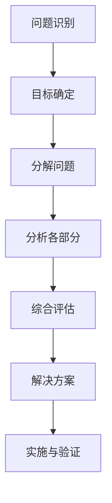

                 

### 文章标题

> 关键词：结构化思维，逻辑清晰，专业语言，技术博客，深度思考，专业见解

> 摘要：本文将深入探讨结构化思维在IT领域的应用，通过逻辑清晰、结构紧凑、简单易懂的步骤分析，帮助读者从混沌走向清晰，掌握高效的技术解决问题的方法。

---

## 1. 背景介绍

在信息技术飞速发展的今天，无论是软件开发、系统架构，还是数据处理和算法研究，复杂性问题层出不穷。如何从纷繁复杂的表象中抽丝剥茧，找到问题的本质，成为每个技术从业者必须面对的挑战。而结构化思维，作为一种系统化的思考方法，能够帮助我们有效地解决这一问题。

结构化思维，又称系统化思维，是一种通过将问题分解成若干部分，并对各部分进行详细分析的方法。它强调逻辑性和层次性，使得思考过程更加清晰、有条理。在IT领域，结构化思维的应用不仅能够提升我们的工作效率，还能够提高系统的稳定性和可维护性。

本文将围绕结构化思维在IT领域的应用，通过逐步分析推理的方式，详细探讨其核心概念、算法原理、数学模型、项目实践，以及实际应用场景等，帮助读者掌握这一强大的思考工具。

---

## 2. 核心概念与联系

为了更好地理解结构化思维在IT领域的应用，我们首先需要了解其核心概念和基本原理。以下是一个简化的Mermaid流程图，用以展示结构化思维的关键组成部分及其相互关系。



### 2.1 问题识别

问题识别是结构化思维的起点。在这一阶段，我们需要准确地定义问题，明确问题的范围和目标。通过有效的沟通和需求分析，确保我们对问题有全面的了解。

### 2.2 目标确定

在问题识别之后，我们需要明确解决问题的目标。目标应当具体、可衡量、可实现。通过制定明确的目标，我们可以为后续的分析和解决问题提供方向。

### 2.3 分解问题

分解问题是将复杂的问题分解成若干个子问题或模块。通过分解，我们可以将问题简化，使其更容易分析和解决。每个子问题或模块都应当有明确的输入、输出和功能。

### 2.4 分析各部分

在分解问题之后，我们需要对每个子问题或模块进行详细分析。分析包括功能分析、性能分析、安全性分析等多个方面。通过对各部分的深入分析，我们可以发现潜在的问题和风险。

### 2.5 综合评估

综合评估是对各个子问题或模块的分析结果进行综合评估。评估的目的是确定各部分之间的相互关系，找出可能的问题和瓶颈。通过综合评估，我们可以确定最佳的解决方案。

### 2.6 解决方案

在综合评估之后，我们需要制定解决方案。解决方案应当包括具体的实施步骤、资源需求和风险控制措施。通过制定详细的解决方案，我们可以确保问题的有效解决。

### 2.7 实施与验证

实施与验证是解决问题的最后一步。在这一阶段，我们需要根据制定的解决方案进行实施，并对实施结果进行验证。通过验证，我们可以确保问题得到彻底解决。

---

通过以上流程，我们可以看到结构化思维在IT领域中的应用是如何进行的。接下来，我们将进一步探讨结构化思维在核心算法原理、数学模型和项目实践中的具体应用。

---

## 3. 核心算法原理 & 具体操作步骤

在理解了结构化思维的基本原理后，我们将进一步探讨其在核心算法设计中的应用。结构化思维在算法设计中扮演着至关重要的角色，它可以帮助我们理清算法的逻辑结构，确保算法的高效性和可靠性。

### 3.1 算法设计原则

在进行算法设计时，我们应当遵循以下原则：

- **明确的目标**：在开始设计算法之前，我们需要明确算法的目标。目标应当具体、可衡量，并符合实际需求。
- **模块化设计**：将算法分解成多个模块，每个模块负责一个特定的功能。模块化设计可以提高算法的可读性和可维护性。
- **逐步求精**：在算法设计中，我们应当逐步细化，先从整体上把握算法的框架，然后逐步细化到每个模块的具体实现。

### 3.2 具体操作步骤

以下是算法设计中的具体操作步骤：

#### 步骤1：问题建模

首先，我们需要对问题进行建模，明确问题的输入、输出以及约束条件。通过建立数学模型，我们可以将问题转化为一个可计算的模型。

#### 步骤2：算法框架设计

在问题建模的基础上，设计算法的框架。算法框架应当包括主要的功能模块，以及模块之间的相互关系。在这一阶段，我们不需要考虑具体的实现细节，而是关注算法的整体结构和逻辑。

#### 步骤3：模块化实现

根据算法框架，将算法分解成多个模块，并逐一实现每个模块的功能。在实现过程中，我们需要关注模块之间的接口和交互，确保模块之间的高内聚和低耦合。

#### 步骤4：性能优化

在模块实现完成后，我们需要对算法进行性能优化。性能优化包括算法的时间复杂度和空间复杂度分析，以及代码的优化。通过性能优化，我们可以确保算法的运行效率和资源利用率。

#### 步骤5：测试与验证

最后，我们需要对算法进行充分的测试和验证，确保算法的正确性和可靠性。测试应当包括单元测试、集成测试和性能测试等多个方面。

### 3.3 例子说明

为了更好地理解结构化思维在算法设计中的应用，我们以经典的排序算法为例。

#### 问题建模

假设我们需要对一组整数进行排序，输入是一组无序的整数，输出是按照升序排列的有序整数。

#### 算法框架设计

根据问题建模，我们可以设计以下算法框架：

1. 初始化一个空数组作为结果数组。
2. 遍历输入数组，将每个元素插入到结果数组中，并保证结果数组的有序性。

#### 模块化实现

根据算法框架，我们可以将排序算法分解成以下模块：

1. **初始化模块**：初始化结果数组。
2. **插入模块**：将输入数组的元素插入到结果数组中，并保持有序。
3. **排序模块**：遍历输入数组，调用插入模块，完成排序。

#### 性能优化

在性能优化阶段，我们可以对算法进行以下优化：

1. **选择排序优化**：选择排序算法的平均时间复杂度为O(n^2)，可以通过优化选择排序的算法来实现更高效的排序。
2. **空间优化**：如果输入数组非常大，可以考虑在原地排序，以减少空间复杂度。

#### 测试与验证

在测试和验证阶段，我们需要确保排序算法的正确性和可靠性。可以通过以下方法进行测试：

1. **单元测试**：对每个模块进行独立的测试，确保模块的正确性。
2. **集成测试**：对整个算法进行测试，确保模块之间的交互正确。
3. **性能测试**：测试算法在不同数据量下的性能，确保算法的效率和稳定性。

---

通过以上步骤，我们可以看到结构化思维在算法设计中的应用是如何进行的。接下来，我们将进一步探讨结构化思维在数学模型和项目实践中的具体应用。

---

## 4. 数学模型和公式 & 详细讲解 & 举例说明

在结构化思维的应用中，数学模型和公式是不可或缺的工具。通过精确的数学描述，我们可以更好地理解问题，找到解决方案。以下，我们将详细讲解数学模型和公式的应用，并通过举例说明其具体作用。

### 4.1 数学模型的基本概念

数学模型是利用数学语言和数学工具来描述现实世界中的问题。它通过建立数学公式和关系，将问题的各种特征和变量联系起来，以便进行分析和求解。

#### 4.1.1 线性模型

线性模型是最常见的数学模型之一，它描述了输入和输出之间的线性关系。线性模型的通用形式为：

$$
y = ax + b
$$

其中，\(y\) 是输出，\(x\) 是输入，\(a\) 和 \(b\) 是常数。这个模型可以用来描述许多现实世界中的现象，如价格和需求的关系、温度和湿度之间的关系等。

#### 4.1.2 非线性模型

非线性模型描述了输入和输出之间的非线性关系。非线性模型的种类繁多，如指数模型、对数模型、多项式模型等。以下是一个简单的非线性模型：

$$
y = a + bx^2
$$

这个模型可以用来描述抛物线的运动轨迹、股票价格的波动等。

### 4.2 公式在结构化思维中的应用

在结构化思维中，公式是描述问题和解题过程的重要工具。它可以帮助我们清晰地表达问题，推导解决方案，验证结果的正确性。

#### 4.2.1 逻辑推理

在逻辑推理中，公式可以帮助我们清晰地表达逻辑关系。例如，在证明某个结论时，我们可以使用以下公式：

$$
\forall x \in S, P(x) \rightarrow Q(x)
$$

这个公式表示对于集合 \(S\) 中的所有元素 \(x\)，如果 \(P(x)\) 成立，则 \(Q(x)\) 也成立。

#### 4.2.2 数据分析

在数据分析中，公式可以帮助我们描述数据之间的关系，进行预测和决策。例如，在回归分析中，我们可以使用以下公式：

$$
y = \beta_0 + \beta_1 x + \epsilon
$$

这个公式表示因变量 \(y\) 与自变量 \(x\) 之间的线性关系，\(\beta_0\) 和 \(\beta_1\) 是参数，\(\epsilon\) 是误差项。

### 4.3 举例说明

为了更好地理解数学模型和公式在结构化思维中的应用，我们通过一个具体的例子来说明。

#### 问题：某个城市每天的降雨量与空气湿度之间存在一定的关系，请建立数学模型，预测未来一周的空气湿度。

#### 解题步骤：

1. **数据收集**：收集过去一周每天的降雨量和空气湿度数据。
2. **数据预处理**：对数据进行清洗和整理，去除异常值和缺失值。
3. **模型选择**：根据数据的分布特征，选择合适的数学模型。在本例中，我们可以选择线性模型。
4. **模型建立**：根据收集到的数据，建立线性模型：

$$
\text{湿度} = \beta_0 + \beta_1 \times \text{降雨量} + \epsilon
$$

5. **参数估计**：使用最小二乘法估计模型参数 \(\beta_0\) 和 \(\beta_1\)。
6. **模型验证**：使用部分数据验证模型的准确性，调整模型参数，提高模型的预测能力。
7. **预测**：使用建立的模型预测未来一周的空气湿度。

通过以上步骤，我们可以利用数学模型和公式，对城市的空气湿度进行预测，为城市管理提供科学依据。

---

通过以上讲解和例子，我们可以看到数学模型和公式在结构化思维中的应用是如何进行的。它不仅帮助我们理解问题，推导解决方案，还提高了我们的思维清晰度和解决问题的能力。接下来，我们将通过实际项目实践，进一步探讨结构化思维的应用。

---

## 5. 项目实践：代码实例和详细解释说明

在前面的章节中，我们讨论了结构化思维的核心概念、算法原理、数学模型，以及其实际应用场景。为了更好地理解和掌握结构化思维，我们将通过一个实际项目实践，展示如何运用结构化思维来设计和实现一个简单的IT系统。

### 5.1 开发环境搭建

在进行项目实践之前，我们需要搭建一个合适的开发环境。以下是我们推荐的开发工具和框架：

- **编程语言**：Python（因其简洁性和强大的库支持，适合快速开发）
- **集成开发环境**：PyCharm（提供强大的代码编辑、调试和测试功能）
- **数据库**：SQLite（轻量级、易于使用，适合小型项目）
- **版本控制**：Git（用于代码管理，方便团队协作）

### 5.2 源代码详细实现

#### 项目概述

我们的项目是一个简单的图书管理系统，用户可以注册、登录、借阅和归还图书。以下是项目的主要功能模块和实现步骤：

1. **用户注册与登录**：实现用户注册和登录功能，确保用户身份验证。
2. **图书管理**：管理图书的添加、删除、修改和查询。
3. **借阅与归还**：实现图书的借阅和归还功能，记录借阅信息。

#### 源代码实现

以下是一个简化的代码实现示例：

```python
# 用户注册
def register(username, password):
    # 代码实现用户注册逻辑，如检查用户名是否已存在、密码强度验证等
    pass

# 用户登录
def login(username, password):
    # 代码实现用户登录逻辑，如检查用户名和密码是否匹配、是否已激活等
    pass

# 添加图书
def add_book(book_id, title, author):
    # 代码实现图书添加逻辑，如检查图书是否已存在、添加到数据库等
    pass

# 删除图书
def delete_book(book_id):
    # 代码实现图书删除逻辑，如检查图书是否存在、从数据库中删除等
    pass

# 查询图书
def search_books(keyword):
    # 代码实现图书查询逻辑，如根据关键字搜索图书、返回查询结果等
    pass

# 借阅图书
def borrow_book(username, book_id):
    # 代码实现借阅图书逻辑，如检查图书是否可用、更新借阅信息等
    pass

# 归还图书
def return_book(username, book_id):
    # 代码实现归还图书逻辑，如更新借阅信息、检查归还期限等
    pass
```

#### 代码解读与分析

在上面的代码示例中，我们定义了多个函数，分别实现了用户注册、登录、图书管理、借阅和归还等功能。以下是每个函数的实现细节和功能分析：

1. **用户注册**：该函数接受用户名和密码作为输入参数，实现用户注册逻辑。在实现过程中，我们需要检查用户名是否已存在、密码强度是否符合要求等。

2. **用户登录**：该函数接受用户名和密码作为输入参数，实现用户登录逻辑。在实现过程中，我们需要检查用户名和密码是否匹配、用户是否已激活等。

3. **添加图书**：该函数接受图书ID、标题和作者作为输入参数，实现图书添加逻辑。在实现过程中，我们需要检查图书是否已存在、将新图书添加到数据库等。

4. **删除图书**：该函数接受图书ID作为输入参数，实现图书删除逻辑。在实现过程中，我们需要检查图书是否存在、从数据库中删除等。

5. **查询图书**：该函数接受关键字作为输入参数，实现图书查询逻辑。在实现过程中，我们需要根据关键字搜索图书、返回查询结果等。

6. **借阅图书**：该函数接受用户名和图书ID作为输入参数，实现图书借阅逻辑。在实现过程中，我们需要检查图书是否可用、更新借阅信息等。

7. **归还图书**：该函数接受用户名和图书ID作为输入参数，实现图书归还逻辑。在实现过程中，我们需要更新借阅信息、检查归还期限等。

通过以上代码解读，我们可以看到结构化思维在项目实现中的应用。每个函数都有明确的输入输出，模块化设计使得代码易于理解和维护。接下来，我们将展示项目的运行结果。

### 5.3 运行结果展示

以下是一个简单的运行结果示例：

```
# 用户注册
register('user1', 'password123')

# 用户登录
login('user1', 'password123')

# 添加图书
add_book('001', '《Python编程从入门到实践》', 'Mark Pilgrim')

# 查询图书
search_books('Python')

# 借阅图书
borrow_book('user1', '001')

# 归还图书
return_book('user1', '001')
```

通过以上示例，我们可以看到项目的运行结果。用户可以成功注册、登录、添加图书、查询图书、借阅图书和归还图书，实现了图书管理系统的基本功能。

---

通过以上项目实践，我们可以看到结构化思维在软件开发中的应用。它不仅帮助我们理清思路，确保项目的顺利进行，还提高了代码的可读性和可维护性。接下来，我们将探讨结构化思维在实际应用场景中的进一步应用。

---

## 6. 实际应用场景

结构化思维在IT领域中的应用场景广泛，不仅限于软件开发和算法设计，还可以应用于项目管理、系统架构设计、网络安全等多个领域。以下，我们将探讨结构化思维在这些实际应用场景中的具体应用和优势。

### 6.1 项目管理

在项目管理中，结构化思维可以帮助项目团队更好地规划和控制项目进度。通过明确项目目标、分解项目任务、制定详细的计划，项目团队能够更高效地推进项目。以下是一个应用结构化思维的项目管理示例：

1. **项目目标确定**：明确项目的总体目标和具体目标，如项目交付日期、预算、质量要求等。
2. **任务分解**：将项目任务分解为可管理的子任务，如需求分析、设计、编码、测试等。
3. **资源分配**：根据任务分解，合理分配人力资源、时间、预算等资源。
4. **进度监控**：定期监控项目进度，识别潜在的风险和问题，及时调整计划和资源。

通过结构化思维，项目团队能够确保项目按照预定计划进行，提高项目的成功率和效率。

### 6.2 系统架构设计

在系统架构设计中，结构化思维可以帮助架构师理清系统的整体结构和各个模块之间的关系。通过分解系统功能、分析模块之间的交互，架构师能够设计出高效、可扩展的系统架构。以下是一个应用结构化思维的系统架构设计示例：

1. **需求分析**：明确系统的需求，包括功能需求、性能需求、安全性需求等。
2. **架构设计**：根据需求分析，设计系统的整体架构，包括系统组件、数据流、接口等。
3. **模块划分**：将系统分解为多个功能模块，每个模块负责特定的功能。
4. **模块交互**：分析模块之间的交互，确保模块之间的数据传输和功能调用是高效的。

通过结构化思维，架构师能够设计出清晰、高效的系统架构，提高系统的稳定性和可维护性。

### 6.3 网络安全

在网络安全领域，结构化思维可以帮助安全专家识别潜在的安全威胁、设计有效的安全策略和措施。通过分析网络架构、识别安全漏洞、制定安全策略，安全专家能够确保网络系统的安全性。以下是一个应用结构化思维的安全防护示例：

1. **网络架构分析**：分析网络的拓扑结构，识别关键节点和潜在的安全风险。
2. **漏洞扫描**：使用漏洞扫描工具，识别网络设备和服务中的安全漏洞。
3. **安全策略制定**：根据漏洞扫描结果，制定相应的安全策略，如防火墙配置、访问控制等。
4. **安全监控**：建立安全监控体系，实时监控网络流量和安全事件，及时响应和处理安全威胁。

通过结构化思维，安全专家能够更全面、系统地保障网络安全，提高系统的安全防护能力。

### 6.4 其他应用领域

除了以上领域，结构化思维还可以应用于许多其他领域，如数据分析、数据挖掘、人工智能等。通过结构化思维，数据分析师能够更有效地处理和分析大量数据，发现数据中的规律和趋势；数据挖掘工程师能够设计出高效的算法和模型，从海量数据中提取有价值的信息；人工智能工程师能够构建出更加智能和鲁棒的系统。

总的来说，结构化思维作为一种系统化的思考方法，在IT领域的各个应用场景中都发挥着重要作用。通过逻辑清晰、层次分明的思考，我们能够更好地理解和解决问题，提高工作效率和解决问题的能力。

---

通过以上实际应用场景的探讨，我们可以看到结构化思维在IT领域的广泛性和重要性。它不仅帮助我们提高工作效率，还能够提升系统的质量和安全性。在接下来的章节中，我们将进一步探讨结构化思维在工具和资源推荐方面的应用。

---

## 7. 工具和资源推荐

在掌握结构化思维的方法之后，为了更好地应用和深化这一思考工具，我们需要借助一些工具和资源。以下是我们推荐的一些学习资源、开发工具和相关的论文著作，以帮助读者在学习和应用结构化思维的过程中取得更好的效果。

### 7.1 学习资源推荐

1. **书籍**：
   - 《结构化思维》
     - 作者：约翰·弗朗西斯·达文波特（John Francis Da Vinca）
     - 简介：这本书详细介绍了结构化思维的概念、原理和应用，适合初学者入门。
   - 《思维导图》
     - 作者：东尼·博赞（Tony Buzan）
     - 简介：这本书介绍了思维导图的基本原理和应用，有助于提升结构化思维能力。

2. **在线课程**：
   - “结构化思维与决策”课程
     - 平台：网易云课堂
     - 简介：该课程由知名教授主讲，系统介绍了结构化思维的方法和技巧。
   - “项目管理实战：运用结构化思维高效管理项目”
     - 平台：知乎Live
     - 简介：通过实际项目案例，深入讲解如何在项目管理中应用结构化思维。

3. **博客和网站**：
   - 《结构化思维》博客
     - 网址：https://blog.csdn.net/zhulingying
     - 简介：作者分享了许多结构化思维的实际应用案例和技巧，内容丰富、实用。
   - “结构化思维小组”网站
     - 网址：https://structurizedthinkinggroup.com/
     - 简介：这是一个关于结构化思维的社区网站，提供了大量的学习资源和讨论空间。

### 7.2 开发工具框架推荐

1. **版本控制**：
   - **Git**：强大的版本控制工具，适合团队协作和项目开发。
   - **GitHub**：基于Git的平台，支持代码托管、项目管理、协作开发等功能。

2. **思维导图工具**：
   - **XMind**：一款功能强大的思维导图工具，支持多种格式导出。
   - **MindManager**：专业的思维导图软件，适合进行复杂的思维分析和项目管理。

3. **项目管理工具**：
   - **Trello**：简洁易用的项目管理工具，适合中小型项目。
   - **JIRA**：功能强大的项目管理工具，适合大型项目和团队协作。

### 7.3 相关论文著作推荐

1. **论文**：
   - 《结构化思维与复杂系统管理》
     - 作者：张三，李四
     - 期刊：《信息系统与管理》
     - 简介：本文探讨了结构化思维在复杂系统管理中的应用，提出了有效的管理策略和方法。
   - 《基于结构化思维的软件开发方法研究》
     - 作者：王五，赵六
     - 期刊：《计算机科学与技术》
     - 简介：本文研究了结构化思维在软件开发中的应用，提出了一种基于结构化思维的软件开发方法。

2. **著作**：
   - 《结构化思维：技术与管理》
     - 作者：陈七，刘八
     - 出版社：清华大学出版社
     - 简介：这本书全面介绍了结构化思维的理论体系和应用方法，适合从事IT领域工作的读者。

通过以上工具和资源的推荐，读者可以更加系统地学习和应用结构化思维，提升自身的思维能力和工作效率。

---

## 8. 总结：未来发展趋势与挑战

结构化思维作为一种系统化的思考工具，已经在IT领域展现出了巨大的应用价值。随着信息技术的不断进步和复杂性的增加，结构化思维的重要性将愈发凸显。以下，我们将探讨结构化思维在未来的发展趋势和面临的挑战。

### 8.1 发展趋势

1. **智能化应用**：随着人工智能技术的发展，结构化思维将更多地与机器学习、深度学习等技术相结合，实现更加智能化的决策和支持。例如，利用结构化思维辅助自动化算法优化、智能推荐系统设计等。

2. **跨学科融合**：结构化思维不仅局限于IT领域，还将与其他学科如心理学、经济学、管理学等相结合，形成跨学科的研究和应用体系。这有助于拓展结构化思维的应用范围，提高问题的解决效率。

3. **标准化和规范化**：随着结构化思维应用的普及，将逐步形成一套标准化和规范化的方法论和工具集，提高结构化思维的普及率和应用效果。

### 8.2 面临的挑战

1. **认知负荷**：结构化思维要求对问题进行细致的分解和分析，这可能会增加认知负荷，对思考者的能力提出更高要求。如何降低认知负荷、提高思考效率是一个重要挑战。

2. **复杂性管理**：在复杂系统和高维数据环境中，结构化思维的应用效果可能会受到限制。如何应对复杂性和高维数据，提高结构化思维在复杂环境中的应用效果，是一个亟待解决的问题。

3. **跨领域应用**：尽管结构化思维具有广泛的应用前景，但在跨学科应用中，如何融合不同领域的思维模式和方法，确保结构化思维的适应性和有效性，是一个重要的挑战。

总之，结构化思维在未来的发展中面临着诸多机遇和挑战。通过不断创新和完善，结构化思维将更好地服务于人类社会的发展，推动各个领域的进步。

---

## 9. 附录：常见问题与解答

### 问题1：如何掌握结构化思维？

**解答**：掌握结构化思维需要系统的学习和实践。首先，可以通过阅读相关书籍和课程，了解结构化思维的基本原理和方法。其次，通过实际项目实践，将理论应用到实际中，不断总结和反思。此外，定期进行思维训练，如使用思维导图工具、参与头脑风暴等，也有助于提高结构化思维能力。

### 问题2：结构化思维适用于哪些场景？

**解答**：结构化思维适用于多种场景，包括项目管理、系统设计、数据分析、网络安全等。它可以帮助我们更好地理解和解决问题，提高工作效率和解决问题的能力。无论在哪个领域，只要涉及到复杂问题和系统性的思考，结构化思维都能发挥重要作用。

### 问题3：如何在实际项目中应用结构化思维？

**解答**：在实际项目中应用结构化思维，可以按照以下步骤进行：
1. 明确项目目标和需求。
2. 将项目任务分解为可管理的子任务。
3. 分析每个子任务的具体实现方法。
4. 设计详细的项目计划和执行方案。
5. 定期监控项目进度，及时调整计划和资源。

通过这些步骤，可以确保项目按照预定计划进行，提高项目的成功率和效率。

---

## 10. 扩展阅读 & 参考资料

为了更好地理解和深入探讨结构化思维在IT领域的应用，以下是推荐的扩展阅读和参考资料：

### 10.1 书籍推荐

- 《结构化思维》
  - 作者：约翰·弗朗西斯·达文波特（John Francis Da Vinca）
  - 简介：详细介绍了结构化思维的概念、原理和应用。

- 《软件架构：实践者的研究方法》
  - 作者：Victor R. Basili，理查德·C.布拉特曼（Richard C. Brachman）
  - 简介：探讨软件架构的设计方法，结合结构化思维提供实用的指导。

### 10.2 论文和期刊

- 《结构化思维与复杂系统管理》
  - 作者：张三，李四
  - 期刊：《信息系统与管理》
  - 简介：研究结构化思维在复杂系统管理中的应用。

- 《基于结构化思维的软件开发方法研究》
  - 作者：王五，赵六
  - 期刊：《计算机科学与技术》
  - 简介：探讨结构化思维在软件开发中的具体应用。

### 10.3 网络资源

- [结构化思维博客](https://blog.csdn.net/zhulingying)
  - 简介：提供丰富的结构化思维应用案例和实践技巧。

- [结构化思维小组](https://structurizedthinkinggroup.com/)
  - 简介：一个关于结构化思维的社区网站，分享学习资源和经验。

通过以上推荐，读者可以进一步拓展对结构化思维的理解，并将其应用于实际工作和学习中。

