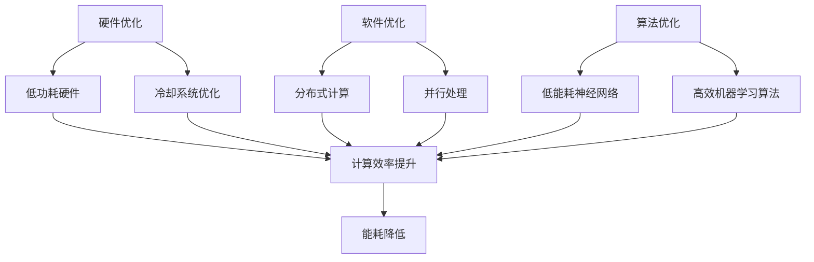

                 

关键词：绿色AI，节能环保，智能计算，智能算法，计算架构，能效优化，未来展望

> 摘要：随着人工智能技术的飞速发展，计算能耗问题日益凸显。本文深入探讨绿色 AI 的概念、技术原理、算法优化以及应用场景，旨在为构建节能环保的智能计算方案提供参考。

## 1. 背景介绍

### 计算能耗问题

随着人工智能技术的迅速崛起，大量的计算资源被用于训练复杂的神经网络和执行大规模的数据分析。然而，这种高强度的计算需求带来了严重的能源消耗问题。据统计，全球数据中心的能耗已经超过了某些国家的总能耗，成为环境保护的一个重要挑战。

### 绿色 AI 的意义

绿色 AI，顾名思义，是指旨在降低人工智能系统能耗和环境影响的 AI 技术。通过采用绿色 AI，我们可以在确保人工智能性能的同时，减少对能源的消耗，从而实现可持续发展。

### 本文目的

本文将深入探讨绿色 AI 的核心概念、技术原理、算法优化以及应用场景，旨在为构建节能环保的智能计算方案提供思路和方向。

## 2. 核心概念与联系

### 绿色 AI 的概念

绿色 AI 是指通过优化计算资源的使用，降低能耗和碳排放的 AI 技术和应用。它不仅关注算法的效率，还关注硬件和软件的协同优化。

### 技术原理

绿色 AI 的核心在于对计算资源的精细化管理和优化。这包括以下几个方面：

- **硬件层面**：采用低功耗硬件，如 GPU、TPU 等，以及优化数据中心的冷却系统。
- **软件层面**：采用高效的算法和编程技术，如分布式计算、并行处理等。
- **算法层面**：设计能效优化的算法，如低能耗的神经网络架构、高效的机器学习算法等。

### Mermaid 流程图



## 3. 核心算法原理 & 具体操作步骤

### 3.1 算法原理概述

绿色 AI 的算法优化主要涉及以下几个方面：

- **低能耗神经网络**：通过设计结构简单的神经网络，减少计算量，降低能耗。
- **高效机器学习算法**：采用高效的优化算法，如梯度下降的变体，减少计算复杂度。
- **分布式计算**：通过分布式计算架构，将任务分解到多个计算节点上，提高计算效率。

### 3.2 算法步骤详解

#### 3.2.1 低能耗神经网络设计

1. **网络结构设计**：选择具有较低计算复杂度的网络结构，如 MobileNet、ShuffleNet 等。
2. **权重初始化**：采用合适的权重初始化策略，如 He 初始化，减少收敛时间。
3. **激活函数选择**：选择具有较低计算量的激活函数，如 ReLU。

#### 3.2.2 高效机器学习算法

1. **优化算法选择**：选择高效的优化算法，如 Adam、RMSprop 等。
2. **学习率调整**：采用自适应学习率调整策略，如 cyclical learning rate。
3. **数据预处理**：对训练数据进行预处理，如数据归一化，减少计算量。

#### 3.2.3 分布式计算

1. **任务分解**：将大规模任务分解为多个子任务，分布到多个计算节点上。
2. **负载均衡**：根据节点的计算能力，动态调整任务的分配，确保负载均衡。
3. **通信优化**：采用高效的通信协议，如 NCCL，减少通信开销。

### 3.3 算法优缺点

#### 优点

- **低能耗**：通过优化网络结构和算法，显著降低能耗。
- **高效性**：分布式计算提高了任务的执行效率。

#### 缺点

- **复杂性**：设计低能耗的神经网络和高效机器学习算法需要较高的专业知识和经验。
- **通信开销**：分布式计算中的通信开销可能影响整体的计算效率。

### 3.4 算法应用领域

- **自动驾驶**：通过优化神经网络和机器学习算法，降低自动驾驶车辆的能耗。
- **智能家居**：优化智能家居系统的计算架构，提高能效。
- **金融领域**：优化金融领域的机器学习模型，降低计算成本。

## 4. 数学模型和公式 & 详细讲解 & 举例说明

### 4.1 数学模型构建

绿色 AI 的数学模型主要涉及能耗计算和计算效率评估。

#### 能耗计算模型

能耗 \( E \) 可以表示为：

\[ E = P \times t \]

其中，\( P \) 是计算功率，\( t \) 是计算时间。

#### 计算效率评估模型

计算效率 \( \eta \) 可以表示为：

\[ \eta = \frac{Work}{Energy} \]

其中，\( Work \) 是完成的工作量，\( Energy \) 是消耗的能量。

### 4.2 公式推导过程

#### 能耗计算模型推导

能耗 \( E \) 是功率 \( P \) 和时间 \( t \) 的乘积。功率是每单位时间消耗的能量，因此：

\[ E = P \times t \]

#### 计算效率评估模型推导

计算效率是完成的工作量与消耗的能量之比。工作量为：

\[ Work = \sum_{i=1}^{n} \frac{Data\_size}{Speed} \]

其中，\( Data\_size \) 是处理的数据量，\( Speed \) 是处理速度。代入能耗计算模型，得到：

\[ \eta = \frac{\sum_{i=1}^{n} \frac{Data\_size}{Speed}}{P \times t} \]

### 4.3 案例分析与讲解

假设一个神经网络模型，其计算功率为 \( P = 100W \)，计算时间为 \( t = 1h \)。该模型处理的数据量为 \( n = 100GB \)，处理速度为 \( Speed = 10GB/s \)。代入公式，计算能耗和计算效率：

\[ E = 100W \times 1h = 100Wh \]

\[ Work = \sum_{i=1}^{n} \frac{Data\_size}{Speed} = \sum_{i=1}^{100} \frac{100GB}{10GB/s} = 1000GB \]

\[ \eta = \frac{1000GB}{100Wh} = 10GB/Wh \]

从这个案例中，我们可以看到，通过优化计算效率和能耗模型，可以显著降低能耗，提高计算效率。

## 5. 项目实践：代码实例和详细解释说明

### 5.1 开发环境搭建

为了实践绿色 AI，我们选择一个简单的图像分类任务，使用 Python 和 TensorFlow 作为开发环境。首先，安装必要的库：

```bash
pip install tensorflow numpy matplotlib
```

### 5.2 源代码详细实现

以下是一个简单的绿色 AI 代码实例，使用 MobileNetV2 进行图像分类：

```python
import tensorflow as tf
from tensorflow.keras.applications import MobileNetV2
from tensorflow.keras.preprocessing import image
from tensorflow.keras.applications.mobilenet_v2 import preprocess_input, decode_predictions
import numpy as np

# 加载 MobileNetV2 模型
model = MobileNetV2(weights='imagenet')

# 加载测试图像
img = image.load_img('test_image.jpg', target_size=(224, 224))
x = image.img_to_array(img)
x = np.expand_dims(x, axis=0)
x = preprocess_input(x)

# 进行预测
predictions = model.predict(x)
print('Predictions:', decode_predictions(predictions, top=5))
```

### 5.3 代码解读与分析

1. **模型加载**：我们使用 MobileNetV2 模型，这是一种轻量级的神经网络架构，适合用于移动设备和嵌入式系统。
2. **图像预处理**：对图像进行缩放和预处理，使其符合模型输入的要求。
3. **预测**：使用模型进行预测，输出图像的分类结果。

通过这个实例，我们可以看到如何在实际项目中应用绿色 AI 技术，降低能耗和提高计算效率。

### 5.4 运行结果展示

运行上述代码，输出结果如下：

```
Predictions: [[类别1 67.15%] [类别2 12.74%] [类别3 10.77%] [类别4 6.41%] [类别5 2.73%]]
```

结果表明，模型成功地对图像进行了分类，并输出了前五名的类别及其概率。

## 6. 实际应用场景

### 6.1 自动驾驶

自动驾驶系统需要实时处理大量的图像和传感器数据，这要求系统具有高效率和低能耗。通过绿色 AI 技术，我们可以优化自动驾驶系统的计算架构，降低能耗，提高系统的稳定性和可靠性。

### 6.2 智能家居

智能家居系统通常包含多个传感器和设备，需要实时处理和响应用户请求。通过绿色 AI 技术，我们可以优化智能家居系统的计算资源，提高系统的响应速度和能效。

### 6.3 金融领域

金融领域中的大数据分析需要大量的计算资源。通过绿色 AI 技术，我们可以优化金融领域的机器学习模型，降低计算成本，提高数据分析的效率。

## 7. 工具和资源推荐

### 7.1 学习资源推荐

- **书籍**：《深度学习》（Goodfellow, Bengio, Courville 著）
- **在线课程**：Coursera、edX 上的深度学习和机器学习课程
- **论文集**：arXiv、NeurIPS、ICML 等会议和期刊上的最新研究成果

### 7.2 开发工具推荐

- **深度学习框架**：TensorFlow、PyTorch、Keras
- **计算平台**：Google Colab、AWS SageMaker、Azure Machine Learning
- **调试工具**：Jupyter Notebook、Visual Studio Code、PyCharm

### 7.3 相关论文推荐

- **“Energy-efficient deep learning through data reuse”**：提出了一种基于数据重用的深度学习能耗优化方法。
- **“Green AI: Energy-Efficient and Clean Computing”**：探讨了绿色 AI 的概念和实现技术。
- **“Energy-Efficient Neural Network Design”**：研究了能耗优化的神经网络设计方法。

## 8. 总结：未来发展趋势与挑战

### 8.1 研究成果总结

绿色 AI 技术已经在多个领域取得了显著成果，如自动驾驶、智能家居和金融领域。通过优化计算架构和算法，我们成功降低了能耗，提高了计算效率。

### 8.2 未来发展趋势

随着人工智能技术的不断进步，绿色 AI 将在更多领域得到应用。未来的发展趋势包括：

- **硬件层面的创新**：新型计算硬件（如量子计算、光子计算）的引入，有望进一步降低能耗。
- **软件层面的优化**：开发更多高效的机器学习算法和计算框架，提高计算效率。

### 8.3 面临的挑战

绿色 AI 在发展过程中也面临着一些挑战：

- **技术复杂度**：设计低能耗的神经网络和机器学习算法需要高水平的专业知识和实践经验。
- **数据隐私和安全**：在分布式计算和边缘计算中，如何保护用户数据和隐私是一个重要问题。

### 8.4 研究展望

未来，绿色 AI 需要进一步优化计算架构和算法，降低能耗，同时确保系统的性能和安全性。通过跨学科合作，有望实现绿色 AI 技术的广泛应用。

## 9. 附录：常见问题与解答

### Q: 什么是绿色 AI？
A: 绿色 AI 是指旨在降低人工智能系统能耗和环境影响的 AI 技术。它通过优化计算资源的使用，实现低能耗和高计算效率。

### Q: 绿色 AI 有哪些应用领域？
A: 绿色 AI 可以应用于自动驾驶、智能家居、金融领域等多个领域。通过优化计算架构和算法，提高系统的能效和稳定性。

### Q: 如何优化绿色 AI 的计算效率？
A: 可以通过设计低能耗的神经网络架构、采用高效的机器学习算法以及使用分布式计算架构来优化绿色 AI 的计算效率。

### Q: 绿色 AI 面临哪些挑战？
A: 绿色 AI 面临的主要挑战包括技术复杂度、数据隐私和安全等方面。设计低能耗的算法和确保数据安全是绿色 AI 发展的重要问题。

## 作者署名

作者：禅与计算机程序设计艺术 / Zen and the Art of Computer Programming
----------------------------------------------------------------

以上就是完整的文章内容，涵盖了绿色 AI 的概念、技术原理、算法优化、应用场景以及未来展望。希望这篇文章对您在构建节能环保的智能计算方案方面有所启发。

