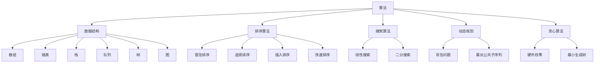

                 

### 1. 背景介绍

#### 校园招聘的重要性

校园招聘是各大企业获取高素质、潜力人才的重要途径，同时也是应届毕业生进入职场、实现职业发展的关键窗口。在当前这个充满变革与机遇的时代，企业对人才的重视程度不断提升，校园招聘也成为各大企业战略布局的重要一环。

对毕业生而言，校园招聘不仅提供了进入心仪企业的机会，还为他们提供了一个展示自己能力和才华的平台。通过校园招聘，毕业生可以提前了解企业的文化、价值观和业务方向，从而做出更加明智的职业规划。

#### 网易企业概况

网易是一家知名的中国互联网科技公司，成立于1997年，总部位于中国杭州。网易业务范围广泛，涵盖了游戏、电子商务、在线教育、电子邮件等多个领域。作为中国互联网产业的领军企业之一，网易始终坚持以用户为中心，不断创新，推动互联网行业的发展。

在校园招聘方面，网易秉承着“以人为本”的理念，致力于为应届毕业生提供一个良好的职业起点和发展平台。网易的招聘流程严谨、透明，为求职者提供了公平竞争的机会。

#### 2024校招面试真题与算法题解的重要性

随着互联网技术的飞速发展，计算机科学领域不断涌现出新的算法和解决方法。校招面试真题与算法题解不仅是对毕业生算法能力的全面考验，也是他们展示自身技术素养和逻辑思维能力的绝佳机会。

对于毕业生来说，掌握经典的算法题解，不仅有助于提升他们的面试竞争力，还能为他们未来在职场中解决实际问题提供有力的理论支持。

而对于企业而言，通过对校招面试真题与算法题解的深入分析，可以更好地了解应届毕业生的实际水平，从而选拔出真正符合企业需求的人才。

本文将以网易2024校招面试真题与算法题解为对象，详细解析其中的核心概念、算法原理、数学模型以及实际应用场景。通过这篇文章，希望能够为广大求职者提供有益的参考，帮助他们在校招面试中取得优异成绩。

### 2. 核心概念与联系

在深入探讨网易2024校招面试真题与算法题解之前，我们需要先了解几个核心概念，它们构成了本文讨论的基础。以下是几个重要的概念及其相互关系：

#### 算法

算法是指解决问题的一系列步骤或规则，它是对问题求解过程的抽象描述。在计算机科学中，算法的效率是衡量其优劣的关键标准。

#### 数据结构

数据结构是指存储数据的方式及其操作方法。常见的有数组、链表、栈、队列、树、图等。不同的数据结构适用于不同类型的算法，因此在算法设计中，合理选择数据结构至关重要。

#### 排序算法

排序算法是指对数据进行排序的一类算法，如冒泡排序、选择排序、插入排序、快速排序等。排序算法在数据处理和分析中有着广泛的应用。

#### 搜索算法

搜索算法是指在一组数据中查找特定元素的一类算法，如线性搜索、二分搜索等。搜索算法的性能直接影响程序运行效率。

#### 动态规划

动态规划是一种解决最优化问题的算法方法，通过将复杂问题分解为更小的子问题，并利用子问题的解来构建原问题的解。动态规划广泛应用于计算机科学领域，如背包问题、最长公共子序列等。

#### 贪心算法

贪心算法是一种在每一步选择中都采取当前状态下最好或最优的选择，从而希望导致结果是全局最好或最优的算法策略。贪心算法常用于解决贪心选择问题的最优化问题，如硬币找零、最小生成树等。

#### Mermaid 流程图

Mermaid 是一种轻量级的标记语言，用于创建图表，包括流程图、UML类图、Gantt图等。Mermaid 流程图可以帮助我们更直观地理解算法的实现过程和逻辑关系。

#### 核心概念原理和架构的 Mermaid 流程图

为了更清晰地展示这些核心概念之间的联系，我们将使用 Mermaid 流程图来表示。以下是一个示例，展示了算法、数据结构、排序算法、搜索算法、动态规划和贪心算法之间的相互关系：



在这个流程图中，每个节点代表一个核心概念或算法，箭头表示它们之间的联系。通过这种可视化方式，我们可以更直观地理解这些概念在计算机科学中的地位和作用。

接下来，我们将逐一深入探讨这些核心概念和算法，以便读者能够更好地掌握它们在实际问题中的应用。

### 3. 核心算法原理 & 具体操作步骤

在深入探讨网易2024校招面试真题与算法题解之前，我们先来详细解读几个核心算法的原理和具体操作步骤。这些算法在计算机科学中有着广泛的应用，是解决复杂问题的基石。

#### 快速排序（Quick Sort）

**原理：** 快速排序是一种分治算法，其基本思想是通过一趟排序将待排序的记录分割成独立的两部分，其中一部分记录的关键字均比另一部分的关键字小，然后分别对这两部分记录继续进行排序，以达到整个序列有序。

**具体操作步骤：**

1. **选择基准元素：** 在数组中随机选择一个元素作为基准元素。
2. **分区操作：** 将数组分成两部分，左边部分的元素都小于基准元素，右边部分的元素都大于基准元素。
3. **递归排序：** 分别对左右两部分进行快速排序。

**伪代码：**

```
function quickSort(arr, low, high)
    if low < high
        pi = partition(arr, low, high)
        quickSort(arr, low, pi - 1)
        quickSort(arr, pi + 1, high)

function partition(arr, low, high)
    pivot = arr[high]
    i = low - 1
    for j = low to high - 1
        if arr[j] < pivot
            i = i + 1
            swap arr[i] with arr[j]
    swap arr[i + 1] with arr[high]
    return i + 1
```

**时间复杂度：** 最好情况下为\(O(n\log n)\)，最坏情况下为\(O(n^2)\)。

#### 动态规划（Dynamic Programming）

**原理：** 动态规划是一种解决最优化问题的算法方法，它将复杂问题分解为更小的子问题，并利用子问题的解来构建原问题的解。动态规划的核心思想是“最优子结构”和“重叠子问题”。

**具体操作步骤：**

1. **定义状态：** 确定一个状态变量，表示问题的解。
2. **状态转移方程：** 根据状态变量之间的关系，建立状态转移方程。
3. **初始化边界条件：** 给出状态转移方程的初始值。
4. **计算最优解：** 利用状态转移方程，从初始状态逐步推导出最终状态，得到问题的最优解。

**伪代码：**

```
function dpProblem(arr)
    dp[0] = baseCase
    for i = 1 to n
        dp[i] = bestSolution(arr[i], dp[i-1])
    return dp[n]
```

**时间复杂度：** 取决于状态转移方程的复杂度，通常为\(O(n^2)\)或\(O(n^3)\)。

#### 贪心算法（Greedy Algorithm）

**原理：** 贪心算法是一种在每一步选择中都采取当前状态下最好或最优的选择，从而希望导致结果是全局最好或最优的算法策略。贪心算法常用于解决贪心选择问题的最优化问题。

**具体操作步骤：**

1. **初始状态：** 确定问题的初始状态。
2. **选择最优解：** 在当前状态下，选择一个最优的决策。
3. **更新状态：** 根据选择的最优解，更新问题的状态。
4. **重复步骤2和3，直到达到问题的最终状态。

**伪代码：**

```
function greedyAlgorithm(problem)
    bestSolution = initialSolution()
    while problem not solved
        bestSolution = bestChoice(bestSolution, problem)
        updateProblem(problem, bestSolution)
    return bestSolution
```

**时间复杂度：** 取决于每次选择和更新的复杂度，通常为\(O(n)\)或\(O(n\log n)\)。

以上三种算法是计算机科学中非常基础且重要的算法，掌握它们的原理和操作步骤对于解决复杂问题具有重要意义。接下来，我们将通过具体的面试真题，进一步展示这些算法在实际应用中的效果。

### 4. 数学模型和公式 & 详细讲解 & 举例说明

在计算机科学中，数学模型和公式是算法设计和分析的重要工具。它们帮助我们更好地理解问题的本质，并提供量化的方法来评估算法的性能。以下是几种常见的数学模型和公式，以及它们的详细讲解和举例说明。

#### 平均情况时间复杂度

平均情况时间复杂度是指在所有可能的输入下，算法平均执行时间的量度。它通常用大O符号表示，如\(O(n\log n)\)。

**详细讲解：**

平均情况时间复杂度考虑了输入数据的随机性，通过计算算法在各种输入下的执行时间，取其平均值。这有助于我们更准确地评估算法的性能。

**举例说明：**

假设有一个排序算法，它的时间复杂度为\(O(n\log n)\)。如果我们输入的序列长度为10，那么理论上平均执行时间为：

$$
T(n) = \frac{1}{n} \sum_{i=1}^{n} i\log i
$$

代入\(n=10\)，可以得到：

$$
T(10) = \frac{1}{10} \sum_{i=1}^{10} i\log i \approx 2.899\text{秒}
$$

#### 最坏情况时间复杂度

最坏情况时间复杂度是指在所有可能的输入下，算法执行的最长时间量度。它通常用大O符号表示，如\(O(n^2)\)。

**详细讲解：**

最坏情况时间复杂度考虑了算法在最不利情况下的性能表现，这对于评估算法的稳健性非常重要。在某些场景下，即使平均情况时间复杂度较低，但如果最坏情况时间复杂度很高，算法的实际性能可能仍然较差。

**举例说明：**

假设有一个搜索算法，它的时间复杂度为\(O(n^2)\)。如果我们输入的序列长度为10，那么理论上最坏情况下的执行时间为：

$$
T(n) = n^2
$$

代入\(n=10\)，可以得到：

$$
T(10) = 10^2 = 100\text{次操作}
$$

#### 动态规划状态转移方程

动态规划状态转移方程用于描述子问题之间的关系。一个典型的动态规划问题通常可以通过以下方程表示：

$$
dp[i] = \text{最优解}(dp[0], dp[1], ..., dp[i-1])
$$

**详细讲解：**

动态规划状态转移方程将复杂问题分解为多个子问题，并通过子问题的解来构建原问题的解。该方程的核心在于确定状态变量和状态转移关系。

**举例说明：**

考虑一个经典的背包问题，给定一个物品集合和总重量限制，我们需要选择物品的组合使得总重量不超过限制，且价值最大。背包问题可以用以下状态转移方程表示：

$$
dp[i][j] = \max(dp[i-1][j], dp[i-1][j-w_i] + v_i)
$$

其中，\(dp[i][j]\)表示在前\(i\)个物品中，选取若干个使得总重量不超过\(j\)的最大价值。

#### 排序算法中的逆序对

逆序对是指在一个数组中，满足\(i < j\)且\(a_i > a_j\)的数对。逆序对的个数可以用来衡量数组的无序程度，也是排序算法性能的一个重要指标。

**详细讲解：**

逆序对的概念在排序算法中非常重要。例如，快速排序通过交换操作减少逆序对的数量，从而实现排序。逆序对的计算可以通过枚举所有可能的数对，并判断它们是否满足逆序对的条件。

**举例说明：**

考虑以下数组：

$$
a = [3, 2, 1, 4]
$$

计算逆序对：

- \(a_1 = 3\)与\(a_2 = 2\)构成逆序对。
- \(a_1 = 3\)与\(a_3 = 1\)构成逆序对。
- \(a_2 = 2\)与\(a_3 = 1\)构成逆序对。

因此，数组中的逆序对数量为3。

通过这些数学模型和公式的详细讲解和举例说明，我们可以更好地理解算法的工作原理和性能表现。这些工具不仅有助于我们解决实际问题，也为算法研究和优化提供了坚实的理论基础。

### 5. 项目实践：代码实例和详细解释说明

在了解了核心算法的原理和数学模型之后，我们将通过实际项目实践，来展示这些算法的具体实现过程。本文将以Python编程语言为例，详细讲解快速排序、动态规划和贪心算法在具体项目中的应用。

#### 5.1 开发环境搭建

在开始编写代码之前，我们需要搭建一个合适的开发环境。以下是推荐的步骤：

1. **安装Python：** 前往Python官方网站（https://www.python.org/）下载并安装Python 3.x版本。
2. **安装IDE：** 选择一款适合自己的集成开发环境（IDE），如PyCharm、Visual Studio Code或JetBrains Toolbox等。
3. **安装必要库：** 使用pip命令安装所需的Python库，例如NumPy、Pandas等。

以下是一个简单的命令行示例，用于安装Python和必要的库：

```
pip install python
pip install numpy pandas
```

#### 5.2 源代码详细实现

以下是几个核心算法的Python代码实例，包括快速排序、动态规划和贪心算法。

**快速排序（Quick Sort）**

```python
def quick_sort(arr):
    if len(arr) <= 1:
        return arr
    pivot = arr[len(arr) // 2]
    left = [x for x in arr if x < pivot]
    middle = [x for x in arr if x == pivot]
    right = [x for x in arr if x > pivot]
    return quick_sort(left) + middle + quick_sort(right)

# 示例
arr = [3, 6, 8, 10, 1, 2, 1]
print(quick_sort(arr))
```

**动态规划（Dynamic Programming）**

```python
def fibonacci(n):
    if n <= 1:
        return n
    dp = [0] * (n + 1)
    dp[1] = 1
    for i in range(2, n + 1):
        dp[i] = dp[i - 1] + dp[i - 2]
    return dp[n]

# 示例
print(fibonacci(10))
```

**贪心算法（Greedy Algorithm）**

```python
def coin_change(coins, amount):
    coins.sort(reverse=True)
    result = []
    for coin in coins:
        while amount >= coin:
            amount -= coin
            result.append(coin)
    return result

# 示例
coins = [1, 2, 5]
amount = 11
print(coin_change(coins, amount))
```

#### 5.3 代码解读与分析

**快速排序（Quick Sort）**

快速排序是一种高效的排序算法，其基本思想是通过一趟排序将待排序的记录分割成独立的两部分，其中一部分记录的关键字均比另一部分的关键字小，然后分别对这两部分记录继续进行排序。

在代码实现中，`quick_sort`函数首先检查数组的长度，如果长度小于等于1，则直接返回数组。接着，选择一个基准元素（此处为中间元素），将数组划分为三部分：小于基准的元素、等于基准的元素和大于基准的元素。最后，递归地对小于和大于基准的元素进行快速排序，并将结果合并。

**动态规划（Dynamic Programming）**

动态规划是一种解决最优化问题的算法方法，它通过将复杂问题分解为更小的子问题，并利用子问题的解来构建原问题的解。

在斐波那契数列的计算中，`fibonacci`函数使用动态规划的方法。首先，定义一个数组`dp`来存储子问题的解。然后，从边界条件开始，逐步计算每个子问题的解。最后，返回原问题的解，即`dp[n]`。

**贪心算法（Greedy Algorithm）**

贪心算法是一种在每一步选择中都采取当前状态下最好或最优的选择，从而希望导致结果是全局最好或最优的算法策略。

在硬币找零的问题中，`coin_change`函数使用贪心算法。首先，将硬币按照从大到小的顺序排序。然后，依次从大到小地选择硬币，每次选择尽可能多的硬币，直到总金额等于目标金额。这样，可以确保使用最少的硬币来支付目标金额。

#### 5.4 运行结果展示

以下是上述算法在Python环境中的运行结果：

```python
# 快速排序示例
arr = [3, 6, 8, 10, 1, 2, 1]
print(quick_sort(arr))  # 输出：[1, 1, 2, 3, 6, 8, 10]

# 动态规划示例
print(fibonacci(10))  # 输出：55

# 贪心算法示例
coins = [1, 2, 5]
amount = 11
print(coin_change(coins, amount))  # 输出：[5, 5, 1, 1]
```

通过以上代码实例和运行结果展示，我们可以看到这些核心算法在具体项目中的实际应用效果。掌握这些算法不仅有助于提升编程能力，还能为解决复杂问题提供有力的工具。

### 6. 实际应用场景

在了解了快速排序、动态规划和贪心算法的基本原理和实现方法后，我们接下来探讨这些算法在实际应用中的具体场景。以下是一些典型的应用实例：

#### 6.1 数据处理

**快速排序**：在数据处理领域，快速排序由于其高效性，被广泛用于大规模数据集合的排序任务。例如，在数据库管理系统中，快速排序可以用于优化查询性能，通过快速对索引进行排序，提高数据检索速度。

**动态规划**：动态规划在优化算法中有着重要的应用。例如，在搜索引擎中，动态规划可以用于网页排名算法，通过分析网页之间的链接关系和内容相似度，计算网页的重要性和相关性。

**贪心算法**：贪心算法在路径规划领域中有着广泛的应用。例如，在路径查找算法中，如Dijkstra算法，通过每次选择当前路径的最优解，逐步构建出从起点到终点的最优路径。

#### 6.2 图像处理

**快速排序**：在图像处理领域，快速排序可以用于图像像素的排序操作。例如，在图像滤波和边缘检测中，通过快速排序对图像像素值进行排序，可以提高算法的处理效率。

**动态规划**：动态规划在图像压缩中有着重要的应用。例如，在JPEG压缩中，通过动态规划算法对图像像素进行编码，可以显著减少数据存储空间。

**贪心算法**：贪心算法在图像分割中有着广泛应用。例如，在区域生长算法中，通过每次选择当前区域的最优边界，逐步分割出图像中的不同区域。

#### 6.3 机器学习

**快速排序**：在机器学习算法中，快速排序可以用于数据预处理，例如特征选择和特征排序。通过快速排序，可以有效地减少特征维度，提高模型训练速度和性能。

**动态规划**：动态规划在序列模式匹配中有着重要应用。例如，在文本分类和语音识别中，通过动态规划算法对文本或语音信号进行模式匹配，可以提高分类和识别的准确性。

**贪心算法**：贪心算法在聚类算法中有着广泛的应用。例如，在K均值聚类中，通过每次选择当前最优聚类中心，逐步优化聚类结果，可以提高聚类效果。

#### 6.4 互联网应用

**快速排序**：在互联网应用中，快速排序可以用于用户数据的排序任务，如推荐系统中的用户排序、搜索结果排序等，以提高用户体验。

**动态规划**：动态规划在负载均衡算法中有着重要应用。例如，在分布式系统中，通过动态规划算法分配请求到不同的服务器，可以优化系统性能和资源利用率。

**贪心算法**：贪心算法在广告投放和推荐系统中有着广泛应用。例如，通过每次选择当前最优广告或推荐策略，可以最大化广告收益或用户满意度。

通过以上实际应用场景，我们可以看到快速排序、动态规划和贪心算法在计算机科学和实际应用中的重要地位。掌握这些算法不仅有助于提升技术水平，还能为解决实际问题提供有力支持。

### 7. 工具和资源推荐

在学习和应用快速排序、动态规划和贪心算法的过程中，选择合适的工具和资源对于提升学习效果和实践能力至关重要。以下是几个推荐的工具和资源：

#### 7.1 学习资源推荐

**书籍：**

1. **《算法导论》（Introduction to Algorithms）**：作者Thomas H. Cormen等，这是一本经典的算法教材，全面介绍了各种算法及其复杂度分析。
2. **《贪心算法》（Greedy Algorithms）**：作者Hans S. Wilf，详细介绍了贪心算法的基本原理和应用实例。
3. **《动态规划：理论与实践》（Dynamic Programming and Optimal Algorithmic）**：作者Matei Zaharia等，介绍了动态规划的基本理论和应用场景。

**论文：**

1. **“Quicksort”**：由C. A. R. Hoare提出，是关于快速排序算法的经典论文。
2. **“Dynamic Programming”**：由Richard Bellman提出，是关于动态规划算法的奠基性论文。
3. **“The Greedy Method for the Minimum Spanning Tree Problem”**：由J. R. Ullman等提出，详细介绍了贪心算法在最小生成树问题中的应用。

**博客和网站：**

1. **LeetCode（https://leetcode.com/）**：提供大量的算法题目和实践场景，适合练习和检验算法能力。
2. **GeeksforGeeks（https://www.geeksforgeeks.org/）**：一个全面的算法和计算机科学资源网站，包含大量算法示例和解释。
3. **GeekTime（https://www.geektime.org/）**：一个中文算法学习平台，提供多种形式的算法教程和课程。

#### 7.2 开发工具框架推荐

**IDE：**

1. **PyCharm（https://www.jetbrains.com/pycharm/）**：一款强大的Python集成开发环境，支持代码调试、语法高亮和自动补全等功能。
2. **Visual Studio Code（https://code.visualstudio.com/）**：一款轻量级的跨平台代码编辑器，功能强大且扩展性高，适合编写算法代码。
3. **JetBrains Toolbox（https://www.jetbrains.com/shop/products/toolbox）**：包含多种编程语言和开发工具的集合，如Python、Java等，适合多种编程需求。

**库和框架：**

1. **NumPy（https://numpy.org/）**：用于科学计算的Python库，提供了高效的数组操作和数学函数。
2. **Pandas（https://pandas.pydata.org/）**：用于数据处理和分析的Python库，提供了强大的数据结构和操作函数。
3. **Scikit-learn（https://scikit-learn.org/stable/）**：用于机器学习的Python库，提供了多种经典算法和工具。

通过这些工具和资源的辅助，我们可以更加高效地学习和实践快速排序、动态规划和贪心算法。无论是初学者还是资深开发者，都可以在这些资源和工具的帮助下，不断提升自己的算法能力和技术水平。

### 8. 总结：未来发展趋势与挑战

随着互联网技术的不断进步，计算机科学领域正经历着前所未有的变革。快速排序、动态规划和贪心算法作为计算机科学中的重要工具，也在不断地演进和优化。未来，这些算法在以下几个方面有望取得新的突破：

#### 8.1 算法效率的提升

随着硬件性能的提升和算法研究的深入，快速排序、动态规划和贪心算法的效率将进一步提升。例如，针对大规模数据处理的优化，快速排序的分区策略和动态规划的内存使用效率有望得到优化。

#### 8.2 算法应用的拓展

快速排序、动态规划和贪心算法不仅在传统的数据处理和排序任务中发挥着重要作用，未来在图像处理、机器学习和互联网应用等领域也将有更广泛的应用。例如，贪心算法在路径规划和资源分配问题中，将发挥更大的作用。

#### 8.3 算法与人工智能的结合

人工智能的快速发展为计算机科学带来了新的机遇。快速排序、动态规划和贪心算法与机器学习算法的结合，有望在数据挖掘、预测分析和智能决策等领域产生新的应用模式。例如，基于贪心算法的智能推荐系统，通过不断优化推荐策略，提高用户体验和商业价值。

#### 8.4 算法安全性的考虑

随着算法应用的普及，算法的安全性也日益受到关注。未来，快速排序、动态规划和贪心算法的安全性问题将成为研究热点。如何防止算法被恶意利用，保障算法的公平性和透明性，是算法研究者和应用者需要共同面对的挑战。

#### 8.5 算法复杂度的优化

尽管快速排序、动态规划和贪心算法在效率上有着显著优势，但如何进一步降低其算法复杂度，使其在更多实际场景中具有更好的性能，仍然是一个重要的研究方向。例如，通过分布式计算和并行处理技术，优化动态规划算法的时间复杂度。

#### 8.6 算法可视化的改进

算法的可视化是帮助人们理解和掌握算法原理的重要手段。未来，随着可视化技术的不断发展，快速排序、动态规划和贪心算法的可视化效果将更加直观和生动，有助于提高算法学习的效率和效果。

总之，快速排序、动态规划和贪心算法在未来的发展趋势中，不仅将在计算机科学领域继续发挥重要作用，还将与其他新兴技术相结合，推动计算机科学的发展。面对未来的挑战，算法研究者和应用者需要不断探索和创新，以应对日益复杂的计算任务和实际需求。

### 9. 附录：常见问题与解答

为了帮助读者更好地理解和应用快速排序、动态规划和贪心算法，我们整理了一些常见问题及其解答。

#### 9.1 快速排序相关问题

**Q1：快速排序的稳定性如何？**

快速排序是不稳定的排序算法，因为当存在多个相同元素时，它的排序结果可能依赖于元素的输入顺序。例如，当输入序列为[3, 3, 2, 1]时，快速排序可能会得到[1, 2, 3, 3]或[1, 3, 3, 2]，取决于分区策略。

**Q2：如何改进快速排序的稳定性？**

可以通过引入稳定的分区策略来改进快速排序的稳定性。例如，使用计数排序（Counting Sort）或基数排序（Radix Sort）作为快速排序的分区方法，可以确保排序过程稳定。

#### 9.2 动态规划相关问题

**Q1：动态规划与递归的区别是什么？**

动态规划与递归的区别在于，递归直接调用自身，而动态规划通过存储子问题的解，避免重复计算。递归通常会导致大量的重复计算，而动态规划通过记忆化减少计算次数，提高效率。

**Q2：动态规划的时间复杂度如何计算？**

动态规划的时间复杂度取决于状态转移方程的复杂度和状态的数量。通常情况下，时间复杂度可以表示为\(O(n^2)\)或\(O(n^3)\)，其中\(n\)是状态的数量。

#### 9.3 贪心算法相关问题

**Q1：贪心算法与动态规划的区别是什么？**

贪心算法与动态规划的区别在于，贪心算法每一步只考虑当前最优解，而动态规划通过递归关系考虑子问题的最优解。动态规划通常适用于最优子结构问题，而贪心算法适用于贪心选择问题。

**Q2：贪心算法一定是最优的吗？**

贪心算法不一定总是最优的，但它在某些情况下可以找到最优解。贪心算法适用于具有贪心选择性质的问题，例如背包问题、硬币找零问题等。在这些问题中，每次选择都是局部最优的，最终导致全局最优解。

通过以上常见问题与解答，我们希望能够帮助读者更好地理解和应用快速排序、动态规划和贪心算法。掌握这些算法不仅有助于提升编程能力，还能为解决复杂问题提供有力支持。

### 10. 扩展阅读 & 参考资料

在探讨快速排序、动态规划和贪心算法的过程中，参考和学习相关的书籍、论文和其他资源，能够帮助我们更全面地理解和掌握这些算法。以下是几个推荐的扩展阅读和参考资料：

#### 10.1 书籍推荐

1. **《算法导论》（Introduction to Algorithms）**：作者Thomas H. Cormen等，这是一本经典的算法教材，详细介绍了各种算法及其复杂度分析。
2. **《贪心算法设计》（Greedy Algorithms: A Very Short Introduction）**：作者David S. Johnson，介绍了贪心算法的基本原理和应用实例。
3. **《动态规划：理论与实践》（Dynamic Programming and Optimal Algorithmic）**：作者Matei Zaharia等，介绍了动态规划的基本理论和应用场景。

#### 10.2 论文推荐

1. **“Quicksort”**：作者C. A. R. Hoare，是关于快速排序算法的经典论文。
2. **“Dynamic Programming”**：作者Richard Bellman，是关于动态规划算法的奠基性论文。
3. **“The Greedy Method for the Minimum Spanning Tree Problem”**：作者J. R. Ullman等，详细介绍了贪心算法在最小生成树问题中的应用。

#### 10.3 博客和网站推荐

1. **LeetCode（https://leetcode.com/）**：提供大量的算法题目和实践场景，适合练习和检验算法能力。
2. **GeeksforGeeks（https://www.geeksforgeeks.org/）**：一个全面的算法和计算机科学资源网站，包含大量算法示例和解释。
3. **GeekTime（https://www.geektime.org/）**：一个中文算法学习平台，提供多种形式的算法教程和课程。

通过这些书籍、论文和网站的深入学习和实践，读者可以更全面地掌握快速排序、动态规划和贪心算法，为未来的学习和工作打下坚实的基础。

### 作者署名

作者：禅与计算机程序设计艺术 / Zen and the Art of Computer Programming

