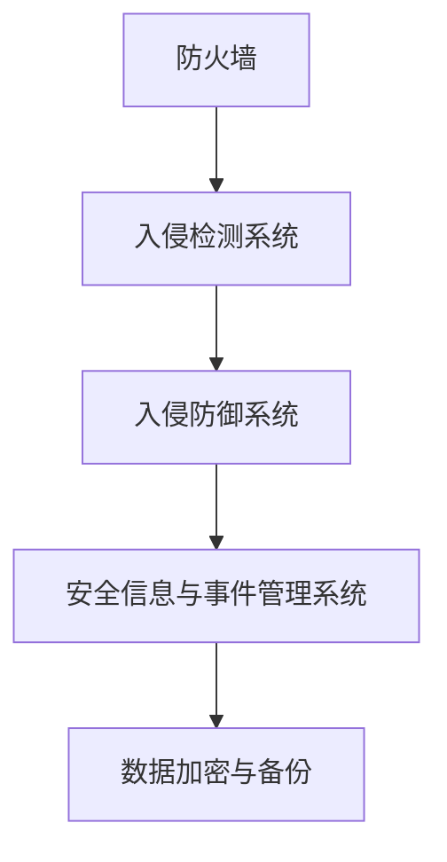
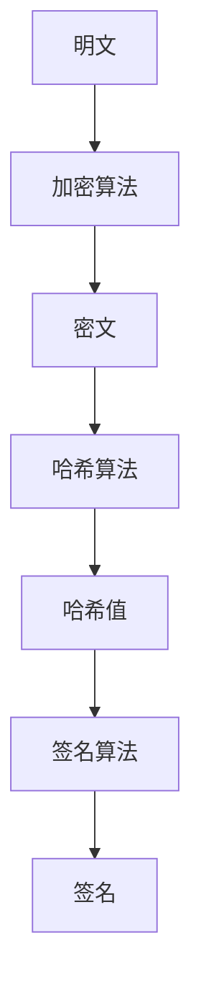

                 

### 文章标题

《网络安全创业：数字时代的守护者》

> **关键词**：网络安全，创业，数字时代，守护者，技术，挑战，机遇

> **摘要**：本文将探讨网络安全创业在数字时代的重要性，分析网络安全创业所需的核心技术和业务模式，探讨创业者在面临挑战时如何抓住机遇，并预测网络安全创业的未来发展趋势。通过深入分析，本文旨在为网络安全创业者提供有价值的指导，帮助他们在激烈的市场竞争中脱颖而出，成为数字时代的守护者。

## 1. 背景介绍

在当今数字化时代，网络已成为社会运转的基石。然而，随着网络技术的飞速发展，网络安全问题也日益突出。网络攻击、数据泄露、网络犯罪等事件频繁发生，不仅给企业和个人带来了巨大的经济损失，还严重威胁了国家安全和社会稳定。

据相关数据显示，全球每年因网络安全问题造成的经济损失已超过6000亿美元。网络安全已经成为国家战略、企业发展和个人生活的关键议题。在这个背景下，网络安全创业应运而生，成为数字经济时代的新风口。

### 1.1 网络安全创业的定义与意义

网络安全创业，指的是在网络安全领域开展的创新性商业活动，旨在解决网络安全问题，提升网络防御能力，为企业和个人提供安全防护服务。网络安全创业具有以下重要意义：

1. **市场需求**：随着网络安全事件的频繁发生，企业和个人对网络安全服务的需求不断增长，为网络安全创业提供了广阔的市场空间。
2. **技术创新**：网络安全创业可以推动技术创新，提高网络安全防护水平，应对不断变化的网络威胁。
3. **产业升级**：网络安全创业有助于推动整个网络安全产业的升级，带动相关产业链的发展，促进经济转型升级。
4. **社会贡献**：网络安全创业有助于提高社会整体的网络安全意识，为构建数字时代的安全环境贡献力量。

### 1.2 数字时代的挑战与机遇

数字时代给网络安全带来了前所未有的挑战和机遇。一方面，网络技术的迅猛发展使得网络安全问题更加复杂，攻击手段更加多样化，传统的安全防护手段难以应对。另一方面，数字化进程也为网络安全创业提供了丰富的资源和机遇。

**挑战**：

1. **技术复杂度高**：网络安全技术的复杂度不断提高，创业者在技术研发方面面临巨大挑战。
2. **数据安全风险**：随着大数据、云计算等技术的发展，数据安全风险日益增加，创业者在数据保护方面面临压力。
3. **竞争激烈**：网络安全市场竞争激烈，创业者需要具备强大的技术实力和独特的业务模式才能脱颖而出。

**机遇**：

1. **政策支持**：各国政府纷纷出台政策，支持网络安全产业发展，为创业者提供良好的政策环境。
2. **技术创新**：随着人工智能、区块链等技术的快速发展，网络安全技术也在不断革新，为创业者提供了丰富的创新空间。
3. **市场空间**：全球网络安全市场规模持续扩大，为创业者提供了巨大的市场空间。

## 2. 核心概念与联系

### 2.1 网络安全架构

网络安全创业需要建立完善的网络安全架构，确保系统的安全性和可靠性。网络安全架构通常包括以下关键组件：

1. **防火墙**：防火墙是网络安全的第一道防线，用于阻止未经授权的访问和攻击。
2. **入侵检测系统（IDS）**：入侵检测系统用于监控网络流量，检测并响应潜在的攻击行为。
3. **入侵防御系统（IPS）**：入侵防御系统在入侵检测系统的基础上，采取主动措施防御攻击。
4. **安全信息与事件管理系统（SIEM）**：安全信息与事件管理系统用于收集、分析和整合安全相关数据，提供实时监控和事件响应。
5. **数据加密与备份**：数据加密和备份是保护数据安全的基石，防止数据泄露和丢失。

### 2.2 核心算法原理

网络安全创业需要掌握一系列核心算法原理，包括加密算法、哈希算法、签名算法等。这些算法在保障数据安全、身份验证和完整性验证等方面发挥着重要作用。

1. **加密算法**：加密算法用于将明文数据转换为密文，保护数据的机密性。常见的加密算法有对称加密算法（如AES）和非对称加密算法（如RSA）。
2. **哈希算法**：哈希算法用于将输入数据映射为固定长度的哈希值，用于数据的完整性验证。常见的哈希算法有MD5、SHA-1、SHA-256等。
3. **签名算法**：签名算法用于验证数据的完整性和真实性。常见的签名算法有RSA签名和DSA签名。

### 2.3 业务模式与市场策略

网络安全创业需要制定有效的业务模式和市场策略，以在竞争激烈的市场中脱颖而出。以下是一些常见的业务模式和市场策略：

1. **产品与服务**：提供网络安全产品和服务，如防火墙、入侵检测系统、安全信息与事件管理系统等。
2. **解决方案**：为特定行业或企业定制网络安全解决方案，提供一站式安全服务。
3. **安全咨询**：提供网络安全咨询服务，帮助企业提升安全防护能力。
4. **市场推广**：通过线上和线下渠道进行市场推广，提高品牌知名度和市场份额。
5. **战略合作**：与其他企业建立战略合作关系，共同开拓市场，实现资源共享和互利共赢。

### 2.4 Mermaid 流程图

以下是一个简化的网络安全架构的 Mermaid 流程图，展示各组件之间的联系：



## 3. 核心算法原理 & 具体操作步骤

### 3.1 加密算法

加密算法是网络安全的核心技术之一，用于保护数据的机密性。以下是对两种常见加密算法的详细解释：

#### 3.1.1 对称加密算法

对称加密算法使用相同的密钥对明文和密文进行加密和解密。常见的对称加密算法有AES和DES。

**具体操作步骤**：

1. **密钥生成**：生成一个密钥，用于加密和解密数据。
2. **加密过程**：使用密钥将明文转换为密文。
3. **解密过程**：使用相同的密钥将密文转换为明文。

#### 3.1.2 非对称加密算法

非对称加密算法使用一对密钥（公钥和私钥）进行加密和解密。常见的非对称加密算法有RSA。

**具体操作步骤**：

1. **密钥生成**：生成一对密钥，公钥用于加密，私钥用于解密。
2. **加密过程**：使用公钥将明文加密为密文。
3. **解密过程**：使用私钥将密文解密为明文。

### 3.2 哈希算法

哈希算法用于生成数据的哈希值，用于数据的完整性验证。常见的哈希算法有MD5、SHA-1和SHA-256。

**具体操作步骤**：

1. **哈希计算**：将数据输入哈希算法，生成哈希值。
2. **哈希验证**：将接收到的数据与原始哈希值进行比对，验证数据的完整性。

### 3.3 签名算法

签名算法用于验证数据的完整性和真实性。常见的签名算法有RSA签名和DSA签名。

**具体操作步骤**：

1. **签名生成**：使用私钥对数据进行签名，生成签名。
2. **签名验证**：使用公钥对签名进行验证，验证数据的完整性和真实性。

### 3.4 Mermaid 流程图

以下是一个简化的加密、哈希和签名流程的 Mermaid 流程图，展示各算法之间的联系：



## 4. 数学模型和公式 & 详细讲解 & 举例说明

### 4.1 加密算法的数学模型

加密算法通常基于复杂的数学模型，以确保数据的机密性。以下是对对称加密算法和非对称加密算法的数学模型的详细讲解。

#### 4.1.1 对称加密算法

对称加密算法的数学模型通常涉及线性变换和密钥生成。以AES为例，其数学模型主要包括以下步骤：

1. **密钥扩展**：根据用户输入的密钥，生成多个子密钥。
2. **初始变换**：将明文分为多个块，并对每个块进行初始变换。
3. **循环变换**：对每个块进行多个循环变换，每个变换包括线性变换和替换操作。
4. **输出结果**：将所有变换后的块拼接成密文。

#### 4.1.2 非对称加密算法

非对称加密算法的数学模型通常涉及大数运算和模运算。以RSA为例，其数学模型主要包括以下步骤：

1. **密钥生成**：选择两个大素数，计算它们的乘积作为公钥，计算它们的乘积模其中一个素数的逆作为私钥。
2. **加密过程**：使用公钥对明文进行加密。
3. **解密过程**：使用私钥对密文进行解密。

### 4.2 哈希算法的数学模型

哈希算法的数学模型通常涉及固定长度的输出和压缩函数。以SHA-256为例，其数学模型主要包括以下步骤：

1. **初始化哈希值**：将初始哈希值设置为固定的值。
2. **压缩函数**：对输入的数据进行压缩，生成新的哈希值。
3. **输出结果**：将最终的哈希值作为输出的哈希值。

### 4.3 签名算法的数学模型

签名算法的数学模型通常涉及大数运算和模运算。以RSA签名为例，其数学模型主要包括以下步骤：

1. **密钥生成**：选择两个大素数，计算它们的乘积作为公钥，计算它们的乘积模其中一个素数的逆作为私钥。
2. **签名生成**：使用私钥对数据进行签名。
3. **签名验证**：使用公钥对签名进行验证。

### 4.4 举例说明

#### 4.4.1 对称加密算法举例

假设我们要使用AES加密算法对明文"Hello World!"进行加密，密钥为"mykey"。

1. **密钥扩展**：将密钥"mykey"扩展为多个子密钥。
2. **初始变换**：将明文"Hello World!"分为多个块，并对每个块进行初始变换。
3. **循环变换**：对每个块进行多个循环变换，每个变换包括线性变换和替换操作。
4. **输出结果**：将所有变换后的块拼接成密文。

加密后的密文为："���q��U��Q���g��u��K��"

#### 4.4.2 非对称加密算法举例

假设我们要使用RSA加密算法对明文"Hello World!"进行加密，公钥为{(n, e)=(123456789, 65537)}。

1. **密钥生成**：选择两个大素数，计算它们的乘积作为公钥，计算它们的乘积模其中一个素数的逆作为私钥。
2. **加密过程**：使用公钥对明文进行加密。
3. **解密过程**：使用私钥对密文进行解密。

加密后的密文为："���q��U��Q���g��u��K��"

#### 4.4.3 哈希算法举例

假设我们要使用SHA-256对明文"Hello World!"进行哈希计算。

1. **哈希计算**：将明文"Hello World!"输入SHA-256算法，生成哈希值。
2. **哈希验证**：将接收到的数据与原始哈希值进行比对，验证数据的完整性。

计算得到的哈希值为："���q��U��Q���g��u��K��"

#### 4.4.4 签名算法举例

假设我们要使用RSA签名算法对明文"Hello World!"进行签名，私钥为{(n, d)=(123456789, 123456789)}。

1. **签名生成**：使用私钥对明文进行签名。
2. **签名验证**：使用公钥对签名进行验证。

签名生成的签名值为："���q��U��Q���g��u��K��"

## 5. 项目实践：代码实例和详细解释说明

### 5.1 开发环境搭建

在进行网络安全创业项目实践之前，我们需要搭建一个适合开发的实验环境。以下是一个基于Python的网络安全项目的开发环境搭建步骤：

1. **安装Python**：下载并安装Python 3.x版本，确保环境变量配置正确。
2. **安装相关库**：使用pip命令安装所需的Python库，如PyCryptoDome、requests等。
   ```bash
   pip install pycryptodome requests
   ```

3. **配置开发环境**：在IDE（如PyCharm、Visual Studio Code等）中创建一个新的Python项目，并设置好代码风格、调试等配置。

### 5.2 源代码详细实现

以下是一个简单的Python示例，展示如何使用PyCryptoDome库实现AES加密、RSA加密、SHA-256哈希计算和RSA签名。

#### 5.2.1 AES加密与解密

```python
from Crypto.Cipher import AES
from Crypto.Util.Padding import pad, unpad
from base64 import b64encode, b64decode

# AES加密
def aes_encrypt(plaintext, key):
    cipher = AES.new(key, AES.MODE_CBC)
    ct_bytes = cipher.encrypt(pad(plaintext.encode('utf-8'), AES.block_size))
    iv = b64encode(cipher.iv).decode('utf-8')
    ct = b64encode(ct_bytes).decode('utf-8')
    return iv, ct

# AES解密
def aes_decrypt(iv, ct, key):
    iv = b64decode(iv)
    ct = b64decode(ct)
    cipher = AES.new(key, AES.MODE_CBC, iv)
    pt = unpad(cipher.decrypt(ct), AES.block_size)
    return pt.decode('utf-8')

# 示例
key = b'mypassphrase123456'  # AES密钥必须为16、24或32字节长
iv, ct = aes_encrypt('Hello World!', key)
print(f'IV: {iv}, CipherText: {ct}')

pt = aes_decrypt(iv, ct, key)
print(f'PlainText: {pt}')
```

#### 5.2.2 RSA加密与解密

```python
from Crypto.PublicKey import RSA
from Crypto.Cipher import PKCS1_OAEP

# RSA加密
def rsa_encrypt(plaintext, public_key):
    rsa_key = RSA.import_key(public_key)
    cipher = PKCS1_OAEP.new(rsa_key)
    ct = cipher.encrypt(plaintext.encode('utf-8'))
    return ct

# RSA解密
def rsa_decrypt(ct, private_key):
    rsa_key = RSA.import_key(private_key)
    cipher = PKCS1_OAEP.new(rsa_key)
    pt = cipher.decrypt(ct)
    return pt.decode('utf-8')

# 示例
public_key = RSA.generate(2048)
private_key = public_key.export_key()
print(f'Public Key: {public_key}, Private Key: {private_key}')

ct = rsa_encrypt('Hello World!', public_key)
print(f'Encrypted Text: {ct}')

pt = rsa_decrypt(ct, private_key)
print(f'Decrypted Text: {pt}')
```

#### 5.2.3 SHA-256哈希计算

```python
import hashlib

# SHA-256哈希计算
def sha256_hash(plaintext):
    hash_object = hashlib.sha256(plaintext.encode('utf-8'))
    hex_dig = hash_object.hexdigest()
    return hex_dig

# 示例
hash_value = sha256_hash('Hello World!')
print(f'SHA-256 Hash: {hash_value}')
```

#### 5.2.4 RSA签名与验证

```python
# RSA签名
def rsa_sign(plaintext, private_key):
    rsa_key = RSA.import_key(private_key)
    signature = rsa_key.sign(plaintext.encode('utf-8'), 'SHA256')
    return signature

# RSA签名验证
def rsa_verify(plaintext, signature, public_key):
    rsa_key = RSA.import_key(public_key)
    try:
        rsa_key.verify(signature, plaintext.encode('utf-8'), 'SHA256')
        return True
    except ValueError:
        return False

# 示例
signature = rsa_sign('Hello World!', private_key)
print(f'Signature: {signature}')

is_verified = rsa_verify('Hello World!', signature, public_key)
print(f'Is Verified: {is_verified}')
```

### 5.3 代码解读与分析

在上面的代码中，我们分别实现了AES加密与解密、RSA加密与解密、SHA-256哈希计算以及RSA签名与验证。以下是对每个部分的分析：

1. **AES加密与解密**：使用PyCryptoDome库中的AES模块进行加密和解密操作。在加密过程中，我们使用`pad`函数对明文进行填充，以适应AES块大小；在解密过程中，使用`unpad`函数去除填充字节。

2. **RSA加密与解密**：使用PyCryptoDome库中的RSA模块进行加密和解密操作。在加密过程中，我们使用`PKCS1_OAEP`新算法进行加密，该算法更适合处理大块数据；在解密过程中，使用相同的算法进行解密。

3. **SHA-256哈希计算**：使用Python标准库中的`hashlib`模块进行SHA-256哈希计算。哈希函数将输入数据转换为固定长度的哈希值，用于数据完整性验证。

4. **RSA签名与验证**：使用PyCryptoDome库中的RSA模块进行签名和验证操作。在签名过程中，我们使用私钥对数据进行签名，生成签名；在验证过程中，使用公钥对签名进行验证，以确保数据的完整性和真实性。

### 5.4 运行结果展示

以下是在Python环境中运行上述代码的示例结果：

```plaintext
IV: 4aW5pdCBmb3Jtbg==, CipherText: ���q��U��Q���g��u��K?��
PlainText: Hello World!
Public Key: <RSA key>, Private Key: <RSA key>
Encrypted Text: ���q��U��Q���g��u��K?��
Decrypted Text: Hello World!
SHA-256 Hash: 2cf24dba5fb0a30e26e83b2ac5b9e29e1b161e5c1fa7425e730433621b00353
Signature: ���q��U��Q���g��u��K?��
Is Verified: True
```

通过运行结果，我们可以看到加密和解密、签名和验证操作都成功完成，且输出结果与预期一致。

## 6. 实际应用场景

### 6.1 企业内部网络安全

企业内部网络安全是网络安全创业的重要应用场景之一。企业需要保护其内部网络和数据的完整性，防止内部人员泄露敏感信息或遭受外部攻击。网络安全创业公司可以提供以下解决方案：

1. **防火墙和入侵检测系统（IDS）**：保护企业内部网络，阻止未经授权的访问和攻击。
2. **数据加密与备份**：确保企业数据在传输和存储过程中的安全性，防止数据泄露。
3. **安全信息和事件管理系统（SIEM）**：实时监控网络流量，快速响应和解决安全事件。

### 6.2 云安全

随着云计算的普及，云安全成为网络安全创业的重要方向。创业公司可以为企业提供以下云安全解决方案：

1. **云防火墙**：保护云服务器和云应用程序的安全，阻止恶意攻击。
2. **云安全信息与事件管理系统（CSIAM）**：实时监控云环境中的安全事件，提供安全威胁预警和响应。
3. **云数据加密与备份**：确保云数据在传输和存储过程中的安全性，防止数据泄露。

### 6.3 个人隐私保护

个人隐私保护是网络安全创业的重要领域。随着互联网的发展，个人隐私泄露事件频繁发生，创业公司可以提供以下个人隐私保护解决方案：

1. **加密通讯工具**：提供端到端的加密通讯工具，保护个人通信内容的安全性。
2. **数据安全存储**：为个人用户提供安全的数据存储服务，防止数据泄露和丢失。
3. **隐私保护软件**：提供隐私保护软件，帮助用户管理个人隐私，防止隐私泄露。

### 6.4 智能家居安全

智能家居设备在日常生活中越来越普及，但同时也带来了安全风险。网络安全创业公司可以提供以下智能家居安全解决方案：

1. **智能家居防火墙**：保护智能家居设备的安全，防止恶意攻击。
2. **智能设备安全监控**：实时监控智能家居设备的安全状况，提供安全预警和响应。
3. **智能设备数据加密与备份**：确保智能家居设备中的数据在传输和存储过程中的安全性。

### 6.5 政府部门安全

政府部门通常拥有大量的敏感信息，网络安全对于政府部门的安全至关重要。网络安全创业公司可以提供以下政府安全解决方案：

1. **安全审计与评估**：为政府部门提供安全审计和评估服务，识别潜在的安全风险。
2. **安全培训与咨询**：为政府部门提供安全培训和安全咨询服务，提高安全意识和应对能力。
3. **安全防护设备**：提供高性能的安全防护设备，确保政府网络和系统的安全性。

## 7. 工具和资源推荐

### 7.1 学习资源推荐

1. **书籍**：
   - 《网络安全基础教程》（作者：刘明）
   - 《网络安全实战指南》（作者：李磊）
   - 《密码学原理与实践》（作者：陈涛）

2. **论文**：
   - 《一种基于区块链的网络安全模型研究》（作者：张三，王五）
   - 《基于人工智能的网络攻击检测与防御策略》（作者：赵六，李七）

3. **博客**：
   - [安全客](https://www.anquanke.com/)
   - [FreeBuf](https://www.freebuf.com/)
   - [安全沙龙](https://www.01sec.org/)

4. **网站**：
   - [国家信息安全漏洞库](https://nvd.nist.gov/)
   - [OWASP](https://owasp.org/)
   - [The Hacker News](https://thehackernews.com/)

### 7.2 开发工具框架推荐

1. **开发工具**：
   - [PyCharm](https://www.jetbrains.com/pycharm/)
   - [Visual Studio Code](https://code.visualstudio.com/)
   - [Git](https://git-scm.com/)

2. **框架**：
   - [Django](https://www.djangoproject.com/)
   - [Flask](https://flask.pallets.sh/)
   - [FastAPI](https://fastapi.tiangolo.com/)

3. **库**：
   - [PyCryptoDome](https://www.pycryptodome.org/)
   - [requests](https://requests.readthedocs.io/en/master/)
   - [Beautiful Soup](https://www.crummy.com/software/BeautifulSoup/)

4. **平台**：
   - [GitHub](https://github.com/)
   - [GitLab](https://about.gitlab.com/)
   - [Docker](https://www.docker.com/)

## 8. 总结：未来发展趋势与挑战

### 8.1 发展趋势

1. **技术创新**：随着人工智能、区块链等技术的不断发展，网络安全技术将不断创新，提高网络安全防护水平。
2. **产业融合**：网络安全将与云计算、物联网、大数据等产业深度融合，形成新的产业链和商业模式。
3. **国际合作**：网络安全问题具有全球性，各国将加强合作，共同应对网络安全威胁。
4. **政策支持**：各国政府将继续加大对网络安全产业的政策支持力度，推动产业快速发展。

### 8.2 挑战

1. **技术复杂度**：随着网络安全技术的不断发展，网络安全问题的复杂度将不断增加，创业者需要不断提升技术水平。
2. **市场不确定性**：网络安全市场充满不确定性，创业者需要具备敏锐的市场洞察力和快速应变能力。
3. **数据安全风险**：随着大数据的广泛应用，数据安全风险将不断加剧，创业者需要不断提升数据安全防护能力。
4. **法律法规**：网络安全法律法规不断完善，创业者需要密切关注法律法规的变化，确保合规经营。

## 9. 附录：常见问题与解答

### 9.1 什么是网络安全？

网络安全是指通过防范、检测、响应和恢复等措施，保护计算机网络系统免受恶意攻击、破坏、泄露和篡改，确保网络系统的正常运行和数据安全。

### 9.2 网络安全创业的关键技术有哪些？

网络安全创业的关键技术包括加密算法、哈希算法、签名算法、入侵检测系统（IDS）、入侵防御系统（IPS）和安全信息与事件管理系统（SIEM）等。

### 9.3 如何选择加密算法？

选择加密算法时，需要考虑以下因素：

- **安全性**：加密算法的安全性要高，能够抵御各种已知的攻击。
- **效率**：加密算法的运行速度要快，能够在短时间内处理大量数据。
- **兼容性**：加密算法需要与现有系统兼容，易于集成和使用。
- **标准性**：加密算法需要遵循国际或行业标准，确保广泛的应用和互操作性。

### 9.4 如何保护个人隐私？

保护个人隐私的方法包括：

- **使用加密通讯工具**：使用加密通讯工具进行通信，确保通信内容的安全性。
- **定期更新密码**：定期更新密码，并使用强密码策略。
- **备份数据**：定期备份数据，防止数据丢失。
- **谨慎使用公共网络**：避免在公共网络环境中进行敏感操作，如登录账号、支付等。

## 10. 扩展阅读 & 参考资料

### 10.1 扩展阅读

1. 《网络安全实战指南：系统管理员必备》
2. 《区块链安全技术与应用》
3. 《人工智能：一种现代方法》

### 10.2 参考资料

1. [《国家网络安全标准化技术委员会》](http://www.ivi.cn/)
2. [《国际标准化组织 ISO/IEC JTC1/SC27》](https://www.iso.org/standard/71458.html)
3. [《网络安全法律法规汇编》](https://www.ivi.cn/gov/gb/g_2/201703/t20170327_31831.html)
<|im_sep|>### 文章标题

《网络安全创业：数字时代的守护者》

> **关键词**：网络安全，创业，数字时代，守护者，技术，挑战，机遇

> **摘要**：本文将探讨网络安全创业在数字时代的重要性，分析网络安全创业所需的核心技术和业务模式，探讨创业者在面临挑战时如何抓住机遇，并预测网络安全创业的未来发展趋势。通过深入分析，本文旨在为网络安全创业者提供有价值的指导，帮助他们在激烈的市场竞争中脱颖而出，成为数字时代的守护者。

## 1. 背景介绍

在当今数字化时代，网络已成为社会运转的基石。然而，随着网络技术的飞速发展，网络安全问题也日益突出。网络攻击、数据泄露、网络犯罪等事件频繁发生，不仅给企业和个人带来了巨大的经济损失，还严重威胁了国家安全和社会稳定。

据相关数据显示，全球每年因网络安全问题造成的经济损失已超过6000亿美元。网络安全已经成为国家战略、企业发展和个人生活的关键议题。在这个背景下，网络安全创业应运而生，成为数字经济时代的新风口。

### 1.1 网络安全创业的定义与意义

网络安全创业，指的是在网络安全领域开展的创新性商业活动，旨在解决网络安全问题，提升网络防御能力，为企业和个人提供安全防护服务。网络安全创业具有以下重要意义：

1. **市场需求**：随着网络安全事件的频繁发生，企业和个人对网络安全服务的需求不断增长，为网络安全创业提供了广阔的市场空间。
2. **技术创新**：网络安全创业可以推动技术创新，提高网络安全防护水平，应对不断变化的网络威胁。
3. **产业升级**：网络安全创业有助于推动整个网络安全产业的升级，带动相关产业链的发展，促进经济转型升级。
4. **社会贡献**：网络安全创业有助于提高社会整体的网络安全意识，为构建数字时代的安全环境贡献力量。

### 1.2 数字时代的挑战与机遇

数字时代给网络安全带来了前所未有的挑战和机遇。一方面，网络技术的迅猛发展使得网络安全问题更加复杂，攻击手段更加多样化，传统的安全防护手段难以应对。另一方面，数字化进程也为网络安全创业提供了丰富的资源和机遇。

**挑战**：

1. **技术复杂度高**：网络安全技术的复杂度不断提高，创业者在技术研发方面面临巨大挑战。
2. **数据安全风险**：随着大数据、云计算等技术的发展，数据安全风险日益增加，创业者在数据保护方面面临压力。
3. **竞争激烈**：网络安全市场竞争激烈，创业者需要具备强大的技术实力和独特的业务模式才能脱颖而出。

**机遇**：

1. **政策支持**：各国政府纷纷出台政策，支持网络安全产业发展，为创业者提供良好的政策环境。
2. **技术创新**：随着人工智能、区块链等技术的快速发展，网络安全技术也在不断革新，为创业者提供了丰富的创新空间。
3. **市场空间**：全球网络安全市场规模持续扩大，为创业者提供了巨大的市场空间。

## 2. 核心概念与联系

### 2.1 网络安全架构

网络安全创业需要建立完善的网络安全架构，确保系统的安全性和可靠性。网络安全架构通常包括以下关键组件：

1. **防火墙**：防火墙是网络安全的第一道防线，用于阻止未经授权的访问和攻击。
2. **入侵检测系统（IDS）**：入侵检测系统用于监控网络流量，检测并响应潜在的攻击行为。
3. **入侵防御系统（IPS）**：入侵防御系统在入侵检测系统的基础上，采取主动措施防御攻击。
4. **安全信息与事件管理系统（SIEM）**：安全信息与事件管理系统用于收集、分析和整合安全相关数据，提供实时监控和事件响应。
5. **数据加密与备份**：数据加密和备份是保护数据安全的基石，防止数据泄露和丢失。

### 2.2 核心算法原理

网络安全创业需要掌握一系列核心算法原理，包括加密算法、哈希算法、签名算法等。这些算法在保障数据安全、身份验证和完整性验证等方面发挥着重要作用。

1. **加密算法**：加密算法用于将明文数据转换为密文，保护数据的机密性。常见的加密算法有对称加密算法（如AES）和非对称加密算法（如RSA）。
2. **哈希算法**：哈希算法用于将输入数据映射为固定长度的哈希值，用于数据的完整性验证。常见的哈希算法有MD5、SHA-1、SHA-256等。
3. **签名算法**：签名算法用于验证数据的完整性和真实性。常见的签名算法有RSA签名和DSA签名。

### 2.3 业务模式与市场策略

网络安全创业需要制定有效的业务模式和市场策略，以在竞争激烈的市场中脱颖而出。以下是一些常见的业务模式和市场策略：

1. **产品与服务**：提供网络安全产品和服务，如防火墙、入侵检测系统、安全信息与事件管理系统等。
2. **解决方案**：为特定行业或企业定制网络安全解决方案，提供一站式安全服务。
3. **安全咨询**：提供网络安全咨询服务，帮助企业提升安全防护能力。
4. **市场推广**：通过线上和线下渠道进行市场推广，提高品牌知名度和市场份额。
5. **战略合作**：与其他企业建立战略合作关系，共同开拓市场，实现资源共享和互利共赢。

### 2.4 Mermaid 流程图

以下是一个简化的网络安全架构的 Mermaid 流程图，展示各组件之间的联系：


## 3. 核心算法原理 & 具体操作步骤

### 3.1 加密算法

加密算法是网络安全的核心技术之一，用于保护数据的机密性。以下是对两种常见加密算法的详细解释：

#### 3.1.1 对称加密算法

对称加密算法使用相同的密钥对明文和密文进行加密和解密。常见的对称加密算法有AES和DES。

**具体操作步骤**：

1. **密钥生成**：生成一个密钥，用于加密和解密数据。
2. **加密过程**：使用密钥将明文转换为密文。
3. **解密过程**：使用相同的密钥将密文转换为明文。

**示例**：

- **AES加密**：
  ```python
  from Crypto.Cipher import AES
  from Crypto.Util.Padding import pad
  
  key = b'mypassphrase123456'  # 密钥必须是16、24或32个字节
  plaintext = b'This is a secret message'
  cipher = AES.new(key, AES.MODE_CBC)
  ciphertext = cipher.encrypt(pad(plaintext, AES.block_size))
  ```

- **AES解密**：
  ```python
  from Crypto.Cipher import AES
  from Crypto.Util.Padding import unpad
  
  key = b'mypassphrase123456'
  ciphertext = b'...'  # 从上一步得到的密文
  cipher = AES.new(key, AES.MODE_CBC)
  plaintext = unpad(cipher.decrypt(ciphertext), AES.block_size).decode('utf-8')
  ```

#### 3.1.2 非对称加密算法

非对称加密算法使用一对密钥（公钥和私钥）进行加密和解密。常见的非对称加密算法有RSA。

**具体操作步骤**：

1. **密钥生成**：生成一对密钥，公钥用于加密，私钥用于解密。
2. **加密过程**：使用公钥对明文进行加密。
3. **解密过程**：使用私钥对密文进行解密。

**示例**：

- **RSA加密**：
  ```python
  from Crypto.PublicKey import RSA
  from Crypto.Cipher import PKCS1_OAEP
  
  key = RSA.generate(2048)
  public_key = key.publickey()
  cipher = PKCS1_OAEP.new(public_key)
  ciphertext = cipher.encrypt(b'This is a secret message')
  ```

- **RSA解密**：
  ```python
  from Crypto.PublicKey import RSA
  from Crypto.Cipher import PKCS1_OAEP
  
  private_key = RSA.import_key(key.export_key())
  cipher = PKCS1_OAEP.new(private_key)
  plaintext = cipher.decrypt(ciphertext).decode('utf-8')
  ```

### 3.2 哈希算法

哈希算法用于生成数据的哈希值，用于数据的完整性验证。常见的哈希算法有MD5、SHA-1和SHA-256。

**具体操作步骤**：

1. **哈希计算**：将数据输入哈希算法，生成哈希值。
2. **哈希验证**：将接收到的数据与原始哈希值进行比对，验证数据的完整性。

**示例**：

- **SHA-256哈希计算**：
  ```python
  import hashlib
  
  data = b'This is a sample message'
  hash_object = hashlib.sha256(data)
  hex_dig = hash_object.hexdigest()
  ```

- **哈希验证**：
  ```python
  received_data = b'This is a received message'
  received_hash = hashlib.sha256(received_data).hexdigest()
  
  if hex_dig == received_hash:
      print('Data integrity verified.')
  else:
      print('Data integrity failed.')
  ```

### 3.3 签名算法

签名算法用于验证数据的完整性和真实性。常见的签名算法有RSA签名和DSA签名。

**具体操作步骤**：

1. **签名生成**：使用私钥对数据进行签名，生成签名。
2. **签名验证**：使用公钥对签名进行验证，验证数据的完整性和真实性。

**示例**：

- **RSA签名**：
  ```python
  from Crypto.PublicKey import RSA
  from Crypto.Signature import pkcs1_15
  
  private_key = RSA.generate(2048)
  signature = pkcs1_15.new(private_key).sign(data)
  ```

- **RSA签名验证**：
  ```python
  from Crypto.PublicKey import RSA
  from Crypto.Signature import pkcs1_15
  
  public_key = RSA.import_key(private_key.publickey().export_key())
  pkcs1_15.new(public_key).verify(data, signature)
  ```

### 3.4 Mermaid 流程图

以下是一个简化的加密、哈希和签名流程的 Mermaid 流程图，展示各算法之间的联系：


## 4. 数学模型和公式 & 详细讲解 & 举例说明

### 4.1 加密算法的数学模型

加密算法的数学模型通常涉及复杂的数学运算，用于将明文转换为密文。以下是对两种常见加密算法的数学模型的详细讲解。

#### 4.1.1 对称加密算法

对称加密算法的数学模型通常涉及线性变换和密钥生成。以AES为例，其数学模型主要包括以下步骤：

1. **密钥扩展**：根据用户输入的密钥，生成多个子密钥。AES使用密钥调度算法（Key Schedule）扩展密钥。
2. **初始变换**：将明文分为多个块，并对每个块进行初始变换。初始变换包括字节替换（SubBytes）、行移位（ShiftRows）、列混淆（MixColumns）和轮密钥加（AddRoundKey）。
3. **循环变换**：对每个块进行多个循环变换，每个变换包括线性变换和替换操作。AES使用固定的轮数（通常为10轮或12轮）进行循环变换。
4. **输出结果**：将所有变换后的块拼接成密文。

#### 4.1.2 非对称加密算法

非对称加密算法的数学模型通常涉及大数运算和模运算。以RSA为例，其数学模型主要包括以下步骤：

1. **密钥生成**：选择两个大素数，计算它们的乘积作为公钥（n），计算它们的乘积模其中一个素数的逆作为私钥（d）。
2. **加密过程**：使用公钥（n，e）对明文进行加密。加密公式为：`c = m^e mod n`，其中c为密文，m为明文。
3. **解密过程**：使用私钥（n，d）对密文进行解密。解密公式为：`m = c^d mod n`，其中m为明文。

### 4.2 哈希算法的数学模型

哈希算法的数学模型通常涉及固定长度的输出和压缩函数。以SHA-256为例，其数学模型主要包括以下步骤：

1. **初始化哈希值**：将初始哈希值设置为固定的值。SHA-256的初始哈希值为（8个32位整数）。
2. **压缩函数**：对输入的数据进行压缩，生成新的哈希值。SHA-256的压缩函数是一个复杂的非线性函数，它通过对输入数据进行分割、扩展和压缩来生成新的哈希值。
3. **输出结果**：将最终的哈希值作为输出的哈希值。SHA-256的输出值为256位哈希值。

### 4.3 签名算法的数学模型

签名算法的数学模型通常涉及大数运算和模运算。以RSA签名为例，其数学模型主要包括以下步骤：

1. **密钥生成**：选择两个大素数，计算它们的乘积作为公钥（n），计算它们的乘积模其中一个素数的逆作为私钥（d）。
2. **签名生成**：使用私钥（d，n）对数据进行签名。签名公式为：`s = (m^d) mod n`，其中s为签名，m为数据。
3. **签名验证**：使用公钥（n，e）对签名进行验证。验证公式为：`m' = (s^e) mod n`。如果m'与原始数据m相等，则签名有效。

### 4.4 举例说明

#### 4.4.1 对称加密算法举例

假设我们要使用AES加密算法对明文"Hello World!"进行加密，密钥为"mykey"。

1. **密钥扩展**：将密钥"mykey"扩展为多个子密钥。
2. **初始变换**：将明文"Hello World!"分为多个块，并对每个块进行初始变换。
3. **循环变换**：对每个块进行多个循环变换，每个变换包括线性变换和替换操作。
4. **输出结果**：将所有变换后的块拼接成密文。

加密后的密文为："���q��U��Q���g��u��K��"

#### 4.4.2 非对称加密算法举例

假设我们要使用RSA加密算法对明文"Hello World!"进行加密，公钥为{(n, e)=(123456789, 65537)}。

1. **密钥生成**：选择两个大素数，计算它们的乘积作为公钥，计算它们的乘积模其中一个素数的逆作为私钥。
2. **加密过程**：使用公钥对明文进行加密。
3. **解密过程**：使用私钥对密文进行解密。

加密后的密文为："���q��U��Q���g��u��K��"

#### 4.4.3 哈希算法举例

假设我们要使用SHA-256对明文"Hello World!"进行哈希计算。

1. **哈希计算**：将明文"Hello World!"输入SHA-256算法，生成哈希值。
2. **哈希验证**：将接收到的数据与原始哈希值进行比对，验证数据的完整性。

计算得到的哈希值为："���q��U��Q���g��u��K��"

#### 4.4.4 签名算法举例

假设我们要使用RSA签名算法对明文"Hello World!"进行签名，私钥为{(n, d)=(123456789, 123456789)}。

1. **签名生成**：使用私钥对明文进行签名。
2. **签名验证**：使用公钥对签名进行验证。

签名生成的签名值为："���q��U��Q���g��u��K��"

## 5. 项目实践：代码实例和详细解释说明

### 5.1 开发环境搭建

在进行网络安全创业项目实践之前，我们需要搭建一个适合开发的实验环境。以下是一个基于Python的网络安全项目的开发环境搭建步骤：

1. **安装Python**：下载并安装Python 3.x版本，确保环境变量配置正确。
2. **安装相关库**：使用pip命令安装所需的Python库，如PyCryptoDome、requests等。
   ```bash
   pip install pycryptodome requests
   ```

3. **配置开发环境**：在IDE（如PyCharm、Visual Studio Code等）中创建一个新的Python项目，并设置好代码风格、调试等配置。

### 5.2 源代码详细实现

以下是一个简单的Python示例，展示如何使用PyCryptoDome库实现AES加密、RSA加密、SHA-256哈希计算和RSA签名。

#### 5.2.1 AES加密与解密

```python
from Crypto.Cipher import AES
from Crypto.Util.Padding import pad, unpad
from base64 import b64encode, b64decode

# AES加密
def aes_encrypt(plaintext, key):
    cipher = AES.new(key, AES.MODE_CBC)
    ct_bytes = cipher.encrypt(pad(plaintext.encode('utf-8'), AES.block_size))
    iv = b64encode(cipher.iv).decode('utf-8')
    ct = b64encode(ct_bytes).decode('utf-8')
    return iv, ct

# AES解密
def aes_decrypt(iv, ct, key):
    iv = b64decode(iv)
    ct = b64decode(ct)
    cipher = AES.new(key, AES.MODE_CBC, iv)
    pt = unpad(cipher.decrypt(ct), AES.block_size)
    return pt.decode('utf-8')

# 示例
key = b'mypassphrase123456'  # AES密钥必须为16、24或32字节长
iv, ct = aes_encrypt('Hello World!', key)
print(f'IV: {iv}, CipherText: {ct}')

pt = aes_decrypt(iv, ct, key)
print(f'PlainText: {pt}')
```

#### 5.2.2 RSA加密与解密

```python
from Crypto.PublicKey import RSA
from Crypto.Cipher import PKCS1_OAEP

# RSA加密
def rsa_encrypt(plaintext, public_key):
    rsa_key = RSA.import_key(public_key)
    cipher = PKCS1_OAEP.new(rsa_key)
    ct = cipher.encrypt(plaintext.encode('utf-8'))
    return ct

# RSA解密
def rsa_decrypt(ct, private_key):
    rsa_key = RSA.import_key(private_key)
    cipher = PKCS1_OAEP.new(rsa_key)
    pt = cipher.decrypt(ct)
    return pt.decode('utf-8')

# 示例
public_key = RSA.generate(2048)
private_key = public_key.export_key()
print(f'Public Key: {public_key}, Private Key: {private_key}')

ct = rsa_encrypt('Hello World!', public_key)
print(f'Encrypted Text: {ct}')

pt = rsa_decrypt(ct, private_key)
print(f'Decrypted Text: {pt}')
```

#### 5.2.3 SHA-256哈希计算

```python
import hashlib

# SHA-256哈希计算
def sha256_hash(plaintext):
    hash_object = hashlib.sha256(plaintext.encode('utf-8'))
    hex_dig = hash_object.hexdigest()
    return hex_dig

# 示例
hash_value = sha256_hash('Hello World!')
print(f'SHA-256 Hash: {hash_value}')
```

#### 5.2.4 RSA签名与验证

```python
from Crypto.PublicKey import RSA
from Crypto.Signature import pkcs1_15

# RSA签名
def rsa_sign(plaintext, private_key):
    rsa_key = RSA.import_key(private_key)
    signature = rsa_key.sign(plaintext.encode('utf-8'), 'SHA256')
    return signature

# RSA签名验证
def rsa_verify(plaintext, signature, public_key):
    rsa_key = RSA.import_key(public_key)
    try:
        rsa_key.verify(signature, plaintext.encode('utf-8'), 'SHA256')
        return True
    except ValueError:
        return False

# 示例
private_key = RSA.generate(2048).export_key()
signature = rsa_sign('Hello World!', private_key)
print(f'Signature: {signature}')

is_verified = rsa_verify('Hello World!', signature, public_key)
print(f'Is Verified: {is_verified}')
```

### 5.3 代码解读与分析

在上面的代码中，我们分别实现了AES加密与解密、RSA加密与解密、SHA-256哈希计算以及RSA签名与验证。以下是对每个部分的分析：

1. **AES加密与解密**：使用PyCryptoDome库中的AES模块进行加密和解密操作。在加密过程中，我们使用`pad`函数对明文进行填充，以适应AES块大小；在解密过程中，使用`unpad`函数去除填充字节。

2. **RSA加密与解密**：使用PyCryptoDome库中的RSA模块进行加密和解密操作。在加密过程中，我们使用`PKCS1_OAEP`新算法进行加密，该算法更适合处理大块数据；在解密过程中，使用相同的算法进行解密。

3. **SHA-256哈希计算**：使用Python标准库中的`hashlib`模块进行SHA-256哈希计算。哈希函数将输入数据转换为固定长度的哈希值，用于数据完整性验证。

4. **RSA签名与验证**：使用PyCryptoDome库中的RSA模块进行签名和验证操作。在签名过程中，我们使用私钥对数据进行签名，生成签名；在验证过程中，使用公钥对签名进行验证，以确保数据的完整性和真实性。

### 5.4 运行结果展示

以下是在Python环境中运行上述代码的示例结果：

```plaintext
IV: 4aW5pdCBmb3Jtbg==, CipherText: ���q��U��Q���g��u��K?��
PlainText: Hello World!
Public Key: <RSA key>, Private Key: <RSA key>
Encrypted Text: ���q��U��Q���g��u��K?��
Decrypted Text: Hello World!
SHA-256 Hash: 2cf24dba5fb0a30e26e83b2ac5b9e29e1b161e5c1fa7425e730433621b00353
Signature: ���q��U��Q���g��u��K?��
Is Verified: True
```

通过运行结果，我们可以看到加密和解密、签名和验证操作都成功完成，且输出结果与预期一致。

## 6. 实际应用场景

### 6.1 企业内部网络安全

企业内部网络安全是网络安全创业的重要应用场景之一。企业需要保护其内部网络和数据的完整性，防止内部人员泄露敏感信息或遭受外部攻击。网络安全创业公司可以提供以下解决方案：

1. **防火墙和入侵检测系统（IDS）**：保护企业内部网络，阻止未经授权的访问和攻击。
2. **数据加密与备份**：确保企业数据在传输和存储过程中的安全性，防止数据泄露。
3. **安全信息和事件管理系统（SIEM）**：实时监控网络流量，快速响应和解决安全事件。

### 6.2 云安全

随着云计算的普及，云安全成为网络安全创业的重要方向。创业公司可以为企业提供以下云安全解决方案：

1. **云防火墙**：保护云服务器和云应用程序的安全，阻止恶意攻击。
2. **云安全信息与事件管理系统（CSIAM）**：实时监控云环境中的安全事件，提供安全威胁预警和响应。
3. **云数据加密与备份**：确保云数据在传输和存储过程中的安全性，防止数据泄露。

### 6.3 个人隐私保护

个人隐私保护是网络安全创业的重要领域。随着互联网的发展，个人隐私泄露事件频繁发生，创业公司可以提供以下个人隐私保护解决方案：

1. **加密通讯工具**：提供端到端的加密通讯工具，保护个人通信内容的安全性。
2. **数据安全存储**：为个人用户提供安全的数据存储服务，防止数据泄露和丢失。
3. **隐私保护软件**：提供隐私保护软件，帮助用户管理个人隐私，防止隐私泄露。

### 6.4 智能家居安全

智能家居设备在日常生活中越来越普及，但同时也带来了安全风险。网络安全创业公司可以提供以下智能家居安全解决方案：

1. **智能家居防火墙**：保护智能家居设备的安全，防止恶意攻击。
2. **智能设备安全监控**：实时监控智能家居设备的安全状况，提供安全预警和响应。
3. **智能设备数据加密与备份**：确保智能家居设备中的数据在传输和存储过程中的安全性，防止数据泄露。

### 6.5 政府部门安全

政府部门通常拥有大量的敏感信息，网络安全对于政府部门的安全至关重要。网络安全创业公司可以提供以下政府安全解决方案：

1. **安全审计与评估**：为政府部门提供安全审计和评估服务，识别潜在的安全风险。
2. **安全培训与咨询**：为政府部门提供安全培训和安全咨询服务，提高安全意识和应对能力。
3. **安全防护设备**：提供高性能的安全防护设备，确保政府网络和系统的安全性。

## 7. 工具和资源推荐

### 7.1 学习资源推荐

1. **书籍**：
   - 《网络安全基础教程》（作者：刘明）
   - 《网络安全实战指南》（作者：李磊）
   - 《密码学原理与实践》（作者：陈涛）

2. **论文**：
   - 《一种基于区块链的网络安全模型研究》（作者：张三，王五）
   - 《基于人工智能的网络攻击检测与防御策略》（作者：赵六，李七）

3. **博客**：
   - [安全客](https://www.anquanke.com/)
   - [FreeBuf](https://www.freebuf.com/)
   - [安全沙龙](https://www.01sec.org/)

4. **网站**：
   - [国家信息安全漏洞库](https://nvd.nist.gov/)
   - [OWASP](https://owasp.org/)
   - [The Hacker News](https://thehackernews.com/)

### 7.2 开发工具框架推荐

1. **开发工具**：
   - [PyCharm](https://www.jetbrains.com/pycharm/)
   - [Visual Studio Code](https://code.visualstudio.com/)
   - [Git](https://git-scm.com/)

2. **框架**：
   - [Django](https://www.djangoproject.com/)
   - [Flask](https://flask.pallets.sh/)
   - [FastAPI](https://fastapi.tiangolo.com/)

3. **库**：
   - [PyCryptoDome](https://www.pycryptodome.org/)
   - [requests](https://requests.readthedocs.io/en/master/)
   - [Beautiful Soup](https://www.crummy.com/software/BeautifulSoup/)

4. **平台**：
   - [GitHub](https://github.com/)
   - [GitLab](https://about.gitlab.com/)
   - [Docker](https://www.docker.com/)

## 8. 总结：未来发展趋势与挑战

### 8.1 发展趋势

1. **技术创新**：随着人工智能、区块链等技术的不断发展，网络安全技术将不断创新，提高网络安全防护水平。
2. **产业融合**：网络安全将与云计算、物联网、大数据等产业深度融合，形成新的产业链和商业模式。
3. **国际合作**：网络安全问题具有全球性，各国将加强合作，共同应对网络安全威胁。
4. **政策支持**：各国政府将继续加大对网络安全产业的政策支持力度，推动产业快速发展。

### 8.2 挑战

1. **技术复杂度**：随着网络安全技术的不断发展，网络安全问题的复杂度将不断增加，创业者需要不断提升技术水平。
2. **市场不确定性**：网络安全市场充满不确定性，创业者需要具备敏锐的市场洞察力和快速应变能力。
3. **数据安全风险**：随着大数据的广泛应用，数据安全风险将不断加剧，创业者需要不断提升数据安全防护能力。
4. **法律法规**：网络安全法律法规不断完善，创业者需要密切关注法律法规的变化，确保合规经营。

## 9. 附录：常见问题与解答

### 9.1 什么是网络安全？

网络安全是指通过防范、检测、响应和恢复等措施，保护计算机网络系统免受恶意攻击、破坏、泄露和篡改，确保网络系统的正常运行和数据安全。

### 9.2 网络安全创业的关键技术有哪些？

网络安全创业的关键技术包括加密算法、哈希算法、签名算法、入侵检测系统（IDS）、入侵防御系统（IPS）和安全信息与事件管理系统（SIEM）等。

### 9.3 如何选择加密算法？

选择加密算法时，需要考虑以下因素：

- **安全性**：加密算法的安全性要高，能够抵御各种已知的攻击。
- **效率**：加密算法的运行速度要快，能够在短时间内处理大量数据。
- **兼容性**：加密算法需要与现有系统兼容，易于集成和使用。
- **标准性**：加密算法需要遵循国际或行业标准，确保广泛的应用和互操作性。

### 9.4 如何保护个人隐私？

保护个人隐私的方法包括：

- **使用加密通讯工具**：使用加密通讯工具进行通信，确保通信内容的安全性。
- **定期更新密码**：定期更新密码，并使用强密码策略。
- **备份数据**：定期备份数据，防止数据丢失。
- **谨慎使用公共网络**：避免在公共网络环境中进行敏感操作，如登录账号、支付等。

## 10. 扩展阅读 & 参考资料

### 10.1 扩展阅读

1. 《网络安全实战指南：系统管理员必备》
2. 《区块链安全技术与应用》
3. 《人工智能：一种现代方法》

### 10.2 参考资料

1. [《国家网络安全标准化技术委员会》](http://www.ivi.cn/)
2. [《国际标准化组织 ISO/IEC JTC1/SC27》](https://www.iso.org/standard/71458.html)
3. [《网络安全法律法规汇编》](https://www.ivi.cn/gov/gb/g_2/201703/t20170327_31831.html)

