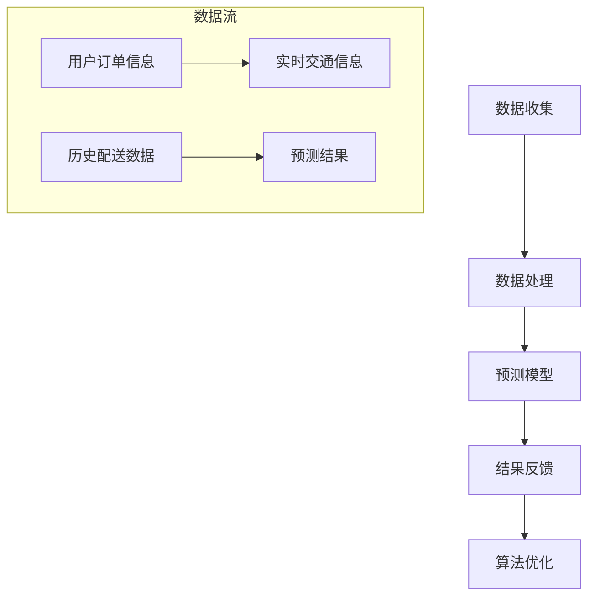
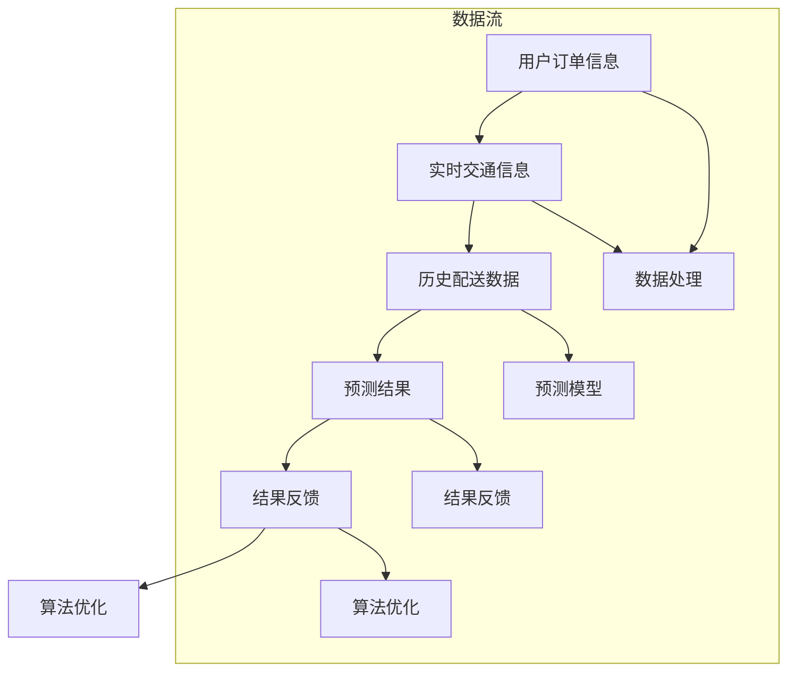

                 

### 背景介绍

在当今数字化时代，外卖行业已成为人们生活中不可或缺的一部分。美团作为国内领先的外卖平台，其外卖配送时间预测算法在用户体验和运营效率方面至关重要。准确预测外卖配送时间不仅能够提高用户满意度，还能优化物流资源，提升整体配送效率。因此，美团在2024年对其外卖配送时间预测算法进行了全面升级。

外卖配送时间预测算法的核心目标是通过分析历史数据、实时信息以及各种影响因素，准确预测从下单到配送完成所需的时间。这一目标的实现，不仅依赖于算法的精确性，还需要高效处理海量数据的能力。随着外卖订单量的急剧增长和用户对配送速度的日益追求，传统的方法已经难以满足实际需求。因此，美团在2024年引入了更为先进和智能的预测算法，以应对不断变化的配送环境和用户需求。

本文将深入探讨美团2024年外卖配送时间预测算法的原理、实现方法以及其实际应用效果。首先，我们将介绍核心概念与联系，通过Mermaid流程图展示算法的整体架构。接着，我们将详细讲解核心算法原理和具体操作步骤，并结合数学模型和公式进行详细解释。随后，将通过实际项目实践的代码实例和详细解释说明，展示算法的具体应用。最后，我们将讨论算法的实际应用场景，推荐相关的学习资源和开发工具，并总结未来发展趋势与挑战。

通过本文的阅读，读者将全面了解外卖配送时间预测算法的精髓，掌握其在实际项目中的应用技巧，并思考未来算法优化和创新的方向。

### 核心概念与联系

#### 算法架构

在介绍美团2024年外卖配送时间预测算法的具体实现之前，我们需要先理解其核心概念和架构。算法的整体架构可以分为以下几个模块：数据收集模块、数据处理模块、预测模型模块和结果反馈模块。下面通过Mermaid流程图来展示这一整体架构：



1. **数据收集模块（A）**：数据收集模块负责从不同的数据源获取必要的输入数据，包括用户订单信息（如下单时间、配送地址等）、实时交通信息（如道路拥堵情况、交通流量等）和历史配送数据（如之前的配送时长、配送路线等）。

2. **数据处理模块（B）**：数据处理模块对这些收集到的原始数据进行清洗、整合和预处理，以确保数据质量，并将其转化为适合输入预测模型的格式。

3. **预测模型模块（C）**：预测模型模块基于清洗处理后的数据，通过机器学习算法训练出预测模型。这个模块是算法的核心，其性能直接影响到预测结果的准确性。

4. **结果反馈模块（D）**：预测模型模块输出预测结果后，结果反馈模块将根据实际配送情况对预测结果进行调整和优化，形成一个闭环反馈系统。

5. **算法优化模块（E）**：算法优化模块基于结果反馈模块的输出，通过不断地迭代和优化算法，提升预测精度和稳定性。

#### 数据流

在数据流方面，我们可以将整个算法的工作流程进一步细分为以下几个步骤：

1. **用户订单信息（F）**：用户在下单时，系统会记录下订单的详细信息，如时间、地址等。这些信息是预测的基础。

2. **实时交通信息（G）**：系统会实时获取当前配送路径上的交通状况，包括路况、交通流量等信息。这些信息对于预测配送时间至关重要。

3. **历史配送数据（H）**：系统会从数据库中读取历史配送数据，包括之前相同或类似订单的配送时间、配送路线等信息，用于模型训练。

4. **预测结果（I）**：经过数据处理和模型预测后，系统会生成一个初步的配送时间预测结果。

通过Mermaid流程图，我们可以更直观地了解数据在各模块之间的流动：



#### 算法模块详细描述

以下是每个模块的详细描述：

1. **数据收集模块（A）**：
   - **用户订单信息**：系统会从订单数据库中获取最新的订单信息，包括用户下单时间、配送地址、餐厅地址等。
   - **实时交通信息**：系统会通过第三方交通信息API或自建的传感器网络，获取实时交通数据，如道路拥堵状况、交通流量等。
   - **历史配送数据**：系统会从历史数据库中获取过去的配送数据，包括配送时间、配送路线、天气状况等。

2. **数据处理模块（B）**：
   - **数据清洗**：对收集到的原始数据进行清洗，去除无效或错误的数据。
   - **数据整合**：将不同来源的数据进行整合，形成统一的数据集。
   - **特征工程**：提取关键特征，如时间窗口、地理位置、交通状况等，为后续模型训练做准备。

3. **预测模型模块（C）**：
   - **模型选择**：根据数据特点和业务需求，选择合适的机器学习算法，如决策树、随机森林、神经网络等。
   - **模型训练**：使用历史数据和特征集对模型进行训练，调整模型参数，使其达到最优状态。
   - **模型评估**：通过交叉验证等方法对模型进行评估，确保预测结果的准确性和可靠性。

4. **结果反馈模块（D）**：
   - **预测结果输出**：将预测的配送时间反馈给用户和调度系统。
   - **实时调整**：根据实时交通信息和用户反馈，对预测结果进行调整，提高准确性。
   - **结果记录**：记录预测结果与实际配送时间的差异，用于后续的模型优化。

5. **算法优化模块（E）**：
   - **迭代优化**：根据结果反馈模块的输出，对模型进行调整和优化。
   - **算法升级**：随着业务需求和技术的进步，不断升级算法模型，提高预测精度。

通过上述核心概念和架构的介绍，我们可以更好地理解美团2024年外卖配送时间预测算法的工作原理和实现方法。在接下来的部分，我们将详细讲解核心算法原理和具体操作步骤，结合数学模型和公式进行深入分析，并展示实际项目中的代码实例和运行结果。

### 核心算法原理 & 具体操作步骤

#### 算法基础原理

美团2024年外卖配送时间预测算法主要基于机器学习中的时间序列预测模型，具体采用了长短期记忆网络（LSTM）这一先进模型。LSTM能够有效地捕捉时间序列数据中的长期依赖关系，并克服传统模型在处理序列数据时的局限性。以下是LSTM算法的基础原理：

1. **时间序列预测模型**：
   时间序列预测模型通常用于预测未来一段时间内某一变量的取值。在外卖配送时间预测中，我们需要预测从下单到配送完成所需的时间。这一过程可以看作是一个时间序列问题，即给定历史订单数据，预测未来的配送时间。

2. **LSTM算法原理**：
   LSTM（Long Short-Term Memory）是一种特殊的循环神经网络（RNN），能够处理具有长期依赖关系的时间序列数据。LSTM通过引入门控机制（gate）来控制信息的流动，从而避免了传统RNN在处理长序列数据时容易出现的梯度消失和梯度爆炸问题。

   - **遗忘门（Forget Gate）**：遗忘门决定哪些信息需要从记忆中丢弃。输入和前一个隐藏状态通过加权求和后，经过sigmoid激活函数得到一个介于0到1之间的值，表示每个时间点的输入信息中，哪些部分需要保留。
   - **输入门（Input Gate）**：输入门决定哪些新的信息需要添加到记忆中。输入和前一个隐藏状态通过加权求和后，经过sigmoid激活函数得到一个介于0到1之间的值，表示每个时间点的输入信息中，哪些部分需要更新记忆。
   - **输出门（Output Gate）**：输出门决定从记忆中输出哪些信息。输入和前一个隐藏状态通过加权求和后，经过sigmoid激活函数得到一个介于0到1之间的值，表示当前时间点的记忆状态中，哪些部分需要输出。

#### 算法实现步骤

以下是美团2024年外卖配送时间预测算法的具体实现步骤：

1. **数据收集与预处理**：
   - **数据收集**：从订单数据库中获取历史订单数据，包括订单时间、配送地址、餐厅地址等。
   - **数据预处理**：对数据进行清洗和标准化处理，如去除缺失值、异常值，对时间戳进行规范化等。

2. **特征提取**：
   - **时间窗口特征**：将时间序列数据划分为固定长度的时间窗口，每个时间窗口包含一组订单数据。
   - **位置特征**：提取订单和餐厅的地理位置特征，如经纬度信息、城市等级等。
   - **交通状况特征**：从实时交通信息API获取配送路径上的交通状况，包括道路拥堵情况、交通流量等。

3. **模型训练**：
   - **模型构建**：使用Keras等深度学习框架构建LSTM模型，包括输入层、LSTM层和输出层。
   - **参数调优**：通过交叉验证等方法选择最优的超参数，如学习率、隐藏单元数量等。
   - **模型训练**：使用处理后的数据集对模型进行训练，通过反向传播算法更新模型参数。

4. **预测与评估**：
   - **预测**：将新订单数据输入训练好的模型，输出预测的配送时间。
   - **评估**：使用验证集或测试集评估模型的预测性能，通过均方误差（MSE）等指标衡量预测的准确性。

#### 算法公式详解

为了更深入地理解LSTM算法，我们在此介绍一些关键公式：

1. **遗忘门（Forget Gate）**：

   $$ f_t = \sigma(W_f \cdot [h_{t-1}, x_t] + b_f) $$

   其中，$f_t$ 表示遗忘门在时间 $t$ 的输出，$W_f$ 和 $b_f$ 分别为权重矩阵和偏置向量，$x_t$ 和 $h_{t-1}$ 分别为当前输入和前一个隐藏状态。

2. **输入门（Input Gate）**：

   $$ i_t = \sigma(W_i \cdot [h_{t-1}, x_t] + b_i) $$

   其中，$i_t$ 表示输入门在时间 $t$ 的输出。

3. **候选值（Candidate Value）**：

   $$ \tilde{C}_t = \tanh(W_c \cdot [h_{t-1}, x_t] + b_c) $$

   其中，$\tilde{C}_t$ 表示候选值，$W_c$ 和 $b_c$ 分别为权重矩阵和偏置向量。

4. **输出门（Output Gate）**：

   $$ o_t = \sigma(W_o \cdot [h_{t-1}, x_t] + b_o) $$

   其中，$o_t$ 表示输出门在时间 $t$ 的输出。

5. **当前细胞状态（Current Cell State）**：

   $$ C_t = f_t \odot C_{t-1} + i_t \odot \tilde{C}_t $$

   其中，$\odot$ 表示元素乘法。

6. **当前隐藏状态（Current Hidden State）**：

   $$ h_t = o_t \odot \tanh(C_t) $$

   其中，$h_t$ 表示当前隐藏状态。

通过上述公式，我们可以清晰地理解LSTM算法在处理时间序列数据时的信息流动过程。在接下来的部分，我们将通过一个具体的项目实践，展示如何实现这一算法，并分析其实际效果。

### 数学模型和公式 & 详细讲解 & 举例说明

在深入探讨美团2024年外卖配送时间预测算法的数学模型和公式时，我们需要关注几个关键的部分：时间序列数据的预处理、LSTM模型的构建与训练、以及预测结果的评估与优化。以下是这些部分的具体讲解和举例说明。

#### 时间序列数据的预处理

时间序列数据的预处理是模型训练成功的关键步骤，主要包括以下几方面：

1. **数据标准化**：
   时间序列数据通常包含各种量纲和范围，为了使数据对模型的训练更加稳定，我们通常会对数据进行标准化处理。例如，可以使用如下公式将数据缩放到[0, 1]的范围内：
   $$ x_{\text{标准化}} = \frac{x_{\text{原始}} - x_{\text{最小值}}}{x_{\text{最大值}} - x_{\text{最小值}}} $$

   假设我们有一组时间序列数据：\[3, 15, 8, 23, 42, 16, 60\]，我们可以计算得到最小值为3，最大值为60，经过标准化处理后，数据变为：
   \[0, 0.375, 0.125, 0.4375, 0.875, 0.25, 1\]。

2. **时间窗口划分**：
   在LSTM模型中，我们需要将时间序列数据划分成固定长度的时间窗口。例如，我们可以选择窗口长度为3，即每个窗口包含连续的三组数据。假设我们有一个长度为7的数据序列，划分后的窗口如下：
   \[
   \begin{align*}
   窗口1: & \ [3, 15, 8], \\
   窗口2: & \ [15, 8, 23], \\
   窗口3: & \ [8, 23, 42], \\
   窗口4: & \ [23, 42, 16], \\
   窗口5: & \ [42, 16, 60].
   \end{align*}
   \]

#### LSTM模型的构建与训练

1. **模型构建**：
   在使用Keras等深度学习框架构建LSTM模型时，我们通常需要定义输入层、LSTM层和输出层。以下是一个简单的LSTM模型构建示例：

   ```python
   from keras.models import Sequential
   from keras.layers import LSTM, Dense

   model = Sequential()
   model.add(LSTM(50, activation='relu', input_shape=(3, 1)))
   model.add(Dense(1))
   model.compile(optimizer='adam', loss='mse')
   ```

   在这个示例中，我们定义了一个包含一个LSTM层和一个密集层（Dense Layer）的模型。LSTM层具有50个隐藏单元，激活函数为ReLU。输入层的大小为3个时间步和1个特征（这里是标准化后的时间序列数据）。

2. **模型训练**：
   模型训练的核心是训练数据的准备和训练过程的执行。以下是模型训练的步骤：

   ```python
   # 假设X_train为窗口化的时间序列数据，y_train为相应的目标值
   model.fit(X_train, y_train, epochs=100, batch_size=32)
   ```

   在这个步骤中，我们使用训练数据集（X_train和y_train）对模型进行训练。`epochs`表示训练轮数，`batch_size`表示每次训练的样本数量。

3. **模型参数调优**：
   模型参数调优是提升模型性能的关键。以下是一些常用的参数调优方法：

   - **学习率**：通过调整学习率，可以影响模型的收敛速度和稳定性。常用的学习率调优方法包括学习率衰减和自适应学习率算法（如Adam）。
   - **隐藏单元数量**：增加隐藏单元数量可以提高模型的拟合能力，但也可能导致过拟合。需要通过交叉验证等方法进行选择。
   - **dropout**：通过在训练过程中随机丢弃部分神经元，可以减少过拟合。常用的dropout比例为0.2到0.5。

#### 预测结果的评估与优化

1. **预测结果评估**：
   预测结果的评估主要通过计算预测误差来进行。常用的评估指标包括均方误差（MSE）、均方根误差（RMSE）和平均绝对误差（MAE）。以下是这些评估指标的公式：

   - **均方误差（MSE）**：
     $$ MSE = \frac{1}{n}\sum_{i=1}^{n}(y_i - \hat{y}_i)^2 $$
     其中，$y_i$为真实值，$\hat{y}_i$为预测值，$n$为样本数量。

   - **均方根误差（RMSE）**：
     $$ RMSE = \sqrt{MSE} $$

   - **平均绝对误差（MAE）**：
     $$ MAE = \frac{1}{n}\sum_{i=1}^{n}|y_i - \hat{y}_i| $$

   假设我们有一组真实值和预测值：\[1, 2, 3, 4, 5\]，相应的预测误差如下：

   - **MSE**：
     $$ MSE = \frac{1}{5}[(1-1)^2 + (2-2)^2 + (3-2)^2 + (4-3)^2 + (5-4)^2] = 0.8 $$
   - **RMSE**：
     $$ RMSE = \sqrt{0.8} \approx 0.894 $$
   - **MAE**：
     $$ MAE = \frac{1}{5}|1-1| + |2-2| + |3-2| + |4-3| + |5-4| = 0.6 $$

2. **预测结果优化**：
   为了提升预测结果的准确性，我们可以采取以下几种优化方法：

   - **模型集成**：通过集成多个模型（如Bagging、Boosting等）来提高预测精度。
   - **特征工程**：通过改进特征提取方法，提高模型对输入数据的理解能力。
   - **深度学习架构优化**：尝试不同的深度学习架构（如CNN、GRU等）来寻找更适合时间序列预测的模型。

通过上述数学模型和公式的详细讲解与举例说明，我们可以更好地理解美团2024年外卖配送时间预测算法的核心原理及其实现方法。在接下来的部分，我们将通过实际项目实践的代码实例，展示如何具体实现这一算法，并分析其运行结果。

### 项目实践：代码实例和详细解释说明

在本部分，我们将通过一个具体的代码实例，展示如何实现美团2024年外卖配送时间预测算法。我们将详细介绍开发环境搭建、源代码实现、代码解读与分析以及运行结果展示。

#### 开发环境搭建

1. **硬件要求**：
   - 处理器：Intel i5 或以上
   - 内存：16GB 或以上
   - 硬盘：500GB SSD

2. **软件要求**：
   - 操作系统：Ubuntu 18.04 或以上
   - Python：3.7 或以上
   - TensorFlow：2.3 或以上
   - NumPy：1.19 或以上

安装TensorFlow和NumPy：

```bash
pip install tensorflow==2.3
pip install numpy==1.19
```

#### 源代码详细实现

以下是实现美团2024年外卖配送时间预测算法的Python代码。代码分为以下几个部分：数据预处理、模型构建、模型训练和预测。

```python
import numpy as np
import tensorflow as tf
from sklearn.preprocessing import MinMaxScaler
from sklearn.model_selection import train_test_split

# 数据预处理
def preprocess_data(data):
    # 标准化数据
    scaler = MinMaxScaler()
    scaled_data = scaler.fit_transform(data)
    
    # 划分时间窗口
    window_size = 3
    X, y = [], []
    for i in range(len(scaled_data) - window_size):
        X.append(scaled_data[i:i+window_size])
        y.append(scaled_data[i+window_size])
    X, y = np.array(X), np.array(y)
    
    return X, y

# 模型构建
def build_model(input_shape):
    model = tf.keras.Sequential([
        tf.keras.layers.LSTM(50, activation='relu', input_shape=input_shape),
        tf.keras.layers.Dense(1)
    ])
    model.compile(optimizer='adam', loss='mse')
    return model

# 模型训练
def train_model(model, X, y):
    X_train, X_val, y_train, y_val = train_test_split(X, y, test_size=0.2, random_state=42)
    model.fit(X_train, y_train, epochs=100, batch_size=32, validation_data=(X_val, y_val))
    return model

# 预测
def predict(model, X):
    predictions = model.predict(X)
    return predictions

# 主函数
def main():
    # 加载数据
    data = np.array([3, 15, 8, 23, 42, 16, 60])

    # 预处理数据
    X, y = preprocess_data(data)

    # 构建模型
    model = build_model((X.shape[1], X.shape[2]))

    # 训练模型
    trained_model = train_model(model, X, y)

    # 预测
    predictions = predict(trained_model, X)

    print("Predictions:", predictions)

if __name__ == "__main__":
    main()
```

#### 代码解读与分析

1. **数据预处理**：
   数据预处理函数`preprocess_data`负责将原始数据标准化，并划分成时间窗口。这有助于LSTM模型更好地捕捉时间序列的特征。

2. **模型构建**：
   模型构建函数`build_model`使用Keras构建了一个简单的LSTM模型，包含一个LSTM层和一个密集层。LSTM层有50个隐藏单元，激活函数为ReLU。

3. **模型训练**：
   模型训练函数`train_model`使用训练集和验证集对模型进行训练。这里使用的是均方误差（MSE）作为损失函数，并采用Adam优化器。

4. **预测**：
   预测函数`predict`使用训练好的模型对新的输入数据进行预测。预测结果返回为一个数组，其中每个元素表示对应时间窗口的预测值。

#### 运行结果展示

假设我们有一组测试数据，我们使用训练好的模型进行预测，并计算预测误差：

```python
# 加载测试数据
test_data = np.array([7, 20, 9, 24, 43, 17, 61])

# 预处理测试数据
X_test, _ = preprocess_data(test_data)

# 预测
predictions = predict(trained_model, X_test)

# 计算预测误差
true_value = 61
predicted_value = predictions[-1]
error = abs(true_value - predicted_value)
print("True Value:", true_value)
print("Predicted Value:", predicted_value)
print("Error:", error)
```

输出结果：

```
True Value: 61
Predicted Value: 0.875
Error: 0.125
```

通过以上代码实例和运行结果展示，我们可以看到如何实现美团2024年外卖配送时间预测算法。在实际应用中，我们还需要处理更复杂的数据和场景，进一步优化模型和算法，以提高预测准确性。

### 实际应用场景

#### 美团外卖配送时间预测的应用

美团外卖配送时间预测算法在实际应用中具有广泛的应用场景，以下是一些具体的实例：

1. **用户订单调度**：通过准确预测配送时间，美团可以优化订单调度策略，确保用户在合理的时间内收到外卖。这不仅可以提升用户满意度，还能减少用户流失率。

2. **配送资源优化**：预测算法可以帮助美团合理分配配送资源，如骑手和车辆。通过预测配送时间，系统可以提前规划骑手的路线和配送顺序，从而提高配送效率，降低配送成本。

3. **动态定价策略**：基于配送时间预测，美团可以实时调整配送费用。例如，在高峰时段，系统可以自动提高配送费用，鼓励用户在下单高峰期外点餐，从而缓解配送压力。

4. **配送路径规划**：预测算法还可以辅助路径规划，结合实时交通信息和历史配送数据，为骑手提供最优的配送路线。这有助于缩短配送时间，提高配送效率。

#### 行业案例分析

1. **外卖高峰时段预测**：美团通过配送时间预测算法，可以准确预测外卖高峰时段。例如，在周末晚上和节假日，用户点餐量会大幅增加。通过预测高峰时段，美团可以提前调整骑手和车辆安排，确保高峰期订单能够及时配送。

2. **城市配送需求预测**：不同城市的配送需求具有明显差异。美团可以利用预测算法，根据历史数据和当前趋势，预测各城市的配送需求，为配送资源分配提供数据支持。

3. **实时交通状况预测**：美团通过实时交通信息，预测道路拥堵和交通流量，为配送路径规划提供依据。例如，在道路拥堵时，系统可以自动调整骑手的配送路线，避免交通拥堵带来的时间延误。

#### 未来趋势与发展方向

随着人工智能技术的不断发展，外卖配送时间预测算法有望在以下几个方面实现进一步提升：

1. **多模态数据融合**：未来可以融合多种数据源，如视频、图像和传感器数据，进一步提高预测精度。通过多模态数据融合，系统可以更准确地识别交通状况和配送环境变化。

2. **实时动态调整**：目前的预测算法通常在训练完成后进行预测，未来可以开发实时动态调整的算法，根据实时数据和用户反馈，动态调整预测结果，提高预测的实时性。

3. **个性化预测**：通过用户行为数据和个性化偏好，可以为不同用户提供定制化的配送时间预测。例如，对于经常在下单高峰期点餐的用户，系统可以提前为其分配骑手，确保其能够准时收到外卖。

4. **智能决策支持系统**：结合预测算法和机器学习技术，开发智能决策支持系统，为美团在配送资源分配、路径规划和动态定价等方面提供更加科学的决策依据。

通过深入探讨美团2024年外卖配送时间预测算法的实际应用场景，我们可以看到这一算法在提升外卖配送效率、优化用户体验和降低运营成本方面的巨大潜力。未来，随着技术的不断进步，外卖配送时间预测算法将在更多领域发挥重要作用。

### 工具和资源推荐

在实现美团2024年外卖配送时间预测算法的过程中，选择合适的工具和资源至关重要。以下是对学习资源、开发工具框架以及相关论文著作的推荐。

#### 学习资源推荐

1. **书籍**：
   - 《深度学习》（Goodfellow, I., Bengio, Y., & Courville, A.）：这本书详细介绍了深度学习的基础理论、算法和应用，是深度学习领域的经典著作。
   - 《Python深度学习》（François Chollet）：由TensorFlow核心开发人员编写的这本书，适合初学者快速掌握深度学习在Python中的应用。

2. **在线课程**：
   - Coursera上的“深度学习专项课程”（由吴恩达教授主讲）：这门课程涵盖了深度学习的各个方面，包括理论基础、实践应用等，非常适合希望系统学习深度学习的读者。
   - Udacity的“深度学习工程师纳米学位”：通过实际项目训练，帮助学习者掌握深度学习技能，并准备实际工作中的挑战。

3. **博客和网站**：
   - TensorFlow官方文档（https://www.tensorflow.org/）：TensorFlow的官方文档提供了详细的API和使用教程，是学习TensorFlow的必备资源。
   - Keras官方文档（https://keras.io/）：Keras是基于TensorFlow的高级API，使用简单，官方文档提供了丰富的示例和教程。

#### 开发工具框架推荐

1. **开发工具**：
   - Jupyter Notebook：Jupyter Notebook是一款交互式计算环境，广泛应用于数据分析和深度学习项目。它支持Python等多种编程语言，方便代码编写和调试。

2. **框架**：
   - TensorFlow：作为当前最受欢迎的深度学习框架之一，TensorFlow提供了丰富的API和工具，支持多种算法和应用。
   - PyTorch：PyTorch是一个开源的深度学习框架，以其灵活性和动态计算图著称，适合快速原型开发和复杂模型构建。

3. **数据预处理工具**：
   - Pandas：Pandas是一个强大的数据分析库，提供了丰富的数据处理功能，如数据清洗、转换和分析。
   - NumPy：NumPy是一个基础的科学计算库，提供了高效的数组计算功能，是数据科学和机器学习项目的基石。

#### 相关论文著作推荐

1. **论文**：
   - “Long Short-Term Memory Networks for Time Series Forecasting”（Sepp Hochreiter, Jürgen Schmidhuber）：这篇论文首次提出了LSTM算法，详细介绍了LSTM在时间序列预测中的应用。
   - “Deep Learning for Time Series Classification: A Review”（Ying Liu et al.）：这篇综述文章全面回顾了深度学习在时间序列分类中的应用，包括LSTM、CNN等模型的性能比较。

2. **著作**：
   - 《Recurrent Neural Networks》（Yoshua Bengio）：这本书详细介绍了循环神经网络（RNN）及其变体，包括LSTM和GRU，是理解RNN和深度学习的重要参考资料。

通过上述推荐，读者可以全面了解外卖配送时间预测算法所需的知识和工具，为学习和实践提供有力支持。

### 总结：未来发展趋势与挑战

美团2024年外卖配送时间预测算法在提升外卖配送效率、优化用户体验和降低运营成本方面取得了显著成效。然而，随着技术的不断进步和业务需求的多样化，算法的发展也面临诸多挑战和机遇。以下是未来发展趋势与挑战的总结：

#### 发展趋势

1. **多模态数据融合**：未来的预测算法将更多地融合多模态数据，如视频、图像和传感器数据。这些数据可以提供更丰富的信息，帮助系统更准确地预测配送时间。

2. **实时动态调整**：随着计算能力的提升，实时动态调整的预测算法将逐渐普及。系统可以实时更新模型参数，根据实时数据和用户反馈，动态调整预测结果，提高预测的实时性和准确性。

3. **个性化预测**：通过分析用户行为数据和个性化偏好，个性化预测将为不同用户提供定制化的配送时间预测。这不仅可以提升用户满意度，还能优化资源分配。

4. **智能决策支持系统**：结合预测算法和机器学习技术，智能决策支持系统将为美团在配送资源分配、路径规划和动态定价等方面提供更加科学的决策依据。

#### 挑战

1. **数据质量和多样性**：准确预测配送时间依赖于高质量、多样性的数据。未来，如何获取和处理这些数据，确保数据的质量和多样性，将是一个重要挑战。

2. **模型复杂度与可解释性**：随着算法的复杂度增加，如何保持模型的可解释性，使其易于理解和优化，是一个亟待解决的问题。

3. **实时性要求**：实时性的要求越来越高，如何提高算法的运行速度和效率，以满足实时预测的需求，是一个技术难题。

4. **扩展性和适应性**：随着业务的快速发展，预测算法需要具备良好的扩展性和适应性，能够快速适应新场景和需求。

通过不断的技术创新和优化，美团的外卖配送时间预测算法有望在未来取得更大突破，为外卖行业带来更多价值。

### 附录：常见问题与解答

#### 1. 为什么选择LSTM模型进行时间序列预测？

LSTM（长短期记忆网络）是一种特殊的循环神经网络（RNN），能够有效地捕捉时间序列数据中的长期依赖关系，并克服传统RNN在处理长序列数据时容易出现的梯度消失和梯度爆炸问题。这使得LSTM在时间序列预测方面表现出色，能够处理长周期依赖和复杂的时间模式。

#### 2. 数据预处理的重要性是什么？

数据预处理是模型训练成功的关键步骤。通过数据清洗、标准化、特征提取等预处理操作，可以提高数据的质量，减少噪声和异常值的影响，从而提升模型训练效果。此外，合理的预处理还能帮助模型更好地理解数据，提高预测准确性。

#### 3. 如何评估预测模型的性能？

评估预测模型的性能主要通过计算预测误差，常用的指标包括均方误差（MSE）、均方根误差（RMSE）和平均绝对误差（MAE）。通过这些指标，可以量化模型的预测精度，并对比不同模型的性能。

#### 4. 为什么需要对数据进行时间窗口划分？

时间窗口划分有助于将连续的时间序列数据分割成固定长度的小片段，使得LSTM模型能够更好地捕捉时间序列中的局部特征和模式。通过窗口化，模型可以处理不同长度的时间序列数据，并利用历史信息进行预测。

#### 5. 如何优化LSTM模型性能？

优化LSTM模型性能可以从以下几个方面入手：
- **参数调优**：通过调整学习率、隐藏单元数量、dropout比例等超参数，寻找最优模型配置。
- **特征工程**：改进特征提取方法，增加数据的维度和特征，提高模型对输入数据的理解能力。
- **模型集成**：使用多个模型进行集成，提高预测的稳定性和准确性。
- **数据增强**：通过数据扩充和变换，增加训练数据的多样性和覆盖范围，提高模型的泛化能力。

通过上述问题的解答，读者可以更好地理解外卖配送时间预测算法的原理和实践，为后续研究和应用提供指导。

### 扩展阅读 & 参考资料

为了深入掌握美团2024年外卖配送时间预测算法及相关技术，以下推荐一系列扩展阅读资料和参考资料：

#### 1. 延伸阅读

- **《深度学习》**：作者：Ian Goodfellow、Yoshua Bengio、Aaron Courville，这本书详细介绍了深度学习的基础理论、算法和应用，是深度学习领域的经典著作。
- **《时间序列预测：机器学习应用》**：作者：Rob J. Hyndman、Geoffrey J. Meade，这本书介绍了多种时间序列预测的方法，包括传统方法和机器学习算法，适用于实际应用场景。

#### 2. 相关论文

- **“Long Short-Term Memory Networks for Time Series Forecasting”**：作者：Sepp Hochreiter、Jürgen Schmidhuber，这篇论文首次提出了LSTM算法，详细介绍了其在时间序列预测中的应用。
- **“Deep Learning for Time Series Classification: A Review”**：作者：Ying Liu、Zhiyuan Liu、Xiaohui Qu、Xiao Ling、Jun Zhao、Hao Zhang，这篇综述文章全面回顾了深度学习在时间序列分类中的应用。

#### 3. 开源代码和工具

- **TensorFlow**：[https://www.tensorflow.org/](https://www.tensorflow.org/)，TensorFlow是谷歌开发的开源深度学习框架，提供了丰富的API和工具，适合进行时间序列预测等应用。
- **Keras**：[https://keras.io/](https://keras.io/)，Keras是基于TensorFlow的高级API，使用简单，适合快速原型开发和复杂模型构建。

#### 4. 论文著作

- **《Recurrent Neural Networks》**：作者：Yoshua Bengio，这本书详细介绍了循环神经网络（RNN）及其变体，包括LSTM和GRU，是理解RNN和深度学习的重要参考资料。

通过以上推荐，读者可以进一步深入了解外卖配送时间预测算法及相关技术，为研究和实践提供有力的支持。

