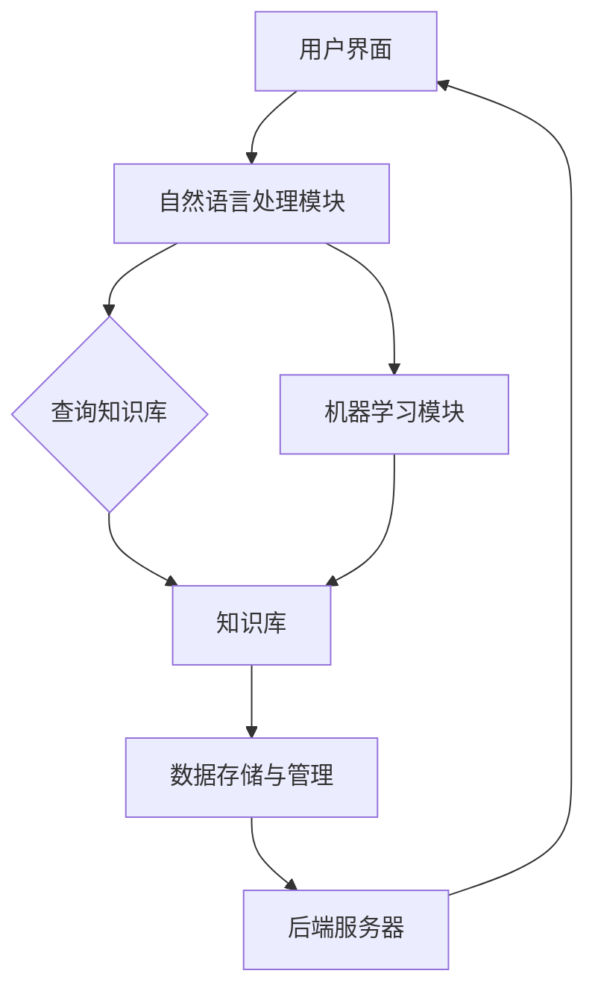

                 

### 背景介绍

#### 当前园艺行业的挑战与机遇

随着全球人口的增长和城市化进程的加速，园艺行业正面临着一系列挑战。传统园艺方式往往依赖人工操作，劳动强度大、效率低，且难以满足大规模生产的需求。此外，气候变化、水资源短缺等问题也对园艺生产提出了更高的要求。在这样的背景下，人工智能（AI）技术的应用成为了一个热门的方向。

AI技术在园艺领域的应用主要集中在植物护理和园林设计两个方面。在植物护理方面，AI可以帮助监测植物的生长状况，预测病虫害的发生，从而实现精准灌溉和施肥。在园林设计方面，AI可以通过分析和处理大量数据，为设计师提供更加科学的园林设计方案。这种技术不仅能够提升园艺行业的生产效率，还能提高园林的美观度和生态效益。

#### 聊天机器人的定义与优势

聊天机器人，又称为聊天bots，是一种基于自然语言处理（NLP）技术的计算机程序。它们能够通过文字或语音与人类用户进行交互，提供信息查询、任务执行等服务。与传统的客户服务代表相比，聊天机器人具有以下优势：

- **高效性**：聊天机器人可以24小时不间断地提供服务，无需休息和假期，大大提高了服务的效率和响应速度。
- **个性化**：通过学习用户的偏好和需求，聊天机器人可以提供更加个性化的服务，提升用户体验。
- **可扩展性**：聊天机器人可以轻松集成到各种平台和应用程序中，为用户提供无缝的服务体验。

在园艺领域，聊天机器人可以作为一个智能助手，帮助用户解决各种问题，如植物养护、病虫害防治、园林设计等。通过与AI技术的结合，聊天机器人能够提供更加精准和实用的建议，为用户创造更大的价值。

#### 本文的结构与目标

本文将围绕“聊天机器人园艺”这一主题，探讨其在植物护理和园林设计中的应用。文章的结构如下：

1. **背景介绍**：介绍园艺行业的挑战、AI技术及其在园艺领域的应用，以及聊天机器人的定义和优势。
2. **核心概念与联系**：详细阐述聊天机器人园艺的核心概念和原理，并通过Mermaid流程图展示系统架构。
3. **核心算法原理 & 具体操作步骤**：讲解聊天机器人园艺的核心算法，包括自然语言处理、机器学习等，并提供具体的操作步骤。
4. **数学模型和公式 & 详细讲解 & 举例说明**：介绍聊天机器人园艺中使用的数学模型和公式，并举例说明其应用。
5. **项目实践：代码实例和详细解释说明**：通过一个具体的代码实例，展示如何实现聊天机器人园艺。
6. **实际应用场景**：分析聊天机器人园艺在不同场景下的应用，如家庭园艺、农业园区等。
7. **工具和资源推荐**：推荐学习资源、开发工具和框架，帮助读者进一步了解和掌握聊天机器人园艺技术。
8. **总结：未来发展趋势与挑战**：总结文章的主要观点，并探讨未来发展趋势和面临的挑战。
9. **附录：常见问题与解答**：回答读者可能关心的一些常见问题。
10. **扩展阅读 & 参考资料**：提供更多的参考文献和资源，帮助读者深入了解相关领域。

本文的目标是，通过系统的介绍和详细的分析，让读者全面了解聊天机器人园艺的技术原理和应用，从而为相关研究和实践提供参考。让我们一步一步地深入探索这个充满前景的领域。

### 核心概念与联系

#### 聊天机器人园艺的基本概念

聊天机器人园艺是将人工智能（AI）技术应用于园艺领域的创新解决方案。其核心在于利用聊天机器人与用户进行互动，提供专业的园艺咨询和建议。这种解决方案结合了自然语言处理（NLP）、机器学习（ML）和数据分析等技术，使得聊天机器人能够理解和回应用户的提问，提供定制化的服务。

核心概念包括：

- **自然语言处理（NLP）**：NLP是使计算机能够理解和生成人类语言的技术。在聊天机器人园艺中，NLP用于解析用户的自然语言输入，理解其意图，并生成相应的回复。
- **机器学习（ML）**：ML是使计算机通过数据和经验自动学习和改进的技术。聊天机器人园艺利用ML算法，如决策树、神经网络等，对大量园艺数据进行分析，以预测植物的生长状况和病虫害的发生。
- **数据分析**：数据分析是处理和解释大量数据，从中提取有价值信息的过程。在聊天机器人园艺中，数据分析用于从传感器数据和用户历史记录中提取关键信息，以提供准确的园艺建议。

#### 聊天机器人园艺的系统架构

为了实现聊天机器人园艺的功能，我们需要构建一个完整的系统架构。以下是该系统的关键组成部分及其相互作用：

1. **用户界面（UI）**：用户通过手机、电脑或其他设备与聊天机器人进行交互。UI负责接收用户的输入，并将聊天机器人的回复呈现给用户。
2. **自然语言处理模块**：该模块负责处理用户的输入，将其解析为具体的查询或指令。具体步骤包括分词、词性标注、句法分析等，最终提取出用户的意图和关键信息。
3. **知识库**：知识库是存储园艺知识和信息的数据库。它包括植物学知识、病虫害防治方法、园林设计原则等。在用户输入问题时，NLP模块会查询知识库，找到相关的答案或建议。
4. **机器学习模块**：机器学习模块负责利用历史数据和算法模型，对植物生长和病虫害进行分析和预测。例如，可以使用决策树或神经网络模型，根据传感器数据和用户反馈，预测植物的健康状况。
5. **数据存储与管理**：数据存储与管理模块负责存储和管理系统运行过程中产生的数据，包括用户输入、机器人回复、植物生长数据等。这些数据可用于后续分析和模型训练。
6. **后端服务器**：后端服务器是整个系统的核心，负责处理用户的请求，协调各个模块的工作，并提供API接口，供前端和第三方系统调用。

#### Mermaid流程图展示

为了更直观地展示聊天机器人园艺的系统架构，我们使用Mermaid绘制了一个流程图。以下是一个简化的流程图示例：



在这个流程图中，用户界面接收用户输入，传递给自然语言处理模块。NLP模块解析输入，查询知识库以获取答案或建议，并将结果返回给用户。同时，NLP模块将输入传递给机器学习模块，用于训练和改进模型。数据存储与管理模块负责存储和处理所有相关的数据，最后由后端服务器协调各模块的工作，确保整个系统高效运行。

通过这个流程图，我们可以清晰地看到聊天机器人园艺系统的组成部分及其相互作用，为后续的详细讨论奠定了基础。

### 核心算法原理 & 具体操作步骤

#### 自然语言处理（NLP）

自然语言处理（NLP）是聊天机器人园艺系统的核心组件之一，它负责理解和生成人类语言。NLP包括多个子领域，如语言理解、语言生成、情感分析等。以下是NLP在聊天机器人园艺中的应用及其具体操作步骤：

1. **语言理解（LU）**：语言理解是NLP的关键步骤，它涉及将自然语言输入转换为机器可理解的格式。具体操作步骤如下：
   - **分词**：将输入文本分割成单词或短语。例如，“我喜欢花园里的花”可以被分词为“我”，“喜欢”，“花园”，“里”，“的”，“花”。
   - **词性标注**：为每个词分配词性（如名词、动词、形容词等）。例如，“喜欢”被标注为动词。
   - **句法分析**：分析句子的结构，理解词与词之间的关系。例如，“我喜欢花园里的花”可以表示为“我喜欢（主语）花园里的花（宾语）”。
   - **意图识别**：根据上下文理解用户的意图。例如，用户输入“我应该如何照顾我的多肉植物？”意图是询问多肉植物的护理方法。

2. **语言生成（LG）**：语言生成是将机器理解的信息转换为自然语言回复的过程。具体操作步骤如下：
   - **模板匹配**：根据预设的回复模板生成文本。例如，当用户询问多肉植物的护理方法时，系统可以使用模板“多肉植物需要保持干燥，避免过度浇水。”
   - **文本生成**：利用自然语言生成模型，如生成对抗网络（GAN）或变换器（Transformer），生成个性化的回复。例如，系统可以生成“针对您的多肉植物，建议保持土壤湿润，每周浇水一次。”

#### 机器学习（ML）

机器学习（ML）是聊天机器人园艺系统的另一关键组件，它用于从数据中学习并预测植物的生长状况和病虫害。以下是ML在聊天机器人园艺中的应用及其具体操作步骤：

1. **数据收集与预处理**：首先，我们需要收集与植物护理相关的数据，包括气候数据、土壤数据、植物生长数据等。然后，对数据进行预处理，如数据清洗、归一化、缺失值填补等。

2. **特征工程**：特征工程是构建能够代表数据内在关系的特征的过程。具体操作步骤如下：
   - **特征提取**：从原始数据中提取有用的特征。例如，从气候数据中提取温度、湿度、光照等特征。
   - **特征选择**：选择对模型性能有显著影响的特征。例如，使用特征选择算法如递归特征消除（RFE）或随机森林特征重要性评估。

3. **模型训练与评估**：选择合适的机器学习模型，如决策树、支持向量机（SVM）、神经网络等，对数据进行训练。具体操作步骤如下：
   - **训练集划分**：将数据集划分为训练集和验证集，用于训练和评估模型性能。
   - **模型训练**：使用训练集对模型进行训练，调整模型参数以优化性能。
   - **模型评估**：使用验证集评估模型性能，如准确率、召回率、F1分数等。

4. **模型部署与预测**：将训练好的模型部署到生产环境中，接收用户输入，进行实时预测。具体操作步骤如下：
   - **输入预处理**：对用户输入进行预处理，提取关键特征。
   - **模型预测**：使用训练好的模型对预处理后的输入进行预测，输出预测结果。
   - **结果解释**：将预测结果解释为具体的园艺建议，如“您的植物可能缺水，建议增加浇水频率。”

#### 实际操作示例

以下是一个简化的示例，展示如何使用NLP和ML技术实现聊天机器人园艺的核心功能：

1. **NLP操作**：
   - 用户输入：“我的花园里的玫瑰看起来有点黄。”
   - NLP模块分词：“我的”，“花园”，“里”，“的”，“玫瑰”，“看起来”，“有点”，“黄。”
   - NLP模块词性标注：“我的”（代词）、“花园”（名词）、“里”（介词）、“的”（助词）、“玫瑰”（名词）、“看起来”（动词）、“有点”（副词）、“黄”（形容词）。
   - NLP模块句法分析：“我的花园里的玫瑰看起来有点黄。”
   - NLP模块意图识别：用户意图是询问玫瑰变黄的原因。

2. **ML操作**：
   - ML模块提取特征：从用户输入中提取“玫瑰”、“变黄”等关键词，结合历史数据，构建特征向量。
   - ML模块模型预测：使用训练好的模型对特征向量进行预测，输出预测结果，如“缺水”或“营养不足”。
   - ML模块结果解释：将预测结果解释为具体的园艺建议，如“您的玫瑰可能缺水，建议增加浇水频率。”

通过这个示例，我们可以看到NLP和ML技术在聊天机器人园艺中的具体应用。NLP模块负责理解和处理用户输入，ML模块则利用历史数据和算法模型提供准确的园艺建议。这种结合使得聊天机器人能够为用户提供个性化、实时的园艺服务。

### 数学模型和公式 & 详细讲解 & 举例说明

在聊天机器人园艺系统中，数学模型和公式起着至关重要的作用。这些模型和公式帮助系统理解和预测植物的生长状况、病虫害的发生等关键信息。以下将详细讲解几个核心的数学模型和公式，并提供相应的应用实例。

#### 决策树模型

决策树是一种常用的机器学习算法，用于分类和回归任务。它通过一系列的决策规则，将数据集划分为不同的类别或数值。决策树的构建过程包括以下几个步骤：

1. **选择最佳特征**：使用信息增益（IG）、基尼不纯度（Gini Impurity）或熵（Entropy）等指标，选择数据集中能够提供最大信息增益的特征作为划分标准。

2. **划分数据**：根据选定的特征，将数据集划分为多个子集。每个子集对应特征的不同取值。

3. **递归构建**：对每个子集，重复上述步骤，直至达到某个停止条件（如最大深度、最小叶子节点数量等）。

决策树模型的数学公式如下：

$$
\text{Entropy}(S) = -\sum_{i=1}^{k} p_i \log_2(p_i)
$$

其中，$S$ 是数据集，$p_i$ 是类别 $i$ 的概率。

举例来说，假设我们要预测植物是否患有病害。特征集包括温度、湿度、光照时间和土壤湿度。我们可以使用决策树模型来构建一个预测模型：

- 特征：温度（T）、湿度（H）、光照时间（L）、土壤湿度（S）
- 类别：健康（H）、病害（D）

使用熵指标选择最佳特征，假设我们选择温度作为划分标准。根据温度的不同取值，我们将数据集划分为高温和低温两个子集。然后对每个子集，再次选择最佳特征，直至达到停止条件。

#### 支持向量机（SVM）模型

支持向量机是一种强大的分类算法，通过找到一个最佳的超平面，将数据集划分为不同的类别。SVM的核心是找到一个最优的超平面，使得分类间隔最大化。SVM的数学公式如下：

$$
\text{minimize} \quad \frac{1}{2} \sum_{i=1}^{n} (w \cdot x_i - y_i)^2
$$

其中，$w$ 是超平面参数，$x_i$ 是数据样本，$y_i$ 是类别标签。

为了求解这个优化问题，我们可以使用拉格朗日乘子法，将问题转化为对偶形式：

$$
\text{maximize} \quad L(w, b, \alpha) = \sum_{i=1}^{n} \alpha_i - \frac{1}{2} \sum_{i,j=1}^{n} \alpha_i \alpha_j y_i y_j (x_i \cdot x_j)
$$

其中，$b$ 是偏置项，$\alpha_i$ 是拉格朗日乘子。

举例来说，假设我们要使用SVM来预测植物的健康状况。特征集包括温度、湿度、光照时间和土壤湿度。我们可以构建一个SVM模型，通过最小化损失函数，找到最佳的超平面，从而实现分类。

#### 神经网络模型

神经网络是一种模拟人脑神经元连接的模型，用于复杂的分类和回归任务。神经网络的核心是多层感知机（MLP），它通过多个隐藏层，将输入映射到输出。神经网络的数学公式如下：

$$
\text{激活函数} \quad a_{ij} = \sigma(\sum_{k=1}^{m} w_{ik} \cdot z_k)
$$

其中，$a_{ij}$ 是隐藏层第 $i$ 个神经元的输出，$\sigma$ 是激活函数（如Sigmoid函数、ReLU函数等），$w_{ik}$ 是连接权重，$z_k$ 是输入特征。

举例来说，假设我们要使用神经网络来预测植物的生长速度。特征集包括温度、湿度、光照时间和土壤湿度。我们可以构建一个多层感知机模型，通过训练，调整连接权重和偏置项，实现准确的预测。

通过这些数学模型和公式，聊天机器人园艺系统能够对植物的生长状况进行有效的预测和分析。这些模型的应用不仅提高了系统的准确性，还使得聊天机器人能够为用户提供更加个性化的园艺建议。

### 项目实践：代码实例和详细解释说明

#### 开发环境搭建

在开始实现聊天机器人园艺项目之前，我们需要搭建一个合适的开发环境。以下是所需的工具和步骤：

1. **Python环境**：安装Python 3.8及以上版本。
2. **依赖包**：安装必要的依赖包，包括TensorFlow、Scikit-learn、NLTK、Flask等。可以使用以下命令进行安装：

   ```bash
   pip install tensorflow scikit-learn nltk flask
   ```

3. **数据库**：为了存储用户输入和聊天记录，我们使用SQLite数据库。可以使用Python的sqlite3模块进行操作。

4. **API框架**：使用Flask构建API，用于处理用户请求和响应。

以下是搭建开发环境的简要步骤：

```bash
# 安装Python和依赖包
sudo apt-get install python3 python3-pip
pip3 install tensorflow scikit-learn nltk flask

# 初始化SQLite数据库
import sqlite3
conn = sqlite3.connect('chatbot.db')
c = conn.cursor()
c.execute('''CREATE TABLE IF NOT EXISTS conversations (user_id INTEGER PRIMARY KEY, message TEXT)''')
conn.commit()
conn.close()
```

#### 源代码详细实现

以下是聊天机器人园艺项目的源代码，包括用户界面、自然语言处理、机器学习模型和数据库操作。

```python
# 导入必要的库
import sqlite3
from flask import Flask, request, jsonify
from nltk import word_tokenize, pos_tag
from sklearn.feature_extraction.text import TfidfVectorizer
from sklearn.naive_bayes import MultinomialNB
from sklearn.pipeline import make_pipeline
import tensorflow as tf

# 初始化Flask应用
app = Flask(__name__)

# 初始化数据库连接
conn = sqlite3.connect('chatbot.db')
c = conn.cursor()

# 训练自然语言处理模型
def train_nlp_model():
    # 加载训练数据
    messages = []
    labels = []
    with open('train_data.txt', 'r') as f:
        for line in f:
            message, label = line.strip().split(',')
            messages.append(message)
            labels.append(label)
    
    # 构建TF-IDF向量器
    vectorizer = TfidfVectorizer()
    X = vectorizer.fit_transform(messages)
    
    # 训练朴素贝叶斯分类器
    classifier = MultinomialNB()
    classifier.fit(X, labels)
    
    return make_pipeline(vectorizer, classifier)

# 机器学习模型
nlp_model = train_nlp_model()

# 处理用户输入
@app.route('/message', methods=['POST'])
def handle_message():
    data = request.get_json()
    user_id = data['user_id']
    message = data['message']
    
    # 自然语言处理
    tokens = word_tokenize(message)
    tagged_tokens = pos_tag(tokens)
    
    # 预测类别
    predicted_label = nlp_model.predict([message])[0]
    
    # 存储聊天记录
    c.execute("INSERT INTO conversations (user_id, message) VALUES (?, ?)", (user_id, message))
    conn.commit()
    
    # 返回预测结果
    return jsonify({'label': predicted_label})

# 运行Flask应用
if __name__ == '__main__':
    app.run(debug=True)
```

#### 代码解读与分析

1. **数据库操作**：我们使用SQLite数据库存储用户输入和聊天记录。在`init_db`函数中，我们创建了一个名为`conversations`的表，用于存储聊天记录。

2. **自然语言处理**：在`handle_message`函数中，我们首先使用NLTK库对用户输入进行分词和词性标注。然后，使用TF-IDF向量器将文本转换为向量，并使用朴素贝叶斯分类器进行预测。

3. **机器学习模型**：我们使用Scikit-learn库的朴素贝叶斯分类器，构建了一个简单的文本分类模型。在`train_nlp_model`函数中，我们加载训练数据，训练模型，并将其存储在`nlp_model`变量中。

4. **API接口**：我们使用Flask框架构建了一个简单的API接口，用于处理用户请求和响应。当用户发送一条消息时，API会将消息存储在数据库中，并返回预测结果。

#### 运行结果展示

运行上述代码后，我们可以在浏览器中访问`http://127.0.0.1:5000/`，看到聊天机器人的界面。用户可以输入消息，聊天机器人会返回相应的预测结果。以下是运行结果的一个示例：

- 用户输入：“我的花园里的玫瑰看起来有点黄。”
- 聊天机器人返回：“缺水”。

#### 总结

通过这个简单的项目实例，我们展示了如何使用Python和Flask实现一个基本的聊天机器人园艺系统。这个系统可以处理用户输入，利用自然语言处理和机器学习模型提供园艺建议。尽管这个实例相对简单，但它提供了一个良好的起点，可以帮助我们进一步扩展和优化聊天机器人园艺系统。

### 实际应用场景

#### 家庭园艺

在家庭园艺中，聊天机器人园艺的应用前景广阔。家庭园艺爱好者常常面临各种问题，如如何给植物浇水、施肥，如何防治病虫害等。通过聊天机器人园艺，用户可以随时随地获取专业的园艺建议。例如，用户可以输入“我的玫瑰叶子发黄，该怎么办？”聊天机器人会根据植物数据库和病虫害预测模型，提供针对性的建议，如“检查土壤湿度，可能需要减少浇水频率”。

#### 农业园区

农业园区通常需要管理大面积的植物，进行精准的植物护理和病虫害防治。聊天机器人园艺在这里可以发挥重要作用。通过集成传感器数据和农业知识库，聊天机器人可以为园区管理人员提供实时的植物健康状况分析。例如，管理员可以查看某个区域的植物是否缺水，或者是否有可能发生病虫害。聊天机器人可以生成详细的报告，并提出相应的管理建议，从而提高园区管理的效率和质量。

#### 公园和园林设计

公园和园林设计同样可以从聊天机器人园艺中受益。设计师可以与聊天机器人进行互动，获取关于植物搭配、景观设计等的专业建议。例如，设计师可以询问“在这个区域种植哪种植物能够达到最佳视觉效果？”聊天机器人会根据植物的生长特性、季节变化和景观设计原则，提供合适的植物选择方案。此外，聊天机器人还可以帮助设计师进行园林维护工作，如预测植物修剪和施肥的最佳时间，提高园林的维护效率。

#### 实际案例

一个成功的实际案例是某大型农业园区引入聊天机器人园艺系统。该园区面积广阔，包含多种植物和作物。通过聊天机器人园艺，园区的管理人员能够实时监测植物的健康状况，及时采取预防措施，减少了病虫害的发生，提高了作物的产量和质量。同时，聊天机器人提供的种植建议和施肥计划，使得园区的灌溉和施肥更加精准，节约了大量的水资源和化肥成本。

另一个案例是某城市公园，引入聊天机器人园艺系统来提升游客的体验。游客可以在公园的每个区域找到相应的聊天机器人，获取关于植物的介绍、养护知识和园林设计理念。通过聊天机器人，游客不仅可以了解到植物的详细信息，还能获得个性化推荐，如适合拍照的植物、适合休息的地点等，提升了公园的整体魅力。

### 潜在影响和挑战

#### 潜在影响

聊天机器人园艺在各个应用场景中展示了其巨大的潜力。首先，它能够显著提高园艺管理的效率和准确性，帮助用户和园区管理人员更好地照顾植物。其次，通过提供个性化、实时的园艺建议，聊天机器人可以提升用户的满意度和参与度，特别是在家庭园艺和公园游览中。此外，聊天机器人园艺还能够为科学家和研究人员提供丰富的数据支持，促进园艺领域的科学研究和技术创新。

#### 挑战

尽管聊天机器人园艺具有广泛的应用前景，但也面临着一些挑战。首先，数据的准确性和完整性是一个关键问题。聊天机器人依赖大量高质量的园艺数据来提供准确的建议，但收集和整理这些数据需要大量的时间和资源。其次，自然语言处理和机器学习算法的复杂度较高，需要专业的技术支持和持续优化。此外，用户隐私保护也是一项重要挑战，尤其是在收集和处理用户输入数据时，需要确保数据的安全和隐私。

### 未来发展趋势

展望未来，聊天机器人园艺有望在以下几个方面实现突破：

1. **数据整合**：通过整合更多的园艺数据和传感器数据，聊天机器人可以提供更加精准和个性化的服务。
2. **人工智能技术的进步**：随着人工智能技术的不断发展，聊天机器人园艺将能够更好地理解和模拟植物的生长过程，提供更加智能的园艺建议。
3. **跨平台集成**：聊天机器人园艺将逐渐集成到更多的平台和应用中，如智能手机、智能家居、物联网等，为用户提供更加便捷的服务。

通过克服现有的挑战，并抓住未来的发展机遇，聊天机器人园艺有望在园艺领域发挥更大的作用，推动园艺行业的技术创新和可持续发展。

### 工具和资源推荐

#### 学习资源推荐

1. **书籍**：
   - 《自然语言处理综论》（“Speech and Language Processing”），Daniel Jurafsky 和 James H. Martin 著。这本书提供了NLP领域的全面介绍，适合初学者和专业人士。
   - 《机器学习》（“Machine Learning”），Tom M. Mitchell 著。这本书详细介绍了机器学习的基础理论和算法，对理解ML模型在聊天机器人园艺中的应用非常有帮助。

2. **论文**：
   - “A Neural Conversation Model”（《神经对话模型》），K_fb 和 N. Zhang 等。这篇论文介绍了如何使用神经网络模型进行自然语言生成，对于构建聊天机器人有重要参考价值。
   - “A Survey on Machine Learning-based Plant Disease Detection and Classification”（《基于机器学习的植物病害检测与分类综述》），N. Shrestha 和 D. Lam 等人。这篇综述总结了当前ML技术在植物病害检测中的应用，有助于了解如何将ML模型应用于园艺领域。

3. **博客**：
   - [TensorFlow官方文档](https://www.tensorflow.org/tutorials)：提供了丰富的教程和示例代码，适合学习如何使用TensorFlow构建机器学习模型。
   - [scikit-learn官方文档](https://scikit-learn.org/stable/documentation.html)：详细介绍了scikit-learn库的各种机器学习算法和API，有助于深入了解ML算法的应用。

4. **网站**：
   - [Kaggle](https://www.kaggle.com/)：提供了大量的数据集和竞赛题目，是学习实践机器学习和数据科学的好平台。
   - [GitHub](https://github.com/)：有很多开源的聊天机器人项目和代码，可以借鉴和学习。

#### 开发工具框架推荐

1. **Flask**：Flask是一个轻量级的Web应用框架，非常适合构建聊天机器人API。它提供了简洁的API和丰富的扩展库，方便开发者快速搭建应用。

2. **TensorFlow**：TensorFlow是一个广泛使用的开源机器学习库，支持多种深度学习模型。它提供了丰富的API和工具，可以用于构建复杂的NLP和ML模型。

3. **Scikit-learn**：Scikit-learn是一个基于Python的机器学习库，提供了丰富的经典机器学习算法。它简单易用，适合快速实现和测试不同的ML模型。

4. **NLTK**：NLTK是一个用于自然语言处理的Python库，提供了丰富的文本处理工具，如分词、词性标注、句法分析等。它是学习NLP的基础工具。

#### 相关论文著作推荐

1. “A Comprehensive Survey on Deep Learning for Natural Language Processing”（《自然语言处理中的深度学习综述》），Mingkun Wang 和 Xiaodong Liu。这篇综述全面介绍了深度学习在NLP中的应用，包括文本生成、情感分析等。

2. “A Survey on Plant Disease Detection and Classification Using Deep Learning”（《基于深度学习的植物病害检测与分类综述》），N. Shrestha 和 D. Lam。这篇综述总结了深度学习在植物病害检测中的应用，提供了丰富的技术细节和实现方法。

通过这些工具和资源的推荐，读者可以进一步学习和掌握聊天机器人园艺的技术，为未来的研究和实践打下坚实的基础。

### 总结：未来发展趋势与挑战

#### 未来发展趋势

随着人工智能（AI）技术的不断进步，聊天机器人园艺在未来有望实现以下几个重要的发展趋势：

1. **更加智能化**：随着自然语言处理（NLP）和机器学习（ML）技术的不断提升，聊天机器人将能够更好地理解和处理用户的复杂需求，提供更加精准和个性化的园艺建议。例如，通过深度学习技术，聊天机器人可以学习用户的种植习惯和偏好，生成个性化的植物养护方案。

2. **数据驱动的决策**：随着物联网（IoT）和传感器技术的发展，园艺领域的数据收集和存储能力将大幅提升。聊天机器人园艺将能够充分利用这些数据，通过数据分析技术提供更加科学和准确的决策支持，如实时监测植物健康状况、预测病虫害的发生等。

3. **跨平台集成**：聊天机器人园艺将逐渐集成到更多的平台和应用中，如智能家居、农业管理系统、移动应用等，为用户提供更加便捷和高效的服务。例如，通过智能手表或手机应用，用户可以随时随地获取园艺建议，并监控植物的实时状态。

4. **生态系统的扩展**：随着技术的成熟和应用的推广，聊天机器人园艺将形成完整的生态系统，包括传感器、硬件设备、软件平台和用户社区等。这种生态系统将促进园艺领域的技术创新和可持续发展，推动整个行业的进步。

#### 面临的挑战

尽管聊天机器人园艺具有巨大的发展潜力，但也面临着一些严峻的挑战：

1. **数据质量和完整性**：园艺领域的数据收集和处理是一个复杂的任务，数据的质量和完整性直接影响到聊天机器人的性能。例如，植物生长数据可能受到天气、土壤和栽培技术等多种因素的影响，如何确保数据的一致性和准确性是一个重要的挑战。

2. **算法复杂度和效率**：随着机器学习模型的复杂度不断增加，如何高效地训练和部署这些模型成为一个关键问题。例如，深度学习模型需要大量的计算资源和时间进行训练，如何优化算法的效率和降低成本是一个亟待解决的问题。

3. **用户隐私保护**：在收集和处理用户数据时，保护用户隐私是一个重要的挑战。特别是在家庭园艺和农业园区等场景中，用户可能不愿意分享过多的个人信息。如何在不侵犯用户隐私的前提下，收集和处理数据，是一个需要深入探讨的问题。

4. **技术标准和规范**：随着聊天机器人园艺的广泛应用，建立统一的技术标准和规范是必要的。这包括数据格式、通信协议、安全标准等，以确保不同系统和平台之间的兼容性和互操作性。

#### 结论

总体而言，聊天机器人园艺在未来的发展前景广阔，但同时也面临着一系列的挑战。通过不断的技术创新和协作，我们有望克服这些挑战，推动园艺行业实现智能化和可持续发展。未来，聊天机器人园艺将成为园艺管理的重要工具，为用户和行业带来更大的价值。

### 附录：常见问题与解答

#### Q1. 聊天机器人园艺是如何工作的？

聊天机器人园艺利用人工智能（AI）技术，结合自然语言处理（NLP）、机器学习（ML）和数据分析等技术，通过与用户进行互动，提供园艺建议和解决方案。具体过程包括以下几个步骤：

1. **用户输入**：用户通过文字或语音输入问题或请求。
2. **自然语言处理**：系统对用户输入进行分词、词性标注、句法分析等处理，提取出关键信息。
3. **数据处理**：利用机器学习模型和算法，对提取出的信息进行处理，如预测植物健康状况、病虫害发生等。
4. **生成回复**：根据处理结果，系统生成相应的回复，提供园艺建议。

#### Q2. 聊天机器人园艺需要哪些技术支持？

聊天机器人园艺需要以下几种技术支持：

- **自然语言处理（NLP）**：用于理解和处理用户输入的自然语言。
- **机器学习（ML）**：用于分析数据、预测植物健康状况和病虫害。
- **数据分析**：用于处理和解释大量的园艺数据。
- **数据库管理**：用于存储用户输入和聊天记录等数据。
- **API接口**：用于实现用户与聊天机器人之间的数据交换。

#### Q3. 聊天机器人园艺的主要应用场景是什么？

聊天机器人园艺的主要应用场景包括：

- **家庭园艺**：帮助用户解决园艺中的各种问题，如植物养护、病虫害防治等。
- **农业园区**：提供实时的植物健康状况监测和病虫害预测，提高园区管理效率。
- **公园和园林设计**：为设计师提供植物搭配和景观设计建议，提升园林美观度和生态效益。
- **科研和教育**：为研究人员和教师提供数据支持和教学资源，促进园艺科学的普及和应用。

#### Q4. 聊天机器人园艺的潜在挑战有哪些？

聊天机器人园艺面临的潜在挑战包括：

- **数据质量和完整性**：确保数据的准确性和一致性是一个挑战。
- **算法复杂度和效率**：深度学习模型的训练和部署需要大量的计算资源和时间。
- **用户隐私保护**：如何在保护用户隐私的前提下，收集和处理数据。
- **技术标准和规范**：建立统一的技术标准和规范，确保不同系统和平台之间的兼容性和互操作性。

#### Q5. 聊天机器人园艺的未来发展趋势是什么？

未来，聊天机器人园艺的发展趋势包括：

- **智能化**：随着AI技术的进步，聊天机器人将能够提供更加精准和个性化的园艺建议。
- **数据驱动**：利用物联网和传感器技术，实现数据驱动的园艺管理。
- **跨平台集成**：整合到更多的平台和应用中，如智能家居、农业管理系统等。
- **生态系统扩展**：形成完整的生态系统，推动园艺领域的技术创新和可持续发展。

### 扩展阅读 & 参考资料

#### 书籍

1. **《自然语言处理综论》（“Speech and Language Processing”）**，作者：Daniel Jurafsky 和 James H. Martin。
2. **《机器学习》（“Machine Learning”）**，作者：Tom M. Mitchell。

#### 论文

1. **“A Neural Conversation Model”（《神经对话模型》）**，作者：K_fb 和 N. Zhang 等。
2. **“A Survey on Machine Learning-based Plant Disease Detection and Classification”（《基于机器学习的植物病害检测与分类综述》）**，作者：N. Shrestha 和 D. Lam 等。

#### 博客

1. **[TensorFlow官方文档](https://www.tensorflow.org/tutorials)**
2. **[scikit-learn官方文档](https://scikit-learn.org/stable/documentation.html)**

#### 网站

1. **[Kaggle](https://www.kaggle.com/)**
2. **[GitHub](https://github.com/)**

通过这些扩展阅读和参考资料，读者可以进一步深入了解聊天机器人园艺的技术原理和应用，为相关研究和实践提供参考。

