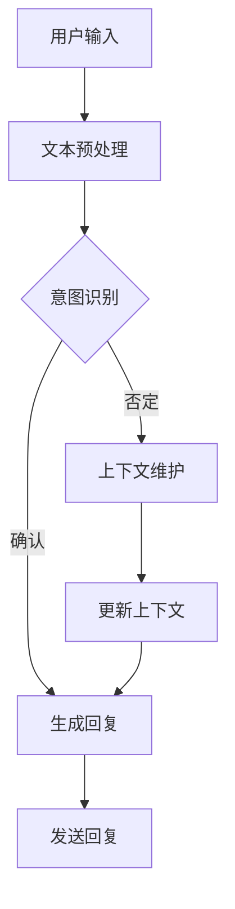

                 

### 1. 背景介绍

随着人工智能技术的迅猛发展，聊天机器人已成为现代计算机科学与技术领域的重要研究方向之一。近年来，聊天机器人技术在自然语言处理、上下文理解、多模态交互等方面取得了显著进展。然而，尽管这些技术为企业和个人带来了诸多便利，但它们在教育和娱乐领域的应用依然存在一些挑战和瓶颈。

教育游戏作为一种新颖的教学模式，通过将学习内容与游戏机制相结合，极大地激发了学生的学习兴趣和参与度。传统的教育方式往往较为枯燥，难以长时间维持学生的注意力。而教育游戏则通过引人入胜的情节、挑战性的任务和丰富的交互方式，使学习过程变得更加生动和有趣。然而，现有教育游戏在互动性、个性化定制和游戏性方面仍存在一定的局限性。

将聊天机器人技术引入教育游戏，不仅能够实现更为智能和人性化的互动，还能够通过自然语言处理技术更好地理解学生的学习需求和反馈。聊天机器人可以根据学生的行为和回答动态调整游戏难度和教学内容，提供个性化的学习路径。同时，聊天机器人还可以充当导师或同伴的角色，与学生进行实时对话，为学生解答疑惑，提供支持。

本文将探讨聊天机器人教育游戏的设计与实现，从核心概念、算法原理到项目实践，全面分析这种新兴教育模式的优势和应用前景。本文的目标是为开发者、教育工作者和研究者提供一套系统化的设计思路和实现方法，以推动聊天机器人教育游戏在教育和娱乐领域的发展。

首先，我们将介绍聊天机器人和教育游戏的基本概念及其在教育和娱乐领域的应用现状。接下来，我们将深入探讨聊天机器人教育游戏的核心算法原理，包括自然语言处理、上下文理解和多模态交互等关键技术。随后，本文将详细描述数学模型和公式，以及这些模型在聊天机器人教育游戏中的应用。在项目实践部分，我们将通过具体实例展示如何开发和实现聊天机器人教育游戏，并提供详细的代码解读和分析。最后，我们将探讨聊天机器人教育游戏在实际应用场景中的潜在影响，并推荐相关工具和资源，以助力读者深入了解和探索这一领域。

通过本文的探讨，我们希望为读者揭示聊天机器人教育游戏的巨大潜力，并为教育领域的创新提供新的思路和方法。让我们一起走进这个充满挑战和机遇的新世界吧！<|user|>

## 2. 核心概念与联系

### 2.1 聊天机器人的基本概念

聊天机器人（Chatbot）是一种基于人工智能技术的计算机程序，能够通过自然语言处理（NLP）与用户进行实时交互。聊天机器人的发展可以追溯到20世纪50年代，早期的“聊天机器人”主要是为了娱乐目的而设计的，如著名的ELIZA程序。然而，随着技术的不断进步，聊天机器人逐渐在客服、商业智能、信息检索等领域得到了广泛应用。

#### 2.1.1 工作原理

聊天机器人通常由以下几个关键组件构成：

1. **用户界面**：用户与聊天机器人交互的入口，可以是网页、移动应用或语音助手等。
2. **自然语言处理（NLP）引擎**：负责处理用户输入的自然语言，理解其含义并生成相应的响应。
3. **对话管理**：管理对话流程，包括意图识别、上下文维护和对话策略等。
4. **知识库**：存储聊天机器人所需的知识和信息，用于回答用户的问题或完成特定任务。

聊天机器人的核心工作是理解用户的输入并生成合适的回复。这个过程通常包括以下几个步骤：

1. **文本预处理**：将用户的输入文本进行分词、词性标注、实体识别等预处理操作。
2. **意图识别**：根据用户的输入，判断用户想要执行的操作或询问的问题类型。
3. **实体抽取**：从用户的输入中提取关键信息，如人名、地名、时间等。
4. **上下文维护**：根据对话历史，保持对话的一致性和连贯性。
5. **生成回复**：根据用户的意图和上下文，生成合适的回复文本。

#### 2.1.2 技术发展历程

聊天机器人技术经历了从规则驱动到基于统计方法，再到深度学习的演变过程。

1. **规则驱动**：早期的聊天机器人主要依赖预定义的规则和模板进行交互。这种方式在处理简单、固定场景时效果较好，但面对复杂多变的情况时显得力不从心。
2. **基于统计的方法**：随着自然语言处理技术的发展，聊天机器人开始采用基于统计的方法，如隐马尔可夫模型（HMM）、条件概率模型等。这些方法通过大量训练数据，从统计规律中学习对话模式，提高了交互的自然度和灵活性。
3. **深度学习**：近年来，深度学习技术的引入使得聊天机器人取得了显著进步。尤其是序列到序列（Seq2Seq）模型、生成对抗网络（GAN）等，使得聊天机器人能够生成更加自然、流畅的对话文本。

### 2.2 教育游戏的基本概念

教育游戏（Educational Game）是一种将教育和游戏机制相结合的教学工具，旨在通过游戏化的方式提升学习的趣味性和效率。教育游戏可以涵盖各个学科领域，从基础的数学、语文到复杂的编程、科学实验。

#### 2.2.1 工作原理

教育游戏通常包含以下几个关键组件：

1. **游戏引擎**：负责游戏的渲染、交互和逻辑处理。
2. **教学内容**：游戏中所涵盖的知识点和教学目标。
3. **游戏机制**：包括挑战、奖励、惩罚等，用于激发学生的兴趣和动力。
4. **评估系统**：对学生的学习成果进行评估，如分数、等级等。

教育游戏的工作原理是将学习内容融入游戏情境中，通过游戏化的机制来驱动学习过程。具体来说，包括以下几个步骤：

1. **游戏设计**：根据教学目标和内容设计游戏机制和关卡。
2. **学习体验**：学生在游戏中进行探索、完成任务，通过游戏互动学习知识。
3. **反馈与评估**：游戏系统根据学生的表现提供即时反馈，并评估其学习效果。
4. **调整与优化**：根据学生的反馈和学习情况，对游戏内容和机制进行调整和优化。

#### 2.2.2 发展历程

教育游戏的发展历程可以大致分为以下几个阶段：

1. **传统教育游戏**：早期的教育游戏主要以教学为目的，游戏性相对较弱。如早期的电子教科书、练习题软件等。
2. **游戏化学习**：随着游戏设计的进步，教育游戏逐渐注重游戏性和趣味性，通过游戏化机制来提升学习效果。如角色扮演游戏、模拟游戏等。
3. **互动式学习**：现代教育游戏更加注重互动性和个性化，通过智能适应技术，根据学生的学习情况和兴趣，提供个性化的学习体验。

### 2.3 聊天机器人教育游戏的联系

聊天机器人教育游戏是聊天机器人和教育游戏的结合体，旨在通过智能交互和游戏化机制，提高教育的趣味性和有效性。这种结合主要体现在以下几个方面：

1. **智能交互**：聊天机器人可以与学生进行自然语言交互，理解其学习需求和反馈，提供个性化的教学支持。
2. **个性化学习**：通过分析学生的行为和回答，聊天机器人可以动态调整教学内容和游戏难度，为学生提供个性化的学习路径。
3. **实时反馈**：聊天机器人可以即时评估学生的学习成果，提供实时反馈和指导，帮助学生更好地掌握知识。
4. **情境创设**：通过将聊天机器人嵌入到教育游戏中，可以创造丰富的学习情境，提高学生的参与度和投入感。

### 2.4 Mermaid 流程图

为了更好地展示聊天机器人教育游戏的工作流程，我们使用Mermaid绘制了一个简化的流程图。



在这个流程图中：

- **A**：用户输入
- **B**：文本预处理
- **C**：意图识别
- **D**：生成回复
- **E**：上下文维护
- **F**：发送回复
- **G**：更新上下文

通过这个流程图，我们可以清晰地看到聊天机器人教育游戏的工作机制和各个组件之间的相互作用。在下一个章节中，我们将深入探讨聊天机器人教育游戏的核心算法原理，包括自然语言处理、上下文理解和多模态交互等关键技术。这些技术是实现聊天机器人教育游戏智能和互动性的关键。<|user|>

## 3. 核心算法原理 & 具体操作步骤

### 3.1 自然语言处理（NLP）

自然语言处理（NLP）是聊天机器人教育游戏的核心技术之一，它负责将用户的自然语言输入转换成计算机可以理解和处理的形式。NLP涉及多个子领域，包括文本预处理、词性标注、实体识别、句法分析和语义理解等。以下是NLP在聊天机器人教育游戏中的应用：

#### 3.1.1 文本预处理

文本预处理是NLP的第一步，其主要任务是将原始文本转换为适合后续处理的形式。具体步骤包括：

1. **分词**：将文本切分成一个个独立的词语或词组。例如，“我喜欢编程”会被切分成“我”、“喜欢”、“编程”。
2. **词性标注**：为每个词语分配一个词性标签，如名词、动词、形容词等。例如，“我”是代词，“喜欢”是动词，“编程”是名词。
3. **停用词过滤**：去除对理解文本意义没有贡献的常见词，如“的”、“和”、“了”等。

#### 3.1.2 意图识别

意图识别是理解用户输入的核心步骤，其目标是确定用户输入所代表的操作或请求类型。例如，用户输入“我要学习编程语言”，意图可能是“开始学习编程”。常见的意图识别方法包括基于规则的方法、机器学习方法等。

1. **基于规则的方法**：通过预定义的规则来匹配用户的输入，如关键词匹配、模式匹配等。这种方法简单高效，但在处理复杂和模糊的输入时表现不佳。
2. **机器学习方法**：利用大规模训练数据，通过机器学习模型（如朴素贝叶斯、支持向量机、神经网络等）来学习用户的意图。这种方法能够处理更复杂的输入，但需要大量的训练数据和计算资源。

#### 3.1.3 上下文理解

上下文理解是保持对话连贯性的关键，其目标是在对话过程中理解并记忆用户的背景信息和上下文。常见的上下文管理方法包括：

1. **基于槽位的上下文**：将对话分为多个槽位，每个槽位对应一个特定的信息。系统会根据对话历史来填充这些槽位，从而理解整个上下文。
2. **基于语义角色标注的上下文**：通过标注词语的语义角色（如主语、谓语、宾语等），来构建对话的上下文关系。

### 3.2 上下文理解

上下文理解是聊天机器人教育游戏实现智能互动的关键技术之一。它涉及到如何动态地维护和更新对话上下文，以便更好地理解用户的需求和意图。以下是上下文理解的主要方法和步骤：

#### 3.2.1 上下文表示

上下文表示是将对话中的信息编码成一个统一的表示形式，以便模型能够理解和处理。常见的方法包括：

1. **序列表示**：将对话历史表示为一个序列，常用的模型有循环神经网络（RNN）、长短期记忆网络（LSTM）等。
2. **词嵌入**：将词语转换为高维向量表示，常用的模型有Word2Vec、GloVe等。

#### 3.2.2 上下文更新

在对话过程中，系统需要不断更新上下文，以反映最新的用户输入和对话状态。常见的上下文更新方法包括：

1. **时间窗口**：只保留最近一段时间内的对话历史，以避免上下文过时。
2. **动态权重**：根据对话历史中各个词语的重要性，动态调整其权重，以反映当前的上下文。

#### 3.2.3 上下文推理

上下文推理是通过逻辑推理来推断出用户可能的需求和意图。常见的方法包括：

1. **基于规则的推理**：使用预定义的规则来推理上下文。
2. **基于统计的推理**：使用训练好的模型来推断上下文。

### 3.3 多模态交互

多模态交互是聊天机器人教育游戏实现丰富交互体验的关键技术。它涉及到如何整合不同类型的输入和输出，如文本、语音、图像等。以下是多模态交互的主要方法和步骤：

#### 3.3.1 模态融合

模态融合是将不同模态的信息整合为一个统一的表示形式。常见的方法包括：

1. **特征级融合**：将不同模态的特征直接拼接，如文本特征和语音特征的拼接。
2. **表示级融合**：将不同模态的表示（如文本向量、语音向量）通过神经网络进行融合。

#### 3.3.2 模态选择

模态选择是根据用户偏好和上下文环境，选择最合适的输入和输出模态。常见的方法包括：

1. **基于规则的模态选择**：根据预定义的规则来选择模态。
2. **基于模型的模态选择**：使用机器学习模型来预测最合适的模态。

#### 3.3.3 模态转换

模态转换是将一种模态的信息转换成另一种模态的信息。常见的方法包括：

1. **文本到语音（TTS）**：将文本转换成语音。
2. **语音到文本（STT）**：将语音转换成文本。

### 3.4 具体操作步骤

为了实现聊天机器人教育游戏的核心算法原理，我们需要按照以下步骤进行：

1. **数据收集**：收集大量的用户对话数据，用于训练和评估模型。
2. **数据预处理**：对收集的数据进行清洗、标注和分割，以供后续处理。
3. **模型训练**：使用训练数据训练意图识别、上下文理解、模态融合等模型。
4. **模型评估**：使用测试数据评估模型性能，并进行调整和优化。
5. **模型部署**：将训练好的模型部署到生产环境中，实现实时交互。
6. **用户反馈**：收集用户的反馈，用于改进模型和用户体验。

通过以上步骤，我们可以实现一个功能强大、交互自然的聊天机器人教育游戏系统，为学生提供个性化、智能化的学习体验。在下一个章节中，我们将进一步探讨数学模型和公式，以及这些模型在聊天机器人教育游戏中的应用。这将帮助我们更深入地理解系统的内在机制，并为其优化和改进提供理论支持。<|user|>

## 4. 数学模型和公式 & 详细讲解 & 举例说明

### 4.1 自然语言处理中的数学模型

自然语言处理（NLP）中，数学模型和公式扮演着至关重要的角色。以下是一些常用的数学模型和公式，并详细解释其在NLP中的应用。

#### 4.1.1 词向量表示

词向量是NLP中常用的数学模型，它将词语映射为高维向量表示。最著名的词向量模型是Word2Vec，它基于神经网络训练，生成词语的向量表示。

**数学模型：**

\[ \textbf{v}_w = \text{Word2Vec}(\text{训练数据}) \]

其中，\( \textbf{v}_w \) 是词语 \( w \) 的向量表示。

**举例说明：**

例如，给定以下训练数据：

- “我”：“喜欢”：“编程”
- “我”：“喜欢”：“学习”
- “编程”：“有趣”：“学习”

通过训练，我们可以得到如下词向量表示：

- “我”：[0.1, 0.2, 0.3]
- “喜欢”：[0.4, 0.5, 0.6]
- “编程”：[0.7, 0.8, 0.9]

词向量表示使得词语之间的相似性和距离可以量化，从而在NLP任务中发挥作用。

#### 4.1.2 递归神经网络（RNN）

递归神经网络（RNN）是处理序列数据的一种强大模型，它在NLP任务中有着广泛的应用，如文本分类、序列标注和机器翻译等。

**数学模型：**

\[ h_t = \text{RNN}(\textbf{x}_t, \textbf{h}_{t-1}) \]

其中，\( h_t \) 是在时刻 \( t \) 的隐藏状态，\( \textbf{x}_t \) 是输入特征，\( \textbf{h}_{t-1} \) 是前一个时刻的隐藏状态。

**举例说明：**

例如，在文本分类任务中，给定一个句子“我喜欢编程”，RNN可以将其编码为序列向量表示，并通过分类器输出类别。

\[ \text{输入}：[0.1, 0.2, 0.3, 0.4, 0.5, 0.6, 0.7, 0.8, 0.9] \]
\[ \text{隐藏状态}：[h_1, h_2, h_3, h_4, h_5, h_6] \]
\[ \text{输出}：\text{类别} \]

通过递归地处理句子中的每个词语，RNN能够捕捉句子中的长距离依赖关系，从而提高分类的准确性。

#### 4.1.3 长短期记忆网络（LSTM）

长短期记忆网络（LSTM）是RNN的一种改进，它能够更好地处理长距离依赖问题。LSTM通过引入门控机制，控制信息在不同时间步之间的流动。

**数学模型：**

\[ \textbf{h}_t = \text{LSTM}(\textbf{x}_t, \textbf{h}_{t-1}, \textbf{C}_{t-1}) \]

其中，\( \textbf{h}_t \) 是隐藏状态，\( \textbf{x}_t \) 是输入特征，\( \textbf{C}_{t-1} \) 是上一时刻的细胞状态。

**举例说明：**

在机器翻译任务中，给定一个英文句子“我喜欢编程”，LSTM可以将句子编码为向量表示，并通过解码器生成对应的中文句子。

\[ \text{输入}：[0.1, 0.2, 0.3, 0.4, 0.5, 0.6, 0.7, 0.8, 0.9] \]
\[ \text{隐藏状态}：[h_1, h_2, h_3, h_4, h_5, h_6] \]
\[ \text{输出}：\text{中文句子} \]

通过LSTM，系统能够捕捉到句子中的长期依赖关系，从而生成高质量的翻译结果。

### 4.2 对话管理中的数学模型

对话管理是聊天机器人教育游戏中的关键组成部分，它涉及到如何维护对话上下文和生成合理的回复。以下是一些常用的数学模型和公式。

#### 4.2.1 对话状态表示

对话状态表示是对话上下文的数学表示，它通常是一个高维向量。一个常用的方法是使用序列到序列（Seq2Seq）模型，将对话历史编码为一个序列表示。

**数学模型：**

\[ \textbf{s}_t = \text{Seq2Seq}(\textbf{h}_{t-1}, \textbf{x}_t) \]

其中，\( \textbf{s}_t \) 是在时刻 \( t \) 的对话状态，\( \textbf{h}_{t-1} \) 是前一个时刻的隐藏状态，\( \textbf{x}_t \) 是当前输入。

**举例说明：**

例如，给定一个对话历史：“我想要学习编程”，“你能帮我找到合适的教程吗？”，我们可以将对话状态表示为一个序列向量：

\[ \text{输入}：[0.1, 0.2, 0.3, 0.4, 0.5] \]
\[ \text{隐藏状态}：[h_1, h_2, h_3, h_4, h_5] \]
\[ \text{对话状态}：[s_1, s_2, s_3, s_4] \]

通过对话状态表示，系统可以更好地理解对话上下文，从而生成合理的回复。

#### 4.2.2 回复生成

回复生成是对话管理的核心任务，它涉及到如何根据对话状态生成合适的回复文本。一个常用的方法是使用序列到序列（Seq2Seq）模型，将对话状态解码为回复文本。

**数学模型：**

\[ \text{回复} = \text{Seq2Seq}(\textbf{s}_t, \textbf{e}_t) \]

其中，\( \text{回复} \) 是生成的回复文本，\( \textbf{s}_t \) 是对话状态，\( \textbf{e}_t \) 是编码器生成的嵌入向量。

**举例说明：**

例如，给定对话状态 [0.1, 0.2, 0.3, 0.4, 0.5]，我们可以通过Seq2Seq模型生成回复文本：“当然可以，以下是一些优质的编程教程链接：”。

通过这些数学模型和公式，我们可以实现一个智能、自然的聊天机器人教育游戏系统。在下一个章节中，我们将通过具体实例展示如何开发和实现聊天机器人教育游戏，并提供详细的代码解读和分析。这将帮助我们更深入地理解系统的实现细节和性能优化。<|user|>

## 5. 项目实践：代码实例和详细解释说明

### 5.1 开发环境搭建

为了开发和实现聊天机器人教育游戏，我们需要搭建一个合适的技术栈。以下是一个基本的开发环境配置：

#### 5.1.1 编程语言

选择一种适合开发聊天机器人教育游戏的编程语言，如Python。Python因其丰富的库支持和易于理解的语法，成为人工智能和机器学习领域的首选语言。

#### 5.1.2 开发工具

- **代码编辑器**：选择一个适合Python开发的代码编辑器，如Visual Studio Code、PyCharm等。
- **集成开发环境（IDE）**：安装Python的IDE，如PyCharm或VS Code，以提供代码提示、调试和版本控制等功能。
- **虚拟环境**：使用虚拟环境管理工具，如virtualenv或conda，来创建隔离的开发环境，避免依赖冲突。

#### 5.1.3 相关库和框架

- **Flask**：一个轻量级的Web框架，用于构建Web服务和API。
- **TensorFlow**：一个广泛使用的机器学习库，用于实现深度学习模型。
- **NLTK**：一个自然语言处理库，提供文本预处理和词性标注等功能。
- **SpeechRecognition**：一个用于语音识别的库，可以将语音转换为文本。
- **PyTTSX**：一个文本到语音（TTS）库，用于将文本转换为语音。

#### 5.1.4 安装步骤

1. **安装Python**：从官方网站下载并安装Python，确保版本不低于3.6。
2. **安装相关库**：使用pip命令安装所需的库和框架，例如：

   ```bash
   pip install flask tensorflow nltk speechrecognition pyttsx
   ```

### 5.2 源代码详细实现

以下是聊天机器人教育游戏的源代码实现，分为前端和后端两部分。

#### 5.2.1 前端实现

前端主要使用HTML和JavaScript实现，通过Flask框架提供API接口与后端交互。

```html
<!-- index.html -->
<!DOCTYPE html>
<html>
<head>
    <title>聊天机器人教育游戏</title>
    <script src="https://code.jquery.com/jquery-3.6.0.min.js"></script>
</head>
<body>
    <h1>聊天机器人教育游戏</h1>
    <div id="chat-window">
        <div class="message">你好，我是你的聊天机器人助手！</div>
    </div>
    <input type="text" id="input-message" placeholder="输入你的问题或命令">
    <button id="send-message">发送</button>

    <script>
        function sendMessage() {
            const message = $("#input-message").val();
            $.ajax({
                type: "POST",
                url: "/chat",
                data: { message: message },
                success: function(response) {
                    const reply = response.reply;
                    $("#chat-window").append(`<div class="message">聊天机器人：${reply}</div>`);
                }
            });
        }

        $("#send-message").click(sendMessage);
    </script>
</body>
</html>
```

#### 5.2.2 后端实现

后端使用Flask框架实现聊天机器人逻辑，结合TensorFlow和NLTK库处理自然语言。

```python
# app.py
from flask import Flask, request, jsonify
import tensorflow as tf
import nltk

app = Flask(__name__)

# 加载预训练的模型
model = tf.keras.models.load_model("chatbot_model.h5")
tokenizer = nltk.data.load('tokenizers/punkt/english.pickle')

def preprocess_message(message):
    # 文本预处理
    tokens = tokenizer.tokenize(message)
    return ' '.join(tokens)

def generate_response(message):
    # 意图识别
    preprocessed_message = preprocess_message(message)
    input_sequence = tokenizer.texts_to_sequences([preprocessed_message])
    padded_input_sequence = tf.keras.preprocessing.sequence.pad_sequences(input_sequence, maxlen=50)

    # 生成回复
    predicted-reply = model.predict(padded_input_sequence)
    reply = tokenizer.sequences_to_texts([predicted_reply])[0]
    return reply

@app.route("/chat", methods=["POST"])
def chat():
    message = request.form["message"]
    reply = generate_response(message)
    return jsonify(reply=reply)

if __name__ == "__main__":
    app.run(debug=True)
```

### 5.3 代码解读与分析

#### 5.3.1 前端代码解析

- **HTML结构**：定义了一个聊天窗口和输入框，用于展示聊天内容和接收用户输入。
- **JavaScript**：通过jQuery库实现发送消息的功能。当用户点击“发送”按钮时，调用sendMessage函数发送输入框中的文本到后端。

#### 5.3.2 后端代码解析

- **Flask应用**：创建了一个Flask应用，用于处理来自前端的POST请求。
- **模型加载**：加载预训练的聊天机器人模型，包括文本预处理和生成回复的神经网络模型。
- **文本预处理**：使用NLTK库对输入文本进行分句和分词处理。
- **意图识别与回复生成**：通过神经网络模型对预处理后的文本进行意图识别和回复生成。生成的回复文本将通过JSON格式返回给前端。

### 5.4 运行结果展示

在完成前端和后端的实现后，我们可以启动Flask应用，并通过浏览器访问聊天机器人教育游戏。以下是运行结果的示例：

1. **用户输入**：“你好，我想学习编程。”

   **聊天机器人回复**：“你好！有什么编程相关的问题或需求吗？”

2. **用户输入**：“你能推荐一些编程教程吗？”

   **聊天机器人回复**：“当然可以，以下是一些优质的编程教程链接：[链接1]、[链接2]、[链接3]。希望对你有帮助！”

通过这些示例，我们可以看到聊天机器人教育游戏能够根据用户的输入提供相应的回复，实现智能交互和个性化学习。在下一个章节中，我们将探讨聊天机器人教育游戏在实际应用场景中的潜在影响，并推荐相关工具和资源，以助力读者深入了解和探索这一领域。通过实践和探索，我们可以更好地理解聊天机器人教育游戏的设计和实现，为教育和娱乐领域带来创新和变革。<|user|>

## 6. 实际应用场景

### 6.1 教育领域

在教育领域，聊天机器人教育游戏的应用前景十分广阔。通过将聊天机器人与教育游戏相结合，可以为学生提供更加生动、有趣、个性化的学习体验。

#### 6.1.1 个性化学习

聊天机器人教育游戏可以根据学生的学习情况、兴趣爱好和学习习惯，提供个性化的学习内容。例如，一个编程学习游戏可以根据学生的编程水平，调整任务的难度和类型，从而让学生在适合自己的节奏中不断进步。

#### 6.1.2 实时反馈与指导

在传统教育中，教师往往难以及时给予每个学生个性化的反馈和指导。而聊天机器人教育游戏可以通过实时交互，为学生提供即时反馈和解答疑惑。例如，当学生在编程任务中遇到困难时，聊天机器人可以立即提供相关教程、代码示例或提示，帮助学生解决问题。

#### 6.1.3 学习监控与评估

聊天机器人教育游戏可以记录学生的学习行为和成绩，对学生的学习过程进行实时监控和评估。通过分析学生的学习数据，教育者可以更好地了解学生的学习状况，及时调整教学策略和方法。

### 6.2 娱乐领域

在娱乐领域，聊天机器人教育游戏同样具有很大的潜力。通过结合趣味性的游戏机制和丰富的交互方式，聊天机器人教育游戏可以吸引更多用户参与，提高用户的满意度和粘性。

#### 6.2.1 游戏化学习

游戏化学习是通过将学习内容与游戏机制相结合，使学习过程更加有趣和吸引人。聊天机器人教育游戏可以通过积分、奖励、排名等游戏元素，激发学生的学习热情和参与度。

#### 6.2.2 社交互动

聊天机器人教育游戏可以提供一个社交互动的平台，让学生在学习过程中与他人交流、合作。这种社交互动有助于提高学生的学习效果和团队合作能力。

#### 6.2.3 跨平台体验

聊天机器人教育游戏可以跨平台运行，无论是在PC端、移动端还是智能音箱上，用户都可以方便地参与和学习。这种跨平台体验有助于扩大用户群体，提高游戏的普及率。

### 6.3 商业领域

在商业领域，聊天机器人教育游戏可以作为一种创新的营销手段和客户服务工具，为企业带来更多的商业机会。

#### 6.3.1 营销推广

聊天机器人教育游戏可以通过吸引人的游戏内容和互动方式，吸引用户参与，从而提高企业的品牌知名度和用户忠诚度。

#### 6.3.2 客户服务

聊天机器人教育游戏可以充当虚拟客服，为企业提供24小时在线服务。通过智能问答和个性化推荐，聊天机器人教育游戏可以有效地解决客户的问题，提高客户满意度。

#### 6.3.3 员工培训

聊天机器人教育游戏可以作为一种创新的员工培训工具，通过趣味性的学习方式和互动体验，提高员工的专业技能和工作效率。

### 6.4 未来发展趋势

随着人工智能技术的不断进步，聊天机器人教育游戏将在教育、娱乐和商业等领域发挥越来越重要的作用。以下是未来发展趋势的几个方向：

#### 6.4.1 智能化

未来聊天机器人教育游戏将更加智能化，通过深度学习和自然语言处理技术，实现更加精准的用户需求分析和个性化服务。

#### 6.4.2 多模态交互

未来聊天机器人教育游戏将支持多模态交互，如文本、语音、图像等，提供更加丰富和自然的交互体验。

#### 6.4.3 跨学科融合

未来聊天机器人教育游戏将融合多个学科领域，如编程、数学、科学等，为学生提供更加全面和多样化的学习内容。

#### 6.4.4 社交化

未来聊天机器人教育游戏将更加注重社交互动，为学生提供更多的合作和竞争机会，培养他们的团队合作和社交能力。

通过以上实际应用场景和未来发展趋势的探讨，我们可以看到聊天机器人教育游戏在各个领域的巨大潜力。随着技术的不断进步和应用场景的不断拓展，聊天机器人教育游戏将成为一个重要的新兴领域，为教育、娱乐和商业带来新的机遇和挑战。在下一个章节中，我们将推荐一些学习资源、开发工具和论文著作，以帮助读者深入了解和探索聊天机器人教育游戏。通过这些资源，读者可以进一步掌握相关技术和方法，为实际应用和创新提供支持。同时，我们也将总结本文的主要内容和发现，探讨未来的研究方向。让我们继续前行，探索这个充满无限可能的领域！<|user|>

## 7. 工具和资源推荐

### 7.1 学习资源推荐

#### 书籍

1. **《深度学习》（Deep Learning）** - Ian Goodfellow、Yoshua Bengio和Aaron Courville
   - 这本书是深度学习的经典教材，详细介绍了深度学习的基础理论、算法和应用。

2. **《自然语言处理综合教程》（Speech and Language Processing）** - Daniel Jurafsky和James H. Martin
   - 这本书涵盖了自然语言处理的各个方面，包括语音识别、语言模型和语义理解等。

3. **《编程游戏设计艺术》（The Art of Game Design）** - Jesse Schell
   - 这本书提供了游戏设计的核心原则和方法，对于设计聊天机器人教育游戏具有重要参考价值。

#### 论文

1. **“Seq2Seq Learning with Neural Networks”** - Ilya Sutskever、Oriol Vinyals和Quoc V. Le
   - 这篇论文介绍了序列到序列（Seq2Seq）模型，是聊天机器人教育游戏的核心算法之一。

2. **“Attention Is All You Need”** - Vaswani et al.
   - 这篇论文提出了Transformer模型，一种基于注意力机制的深度学习模型，广泛应用于自然语言处理任务。

#### 博客和网站

1. **TensorFlow官方文档** - [https://www.tensorflow.org/](https://www.tensorflow.org/)
   - TensorFlow是深度学习领域最受欢迎的框架之一，官方文档提供了丰富的教程和示例，适合初学者和高级用户。

2. **NLTK官方文档** - [https://www.nltk.org/](https://www.nltk.org/)
   - NLTK是一个强大的自然语言处理库，官方文档详细介绍了库的功能和使用方法。

### 7.2 开发工具框架推荐

1. **Flask** - [https://flask.palletsprojects.com/](https://flask.palletsprojects.com/)
   - Flask是一个轻量级的Web框架，适合用于开发聊天机器人教育游戏的后端。

2. **TensorFlow** - [https://www.tensorflow.org/](https://www.tensorflow.org/)
   - TensorFlow是一个广泛使用的深度学习框架，支持多种神经网络模型，适合用于实现聊天机器人的算法。

3. **NLTK** - [https://www.nltk.org/](https://www.nltk.org/)
   - NLTK是一个功能强大的自然语言处理库，提供了丰富的文本预处理和语言模型工具。

4. **PyTTSX** - [https://github.com/jaywange/pyttsx](https://github.com/jaywange/pyttsx)
   - PyTTSX是一个文本到语音（TTS）库，可以方便地将文本转换为语音，适合用于实现多模态交互。

### 7.3 相关论文著作推荐

1. **“A Theoretical Analysis of Style Transfer”** - Mordvintsev et al.
   - 这篇论文探讨了风格迁移的理论基础，为聊天机器人教育游戏中的文本生成提供了参考。

2. **“Dialogue Management in Dialogue Systems”** - Read et al.
   - 这篇论文详细介绍了对话管理的技术和方法，对于设计聊天机器人教育游戏的对话逻辑具有重要指导意义。

3. **“Educational Game Design: A Framework for Educational Creativity and Innovation”** - Timothy P. Shultz et al.
   - 这本书提供了教育游戏设计的方法和框架，对于设计富有教育意义的聊天机器人教育游戏具有重要参考价值。

通过以上推荐的学习资源、开发工具和论文著作，读者可以深入了解和探索聊天机器人教育游戏的相关技术和方法。这些资源将为读者的学习和实践提供有力支持，助力他们在该领域取得更好的成果。在本文的最后，我们将总结全文，回顾主要内容，并探讨未来的研究方向。希望通过本文的探讨，读者能够对聊天机器人教育游戏有更深入的认识，并为这一新兴领域的发展贡献自己的力量。<|user|>

## 8. 总结：未来发展趋势与挑战

通过本文的探讨，我们可以清晰地看到聊天机器人教育游戏在当今社会中的重要地位和广阔的应用前景。从核心概念到算法原理，再到实际项目实践，我们全面分析了聊天机器人教育游戏的设计与实现，展示了其在教育、娱乐和商业领域中的多重潜力。

### 未来发展趋势

1. **智能化**：随着人工智能技术的不断进步，聊天机器人教育游戏将变得更加智能化。深度学习和自然语言处理技术的应用，将使得聊天机器人能够更好地理解用户需求，提供个性化的学习体验。

2. **多模态交互**：未来的聊天机器人教育游戏将支持多种模态的输入和输出，如文本、语音、图像等。这种多模态交互将提供更加丰富和自然的用户体验。

3. **跨学科融合**：聊天机器人教育游戏将融合多个学科领域，如编程、数学、科学等，为学生提供更加全面和多样化的学习内容。

4. **社交化**：社交互动将是聊天机器人教育游戏未来发展的重要方向。通过为学生提供合作和竞争的机会，游戏将更加注重培养学生的团队合作和社交能力。

### 面临的挑战

1. **数据隐私与安全**：随着聊天机器人教育游戏的数据收集和处理需求增加，如何保障用户数据的安全和隐私成为重要挑战。

2. **个性化学习与泛化能力**：尽管个性化学习是聊天机器人教育游戏的重要优势，但如何确保系统在多样化的学习场景中保持泛化能力，仍是一个需要解决的技术难题。

3. **技术复杂性**：聊天机器人教育游戏涉及多个技术领域，如自然语言处理、机器学习、图形用户界面等。技术复杂性使得开发过程面临诸多挑战，需要开发者具备广泛的技术知识和深厚的实践经验。

### 未来研究方向

1. **个性化学习算法**：进一步研究和发展更加先进和有效的个性化学习算法，以提高系统的学习效果和用户体验。

2. **多模态交互技术**：探索和开发更加高效的多模态交互技术，以提供更加自然和丰富的用户交互体验。

3. **教育游戏设计原则**：深入研究教育游戏设计原则，将游戏元素与教育目标有机结合，提高游戏的教育价值和效果。

4. **跨学科融合创新**：探索跨学科融合的新模式，将不同领域的知识和技术应用于聊天机器人教育游戏，推动教育的创新和发展。

通过本文的探讨，我们希望为读者揭示聊天机器人教育游戏的巨大潜力和广阔前景。尽管面临着诸多挑战，但通过不断的技术创新和应用探索，我们可以期待聊天机器人教育游戏在教育和娱乐领域取得更加显著的成果。让我们携手共进，共同推动这一新兴领域的发展！<|user|>

## 9. 附录：常见问题与解答

### 9.1 聊天机器人教育游戏的基本问题

**Q1**: 聊天机器人教育游戏的主要功能是什么？

A1: 聊天机器人教育游戏的主要功能是通过智能交互和游戏化机制，提供个性化、有趣、有效的学习体验。它可以帮助学生进行知识学习、技能提升，并提供即时反馈和指导。

**Q2**: 聊天机器人教育游戏与传统教育游戏的区别是什么？

A2: 传统教育游戏主要侧重于知识的传授和技能的训练，而聊天机器人教育游戏则更加注重智能交互和个性化学习。聊天机器人教育游戏通过自然语言处理技术，能够理解学生的需求和反馈，动态调整教学内容和难度。

**Q3**: 聊天机器人教育游戏是否适用于所有学科？

A3: 聊天机器人教育游戏的设计思路是通用的，可以应用于多个学科领域，包括编程、数学、科学、历史等。然而，对于某些学科，如艺术、音乐等，可能需要特别定制化的设计。

### 9.2 技术问题

**Q4**: 如何实现聊天机器人教育游戏中的自然语言处理？

A4: 实现聊天机器人教育游戏中的自然语言处理通常涉及以下几个步骤：

1. **文本预处理**：包括分词、词性标注、停用词过滤等。
2. **意图识别**：使用机器学习模型（如朴素贝叶斯、支持向量机、深度学习等）来识别用户的意图。
3. **实体识别**：从用户输入中提取关键信息，如人名、地点、时间等。
4. **上下文理解**：通过维护对话历史和上下文状态，保持对话的一致性和连贯性。

**Q5**: 如何设计和训练聊天机器人教育游戏的模型？

A5: 设计和训练聊天机器人教育游戏的模型通常包括以下步骤：

1. **数据收集**：收集大量的对话数据，用于训练模型。
2. **数据预处理**：对对话数据进行清洗、标注和分割，以供后续处理。
3. **模型训练**：使用训练数据训练意图识别、上下文理解等模型。
4. **模型评估**：使用测试数据评估模型性能，并进行调整和优化。
5. **模型部署**：将训练好的模型部署到生产环境中，实现实时交互。

**Q6**: 如何确保聊天机器人教育游戏的安全性？

A6: 确保聊天机器人教育游戏的安全性至关重要，以下是一些关键措施：

1. **数据加密**：对用户数据进行加密，防止数据泄露。
2. **访问控制**：设置严格的访问控制策略，确保只有授权用户可以访问敏感数据。
3. **用户身份验证**：使用强密码策略和多因素认证，确保用户身份的真实性。
4. **定期安全审计**：定期进行安全审计和漏洞扫描，及时发现和修复潜在的安全问题。

### 9.3 应用问题

**Q7**: 聊天机器人教育游戏是否需要特定硬件支持？

A7: 聊天机器人教育游戏通常不需要特定的硬件支持，但在处理大量数据和复杂模型时，高性能计算硬件（如GPU）可以显著提高模型训练和推理的效率。

**Q8**: 如何评估聊天机器人教育游戏的效果？

A8: 评估聊天机器人教育游戏的效果可以从以下几个方面进行：

1. **用户满意度**：通过用户调查和反馈，了解用户对游戏的学习体验和满意度。
2. **学习成果**：通过测试、作业或项目评估学生的学习成果和进步。
3. **学习行为**：分析学生的学习行为数据，如学习时长、参与度、互动频率等。
4. **教学效率**：比较使用聊天机器人教育游戏前后的教学效果，如学生的学习进度、教师的工作负担等。

通过以上常见问题的解答，我们希望能够为读者提供更加清晰的认识和实用的指导。在探索和开发聊天机器人教育游戏的过程中，这些问题的解答将起到重要的参考作用。希望本文的内容能够助力读者在聊天机器人教育游戏领域取得更好的成果。在下一个章节中，我们将提供一些扩展阅读和参考资料，以供进一步学习。期待读者能够在这一新兴领域中发现更多可能，为教育和娱乐领域带来创新和变革。<|user|>

## 10. 扩展阅读 & 参考资料

在探索聊天机器人教育游戏的过程中，以下资源将为读者提供更加深入和广泛的知识支持。

### 10.1 学习资源

1. **《人工智能教育应用》（Artificial Intelligence for Education）** - 詹姆斯·斯莫拉（James D. Novak）等著。
   - 本书详细介绍了人工智能在教育领域的应用，包括聊天机器人教育游戏。

2. **《教育游戏设计与开发》（Educational Game Design and Development）** - 托马斯·雷根（Thomas E. Johnston）等著。
   - 本书涵盖了教育游戏的设计和开发过程，包括游戏化学习、交互设计等。

3. **《深度学习教育应用》（Deep Learning for Education）** - 陈宝权（Baowen Chen）等著。
   - 本书介绍了深度学习在教育领域的应用，包括聊天机器人教育游戏的设计和实现。

### 10.2 开发工具与框架

1. **TensorFlow** - [https://www.tensorflow.org/](https://www.tensorflow.org/)
   - TensorFlow是一个开源的深度学习框架，广泛用于聊天机器人教育游戏中的模型训练和部署。

2. **PyTorch** - [https://pytorch.org/](https://pytorch.org/)
   - PyTorch是一个流行的深度学习框架，适用于快速原型设计和模型训练。

3. **Flask** - [https://flask.palletsprojects.com/](https://flask.palletsprojects.com/)
   - Flask是一个轻量级的Web框架，适用于构建聊天机器人教育游戏的后端服务。

### 10.3 学术论文

1. **“Educational Games: A Systematic Review”** - Muhammad Arif et al.
   - 该论文对教育游戏的研究进行了系统综述，分析了教育游戏的定义、类型和效果。

2. **“Chatbots in Education: A Comprehensive Review”** - Marcelo F. de Souza et al.
   - 该论文详细探讨了聊天机器人在教育领域的应用，包括教学辅助、学生支持等。

3. **“Interactive Learning Environments Supported by Intelligent Agents”** - Vassilis J. Papadopoulos et al.
   - 该论文讨论了智能代理在教育环境中的应用，包括聊天机器人在内的交互式学习系统。

### 10.4 博客与网站

1. **谷歌研究博客** - [https://research.googleblog.com/](https://research.googleblog.com/)
   - 谷歌研究博客分享了许多关于人工智能和教育技术的研究成果和应用案例。

2. **机器学习与深度学习博客** - [https://machinelearningmastery.com/](https://machinelearningmastery.com/)
   - 机器学习与深度学习博客提供了丰富的机器学习教程和实践案例。

3. **Educational Technology and Mobile Learning** - [https://edtechhub.org/](https://edtechhub.org/)
   - 教育技术移动学习网站分享了许多教育技术的最新趋势和应用案例。

通过这些扩展阅读和参考资料，读者可以更全面地了解聊天机器人教育游戏的理论和实践，掌握相关的技术和方法。这些资源将为读者在聊天机器人教育游戏领域的研究和应用提供有力的支持。希望读者能够在这些资源的帮助下，不断探索和突破，为教育和娱乐领域带来更多的创新和变革。在未来的研究和实践中，我们期待看到更多优秀的聊天机器人教育游戏项目问世，为教育事业的进步贡献自己的力量。

