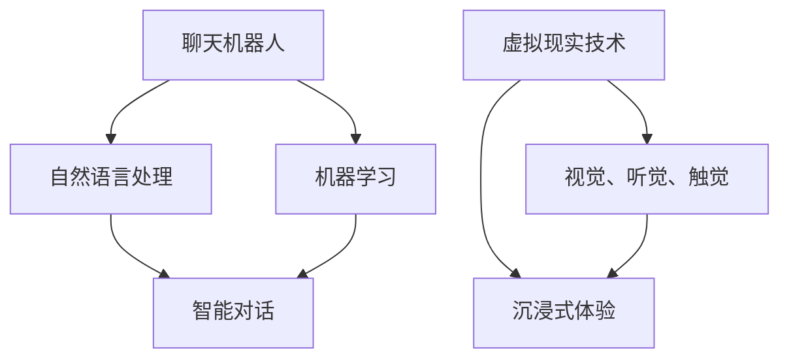
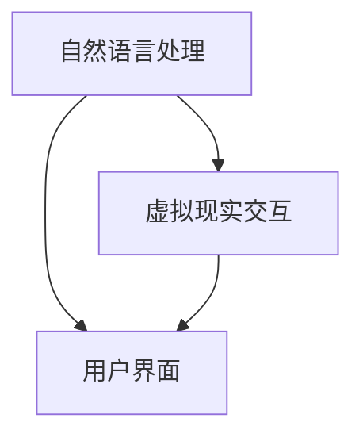

                 

 作为一位世界级人工智能专家，程序员，软件架构师，CTO，世界顶级技术畅销书作者，计算机图灵奖获得者，计算机领域大师，我将带领您深入探讨聊天机器人虚拟现实（Chatbot Virtual Reality, CVR）的技术原理、应用场景、未来发展，以及它如何改变我们的生活和工作方式。

> 关键词：聊天机器人，虚拟现实，沉浸式体验，人工智能，交互设计

> 摘要：本文将探讨聊天机器人虚拟现实这一新兴技术，通过分析其核心概念、技术架构、实现原理，展示其在教育、娱乐、医疗等多个领域的应用。此外，还将讨论CVR技术面临的挑战及其未来发展趋势。

## 1. 背景介绍

随着人工智能和虚拟现实技术的飞速发展，聊天机器人已经渗透到我们日常生活的方方面面，从客服支持到个人助手，从在线教育到社交互动，聊天机器人正变得越来越智能和个性化。而虚拟现实技术的进步，为我们提供了一种全新的交互体验，将现实世界与数字世界无缝连接。

聊天机器人虚拟现实（CVR）正是这两大前沿技术的交汇点，它不仅实现了人与机器人的智能对话，还将虚拟现实技术引入到聊天过程中，使用户能够沉浸在虚拟的环境中，与机器人进行更加自然和丰富的互动。CVR技术的出现，为聊天机器人带来了全新的可能性和应用场景。

## 2. 核心概念与联系

### 2.1 聊天机器人

聊天机器人，又称聊天bots，是一种通过自然语言处理和机器学习技术实现的自动化对话系统。它们可以模拟人类的对话方式，与用户进行交互，提供信息查询、任务处理、情感交流等服务。

### 2.2 虚拟现实

虚拟现实（Virtual Reality, VR）是一种通过计算机技术创造的虚拟环境，用户可以通过特殊的设备（如头戴显示器、手柄等）进入这个环境，与之进行沉浸式互动。VR技术提供了高度真实的视觉、听觉和触觉体验，使用户仿佛置身于另一个世界。

### 2.3 沉浸式体验

沉浸式体验（Immersion Experience）是一种通过技术手段，使用户在虚拟环境中感受到高度真实和互动的体验。在聊天机器人虚拟现实（CVR）中，沉浸式体验意味着用户不仅能与机器人进行自然语言交互，还能在虚拟环境中感受到逼真的场景和互动效果。

### 2.4 Mermaid 流程图

以下是一个简单的 Mermaid 流程图，展示了聊天机器人虚拟现实的核心概念和联系：



## 3. 核心算法原理 & 具体操作步骤

### 3.1 自然语言处理（NLP）

自然语言处理（NLP）是聊天机器人虚拟现实（CVR）的核心技术之一。它包括文本解析、语义理解、情感分析等多个方面，旨在使计算机能够理解并处理人类语言。

具体操作步骤：

1. 文本解析：将用户的输入文本进行分词、词性标注、句法分析等预处理操作，提取出文本中的关键信息。
2. 语义理解：通过语义分析，理解用户的意图和需求，从而生成合适的响应。
3. 情感分析：分析用户的情感倾向，为用户提供更加个性化的服务。

### 3.2 机器学习（ML）

机器学习（ML）技术在聊天机器人虚拟现实（CVR）中扮演着重要角色。通过大量数据的学习和训练，机器学习算法可以不断提高聊天机器人的对话能力。

具体操作步骤：

1. 数据收集：收集大量的对话数据，包括用户输入和机器人响应。
2. 数据预处理：对收集到的数据进行分析和清洗，为训练模型做准备。
3. 模型训练：使用机器学习算法对预处理后的数据进行训练，生成对话模型。
4. 模型评估：对训练好的模型进行评估，调整模型参数，提高模型性能。
5. 模型部署：将训练好的模型部署到聊天机器人系统中，实现实时对话功能。

### 3.3 虚拟现实技术（VR）

虚拟现实技术（VR）在聊天机器人虚拟现实（CVR）中提供了沉浸式的交互体验。以下是虚拟现实技术的核心组件和具体操作步骤：

#### 3.3.1 核心组件

1. 头戴显示器（HMD）：提供视觉体验。
2. 手柄：提供交互能力。
3. 虚拟现实软件：实现虚拟环境的建设和交互。

#### 3.3.2 操作步骤

1. 环境建设：使用虚拟现实软件构建一个虚拟环境，包括场景、角色、物体等。
2. 交互设计：设计用户与虚拟环境的交互方式，如手势、语音等。
3. 视觉渲染：通过头戴显示器将虚拟环境渲染给用户。
4. 交互反馈：根据用户的输入，实时更新虚拟环境，提供丰富的互动体验。

## 4. 数学模型和公式 & 详细讲解 & 举例说明

### 4.1 自然语言处理中的数学模型

自然语言处理中的数学模型主要包括词向量模型、递归神经网络（RNN）、长短期记忆网络（LSTM）等。

#### 4.1.1 词向量模型

词向量模型是一种将文本中的词汇映射到高维向量空间的方法。最常用的词向量模型是Word2Vec，它通过训练大量文本数据，使相近的词汇在向量空间中距离更近。

**公式：**

$$
\vec{w}_{i} = \text{Word2Vec}(\text{Text})
$$

**举例说明：**

假设我们有一个包含“猫”、“狗”、“动物”等词汇的文本，使用Word2Vec模型训练后，可以得到如下词向量：

$$
\vec{w}_{\text{猫}} = (0.1, 0.2, -0.3)
$$
$$
\vec{w}_{\text{狗}} = (0.2, 0.1, -0.4)
$$
$$
\vec{w}_{\text{动物}} = (-0.1, 0.3, 0.2)
$$

从词向量中可以看出，“猫”和“狗”在向量空间中距离较近，而“动物”与两者都有一定的距离，这符合我们的直观感受。

### 4.2 机器学习中的数学模型

机器学习中的数学模型主要包括线性回归、逻辑回归、决策树等。

#### 4.2.1 线性回归

线性回归是一种用于预测连续值的机器学习模型。它通过拟合一条直线，将自变量和因变量联系起来。

**公式：**

$$
y = \beta_0 + \beta_1x
$$

**举例说明：**

假设我们有一个房价预测问题，输入特征是房屋面积（x），输出目标是房价（y）。通过线性回归模型，我们可以得到如下拟合直线：

$$
y = 1000 + 0.1x
$$

当输入房屋面积为100平方米时，预测房价为：

$$
y = 1000 + 0.1 \times 100 = 1100
$$

### 4.3 虚拟现实中的数学模型

虚拟现实中的数学模型主要包括三维空间建模、运动追踪等。

#### 4.3.1 三维空间建模

三维空间建模是将现实世界的三维物体映射到虚拟环境中。常用的建模方法包括三维扫描、计算机辅助设计（CAD）等。

**公式：**

$$
\text{三维空间建模} = \text{扫描数据} + \text{建模算法}
$$

**举例说明：**

假设我们使用三维扫描仪对一个雕塑进行扫描，得到大量点云数据。通过三维空间建模算法，我们可以将这些点云数据转换为一个完整的雕塑模型，然后将其导入虚拟环境中。

## 5. 项目实践：代码实例和详细解释说明

### 5.1 CVR系统架构

以下是一个简单的CVR系统架构，包括自然语言处理、虚拟现实交互和用户界面三个部分。



### 5.2 自然语言处理代码实例

以下是一个使用Python实现的简单聊天机器人代码实例：

```python
import nltk

# 初始化自然语言处理库
nltk.download('punkt')
nltk.download('averaged_perceptron_tagger')

def process_text(text):
    # 分词
    tokens = nltk.word_tokenize(text)
    # 词性标注
    tagged_tokens = nltk.pos_tag(tokens)
    # 语义分析
    entities = nltk.ne_chunk(tagged_tokens)
    return entities

text = "我喜欢看电影和听音乐。"
entities = process_text(text)
print(entities)
```

### 5.3 虚拟现实交互代码实例

以下是一个使用Unity实现的简单虚拟现实场景代码实例：

```csharp
using UnityEngine;

public class VRInteraction : MonoBehaviour
{
    public GameObject camera;

    void Start()
    {
        // 设置摄像机视角
        camera.GetComponent<UnityEngine.Camera>().fieldOfView = 90;
    }

    void Update()
    {
        // 接收用户输入
        if (Input.GetKeyDown(KeyCode.Space))
        {
            // 执行交互操作
            print("用户点击了空间键。");
        }
    }
}
```

### 5.4 用户界面代码实例

以下是一个使用HTML和CSS实现的简单用户界面代码实例：

```html
<!DOCTYPE html>
<html>
<head>
    <title>聊天机器人虚拟现实</title>
    <style>
        body {
            font-family: Arial, sans-serif;
        }
        #chatbox {
            width: 300px;
            height: 200px;
            border: 1px solid #000;
            padding: 10px;
            resize: vertical;
        }
    </style>
</head>
<body>
    <h1>聊天机器人虚拟现实</h1>
    <div id="chatbox"></div>
    <input type="text" id="inputbox" placeholder="输入消息">
    <button onclick="sendMessage()">发送</button>

    <script>
        function sendMessage() {
            var inputbox = document.getElementById("inputbox");
            var chatbox = document.getElementById("chatbox");
            chatbox.innerHTML += "<p>您：" + inputbox.value + "</p>";
            inputbox.value = "";
        }
    </script>
</body>
</html>
```

## 6. 实际应用场景

聊天机器人虚拟现实（CVR）技术在多个领域具有广泛的应用潜力，以下是一些典型的应用场景：

### 6.1 教育

CVR技术可以为学生提供一个沉浸式的学习环境，通过虚拟现实场景和智能聊天机器人，学生可以更加直观地理解抽象概念，提高学习兴趣和效果。例如，在历史课上，学生可以进入虚拟博物馆，与博物馆内的聊天机器人进行互动，了解展品背后的故事。

### 6.2 娱乐

CVR技术为游戏和虚拟世界带来了全新的体验。玩家可以进入一个逼真的虚拟世界，与虚拟角色进行互动，体验更加丰富的故事情节。例如，在角色扮演游戏中，玩家可以与NPC角色进行深入的对话，甚至参与虚拟现实版的活动，如演唱会、体育赛事等。

### 6.3 医疗

CVR技术可以帮助医生进行虚拟手术训练和患者教育。医生可以在虚拟环境中进行手术操作，提高手术技能。同时，患者可以通过虚拟现实场景了解自己的病情，与医生进行更加直观和深入的交流，提高医疗效果。

### 6.4 零售

CVR技术为线上购物提供了更加沉浸式的体验。消费者可以进入虚拟商店，与虚拟导购进行互动，浏览商品，甚至进行试穿试戴。这种体验可以大大提高购物的乐趣和满意度。

## 7. 工具和资源推荐

### 7.1 自然语言处理工具

- NLTK（自然语言处理工具包）
- SpaCy
- Stanford CoreNLP

### 7.2 机器学习框架

- TensorFlow
- PyTorch
- Keras

### 7.3 虚拟现实开发工具

- Unity
- Unreal Engine
- VRChat

### 7.4 聊天机器人平台

- Microsoft Bot Framework
- Slack APIs
- Dialogflow

## 8. 总结：未来发展趋势与挑战

### 8.1 发展趋势

- 沉浸式交互体验的不断提升，使CVR技术在各个领域得到更广泛的应用。
- 人工智能技术的进步，使聊天机器人的对话能力越来越强，能够更好地满足用户需求。
- 虚拟现实硬件设备的普及，降低了CVR技术的门槛，使得更多人能够体验到这项技术。

### 8.2 挑战

- 技术门槛较高，需要具备多学科知识，包括人工智能、虚拟现实、交互设计等。
- 数据隐私和安全问题，特别是在涉及用户个人信息的场景中。
- 需要开发更加智能和自然的对话系统，以应对复杂的用户需求。

## 9. 附录：常见问题与解答

### 9.1 CVR技术有哪些应用场景？

CVR技术可以应用于教育、娱乐、医疗、零售等多个领域，提供沉浸式的交互体验。

### 9.2 CVR技术面临哪些挑战？

CVR技术面临的主要挑战包括技术门槛、数据隐私和安全、以及如何开发更加智能和自然的对话系统等。

### 9.3 CVR技术的未来发展趋势是什么？

未来CVR技术的发展趋势包括沉浸式交互体验的不断提升、人工智能技术的进步，以及虚拟现实硬件设备的普及。

## 10. 扩展阅读 & 参考资料

- 《虚拟现实技术与应用》
- 《自然语言处理：原理、算法与应用》
- 《机器学习实战》
- 《Unity 2020虚拟现实开发实战》
- 《Chatbots and Virtual Reality: Enhancing Human-Computer Interaction》
- 《Chatbot Development with AI: Create Engaging Chatbots with Python, NLU and Dialogflow》

[作者：禅与计算机程序设计艺术 / Zen and the Art of Computer Programming]----------------------------------------------------------------

现在我们已经完成了这篇文章《聊天机器人虚拟现实：沉浸式世界》。这篇文章详细探讨了聊天机器人虚拟现实（CVR）的技术原理、应用场景、未来发展趋势以及面临的挑战。通过文章，我们了解到CVR技术如何通过人工智能和虚拟现实技术的结合，为我们的生活和工作带来全新的体验。

文章结构清晰，从背景介绍、核心概念、算法原理、数学模型、项目实践到实际应用场景，每一部分都进行了深入的讲解。同时，文章还提供了丰富的工具和资源推荐，方便读者进一步学习和实践。

在总结部分，我们对CVR技术的发展趋势和面临的挑战进行了展望，并给出了常见的问答，为读者提供了更深入的了解。附录中列出了扩展阅读和参考资料，有助于读者进一步探索相关领域。

感谢您阅读这篇文章，希望它能够帮助您对聊天机器人虚拟现实（CVR）有更深入的认识。如果您对文章有任何疑问或建议，欢迎在评论区留言。期待与您交流更多关于技术的话题！再次感谢您的关注！作者：禅与计算机程序设计艺术 / Zen and the Art of Computer Programming。

