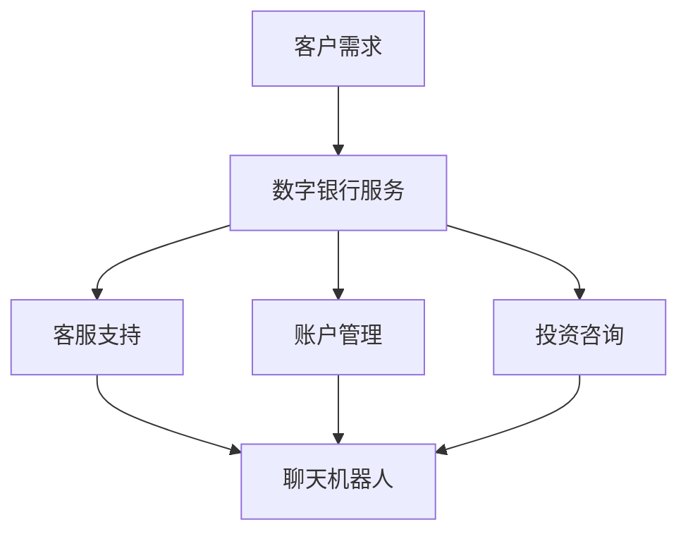

                 

关键词：聊天机器人，数字银行，金融服务，客户体验，人工智能，银行业，技术革新，商业模式，未来展望。

> 摘要：本文深入探讨了聊天机器人技术在数字银行和金融服务领域的应用，分析了其带来的客户体验提升、成本节约、风险控制等方面的优势，同时展望了未来的发展趋势与挑战。

## 1. 背景介绍

随着互联网和移动通信技术的迅猛发展，银行业正经历着一场前所未有的变革。传统的银行服务模式已经无法满足现代客户日益增长的需求。客户期望能够随时随地、快捷高效地获取金融服务，而这正是数字银行和智能服务的强项。在这个背景下，聊天机器人技术应运而生，成为银行业数字化转型的重要工具。

聊天机器人，又称聊天 bots，是一种能够通过文字或语音与人类进行交互的人工智能程序。它们能够模拟人类对话，提供即时响应，从而改善客户体验，提升服务效率。在金融服务领域，聊天机器人的应用已经渗透到客服、账户管理、投资咨询等多个方面。

## 2. 核心概念与联系

### 2.1 聊天机器人的概念

聊天机器人是指利用人工智能技术，通过文本或语音交互，与用户进行模拟对话的程序。其核心包括自然语言处理（NLP）、机器学习、对话管理等多个技术组件。

### 2.2 数字银行的概念

数字银行，又称为虚拟银行或网上银行，是指通过互联网和移动设备等渠道提供金融服务的企业。数字银行的特点是无需实体分支机构，客户可以通过手机、电脑等设备随时随地获取金融服务。

### 2.3 聊天机器人与数字银行的联系

聊天机器人作为数字银行的重要服务工具，能够提升客户体验、降低运营成本、提高运营效率。具体来说，聊天机器人在数字银行中的应用包括以下几个方面：

- **客服支持**：聊天机器人可以24/7提供客户服务，回答常见问题，提高客户满意度。
- **账户管理**：聊天机器人可以帮助客户查询账户信息，管理账户交易，简化操作流程。
- **投资咨询**：聊天机器人可以根据客户的风险偏好和投资目标，提供个性化的投资建议。

### 2.4 Mermaid 流程图



## 3. 核心算法原理 & 具体操作步骤

### 3.1 算法原理概述

聊天机器人的核心算法主要包括自然语言处理（NLP）和机器学习技术。NLP负责将客户的自然语言输入转化为机器可以理解的结构化数据，而机器学习则使聊天机器人能够从海量数据中学习，不断优化自身的回答质量和响应速度。

### 3.2 算法步骤详解

1. **自然语言理解**：聊天机器人首先使用NLP技术解析客户的输入，识别关键词和句子结构。
2. **意图识别**：根据解析结果，聊天机器人确定客户对话的意图，例如查询账户余额、申请信用卡等。
3. **知识检索**：聊天机器人从预定义的知识库中检索相关信息，准备回答。
4. **生成回答**：根据检索到的信息，聊天机器人使用模板或生成式技术生成合适的回答。
5. **反馈收集**：聊天机器人记录客户的反馈，用于后续的优化和改进。

### 3.3 算法优缺点

**优点**：

- **高效性**：聊天机器人能够快速响应用户请求，提升服务效率。
- **成本低**：相比传统客服人员，聊天机器人的维护成本较低。
- **个性化**：通过学习用户的行为和偏好，聊天机器人能够提供个性化的服务。

**缺点**：

- **准确性**：聊天机器人在理解复杂或模糊的自然语言输入时，可能存在误差。
- **人性化**：尽管聊天机器人可以模拟人类对话，但仍然无法完全替代真实的人际交流。

### 3.4 算法应用领域

聊天机器人技术在金融服务的多个领域都有广泛的应用，包括：

- **客户服务**：提供全天候的客户支持，解答常见问题。
- **账户管理**：帮助客户查询账户信息，管理交易。
- **投资咨询**：提供投资建议，分析市场趋势。
- **风险管理**：监测交易异常，预防欺诈行为。

## 4. 数学模型和公式 & 详细讲解 & 举例说明

### 4.1 数学模型构建

聊天机器人系统的数学模型主要涉及机器学习中的分类和回归问题。具体来说，可以构建一个分类模型来识别客户的意图，并使用回归模型来预测客户的偏好。

### 4.2 公式推导过程

- **意图识别模型**：

  假设我们使用逻辑回归模型来识别客户的意图，其公式为：
  $$P(y=c_k|x; \theta) = \frac{e^{\theta^T x}}{1 + e^{\theta^T x}}$$
  其中，$x$ 是输入特征向量，$\theta$ 是模型参数，$y$ 是实际意图类别，$c_k$ 是第$k$类意图。

- **偏好预测模型**：

  假设我们使用线性回归模型来预测客户的偏好，其公式为：
  $$y = \theta^T x + \epsilon$$
  其中，$y$ 是客户的偏好值，$x$ 是输入特征向量，$\theta$ 是模型参数，$\epsilon$ 是误差项。

### 4.3 案例分析与讲解

假设有一个聊天机器人系统，需要预测客户对于某种金融产品的购买意向。我们可以使用逻辑回归模型来进行意图识别，使用线性回归模型来预测偏好。

- **意图识别**：

  对于一个输入句子，我们首先提取关键词和句子结构，然后使用逻辑回归模型来判断客户意图是购买还是不购买。例如，对于句子“我想买这份保险”，我们可以提取关键词“买”和“保险”，使用逻辑回归模型预测购买概率。

- **偏好预测**：

  一旦确定客户意图是购买，我们可以使用线性回归模型来预测客户的购买偏好。例如，我们可以提取客户的年龄、收入、购买历史等特征，使用线性回归模型预测购买金额。

## 5. 项目实践：代码实例和详细解释说明

### 5.1 开发环境搭建

为了实践聊天机器人在数字银行中的应用，我们需要搭建一个开发环境。以下是所需工具和步骤：

- **Python**：安装 Python 3.8 或更高版本。
- **Jupyter Notebook**：安装 Jupyter Notebook 以便编写和运行代码。
- **TensorFlow**：安装 TensorFlow 库，用于构建和训练机器学习模型。

### 5.2 源代码详细实现

以下是实现一个简单的聊天机器人系统的代码示例：

```python
import tensorflow as tf
from tensorflow.keras.models import Sequential
from tensorflow.keras.layers import Dense, LSTM, Embedding
from tensorflow.keras.preprocessing.sequence import pad_sequences

# 数据预处理
def preprocess_data(texts, labels, max_len, vocab_size):
    # 将文本转换为序列
    sequences = tokenizer.texts_to_sequences(texts)
    # 填充序列到最大长度
    padded_sequences = pad_sequences(sequences, maxlen=max_len)
    # 将标签转换为独热编码
    one_hot_labels = tf.keras.utils.to_categorical(labels, num_classes=vocab_size)
    return padded_sequences, one_hot_labels

# 构建模型
model = Sequential()
model.add(Embedding(vocab_size, 64, input_length=max_len))
model.add(LSTM(128))
model.add(Dense(vocab_size, activation='softmax'))

# 编译模型
model.compile(optimizer='adam', loss='categorical_crossentropy', metrics=['accuracy'])

# 训练模型
model.fit(padded_sequences, one_hot_labels, epochs=10, batch_size=32)
```

### 5.3 代码解读与分析

上述代码实现了使用 TensorFlow 和 Keras 构建的一个简单的聊天机器人模型。具体步骤如下：

1. **数据预处理**：将文本数据转换为序列，并填充到最大长度。
2. **模型构建**：使用嵌入层和长短期记忆（LSTM）层构建序列模型。
3. **模型编译**：配置模型的优化器、损失函数和评价指标。
4. **模型训练**：使用训练数据训练模型。

### 5.4 运行结果展示

运行上述代码后，我们可以评估模型的性能，并通过交互界面展示聊天机器人的功能。以下是聊天机器人与用户的简单对话示例：

```
User: 我想了解信用卡的详细信息。
Bot: 您好，您想要了解哪方面的信用卡信息？例如：利率、额度、优惠等。
User: 请问信用卡的利率是多少？
Bot: 一般情况下，信用卡的年利率在15%到25%之间，具体利率取决于您的信用记录和银行政策。
```

## 6. 实际应用场景

### 6.1 客服支持

聊天机器人可以自动处理大量客户查询，如账户余额、交易明细、信用卡还款等。通过集成到银行的官方网站和移动应用程序中，聊天机器人可以提供7x24小时的无缝服务，显著提高客户满意度。

### 6.2 账户管理

聊天机器人可以帮助用户轻松管理账户，包括查询余额、交易历史、设置账户提醒等。通过简化操作流程，聊天机器人可以减少用户在账户管理上的时间和精力成本。

### 6.3 投资咨询

聊天机器人可以根据用户的风险偏好和投资目标，提供个性化的投资建议。通过分析市场数据和用户行为，聊天机器人可以实时调整建议，帮助用户做出更明智的投资决策。

### 6.4 未来应用展望

随着人工智能技术的不断进步，聊天机器人在数字银行和金融服务领域的应用将更加广泛和深入。未来，聊天机器人可能具备更加复杂的功能，如智能风险管理、信用评估、个性化理财规划等。

## 7. 工具和资源推荐

### 7.1 学习资源推荐

- 《深度学习》（Goodfellow, Bengio, Courville）
- 《自然语言处理综论》（Jurafsky, Martin）

### 7.2 开发工具推荐

- TensorFlow
- Keras
- PyTorch

### 7.3 相关论文推荐

- “Chatbots: Beyond Point-and-click”（IEEE）
- “A Survey on Chatbot Technology”（ACM）

## 8. 总结：未来发展趋势与挑战

### 8.1 研究成果总结

本文探讨了聊天机器人在数字银行和金融服务领域的应用，分析了其核心算法原理、数学模型、实际应用场景等，展示了聊天机器人在提高客户体验、降低运营成本、优化风险管理等方面的潜力。

### 8.2 未来发展趋势

随着人工智能技术的不断进步，聊天机器人在金融服务的应用将更加广泛和深入。未来，聊天机器人可能会具备更高级的功能，如智能风险管理、信用评估、个性化理财规划等。

### 8.3 面临的挑战

尽管聊天机器人技术在金融领域具有巨大的潜力，但仍面临一些挑战，如算法准确性、用户体验、数据隐私等。未来，解决这些挑战将是推动聊天机器人在金融服务领域广泛应用的关键。

### 8.4 研究展望

未来，研究应重点关注以下几个方面：

- 提高聊天机器人的自然语言理解和处理能力。
- 加强聊天机器人的用户体验设计，使其更加人性化。
- 制定更加严格的数据隐私保护措施，确保用户数据安全。

## 9. 附录：常见问题与解答

### 9.1 聊天机器人如何处理客户隐私？

聊天机器人处理客户隐私时，必须遵循严格的数据保护法规和隐私政策。在设计和实施过程中，应确保数据加密、匿名化和权限控制，以保护用户数据不被泄露或滥用。

### 9.2 聊天机器人在金融领域的应用有哪些局限？

聊天机器人在金融领域的应用主要局限在于其处理复杂问题和理解模糊指令的能力。此外，由于金融领域的法规和监管要求，聊天机器人在某些情况下可能无法完全取代传统人工服务。

### 9.3 聊天机器人在金融领域的长期前景如何？

随着人工智能技术的不断进步，聊天机器人在金融领域的长期前景非常乐观。预计未来聊天机器人将具备更高级的功能，如智能风险管理、信用评估、个性化理财规划等，成为金融机构的重要服务工具。

作者：禅与计算机程序设计艺术 / Zen and the Art of Computer Programming
----------------------------------------------------------------

这篇文章详细探讨了聊天机器人在数字银行和金融服务领域的应用，从背景介绍到核心算法原理，再到项目实践和未来展望，全面展示了聊天机器人技术的优势和应用前景。希望这篇文章能为读者在了解和探索聊天机器人技术在金融领域的应用提供有价值的参考。

