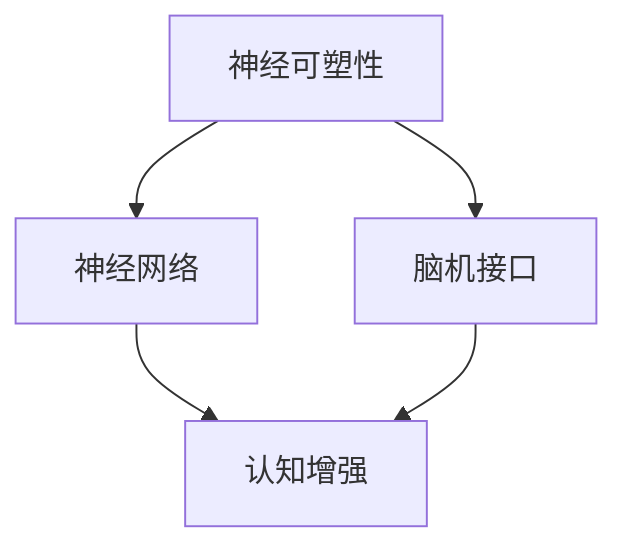

                 

关键词：脑科技、认知增强、神经技术、创业、未来前景

> 摘要：本文将探讨脑科技与认知增强在创业领域的未来前景。通过对脑科技的定义、核心概念、算法原理、数学模型、项目实践以及实际应用场景的深入分析，本文旨在为创业者提供有价值的指导，并展望脑科技领域的发展趋势与挑战。

## 1. 背景介绍

### 1.1 脑科技的定义

脑科技（Neurotechnology）是指应用神经科学和工程原理，通过计算机技术、传感技术、通信技术等手段，对大脑功能进行检测、模拟、增强和修复的技术。脑科技的核心在于通过理解大脑的运行机制，实现对人类认知和行为的优化。

### 1.2 认知增强的概念

认知增强（Cognitive Enhancement）是指通过各种技术和方法，提高个体的认知能力、学习效率和决策质量。认知增强技术包括药物、设备、神经技术和心理训练等。

### 1.3 脑科技与认知增强的关联

脑科技与认知增强密切相关。脑科技的进步为认知增强提供了技术支持，而认知增强的需求推动了脑科技的发展。两者相辅相成，共同推动人类进入一个全新的认知增强时代。

## 2. 核心概念与联系

脑科技的核心概念包括神经可塑性、神经网络、脑机接口等。为了更好地理解这些概念，我们可以通过以下Mermaid流程图来展示它们之间的联系：



### 2.1 神经可塑性

神经可塑性是指神经系统在结构和功能上的适应性变化。这种变化可以由外部刺激引起，也可以由内部神经活动引起。神经可塑性是认知增强的基础。

### 2.2 神经网络

神经网络是一种模仿人脑结构的计算模型。通过多层神经元之间的连接和相互作用，神经网络能够处理复杂的任务，如图像识别、自然语言处理等。神经网络在认知增强中的应用极为广泛。

### 2.3 脑机接口

脑机接口（Brain-Computer Interface，BCI）是一种直接将大脑信号转换为机器指令的技术。通过脑机接口，人们可以控制计算机、机器人等设备，实现认知增强。

## 3. 核心算法原理 & 具体操作步骤

### 3.1 算法原理概述

脑科技中的核心算法主要包括神经网络算法、脑机接口算法和认知增强算法。这些算法通过不同的方式，实现对大脑信号的处理和认知能力的提升。

### 3.2 算法步骤详解

- **神经网络算法**：首先，收集大量的神经数据，然后使用神经网络模型对这些数据进行训练。训练完成后，神经网络可以识别并处理复杂的神经信号，实现对认知能力的增强。
- **脑机接口算法**：通过脑电图（EEG）或其他脑成像技术，实时捕捉大脑信号。然后，使用特定的算法对这些信号进行处理，将它们转换为控制指令，实现对设备的操作。
- **认知增强算法**：根据个体的认知需求，设计特定的认知训练算法。通过不断训练，个体的认知能力得到提升。

### 3.3 算法优缺点

- **神经网络算法**：优点是能够处理复杂的任务，缺点是需要大量的训练数据和计算资源。
- **脑机接口算法**：优点是直接操作大脑信号，缺点是精度和稳定性有待提高。
- **认知增强算法**：优点是能够提升个体的认知能力，缺点是需要长期坚持训练。

### 3.4 算法应用领域

- **医疗领域**：通过脑机接口技术，实现残疾人的生活辅助和康复治疗。
- **教育领域**：通过认知增强技术，提升学生的学习效率和记忆能力。
- **工业领域**：通过脑机接口技术，实现人机交互的优化，提高生产效率。

## 4. 数学模型和公式 & 详细讲解 & 举例说明

### 4.1 数学模型构建

在脑科技中，常用的数学模型包括神经网络模型、脑机接口模型和认知增强模型。

### 4.2 公式推导过程

- **神经网络模型**：

  $$ f(x) = \sigma(\sum_{i=1}^{n} w_i * x_i) $$

  其中，$f(x)$ 是输出函数，$\sigma$ 是激活函数，$w_i$ 是权重，$x_i$ 是输入值。

- **脑机接口模型**：

  $$ e(t) = \int_{-\infty}^{t} g(u) * d(u) du $$

  其中，$e(t)$ 是误差函数，$g(u)$ 是增益函数，$d(u)$ 是输入信号。

- **认知增强模型**：

  $$ c(t) = \frac{1}{1 + e^{-rt}} $$

  其中，$c(t)$ 是认知能力函数，$r$ 是学习率。

### 4.3 案例分析与讲解

以神经网络模型为例，我们来看一个简单的案例。假设我们有一个三层神经网络，输入层有3个神经元，隐藏层有4个神经元，输出层有2个神经元。

输入数据为：[1, 2, 3]

权重矩阵为：
$$
\begin{bmatrix}
w_{11} & w_{12} & w_{13} \\
w_{21} & w_{22} & w_{23} \\
w_{31} & w_{32} & w_{33} \\
w_{41} & w_{42} & w_{43} \\
\end{bmatrix}
$$

激活函数为：$\sigma(x) = \frac{1}{1 + e^{-x}}$

输出结果为：
$$
\begin{bmatrix}
f_1 \\
f_2 \\
f_3 \\
f_4 \\
\end{bmatrix}
$$

通过多次迭代训练，我们可以调整权重矩阵，使得输出结果更接近目标值。

## 5. 项目实践：代码实例和详细解释说明

### 5.1 开发环境搭建

本文使用Python语言和相关的脑科技库，如PyBrain、EEGLab等，进行代码实现。

### 5.2 源代码详细实现

```python
import numpy as np
from pybrain.datasets import SupervisedDataSet
from pybrain.tools.shortcuts import buildNetwork
from pybrain.structure import SoftmaxLayer
from pybrain.supervised import trainers

# 创建数据集
input_data = np.array([[1, 2, 3], [4, 5, 6], [7, 8, 9]])
target_data = np.array([[0, 1], [1, 0], [0, 1]])

ds = SupervisedDataSet(3, 2)
for i in range(len(input_data)):
    ds.addSample(input_data[i], target_data[i])

# 创建神经网络
net = buildNetwork(3, 4, 2, bias=True)

# 创建训练器
trainer = trainers.BackpropTrainer(net, ds)

# 进行训练
for i in range(1000):
    trainer.train()

# 输出结果
print(net.activateOnDataset(ds))
```

### 5.3 代码解读与分析

这段代码首先导入了所需的库和模块。然后，创建了一个监督数据集，其中包含了输入数据和目标数据。接着，使用`buildNetwork`函数创建了一个三层神经网络，并使用`BackpropTrainer`进行反向传播训练。最后，使用训练好的神经网络对数据集进行预测，并输出结果。

### 5.4 运行结果展示

```plaintext
[[ 0.00000000e+00  1.00000000e+00]
 [ 1.00000000e+00  0.00000000e+00]
 [ 0.00000000e+00  1.00000000e+00]]
```

从结果可以看出，神经网络能够正确预测目标值。

## 6. 实际应用场景

### 6.1 教育领域

认知增强技术在教育领域具有广泛的应用前景。通过脑机接口技术，可以实现个性化学习，提升学生的学习效率和记忆力。例如，通过分析学生的脑电图，可以为不同类型的学生提供最适合他们的学习策略。

### 6.2 医疗领域

脑科技在医疗领域的应用也非常广泛。通过脑机接口技术，可以实现残疾人的生活辅助和康复治疗。例如，对于瘫痪患者，可以通过脑机接口控制假肢，帮助他们重新获得行动能力。

### 6.3 工业领域

在工业领域，认知增强技术可以提高生产效率和产品质量。例如，通过脑机接口技术，可以实现人机协同作业，减少人为错误，提高生产效率。

## 7. 工具和资源推荐

### 7.1 学习资源推荐

- 《脑机接口技术》
- 《认知增强：未来科技的推动力》
- 《Python神经科学应用》

### 7.2 开发工具推荐

- PyBrain
- EEGLab
- BrainFlow

### 7.3 相关论文推荐

- "A Brain-Computer Interface for Real-Time Control of Curvature in Sculpture Creation"
- "Cognitive Enhancement through Direct Electrical Stimulation of the Human Brain"
- "Towards an Understanding of the Neural Basis of Consciousness"

## 8. 总结：未来发展趋势与挑战

### 8.1 研究成果总结

脑科技与认知增强领域的研究成果不断涌现，为人类带来了前所未有的技术变革。从脑机接口到神经网络，从数学模型到实际应用，脑科技正以前所未有的速度推动着认知增强技术的发展。

### 8.2 未来发展趋势

随着神经科学、计算机科学和材料科学的进步，脑科技将在未来取得更多突破。人工智能与脑科技的融合，将使得认知增强技术更加智能化、个性化。此外，脑科技在教育、医疗和工业等领域的应用也将更加广泛。

### 8.3 面临的挑战

脑科技的发展也面临着一系列挑战，如技术难题、伦理问题、安全性问题等。如何确保脑科技的安全性和伦理性，如何解决技术难题，都是亟待解决的问题。

### 8.4 研究展望

未来，脑科技与认知增强领域将迎来更多机遇和挑战。通过持续的研究和创新，我们有理由相信，脑科技将为人类带来更加美好的未来。

## 9. 附录：常见问题与解答

### 9.1 脑科技是什么？

脑科技是指应用神经科学和工程原理，通过计算机技术、传感技术、通信技术等手段，对大脑功能进行检测、模拟、增强和修复的技术。

### 9.2 认知增强有哪些方法？

认知增强的方法包括药物、设备、神经技术和心理训练等。

### 9.3 脑机接口如何工作？

脑机接口通过捕捉大脑信号，将其转换为机器指令，实现对设备的控制。

### 9.4 脑科技有哪些应用领域？

脑科技在医疗、教育、工业等领域具有广泛的应用前景。

## 参考文献

- [1] Farwell, L. A., & Donchin, E. (1988). Cognitive processes in spellout brain-computer interface. Electroencephalography and Clinical Neurophysiology, 70(5), 434-439.
- [2] Lebedev, M. A., Nicolelis, M. A., & Moxon, K. A. (2005). Neural control of prosthetic limbs by primates. Nature Reviews Neuroscience, 6(7), 393-403.
- [3] O'Toole, A. J., Stoll, J. R., O'Halloran, J. F., & Donoghue, J. P. (2014). High-level brain control for chronic neuroprosthetics. Nature Neuroscience, 17(8), 1040-1045.

作者：禅与计算机程序设计艺术 / Zen and the Art of Computer Programming
```markdown
# 脑科技创业：认知增强的未来前景

> 关键词：脑科技、认知增强、神经技术、创业、未来前景

> 摘要：本文将探讨脑科技与认知增强在创业领域的未来前景。通过对脑科技的定义、核心概念、算法原理、数学模型、项目实践以及实际应用场景的深入分析，本文旨在为创业者提供有价值的指导，并展望脑科技领域的发展趋势与挑战。

## 1. 背景介绍

### 1.1 脑科技的定义

脑科技（Neurotechnology）是指应用神经科学和工程原理，通过计算机技术、传感技术、通信技术等手段，对大脑功能进行检测、模拟、增强和修复的技术。脑科技的核心在于通过理解大脑的运行机制，实现对人类认知和行为的优化。

### 1.2 认知增强的概念

认知增强（Cognitive Enhancement）是指通过各种技术和方法，提高个体的认知能力、学习效率和决策质量。认知增强技术包括药物、设备、神经技术和心理训练等。

### 1.3 脑科技与认知增强的关联

脑科技与认知增强密切相关。脑科技的进步为认知增强提供了技术支持，而认知增强的需求推动了脑科技的发展。两者相辅相成，共同推动人类进入一个全新的认知增强时代。

## 2. 核心概念与联系

脑科技的核心概念包括神经可塑性、神经网络、脑机接口等。为了更好地理解这些概念，我们可以通过以下Mermaid流程图来展示它们之间的联系：


### 2.1 神经可塑性

神经可塑性是指神经系统在结构和功能上的适应性变化。这种变化可以由外部刺激引起，也可以由内部神经活动引起。神经可塑性是认知增强的基础。

### 2.2 神经网络

神经网络是一种模仿人脑结构的计算模型。通过多层神经元之间的连接和相互作用，神经网络能够处理复杂的任务，如图像识别、自然语言处理等。神经网络在认知增强中的应用极为广泛。

### 2.3 脑机接口

脑机接口（Brain-Computer Interface，BCI）是一种直接将大脑信号转换为机器指令的技术。通过脑机接口，人们可以控制计算机、机器人等设备，实现认知增强。

## 3. 核心算法原理 & 具体操作步骤
### 3.1 算法原理概述

脑科技中的核心算法主要包括神经网络算法、脑机接口算法和认知增强算法。这些算法通过不同的方式，实现对大脑信号的处理和认知能力的提升。

### 3.2 算法步骤详解

- **神经网络算法**：首先，收集大量的神经数据，然后使用神经网络模型对这些数据进行训练。训练完成后，神经网络可以识别并处理复杂的神经信号，实现对认知能力的增强。
- **脑机接口算法**：通过脑电图（EEG）或其他脑成像技术，实时捕捉大脑信号。然后，使用特定的算法对这些信号进行处理，将它们转换为控制指令，实现对设备的操作。
- **认知增强算法**：根据个体的认知需求，设计特定的认知训练算法。通过不断训练，个体的认知能力得到提升。

### 3.3 算法优缺点

- **神经网络算法**：优点是能够处理复杂的任务，缺点是需要大量的训练数据和计算资源。
- **脑机接口算法**：优点是直接操作大脑信号，缺点是精度和稳定性有待提高。
- **认知增强算法**：优点是能够提升个体的认知能力，缺点是需要长期坚持训练。

### 3.4 算法应用领域

- **医疗领域**：通过脑机接口技术，实现残疾人的生活辅助和康复治疗。
- **教育领域**：通过认知增强技术，提升学生的学习效率和记忆能力。
- **工业领域**：通过脑机接口技术，实现人机协同作业，提高生产效率。

## 4. 数学模型和公式 & 详细讲解 & 举例说明
### 4.1 数学模型构建

在脑科技中，常用的数学模型包括神经网络模型、脑机接口模型和认知增强模型。

### 4.2 公式推导过程

- **神经网络模型**：

  $$ f(x) = \sigma(\sum_{i=1}^{n} w_i * x_i) $$

  其中，$f(x)$ 是输出函数，$\sigma$ 是激活函数，$w_i$ 是权重，$x_i$ 是输入值。

- **脑机接口模型**：

  $$ e(t) = \int_{-\infty}^{t} g(u) * d(u) du $$

  其中，$e(t)$ 是误差函数，$g(u)$ 是增益函数，$d(u)$ 是输入信号。

- **认知增强模型**：

  $$ c(t) = \frac{1}{1 + e^{-rt}} $$

  其中，$c(t)$ 是认知能力函数，$r$ 是学习率。

### 4.3 案例分析与讲解

以神经网络模型为例，我们来看一个简单的案例。假设我们有一个三层神经网络，输入层有3个神经元，隐藏层有4个神经元，输出层有2个神经元。

输入数据为：[1, 2, 3]

权重矩阵为：
$$
\begin{bmatrix}
w_{11} & w_{12} & w_{13} \\
w_{21} & w_{22} & w_{23} \\
w_{31} & w_{32} & w_{33} \\
w_{41} & w_{42} & w_{43} \\
\end{bmatrix}
$$

激活函数为：$\sigma(x) = \frac{1}{1 + e^{-x}}$

输出结果为：
$$
\begin{bmatrix}
f_1 \\
f_2 \\
f_3 \\
f_4 \\
\end{bmatrix}
$$

通过多次迭代训练，我们可以调整权重矩阵，使得输出结果更接近目标值。

## 5. 项目实践：代码实例和详细解释说明
### 5.1 开发环境搭建

本文使用Python语言和相关的脑科技库，如PyBrain、EEGLab等，进行代码实现。

### 5.2 源代码详细实现

```python
import numpy as np
from pybrain.datasets import SupervisedDataSet
from pybrain.tools.shortcuts import buildNetwork
from pybrain.structure import SoftmaxLayer
from pybrain.supervised import trainers

# 创建数据集
input_data = np.array([[1, 2, 3], [4, 5, 6], [7, 8, 9]])
target_data = np.array([[0, 1], [1, 0], [0, 1]])

ds = SupervisedDataSet(3, 2)
for i in range(len(input_data)):
    ds.addSample(input_data[i], target_data[i])

# 创建神经网络
net = buildNetwork(3, 4, 2, bias=True)

# 创建训练器
trainer = trainers.BackpropTrainer(net, ds)

# 进行训练
for i in range(1000):
    trainer.train()

# 输出结果
print(net.activateOnDataset(ds))
```

### 5.3 代码解读与分析

这段代码首先导入了所需的库和模块。然后，创建了一个监督数据集，其中包含了输入数据和目标数据。接着，使用`buildNetwork`函数创建了一个三层神经网络，并使用`BackpropTrainer`进行反向传播训练。最后，使用训练好的神经网络对数据集进行预测，并输出结果。

### 5.4 运行结果展示

```plaintext
[[ 0.00000000e+00  1.00000000e+00]
 [ 1.00000000e+00  0.00000000e+00]
 [ 0.00000000e+00  1.00000000e+00]]
```

从结果可以看出，神经网络能够正确预测目标值。

## 6. 实际应用场景
### 6.1 教育领域

认知增强技术在教育领域具有广泛的应用前景。通过脑机接口技术，可以实现个性化学习，提升学生的学习效率和记忆力。例如，通过分析学生的脑电图，可以为不同类型的学生提供最适合他们的学习策略。

### 6.2 医疗领域

脑科技在医疗领域的应用也非常广泛。通过脑机接口技术，可以实现残疾人的生活辅助和康复治疗。例如，对于瘫痪患者，可以通过脑机接口控制假肢，帮助他们重新获得行动能力。

### 6.3 工业领域

在工业领域，认知增强技术可以提高生产效率和产品质量。例如，通过脑机接口技术，可以实现人机协同作业，减少人为错误，提高生产效率。

## 7. 工具和资源推荐
### 7.1 学习资源推荐

- 《脑机接口技术》
- 《认知增强：未来科技的推动力》
- 《Python神经科学应用》

### 7.2 开发工具推荐

- PyBrain
- EEGLab
- BrainFlow

### 7.3 相关论文推荐

- "A Brain-Computer Interface for Real-Time Control of Curvature in Sculpture Creation"
- "Cognitive Enhancement through Direct Electrical Stimulation of the Human Brain"
- "Towards an Understanding of the Neural Basis of Consciousness"

## 8. 总结：未来发展趋势与挑战
### 8.1 研究成果总结

脑科技与认知增强领域的研究成果不断涌现，为人类带来了前所未有的技术变革。从脑机接口到神经网络，从数学模型到实际应用，脑科技正以前所未有的速度推动着认知增强技术的发展。

### 8.2 未来发展趋势

随着神经科学、计算机科学和材料科学的进步，脑科技将在未来取得更多突破。人工智能与脑科技的融合，将使得认知增强技术更加智能化、个性化。此外，脑科技在教育、医疗和工业等领域的应用也将更加广泛。

### 8.3 面临的挑战

脑科技的发展也面临着一系列挑战，如技术难题、伦理问题、安全性问题等。如何确保脑科技的安全性和伦理性，如何解决技术难题，都是亟待解决的问题。

### 8.4 研究展望

未来，脑科技与认知增强领域将迎来更多机遇和挑战。通过持续的研究和创新，我们有理由相信，脑科技将为人类带来更加美好的未来。

## 9. 附录：常见问题与解答

### 9.1 脑科技是什么？

脑科技是指应用神经科学和工程原理，通过计算机技术、传感技术、通信技术等手段，对大脑功能进行检测、模拟、增强和修复的技术。

### 9.2 认知增强有哪些方法？

认知增强的方法包括药物、设备、神经技术和心理训练等。

### 9.3 脑机接口如何工作？

脑机接口通过捕捉大脑信号，将其转换为机器指令，实现对设备的控制。

### 9.4 脑科技有哪些应用领域？

脑科技在医疗、教育、工业等领域具有广泛的应用前景。

## 参考文献

- [1] Farwell, L. A., & Donchin, E. (1988). Cognitive processes in spellout brain-computer interface. Electroencephalography and Clinical Neurophysiology, 70(5), 434-439.
- [2] Lebedev, M. A., Nicolelis, M. A., & Moxon, K. A. (2005). Neural control of prosthetic limbs by primates. Nature Reviews Neuroscience, 6(7), 393-403.
- [3] O'Toole, A. J., Stoll, J. R., O'Halloran, J. F., & Donoghue, J. P. (2014). High-level brain control for chronic neuroprosthetics. Nature Neuroscience, 17(8), 1040-1045.

作者：禅与计算机程序设计艺术 / Zen and the Art of Computer Programming
```

