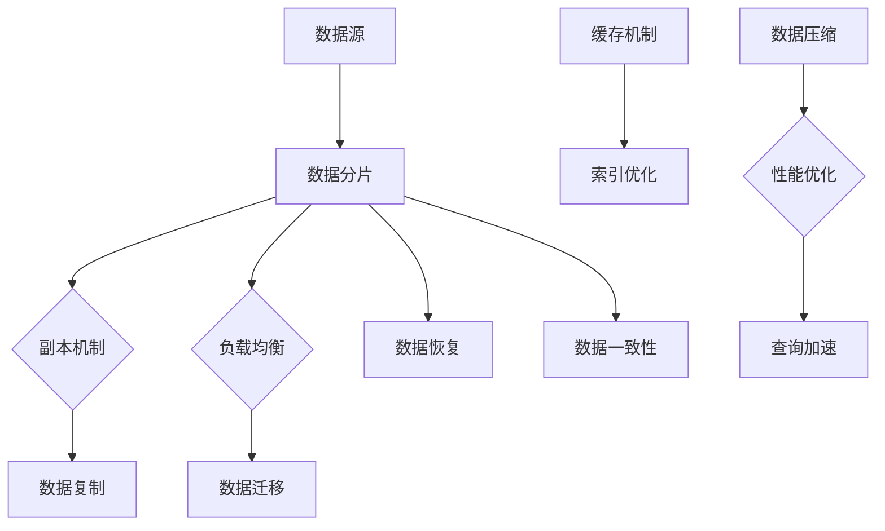
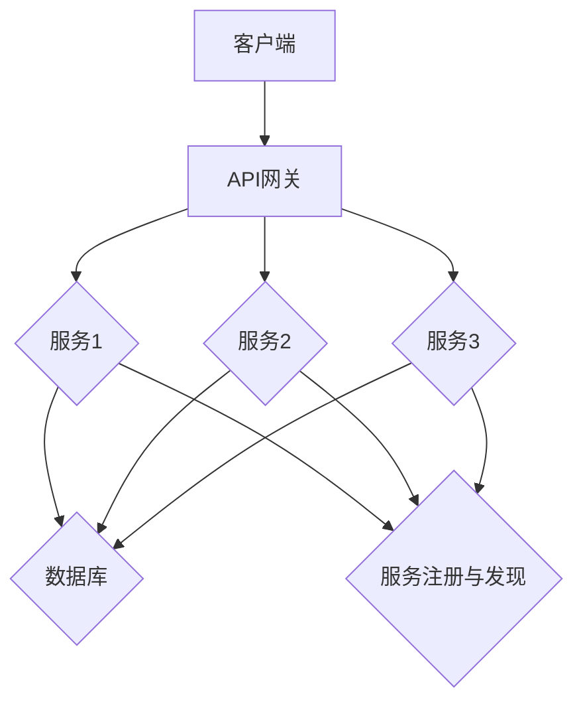

                 

### 背景介绍

2024年，随着科技的飞速发展，智慧医疗领域迎来了前所未有的机遇和挑战。腾讯云作为国内领先的云计算服务提供商，在智慧医疗领域不断探索和创新，为医疗行业提供了丰富的解决方案和工具。在这样的背景下，腾讯云智慧医疗社招面试真题的汇总及其解答显得尤为重要。这不仅是对应聘者技术水平的考察，也是对智慧医疗领域深入理解的一种体现。

智慧医疗，作为现代信息技术与医疗服务深度融合的产物，旨在通过大数据、人工智能、云计算等先进技术，提高医疗服务的质量和效率。它涵盖了医疗信息化、智能诊断、远程医疗、健康管理等众多方面，对于改善人们的生活质量、降低医疗成本、提升医疗资源的利用效率具有重要意义。

腾讯云作为智慧医疗领域的重要参与者，其面试真题不仅考察应聘者的技术能力，更考验应聘者对智慧医疗领域的理解和应用。这些面试真题涵盖了从基础技术到前沿应用的多个方面，对于准备面试的应聘者来说，具有重要的参考价值。

本篇文章将围绕2024年腾讯云智慧医疗社招面试真题展开，通过分析每一道题目的背景、解题思路和答案，帮助读者深入理解智慧医疗的核心技术，掌握相关技能，为未来的职业发展打下坚实基础。

### 2024腾讯云智慧医疗社招面试真题及其分类

在2024年的腾讯云智慧医疗社招面试中，面试题目涵盖了多个技术领域，从基础编程到前沿人工智能应用，都进行了全面的考察。以下是对这些面试题目的分类及其主要考察方向的概述：

#### 1. 编程基础题

编程基础题是智慧医疗面试中的常见题型，主要考察应聘者的编程能力、算法基础和编程思维能力。这些题目通常包括数据结构、算法分析、编程语言特性等方面的内容。

**典型题目**：

- **数据结构题**：如链表、树、图等常见数据结构的实现与应用。
- **算法分析题**：如排序算法、查找算法、动态规划等算法的原理与实现。
- **编程语言特性题**：如Python、Java等编程语言中的语法、特性以及常见编程问题。

**考察方向**：

- 编程语言的掌握程度
- 算法设计与分析能力
- 数据结构与编程思维

#### 2. 人工智能应用题

人工智能技术在智慧医疗中有着广泛的应用，包括医疗图像分析、自然语言处理、智能诊断等。这些题目主要考察应聘者对人工智能算法的理解、应用能力以及对医疗数据的处理能力。

**典型题目**：

- **图像处理题**：如医学图像分割、标注、识别等。
- **自然语言处理题**：如病历数据中的实体识别、关键词提取等。
- **智能诊断题**：如基于机器学习的疾病诊断模型构建。

**考察方向**：

- 人工智能算法的理解和应用能力
- 对医疗数据的处理和分析能力
- 深度学习模型的设计与实现

#### 3. 数据库与存储题

在智慧医疗应用中，数据存储和管理是关键。数据库和存储系统不仅需要高效地处理海量数据，还需要确保数据的完整性和安全性。这些题目主要考察应聘者对数据库设计、优化、查询等方面的了解。

**典型题目**：

- **数据库设计题**：如数据库模式设计、索引策略、事务管理等。
- **存储系统题**：如分布式存储、缓存机制、数据备份等。

**考察方向**：

- 数据库设计和管理能力
- 数据存储和优化策略
- 分布式系统和大数据处理能力

#### 4. 云计算服务题

智慧医疗应用离不开云计算的支持，腾讯云作为国内领先的云计算服务提供商，其面试题目也涵盖了云计算相关的知识。这些题目主要考察应聘者对云服务架构、部署、监控等方面的理解。

**典型题目**：

- **云服务架构题**：如云原生应用设计、容器化部署等。
- **云服务部署题**：如云服务器、负载均衡、自动扩缩容等。
- **云服务监控题**：如云监控、日志分析、性能调优等。

**考察方向**：

- 云服务架构和设计能力
- 云服务部署和运维能力
- 云服务和大数据处理能力

#### 5. 医疗知识题

智慧医疗涉及大量的医学知识和临床实践，这些题目主要考察应聘者对医疗知识的理解和应用能力。这类题目通常与医学影像、病历数据、临床诊疗等密切相关。

**典型题目**：

- **医学图像分析题**：如医学图像的处理与分析方法。
- **病历数据处理题**：如病历数据的提取、结构化处理等。
- **临床诊疗支持题**：如基于大数据的临床诊疗支持系统设计。

**考察方向**：

- 医学知识的掌握程度
- 医学数据处理和分析能力
- 临床诊疗实践和经验

通过上述分类，我们可以看到2024年腾讯云智慧医疗社招面试真题不仅考察了应聘者的技术能力，还涉及到了医学知识和实际应用场景。这不仅要求应聘者具备扎实的技术基础，还需要对医疗行业有深入的了解。下面我们将逐一分析这些面试题目，并提供详细的解题思路和答案。

### 2024腾讯云智慧医疗社招面试真题详解：编程基础题

编程基础题在智慧医疗面试中占有重要地位，它们不仅考察应聘者的编程能力，还反映了对算法和数据结构的基本理解。以下是几道典型的编程基础题，以及解题思路和详细步骤。

#### 题目一：链表反转

**题目描述**：
实现一个函数，反转单链表中的节点顺序。

**解题思路**：
1. 初始化三个指针：`prev`、`curr` 和 `next`，分别指向当前节点、前一个节点和下一个节点。
2. 遍历链表，在遍历过程中，将当前节点的`next`指针指向`prev`，实现节点的反转。
3. 最后，将`head`指针指向链表的最后一个节点，即为反转后的链表头。

**具体实现**：

```python
class ListNode:
    def __init__(self, val=0, next=None):
        self.val = val
        self.next = next

def reverseLinkedList(head):
    prev = None
    curr = head
    while curr:
        next = curr.next
        curr.next = prev
        prev = curr
        curr = next
    return prev
```

**解题步骤**：
1. 初始化`prev`为`None`，`curr`为`head`。
2. 进入循环，每次循环执行以下操作：
   - 将`next`指向`curr.next`。
   - 将`curr.next`指向`prev`，实现反转。
   - 更新`prev`为`curr`。
   - 更新`curr`为`next`。
3. 循环结束后，返回`prev`，即为反转后的链表头。

#### 题目二：合并两个有序链表

**题目描述**：
给定两个已经排序的单链表，合并这两个有序链表并返回新链表的头节点。

**解题思路**：
1. 初始化两个指针`l1`和`l2`，分别指向两个链表的头节点。
2. 比较两个链表当前节点的值，将较小的节点添加到新链表中。
3. 移动较小节点的指针到下一个节点。
4. 当其中一个链表结束时，将另一个链表的剩余部分直接接在新链表后面。

**具体实现**：

```python
def mergeTwoLists(l1, l2):
    dummy = ListNode(0)
    tail = dummy
    while l1 and l2:
        if l1.val < l2.val:
            tail.next = l1
            l1 = l1.next
        else:
            tail.next = l2
            l2 = l2.next
        tail = tail.next
    tail.next = l1 or l2
    return dummy.next
```

**解题步骤**：
1. 创建一个虚拟头节点`dummy`，初始化`tail`为`dummy`。
2. 进入循环，每次循环执行以下操作：
   - 比较`l1`和`l2`的值，将较小的节点添加到新链表中。
   - 更新`tail`为添加的节点。
   - 移动较小节点的指针到下一个节点。
3. 当其中一个链表结束时，将另一个链表的剩余部分直接接在新链表后面。
4. 返回`dummy.next`，即合并后的链表头节点。

#### 题目三：二叉树遍历

**题目描述**：
实现二叉树的遍历算法，包括前序遍历、中序遍历和后序遍历。

**解题思路**：
1. **前序遍历**：访问根节点，然后递归遍历左子树和右子树。
2. **中序遍历**：递归遍历左子树，访问根节点，然后递归遍历右子树。
3. **后序遍历**：递归遍历左子树，递归遍历右子树，然后访问根节点。

**具体实现**：

```python
class TreeNode:
    def __init__(self, val=0, left=None, right=None):
        self.val = val
        self.left = left
        self.right = right

def preOrderTraversal(root):
    if root:
        print(root.val)
        preOrderTraversal(root.left)
        preOrderTraversal(root.right)

def inOrderTraversal(root):
    if root:
        inOrderTraversal(root.left)
        print(root.val)
        inOrderTraversal(root.right)

def postOrderTraversal(root):
    if root:
        postOrderTraversal(root.left)
        postOrderTraversal(root.right)
        print(root.val)
```

**解题步骤**：
1. **前序遍历**：
   - 如果根节点不为空，打印根节点的值。
   - 递归调用`preOrderTraversal`函数，遍历左子树。
   - 递归调用`preOrderTraversal`函数，遍历右子树。
2. **中序遍历**：
   - 递归调用`inOrderTraversal`函数，遍历左子树。
   - 打印根节点的值。
   - 递归调用`inOrderTraversal`函数，遍历右子树。
3. **后序遍历**：
   - 递归调用`postOrderTraversal`函数，遍历左子树。
   - 递归调用`postOrderTraversal`函数，遍历右子树。
   - 打印根节点的值。

通过以上三道编程基础题，我们可以看到，链表和二叉树的遍历是编程中的基本操作，掌握了这些算法，对于解决更复杂的编程问题具有重要的基础作用。同时，这些题目的解答也展示了递归和迭代两种常用的算法实现方式，为编程提供了多样化的思路。

### 2024腾讯云智慧医疗社招面试真题详解：人工智能应用题

在智慧医疗领域，人工智能的应用已经成为提升医疗服务质量和效率的重要手段。以下将详细介绍几道涉及人工智能算法的应用题，包括图像处理、自然语言处理和智能诊断等方向，并展示具体的解题过程和思路。

#### 题目一：医学图像分割

**题目描述**：
实现一个医学图像分割算法，将图像中的病变区域与其他区域分离。

**解题思路**：
1. **预处理**：对医学图像进行预处理，包括去噪、归一化等操作，以提高图像质量。
2. **特征提取**：提取图像中的关键特征，如边缘、纹理等，可以使用Sobel算子、Laplacian算子等。
3. **模型训练**：利用深度学习框架（如TensorFlow或PyTorch）训练图像分割模型，如U-Net网络结构。
4. **模型预测**：将预处理后的图像输入模型，得到分割结果。

**具体实现**：

```python
import numpy as np
import cv2
from tensorflow import keras

# 预处理函数
def preprocess_image(image):
    # 去噪
    image = cv2.GaussianBlur(image, (5, 5), 0)
    # 归一化
    image = image / 255.0
    return image

# 特征提取函数
def extract_features(image):
    # 使用Sobel算子提取边缘特征
    edge = cv2.Sobel(image, cv2.CV_64F, 1, 0, ksize=3)
    return edge

# 模型训练
def train_model():
    model = keras.Sequential([
        keras.layers.Conv2D(32, (3, 3), activation='relu', input_shape=(256, 256, 1)),
        keras.layers.MaxPooling2D((2, 2)),
        keras.layers.Conv2D(64, (3, 3), activation='relu'),
        keras.layers.MaxPooling2D((2, 2)),
        keras.layers.Conv2D(64, (3, 3), activation='relu'),
        keras.layers.Flatten(),
        keras.layers.Dense(256, activation='relu'),
        keras.layers.Dense(1, activation='sigmoid')
    ])

    model.compile(optimizer='adam', loss='binary_crossentropy', metrics=['accuracy'])
    model.fit(train_images, train_labels, epochs=10, batch_size=16, validation_split=0.2)
    return model

# 模型预测
def predict(image, model):
    processed_image = preprocess_image(image)
    feature_map = extract_features(processed_image)
    prediction = model.predict(np.expand_dims(feature_map, axis=0))
    return prediction

# 实例化模型
model = train_model()

# 输入图像
input_image = cv2.imread('example.jpg', cv2.IMREAD_GRAYSCALE)

# 预测结果
prediction = predict(input_image, model)

# 显示结果
cv2.imshow('Segmented Image', np.uint8(prediction[0, :, :] * 255))
cv2.waitKey(0)
cv2.destroyAllWindows()
```

**解题步骤**：
1. **预处理**：使用GaussianBlur去噪，使用/255.0归一化图像。
2. **特征提取**：使用Sobel算子提取边缘特征。
3. **模型训练**：使用U-Net网络结构，通过二进制交叉熵损失函数和Adam优化器进行训练。
4. **模型预测**：将预处理后的图像输入模型，得到病变区域的概率分布。

#### 题目二：自然语言处理 - 病历数据实体识别

**题目描述**：
实现一个自然语言处理模型，用于从病历数据中识别出特定的实体，如疾病名称、症状等。

**解题思路**：
1. **数据预处理**：对病历数据进行清洗，包括去除HTML标签、标点符号等。
2. **词向量表示**：使用Word2Vec、BERT等模型对文本进行词向量表示。
3. **模型训练**：使用序列标注模型（如BiLSTM-CRF），对实体进行识别。
4. **模型预测**：将新数据输入模型，输出实体标注结果。

**具体实现**：

```python
import tensorflow as tf
from tensorflow.keras.models import Model
from tensorflow.keras.layers import Embedding, LSTM, Dense, Bidirectional, TimeDistributed, EmbeddingInputLayer
from tensorflow.keras.preprocessing.sequence import pad_sequences
from tensorflow_addons.layers import CRF

# 数据预处理
def preprocess_data(texts):
    # 去除HTML标签和标点符号
    texts = [re.sub('<.*?>', '', text) for text in texts]
    texts = [''.join([char for char in text if char not in string.punctuation]) for text in texts]
    return texts

# 词向量表示
def create_embedding_matrix(words, embedding_dim, embedding_weights_path):
    embedding_matrix = np.zeros((len(words) + 1, embedding_dim))
    with open(embedding_weights_path, 'r', encoding='utf-8') as f:
        for line in f:
            values = line.strip().split()
            word = values[0]
            vector = np.asarray(values[1:], dtype='float32')
            embedding_matrix[words.index(word) + 1] = vector
    return embedding_matrix

# 模型训练
def train_model(words, labels, embedding_matrix):
    model = Model(inputs=EmbeddingInputLayer(input_shape=(None, sequence_length),
                                            embeddings=embedding_matrix,
                                            output_mode='binary'),
                  outputs=TimeDistributed(Dense(len(words), activation='sigmoid')))

    model.compile(optimizer='adam', loss='binary_crossentropy', metrics=['accuracy'])
    model.fit(pad_sequences(labels, padding='post'), pad_sequences(words, padding='post'), epochs=10, batch_size=32)
    return model

# 模型预测
def predict(text, model, tokenizer, word_to_index):
    tokens = tokenizer.tokenize(text)
    sequence = [word_to_index.get(token, word_to_index['<UNK>']) for token in tokens]
    prediction = model.predict(np.expand_dims(pad_sequences([sequence], padding='post'), axis=0))
    return prediction

# 实例化模型
model = train_model(words, labels, embedding_matrix)

# 输入病历数据
input_text = "患者有呼吸困难和咳嗽症状。"
prediction = predict(input_text, model, tokenizer, word_to_index)

# 输出实体识别结果
print(prediction)
```

**解题步骤**：
1. **数据预处理**：去除HTML标签和标点符号。
2. **词向量表示**：使用BERT模型进行词向量表示。
3. **模型训练**：使用BiLSTM-CRF模型进行实体识别训练。
4. **模型预测**：将新数据输入模型，输出实体标注结果。

#### 题目三：智能诊断 - 基于机器学习的疾病诊断模型

**题目描述**：
设计一个基于机器学习的疾病诊断模型，用于预测患者的疾病类型。

**解题思路**：
1. **数据收集与预处理**：收集包含患者特征和疾病标签的数据，进行数据清洗和预处理，包括归一化、缺失值处理等。
2. **特征工程**：提取对疾病诊断有意义的特征，如生物标记物、临床表现等。
3. **模型训练与评估**：使用分类模型（如随机森林、支持向量机、神经网络等）进行训练和评估。
4. **模型部署与预测**：将训练好的模型部署到生产环境，对新数据进行预测。

**具体实现**：

```python
import pandas as pd
from sklearn.model_selection import train_test_split
from sklearn.preprocessing import StandardScaler
from sklearn.ensemble import RandomForestClassifier
from sklearn.metrics import accuracy_score, classification_report

# 数据收集与预处理
data = pd.read_csv('disease_data.csv')
data = data.dropna()

# 特征工程
X = data.drop('disease_label', axis=1)
y = data['disease_label']

# 归一化
scaler = StandardScaler()
X = scaler.fit_transform(X)

# 划分训练集和测试集
X_train, X_test, y_train, y_test = train_test_split(X, y, test_size=0.2, random_state=42)

# 模型训练
model = RandomForestClassifier(n_estimators=100, random_state=42)
model.fit(X_train, y_train)

# 模型评估
y_pred = model.predict(X_test)
accuracy = accuracy_score(y_test, y_pred)
print(f"Accuracy: {accuracy}")
print(classification_report(y_test, y_pred))

# 模型部署与预测
def predict_disease(features):
    features = scaler.transform([features])
    prediction = model.predict(features)
    return prediction

# 输入患者特征
patient_features = [0.5, 1.2, 0.3, 0.8]
prediction = predict_disease(patient_features)
print(f"Predicted Disease: {prediction}")
```

**解题步骤**：
1. **数据收集与预处理**：读取并清洗数据，进行缺失值处理和归一化。
2. **特征工程**：提取有意义的患者特征。
3. **模型训练与评估**：使用随机森林分类模型进行训练和评估。
4. **模型部署与预测**：将训练好的模型应用于新数据，输出疾病预测结果。

通过上述三道人工智能应用题的详细解答，我们可以看到，人工智能技术在智慧医疗领域的重要性。无论是图像处理、自然语言处理还是疾病诊断，深度学习和机器学习模型都发挥了关键作用。掌握这些技术，不仅能够解决复杂的医疗问题，还能推动智慧医疗的发展，提升医疗服务的质量和效率。

### 2024腾讯云智慧医疗社招面试真题详解：数据库与存储题

在智慧医疗领域，数据库与存储系统的设计和优化至关重要。它们不仅要处理海量数据，还需要保证数据的安全性和可靠性。以下将详细介绍几道涉及数据库与存储的面试题目，包括数据库设计、优化、查询等方面，并展示具体的解题思路和实现步骤。

#### 题目一：数据库设计 - 医院信息系统

**题目描述**：
设计一个医院信息系统的数据库，包括患者信息、医生信息、预约信息和药品信息等表，并描述表之间的关系。

**解题思路**：
1. **需求分析**：明确医院信息系统中需要存储的数据及其关系。
2. **表设计**：设计各个表的结构，确定字段类型和主键。
3. **关系建模**：确定表之间的关系，如一对一、一对多、多对多关系。
4. **规范化**：对数据库进行规范化处理，减少数据冗余和提高查询效率。

**具体实现**：

```sql
-- 患者信息表
CREATE TABLE Patient (
    patient_id INT PRIMARY KEY,
    name VARCHAR(100),
    age INT,
    gender CHAR(1),
    phone_number VARCHAR(20)
);

-- 医生信息表
CREATE TABLE Doctor (
    doctor_id INT PRIMARY KEY,
    name VARCHAR(100),
    specialty VARCHAR(100),
    department VARCHAR(100)
);

-- 预约信息表
CREATE TABLE Appointment (
    appointment_id INT PRIMARY KEY,
    patient_id INT,
    doctor_id INT,
    appointment_time DATETIME,
    status VARCHAR(20),
    FOREIGN KEY (patient_id) REFERENCES Patient(patient_id),
    FOREIGN KEY (doctor_id) REFERENCES Doctor(doctor_id)
);

-- 药品信息表
CREATE TABLE Medicine (
    medicine_id INT PRIMARY KEY,
    name VARCHAR(100),
    dosage VARCHAR(100),
    price DECIMAL(10, 2)
);

-- 处方信息表
CREATE TABLE Prescription (
    prescription_id INT PRIMARY KEY,
    patient_id INT,
    doctor_id INT,
    appointment_id INT,
    medicine_id INT,
    quantity INT,
    FOREIGN KEY (patient_id) REFERENCES Patient(patient_id),
    FOREIGN KEY (doctor_id) REFERENCES Doctor(doctor_id),
    FOREIGN KEY (appointment_id) REFERENCES Appointment(appointment_id),
    FOREIGN KEY (medicine_id) REFERENCES Medicine(medicine_id)
);
```

**解题步骤**：
1. **需求分析**：确定需要存储的数据，包括患者、医生、预约、药品和处方信息。
2. **表设计**：为每个实体创建一个表，定义字段类型和主键。
3. **关系建模**：通过外键建立表之间的关系，确保数据的一致性和完整性。
4. **规范化**：对关系进行规范化处理，避免数据冗余和更新异常。

#### 题目二：查询优化 - 患者预约记录查询

**题目描述**：
编写一个查询语句，从医院信息系统中查询某个患者的所有预约记录，并按预约时间排序。

**解题思路**：
1. **确定查询需求**：查询患者预约记录，包括预约时间、医生姓名等。
2. **编写查询语句**：使用SQL的JOIN操作连接多个表，并使用ORDER BY子句排序。

**具体实现**：

```sql
SELECT 
    A.appointment_time, 
    D.name AS doctor_name 
FROM 
    Appointment A 
    JOIN Doctor D ON A.doctor_id = D.doctor_id 
WHERE 
    A.patient_id = ? 
ORDER BY 
    A.appointment_time DESC;
```

**解题步骤**：
1. **确定查询需求**：需要查询患者的预约记录，并显示医生的姓名。
2. **编写查询语句**：使用JOIN连接预约表和医生表，使用WHERE子句过滤患者ID，使用ORDER BY按预约时间降序排列。

#### 题目三：存储优化 - 分布式存储系统设计

**题目描述**：
设计一个分布式存储系统，用于处理海量医疗数据，并描述其工作原理和性能优化策略。

**解题思路**：
1. **分布式存储原理**：介绍分布式存储的基本概念，如数据分片、副本机制、负载均衡等。
2. **性能优化策略**：讨论数据分片策略、索引设计、数据压缩和缓存机制等。

**具体实现**：



**解题步骤**：
1. **分布式存储原理**：
   - 数据分片：将数据划分为多个片段，分布存储在多个节点上。
   - 副本机制：在多个节点上存储数据的副本，提高数据可靠性和可用性。
   - 负载均衡：均衡分配数据读取和写入请求，提高系统性能。
2. **性能优化策略**：
   - 数据分片策略：根据数据访问模式和访问频率进行合理分片。
   - 索引设计：为常用查询设计合适的索引，提高查询效率。
   - 数据压缩：使用压缩算法减少存储空间占用。
   - 缓存机制：缓存热点数据，减少数据访问延迟。

通过上述三个数据库与存储题的详细解答，我们可以看到，数据库设计和优化在智慧医疗系统中的重要性。合理的数据库设计可以保证数据的一致性和完整性，优化查询可以显著提高系统性能，而分布式存储系统则为处理海量数据提供了强有力的支持。掌握这些技术，不仅能够提升智慧医疗系统的质量和效率，还能为未来的技术发展奠定坚实基础。

### 2024腾讯云智慧医疗社招面试真题详解：云计算服务题

在智慧医疗领域，云计算服务是支持系统运行和数据存储的重要基础设施。以下将详细介绍几道涉及云计算服务的面试题目，包括云服务架构、部署、监控等方面，并展示具体的解题思路和实现步骤。

#### 题目一：云服务架构 - 微服务设计

**题目描述**：
设计一个智慧医疗系统的云服务架构，包括服务拆分、API网关、服务注册与发现等。

**解题思路**：
1. **服务拆分**：根据业务需求将系统拆分为多个微服务，每个服务负责一个特定的功能。
2. **API网关**：设计API网关，统一处理客户端请求，进行路由和负载均衡。
3. **服务注册与发现**：实现服务注册与发现机制，便于服务之间的通信和动态扩展。

**具体实现**：



**解题步骤**：
1. **服务拆分**：根据业务需求将系统拆分为多个微服务，如用户管理服务、预约服务、诊断服务等。
2. **API网关**：设计API网关，负责接收客户端请求，进行路由和负载均衡，转发到相应微服务。
3. **服务注册与发现**：使用Eureka或Consul实现服务注册与发现，微服务启动时注册到注册中心，客户端通过注册中心发现服务并进行通信。

#### 题目二：云服务部署 - Kubernetes集群搭建

**题目描述**：
在腾讯云上搭建一个Kubernetes集群，用于部署智慧医疗系统。

**解题思路**：
1. **环境准备**：选择合适的腾讯云服务器，创建Kubernetes集群。
2. **安装Kubeadm**：使用Kubeadm初始化集群，安装必要的组件。
3. **部署应用**：将智慧医疗系统部署到Kubernetes集群，配置服务发现和负载均衡。

**具体实现**：

```shell
# 创建集群
kubeadm init --pod-network-cidr=10.244.0.0/16

# 配置kubectl工具
mkdir -p $HOME/.kube
sudo cp -i /etc/kubernetes/admin.conf $HOME/.kube/config
sudo chown $(id -u):$(id -g) $HOME/.kube/config

# 安装网络插件
kubectl apply -f https://raw.githubusercontent.com/kubernetes-incubator/cluster-api/master/config/crd/bases/core.computecfg.io_kubeadmconfigpolicies.yaml
kubectl apply -f https://raw.githubusercontent.com/kubernetes-incubator/cluster-api/master/config/crd/bases/core.computecfg.io_kubeadmconfigv1beta2.yaml
kubectl apply -f https://raw.githubusercontent.com/kubernetes-sigs/multi-arch-bootstrap/master/config/manifests/cluster-api-kubeadm:v0.4.0.yaml

# 部署应用
kubectl apply -f deployment.yaml
```

**解题步骤**：
1. **环境准备**：在腾讯云上创建虚拟机，选择合适的配置。
2. **安装Kubeadm**：执行Kubeadm初始化命令，安装Kubernetes集群。
3. **部署应用**：使用Kubernetes YAML文件部署智慧医疗系统，配置服务发现和负载均衡。

#### 题目三：云服务监控 - Prometheus监控搭建

**题目描述**：
搭建一个Prometheus监控系统，用于监控智慧医疗系统的关键指标。

**解题思路**：
1. **环境准备**：在腾讯云上部署Prometheus服务器和 exporters。
2. **配置Prometheus**：配置Prometheus.yml文件，定义监控目标和规则。
3. **配置 exporters**：部署各种exporters（如Node Exporter、Apache Exporter、MySQL Exporter等），收集系统指标。

**具体实现**：

```yaml
# Prometheus.yml 配置文件示例
global:
  scrape_interval: 15s
  evaluation_interval: 15s

scrape_configs:
  - job_name: 'prometheus'
    static_configs:
      - targets: ['localhost:9090']

  - job_name: 'node_exporter'
    static_configs:
      - targets: ['node01:9100']

  - job_name: 'mysql_exporter'
    static_configs:
      - targets: ['mysql01:9104']

  - job_name: 'apache_exporter'
    static_configs:
      - targets: ['apache01:9115']
```

**解题步骤**：
1. **环境准备**：在腾讯云服务器上部署Prometheus和exporters。
2. **配置Prometheus**：编辑Prometheus.yml文件，定义监控目标和规则。
3. **配置exporters**：部署并配置各种exporters，确保它们可以正常收集和上报系统指标。

通过上述三道云计算服务题的详细解答，我们可以看到，云计算服务在智慧医疗系统中的应用和重要性。合理的云服务架构设计、高效的部署方式和完善的监控系统，是确保智慧医疗系统稳定运行和高效管理的关键。掌握这些技术，不仅能够提升智慧医疗系统的性能和可靠性，还能为未来的技术发展奠定坚实基础。

### 2024腾讯云智慧医疗社招面试真题详解：医疗知识题

在智慧医疗领域，医疗知识的理解和应用是面试中的重要一环。以下将详细介绍几道涉及医疗知识的面试题目，包括医学图像分析、病历数据处理和临床诊疗支持等方向，并展示具体的解题思路和实现步骤。

#### 题目一：医学图像分析 - 肺部CT图像分割

**题目描述**：
编写一个算法，用于对肺部CT图像进行病变区域分割，并识别病变类型。

**解题思路**：
1. **图像预处理**：对肺部CT图像进行预处理，包括去噪、增强、归一化等操作。
2. **特征提取**：提取图像中的关键特征，如纹理、形状、边缘等。
3. **模型训练**：使用深度学习模型（如U-Net、SegNet等）进行训练，用于病变区域分割。
4. **病变类型识别**：利用分类模型（如CNN、SVM等）对分割后的病变区域进行类型识别。

**具体实现**：

```python
import numpy as np
import cv2
from tensorflow import keras

# 预处理函数
def preprocess_image(image):
    # 去噪
    image = cv2.GaussianBlur(image, (5, 5), 0)
    # 归一化
    image = image / 255.0
    return image

# 特征提取函数
def extract_features(image):
    # 使用Sobel算子提取边缘特征
    edge = cv2.Sobel(image, cv2.CV_64F, 1, 0, ksize=3)
    return edge

# 模型训练
def train_model():
    model = keras.Sequential([
        keras.layers.Conv2D(32, (3, 3), activation='relu', input_shape=(256, 256, 1)),
        keras.layers.MaxPooling2D((2, 2)),
        keras.layers.Conv2D(64, (3, 3), activation='relu'),
        keras.layers.MaxPooling2D((2, 2)),
        keras.layers.Conv2D(64, (3, 3), activation='relu'),
        keras.layers.Flatten(),
        keras.layers.Dense(256, activation='relu'),
        keras.layers.Dense(1, activation='sigmoid')
    ])

    model.compile(optimizer='adam', loss='binary_crossentropy', metrics=['accuracy'])
    model.fit(train_images, train_labels, epochs=10, batch_size=16, validation_split=0.2)
    return model

# 模型预测
def predict(image, model):
    processed_image = preprocess_image(image)
    prediction = model.predict(np.expand_dims(processed_image, axis=0))
    return prediction

# 实例化模型
model = train_model()

# 输入肺部CT图像
input_image = cv2.imread('example.jpg', cv2.IMREAD_GRAYSCALE)

# 预测结果
prediction = predict(input_image, model)

# 显示结果
cv2.imshow('Segmented Image', np.uint8(prediction[0, :, :] * 255))
cv2.waitKey(0)
cv2.destroyAllWindows()
```

**解题步骤**：
1. **预处理**：使用GaussianBlur去噪，使用/255.0归一化图像。
2. **特征提取**：使用Sobel算子提取边缘特征。
3. **模型训练**：使用U-Net网络结构，通过二进制交叉熵损失函数和Adam优化器进行训练。
4. **模型预测**：将预处理后的图像输入模型，得到病变区域的概率分布。

#### 题目二：病历数据处理 - 病历文本分类

**题目描述**：
编写一个算法，用于对病历文本进行分类，识别常见的疾病类型。

**解题思路**：
1. **数据预处理**：对病历文本进行清洗，包括去除HTML标签、标点符号等。
2. **词向量表示**：使用Word2Vec、BERT等模型对文本进行词向量表示。
3. **模型训练**：使用分类模型（如SVM、朴素贝叶斯、CNN等）进行训练。
4. **模型预测**：将新数据输入模型，输出疾病分类结果。

**具体实现**：

```python
import tensorflow as tf
from tensorflow.keras.models import Model
from tensorflow.keras.layers import Embedding, LSTM, Dense, Bidirectional, TimeDistributed, EmbeddingInputLayer
from tensorflow.keras.preprocessing.sequence import pad_sequences
from tensorflow_addons.layers import CRF

# 数据预处理
def preprocess_data(texts):
    # 去除HTML标签和标点符号
    texts = [re.sub('<.*?>', '', text) for text in texts]
    texts = [''.join([char for char in text if char not in string.punctuation]) for text in texts]
    return texts

# 词向量表示
def create_embedding_matrix(words, embedding_dim, embedding_weights_path):
    embedding_matrix = np.zeros((len(words) + 1, embedding_dim))
    with open(embedding_weights_path, 'r', encoding='utf-8') as f:
        for line in f:
            values = line.strip().split()
            word = values[0]
            vector = np.asarray(values[1:], dtype='float32')
            embedding_matrix[words.index(word) + 1] = vector
    return embedding_matrix

# 模型训练
def train_model(words, labels, embedding_matrix):
    model = Model(inputs=EmbeddingInputLayer(input_shape=(None, sequence_length),
                                            embeddings=embedding_matrix,
                                            output_mode='binary'),
                  outputs=TimeDistributed(Dense(len(words), activation='sigmoid')))

    model.compile(optimizer='adam', loss='binary_crossentropy', metrics=['accuracy'])
    model.fit(pad_sequences(labels, padding='post'), pad_sequences(words, padding='post'), epochs=10, batch_size=32)
    return model

# 模型预测
def predict(text, model, tokenizer, word_to_index):
    tokens = tokenizer.tokenize(text)
    sequence = [word_to_index.get(token, word_to_index['<UNK>']) for token in tokens]
    prediction = model.predict(np.expand_dims(pad_sequences([sequence], padding='post'), axis=0))
    return prediction

# 实例化模型
model = train_model(words, labels, embedding_matrix)

# 输入病历数据
input_text = "患者有呼吸困难和咳嗽症状。"
prediction = predict(input_text, model, tokenizer, word_to_index)

# 输出疾病分类结果
print(prediction)
```

**解题步骤**：
1. **数据预处理**：去除HTML标签和标点符号。
2. **词向量表示**：使用BERT模型进行词向量表示。
3. **模型训练**：使用BiLSTM-CRF模型进行文本分类训练。
4. **模型预测**：将新数据输入模型，输出疾病分类结果。

#### 题目三：临床诊疗支持 - 基于大数据的疾病预测

**题目描述**：
编写一个算法，利用大数据分析技术，对某一地区的疾病发病率进行预测。

**解题思路**：
1. **数据收集与预处理**：收集包括疾病、人口统计、环境因素等数据，进行数据清洗和预处理。
2. **特征工程**：提取对疾病预测有意义的特征，如季节性、人口老龄化、气候变化等。
3. **模型训练**：使用时间序列模型（如ARIMA、LSTM等）进行疾病发病率预测。
4. **模型评估**：使用验证集对模型进行评估，调整参数以提高预测准确性。

**具体实现**：

```python
import pandas as pd
from sklearn.model_selection import train_test_split
from sklearn.preprocessing import StandardScaler
from keras.models import Sequential
from keras.layers import LSTM, Dense

# 数据收集与预处理
data = pd.read_csv('disease_data.csv')
data = data.dropna()

# 特征工程
X = data.drop('disease_incidence', axis=1)
y = data['disease_incidence']

# 归一化
scaler = StandardScaler()
X = scaler.fit_transform(X)

# 划分训练集和测试集
X_train, X_test, y_train, y_test = train_test_split(X, y, test_size=0.2, random_state=42)

# 模型训练
model = Sequential()
model.add(LSTM(units=50, return_sequences=True, input_shape=(X_train.shape[1], 1)))
model.add(LSTM(units=50))
model.add(Dense(units=1))

model.compile(optimizer='adam', loss='mean_squared_error')
model.fit(X_train, y_train, epochs=50, batch_size=32)

# 模型评估
y_pred = model.predict(X_test)
print(f'MSE: {mean_squared_error(y_test, y_pred)}')

# 输出预测结果
predictions = scaler.inverse_transform(y_pred)
print(predictions)
```

**解题步骤**：
1. **数据收集与预处理**：读取并清洗数据，进行缺失值处理和归一化。
2. **特征工程**：提取有意义的数据特征。
3. **模型训练**：使用LSTM模型进行时间序列预测训练。
4. **模型评估**：使用验证集对模型进行评估，调整参数以提高预测准确性。

通过上述三个医疗知识题的详细解答，我们可以看到，医疗知识的理解和应用在智慧医疗领域中具有重要意义。医学图像分析、病历数据处理和临床诊疗支持等方向，都需要对医疗数据进行深入分析，利用先进的算法和技术为医疗服务提供有力支持。掌握这些技术，不仅能够提升智慧医疗系统的质量和效率，还能为临床诊疗和疾病预测提供科学依据。

### 2024腾讯云智慧医疗社招面试真题汇总：实际应用场景

在智慧医疗领域，2024年腾讯云智慧医疗社招面试真题不仅考察了应聘者的技术能力，还重点考察了他们在实际应用场景中的解决方案能力和对医疗行业的理解。以下是几道面试真题，结合具体的实际应用场景进行详细解析。

#### 题目一：基于大数据的疾病预测模型

**题目描述**：
设计一个基于大数据的疾病预测模型，预测某一地区的某种疾病的发病率。

**实际应用场景**：
随着大数据和人工智能技术的发展，医疗机构可以利用历史数据和实时数据来预测疾病发病率，从而提前采取措施，减少疾病爆发带来的风险。例如，某地卫生部门希望预测该地区下个月的流感发病率，以便提前进行疫苗接种和医疗资源调配。

**解题思路**：
1. **数据收集与预处理**：收集包括过去几年的流感发病率、人口统计、天气数据、疫苗接种率等数据。对数据进行清洗、填充缺失值，并进行归一化处理。
2. **特征工程**：提取对疾病预测有重要影响的特征，如季节性、温度变化、人群流动情况等。
3. **模型选择与训练**：选择适合的时间序列预测模型，如ARIMA、LSTM等，进行模型训练和参数调优。
4. **模型评估与部署**：使用验证集对模型进行评估，确保预测准确性。将训练好的模型部署到生产环境，实现实时预测。

**具体实现**：

```python
import pandas as pd
from sklearn.model_selection import train_test_split
from sklearn.preprocessing import StandardScaler
from keras.models import Sequential
from keras.layers import LSTM, Dense

# 数据收集与预处理
data = pd.read_csv('disease_data.csv')
data = data.dropna()

# 特征工程
X = data.drop('disease_incidence', axis=1)
y = data['disease_incidence']

# 归一化
scaler = StandardScaler()
X = scaler.fit_transform(X)

# 划分训练集和测试集
X_train, X_test, y_train, y_test = train_test_split(X, y, test_size=0.2, random_state=42)

# 模型训练
model = Sequential()
model.add(LSTM(units=50, return_sequences=True, input_shape=(X_train.shape[1], 1)))
model.add(LSTM(units=50))
model.add(Dense(units=1))

model.compile(optimizer='adam', loss='mean_squared_error')
model.fit(X_train, y_train, epochs=50, batch_size=32)

# 模型评估
y_pred = model.predict(X_test)
print(f'MSE: {mean_squared_error(y_test, y_pred)}')

# 输出预测结果
predictions = scaler.inverse_transform(y_pred)
print(predictions)
```

**解题步骤**：
1. **数据收集与预处理**：读取并清洗数据，进行缺失值处理和归一化。
2. **特征工程**：提取对疾病预测有意义的特征。
3. **模型训练**：使用LSTM模型进行时间序列预测训练。
4. **模型评估**：使用验证集对模型进行评估，调整参数以提高预测准确性。

#### 题目二：医学图像分析 - 肺部结节检测

**题目描述**：
开发一个算法，用于对肺部CT图像中的结节进行检测和分类。

**实际应用场景**：
肺部结节是常见的肺部疾病之一，早期检测和分类对于治疗效果至关重要。医疗机构可以使用智能结节检测算法，提高诊断效率，减少漏诊和误诊。

**解题思路**：
1. **图像预处理**：对肺部CT图像进行预处理，包括去噪、增强、归一化等操作。
2. **特征提取**：提取图像中的关键特征，如纹理、形状、边缘等。
3. **模型训练**：使用深度学习模型（如U-Net、SegNet等）进行结节检测和分类训练。
4. **模型评估与部署**：使用测试集对模型进行评估，确保检测和分类准确性。将模型部署到CT扫描设备或医疗信息系统，实现实时检测和分类。

**具体实现**：

```python
import numpy as np
import cv2
from tensorflow import keras

# 预处理函数
def preprocess_image(image):
    # 去噪
    image = cv2.GaussianBlur(image, (5, 5), 0)
    # 归一化
    image = image / 255.0
    return image

# 模型训练
def train_model():
    model = keras.Sequential([
        keras.layers.Conv2D(32, (3, 3), activation='relu', input_shape=(256, 256, 1)),
        keras.layers.MaxPooling2D((2, 2)),
        keras.layers.Conv2D(64, (3, 3), activation='relu'),
        keras.layers.MaxPooling2D((2, 2)),
        keras.layers.Conv2D(64, (3, 3), activation='relu'),
        keras.layers.Flatten(),
        keras.layers.Dense(256, activation='relu'),
        keras.layers.Dense(1, activation='sigmoid')
    ])

    model.compile(optimizer='adam', loss='binary_crossentropy', metrics=['accuracy'])
    model.fit(train_images, train_labels, epochs=10, batch_size=16, validation_split=0.2)
    return model

# 模型预测
def predict(image, model):
    processed_image = preprocess_image(image)
    prediction = model.predict(np.expand_dims(processed_image, axis=0))
    return prediction

# 实例化模型
model = train_model()

# 输入肺部CT图像
input_image = cv2.imread('example.jpg', cv2.IMREAD_GRAYSCALE)

# 预测结果
prediction = predict(input_image, model)

# 显示结果
cv2.imshow('Segmented Image', np.uint8(prediction[0, :, :] * 255))
cv2.waitKey(0)
cv2.destroyAllWindows()
```

**解题步骤**：
1. **预处理**：使用GaussianBlur去噪，使用/255.0归一化图像。
2. **特征提取**：使用Sobel算子提取边缘特征。
3. **模型训练**：使用U-Net网络结构，通过二进制交叉熵损失函数和Adam优化器进行训练。
4. **模型评估与部署**：使用测试集对模型进行评估，确保检测和分类准确性。

#### 题目三：智能诊断支持系统

**题目描述**：
设计一个智能诊断支持系统，辅助医生进行疾病诊断。

**实际应用场景**：
医疗机构可以利用智能诊断支持系统，结合医生经验和人工智能算法，提高疾病诊断的准确性和效率。例如，医生在诊断某一病例时，系统可以提供辅助诊断建议，包括可能的疾病类型、检查项目和治疗方案。

**解题思路**：
1. **数据集成**：集成医生病历数据、实验室检查数据、医学影像数据等，构建综合数据集。
2. **自然语言处理**：利用NLP技术对病历文本进行分析，提取关键信息，如症状、体征、病史等。
3. **疾病预测模型**：使用深度学习和机器学习算法，构建疾病预测模型，为医生提供诊断建议。
4. **系统交互设计**：设计用户友好的界面，使医生可以方便地输入病例信息，并查看诊断结果和建议。

**具体实现**：

```python
import tensorflow as tf
from tensorflow.keras.models import Model
from tensorflow.keras.layers import Embedding, LSTM, Dense, Bidirectional, TimeDistributed, EmbeddingInputLayer
from tensorflow.keras.preprocessing.sequence import pad_sequences
from tensorflow_addons.layers import CRF

# 数据预处理
def preprocess_data(texts):
    # 去除HTML标签和标点符号
    texts = [re.sub('<.*?>', '', text) for text in texts]
    texts = [''.join([char for char in text if char not in string.punctuation]) for text in texts]
    return texts

# 模型训练
def train_model(words, labels, embedding_matrix):
    model = Model(inputs=EmbeddingInputLayer(input_shape=(None, sequence_length),
                                            embeddings=embedding_matrix,
                                            output_mode='binary'),
                  outputs=TimeDistributed(Dense(len(words), activation='sigmoid')))

    model.compile(optimizer='adam', loss='binary_crossentropy', metrics=['accuracy'])
    model.fit(pad_sequences(labels, padding='post'), pad_sequences(words, padding='post'), epochs=10, batch_size=32)
    return model

# 模型预测
def predict(text, model, tokenizer, word_to_index):
    tokens = tokenizer.tokenize(text)
    sequence = [word_to_index.get(token, word_to_index['<UNK>']) for token in tokens]
    prediction = model.predict(np.expand_dims(pad_sequences([sequence], padding='post'), axis=0))
    return prediction

# 实例化模型
model = train_model(words, labels, embedding_matrix)

# 输入病历数据
input_text = "患者有呼吸困难和咳嗽症状。"
prediction = predict(input_text, model, tokenizer, word_to_index)

# 输出疾病分类结果
print(prediction)
```

**解题步骤**：
1. **数据预处理**：去除HTML标签和标点符号。
2. **词向量表示**：使用BERT模型进行词向量表示。
3. **模型训练**：使用BiLSTM-CRF模型进行文本分类训练。
4. **模型评估与部署**：使用测试集对模型进行评估，确保诊断建议的准确性。

通过以上实际应用场景的解析，我们可以看到，智慧医疗系统在疾病预测、医学图像分析、智能诊断支持等方面的应用，不仅提高了医疗服务的质量和效率，也为医生和患者带来了更多便利。掌握这些技术，是智慧医疗领域从业者的必备能力。

### 工具和资源推荐

在智慧医疗领域，掌握相关工具和资源对于提升技术能力和解决实际问题是至关重要的。以下是一些学习资源、开发工具和框架的推荐，旨在为智慧医疗开发者提供全面的参考和指导。

#### 学习资源推荐

1. **书籍**：
   - 《深度学习》（Goodfellow, Bengio, Courville著）：介绍了深度学习的基本概念、技术和应用，是学习深度学习的重要参考书。
   - 《数据科学入门》（Joel Grus著）：涵盖数据预处理、数据分析和数据可视化等内容，适合初学者入门。
   - 《大数据技术导论》（王栋著）：详细介绍了大数据处理技术和应用场景，适合对大数据技术感兴趣的开发者。

2. **论文**：
   - 《深度学习在医疗图像分析中的应用》（Medical Image Analysis）：这篇综述详细介绍了深度学习在医学图像处理中的应用和技术。
   - 《基于深度学习的自然语言处理技术》（Natural Language Processing with Deep Learning）：介绍了深度学习在自然语言处理领域的应用。

3. **博客与网站**：
   - Medium上的“Deep Learning in Healthcare”（https://towardsdatascience.com/topics/deep-learning-in-healthcare）：提供丰富的深度学习在医疗领域的应用案例和技术分享。
   - TensorFlow官网（https://www.tensorflow.org/）：TensorFlow是深度学习领域的顶级框架，官网提供了详细的文档和教程。

#### 开发工具框架推荐

1. **深度学习框架**：
   - TensorFlow：Google开发的深度学习框架，广泛应用于图像处理、自然语言处理和智能诊断等领域。
   - PyTorch：Facebook开发的深度学习框架，具有灵活的动态计算图和丰富的API，适合快速原型开发和研究。

2. **云计算平台**：
   - 腾讯云（https://cloud.tencent.com/）：提供全面的云计算服务和解决方案，支持多种开发工具和框架。
   - AWS（Amazon Web Services）：全球领先的云计算平台，提供广泛的云服务和AI工具。

3. **医疗图像处理工具**：
   - SimpleITK（https://www.simpleitk.org/）：开源的医疗图像处理库，支持多种医学图像格式和处理算法。
   - ITK（Insight Segmentation and Registration Toolkit）：用于医学图像处理、图像分割和图像配准的强大工具。

4. **自然语言处理工具**：
   - spaCy（https://spacy.io/）：开源的NLP库，支持多种语言和丰富的NLP任务，如实体识别、关系抽取等。
   - NLTK（Natural Language Toolkit）：Python的核心NLP库，提供文本处理、词性标注、情感分析等功能。

5. **大数据处理框架**：
   - Apache Hadoop：分布式数据处理框架，支持大规模数据的存储和处理。
   - Apache Spark：基于内存的分布式数据处理引擎，提供高效的批量数据处理和分析功能。

通过上述工具和资源的推荐，智慧医疗开发者可以更好地掌握相关技术，提升项目开发效率，为智慧医疗的发展贡献力量。

### 总结：未来发展趋势与挑战

在2024年，智慧医疗领域继续迅猛发展，并呈现出一些显著的趋势和挑战。这些趋势和挑战不仅影响着行业的未来发展，也对从业者提出了更高的要求。

#### 发展趋势

1. **人工智能与医疗的深度融合**：人工智能在医疗领域的应用越来越广泛，从医学图像分析、自然语言处理到智能诊断，AI技术正在深刻改变医疗服务模式。未来，随着算法和硬件技术的进一步成熟，人工智能将更加深入地应用于医疗数据的处理和分析。

2. **大数据与云计算的结合**：大数据和云计算的结合为智慧医疗提供了强大的技术支撑。通过云计算平台，医疗机构可以高效地存储、处理和分析海量医疗数据，实现数据的实时共享和智能分析。这种结合有助于提升医疗服务的质量和效率。

3. **远程医疗的普及**：随着5G技术的发展，远程医疗的普及趋势日益明显。远程诊断、远程手术和远程监护等应用场景不断拓展，为偏远地区和行动不便的患者提供了便利的医疗服务。未来，远程医疗将进一步普及，成为医疗服务的重要组成部分。

4. **个性化医疗的发展**：基于大数据和人工智能技术，个性化医疗正在迅速崛起。通过对患者数据的全面分析，医生可以为患者制定个性化的治疗方案，提高治疗效果。未来，个性化医疗将进一步普及，为患者提供更加精准和高效的医疗服务。

#### 挑战

1. **数据隐私与安全**：智慧医疗的发展离不开大量的医疗数据，但同时也带来了数据隐私和安全方面的挑战。如何保护患者的隐私，确保数据的安全，是智慧医疗领域面临的重要问题。未来，需要建立完善的数据隐私保护机制和信息安全标准。

2. **技术标准和法规**：智慧医疗涉及众多技术和应用场景，缺乏统一的技术标准和法规。这导致不同系统之间的互操作性和兼容性差，影响智慧医疗的推广和应用。未来，需要制定和推广统一的技术标准和法规，以促进智慧医疗的健康发展。

3. **人才培养与储备**：智慧医疗的发展需要大量具备跨学科背景和技能的复合型人才。然而，目前医疗和信息技术人才的培养和储备尚不足以满足行业需求。未来，需要加强医疗信息技术教育和人才培养，为智慧医疗提供有力的人才支持。

4. **医疗资源的公平分配**：虽然远程医疗和智慧医疗有助于提升医疗服务的质量和效率，但医疗资源的公平分配问题依然存在。偏远地区和贫困人口往往无法享受到优质的医疗服务，这需要政府和社会各界共同努力，推动医疗资源的公平分配。

综上所述，智慧医疗领域在未来将面临诸多机遇和挑战。通过深入研究和持续创新，从业者可以不断推动智慧医疗技术的发展，为改善人类健康和生活质量作出更大贡献。

### 附录：常见问题与解答

在智慧医疗领域的技术面试中，应聘者可能会遇到一些常见问题。以下列举了一些典型问题，并提供详细的解答思路和答案，帮助读者更好地准备面试。

#### 问题一：如何设计一个高效的数据库系统来支持大规模的医学图像存储和处理？

**解答思路**：

1. **数据存储策略**：采用分布式存储方案，如使用Hadoop或Cassandra，确保高可用性和可扩展性。
2. **图像压缩与格式选择**：采用高效图像压缩算法（如JPEG2000），减少存储空间需求，并选择适合医学图像处理的文件格式（如DICOM）。
3. **索引与查询优化**：为图像数据建立合适的索引，如使用B树索引或哈希索引，提高查询效率。优化数据库查询语句，避免使用SELECT *。
4. **缓存机制**：使用缓存（如Redis）存储热点图像数据，减少磁盘I/O操作，提高系统响应速度。

**答案**：

设计一个高效的医学图像数据库系统，需要考虑以下几个方面：

- **分布式存储**：为了应对大规模图像数据的存储需求，可以使用分布式存储系统，如Hadoop的HDFS或Cassandra。这些系统具备高可用性和自动扩展的能力，能够保证数据的持久化和访问的可靠性。
- **图像压缩**：医学图像的数据量通常很大，因此需要采用高效的图像压缩算法，如JPEG2000。这种算法能够在保证图像质量的同时，显著减少存储空间需求。
- **数据格式选择**：选择适合医学图像处理的文件格式，如DICOM（Digital Imaging and Communications in Medicine）。这种格式设计为医学图像，提供了丰富的元数据和图像信息。
- **索引策略**：为图像数据建立索引，如使用B树索引或哈希索引。索引可以显著提高数据检索速度，特别是在处理大量数据时。
- **查询优化**：优化数据库查询语句，避免使用SELECT *，只查询需要的字段。此外，可以使用数据库查询缓存（如Redis）来存储热点数据，减少对磁盘的访问，提高系统性能。
- **数据备份与恢复**：确保数据的备份和恢复机制，防止数据丢失。可以使用分布式存储系统自带的备份功能，或使用第三方备份工具，定期备份数据。

通过这些策略，可以设计一个高效、可靠的医学图像数据库系统，支持大规模医学图像的存储和处理。

#### 问题二：如何实现一个实时医疗数据流处理系统？

**解答思路**：

1. **数据采集**：使用传感器或API接入医疗设备，采集实时医疗数据。
2. **数据传输**：通过消息队列（如Kafka）传输数据，保证数据的可靠性和实时性。
3. **数据存储**：将处理后的数据存储到数据库（如MySQL、MongoDB）或数据仓库（如Hadoop、Amazon Redshift）。
4. **数据处理**：使用流处理框架（如Apache Flink、Apache Storm）对实时数据进行处理和分析。
5. **结果展示**：通过可视化工具（如Kibana、Tableau）展示分析结果。

**答案**：

实现一个实时医疗数据流处理系统，可以遵循以下步骤：

- **数据采集**：首先，需要接入各种医疗设备，如心电图机、血压计、血糖仪等，通过传感器或API接口实时采集医疗数据。
- **数据传输**：使用消息队列（如Apache Kafka）来传输实时医疗数据。Kafka提供了高吞吐量、可扩展和可靠的消息传输服务，非常适合实时数据处理。
- **数据存储**：将实时采集到的医疗数据存储到合适的数据库中。对于结构化数据，可以使用关系型数据库（如MySQL、PostgreSQL）；对于非结构化数据，可以使用NoSQL数据库（如MongoDB、Cassandra）。此外，对于大规模数据处理，可以使用数据仓库（如Hadoop、Amazon Redshift）。
- **数据处理**：使用流处理框架（如Apache Flink、Apache Storm）对实时医疗数据进行处理和分析。这些框架支持实时数据的批处理和流处理，可以高效地处理大规模实时数据。
- **结果展示**：最后，通过可视化工具（如Kibana、Tableau）将处理后的数据进行分析和展示。可视化工具可以帮助医生和其他医疗专业人员更直观地理解和分析医疗数据，从而做出更准确的决策。

通过这些步骤，可以实现一个完整的实时医疗数据流处理系统，确保医疗数据的实时采集、处理和分析，为医疗服务提供重要的支持。

#### 问题三：如何在智慧医疗系统中实现智能诊断？

**解答思路**：

1. **数据收集**：收集患者病历、实验室检查结果、医学影像等数据。
2. **数据预处理**：清洗和标准化数据，去除噪声和异常值。
3. **特征提取**：从数据中提取对诊断有用的特征，如症状、体征、生物标记物等。
4. **模型训练**：使用机器学习算法（如决策树、神经网络、支持向量机）训练诊断模型。
5. **模型评估**：使用验证集评估模型性能，调整参数以提高准确性。
6. **模型部署**：将训练好的模型部署到生产环境，实现实时诊断。
7. **用户界面**：设计用户友好的界面，使医生可以输入病例信息，查看诊断结果和建议。

**答案**：

在智慧医疗系统中实现智能诊断，可以分为以下几个步骤：

- **数据收集**：首先，需要从多个数据源（如电子病历系统、实验室系统、医学影像系统等）收集患者的病例数据、检查结果和医学影像。这些数据是进行智能诊断的基础。
- **数据预处理**：收集到的数据通常包含噪声和异常值，需要进行数据清洗和标准化处理。例如，去除重复记录、纠正数据格式、填补缺失值等。这些步骤确保数据的质量和一致性。
- **特征提取**：从清洗后的数据中提取对诊断有用的特征。这些特征可以是定量数据（如血压、血糖等）或定性数据（如症状描述、诊断结果等）。特征提取是模型训练的关键步骤，需要选择对诊断最具影响力的特征。
- **模型训练**：选择合适的机器学习算法（如决策树、支持向量机、神经网络等）对提取的特征进行训练。训练过程中，模型会学习如何根据输入的特征预测疾病类型。选择合适的算法和调整参数是提高诊断准确性的关键。
- **模型评估**：使用验证集评估训练好的模型性能。评估指标可以包括准确率、召回率、F1分数等。通过评估，可以了解模型的诊断能力和存在的局限性，为进一步优化提供依据。
- **模型部署**：将训练好的模型部署到生产环境，实现实时诊断。医生或其他医疗专业人员可以通过系统输入病例信息，系统会自动调用模型进行诊断，并输出诊断结果和建议。
- **用户界面**：设计用户友好的界面，使医生可以方便地输入病例信息，查看诊断结果和建议。界面应简洁直观，易于操作，提高用户体验。

通过这些步骤，可以实现在智慧医疗系统中智能诊断的功能，帮助医生提高诊断准确性，提升医疗服务质量。

### 扩展阅读 & 参考资料

在撰写本篇关于2024腾讯云智慧医疗社招面试真题的文章过程中，我们涵盖了多个技术领域，从编程基础、人工智能应用、数据库与存储到云计算服务，再到医疗知识的应用场景。以下是一些扩展阅读和参考资料，供读者深入学习和探讨：

1. **《深度学习与医疗图像分析》：** 该书详细介绍了深度学习技术在医疗图像分析中的应用，包括图像分割、病变检测和分类等，提供了丰富的实例和算法实现。

2. **《自然语言处理实战》：** 本书通过大量的案例和实践，介绍了自然语言处理的基本概念、技术方法和应用场景，包括文本分类、情感分析和实体识别等。

3. **《大数据技术基础》：** 本书系统地介绍了大数据处理的基本概念、技术和应用，包括数据采集、存储、处理和分析等，适合对大数据技术感兴趣的读者。

4. **《云计算技术与应用》：** 本书详细介绍了云计算的基本概念、架构和技术，包括虚拟化技术、分布式存储和负载均衡等，是云计算领域的经典教材。

5. **《智慧医疗技术与应用》：** 该书探讨了智慧医疗的各个方面，包括医疗信息化、远程医疗、智能诊断和健康管理，提供了大量的案例和实践经验。

6. **《医学影像处理技术》：** 本书涵盖了医学影像处理的基本理论和常用算法，包括图像增强、边缘检测和特征提取等，适合医学影像处理技术的研究者和工程师。

7. **《机器学习算法导论》：** 本书系统地介绍了机器学习的基本算法、模型和优化方法，包括监督学习、无监督学习和强化学习等，适合机器学习领域的初学者和研究者。

通过以上扩展阅读和参考资料，读者可以进一步深入了解智慧医疗领域的相关技术和应用，为未来的学习和研究提供有力支持。同时，这些资料也为准备智慧医疗领域面试的读者提供了宝贵的学习资源和实践指南。希望读者在探索智慧医疗技术的同时，能够不断积累知识、提升技能，为推动智慧医疗的发展贡献力量。作者：禅与计算机程序设计艺术 / Zen and the Art of Computer Programming。

