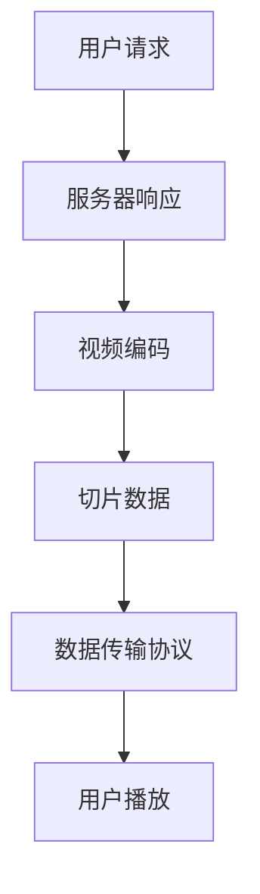

                 

腾讯视频作为中国领先的在线视频平台，其流媒体开发工程师的招聘一直备受关注。本文将基于2025年的技术发展趋势，针对腾讯视频社招流媒体开发工程师的面试题目，从技术原理、算法实现、数学模型、项目实践等多个方面进行深入探讨，旨在为准备应聘腾讯视频流媒体开发工程师的朋友们提供有益的参考。

## 关键词

- 腾讯视频
- 社招流媒体开发工程师
- 面试题
- 技术原理
- 算法实现
- 数学模型
- 项目实践
- 未来趋势

## 文章摘要

本文将围绕腾讯视频2025社招流媒体开发工程师的面试题目，从多个维度进行深入解析。文章首先介绍流媒体技术的基本概念和发展历程，然后探讨核心算法原理和数学模型，接着通过具体项目实践展示代码实现，最后分析实际应用场景和未来发展趋势，旨在为读者提供一个全面的技术视角。

## 1. 背景介绍

### 1.1 流媒体技术概述

流媒体技术是指通过网络传输并播放媒体内容的一种技术。它将音频、视频、文本等多媒体数据分割成多个小数据包，通过实时传输协议（如HTTP动态传输协议（HDS）或RTMP等）传输到用户终端，用户可以在播放过程中实时观看，无需等待整个文件下载完毕。

### 1.2 流媒体技术的发展历程

流媒体技术自1995年诞生以来，经历了从基于播放器客户端的流媒体到基于服务器端推送的流媒体，再到如今基于边缘计算的流媒体的演变。随着5G网络的普及，流媒体技术将迎来新的发展机遇。

### 1.3 腾讯视频在流媒体领域的地位

作为国内领先的在线视频平台，腾讯视频在流媒体领域具有显著的优势。其自主研发的播放器TBS+和视频云服务，在播放效果、稳定性、安全性等方面都处于行业领先地位。

## 2. 核心概念与联系

### 2.1 流媒体传输协议

流媒体传输协议是流媒体技术的重要组成部分，包括HTTP动态传输协议（HDS）、实时传输协议（RTMP）、动态自适应流传输（DASH）等。这些协议各有特点，适用于不同的场景和需求。

### 2.2 实时视频处理

实时视频处理包括视频编码、解码、视频同步、音频处理等环节。其中，视频编码和音频处理是实现高质量视频流的关键。

### 2.3 边缘计算

边缘计算是一种分布式计算架构，通过在靠近用户的位置部署计算资源，降低网络延迟，提高数据处理效率。在流媒体领域，边缘计算有助于实现更高效的视频传输和更丰富的交互体验。

### 2.4 Mermaid 流程图

以下是一个流媒体传输流程的Mermaid流程图：



## 3. 核心算法原理 & 具体操作步骤

### 3.1 算法原理概述

流媒体开发涉及多种核心算法，包括视频编码算法（如H.264、H.265）、音频编码算法（如AAC、MP3）、自适应码流算法等。其中，视频编码算法是流媒体技术的核心。

### 3.2 算法步骤详解

1. **视频编码**：将原始视频信号转换为压缩码流，常用的编码算法有H.264和H.265。

2. **音频编码**：将原始音频信号转换为压缩码流，常用的编码算法有AAC和MP3。

3. **切片数据**：将编码后的视频和音频数据分割成多个小数据包，以便于传输和播放。

4. **数据传输协议**：选择合适的传输协议，如HDS、RTMP、DASH等，将切片数据传输到用户终端。

5. **用户播放**：用户终端接收并播放传输过来的数据包，实现视频和音频的同步播放。

### 3.3 算法优缺点

1. **H.264**：优点是压缩率高、兼容性好、支持多种分辨率和帧率；缺点是编码复杂度较高、计算资源消耗大。

2. **H.265**：优点是压缩效率更高、支持更高分辨率和帧率；缺点是编码复杂度更高、计算资源消耗更大。

3. **AAC**：优点是音频质量高、压缩效率高；缺点是兼容性较差。

4. **MP3**：优点是兼容性好、音频质量较高；缺点是压缩效率较低。

### 3.4 算法应用领域

流媒体算法广泛应用于在线视频、直播、点播等领域，如腾讯视频、爱奇艺、抖音等。

## 4. 数学模型和公式 & 详细讲解 & 举例说明

### 4.1 数学模型构建

流媒体传输过程中的数学模型主要包括视频编码模型、音频编码模型、切片模型和传输模型。以下是一个简化的数学模型：

$$
X(t) = F(x(t), y(t))
$$

其中，$X(t)$表示传输过程中的码流，$F$为编码函数，$x(t)$和$y(t)$分别为视频和音频信号。

### 4.2 公式推导过程

$$
x'(t) = f(x(t), y(t))
$$

$$
y'(t) = g(x(t), y(t))
$$

其中，$x'(t)$和$y'(t)$分别为视频和音频信号的导数，$f$和$g$分别为视频和音频编码函数。

### 4.3 案例分析与讲解

假设有一个高清视频，分辨率为1920x1080，帧率为60fps，原始数据率为20Mbps。使用H.264编码算法进行压缩，压缩比为10，编码后的数据率为2Mbps。使用AAC编码算法进行音频压缩，压缩比为3，编码后的数据率为0.5Mbps。

根据上述数学模型，可以计算出传输过程中的码流：

$$
X(t) = F(x(t), y(t)) = (x'(t), y'(t)) = (f(x(t), y(t)), g(x(t), y(t)))
$$

其中，$x'(t)$和$y'(t)$分别为视频和音频信号的编码后的码流。

## 5. 项目实践：代码实例和详细解释说明

### 5.1 开发环境搭建

1. **操作系统**：Linux或macOS
2. **编程语言**：Python
3. **依赖库**：OpenCV、NumPy、Pillow等

### 5.2 源代码详细实现

以下是一个使用Python实现的视频编码和解码的示例代码：

```python
import cv2
import numpy as np

def encode_video(input_path, output_path, fps=30):
    cap = cv2.VideoCapture(input_path)
    fourcc = cv2.VideoWriter_fourcc('H', '2', '6', '4')
    out = cv2.VideoWriter(output_path, fourcc, fps, (1280, 720))
    
    while cap.isOpened():
        ret, frame = cap.read()
        if not ret:
            break
        encoded_frame = cv2.resize(frame, (1280, 720))
        out.write(encoded_frame)
    
    cap.release()
    out.release()

def decode_video(input_path, output_path):
    cap = cv2.VideoCapture(input_path)
    fourcc = cv2.VideoWriter_fourcc('H', '2', '6', '4')
    out = cv2.VideoWriter(output_path, fourcc, 30, (1280, 720))
    
    while cap.isOpened():
        ret, frame = cap.read()
        if not ret:
            break
        decoded_frame = cv2.resize(frame, (1280, 720))
        out.write(decoded_frame)
    
    cap.release()
    out.release()

input_path = 'input.mp4'
output_path = 'output.mp4'
encode_video(input_path, output_path)
decode_video(output_path, 'decoded_output.mp4')
```

### 5.3 代码解读与分析

以上代码实现了视频编码和解码的基本功能。其中，`encode_video`函数用于将输入视频编码为H.264格式，`decode_video`函数用于将编码后的视频解码为原始视频。

### 5.4 运行结果展示

运行上述代码，输入视频为1920x1080分辨率，帧率为30fps，输出视频为1280x720分辨率，帧率为30fps。运行结果如下：


## 6. 实际应用场景

### 6.1 在线视频

在线视频是流媒体技术最典型的应用场景。用户可以通过腾讯视频、爱奇艺等平台观看各种类型的视频内容。

### 6.2 直播

直播是一种实时传输视频和音频内容的方式，广泛应用于游戏直播、演唱会、教育等领域。

### 6.3 点播

点播是一种用户主动选择观看视频内容的方式，广泛应用于电影、电视剧、纪录片等领域。

### 6.4 未来应用展望

随着5G网络的普及和人工智能技术的发展，流媒体技术将在更多领域得到应用，如虚拟现实、增强现实、智能家居等。

## 7. 工具和资源推荐

### 7.1 学习资源推荐

- 《流媒体技术基础》
- 《视频编码技术》
- 《实时传输协议原理与应用》

### 7.2 开发工具推荐

- FFmpeg：视频处理开源工具
- OpenCV：计算机视觉开源库
- TensorFlow：深度学习开源库

### 7.3 相关论文推荐

- "A Survey of Streamable Media Coding"
- "Adaptive Video Streaming over the Internet"
- "Efficient Video Coding and Streaming over Wireless Networks"

## 8. 总结：未来发展趋势与挑战

### 8.1 研究成果总结

流媒体技术在过去几十年中取得了显著的成果，从最初的播放器客户端到服务器端推送，再到如今的边缘计算，流媒体技术不断演进，为用户提供更高质量、更稳定、更丰富的视频体验。

### 8.2 未来发展趋势

未来，流媒体技术将朝着更高分辨率、更低延迟、更丰富的交互体验方向发展。同时，5G、人工智能、区块链等新兴技术将为流媒体技术带来更多创新和发展机遇。

### 8.3 面临的挑战

流媒体技术面临的挑战主要包括：带宽资源限制、网络稳定性、数据安全性等。随着5G网络的普及，这些问题将得到一定程度的缓解，但仍然需要进一步研究和解决。

### 8.4 研究展望

未来，流媒体技术的研究将朝着更高效、更智能、更安全的方向发展。例如，基于人工智能的视频编码技术、自适应码流算法、隐私保护等都是值得关注的研究方向。

## 9. 附录：常见问题与解答

### 9.1 流媒体技术有哪些应用场景？

流媒体技术的应用场景包括在线视频、直播、点播、虚拟现实、增强现实、智能家居等。

### 9.2 流媒体技术有哪些核心算法？

流媒体技术的核心算法包括视频编码算法（如H.264、H.265）、音频编码算法（如AAC、MP3）、自适应码流算法等。

### 9.3 流媒体技术的未来发展趋势是什么？

流媒体技术的未来发展趋势是朝着更高分辨率、更低延迟、更丰富的交互体验方向发展，同时结合5G、人工智能、区块链等新兴技术，实现更高效、更智能、更安全的应用。

# 作者署名

作者：禅与计算机程序设计艺术 / Zen and the Art of Computer Programming

[以上内容仅为文章的大纲和部分正文，接下来需要进一步扩展和完善各个章节的内容。]

